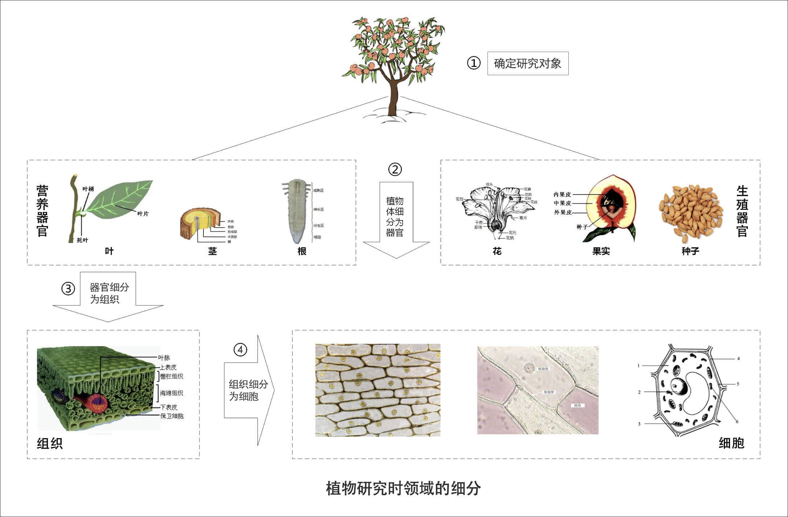

# 02 | 领域、子域、核心域、通用域和支撑域：傻傻分不清？
你好，我是欧创新。

DDD的知识体系提出了很多的名词，像：领域、子域、核心域、通用域、支撑域、限界上下文、聚合、聚合根、实体、值对象等等，非常多。这些名词，都是关键概念，但它们实在有些晦涩难懂，可能导致你还没开始实践DDD就打起了退堂鼓。因此，在基础篇中，我希望能带着你一起做好实践前的准备工作。

除此之外，我想说的是，这些名词在你的微服务设计和开发过程中不一定都用得上，但它可以帮你理解DDD的核心设计思想和理念。而这些思想和理念，在IT战略设计、业务建模和微服务设计中都是可以借鉴的。

那么，从这讲开始，我就会围绕以上这些DDD关键概念进行讲解，帮助你彻底理清它们与微服务的关系，了解它们在微服务设计中的作用。今天我们重点了解DDD的领域、子域、核心域、通用域和支撑域等重要概念。

## 如何理解领域和子域？

我们先看一下汉语词典中对领域的解释：“领域是从事一种专门活动或事业的 **范围**、部类或部门。”百度百科对领域的解释：“领域具体指一种特定的 **范围** 或区域。”

两个解释有一个共同点——范围。对了！领域就是用来确定范围的，范围即边界，这也是DDD在设计中不断强调边界的原因。

在研究和解决业务问题时，DDD会按照一定的规则将业务领域进行细分，当领域细分到一定的程度后，DDD会将问题范围限定在特定的边界内，在这个边界内建立领域模型，进而用代码实现该领域模型，解决相应的业务问题。简言之，DDD的领域就是这个边界内要解决的业务问题域。

既然领域是用来限定业务边界和范围的，那么就会有大小之分，领域越大，业务范围就越大，反之则相反。

领域可以进一步划分为子领域。我们把划分出来的多个子领域称为子域，每个子域对应一个更小的问题域或更小的业务范围。

我们知道，DDD是一种处理高度复杂领域的设计思想，它试图分离技术实现的复杂度。那么面对错综复杂的业务领域，DDD是如何使业务从复杂变得简单，更容易让人理解，技术实现更容易呢？

其实很好理解，DDD的研究方法与自然科学的研究方法类似。当人们在自然科学研究中遇到复杂问题时，通常的做法就是将问题一步一步地细分，再针对细分出来的问题域，逐个深入研究，探索和建立所有子域的知识体系。当所有问题子域完成研究时，我们就建立了全部领域的完整知识体系了。

我们来看一下上面这张图。这个例子是在讲如何给桃树建立一个完整的生物学知识体系。初中生物课其实早就告诉我们研究方法了。 **它的研究过程是这样的。**

第一步：确定研究对象，即研究领域，这里是一棵桃树。

第二步：对研究对象进行细分，将桃树细分为器官，器官又分为营养器官和生殖器官两种。其中营养器官包括根、茎和叶，生殖器官包括花、果实和种子。桃树的知识体系是我们已经确定要研究的问题域，对应DDD的领域。根、茎、叶、花、果实和种子等器官则是细分后的问题子域。这个过程就是DDD将领域细分为多个子域的过程。

第三步：对器官进行细分，将器官细分为组织。比如，叶子器官可细分为保护组织、营养组织和输导组织等。这个过程就是DDD将子域进一步细分为多个子域的过程。

第四步：对组织进行细分，将组织细分为细胞，细胞成为我们研究的最小单元。细胞之间的细胞壁确定了单元的边界，也确定了研究的最小边界。

这里先剧透一点聚合、聚合根、实体以及值对象的内容，我还会在 \[第04讲\] 和 \[第05讲\] 中详细讲解。

我们知道细胞核、线粒体、细胞膜等物质共同构成细胞，这些物质一起协作让细胞具有这类细胞特定的生物功能。在这里你可以把细胞理解为DDD的聚合，细胞内的这些物质就可以理解为聚合里面的聚合根、实体以及值对象等，在聚合内这些实体一起协作完成特定的业务功能。这个过程类似DDD设计时，确定微服务内功能要素和边界的过程。

这里总结一下，就是说每一个细分的领域都会有一个知识体系，也就是DDD的领域模型。在所有子域的研究完成后，我们就建立了全域的知识体系了，也就建立了全域的领域模型。

上面我们用自然科学研究的方法，说明了领域可以通过细分为子域的方法，来降低研究的复杂度。现在我们把这个话题再切换到业务领域，对比验证下，二者的细分过程是否是一致的。这里以我从事的保险行业为例。

保险是个比较大的领域，很早以前的保险核心系统把所有的功能都放在一个系统里来实现，这个系统就是我们常说的单体系统。后来单体系统开始无法适应保险业务的发展，因此保险公司开始了中台转型，引入分布式微服务架构来替换原来的单体系统。而分布式微服务架构就需要划分业务领域边界，建立领域模型，并实现微服务落地了。

为实现保险领域建模和微服务建设，我们可以根据业务关联度以及流程边界将保险领域细分为：承保、收付、再保以及理赔等子域，而承保子域还可以继续细分为投保、保全（寿险）、批改（财险）等子子域。

在投保这个限界上下文内可以建立投保的领域模型，投保的领域模型最后映射到系统就是投保微服务。这就是一个保险领域的细分和微服务的建设过程。

那么你可能会说，我不是保险行业的人，我怎么理解这个过程呢？我认为，不同行业的业务模型可能会不一样，但领域建模和微服务建设的过程和方法基本类似，其核心思想就是将问题域逐步分解，降低业务理解和系统实现的复杂度。

## 如何理解核心域、通用域和支撑域？

在领域不断划分的过程中，领域会细分为不同的子域，子域可以根据自身重要性和功能属性划分为三类子域，它们分别是：核心域、通用域和支撑域。

决定产品和公司核心竞争力的子域是核心域，它是业务成功的主要因素和公司的核心竞争力。没有太多个性化的诉求，同时被多个子域使用的通用功能子域是通用域。还有一种功能子域是必需的，但既不包含决定产品和公司核心竞争力的功能，也不包含通用功能的子域，它就是支撑域。

这三类子域相较之下，核心域是最重要的，我们下面讲目的的时候还会以核心域为例详细介绍。通用域和支撑域如果对应到企业系统，举例来说的话，通用域则是你需要用到的通用系统，比如认证、权限等等，这类应用很容易买到，没有企业特点限制，不需要做太多的定制化。而支撑域则具有企业特性，但不具有通用性，例如数据代码类的数据字典等系统。

**那为什么要划分核心域、通用域和支撑域，主要目的是什么呢？**

还是拿上图的桃树来说吧。我们将桃树细分为了根、茎、叶、花、果实和种子等六个子域，那桃树是否有核心域？有的话，到底哪个是核心域呢？

不同的人对桃树的理解是不同的。如果这棵桃树生长在公园里，在园丁的眼里，他喜欢的是“人面桃花相映红”的阳春三月，这时花就是桃树的核心域。但如果这棵桃树生长在果园里，对果农来说，他则是希望在丰收的季节收获硕果累累的桃子，这时果实就是桃树的核心域。

在不同的场景下，不同的人对桃树核心域的理解是不同的，因此对桃树的处理方式也会不一样。园丁更关注桃树花期的营养，而果农则更关注桃树落果期的营养，有时为了保证果实的营养供给，还会裁剪掉疯长的茎和叶（通用域或支撑域）。

同样的道理，公司在IT系统建设过程中，由于预算和资源有限，对不同类型的子域应有不同的关注度和资源投入策略，记住好钢要用在刀刃上。

很多公司的业务，表面看上去相似，但商业模式和战略方向是存在很大差异的，因此公司的关注点会不一样，在划分核心域、通用域和支撑域时，其结果也会出现非常大的差异。

比如同样都是电商平台的淘宝、天猫、京东和苏宁易购，他们的商业模式是不同的。淘宝是C2C网站，个人卖家对个人买家，而天猫、京东和苏宁易购则是B2C网站，是公司卖家对个人买家。即便是苏宁易购与京东都是B2C的模式，他们的商业模式也是不一样的，苏宁易购是典型的传统线下卖场转型成为电商，京东则是直营加部分平台模式。

商业模式的不同会导致核心域划分结果的不同。有的公司核心域可能在客户服务，有的可能在产品质量，有的可能在物流。在公司领域细分、建立领域模型和系统建设时，我们就要结合公司战略重点和商业模式，找到核心域了，且重点关注核心域。

如果你的公司刚好有意向转型微服务架构的话，我建议你和你的技术团队要将核心域的建设排在首位，最好是有绝对的掌控能力和自主研发能力，如果资源实在有限的话，可以在支撑域或者通用域上想想办法，暂时采用外购的方式也未尝不可。

## 总结

领域的核心思想就是将问题域逐级细分，来降低业务理解和系统实现的复杂度。通过领域细分，逐步缩小微服务需要解决的问题域，构建合适的领域模型，而领域模型映射成系统就是微服务了。

核心域、支撑域和通用域的主要目标是：通过领域划分，区分不同子域在公司内的不同功能属性和重要性，从而公司可对不同子域采取不同的资源投入和建设策略，其关注度也会不一样。

## 思考题

请结合你所在公司的业务情况，尝试给业务做一个领域拆分，看看哪些子域是核心域，哪些子域是通用域和支撑域？

欢迎留言和我分享你的思考和疑惑，你也可以把今天所学分享给身边的朋友，邀请他加入探讨，共同进步。