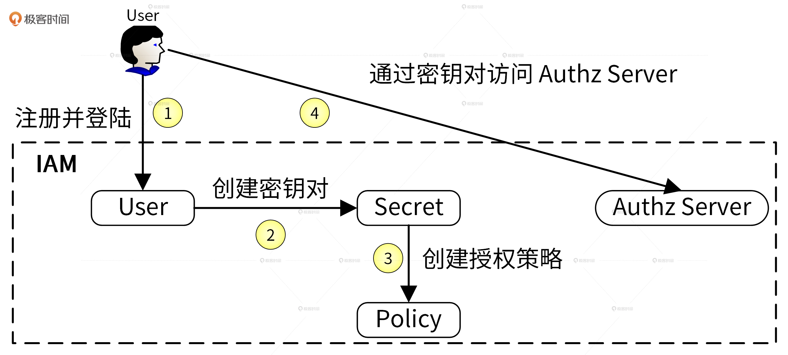
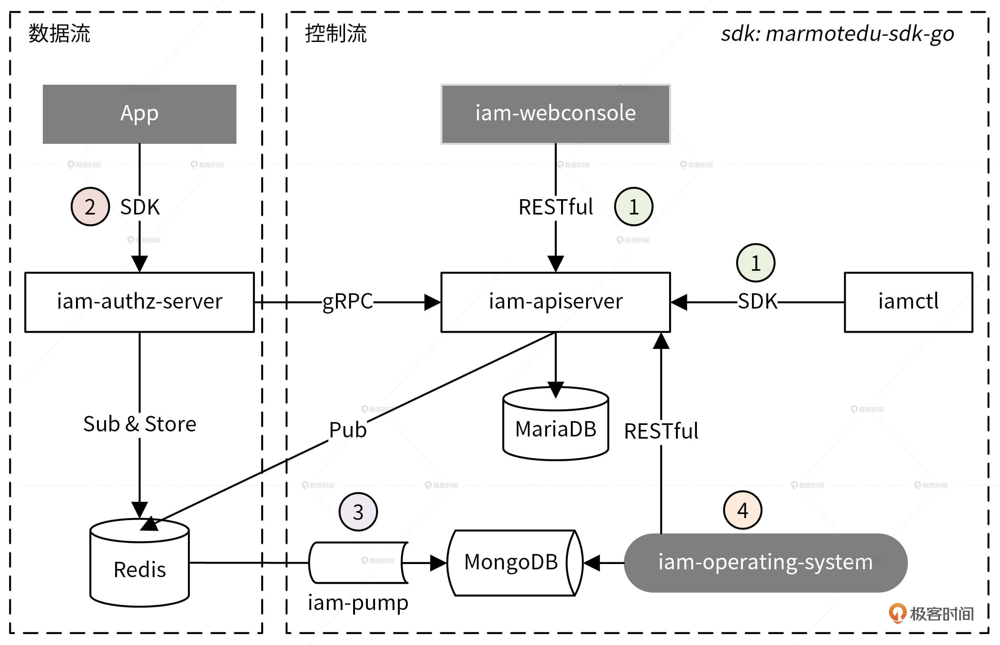
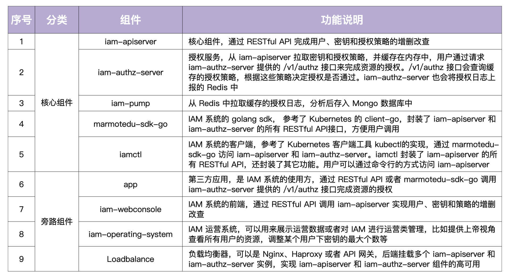
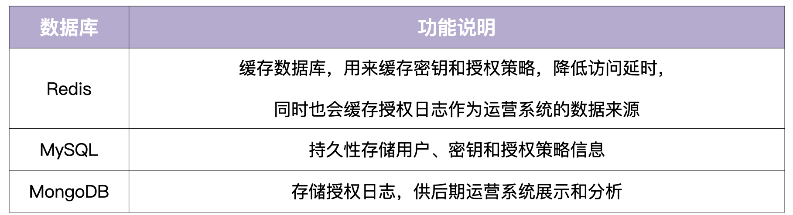
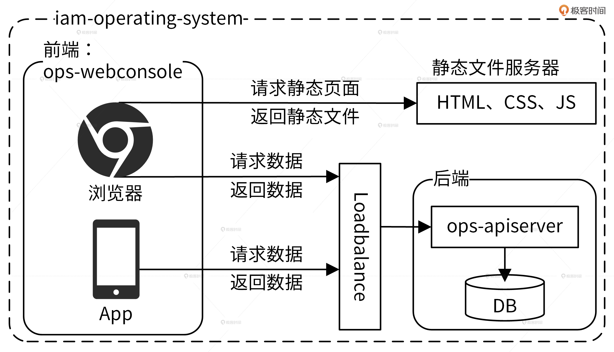
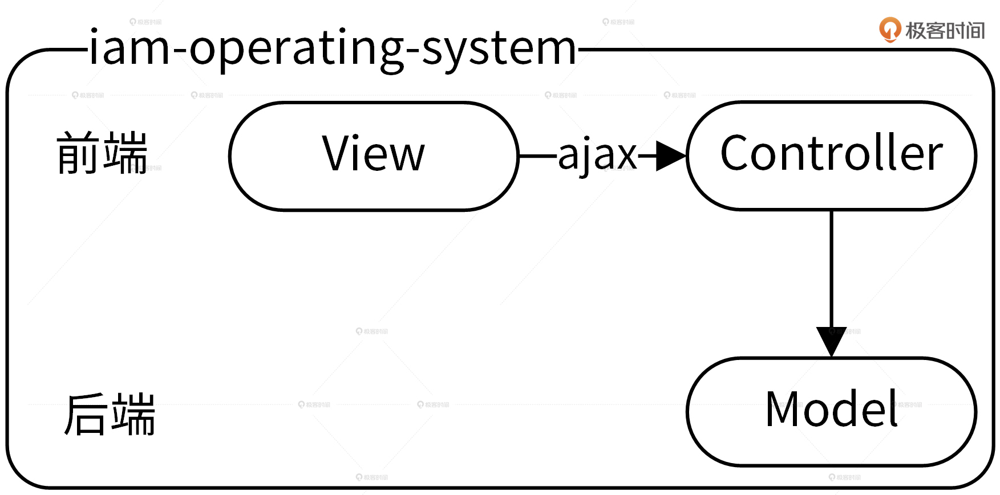

# 01 | IAM系统概述：我们要实现什么样的 Go 项目？
你好，我是孔令飞。从今天开始我们进入课前准备阶段，我会用3讲的时间给你讲清楚，我们要实现的实战项目 IAM 应用长啥样、它能干什么，以及怎么把它部署到 Linux 服务器上。先和我一起扫除基础的障碍，你就能够更轻松地学习后面的课程了。

今天这一讲，我先来说说为什么选择 IAM 应用，它能实现什么功能，以及它的架构和使用流程。

## 项目背景：为什么选择 IAM 系统作为实战项目？

我们在做 Go 项目开发时，绕不开的一个话题是安全，如何保证 Go 应用的安全，是每个开发者都要解决的问题。虽然 Go 应用的安全包含很多方面，但大体可分为如下 2 类：

- **服务自身的安全**：为了保证服务的安全，需要禁止非法用户访问服务。这可以通过服务器层面和软件层面来解决。服务器层面可以通过物理隔离、网络隔离、防火墙等技术从底层保证服务的安全性，软件层面可以通过 HTTPS、用户认证等手段来加强服务的安全性。服务器层面一般由运维团队来保障，软件层面则需要开发者来保障。
- **服务资源的安全**：服务内有很多资源，为了避免非法访问，开发者要避免 UserA 访问到 UserB 的资源，也即需要对资源进行授权。通常，我们可以通过资源授权系统来对资源进行授权。

**总的来说，为了保障Go应用的安全，我们需要对访问进行认证，对资源进行授权**。那么，我们要如何实现访问认证和资源授权呢？

认证功能不复杂，我们可以通过 JWT （JSON Web Token）认证来实现。授权功能比较复杂，授权功能的复杂性使得它可以囊括很多 Go 开发技能点。因此，在这个专栏中，我将认证和授权的功能实现升级为 IAM 系统，通过讲解它的构建过程，给你讲清楚 Go 项目开发的全部流程。

## IAM 系统是什么？

IAM（Identity and Access Management，身份识别与访问管理）系统是用 Go 语言编写的一个 Web 服务，用于给第三方用户提供访问控制服务。

IAM 系统可以帮用户解决的问题是： **在特定的条件下，谁能够/不能够对哪些资源做哪些操作**（ **Who** is **able** to do **what** on **something** given some **context**），也即完成资源授权功能。

> 提示：以后我们在提到 IAM 系统或者 IAM 时都是指代 IAM 应用。

那么，IAM 系统是如何进行资源授权的呢？下面，我们通过 IAM 系统的资源授权的流程，来看下它是如何工作的，整个过程可以分为 4 步。

1. 用户需要提供昵称、密码、邮箱、电话等信息注册并登录到 IAM 系统，这里是以用户名和密码作为唯一的身份标识来访问 IAM 系统，并且完成认证。
2. 因为访问 IAM 的资源授权接口是通过密钥（secretID/secretKey）的方式进行认证的，所以用户需要在 IAM 中创建属于自己的密钥资源。
3. 因为 IAM 通过授权策略完成授权，所以用户需要在 IAM 中创建授权策略。
4. 请求 IAM 提供的授权接口，IAM 会根据用户的请求内容和授权策略来决定一个授权请求是否被允许。

我们可以看到，在上面的流程中，IAM 使用到了 3 种系统资源：用户（User）、密钥（Secret）和策略（Policy），它们映射到程序设计中就是 3 种 RESTful 资源：

- 用户（User）：实现对用户的增、删、改、查、修改密码、批量修改等操作。
- 密钥（Secret）：实现对密钥的增、删、改、查操作。
- 策略（Policy）：实现对策略的增、删、改、查、批量删除操作。

## IAM 系统的架构长啥样？

知道了 IAM 的功能之后，我们再来详细说说 IAM 系统的架构，架构图如下：

总的来说，IAM 架构中包括 9 大组件和 3 大数据库。我将这些组件和功能都总结在下面的表格中。这里面，我们主要记住5个核心组件，包括iam-apiserver、iam-authz-server、iam-pump、marmotedu-sdk-go和iamctl的功能，还有3个数据库Redis、MySQL和MongoDB的功能。

此外，IAM 系统为存储数据使用到的 3 种数据库的说明如下所示。

### 通过使用流程理解架构

只看到这样的系统架构图和核心功能讲解，你可能还不清楚整个系统是如何协作，来最终完成资源授权的。所以接下来，我们通过详细讲解 IAM 系统的使用流程及其实现细节，来进一步加深你对 IAM 架构的理解。总的来说，我们可以通过 4 步去使用 IAM 系统的核心功能。

**第1步，创建平台资源。**

用户通过 iam-webconsole（RESTful API）或 iamctl（sdk marmotedu-sdk-go）客户端请求 iam-apiserver 提供的 RESTful API 接口完成用户、密钥、授权策略的增删改查，iam-apiserver 会将这些资源数据持久化存储在 MySQL 数据库中。而且，为了确保通信安全，客户端访问服务端都是通过 HTTPS 协议来访问的。

**第2步，请求 API 完成资源授权。**

用户可以通过请求 iam-authz-server 提供的 /v1/authz 接口进行资源授权，请求 /v1/authz 接口需要通过密钥认证，认证通过后 /v1/authz 接口会查询授权策略，从而决定资源请求是否被允许。

为了提高 /v1/authz 接口的性能，iam-authz-server 将密钥和策略信息缓存在内存中，以便实现快速查询。那密钥和策略信息是如何实现缓存的呢？

首先，iam-authz-server 通过调用 iam-apiserver 提供的 gRPC 接口，将密钥和授权策略信息缓存到内存中。同时，为了使内存中的缓存信息和 iam-apiserver 中的信息保持一致，当 iam-apiserver 中有密钥或策略被更新时，iam-apiserver 会往特定的 Redis Channel（iam-authz-server 也会订阅该 Channel）中发送 PolicyChanged 和 SecretChanged 消息。这样一来，当 iam-authz-server 监听到有新消息时就会获取并解析消息，根据消息内容判断是否需要重新调用 gRPC 接来获取密钥和授权策略信息，再更新到内存中。

**第3步，授权日志数据分析。**

iam-authz-server 会将授权日志上报到 Redis 高速缓存中，然后 iam-pump 组件会异步消费这些授权日志，再把清理后的数据保存在 MongoDB 中，供运营系统 iam-operating-system 查询。

这里还有一点你要注意：iam-authz-server 将授权日志保存在 Redis 高性能 key-value 数据库中，可以最大化减少写入延时。不保存在内存中是因为授权日志量我们没法预测，当授权日志量很大时，很可能会将内存耗尽，造成服务中断。

**第4步，运营平台授权数据展示。**

iam-operating-system 是 IAM 的运营系统，它可以通过查询 MongoDB 获取并展示运营数据，比如某个用户的授权/失败次数、授权失败时的授权信息等。此外，我们也可以通过 iam-operating-system 调用 iam-apiserver 服务来做些运营管理工作。比如，以上帝视角查看某个用户的授权策略供排障使用，或者调整用户可创建密钥的最大个数，再或者通过白名单的方式，让某个用户不受密钥个数限制的影响等等。

### IAM 软件架构模式

在设计软件时，我们首先要做的就是选择一种软件架构模式，它对软件后续的开发方式、软件维护成本都有比较大的影响。因此，这里我也会和你简单聊聊 2 种最常用的软件架构模式，分别是前后端分离架构和 MVC 架构。

#### 前后端分离架构

因为IAM 系统采用的就是前后端分离的架构，所以我们就以 IAM 的运营系统 iam-operating-system 为例来详细说说这个架构。一般来说，运营系统的功能可多可少，对于一些具有复杂功能的运营系统，我们可以采用前后端分离的架构。其中， **前端负责页面的展示以及数据的加载和渲染，后端只负责返回前端需要的数据**。

iam-operating-system 前后端分离架构如下图所示。

采用了前后端分离架构之后，当你通过浏览器请求前端 ops-webconsole 时，ops-webconsole 会先请求静态文件服务器加载静态文件，比如 HTML、CSS 和 JavaScript，然后它会执行 JavaScript，通过负载均衡请求后端数据，最后把后端返回的数据渲染到前端页面中。

采用前后端分离的架构，让前后端通过 RESTful API 通信，会带来以下5点好处：

- 可以让前、后端人员各自专注在自己业务的功能开发上，让专业的人做专业的事，来提高代码质量和开发效率
- 前后端可并行开发和发布，这也能提高开发和发布效率，加快产品迭代速度
- 前后端组件、代码分开，职责分明，可以增加代码的维护性和可读性，减少代码改动引起的 Bug 概率，同时也能快速定位 Bug
- 前端 JavaScript 可以处理后台的数据，减少对后台服务器的压力
- 可根据需要选择性水平扩容前端或者后端来节约成本

#### MVC 架构

但是，如果运营系统功能比较少，采用前后端分离框架的弊反而大于利，比如前后端分离要同时维护 2 个组件会导致部署更复杂，并且前后端分离将人员也分开了，这会增加一定程度的沟通成本。同时，因为代码中也需要实现前后端交互的逻辑，所以会引入一定的开发量。

这个时候，我们可以尝试直接采用 MVC 软件架构，MVC 架构如下图所示。

MVC 的全名是 Model View Controller，它是一种架构模式，分为 Model、View、Controller 三层，每一层的功能如下：

- View（视图）：提供给用户的操作界面，用来处理数据的显示。
- Controller（控制器）：根据用户从 View 层输入的指令，选取 Model 层中的数据，然后对其进行相应的操作，产生最终结果。
- Model（模型）：应用程序中用于处理数据逻辑的部分。

**MVC 架构的好处是通过控制器层将视图层和模型层分离之后，当更改视图层代码后时，我们就不需要重新编译控制器层和模型层的代码了。** 同样，如果业务流程发生改变也只需要变更模型层的代码就可以。在实际开发中为了更好的 UI 效果，视图层需要经常变更，但是通过 MVC 架构，在变更视图层时，我们根本不需要对业务逻辑层的代码做任何变化，这不仅减少了风险还能提高代码变更和发布的效率。

除此之外，还有一种跟 MVC 比较相似的软件开发架构叫三层架构，它包括UI 层、BLL 层和DAL 层。其中，UI 层表示用户界面，BLL 层表示业务逻辑，DAL 层表示数据访问。在实际开发中很多人将 MVC 当成三层架构在用，比如说，很多人喜欢把软件的业务逻辑放在 Controller 层里，将数据库访问操作的代码放在 Model 层里，软件最终的代码放在 View 层里，就这样硬生生将 MVC 架构变成了伪三层架构。

这种代码不仅不伦不类，同时也失去了三层架构和 MVC 架构的核心优势，也就是： **通过 Controller层将 Model层和 View层解耦，从而使代码更容易维护和扩展**。因此在实际开发中，我们也要注意遵循 MVC 架构的开发规范，发挥 MVC 的核心价值。

## 总结

一个好的 Go 应用必须要保证应用的安全性，这可以通过认证和授权来保障。也因此认证和授权是开发一个 Go 项目必须要实现的功能。为了帮助你实现这 2 个功能，并借此机会学习 Go 项目开发，我将这 2 个功能升级为一个 IAM系统。通过讲解如何开发 IAM 系统，来教你如何开发 Go 项目。

因为后面的学习都是围绕 IAM 系统展开的，所以这一讲我们要重点掌握 IAM 的功能、架构和使用流程，我们可以通过 4 步使用流程来了解。

首先，用户通过调用 iam-apiserver 提供的 RESTful API 接口完成注册和登录系统，再调用接口创建密钥和授权策略。

创建完密钥对和授权策略之后，IAM 可以通过调用 iam-authz-server 的授权接口完成资源的授权。具体来说，iam-authz-server 通过 gRPC 接口获取 iam-apiserver 中存储的密钥和授权策略信息，通过 JWT 完成认证之后，再通过 [ory/ladon](https://github.com/ory/ladon) 包完成资源的授权。

接着，iam-pump 组件异步消费 Redis 中的数据，并持久化存储在 MongoDB 中，供 iam-operating-system 运营平台展示。

最后，IAM 相关的产品、研发人员可以通过 IAM 的运营系统 iam-operating-system 来查看 IAM 系统的使用情况，进行运营分析。例如某个用户的授权/失败次数、授权失败时的授权信息等。

另外，为了提高开发和访问效率，IAM 分别提供了 marmotedu-sdk-go SDK 和 iamctl 命令行工具，二者通过 HTTPS 协议访问 IAM 提供的 RESTful 接口。

## 课后练习

1. 你在做 Go 项目开发时经常用到哪些技能点？有些技能点是 IAM 没有包含的？
2. 在你所接触的项目中，哪些是前后端分离架构，哪些是 MVC 架构呢？你觉得项目采用的架构是否合理呢？

期待在留言区看到你的思考和分享，我们下一讲见！