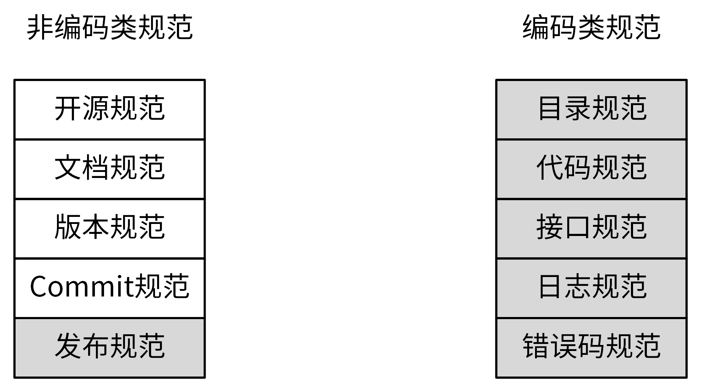
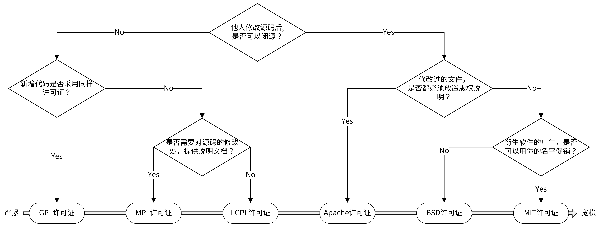
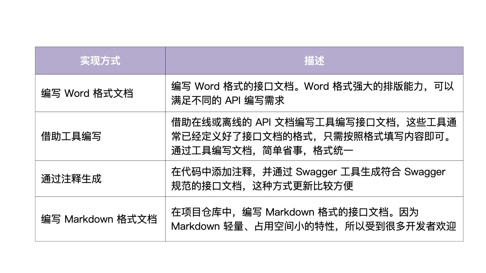
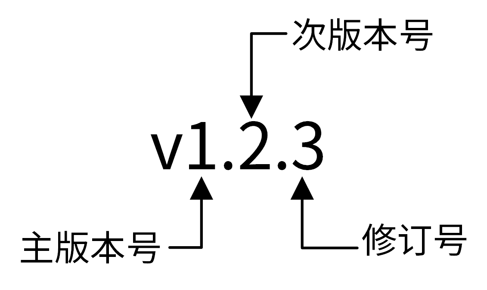
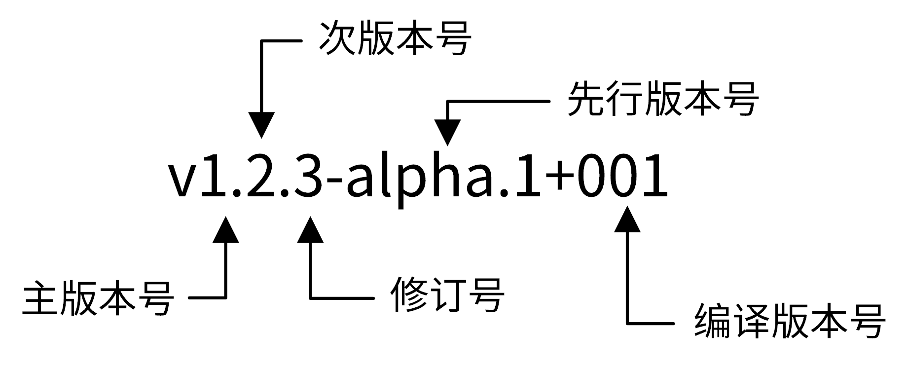

# 04 | 规范设计（上）：项目开发杂乱无章，如何规范？
你好，我是孔令飞。今天，我们来聊聊开发应用中需要用到的那些规范。

无规矩不成方圆，生活如此，软件开发也是如此。一个应用基本都是多人协作开发的，但不同人的开发习惯、方式都不同。如果没有一个统一的规范，就会造成非常多的问题，比如：

- **代码风格不一：** 代码仓库中有多种代码风格，读/改他人的代码都是一件痛苦的事情，整个代码库也会看起来很乱。
- **目录杂乱无章：** 相同的功能被放在不同的目录，或者一个目录你根本不知道它要完成什么功能，新开发的代码你也不知道放在哪个目录或文件。这些都会严重降低代码的可维护性。
- **接口不统一：** 对外提供的 API 接口不统一，例如修改用户接口为 `/v1/users/colin`，但是修改密钥接口为 `/v1/secret?name=secret0`，难以理解和记忆。
- **错误码不规范：** 错误码会直接暴露给用户，主要用于展示错误类型，以定位错误问题。错误码不规范会导致难以辨别错误类型，或者同类错误拥有不同错误码，增加理解难度。

因此，在设计阶段、编码之前，我们需要一个好的规范来约束开发者，以确保大家开发的是“ **一个应用”**。一个好的规范不仅可以提高软件质量，还可以提高软件的开发效率，降低维护成本，甚至能减少 Bug 数，也可以使你的开发体验如行云流水一般顺畅。所以，在编码之前，有必要花一些时间和团队成员一起讨论并制定规范。

那么，有哪些地方需要制定规范，这些规范又该如何制定呢？

## 有哪些地方需要制定规范？

一个 Go 项目会涉及很多方面，所以也会有多种规范，同类规范也会因为团队差异而有所不同。所以，在这门课中我只给你讲一些开发中常用的规范。为了便于你记忆，根据是否跟代码相关，我将它们分为非编码类规范和编码类规范：

- 非编码类规范，主要包括开源规范、文档规范、版本规范、Commit 规范和发布规范。
- 编码类规范，则主要包括目录规范、代码规范、接口规范、日志规范和错误码规范。

为了便于你记忆，我将这些规范整理成了下面一张图：



这一讲，我们先来说说开源规范、文档规范和版本规范，因为 Commit 规范比较多，我们放到下一讲。至于其他规范，会在后面内容中介绍。例如日志规范，因为和日志设计结合比较紧密，我会放在日志包设计中一起讲。

## 开源规范

首先，我们来介绍下开源规范。

其实业界并没有一个官方的开源规范，实际开发中，也很少有人提这个。那么，我们为什么一定要知道开源规范呢？

原因主要有两方面：一是，开源项目在代码质量、代码规范、文档等方面，要比非开源项目要求更高，在项目开发中按照开源项目的要求来规范自己的项目，可以更好地驱动项目质量的提高；二是，一些大公司为了不重复造轮子，会要求公司团队能够将自己的项目开源，所以提前按开源标准来驱动 Go 项目开发，也会为我们日后代码开源省去不少麻烦。

一个开源项目一定需要一个开源协议，开源协议规定了你在使用开源软件时的权利和责任，也就是规定了你可以做什么，不可以做什么。所以，开源规范的第一条规范就是选择一个合适的开源协议。那么有哪些开源协议，如何选择呢？接下来，我来详细介绍下。

### 开源协议概述

首先要说明的是，只有开源项目才会用到开源协议，如果你的项目不准备开源，就用不到开源协议。但先了解一下总是没错的，以后总能用得上。

业界有上百种开源协议，每种开源协议的要求不一样，有的协议对使用条件要求比较苛刻，有的则相对比较宽松。我们没必要全都记住，只需要知道经常使用的 6 种开源协议，也就是 GPL、MPL、LGPL、Apache、BSD 和 MIT 就可以了。至于它们的介绍，你可以参考 [开源协议介绍](https://github.com/marmotedu/geekbang-go/blob/master/%E5%BC%80%E6%BA%90%E5%8D%8F%E8%AE%AE%E4%BB%8B%E7%BB%8D.md) 。

那具体如何选择适合自己的开源协议呢？你可以参考乌克兰程序员 Paul Bagwell 画的这张图：



在上图中，右边的协议比左边的协议宽松，在选择时，你可以根据菱形框中的选择项从上到下进行选择。为了使你能够毫无负担地使用 IAM 项目提供的源码，我选择了最宽松的 MIT 协议。

另外，因为 Apache 是对商业应用友好的协议，使用者也可以在需要的时候修改代码来满足需要，并作为开源或商业产品发布/销售，所以大型公司的开源项目通常会采用 Apache 2.0 开源协议。

### 开源规范具有哪些特点？

那我们在参与开源项目，或者按照开源项目的要求来规范代码时，需要关注哪些方面的规范呢？

其实，在我看来，一切能让项目变得更优秀的规范，都应该属于开源规范。

开源项目的代码，除了要遵守上面所说的编码类规范和非编码类规范之外，还要遵守下面几个规范。

第一，开源项目，应该有一个高的单元覆盖率。这样，一方面可以确保第三方开发者在开发完代码之后，能够很方便地对整个项目做详细的单元测试，另一方面也能保证提交代码的质量。

第二，要确保整个代码库和提交记录中，不能出现内部 IP、内部域名、密码、密钥这类信息。否则，就会造成敏感信息外漏，可能会对我们的内部业务造成安全隐患。

第三，当我们的开源项目被别的开发者提交 pull request、issue、评论时，要及时处理，一方面可以确保项目不断被更新，另一方面也可以激发其他开发者贡献代码的积极性。

第四，好的开源项目，应该能够持续地更新功能，修复 Bug。对于一些已经结项、不维护的开源项目，需要及时地对项目进行归档，并在项目描述中加以说明。

在我看来，上面这些，是开源规范中比较重要的几点。如果你想了解详细的开源规范包括哪些内容，可以看我放在 GitHub 上的 [这份资料](https://github.com/marmotedu/geekbang-go/blob/master/%E5%BC%80%E6%BA%90%E8%A7%84%E8%8C%83%E8%AF%A6%E7%BB%86%E5%88%97%E8%A1%A8.md) 。

最后提醒你两件事：第一件，如果有条件，你可以宣传、运营开源项目，让更多的人知道、使用、贡献代码。比如，你可以在掘金、简书等平台发表文章，也可以创建 QQ、微信交流群等，都是不错的方式。第二件，如果你英文好、有时间，文档最好有中英文 2 份，优先使用英文，让来自全球的开发者都能了解、使用和参与你的项目。

## 文档规范

工作中我发现，很多开发者非常注重代码产出，但不注重文档产出。他们觉得，即使没有软件文档也没太大关系，不影响软件交付。我要说的是，这种看法是错误的！因为文档属于软件交付的一个重要组成部分，没有文档的项目很难理解、部署和使用。

因此，编写文档是一个必不可少的开发工作。那么一个项目需要编写哪些文档，又该如何编写呢？我认为项目中最需要的 3 类文档是 README文档、项目文档和 API 接口文档。

下面，我们一一来说它们的编写规范。

### README 规范

README文档是项目的门面，它是开发者学习项目时第一个阅读的文档，会放在项目的根目录下。因为它主要是用来介绍项目的功能、安装、部署和使用的，所以它是可以规范化的。

下面，我们直接通过一个 README模板，来看一下 README 规范中的内容：

```
# 项目名称

<!-- 写一段简短的话描述项目 -->

## 功能特性

<!-- 描述该项目的核心功能点 -->

## 软件架构(可选)

<!-- 可以描述下项目的架构 -->

## 快速开始

### 依赖检查

<!-- 描述该项目的依赖，比如依赖的包、工具或者其他任何依赖项 -->

### 构建

<!-- 描述如何构建该项目 -->

### 运行

<!-- 描述如何运行该项目 -->

## 使用指南

<!-- 描述如何使用该项目 -->

## 如何贡献

<!-- 告诉其他开发者如果给该项目贡献源码 -->

## 社区(可选)

<!-- 如果有需要可以介绍一些社区相关的内容 -->

## 关于作者

<!-- 这里写上项目作者 -->

## 谁在用(可选)

<!-- 可以列出使用本项目的其他有影响力的项目，算是给项目打个广告吧 -->

## 许可证

<!-- 这里链接上该项目的开源许可证 -->

```

更具体的示例，你可以参考 IAM 系统的 [README.md 文件](https://raw.githubusercontent.com/marmotedu/iam/master/README.md) 。

这里，有个在线的README生成工具，你也可以参考下：readme.so。

### 项目文档规范

项目文档包括一切需要文档化的内容，它们通常集中放在/docs 目录下。当我们在创建团队的项目文档时，通常会预先规划并创建好一些目录，用来存放不同的文档。因此，在开始 Go 项目开发之前，我们也要制定一个软件文档规范。好的文档规范有 2 个优点：易读和可以快速定位文档。

不同项目有不同的文档需求，在制定文档规范时，你可以考虑包含两类文档。

- 开发文档：用来说明项目的开发流程，比如如何搭建开发环境、构建二进制文件、测试、部署等。
- 用户文档：软件的使用文档，对象一般是软件的使用者，内容可根据需要添加。比如，可以包括 API 文档、SDK 文档、安装文档、功能介绍文档、最佳实践、操作指南、常见问题等。

为了方便全球开发者和用户使用，开发文档和用户文档，可以预先规划好英文和中文 2 个版本。

为了加深你的理解，这里我们来看下实战项目的文档目录结构：

```
docs
├── devel                            # 开发文档，可以提前规划好，英文版文档和中文版文档
│   ├── en-US/                       # 英文版文档，可以根据需要组织文件结构
│   └── zh-CN                        # 中文版文档，可以根据需要组织文件结构
│       └── development.md           # 开发手册，可以说明如何编译、构建、运行项目
├── guide                            # 用户文档
│   ├── en-US/                       # 英文版文档，可以根据需要组织文件结构
│   └── zh-CN                        # 中文版文档，可以根据需要组织文件结构
│       ├── api/                     # API文档
│       ├── best-practice            # 最佳实践，存放一些比较重要的实践文章
│       │   └── authorization.md
│       ├── faq                      # 常见问题
│       │   ├── iam-apiserver
│       │   └── installation
│       ├── installation             # 安装文档
│       │   └── installation.md
│       ├── introduction/            # 产品介绍文档
│       ├── operation-guide          # 操作指南，里面可以根据RESTful资源再划分为更细的子目录，用来存放系统核心/全部功能的操作手册
│       │   ├── policy.md
│       │   ├── secret.md
│       │   └── user.md
│       ├── quickstart               # 快速入门
│       │   └── quickstart.md
│       ├── README.md                # 用户文档入口文件
│       └── sdk                      # SDK文档
│           └── golang.md
└── images                           # 图片存放目录
    └── 部署架构v1.png

```

### API 接口文档规范

接口文档又称为 API 文档，一般由后台开发人员编写，用来描述组件提供的 API 接口，以及如何调用这些 API 接口。

在项目初期，接口文档可以解耦前后端，让前后端并行开发：前端只需要按照接口文档实现调用逻辑，后端只需要按照接口文档提供功能。

当前后端都开发完成之后，我们就可以直接进行联调，提高开发效率。在项目后期，接口文档可以提供给使用者，不仅可以降低组件的使用门槛，还能够减少沟通成本。

显然，一个有固定格式、结构清晰、内容完善的接口文档，就非常重要了。那么我们该如何编写接口文档，它又有什么规范呢？

接口文档有四种编写方式，包括编写 Word 格式文档、借助工具编写、通过注释生成和编写 Markdown 格式文档。具体的实现方式见下表：



其中，通过注释生成和编写 Markdown 格式文档这 2 种方式用得最多。在这个专栏，我采用编写 Markdown 格式文档的方式，原因如下：

- 相比通过注释生成的方式，编写 Markdown 格式的接口文档，能表达更丰富的内容和格式，不需要在代码中添加大量注释。
- 相比 Word 格式的文档，Markdown 格式文档占用的空间更小，能够跟随代码仓库一起发布，方便 API 文档的分发和查找。
- 相比在线 API 文档编写工具，Markdown 格式的文档免去了第三方平台依赖和网络的限制。

API 接口文档又要遵循哪些规范呢？其实，一个规范的 API 接口文档，通常需要包含一个完整的 API 接口介绍文档、API 接口变更历史文档、通用说明、数据结构说明、错误码描述和 API 接口使用文档。API 接口使用文档中需要包含接口描述、请求方法、请求参数、输出参数和请求示例。

当然，根据不同的项目需求，API 接口文档会有不同的格式和内容。我以这门课的实战项目采用的 API 接口文档规范为例，和你解释下。

接口文档拆分为以下几个 Markdown 文件，并存放在目录 [docs/guide/zh-CN/api](https://github.com/marmotedu/iam/tree/v1.0.0/docs/guide/zh-CN/api) 中：

- [README.md](https://github.com/marmotedu/iam/blob/master/docs/guide/zh-CN/api/README.md) ：API 接口介绍文档，会分类介绍 IAM 支持的 API 接口，并会存放相关 API 接口文档的链接，方便开发者查看。
- [CHANGELOG.md](https://github.com/marmotedu/iam/blob/master/docs/guide/zh-CN/api/CHANGELOG.md) ：API 接口文档变更历史，方便进行历史回溯，也可以使调用者决定是否进行功能更新和版本更新。
- [generic.md](https://github.com/marmotedu/iam/blob/master/docs/guide/zh-CN/api/generic.md) ：用来说明通用的请求参数、返回参数、认证方法和请求方法等。
- [struct.md](https://github.com/marmotedu/iam/blob/master/docs/guide/zh-CN/api/struct.md) ：用来列出接口文档中使用的数据结构。这些数据结构可能被多个 API 接口使用，会在 user.md、secret.md、policy.md 文件中被引用。
- [user.md](https://github.com/marmotedu/iam/blob/master/docs/guide/zh-CN/api/user.md) 、 [secret.md](https://github.com/marmotedu/iam/blob/master/docs/guide/zh-CN/api/secret.md) 、 [policy.md](https://github.com/marmotedu/iam/blob/master/docs/guide/zh-CN/api/policy.md) ：API 接口文档，相同 REST 资源的接口会存放在一个文件中，以 REST 资源名命名文档名。
- [error\_code.md](https://github.com/marmotedu/iam/blob/master/docs/guide/zh-CN/api/error_code_generated.md) ：错误码描述，通过程序自动生成。

这里我拿 user.md 接口文档为例，和你解释下接口文档是如何写的。 `user.md` 文件记录了用户相关的接口，每个接口按顺序排列，包含如下 5 部分。

- 接口描述：描述接口实现了什么功能。
- 请求方法：接口的请求方法，格式为 `HTTP 方法 请求路径`，例如 `POST /v1/users`。在 **通用说明** 中的 **请求方法** 部分，会说明接口的请求协议和请求地址。
- 输入参数：接口的输入字段，它又分为 Header 参数、Query 参数、Body 参数、Path 参数。每个字段通过： **参数名称**、 **必选**、 **类型** 和 **描述** 4 个属性来描述。如果参数有限制或者默认值，可以在描述部分注明。
- 输出参数：接口的返回字段，每个字段通过 **参数名称**、 **类型** 和 **描述** 3 个属性来描述。
- 请求示例：一个真实的 API 接口请求和返回示例。

如果掌握了这些内容之后，你还想了解更详细的 API 接口文档规范，可以参考这个 [链接](https://github.com/marmotedu/iam/tree/master/docs/guide/zh-CN/api) 。

## 版本规范

在做 Go 项目开发时，我建议你把所有组件都加入版本机制。原因主要有两个：一是通过版本号，我们可以很明确地知道组件是哪个版本，从而定位到该组件的功能和代码，方便我们定位问题。二是发布组件时携带版本号，可以让使用者知道目前的项目进度，以及使用版本和上一个版本的功能差别等。

目前业界主流的版本规范是语义化版本规范，也是 IAM 系统采用的版本规范。那什么是语义化版本规范呢？

### 什么是语义化版本规范（SemVer）？

语义化版本规范（SemVer，Semantic Versioning）是 GitHub 起草的一个具有指导意义的、统一的版本号表示规范。它规定了版本号的表示、增加和比较方式，以及不同版本号代表的含义。

在这套规范下，版本号及其更新方式包含了相邻版本间的底层代码和修改内容的信息。语义化版本格式为： `主版本号.次版本号.修订号（X.Y.Z）`，其中 X、Y 和 Z 为非负的整数，且禁止在数字前方补零。

版本号可按以下规则递增：

- 主版本号（MAJOR）：当做了不兼容的 API 修改。
- 次版本号（MINOR）：当做了向下兼容的功能性新增及修改。这里有个不成文的约定需要你注意，偶数为稳定版本，奇数为开发版本。
- 修订号（PATCH）：当做了向下兼容的问题修正。

例如， `v1.2.3` 是一个语义化版本号，版本号中每个数字的具体含义见下图：



你可能还看过这么一种版本号： `v1.2.3-alpha`。这其实是把先行版本号（Pre-release）和版本编译元数据，作为延伸加到了 `主版本号.次版本号.修订号` 的后面，格式为 `X.Y.Z[-先行版本号][+版本编译元数据]`，如下图所示：



我们来分别看下先行版本号和版本编译元数据是什么意思。

先行版本号意味着，该版本不稳定，可能存在兼容性问题，格式为： `X.Y.Z-[一连串以句点分隔的标识符]` ，比如下面这几个例子：

```
1.0.0-alpha
1.0.0-alpha.1
1.0.0-0.3.7
1.0.0-x.7.z.92

```

编译版本号，一般是编译器在编译过程中自动生成的，我们只定义其格式，并不进行人为控制。下面是一些编译版本号的示例：

```
1.0.0-alpha+001
1.0.0+20130313144700
1.0.0-beta+exp.sha.5114f85

```

注意， **先行版本号和编译版本号只能是字母、数字，且不可以有空格**。

### 语义化版本控制规范

语义化版本控制规范比较多，这里我给你介绍几个比较重要的。如果你需要了解更详细的规范，可以参考 [这个链接](https://semver.org/lang/zh-CN/) 的内容。

- 标记版本号的软件发行后，禁止改变该版本软件的内容，任何修改都必须以新版本发行。
- 主版本号为零（0.y.z）的软件处于开发初始阶段，一切都可能随时被改变，这样的公共 API 不应该被视为稳定版。1.0.0 的版本号被界定为第一个稳定版本，之后的所有版本号更新都基于该版本进行修改。
- 修订号 Z（x.y.Z \| x > 0）必须在只做了向下兼容的修正时才递增，这里的修正其实就是 Bug 修复。
- 次版本号 Y（x.Y.z \| x > 0）必须在有向下兼容的新功能出现时递增，在任何公共 API 的功能被标记为弃用时也必须递增，当有改进时也可以递增。其中可以包括修订级别的改变。每当次版本号递增时，修订号必须归零。
- 主版本号 X（X.y.z \| X > 0）必须在有任何不兼容的修改被加入公共 API 时递增。其中可以包括次版本号及修订级别的改变。每当主版本号递增时，次版本号和修订号必须归零。

### 如何确定版本号？

说了这么多，我们到底该如何确定版本号呢？

这里我给你总结了这么几个经验：

第一，在实际开发的时候，我建议你使用 0.1.0 作为第一个开发版本号，并在后续的每次发行时递增次版本号。

第二，当我们的版本是一个稳定的版本，并且第一次对外发布时，版本号可以定为 1.0.0。

第三，当我们严格按照 Angular commit message 规范提交代码时，版本号可以这么来确定：

- fix 类型的 commit 可以将修订号+1。
- feat 类型的 commit 可以将次版本号+1。
- 带有 BREAKING CHANGE 的 commit 可以将主版本号+1。

## 总结

一套好的规范，就是一个项目开发的“规矩”，它可以确保整个项目的可维护性、可阅读性，减少 Bug 数等。

一个项目的规范设计主要包括编码类和非编码类这两类规范。今天我们一起学习了开源规范、文档规范和版本规范，现在我们回顾一下重点内容吧。

1. 新开发的项目最好按照开源标准来规范，以驱动其成为一个高质量的项目。
2. 开发之前，最好提前规范好文档目录，并选择一种合适的方式来编写 API 文档。在这门课的实战项目中，我采用的是 Markdown 格式，也推荐你使用这种方式。
3. 项目要遵循版本规范，目前业界主流的版本规范是语义化版本规范，也是我推荐的版本规范。

今天示范用到的项目规范示例，我把详细版放在这里，方便你随时查看： [开源规范](https://github.com/marmotedu/geekbang-go/blob/master/%E5%BC%80%E6%BA%90%E8%A7%84%E8%8C%83%E8%AF%A6%E7%BB%86%E5%88%97%E8%A1%A8.md) 、 [README规范](https://raw.githubusercontent.com/marmotedu/iam/master/README.md) 、 [API接口文档规范](https://github.com/marmotedu/iam/tree/master/docs/guide/zh-CN/api) 。

## 课后练习

1. 除了今天我们介绍的这些非编码类规范之外，你在开发中还用到过哪些规范?
2. 试着用这一讲介绍的API文档规范，书写一份你当前项目的API接口。

期待在留言区看到你的思考和答案，也欢迎和我一起探讨关于规范设计的问题，我们下一讲见！