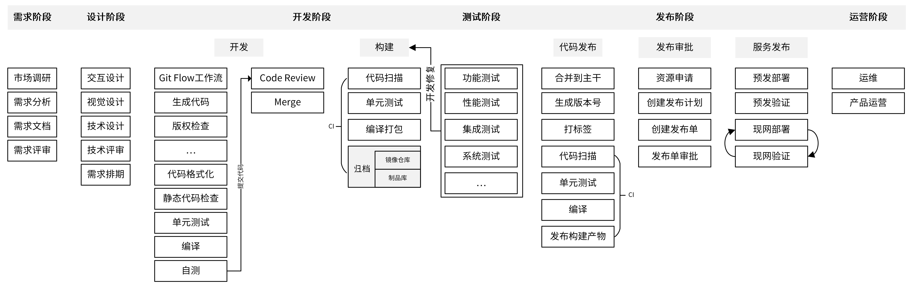
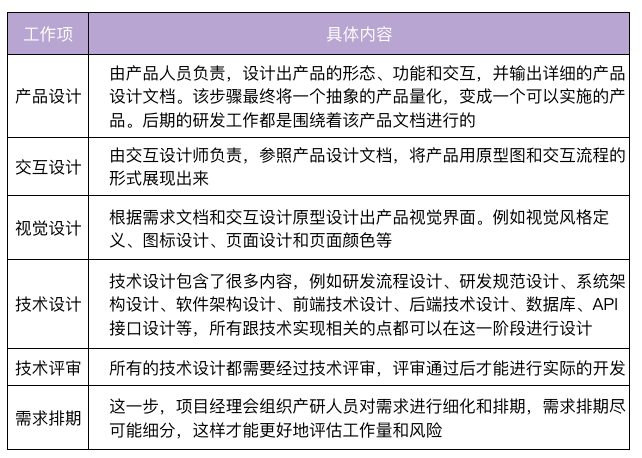
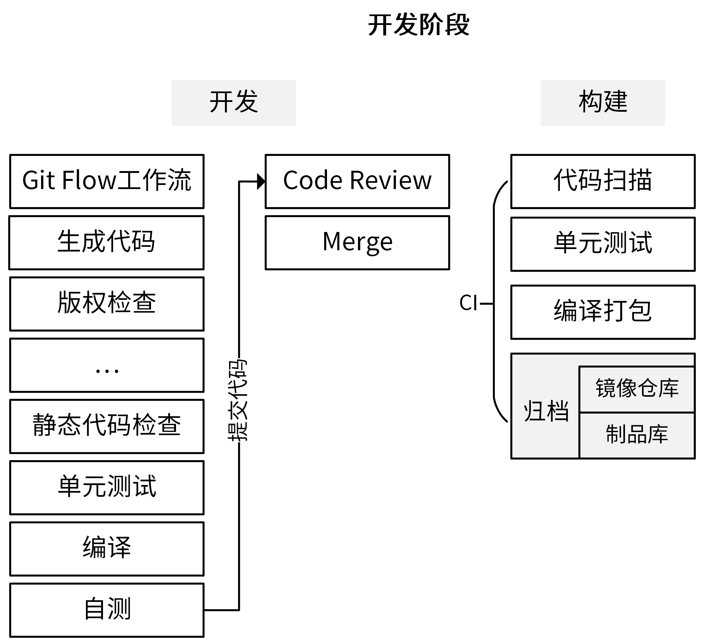
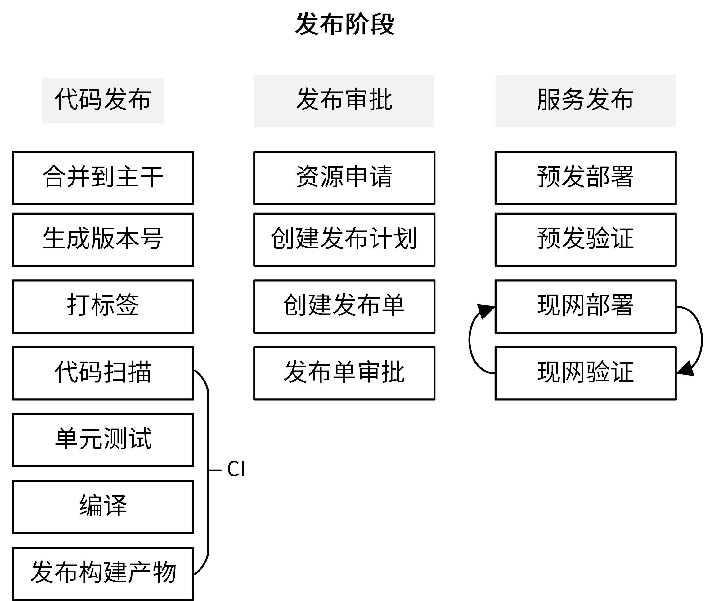
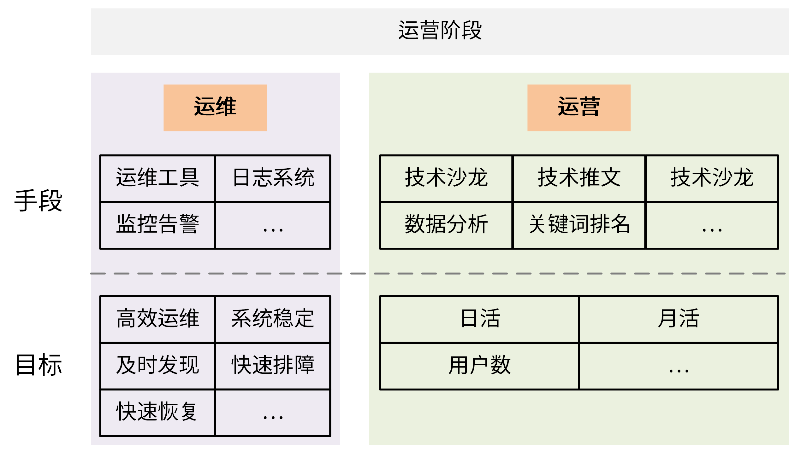
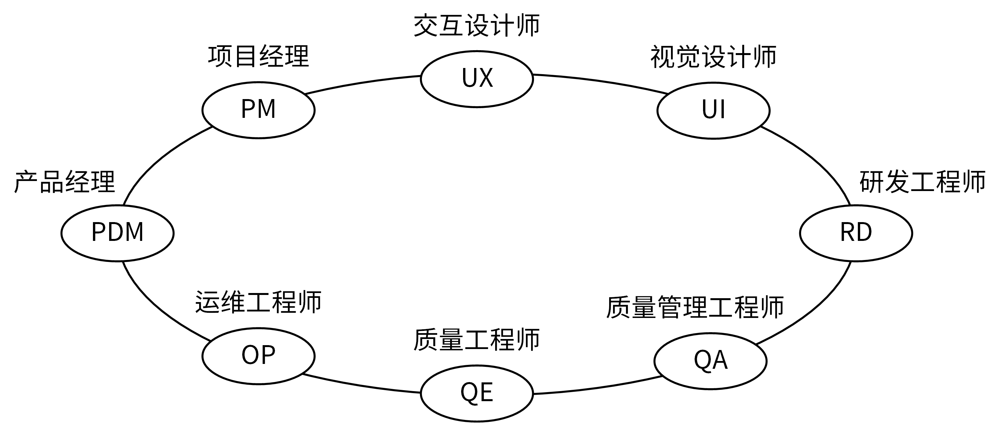
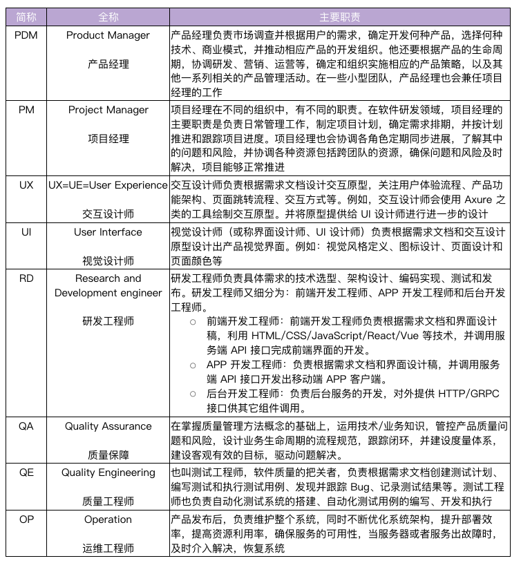
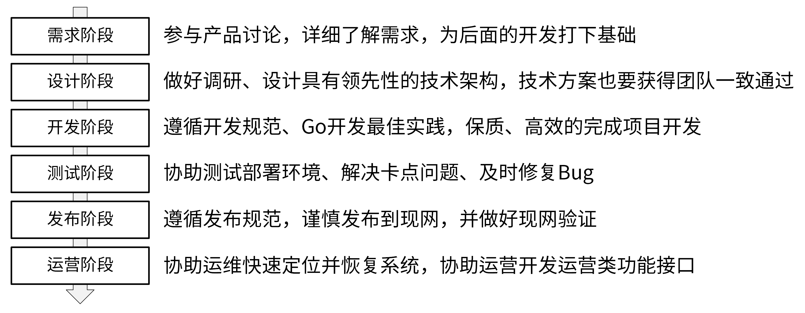

# 08 | 研发流程设计（上）：如何设计 Go 项目的开发流程？
你好，我是孔令飞。今天我们来聊聊如何设计研发流程。

在Go 项目开发中，我们不仅要完成产品功能的开发，还要确保整个过程是高效的，代码是高质量的。这就离不开一套设计合理的研发流程了。

而一个不合理的研发流程会带来很多问题，例如：

- **代码管理混乱。** 合并代码时出现合错、合丢、代码冲突等问题。
- **研发效率低。** 编译、测试、静态代码检查等全靠手动操作，效率低下。甚至，因为没有标准的流程，一些开发者会漏掉测试、静态代码检查等环节。
- **发布效率低。** 发布周期长，以及发布不规范造成的现网问题频发。

所以，Go 项目开发一定要设计一个合理的研发流程，来提高开发效率、减少软件维护成本。研发流程会因为项目、团队和开发模式等的不同而有所不同，但不同的研发流程依然会有一些相似点。

那么如何设计研发流程呢？这也是你看到题目中“设计”两个字后，会直接想要问的。看到这俩字，你第一时间可能会觉得我是通过一系列的方法论，来告诉你怎么进行流程设计。但实际情况是，项目研发流程会因为团队、项目、需求等的不同而不同，很难概括出一个方法论让你去设计研发流程。

所以在这一讲中，我会介绍一种业界已经设计好的、相对标准的研发流程，来告诉你怎么设计研发流程。通过学习它，你不仅能够了解到项目研发的通用流程，而且还可以基于这个流程来优化、定制，满足你自己的流程需求。

## 在设计研发流程时，需要关注哪些点？

在看具体的研发流程之前，我们需要先思考一个问题：你觉得，一个好的流程应该是什么样子的？

虽然我们刚才说了，不同团队、项目、需求的研发流程不会一成不变，但为了最大限度地提高研发效能，这些不同的流程都会遵循下面这几个原则。

- 发布效率高：研发流程应该能提高发布效率，减少发布时间和人工介入的工作量。
- 发布质量高：研发流程应该能够提高发布质量，确保发布出去的代码是经过充分测试的，并且完全避免人为因素造成的故障。
- 迭代速度快：整个研发流程要能支持快速迭代，产品迭代速度越快，意味着产品的竞争力越强，在互联网时代越能把握先机。
- 明确性：整个研发流程中角色的职责、使用的工具、方法和流程都应该是明确的，这可以增强流程的可执行性。
- 流程合理：研发流程最终是供产品、开发、测试、运维等人员使用的，所以整个流程设计不能是反人类的，要能够被各类参与人员接受并执行。
- 柔性扩展：研发流程应该是柔性且可扩展的，能够灵活变通，并适应各类场景。
- 输入输出：研发流程中的每个阶段都应该有明确的输入和输出，这些输入和输出标志着上一个阶段的完成，下一个阶段的开始。

明确了这些关注点，我们就有了设计、优化研发流程的抓手了。接下来，我们就可以一起去学习一套业界相对标准的研发流程了。在学习的过程中，你也能更好地理解我对各个流程的一些经验和建议了。

## 业界相对标准的研发流程，长啥样？

一个项目从立项到结项，中间会经历很多阶段。业界相对标准的划分，是把研发流程分为六个阶段，分别是需求阶段、设计阶段、开发阶段、测试阶段、发布阶段、运营阶段。其中，开发人员需要参与的阶段有4个：设计阶段、开发阶段、测试阶段和发布阶段。下图就是业界相对比较标准的流程：

每个阶段结束时，都需要有一个最终的产出物，可以是文档、代码或者部署组件等。这个产出物既是当前阶段的结束里程碑，又是下一阶段的输入。所以说，各个阶段不是割裂的，而是密切联系的整体。每个阶段又细分为很多步骤，这些步骤是需要不同的参与者去完成的工作任务。在完成任务的过程中，可能需要经过多轮的讨论、修改，最终形成定稿。

这里有个点我们一定要注意：研发流程也是一种规范，很难靠开发者的自觉性去遵守。为了让项目参与人员尽可能地遵守规范，需要借助一些工具、系统来对他们进行强约束。所以，在我们设计完整个研发流程之后，需要认真思考下，有哪些地方可以实现自动化，有哪些地方可以靠工具、系统来保障规范的执行。这些自动化工具会在第 **16 讲** 中详细介绍。

接下来，咱们就具体看看研发的各个阶段，以及每个阶段的具体内容。

### 需求阶段

需求阶段是将一个抽象的产品思路具化成一个可实施产品的阶段。在这个阶段，产品人员会讨论产品思路、调研市场需求，并对需求进行分析，整理出一个比较完善的需求文档。最后，产品人员会组织相关人员对需求进行评审，如果评审通过，就会进入设计阶段。

**需求阶段，一般不需要研发人员参与。但这里，我还是建议你积极参与产品需求的讨论。** 虽然我们是研发，但我们的视野和对团队的贡献，可以不仅仅局限在研发领域。

这里有个点需要提醒你，如果你们团队有测试人员，这个阶段也需要拉测试人员旁听下。因为了解产品设计，对测试阶段测试用例的编写和功能测试等都很有帮助。

需求阶段的产出物是一个通过评审的详细的需求文档。

### 设计阶段

设计阶段，是整个产品研发过程中非常重要的阶段，包括的内容也比较多，你可以看一下这张表：

这里的每一个设计项都应该经过反复的讨论、打磨，最终在团队内达成共识。这样可以确保设计是合理的，并减少返工的概率。 **这里想提醒你的是，技术方案和实现都要经过认真讨论，并获得一致通过，否则后面因为技术方案设计不当，需要返工，你要承担大部分责任。**

对于后端开发人员，在设计技术方案之前，要做好充足的调研。一个技术方案，不仅要调研业界优秀的实现，还要了解友商相同技术的实现。只有这样，才可以确保我们的技术用最佳的方式实现。

除此之外，在这个阶段一些设计项可以并行，以缩短设计阶段的耗时。例如，产品设计和技术设计可以并行展开。另外，如果你们团队有测试人员，研发阶段最好也拉上测试人员旁听下，有利于后面的测试。

该阶段的产出物是一系列的设计文档，这些文档会指导后面的整个研发流程。

### 开发阶段

开发阶段，从它的名字你就知道了，这是开发人员的主战场，同时它可能也是持续时间最长的阶段。在这一阶段，开发人员根据技术设计文档，编码实现产品需求。

开发阶段是整个项目的核心阶段，包含很多工作内容，而且每一个 Go 项目具体的步骤是不同的。我把开发阶段的常见步骤总结在了下图中，帮助你对它进行整体把握。

让我们来详细看下这张图里呈现的步骤。 **开发阶段又可以分为“开发”和“构建”两部分**，我们先来看开发。

首先，我们需要制定一个所有研发人员共同遵循的 Git 工作流规范。最常使用的是 Git Flow 工作流或者 Forking 工作流。

为了提高开发效率，越来越多的开发者采用生成代码的方式来生成一部分代码，所以在真正编译之前可能还需要先生成代码，比如生成.pb.go 文件、API 文档、测试用例、错误码等。 **我的建议是，在项目开发中，你要思考怎么尽可能自动生成代码。** 这样不仅能提高研发效率，还能减少错误。

对于一个开源项目，我们可能还需要检查新增的文件是否有版权信息。此外，根据项目不同，开发阶段还可能有其它不同的步骤。在流程的最后，通常会进行静态代码检查、单元测试和编译。编译之后，我们就可以启动服务，并进行自测了。

自测之后，我们可以遵循 Git Flow 工作流，将开发分支 push 到代码托管平台进行 code review。code review 通过之后，我们就可以将代码 merge 到 develop 分支上。

接下来进入构建阶段。这一阶段最好借助 CI/CD 平台实现自动化，提高构建效率。

合并到 develop 分支的代码同样需要进行代码扫描、单元测试，并编译打包。最后，我们需要进行归档，也就是将编译后的二进制文件或 Docker 镜像上传到制品库或镜像仓库。

我刚刚带着你完整走了一遍开发阶段的常见步骤。可以看到，整个开发阶段步骤很多，而且都是高频的操作。那 **怎么提高效率呢**？这里我推荐你两种方法：

- 将开发阶段的步骤通过 Makefile 实现集中管理；
- 将构建阶段的步骤通过 CI/CD 平台实现自动化。

你还需要特别注意这一点： **在最终合并代码到 master 之前，要确保代码是经过充分测试的**。这就要求我们一定要借助代码管理平台提供的 Webhook 能力，在代码提交时触发 CI/CD 作业，对代码进行扫描、测试，最终编译打包，并以整个作业的成功执行作为合并代码的先决条件。

开发阶段的产出物是满足需求的源代码、开发文档，以及编译后的归档文件。

### 测试阶段

测试阶段由测试工程师（也叫质量工程师）负责，这个阶段的主要流程是：测试工程师根据需求文档创建测试计划、编写测试用例，并拉研发同学一起评审测试计划和用例。评审通过后，测试工程师就会根据测试计划和测试用例对服务进行测试。

**为了提高整个研发效率，测试计划的创建和测试用例的编写可以跟开发阶段并行。**

研发人员在交付给测试时，要提供自测报告、自测用例和安装部署文档。 **这里我要强调的是：在测试阶段，为了不阻塞测试，确保项目按时发布，研发人员应该优先解决测试同学的Bug，至少是阻塞类的Bug。为了减少不必要的沟通和排障，安装部署文档要尽可能详尽和准确。**

另外， **你也可以及时跟进测试，了解测试同学当前遇到的卡点**。因为实际工作中，一些测试同学在遇到卡点时，不善于或者不会及时地跟你同步卡点，往往研发1分钟就可以解决的问题，可能要花测试同学几个小时或者更久的时间去解决。

当然，测试用例几乎不可能涵盖整个变更分支，所以对于一些难测，隐藏的测试，需要研发人员自己加强测试。

最后，一个大特性测试完，请测试同学吃个饭吧，大家唠唠家常，联络联络感情，下次合作会更顺畅。

测试阶段的产出物是满足产品需求、达到发布条件的源代码，以及编译后的归档文件。

### 发布阶段

发布阶段主要是将软件部署上线，为了保证发布的效率和质量，我们需要遵循一定的发布流程，如下图所示：

发布阶段按照时间线排序又分为代码发布、发布审批和服务发布3个子阶段。接下来，我详细给你介绍下这3个子阶段。我们先来看一下代码发布。

**首先，** 开发人员首先需要将经过测试后的代码合并到主干，通常是 master 分支，并生成版本号，然后给最新的 commit 打上版本标签。之后，可以将代码 push 到代码托管平台，并触发 CI 流程，CI流程一般会执行代码扫描、单元测试、编译，最后将构建产物发布到制品库。CI流程中，我们可以根据需要添加任意功能。

**接着，** 进入到发布审批阶段。首先需要申请资源， **资源申请周期可能会比较久，所以申请得越早越好，甚至资源申请可以在测试阶段发起。** 在资源申请阶段，可以申请诸如服务器、MySQL、Redis、Kafka 之类资源。

资源申请通常是开发人员向运维人员提需求，由运维人员根据需求，在指定的时间前准备好各类资源。如果是物理机通常申请周期会比较久，但当前越来越多的项目选择容器化部署，这可以极大地缩短资源的申请周期。如果在像腾讯云弹性容器这类Serverless容器平台上部署业务，甚至可以秒申请资源。所以这里，我也建议优先采用容器化部署。

发布之前需要创建发布计划，里面需要详细描述本次的变更详情，例如变更范围、发布方案、测试结果、验证和回滚方案等。这里需要你注意， **在创建发布计划时，一定要全面梳理这次变更的影响点。** 例如，是否有不兼容的变更，是否需要变更配置，是否需要变更数据库等。任何一个遗漏，都可能造成现网故障，影响产品声誉和用户使用。

接下来，需要创建发布单，在发布单中可以附上发布计划，并根据团队需求填写其它发布内容，发布计划需要跟相关参与者对齐流程、明确职责。发布单最终提交给审批人（通常是技术 leader）对本次发布进行审批，审批通过后，才可以进行部署。

**最后，** 就可以进入到服务发布阶段，将服务发布到现网。在正式部署的时候，应用需要先部署到预发环境。在预发环境，产品人员、测试人员和研发人员会分别对产品进行验证。其中，产品人员主要验证产品功能的体验是否流畅，开发和测试人员主要验证产品是否有 Bug。预发环境验证通过，产品才能正式发布到现网。

这里，我强烈建议， **编写一些自动化的测试用例，在服务发布到现网之后，对现网服务做一次比较充分的回归测试。** 通过这个自动化测试，可以以最小的代价，最快速地验证现网功能，从而保障发布质量。

另外，我们还要注意， **现网可能有多个地域，每个地域发布完成之后都要进行现网验证。**

发布阶段的产出物是正式上线的软件。

### 运营阶段

研发流程的最后一个阶段是运营阶段，该阶段主要分为产品运营和运维两个部分。

- **产品运营**：通过一系列的运营活动，比如线下的技术沙龙、线上的免费公开课、提高关键词排名或者输出一些技术推广文章等方式，来推高整个产品的知名度，提高产品的用户数量，并提高月活和日活。
- **运维**：由运维工程师负责，核心目标是确保系统稳定的运行，如果系统异常，能够及时发现并修复问题。长期目标是通过技术手段或者流程来完善整个系统架构，减少人力投入、提高运维效率，并提高系统的健壮性和恢复能力。

从上面可以看到，运维属于技术类，运营属于产品类，这二者不要搞混。为了加深你的理解和记忆，我将这些内容，总结在了下面一张图中。

在运营阶段，研发人员的主要职责就是协助运维解决现网Bug，优化部署架构。当然，研发人员可能也需要配合运营人员开发一些运营接口，供运营人员使用。

到这里，业界相对标准的这套研发流程，我们就学完了。在学习过程中，你肯定也发现了，整个研发流程会涉及很多角色，不同角色参与不同的阶段，负责不同的任务。这里我再给你额外扩展一个点，就是这些核心角色和分工是啥样的。

这些扩展内容，我放在了一张图和一张表里。这些角色和分工比较好理解，也不需要你背下来，只要先有一个大概的印象就可以了。

具体分工如下表所示。

## 总结

在开发Go项目时，掌握项目的研发流程很重要。掌握研发流程，会让项目研发对我们更加白盒，并且有利于我们制定详细的工作任务。

那么如何设计项目研发流程呢？你可以根据需要自行设计。自行设计时有些点是一定要关注的，例如我们的流程需要支持高的发布效率和发布质量，支持快速迭代，流程是合理、可扩展的，等等。

如果你不想自己设计，也可以。在这一讲中，我介绍了一套相对通用、标准的研发流程，如果合适可以直接拿来作为自己设计的研发流程。

这套研发流程包含6个阶段：需求阶段、设计阶段、开发阶段、测试阶段、发布阶段和运营阶段。这里我将这些流程和每个流程的核心点总结在下面一张图中。

## 课后练习

1. 回忆下研发阶段具体包括哪些工作内容，如果你觉得这些工作内容满足不了研发阶段的需求，还需要补充什么呢？
2. 思考、调研下有哪些工具，可以帮助实现整个流程，以及流程中任务的自动化，看下它们是如何提高我们的研发效率的。

研发流程会因团队、项目、需求的不同而不同，如果你有更好的流程方案，欢迎你在留言区与我交流讨论。我们下一讲见！