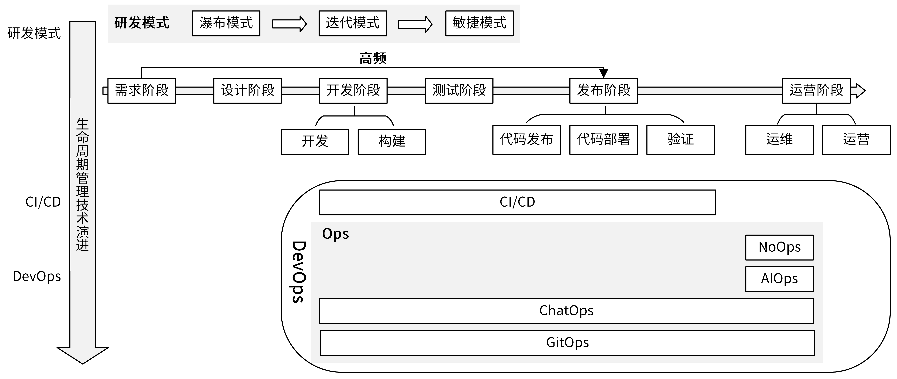
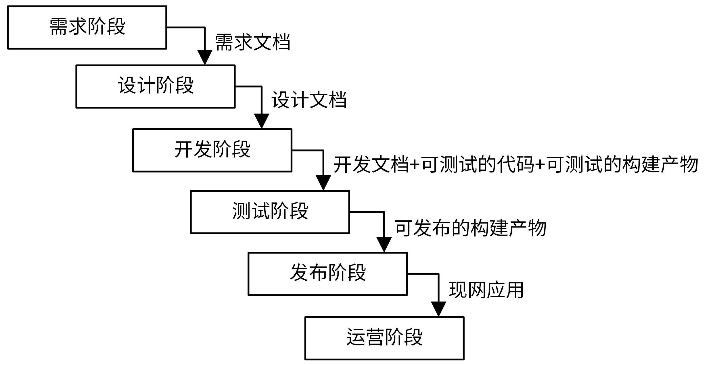
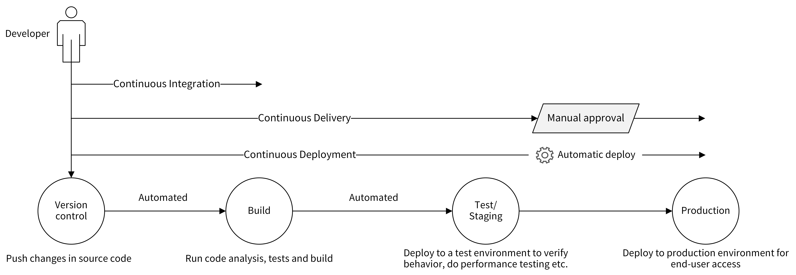
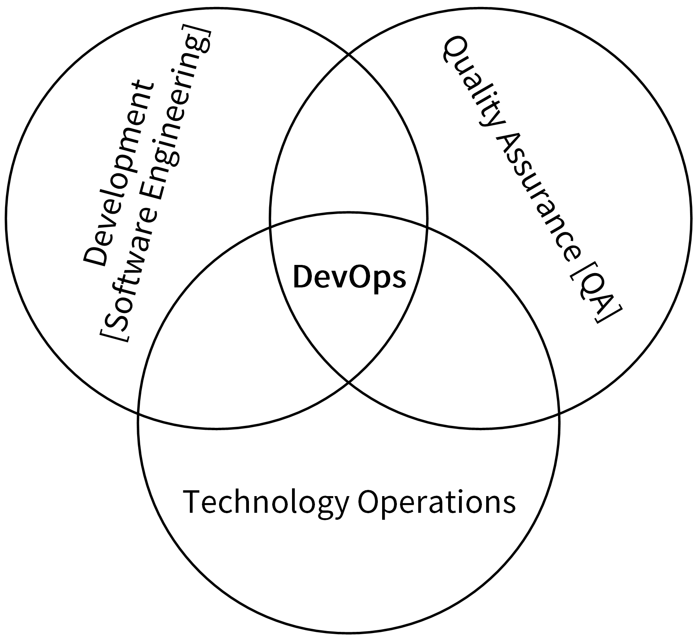
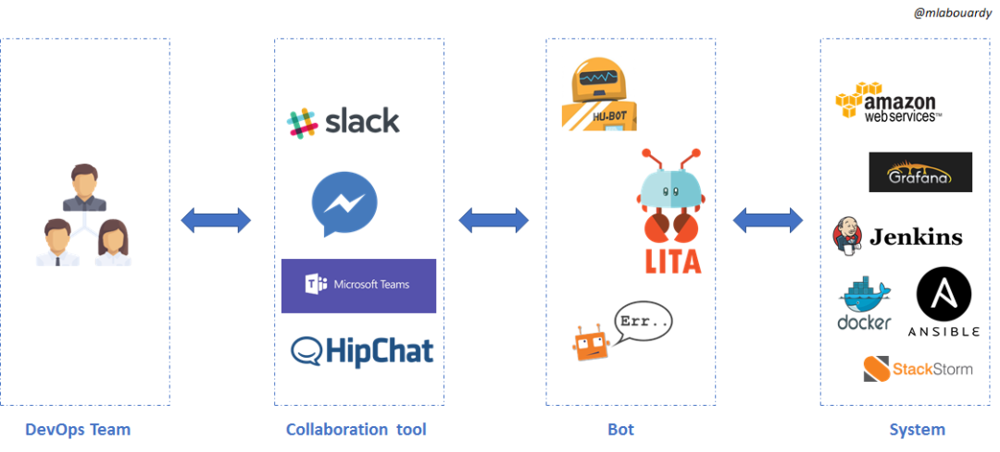
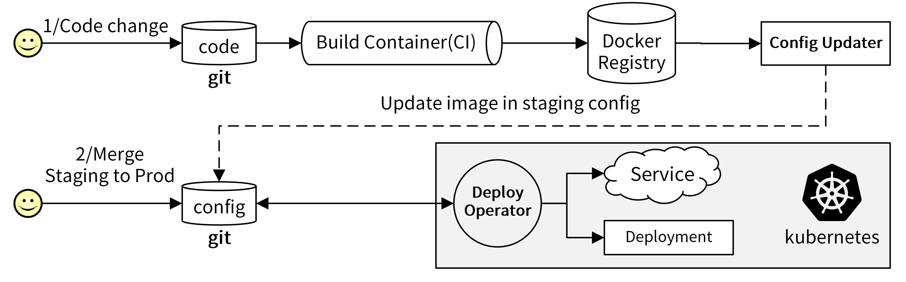

# 09 | 研发流程设计（下）：如何管理应用的生命周期？
你好，我是孔令飞。今天我们来聊聊如何管理应用生命周期。

上一讲，我们介绍了一个相对标准的研发流程，这个研发流程可以确保我们高效地开发出一个优秀的Go项目。这一讲，我们再来看下，如何管理我们的Go项目，也就是说如何对应用的生命周期进行管理。

那应用的生命周期管理，怎么理解呢？其实，就是指 **采用一些好的工具或方法在应用的整个生命周期中对应用进行管理，以提高应用的研发效率和质量**。

那么，如何设计一套优秀的应用生命周期管理手段呢？这就跟研发流程“设计”的思路一样，你可以自己设计，也可以采用业界沉淀下来的优秀管理手段。同样地，我更建议你采用已有的最佳实践，因为重复造轮子、造一个好轮子太难了。

所以，这一讲我们就一起学习下，业界在不同时期沉淀下来的优秀管理手段，以及我对这些管理手段的经验和建议，帮助你选到一个最合适的。

## 应用生命周期管理技术有哪些？

那么，有哪些应用生命周期管理技术呢？

在这里我先整体介绍一下，你先有个大致的印象，一会我们再一个个细讲。我们可以 **从两个维度来理解应用生命周期管理技术**。

第一个维度是演进维度。应用生命周期，最开始主要是通过研发模式来管理的，按时间线先后出现了瀑布模式、迭代模式、敏捷模式。接着，为了解决研发模式中的一些痛点出现了另一种管理技术，也就是CI/CD技术。随着CI/CD技术的成熟，又催生了另一种更高级的管理技术DevOps。

第二个维度是管理技术的类别。应用生命周期管理技术可以分为两类：

- 研发模式，用来确保整个研发流程是高效的。
- DevOps，主要通过协调各个部门之间的合作，来提高软件的发布效率和质量。DevOps中又包含了很多种技术，主要包括CI/CD和多种Ops，例如AIOps、ChatOps、GitOps、NoOps等。其中，CI/CD技术提高了软件的发布效率和质量，而Ops技术则提高了软件的运维和运营效率。

尽管这些应用生命周期管理技术有很多不同，但是它们彼此支持、相互联系。研发模式专注于 **开发过程**，DevOps技术里的CI/CD 专注于 **流程**，Ops则专注于 **实战。**

为了帮助你理解，我总结出了下面这张图供你参考。

这两个维度涉及的管理技术虽然不少，但一共就是那几类。所以， **为了能够逻辑清晰地给你讲解明白这些技术，我会从演进维度来展开，也就是按照这样的顺序：研发模式（瀑布模式 -> 迭代模式 -> 敏捷模式） -\> CI/CD -> DevOps**。

你可能会问了，既然是演进，那这些技术肯定有优劣之分，我应该怎么选择呢，一定是选择后面出现的技术吗？

为了解决你的这个问题，这里，对于研发模式和DevOps这两类技术的选择，我提前给出我的建议： **研发模式建议选择敏捷模式，因为它更能胜任互联网时代快速迭代的诉求。DevOps则要优先确保落地CI/CD技术，接着尝试落地ChatOps技术，如果有条件可以积极探索AIOps和GitOps。**

接下来，我们就详细说说这些应用生命周期的管理方法，先来看专注于开发过程的研发模式部分。

## 研发模式

研发模式主要有三种，演进顺序为瀑布模式->迭代模式->敏捷模式，现在我们逐一看下。

### 瀑布模式

在早期阶段，软件研发普遍采用的是瀑布模式，像我们熟知的RHEL、Fedora等系统就是采用瀑布模式。

瀑布模式按照预先规划好的研发阶段来推进研发进度。比如，按照需求阶段、设计阶段、开发阶段、测试阶段、发布阶段、运营阶段的顺序串行执行开发任务。每个阶段完美完成之后，才会进入到下一阶段，阶段之间通过文档进行交付。整个过程如下图所示。

瀑布模式最大的优点是简单。它严格按照研发阶段来推进研发进度，流程清晰，适合按项目交付的应用。

但它的缺点也很明显，最突出的就是这两个：

- 只有在项目研发的最后阶段才会交付给客户。交付后，如果客户发现问题，变更就会非常困难，代价很大。
- 研发周期比较长，很难适应互联网时代对产品快速迭代的诉求。

为了解决这两个问题，迭代式研发模式诞生了。

### 迭代模式

迭代模式，是一种与瀑布式模式完全相反的开发过程：研发任务被切分为一系列轮次，每一个轮次都是一个迭代，每一次迭代都是一个从设计到实现的完整过程。它 **不要求每一个阶段的任务都做到最完美，而是先把主要功能搭建起来，然后再通过客户的反馈信息不断完善**。

迭代开发可以帮助产品改进和把控进度，它的灵活性极大地提升了适应需求变化的能力，克服了高风险、难变更、复用性低的特点。

但是，迭代模式的问题在于比较专注于开发过程，很少从项目管理的视角去加速和优化项目开发过程。接下来要讲的敏捷模式，就弥补了这个缺点。

### 敏捷模式

敏捷模式把一个大的需求分成多个、可分阶段完成的小迭代，每个迭代交付的都是一个可使用的软件。在开发过程中，软件要一直处于可使用状态。

敏捷模式中具有代表性的开发模式，是Scrum开发模型。Scrum开发模型网上有很多介绍，你可以去看看。

在敏捷模式中，我们会把一个大的需求拆分成很多小的迭代，这意味着开发过程中会有很多个开发、构建、测试、发布和部署的流程。这种高频度的操作会给研发、运维和测试人员带来很大的工作量，降低了工作效率。为了解决这个问题，CI/CD技术诞生了。

## CI/CD：自动化构建和部署应用

CI/CD技术通过自动化的手段，来快速执行代码检查、测试、构建、部署等任务，从而提高研发效率，解决敏捷模式带来的弊端。

CI/CD包含了3个核心概念。

- **CI**：Continuous Integration，持续集成。
- **CD**：Continuous Delivery，持续交付。
- **CD**：Continuous Deployment，持续部署。

CI容易理解，但两个CD很多开发者区分不开。这里，我来详细说说这3个核心概念。

**首先是持续集成。** 它的含义为：频繁地（一天多次）将开发者的代码合并到主干上。它的流程为：在开发人员完成代码开发，并push到Git仓库后，CI工具可以立即对代码进行扫描、（单元）测试和构建，并将结果反馈给开发者。持续集成通过后，会将代码合并到主干。

CI流程可以使应用软件的问题在开发阶段就暴露出来，这会让开发人员交付代码时更有信心。因为CI流程内容比较多，而且执行比较频繁，所以CI流程需要有自动化工具来支撑。

**其次是持续交付，** 它指的是一种能够使软件在较短的循环中可靠发布的软件方法。

持续交付在持续集成的基础上，将构建后的产物自动部署在目标环境中。这里的目标环境，可以是测试环境、预发环境或者现网环境。

通常来说，持续部署可以自动地将服务部署到测试环境或者预发环境。因为部署到现网环境存在一定的风险，所以如果部署到现网环境，需要手工操作。手工操作的好处是，可以使相关人员评估发布风险，确保发布的正确性。

**最后是持续部署，** 持续部署在持续交付的基础上，将经过充分测试的代码自动部署到生产环境，整个流程不再需要相关人员的审核。持续部署强调的是自动化部署，是交付的最高阶段。

我们可以借助下面这张图，来了解持续集成、持续交付、持续部署的关系。

持续集成、持续交付和持续部署强调的是持续性，也就是能够支持频繁的集成、交付和部署，这离不开自动化工具的支持，离开了这些工具，CI/CD就不再具有可实施性。持续集成的核心点在 **代码**，持续交付的核心点在 **可交付的产物**，持续部署的核心点在 **自动部署。**

## DevOps：研发运维一体化

CI/CD技术的成熟，加速了DevOps这种应用生命周期管理技术的成熟和落地。

DevOps（Development和Operations的组合）是 **一组过程、方法与系统的统称**，用于促进开发（应用程序/软件工程）、技术运营和质量保障（QA）部门之间的沟通、协作与整合。这3个部门的相互协作，可以提高软件质量、快速发布软件。如下图所示：

要实现DevOps，需要一些工具或者流程的支持，CI/CD可以很好地支持DevOps这种软件开发模式，如果没有CI/CD自动化的工具和流程，DevOps就是没有意义的，CI/CD使得DevOps变得可行。

听到这里是不是有些晕？你可能想问，DevOps跟CI/CD到底是啥区别呢？其实，这也是困扰很多开发者的问题。这里，我们可以这么理解：DevOps ！= CI/CD。DevOps是一组过程、方法和系统的统称，而CI/CD只是一种软件构建和发布的技术。

DevOps技术之前一直有，但是落地不好，因为没有一个好的工具来实现DevOps的理念。但是随着容器、CI/CD技术的诞生和成熟，DevOps变得更加容易落地。也就是说，这几年越来越多的人采用DevOps手段来提高研发效能。

随着技术的发展，目前已经诞生了很多Ops手段，来实现运维和运营的高度自动化。下面，我们就来看看DevOps中的四个Ops手段：AIOps、ChatOps、GitOps、NoOps。

### AIOps：智能运维

在2016年，Gartner提出利用AI技术的新一代IT运维，即AIOps（智能运维）。通过AI手段，来智能化地运维IT系统。AIOps通过搜集海量的运维数据，并利用机器学习算法，智能地定位并修复故障。

也就是说，AIOps在自动化的基础上，增加了智能化，从而进一步推动了IT运维自动化，减少了人力成本。

随着IT基础设施规模和复杂度的倍数增长，企业应用规模、数量的指数级增长，传统的人工/自动化运维，已经无法胜任愈加沉重的运维工作，而AIOps提供了一个解决方案。在腾讯、阿里等大厂很多团队已经在尝试和使用AIOps，并享受到了AIOps带来的红利。例如，故障告警更加灵敏、准确，一些常见的故障，可以自动修复，无须运维人员介入等。

### ChatOps：聊着天就把事情给办了

随着企业微信、钉钉等企业内通讯工具的兴起，最近几年出现了一个新的概念ChatOps。

简单来说，ChatOps就是在一个聊天工具中，发送一条命令给 ChatBot 机器人，然后 ChatBot会执行预定义的操作。这些操作可以是执行某个工具、调用某个接口等，并返回执行结果。

这种新型智能工作方式的优势是什么呢？它可以利用 ChatBot 机器人让团队成员和各项辅助工具连接在一起，以沟通驱动的方式完成工作。ChatOps可以解决人与人、人与工具、工具与工具之间的信息孤岛，从而提高协作体验和工作效率。

ChatOps的工作流程如下图所示（网图）：

开发/运维/测试人员通过@聊天窗口中的机器人Bot来触发任务，机器人后端会通过API接口调用等方式对接不同的系统，完成不同的任务，例如持续集成、测试、发布等工作。机器人可以是我们自己研发的，也可以是开源的。目前，业界有很多流行的机器人可供选择，常用的有Hubot、Lita、Errbot、StackStorm等。

使用ChatOps可以带来以下几点好处。

- **友好、便捷**：所有的操作均在同一个聊天界面中，通过@机器人以聊天的方式发送命令，免去了打开不同系统，执行不同操作的繁琐操作，方式更加友好和便捷。
- **信息透明**：在同一个聊天界面中的所有同事都能够看到其他同事发送的命令，以及命令执行的结果，可以消除沟通壁垒，工作历史有迹可循，团队合作更加顺畅。
- **移动友好**：可以在移动端向机器人发送命令、执行任务，让移动办公变为可能。
- **DevOps 文化打造**：通过与机器人对话，可以降低项目开发中，各参与人员的理解和使用成本，从而使DevOps更容易落地和推广。

### GitOps： 一种实现云原生的持续交付模型

GitOps是一种持续交付的方式。它的核心思想是将应用系统的声明性基础架构（YAML）和应用程序存放在Git版本库中。将Git作为交付流水线的核心，每个开发人员都可以提交拉取请求（Pull Request），并使用Gi​​t来加速和简化Kubernetes的应用程序部署和运维任务。

通过Git这样的工具，开发人员可以将精力聚焦在功能开发，而不是软件运维上，以此提高软件的开发效率和迭代速度。

使用GitOps可以带来很多优点，其中最核心的是：当使用Git变更代码时，GitOps可以自动将这些变更应用到程序的基础架构上。因为整个流程都是自动化的，所以部署时间更短；又因为Git代码是可追溯的，所以我们部署的应用也能够稳定且可重现地回滚。

我们可以从概念和流程上来理解GitOps，它有3个关键概念。

- **声明性容器编排**：通过Kubernetes YAML格式的资源定义文件，来定义如何部署应用。
- **不可变基础设施**：基础设施中的每个组件都可以自动的部署，组件在部署完成后，不能发生变更。如果需要变更，则需要重新部署一个新的组件。例如，Kubernetes中的Pod就是一个不可变基础设施。
- **连续同步**：不断地查看Git存储库，将任何状态更改反映到Kubernetes集群中。

GitOps的工作流程如下：

**首先，** 开发人员开发完代码后推送到Git仓库，触发CI流程，CI流程通过编译构建出Docker镜像，并将镜像push到Docker镜像仓库中。Push动作会触发一个push事件，通过webhook的形式通知到Config Updater服务，Config Updater服务会从 webhook 请求中获取最新 push 的镜像名，并更新Git仓库中的Kubernetes YAML文件。

**然后，** GitOps的Deploy Operator服务，检测到YAML文件的变动，会重新从Git仓库中提取变更的文件，并将镜像部署到Kubernetes集群中。Config Updater 和 Deploy Operator 两个组件需要开发人员设计开发。

### NoOps：无运维

NoOps即无运维，完全自动化的运维。在NoOps中不再需要开发人员、运营运维人员的协同，把微服务、低代码、无服务全都结合了起来，开发者在软件生命周期中只需要聚焦业务开发即可，所有的维护都交由云厂商来完成。

毫无疑问，NoOps是运维的终极形态，在我看来它像DevOps一样，更多的是一种理念，需要很多的技术和手段来支撑。当前整个运维技术的发展，也是朝着NoOps的方向去演进的，例如GitOps、AIOps可以使我们尽可能减少运维，Serverless技术甚至可以使我们免运维。相信未来NoOps会像现在的Serverless一样，成为一种流行的、可落地的理念。

## 如何选择合适的应用生命周期管理技术？

好了，到这里我们就把主要的应用生命周期管理技术，学得差不多了。那在实际开发中，如何选择适合自己的呢？在我看来，你可以从这么几个方面考虑。

**首先，** 根据团队、项目选择一个合适的研发模式。如果项目比较大，需求变更频繁、要求快速迭代，建议选择敏捷开发模式。敏捷开发模式，也是很多大公司选择的研发模式，在互联网时代很受欢迎。

**接着，** 要建立自己的CI/CD流程。任何变更代码在合并到master分支时，一定要通过CI/CD的流程的验证。我建议，你在CI/CD流程中设置质量红线，确保合并代码的质量。

**接着，** 除了建立CI/CD系统，我还建议将ChatOps带入工作中，尽可能地将可以自动化的工作实现自动化，并通过ChatOps来触发自动化流程。随着企业微信、钉钉等企业聊天软件成熟和发展，ChatOps变得流行和完善。

**最后，** GitOps、AIOps可以将部署和运维自动化做到极致，在团队有人力的情况下，值得探索。

到这里你可能会问了，大厂是如何管理应用生命周期的？

**大厂普遍采用敏捷开发的模式，来适应互联网对应用快速迭代的诉求。** 例如，腾讯的 [TAPD](https://www.tapd.cn/)、 [Coding](https://coding.net/) 的Scrum敏捷管理就是一个敏捷开发平台。 **CI/CD强制落地，ChatOps已经广泛使用，AIOps也有很多落地案例，GitOps目前还在探索阶段，NoOps还处在理论阶段。**

## 总结

这一讲，我从技术演进的维度介绍了应用生命周期管理技术，这些技术可以提高应用的研发效率和质量。

应用生命周期管理最开始是通过研发模式来管理的。在研发模式中，我按时间线分别介绍了瀑布模式、迭代模式和敏捷模式，其中的敏捷模式适应了互联网时代对应用快速迭代的诉求，所以用得越来越多。

在敏捷模式中，我们需要频繁构建和发布我们的应用，这就给开发人员带来了额外的工作量，为了解决这个问题，出现了CI/CD技术。CI/CD可以将代码的检查、测试、构建和部署等工作自动化，不仅提高了研发效率，还从一定程度上保障了代码的质量。另外，CI/CD技术使得DevOps变得可行，当前越来越多的团队采用DevOps来管理应用的生命周期。

另外，这一讲中我也介绍了几个大家容易搞混的概念。

- 持续交付和持续部署。二者都是持续地部署应用，但是持续部署整个过程是自动化的，而持续交付中，应用在发布到现网前需要人工审批是否允许发布。
- CI/CD和DevOps。DevOps是一组过程、方法与系统的统称，其中也包含了CI/CD技术。而CI/CD是一种自动化的技术，DevOps理念的落地需要CI/CD技术的支持。

最后，关于如何管理应用的生命周期，我给出了一些建议： **研发模式建议选择敏捷模式**，因为它更能胜任互联网时代快速迭代的诉求。DevOps则要 **优先确保落地CI/CD技术**，接着尝试落地ChatOps技术，如果有条件可以积极探索AIOps和GitOps。

## 课后练习

1. 学习并使用GitHub Actions，通过Github Actions完成提交代码后自动进行静态代码检查的任务。
2. 尝试添加一个能够每天自动打印“hello world”的企业微信机器人，并思考下，哪些自动化工作可以通过该机器人来实现。

期待在留言区看到你的思考和答案，我们下一讲见！