# 10 | 设计方法：怎么写出优雅的 Go 项目？
你好，我是孔令飞，今天我们来聊聊如何写出优雅的 Go 项目。

Go语言简单易学，对于大部分开发者来说，编写可运行的代码并不是一件难事，但如果想真正成为Go编程高手，你需要花很多精力去研究Go的编程哲学。

在我的Go开发生涯中，我见过各种各样的代码问题，例如：代码不规范，难以阅读；函数共享性差，代码重复率高；不是面向接口编程，代码扩展性差，代码不可测；代码质量低下。究其原因，是因为这些代码的开发者 **很少花时间去认真研究如何开发一个优雅的Go项目，更多时间是埋头在需求开发中**。

如果你也遇到过以上问题，那么是时候花点时间来研究下如何开发一个优雅的Go项目了。只有这样，你才能区别于绝大部分的Go开发者，从而在职场上建立自己的核心竞争力，并最终脱颖而出。

其实，我们之前所学的各种规范设计，也都是为了写出一个优雅的Go项目。在这一讲，我又补充了一些内容，从而形成了一套“写出优雅Go项目”的方法论。这一讲内容比较多，但很重要，希望你能花点精力认真掌握，掌握之后，能够确保你开发出一个优秀的Go项目。

## 如何写出优雅的Go项目？

那么，如何写出一个 **优雅** 的 **Go项目** 呢？在回答这个问题之前，我们先来看另外两个问题：

1. 为什么是Go项目，而不是Go应用？
2. 一个优雅的Go项目具有哪些特点？

先来看第一个问题。Go项目是一个偏工程化的概念，不仅包含了Go应用，还包含了项目管理和项目文档：


这就来到了第二个问题，一个优雅的Go项目，不仅要求我们的Go应用是优雅的，还要确保我们的项目管理和文档也是优雅的。这样，我们根据前面几讲学到的Go设计规范，很容易就能总结出一个优雅的Go应用需要具备的特点：

- 符合Go编码规范和最佳实践；
- 易阅读、易理解，易维护；
- 易测试、易扩展；
- 代码质量高。

解决了这两个问题，让我们回到这一讲的核心问题：如何写出优雅的Go项目？

写出一个优雅的Go项目，在我看来，就是 **用“最佳实践”的方式去实现Go项目中的Go应用、项目管理和项目文档**。具体来说，就是编写高质量的Go应用、高效管理项目、编写高质量的项目文档。

为了协助你理解，我将这些逻辑绘制成了下面一张图。

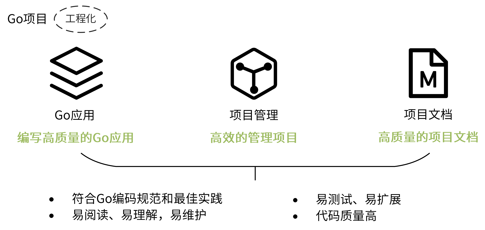

接下来，我们就看看如何根据前面几讲学习的Go项目设计规范，实现一个优雅的Go项目。我们先从编写高质量的Go应用看起。

## 编写高质量的Go应用

基于我的研发经验，要编写一个高质量的Go应用，其实可以归纳为5个方面：代码结构、代码规范、代码质量、编程哲学和软件设计方法，见下图。

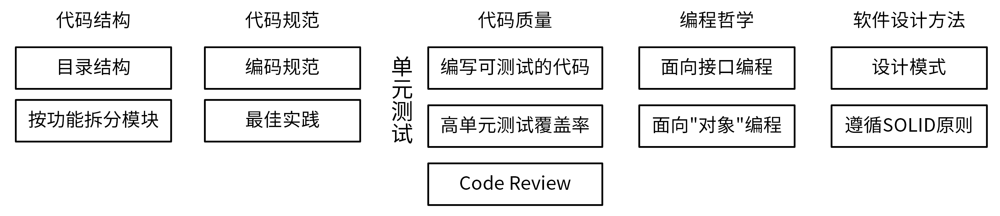

接下来，我们详细说说这些内容。

### 代码结构

为什么先说代码结构呢？因为组织合理的代码结构是一个项目的门面。我们可以通过两个手段来组织代码结构。

第一个手段是，组织一个好的目录结构。关于如何组合一个好的目录结构，你可以回顾 [06讲](https://time.geekbang.org/column/article/381392) 的内容。

第二个手段是，选择一个好的模块拆分方法。做好模块拆分，可以使项目内模块职责分明，做到低耦合高内聚。

那么Go项目开发中，如何拆分模块呢？目前业界有两种拆分方法，分别是按层拆分和按功能拆分。

**首先，我们看下按层拆分**，最典型的是MVC架构中的模块拆分方式。在MVC架构中，我们将服务中的不同组件按访问顺序，拆分成了Model、View和Controller三层。

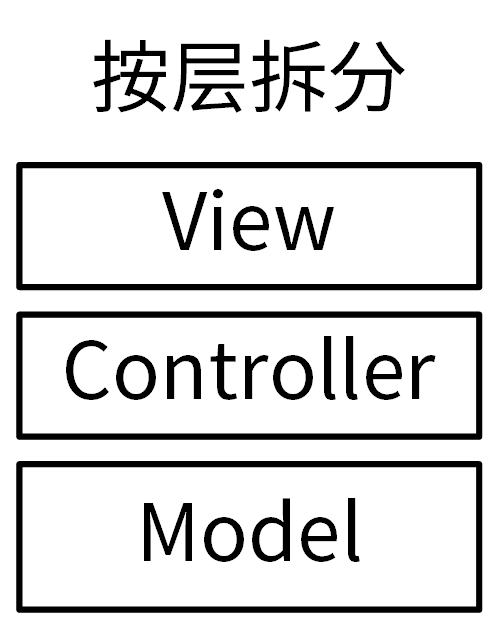

每层完成不同的功能：

- View（视图）是提供给用户的操作界面，用来处理数据的显示。
- Controller（控制器），负责根据用户从 View 层输入的指令，选取 Model 层中的数据，然后对其进行相应的操作，产生最终结果。
- Model（模型），是应用程序中用于处理数据逻辑的部分。

我们看一个典型的按层拆分的目录结构：

```
$ tree --noreport -L 2 layers
layers
├── controllers
│   ├── billing
│   ├── order
│   └── user
├── models
│   ├── billing.go
│   ├── order.go
│   └── user.go
└── views
    └── layouts

```

在Go项目中，按层拆分会带来很多问题。最大的问题是循环引用：相同功能可能在不同层被使用到，而这些功能又分散在不同的层中，很容易造成循环引用。

所以， **你只要大概知道按层拆分是什么意思就够了，在Go项目中我建议你使用的是按功能拆分的方法，这也是Go项目中最常见的拆分方法。**

那什么是按功能拆分呢？我给你看一个例子你就明白了。比如，一个订单系统，我们可以根据不同功能将其拆分成用户（user）、订单（order）和计费（billing）3个模块，每一个模块提供独立的功能，功能更单一：

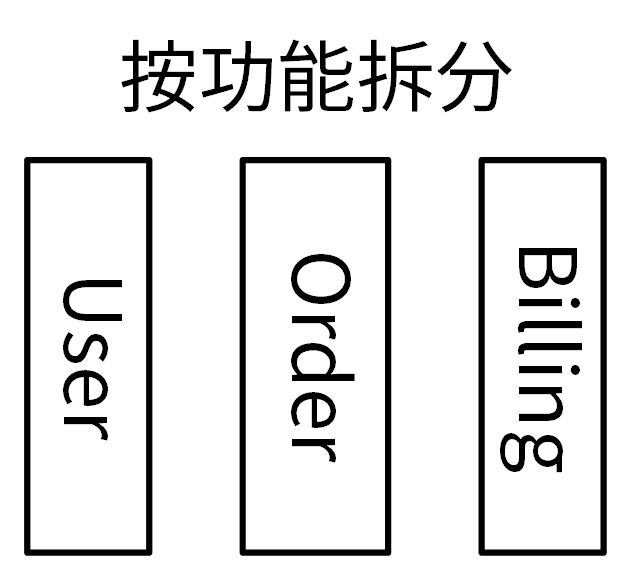

下面是该订单系统的代码目录结构：

```
$ tree pkg
$ tree --noreport -L 2 pkg
pkg
├── billing
├── order
│   └── order.go
└── user

```

相较于按层拆分，按功能拆分模块带来的好处也很好理解：

- 不同模块，功能单一，可以实现高内聚低耦合的设计哲学。
- 因为所有的功能只需要实现一次，引用逻辑清晰，会大大减少出现循环引用的概率。

所以，有很多优秀的Go项目采用的都是按功能拆分的模块拆分方式，例如 Kubernetes、Docker、Helm、Prometheus等。

除了组织合理的代码结构这种方式外，编写高质量Go应用的另外一个行之有效的方法，是遵循Go语言代码规范来编写代码。在我看来，这也是最容易出效果的方式。

### 代码规范

那我们要遵循哪些代码规范来编写Go应用呢？在我看来，其实就两类：编码规范和最佳实践。

**首先，我们的代码要符合Go编码规范，这是最容易实现的途径**。Go社区有很多这类规范可供参考，其中，比较受欢迎的是 [Uber Go 语言编码规范](https://github.com/xxjwxc/uber_go_guide_cn)。

阅读这些规范确实有用，也确实花时间、花精力。所以，我在参考了已有的很多规范后，结合自己写Go代码的经验，特地为你整理了一篇Go编码规范作为加餐，也就是“特别放送 \| 给你一份清晰、可直接套用的Go编码规范”。

有了可以参考的编码规范之后，我们需要扩展到团队、部门甚至公司层面。只有大家一起参与、遵守，规范才会变得有意义。其实，我们都清楚，要开发者靠自觉来遵守所有的编码规范，不是一件容易的事儿。这时候，我们可以使用静态代码检查工具，来约束开发者的行为。

有了静态代码检查工具后，不仅可以确保开发者写出的每一行代码都是符合Go编码规范的，还可以将静态代码检查集成到CI/CD流程中。这样，在代码提交后自动地检查代码，就保证了只有符合编码规范的代码，才会被合入主干。

Go语言的静态代码检查工具有很多，目前用的最多的是 [golangci-lint](https://github.com/golangci/golangci-lint)，这也是我极力推荐你使用的一个工具。关于这个工具的使用，我会在 **第15讲** 和你详细介绍。

除了遵循编码规范， **要想成为Go编程高手，你还得学习并遵循一些最佳实践**。“最佳实践”是社区经过多年探索沉淀下来的、符合Go语言特色的经验和共识，它可以帮助你开发出一个高质量的代码。

这里我给你推荐几篇介绍Go语言最佳实践的文章，供你参考：

- [Effective Go](https://golang.org/doc/effective_go)：高效Go编程，由Golang官方编写，里面包含了编写Go代码的一些建议，也可以理解为最佳实践。
- [Go Code Review Comments](https://github.com/golang/go/wiki/CodeReviewComments)：Golang官方编写的Go最佳实践，作为Effective Go的补充。
- [Style guideline for Go packages](https://rakyll.org/style-packages/)：包含了如何组织Go包、如何命名Go包、如何写Go包文档的一些建议。

### 代码质量

有了组织合理的代码结构、符合Go语言代码规范的Go应用代码之后，我们还需要通过一些手段来确保我们开发出的是一个高质量的代码，这可以通过单元测试和Code Review来实现。

**单元测试非常重要。** 我们开发完一段代码后，第一个执行的测试就是单元测试。它可以保证我们的代码是符合预期的，一些异常变动能够被及时感知到。进行单元测试，不仅需要编写单元测试用例，还需要我们确保代码是可测试的，以及具有一个高的单元测试覆盖率。

接下来，我就来介绍下如何编写一个可测试的代码。

如果我们要对函数A进行测试，并且A中的所有代码均能够在单元测试环境下按预期被执行，那么函数A的代码块就是可测试的。我们来看下一般的单元测试环境有什么特点：

- 可能无法连接数据库。
- 可能无法访问第三方服务。

如果函数A依赖数据库连接、第三方服务，那么在单元测试环境下执行单元测试就会失败，函数就没法测试，函数是不可测的。

解决方法也很简单：将依赖的数据库、第三方服务等抽象成接口，在被测代码中调用接口的方法，在测试时传入mock类型，从而将数据库、第三方服务等依赖从具体的被测函数中解耦出去。如下图所示：

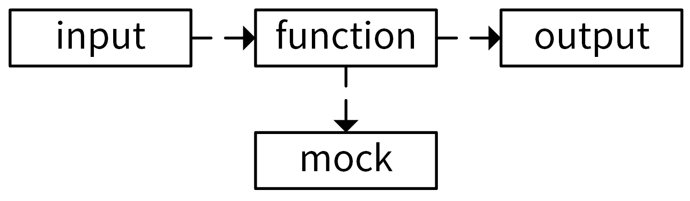

为了提高代码的可测性，降低单元测试的复杂度，对function和mock的要求是：

- 要尽可能减少function中的依赖，让function只依赖必要的模块。编写一个功能单一、职责分明的函数，会有利于减少依赖。
- 依赖模块应该是易Mock的。

为了协助你理解，我们先来看一段不可测试的代码：

```
package post

import "google.golang.org/grpc"

type Post struct {
	Name    string
	Address string
}

func ListPosts(client *grpc.ClientConn) ([]*Post, error) {
	return client.ListPosts()
}

```

这段代码中的ListPosts函数是不可测试的。因为ListPosts函数中调用了 `client.ListPosts()` 方法，该方法依赖于一个gRPC连接。而我们在做单元测试时，可能因为没有配置gRPC服务的地址、网络隔离等原因，导致没法建立gRPC连接，从而导致ListPosts函数执行失败。

下面，我们把这段代码改成可测试的，如下：

```
package main

type Post struct {
	Name    string
	Address string
}

type Service interface {
	ListPosts() ([]*Post, error)
}

func ListPosts(svc Service) ([]*Post, error) {
	return svc.ListPosts()
}

```

上面代码中，ListPosts函数入参为Service接口类型，只要我们传入一个实现了Service接口类型的实例，ListPosts函数即可成功运行。因此，我们可以在单元测试中可以实现一个不依赖任何第三方服务的fake实例，并传给ListPosts。上述可测代码的单元测试代码如下：

```
package main

import "testing"

type fakeService struct {
}

func NewFakeService() Service {
	return &fakeService{}
}

func (s *fakeService) ListPosts() ([]*Post, error) {
	posts := make([]*Post, 0)
	posts = append(posts, &Post{
		Name:    "colin",
		Address: "Shenzhen",
	})
	posts = append(posts, &Post{
		Name:    "alex",
		Address: "Beijing",
	})
	return posts, nil
}

func TestListPosts(t *testing.T) {
	fake := NewFakeService()
	if _, err := ListPosts(fake); err != nil {
		t.Fatal("list posts failed")
	}
}

```

当我们的代码可测之后，就可以借助一些工具来Mock需要的接口了。常用的Mock工具，有这么几个：

- [golang/mock](https://github.com/golang/mock)，是官方提供的Mock框架。它实现了基于interface的Mock功能，能够与Golang内置的testing包做很好的集成，是最常用的Mock工具。golang/mock提供了mockgen工具用来生成interface对应的Mock源文件。
- [sqlmock](https://github.com/DATA-DOG/go-sqlmock)，可以用来模拟数据库连接。数据库是项目中比较常见的依赖，在遇到数据库依赖时都可以用它。
- [httpmock](https://github.com/jarcoal/httpmock)，可以用来Mock HTTP请求。
- [bouk/monkey](https://github.com/bouk/monkey)，猴子补丁，能够通过替换函数指针的方式来修改任意函数的实现。如果golang/mock、sqlmock和httpmock这几种方法都不能满足我们的需求，我们可以尝试通过猴子补丁的方式来Mock依赖。可以这么说，猴子补丁提供了单元测试 Mock 依赖的最终解决方案。

接下来，我们再一起看看 **如何提高我们的单元测试覆盖率**。

当我们编写了可测试的代码之后，接下来就需要编写足够的测试用例，用来提高项目的单元测试覆盖率。这里我有以下两个建议供你参考：

- 使用gotests工具自动生成单元测试代码，减少编写单元测试用例的工作量，将你从重复的劳动中解放出来。
- 定期检查单元测试覆盖率。你可以通过以下方法来检查：

```
$ go test -race -cover  -coverprofile=./coverage.out -timeout=10m -short -v ./...
$ go tool cover -func ./coverage.out

```

执行结果如下：

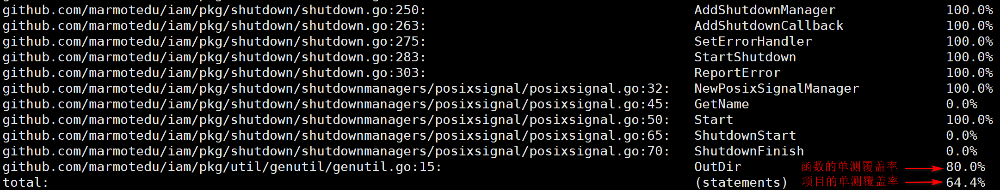

在提高项目的单元测试覆盖率时，我们可以先提高单元测试覆盖率低的函数，之后再检查项目的单元测试覆盖率；如果项目的单元测试覆盖率仍然低于期望的值，可以再次提高单元测试覆盖率低的函数的覆盖率，然后再检查。以此循环，最终将项目的单元测试覆盖率优化到预期的值为止。

这里要注意，对于一些可能经常会变动的函数单元测试，覆盖率要达到100%。

说完了单元测试，我们再看看 **如何通过Code Review来保证代码质量。**

Code Review可以提高代码质量、交叉排查缺陷，并且促进团队内知识共享，是保障代码质量非常有效的手段。在我们的项目开发中，一定要建立一套持久可行的Code Review机制。

但在我的研发生涯中，发现很多团队没有建立有效的Code Review机制。这些团队都认可Code Review机制带来的好处，但是因为流程难以遵守，慢慢地Code Review就变成了形式主义，最终不了了之。其实，建立Code Review机制很简单，主要有3点：

- 首先，确保我们使用的代码托管平台有Code Review的功能。比如，GitHub、GitLab这类代码托管平台都具备这种能力。
- 接着，建立一套Code Review规范，规定如何进行Code Review。
- 最后，也是最重要的，每次代码变更，相关开发人员都要去落实Code Review机制，并形成习惯，直到最后形成团队文化。

**到这里我们可以小结一下：组织一个合理的代码结构、编写符合Go代码规范的代码、保证代码质量，在我看来都是编写高质量Go代码的外功。那内功是什么呢？就是编程哲学和软件设计方法。**

### 编程哲学

那编程哲学是什么意思呢？在我看来，编程哲学，其实就是要编写符合Go语言设计哲学的代码。Go语言有很多设计哲学，对代码质量影响比较大的，我认为有两个：面向接口编程和面向“对象”编程。

我们先来看下面向接口编程。

Go 接口是一组方法的集合。任何类型，只要实现了该接口中的方法集，那么就属于这个类型，也称为实现了该接口。

接口的作用，其实就是为不同层级的模块提供一个定义好的中间层。这样，上游不再需要依赖下游的具体实现，充分地对上下游进行了解耦。很多流行的Go设计模式，就是通过面向接口编程的思想来实现的。

我们看一个面向接口编程的例子。下面这段代码定义了一个 `Bird` 接口，Canary和Crow类型均实现了 `Bird` 接口。

```
package main

import "fmt"

// 定义了一个鸟类
type Bird interface {
	Fly()
	Type() string
}

// 鸟类：金丝雀
type Canary struct {
	Name string
}

func (c *Canary) Fly() {
	fmt.Printf("我是%s，用黄色的翅膀飞\n", c.Name)
}
func (c *Canary) Type() string {
	return c.Name
}

// 鸟类：乌鸦
type Crow struct {
	Name string
}

func (c *Crow) Fly() {
	fmt.Printf("我是%s，我用黑色的翅膀飞\n", c.Name)
}

func (c *Crow) Type() string {
	return c.Name
}

// 让鸟类飞一下
func LetItFly(bird Bird) {
	fmt.Printf("Let %s Fly!\n", bird.Type())
	bird.Fly()
}

func main() {
	LetItFly(&Canary{"金丝雀"})
	LetItFly(&Crow{"乌鸦"})
}

```

这段代码中，因为Crow和Canary都实现了Bird接口声明的Fly、Type方法，所以可以说Crow、Canary实现了Bird接口，属于Bird类型。在函数调用时，可以传入Bird类型，并在函数内部调用Bird接口提供的方法，以此来解耦Bird的具体实现。

好了，我们总结下使用接口的好处吧：

- 代码扩展性更强了。例如，同样的Bird，可以有不同的实现。在开发中用的更多的是，将数据库的CURD操作抽象成接口，从而可以实现同一份代码对接不同数据库的目的。
- 可以解耦上下游的实现。例如，LetItFly不用关注Bird是如何Fly的，只需要调用Bird提供的方法即可。
- 提高了代码的可测性。因为接口可以解耦上下游实现，我们在单元测试需要依赖第三方系统/数据库的代码时，可以利用接口将具体实现解耦，实现fake类型。
- 代码更健壮、更稳定了。例如，如果要更改Fly的方式，只需要更改相关类型的Fly方法即可，完全影响不到LetItFly函数。

所以，我建议你，在Go项目开发中，一定要多思考，那些可能有多种实现的地方，要考虑使用接口。

接下来，我们再来看下面向“对象”编程。

面向对象编程（OOP）有很多优点，例如可以使我们的代码变得易维护、易扩展，并能提高开发效率等，所以一个高质量的Go应用在需要时，也应该采用面向对象的方法去编程。那什么叫“在需要时”呢？就是我们在开发代码时，如果一个功能可以通过接近于日常生活和自然的思考方式来实现，这时候就应该考虑使用面向对象的编程方法。

Go语言不支持面向对象编程，但是却可以通过一些语言级的特性来实现类似的效果。

面向对象编程中，有几个核心特性：类、实例、抽象，封装、继承、多态、构造函数、析构函数、方法重载、this指针。在Go中可以通过以下几个方式来实现类似的效果：

- 类、抽象、封装通过结构体来实现。
- 实例通过结构体变量来实现。
- 继承通过组合来实现。这里解释下什么叫组合：一个结构体嵌到另一个结构体，称作组合。例如一个结构体包含了一个匿名结构体，就说这个结构体组合了该匿名结构体。
- 多态通过接口来实现。

至于构造函数、析构函数、方法重载和this指针等，Go为了保持语言的简洁性去掉了这些特性。

Go中面向对象编程方法，见下图：

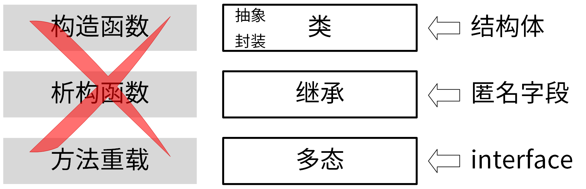

我们通过一个示例，来具体看下Go是如何实现面向对象编程中的类、抽象、封装、继承和多态的。代码如下：

```
package main

import "fmt"

// 基类：Bird
type Bird struct {
	Type string
}

// 鸟的类别
func (bird *Bird) Class() string {
	return bird.Type
}

// 定义了一个鸟类
type Birds interface {
	Name() string
	Class() string
}

// 鸟类：金丝雀
type Canary struct {
	Bird
	name string
}

func (c *Canary) Name() string {
	return c.name
}

// 鸟类：乌鸦
type Crow struct {
	Bird
	name string
}

func (c *Crow) Name() string {
	return c.name
}

func NewCrow(name string) *Crow {
	return &Crow{
		Bird: Bird{
			Type: "Crow",
		},
		name: name,
	}
}

func NewCanary(name string) *Canary {
	return &Canary{
		Bird: Bird{
			Type: "Canary",
		},
		name: name,
	}
}

func BirdInfo(birds Birds) {
	fmt.Printf("I'm %s, I belong to %s bird class!\n", birds.Name(), birds.Class())
}

func main() {
    canary := NewCanary("CanaryA")
    crow := NewCrow("CrowA")
	BirdInfo(canary)
	BirdInfo(crow)
}

```

将上述代码保存在oop.go文件中，执行以下代码输出如下：

```
$ go run oop.go
I'm CanaryA, I belong to Canary bird class!
I'm CrowA, I belong to Crow bird class!

```

在上面的例子中，分别通过Canary和Crow结构体定义了金丝雀和乌鸦两种类别的鸟，其中分别封装了name属性和Name方法。也就是说通过结构体实现了类，该类抽象了鸟类，并封装了该鸟类的属性和方法。

在Canary和Crow结构体中，都有一个Bird匿名字段，Bird字段为Canary和Crow类的父类，Canary和Crow继承了Bird类的Class属性和方法。也就是说通过匿名字段实现了继承。

在main函数中，通过NewCanary创建了Canary鸟类实例，并将其传给BirdInfo函数。也就是说通过结构体变量实现实例。

在BirdInfo函数中，将Birds接口类型作为参数传入，并在函数中调用了birds.Name，birds.Class方法，这两个方法会根据birds类别的不同而返回不同的名字和类别，也就是说通过接口实现了多态。

### 软件设计方法

接下来，我们继续学习编写高质量Go代码的第二项内功，也就是让编写的代码遵循一些业界沉淀下来的，优秀的软件设计方法。

优秀的软件设计方法有很多，其中有两类方法对我们代码质量的提升特别有帮助，分别是设计模式（Design pattern）和SOLID原则。

在我看来，设计模式可以理解为业界针对一些特定的场景总结出来的最佳实现方式。它的特点是解决的场景比较具体，实施起来会比较简单；而SOLID原则更侧重设计原则，需要我们彻底理解，并在编写代码时多思考和落地。

关于设计模式和SOLID原则，我是这么安排的：在 **第11讲**，我会带你学习Go项目常用的设计模式；至于SOLID原则，网上已经有很多高质量的文章了，所以我会简单告诉你这个原则是啥，然后给你推荐一篇介绍文章。

我们先了解下有哪些设计模式。

在软件领域，沉淀了一些比较优秀的设计模式，其中最受欢迎的是GOF设计模式。GOF设计模式中包含了3大类（创建型模式、结构型模式、行为型模式），共25种经典的、可以解决常见软件设计问题的设计方案。这25种设计方案同样也适用于Go语言开发的项目。

这里，我将这25种设计模式总结成了一张图，你可以先看看，有个大概的印象，对于一些在Go项目开发中常用的设计模式，我会在 **第11讲** 详细介绍。

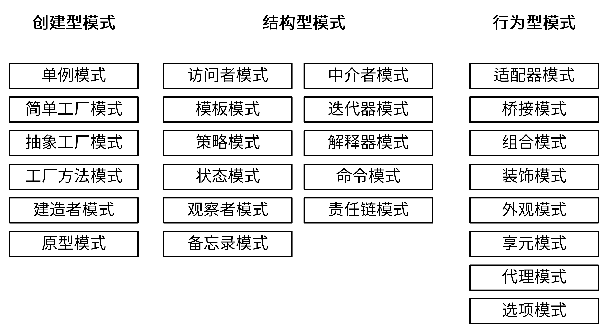

**如果说设计模式解决的是具体的场景，那么SOLID原则就是我们设计应用代码时的指导方针。**

SOLID原则，是由罗伯特·C·马丁在21世纪早期引入的，包括了面向对象编程和面向对象设计的五个基本原则：

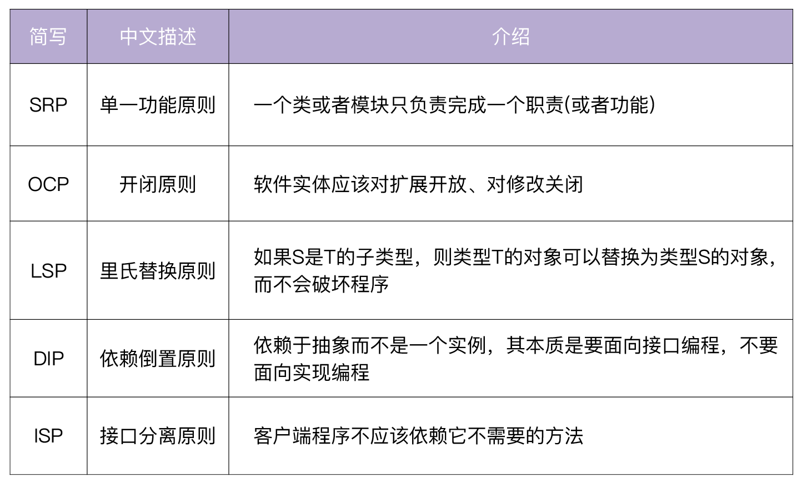

遵循SOLID原则可以确保我们设计的代码是易维护、易扩展、易阅读的。SOLID原则同样也适用于Go程序设计。

如果你需要更详细地了解SOLID原则，可以参考下 [SOLID原则介绍](https://github.com/marmotedu/geekbang-go/blob/master/SOLID%E5%8E%9F%E5%88%99%E4%BB%8B%E7%BB%8D.md) 这篇文章。

到这里，我们就学完了“编写高质量的Go应用”这部分内容。接下来，我们再来学习下如何高效管理Go项目，以及如何编写高质量的项目文档。这里面的大部分内容，之前我们都有学习过，因为它们是“如何写出优雅的Go项目”的重要组成部分，所以，这里我仍然会简单介绍下它们。

## 高效管理项目

一个优雅的Go项目，还需要具备高效的项目管理特性。那么如何高效管理我们的项目呢？

不同团队、不同项目会采用不同的方法来管理项目，在我看来比较重要的有3点，分别是制定一个高效的开发流程、使用Makefile管理项目和将项目管理自动化。我们可以通过自动生成代码、借助工具、对接CI/CD系统等方法来将项目管理自动化。具体见下图：


### 高效的开发流程

高效管理项目的第一步，就是要有一个高效的开发流程，这可以提高开发效率、减少软件维护成本。你可以回想一下设计开发流程的知识，如果印象比较模糊了，一定要回去复习下 **08讲** 的内容 **，** 因为这部分很重要 。

### 使用Makefile管理项目

为了更好地管理项目，除了一个高效的开发流程之外，使用Makefile也很重要。Makefile可以将项目管理的工作通过Makefile依赖的方式实现自动化，除了可以提高管理效率之外，还能够减少人为操作带来的失误，并统一操作方式，使项目更加规范。

IAM项目的所有操作均是通过Makefile来完成的，具体Makefile完成了如下操作：

```
 build              Build source code for host platform.
  build.multiarch    Build source code for multiple platforms. See option PLATFORMS.
  image              Build docker images for host arch.
  image.multiarch    Build docker images for multiple platforms. See option PLATFORMS.
  push               Build docker images for host arch and push images to registry.
  push.multiarch     Build docker images for multiple platforms and push images to registry.
  deploy             Deploy updated components to development env.
  clean              Remove all files that are created by building.
  lint               Check syntax and styling of go sources.
  test               Run unit test.
  cover              Run unit test and get test coverage.
  release            Release iam
  format             Gofmt (reformat) package sources (exclude vendor dir if existed).
  verify-copyright   Verify the boilerplate headers for all files.
  add-copyright      Ensures source code files have copyright license headers.
  gen                Generate all necessary files, such as error code files.
  ca                 Generate CA files for all iam components.
  install            Install iam system with all its components.
  swagger            Generate swagger document.
  serve-swagger      Serve swagger spec and docs.
  dependencies       Install necessary dependencies.
  tools              install dependent tools.
  check-updates      Check outdated dependencies of the go projects.
  help               Show this help info.

```

### 自动生成代码

低代码的理念现在越来越流行。虽然低代码有很多缺点，但确实有很多优点，例如：

- 自动化生成代码，减少工作量，提高工作效率。
- 代码有既定的生成规则，相比人工编写代码，准确性更高、更规范。

目前来看，自动生成代码现在已经成为趋势，比如 Kubernetes项目有很多代码都是自动生成的。我认为，想写出一个优雅的Go项目，你也应该认真思考哪些地方的代码可以自动生成。在这门课的IAM项目中，就有大量的代码是自动生成的，我放在这里供你参考：

- 错误码、错误码说明文档。
- 自动生成缺失的doc.go文件。
- 利用gotests工具，自动生成单元测试用例。
- 使用Swagger工具，自动生成Swagger文档。
- 使用Mock工具，自动生成接口的Mock实例。

### 善于借助工具

在开发Go项目的过程中，我们也要善于借助工具，来帮助我们完成一部分工作。利用工具可以带来很多好处：

- 解放双手，提高工作效率。
- 利用工具的确定性，可以确保执行结果的一致性。例如，使用golangci-lint对代码进行检查，可以确保不同开发者开发的代码至少都遵循golangci-lint的代码检查规范。
- 有利于实现自动化，可以将工具集成到CI/CD流程中，触发流水线自动执行。

那么，Go项目中，有哪些工具可以为我们所用呢？这里，我给你整理了一些有用的工具：

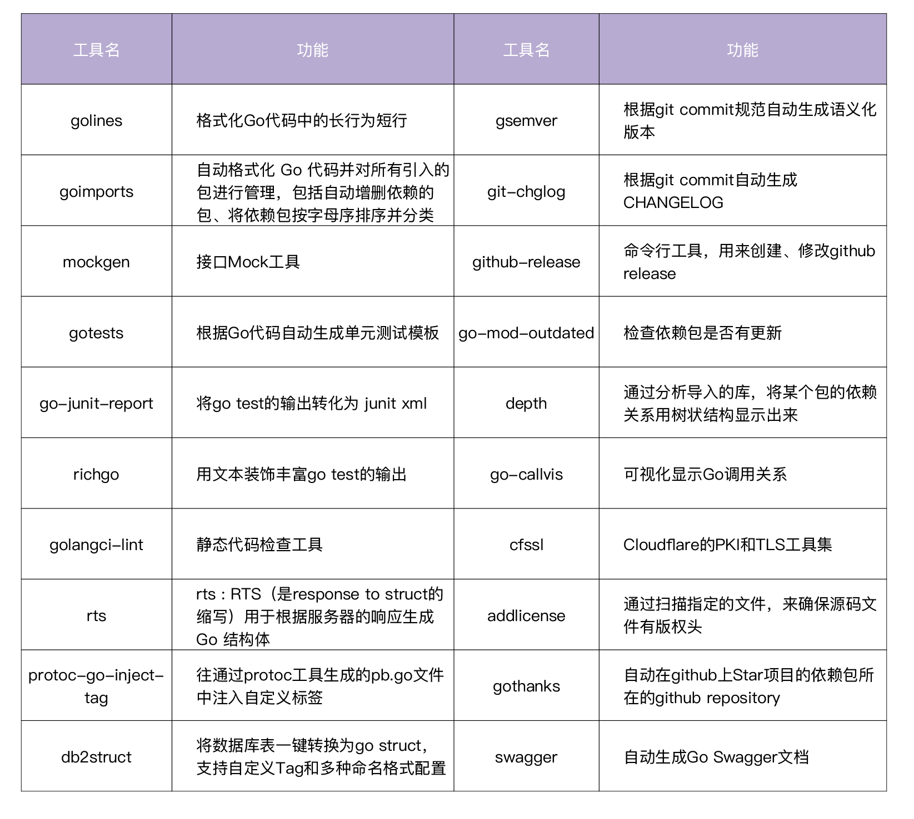

所有这些工具都可以通过下面的方式安装。

```
$ cd $IAM_ROOT
$ make tools.install

```

IAM项目使用了上面这些工具的绝大部分，用来尽可能提高整个项目的自动化程度，提高项目维护效率。

### 对接CI/CD

代码在合并入主干时，应该有一套CI/CD流程来自动化地对代码进行检查、编译、单元测试等，只有通过后的代码才可以并入主干。通过CI/CD流程来保证代码的质量。当前比较流行的CI/CD工具有Jenkins、GitLab、Argo、Github Actions、JenkinsX等。在 **第51讲** 和 **第52讲** 中，我会详细介绍CI/CD的原理和实战。

## 编写高质量的项目文档

最后，一个优雅的项目，还应该有完善的文档。例如 README.md、安装文档、开发文档、使用文档、API接口文档、设计文档等等。这些内容在 [第04讲](https://time.geekbang.org/column/article/380033) 的文档规范部分有详细介绍，你可以去复习下。

## 总结

使用Go语言做项目开发，核心目的其实就是 **开发一个优雅的Go项目**。那么如何开发一个优雅的Go项目呢？Go项目包含三大内容，即 Go应用、项目管理、项目文档，因此开发一个优雅的Go项目，其实就是 **编写高质量的Go应用**、 **高效管理项目** 和 **编写高质量的项目文档**。针对每一项，我都给出了一些实现方式，这些方式详见下图：

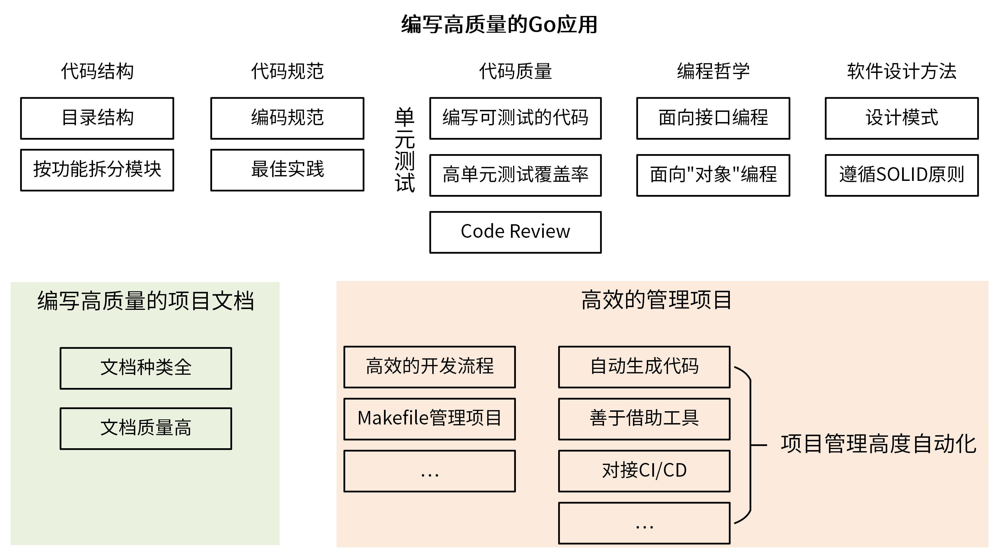

## 课后练习

1. 在工作中，你还有哪些方法，来帮助你开发一个优雅的Go项目呢？
2. 在你的当前项目中有哪些可以接口化的代码呢？找到它们，并尝试用面向接口的编程哲学去重写这部分代码吧。

期待在留言区看到你的思考和答案，我们下一讲见！