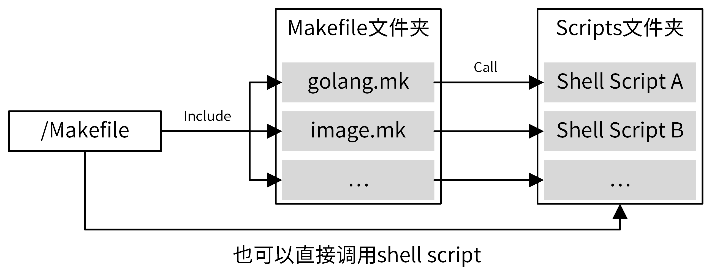

# 14 | 项目管理：如何编写高质量的Makefile？
你好，我是孔令飞。今天我们来聊聊如何编写高质量的Makefile。

我们在 [第10讲](https://time.geekbang.org/column/article/384648) 学习过，要写出一个优雅的Go项目，不仅仅是要开发一个优秀的Go应用，而且还要能够高效地管理项目。有效手段之一，就是通过Makefile来管理我们的项目，这就要求我们要为项目编写Makefile文件。

在和其他开发同学交流时，我发现大家都认可Makefile强大的项目管理能力，也会自己编写Makefile。但是其中的一些人项目管理做得并不好，我和他们进一步交流后发现，这些同学在用Makefile简单的语法重复编写一些低质量Makefile文件，根本没有把Makefile的功能充分发挥出来。

下面给你举个例子，你就会理解低质量的Makefile文件是什么样的了。

```
build: clean vet
	@mkdir -p ./Role
	@export GOOS=linux && go build -v .

vet:
	go vet ./...

fmt:
	go fmt ./...

clean:
	rm -rf dashboard

```

上面这个Makefile存在不少问题。例如：功能简单，只能完成最基本的编译、格式化等操作，像构建镜像、自动生成代码等一些高阶的功能都没有；扩展性差，没法编译出可在Mac下运行的二进制文件；没有Help功能，使用难度高；单Makefile文件，结构单一，不适合添加一些复杂的管理功能。

所以，我们不光要编写Makefile，还要编写高质量的Makefile。那么如何编写一个高质量的Makefile呢？我觉得，可以通过以下4个方法来实现：

1. 打好基础，也就是熟练掌握Makefile的语法。
2. 做好准备工作，也就是提前规划Makefile要实现的功能。
3. 进行规划，设计一个合理的Makefile结构。
4. 掌握方法，用好Makefile的编写技巧。

那么接下来，我们就详细看看这些方法。

## 熟练掌握Makefile语法

工欲善其事，必先利其器。编写高质量Makefile的第一步，便是熟练掌握Makefile的核心语法。

因为Makefile的语法比较多，我把一些建议你重点掌握的语法放在了近期会更新的特别放送中，包括Makefile规则语法、伪目标、变量赋值、条件语句和Makefile常用函数等等。

如果你想更深入、全面地学习Makefile的语法，我推荐你学习陈皓老师编写的 [《跟我一起写 Makefile》 (PDF 重制版)](https://github.com/seisman/how-to-write-makefile)。

## 规划Makefile要实现的功能

接着，我们需要规划Makefile要实现的功能。提前规划好功能，有利于你设计Makefile的整体结构和实现方法。

不同项目拥有不同的Makefile功能，这些功能中一小部分是通过目标文件来实现的，但更多的功能是通过伪目标来实现的。对于Go项目来说，虽然不同项目集成的功能不一样，但绝大部分项目都需要实现一些通用的功能。接下来，我们就来看看，在一个大型Go项目中Makefile通常可以实现的功能。

下面是IAM项目的Makefile所集成的功能，希望会对你日后设计Makefile有一些帮助。

```
$ make help

Usage: make <TARGETS> <OPTIONS> ...

Targets:
  # 代码生成类命令
  gen                Generate all necessary files, such as error code files.

  # 格式化类命令
  format             Gofmt (reformat) package sources (exclude vendor dir if existed).

  # 静态代码检查
  lint               Check syntax and styling of go sources.

  # 测试类命令
  test               Run unit test.
  cover              Run unit test and get test coverage.

  # 构建类命令
  build              Build source code for host platform.
  build.multiarch    Build source code for multiple platforms. See option PLATFORMS.

  # Docker镜像打包类命令
  image              Build docker images for host arch.
  image.multiarch    Build docker images for multiple platforms. See option PLATFORMS.
  push               Build docker images for host arch and push images to registry.
  push.multiarch     Build docker images for multiple platforms and push images to registry.

  # 部署类命令
  deploy             Deploy updated components to development env.

  # 清理类命令
  clean              Remove all files that are created by building.

  # 其他命令，不同项目会有区别
  release            Release iam
  verify-copyright   Verify the boilerplate headers for all files.
  ca                 Generate CA files for all iam components.
  install            Install iam system with all its components.
  swagger            Generate swagger document.
  tools              install dependent tools.

  # 帮助命令
  help               Show this help info.

# 选项
Options:
  DEBUG        Whether to generate debug symbols. Default is 0.
  BINS         The binaries to build. Default is all of cmd.
               This option is available when using: make build/build.multiarch
               Example: make build BINS="iam-apiserver iam-authz-server"
  ...

```

更详细的命令，你可以在IAM项目仓库根目录下执行 `make help` 查看。

通常而言，Go项目的Makefile应该实现以下功能：格式化代码、静态代码检查、单元测试、代码构建、文件清理、帮助等等。如果通过docker部署，还需要有docker镜像打包功能。因为Go是跨平台的语言，所以构建和docker打包命令，还要能够支持不同的CPU架构和平台。为了能够更好地控制Makefile命令的行为，还需要支持Options。

为了方便查看Makefile集成了哪些功能，我们需要支持help命令。help命令最好通过解析Makefile文件来输出集成的功能，例如：

```
## help: Show this help info.
.PHONY: help
help: Makefile
  @echo -e "\nUsage: make <TARGETS> <OPTIONS> ...\n\nTargets:"
  @sed -n 's/^##//p' $< | column -t -s ':' | sed -e 's/^/ /'
  @echo "$$USAGE_OPTIONS"

```

上面的help命令，通过解析Makefile文件中的 `##` 注释，获取支持的命令。通过这种方式，我们以后新加命令时，就不用再对help命令进行修改了。

你可以参考上面的Makefile管理功能，结合自己项目的需求，整理出一个Makefile要实现的功能列表，并初步确定实现思路和方法。做完这些，你的编写前准备工作就基本完成了。

## 设计合理的Makefile结构

设计完Makefile需要实现的功能，接下来我们就进入Makefile编写阶段。编写阶段的第一步，就是设计一个合理的Makefile结构。

对于大型项目来说，需要管理的内容很多，所有管理功能都集成在一个Makefile中，可能会导致Makefile很大，难以阅读和维护，所以 **建议采用分层的设计方法，根目录下的Makefile聚合所有的Makefile命令，具体实现则按功能分类，放在另外的Makefile中**。

我们经常会在Makefile命令中集成shell脚本，但如果shell脚本过于复杂，也会导致Makefile内容过多，难以阅读和维护。并且在Makefile中集成复杂的shell脚本，编写体验也很差。对于这种情况， **可以将复杂的shell命令封装在shell脚本中，供Makefile直接调用，而一些简单的命令则可以直接集成在Makefile中**。

所以，最终我推荐的Makefile结构如下：



在上面的Makefile组织方式中，根目录下的Makefile聚合了项目所有的管理功能，这些管理功能通过Makefile伪目标的方式实现。同时，还将这些伪目标进行分类，把相同类别的伪目标放在同一个Makefile中，这样可以使得Makefile更容易维护。对于复杂的命令，则编写成独立的shell脚本，并在Makefile命令中调用这些shell脚本。

举个例子，下面是IAM项目的Makefile组织结构：

```
├── Makefile
├── scripts
│   ├── gendoc.sh
│   ├── make-rules
│   │   ├── gen.mk
│   │   ├── golang.mk
│   │   ├── image.mk
│   │   └── ...
    └── ...

```

我们将相同类别的操作统一放在scripts/make-rules目录下的Makefile文件中。Makefile的文件名参考分类命名，例如 golang.mk。最后，在/Makefile 中 include 这些 Makefile。

为了跟Makefile的层级相匹配，golang.mk中的所有目标都按 `go.xxx` 这种方式命名。通过这种命名方式，我们可以很容易分辨出某个目标完成什么功能，放在什么文件里，这在复杂的Makefile中尤其有用。以下是IAM项目根目录下，Makefile的内容摘录，你可以看一看，作为参考：

```
include scripts/make-rules/golang.mk
include scripts/make-rules/image.mk
include scripts/make-rules/gen.mk
include scripts/make-rules/...

## build: Build source code for host platform.
.PHONY: build
build:
	@$(MAKE) go.build

## build.multiarch: Build source code for multiple platforms. See option PLATFORMS.
.PHONY: build.multiarch
build.multiarch:
	@$(MAKE) go.build.multiarch

## image: Build docker images for host arch.
.PHONY: image
image:
	@$(MAKE) image.build

## push: Build docker images for host arch and push images to registry.
.PHONY: push
push:
	@$(MAKE) image.push

## ca: Generate CA files for all iam components.
.PHONY: ca
ca:
	@$(MAKE) gen.ca

```

另外，一个合理的Makefile结构应该具有前瞻性。也就是说，要在不改变现有结构的情况下，接纳后面的新功能。这就需要你整理好Makefile当前要实现的功能、即将要实现的功能和未来可能会实现的功能，然后基于这些功能，利用Makefile编程技巧，编写可扩展的Makefile。

这里需要你注意：上面的Makefile通过 `.PHONY` 标识定义了大量的伪目标，定义伪目标一定要加 `.PHONY` 标识，否则当有同名的文件时，伪目标可能不会被执行。

## 掌握Makefile编写技巧

最后，在编写过程中，你还需要掌握一些Makefile的编写技巧，这些技巧可以使你编写的Makefile扩展性更强，功能更强大。

接下来，我会把自己长期开发过程中积累的一些Makefile编写经验分享给你。这些技巧，你需要在实际编写中多加练习，并形成编写习惯。

### 技巧1：善用通配符和自动变量

Makefile允许对目标进行类似正则运算的匹配，主要用到的通配符是 `%`。通过使用通配符，可以使不同的目标使用相同的规则，从而使Makefile扩展性更强，也更简洁。

我们的IAM实战项目中，就大量使用了通配符 `%`，例如： `go.build.%`、 `ca.gen.%`、 `deploy.run.%`、 `tools.verify.%`、 `tools.install.%` 等。

这里，我们来看一个具体的例子， `tools.verify.%`（位于 [scripts/make-rules/tools.mk](https://github.com/marmotedu/iam/blob/master/scripts/make-rules/tools.mk#L17) 文件中）定义如下：

```
tools.verify.%:
  @if ! which $* &>/dev/null; then $(MAKE) tools.install.$*; fi

```

`make tools.verify.swagger`, `make tools.verify.mockgen` 等均可以使用上面定义的规则， `%` 分别代表了 `swagger` 和 `mockgen`。

如果不使用 `%`，则我们需要分别为 `tools.verify.swagger` 和 `tools.verify.mockgen` 定义规则，很麻烦，后面修改也困难。

另外，这里也能看出 `tools.verify.%` 这种命名方式的好处：tools说明依赖的定义位于 `scripts/make-rules/tools.mk` Makefile中； `verify` 说明 `tools.verify.%` 伪目标属于verify分类，主要用来验证工具是否安装。通过这种命名方式，你可以很容易地知道目标位于哪个Makefile文件中，以及想要完成的功能。

另外，上面的定义中还用到了自动变量 `$*`，用来指代被匹配的值 `swagger`、 `mockgen`。

### 技巧2：善用函数

Makefile自带的函数能够帮助我们实现很多强大的功能。所以，在我们编写Makefile的过程中，如果有功能需求，可以优先使用这些函数。我把常用的函数以及它们实现的功能整理在了 [Makefile常用函数列表](https://github.com/marmotedu/geekbang-go/blob/master/makefile/Makefile%E5%B8%B8%E7%94%A8%E5%87%BD%E6%95%B0%E5%88%97%E8%A1%A8.md) 中，你可以参考下。

IAM的Makefile文件中大量使用了上述函数，如果你想查看这些函数的具体使用方法和场景，可以参考IAM项目的Makefile文件 [make-rules](https://github.com/marmotedu/iam/tree/master/scripts/make-rules)。

### 技巧3：依赖需要用到的工具

如果Makefile某个目标的命令中用到了某个工具，可以将该工具放在目标的依赖中。这样，当执行该目标时，就可以指定检查系统是否安装该工具，如果没有安装则自动安装，从而实现更高程度的自动化。例如，/Makefile文件中，format伪目标，定义如下：

```
.PHONY: format
format: tools.verify.golines tools.verify.goimports
  @echo "===========> Formating codes"
  @$(FIND) -type f -name '*.go' | $(XARGS) gofmt -s -w
  @$(FIND) -type f -name '*.go' | $(XARGS) goimports -w -local $(ROOT_PACKAGE)
  @$(FIND) -type f -name '*.go' | $(XARGS) golines -w --max-len=120 --reformat-tags --shorten-comments --ignore-generated .

```

你可以看到，format依赖 `tools.verify.golines tools.verify.goimports`。我们再来看下 `tools.verify.golines` 的定义：

```
tools.verify.%:
  @if ! which $* &>/dev/null; then $(MAKE) tools.install.$*; fi

```

再来看下 `tools.install.$*` 规则：

```
.PHONY: install.golines
install.golines:
  @$(GO) get -u github.com/segmentio/golines

```

通过 `tools.verify.%` 规则定义，我们可以知道， `tools.verify.%` 会先检查工具是否安装，如果没有安装，就会执行 `tools.install.$*` 来安装。如此一来，当我们执行 `tools.verify.%` 目标时，如果系统没有安装golines命令，就会自动调用 `go get` 安装，提高了Makefile的自动化程度。

### 技巧4：把常用功能放在/Makefile中，不常用的放在分类Makefile中

一个项目，尤其是大型项目，有很多需要管理的地方，其中大部分都可以通过Makefile实现自动化操作。不过，为了保持/Makefile文件的整洁性，我们不能把所有的命令都添加在/Makefile文件中。

一个比较好的建议是，将常用功能放在/Makefile中，不常用的放在分类Makefile中，并在/Makefile中include这些分类Makefile。

例如，IAM项目的/Makefile集成了 `format`、 `lint`、 `test`、 `build` 等常用命令，而将 `gen.errcode.code`、 `gen.errcode.doc` 这类不常用的功能放在scripts/make-rules/gen.mk文件中。当然，我们也可以直接执行 `make gen.errcode.code` 来执行 `gen.errcode.code` 伪目标。通过这种方式，既可以保证/Makefile的简洁、易维护，又可以通过 `make` 命令来运行伪目标，更加灵活。

### 技巧5：编写可扩展的Makefile

什么叫可扩展的Makefile呢？在我看来，可扩展的Makefile包含两层含义：

1. 可以在不改变Makefile结构的情况下添加新功能。
2. 扩展项目时，新功能可以自动纳入到Makefile现有逻辑中。

其中的第一点，我们可以通过设计合理的Makefile结构来实现。要实现第二点，就需要我们在编写Makefile时采用一定的技巧，例如多用通配符、自动变量、函数等。这里我们来看一个例子，可以让你更好地理解。

在我们IAM实战项目的 [golang.mk](https://github.com/marmotedu/iam/blob/v1.0.0/scripts/make-rules/golang.mk#L34) 中，执行 `make go.build` 时能够构建cmd/目录下的所有组件，也就是说，当有新组件添加时， `make go.build` 仍然能够构建新增的组件，这就实现了上面说的第二点。

具体实现方法如下：

```
COMMANDS ?= $(filter-out %.md, $(wildcard ${ROOT_DIR}/cmd/*))
BINS ?= $(foreach cmd,${COMMANDS},$(notdir ${cmd}))

.PHONY: go.build
go.build: go.build.verify $(addprefix go.build., $(addprefix $(PLATFORM)., $(BINS)))
.PHONY: go.build.%

go.build.%:
  $(eval COMMAND := $(word 2,$(subst ., ,$*)))
  $(eval PLATFORM := $(word 1,$(subst ., ,$*)))
  $(eval OS := $(word 1,$(subst _, ,$(PLATFORM))))
  $(eval ARCH := $(word 2,$(subst _, ,$(PLATFORM))))
  @echo "===========> Building binary $(COMMAND) $(VERSION) for $(OS) $(ARCH)"
  @mkdir -p $(OUTPUT_DIR)/platforms/$(OS)/$(ARCH)
  @CGO_ENABLED=0 GOOS=$(OS) GOARCH=$(ARCH) $(GO) build $(GO_BUILD_FLAGS) -o $(OUTPUT_DIR)/platforms/$(OS)/$(ARCH)/$(COMMAND)$(GO_OUT_EXT) $(ROOT_PACKAGE)/cmd/$(COMMAND)

```

当执行 `make go.build` 时，会执行go.build的依赖 `$(addprefix go.build., $(addprefix $(PLATFORM)., $(BINS)))` , `addprefix` 函数最终返回字符串 `go.build.linux_amd64.iamctl go.build.linux_amd64.iam-authz-server go.build.linux_amd64.iam-apiserver ...` ，这时候就会执行 `go.build.%` 伪目标。

在 `go.build.%` 伪目标中，通过eval、word、subst函数组合，算出了COMMAND的值 `iamctl/iam-apiserver/iam-authz-server/...`，最终通过 `$(ROOT_PACKAGE)/cmd/$(COMMAND)` 定位到需要构建的组件的main函数所在目录。

上述实现中有两个技巧，你可以注意下。首先，通过

```
COMMANDS ?= $(filter-out %.md, $(wildcard ${ROOT_DIR}/cmd/*))
BINS ?= $(foreach cmd,${COMMANDS},$(notdir ${cmd}))

```

获取到了cmd/目录下的所有组件名。

接着，通过使用通配符和自动变量，自动匹配到 `go.build.linux_amd64.iam-authz-server` 这类伪目标并构建。

可以看到，想要编写一个可扩展的Makefile，熟练掌握Makefile的用法是基础，更多的是需要我们动脑思考如何去编写Makefile。

### 技巧6：将所有输出存放在一个目录下，方便清理和查找

在执行Makefile的过程中，会输出各种各样的文件，例如 Go 编译后的二进制文件、测试覆盖率数据等，我建议你把这些文件统一放在一个目录下，方便后期的清理和查找。通常我们可以把它们放在 `_output` 这类目录下，这样清理时就很方便，只需要清理 `_output` 文件夹就可以，例如：

```
.PHONY: go.clean
go.clean:
  @echo "===========> Cleaning all build output"
  @-rm -vrf $(OUTPUT_DIR)

```

这里要注意，要用 `-rm`，而不是 `rm`，防止在没有 `_output` 目录时，执行 `make go.clean` 报错。

### 技巧7：使用带层级的命名方式

通过使用带层级的命名方式，例如 `tools.verify.swagger` ，我们可以实现 **目标分组管理**。这样做的好处有很多。首先，当Makefile有大量目标时，通过分组，我们可以更好地管理这些目标。其次，分组也能方便理解，可以通过组名一眼识别出该目标的功能类别。最后，这样做还可以大大减小目标重名的概率。

例如，IAM项目的Makefile就大量采用了下面这种命名方式。

```
.PHONY: gen.run
gen.run: gen.clean gen.errcode gen.docgo

.PHONY: gen.errcode
gen.errcode: gen.errcode.code gen.errcode.doc

.PHONY: gen.errcode.code
gen.errcode.code: tools.verify.codegen
    ...
.PHONY: gen.errcode.doc
gen.errcode.doc: tools.verify.codegen
    ...

```

### 技巧8：做好目标拆分

还有一个比较实用的技巧：我们要合理地拆分目标。比如，我们可以将安装工具拆分成两个目标：验证工具是否已安装和安装工具。通过这种方式，可以给我们的Makefile带来更大的灵活性。例如：我们可以根据需要选择性地执行其中一个操作，也可以两个操作一起执行。

这里来看一个例子：

```
gen.errcode.code: tools.verify.codegen

tools.verify.%:
  @if ! which $* &>/dev/null; then $(MAKE) tools.install.$*; fi

.PHONY: install.codegen
install.codegen:
  @$(GO) install ${ROOT_DIR}/tools/codegen/codegen.go

```

上面的Makefile中，gen.errcode.code依赖了tools.verify.codegen，tools.verify.codegen会先检查codegen命令是否存在，如果不存在，再调用install.codegen来安装codegen工具。

如果我们的Makefile设计是：

```
gen.errcode.code: install.codegen

```

那每次执行gen.errcode.code都要重新安装codegen命令，这种操作是不必要的，还会导致 `make gen.errcode.code` 执行很慢。

### 技巧9：设置OPTIONS

编写Makefile时，我们还需要把一些可变的功能通过OPTIONS来控制。为了帮助你理解，这里还是拿IAM项目的Makefile来举例。

假设我们需要通过一个选项 `V` ，来控制是否需要在执行Makefile时打印详细的信息。这可以通过下面的步骤来实现。

**首先，** 在/Makefile中定义 `USAGE_OPTIONS` 。定义 `USAGE_OPTIONS` 可以使开发者在执行 `make help` 后感知到此OPTION，并根据需要进行设置。

```
define USAGE_OPTIONS

Options:
  ...
  BINS         The binaries to build. Default is all of cmd.
               ...
  ...
  V            Set to 1 enable verbose build. Default is 0.
endef
export USAGE_OPTIONS

```

**接着，** 在 [scripts/make-rules/common.mk](https://github.com/marmotedu/iam/blob/master/scripts/make-rules/common.mk#L70) 文件中，我们通过判断有没有设置V选项，来选择不同的行为：

```
ifndef V
MAKEFLAGS += --no-print-directory
endif

```

当然，我们还可以通过下面的方法来使用 `V` ：

```
ifeq ($(origin V), undefined)
MAKEFLAGS += --no-print-directory
endif

```

上面，我介绍了 `V` OPTION，我们在Makefile中通过判断有没有定义 `V` ，来执行不同的操作。其实还有一种OPTION，这种OPTION的值我们在Makefile中是直接使用的，例如 `BINS`。针对这种OPTION，我们可以通过以下方式来使用：

```
BINS ?= $(foreach cmd,${COMMANDS},$(notdir ${cmd}))
...
go.build: go.build.verify $(addprefix go.build., $(addprefix $(PLATFORM)., $(BINS)))

```

也就是说，通过 **?=** 来判断 `BINS` 变量有没有被赋值，如果没有，则赋予等号后的值。接下来，就可以在Makefile规则中使用它。

### 技巧10：定义环境变量

我们可以在Makefile中定义一些环境变量，例如：

```
GO := go
GO_SUPPORTED_VERSIONS ?= 1.13|1.14|1.15|1.16|1.17
GO_LDFLAGS += -X $(VERSION_PACKAGE).GitVersion=$(VERSION) \
  -X $(VERSION_PACKAGE).GitCommit=$(GIT_COMMIT) \
  -X $(VERSION_PACKAGE).GitTreeState=$(GIT_TREE_STATE) \
  -X $(VERSION_PACKAGE).BuildDate=$(shell date -u +'%Y-%m-%dT%H:%M:%SZ')
ifneq ($(DLV),)
  GO_BUILD_FLAGS += -gcflags "all=-N -l"
  LDFLAGS = ""
endif
GO_BUILD_FLAGS += -tags=jsoniter -ldflags "$(GO_LDFLAGS)"
...
FIND := find . ! -path './third_party/*' ! -path './vendor/*'
XARGS := xargs --no-run-if-empty

```

这些环境变量和编程中使用宏定义的作用是一样的：只要修改一处，就可以使很多地方同时生效，避免了重复的工作。

通常，我们可以将GO、GO\_BUILD\_FLAGS、FIND这类变量定义为环境变量。

### 技巧11：自己调用自己

在编写Makefile的过程中，你可能会遇到这样一种情况：A-Target目标命令中，需要完成操作B-Action，而操作B-Action我们已经通过伪目标B-Target实现过。为了达到最大的代码复用度，这时候最好的方式是在A-Target的命令中执行B-Target。方法如下：

```
tools.verify.%:
  @if ! which $* &>/dev/null; then $(MAKE) tools.install.$*; fi

```

这里，我们通过 `$(MAKE)` 调用了伪目标 `tools.install.$*` 。要注意的是，默认情况下，Makefile在切换目录时会输出以下信息：

```
$ make tools.install.codegen
===========> Installing codegen
make[1]: Entering directory `/home/colin/workspace/golang/src/github.com/marmotedu/iam'
make[1]: Leaving directory `/home/colin/workspace/golang/src/github.com/marmotedu/iam'

```

如果觉得 **Entering directory** 这类信息很烦人，可以通过设置 `MAKEFLAGS += --no-print-directory` 来禁止Makefile打印这些信息。

## 总结

如果你想要高效管理项目，使用Makefile来管理是目前的最佳实践。我们可以通过下面的几个方法，来编写一个高质量的Makefile。

首先，你需要熟练掌握Makefile的语法。我建议你重点掌握以下语法：Makefile规则语法、伪目标、变量赋值、特殊变量、自动化变量。

接着，我们需要提前规划Makefile要实现的功能。一个大型Go项目通常需要实现以下功能：代码生成类命令、格式化类命令、静态代码检查、 测试类命令、构建类命令、Docker镜像打包类命令、部署类命令、清理类命令，等等。

然后，我们还需要通过Makefile功能分类、文件分层、复杂命令脚本化等方式，来设计一个合理的Makefile结构。

最后，我们还需要掌握一些Makefile编写技巧，例如：善用通配符、自动变量和函数；编写可扩展的Makefile；使用带层级的命名方式，等等。通过这些技巧，可以进一步保证我们编写出一个高质量的Makefile。

## 课后练习

1. 走读IAM项目的Makefile实现，看下IAM项目是如何通过 `make tools.install` 一键安装所有功能，通过 `make tools.install.xxx` 来指定安装 `xxx` 工具的。
2. 你编写Makefile的时候，还用到过哪些编写技巧呢？欢迎和我分享你的经验，或者你踩过的坑。

期待在留言区看到你的思考和答案，也欢迎和我一起探讨关于Makefile的问题，我们下一讲见！