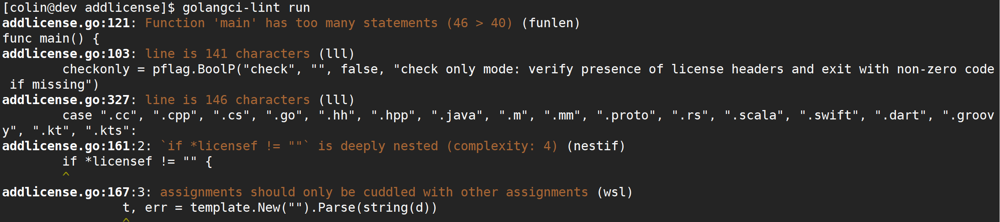
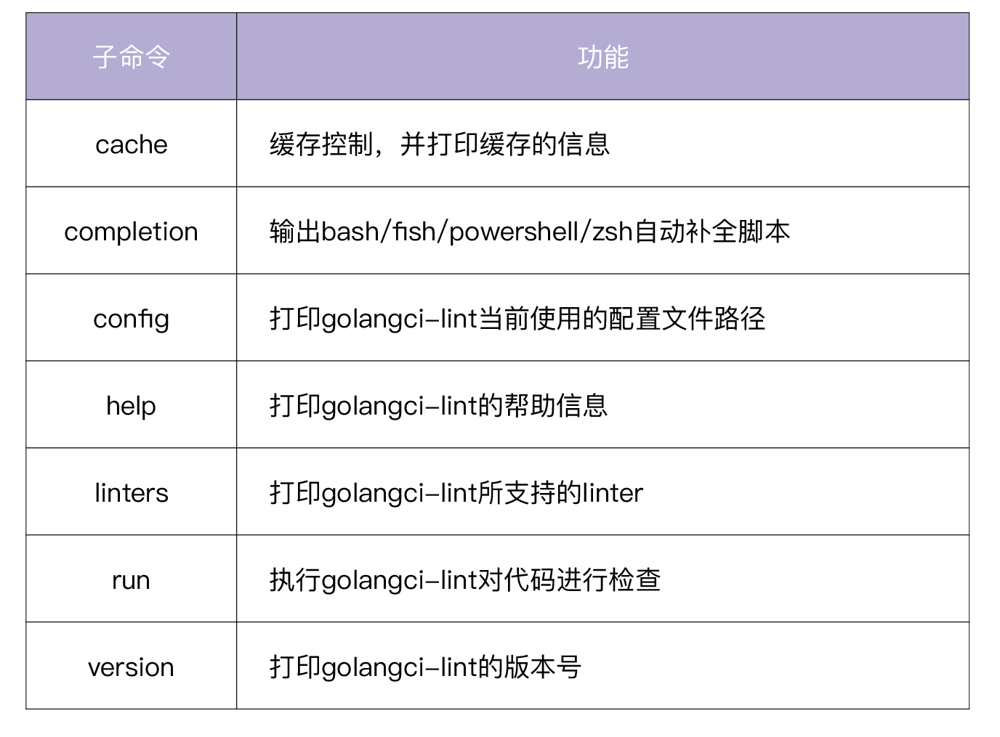
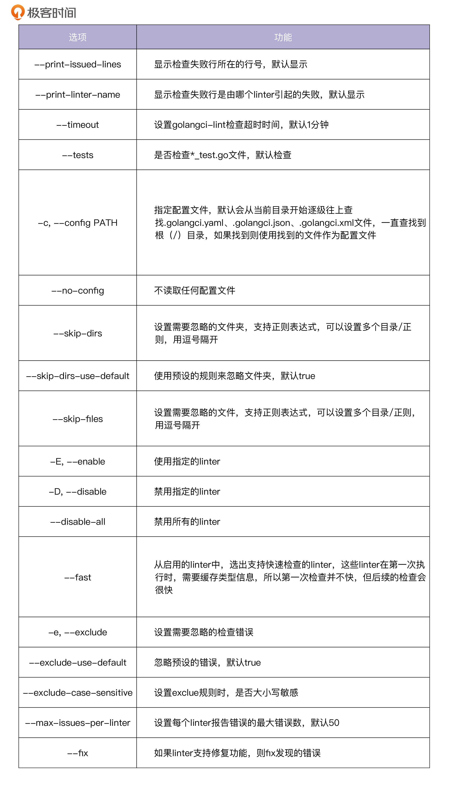

# 16 | 代码检查：如何进行静态代码检查？
你好，我是孔令飞。上一讲中，我在讲代码开发的具体步骤时，提到了静态代码检查，今天我就来详细讲讲如何执行静态代码检查。

在做Go项目开发的过程中，我们肯定需要对Go代码做静态代码检查。虽然Go命令提供了go vet和go tool vet，但是它们检查的内容还不够全面，我们需要一种更加强大的静态代码检查工具。

其实，Go生态中有很多这样的工具，也不乏一些比较优秀的。今天我想给你介绍的golangci-lint，是目前使用最多，也最受欢迎的静态代码检查工具，我们的IAM实战项目也用到了它。

接下来，我就从golangci-lint的优点、golangci-lint提供的命令和选项、golangci-lint的配置这三个方面来向你介绍下它。在你了解这些基础知识后，我会带着你使用golangci-lint进行静态代码检查，让你熟悉操作，在这个基础上，再把我使用golangci-lint时总结的一些经验技巧分享给你。

## 为什么选择golangci-lint做静态代码检查？

选择golangci-lint，是因为它具有其他静态代码检查工具不具备的一些优点。在我看来，它的核心优点至少有这些：

- 速度非常快：golangci-lint是基于gometalinter开发的，但是平均速度要比gometalinter快5倍。golangci-lint速度快的原因有三个：可以并行检查代码；可以复用go build缓存；会缓存分析结果。
- 可配置：支持YAML格式的配置文件，让检查更灵活，更可控。
- IDE集成：可以集成进多个主流的IDE，例如 VS Code、GNU Emacs、Sublime Text、Goland等。
- linter聚合器：1.41.1版本的golangci-lint集成了76个linter，不需要再单独安装这76个linter。并且golangci-lint还支持自定义linter。
- 最小的误报数：golangci-lint调整了所集成linter的默认设置，大幅度减少了误报。
- 良好的输出：输出的结果带有颜色、代码行号和linter标识，易于查看和定位。

下图是一个golangci-lint的检查结果：



你可以看到，输出的检查结果中包括如下信息：

- 检查出问题的源码文件、行号和错误行内容。
- 出问题的原因，也就是打印出不符合检查规则的原因。
- 报错的linter。

通过查看golangci-lint的输出结果，可以准确地定位到报错的位置，快速弄明白报错的原因，方便开发者修复。

除了上述优点之外，在我看来golangci-lint还有一个非常大的优点： **当前更新迭代速度很快，不断有新的linter被集成到golangci-lint中。** 有这么全的linter为你的代码保驾护航，你在交付代码时肯定会更有自信。

目前，有很多公司/项目使用了golangci-lint工具作为静态代码检查工具，例如 Google、Facebook、Istio、Red Hat OpenShift等。

## golangci-lint提供了哪些命令和选项？

在使用之前，首先需要 **安装golangci-lint**。golangci-lint的安装方法也很简单，你只需要执行以下命令，就可以安装了。

```
$ go get github.com/golangci/golangci-lint/cmd/golangci-lint@v1.41.1
$ golangci-lint version # 输出 golangci-lint 版本号，说明安装成功
golangci-lint has version v1.39.0 built from (unknown, mod sum: "h1:aAUjdBxARwkGLd5PU0vKuym281f2rFOyqh3GB4nXcq8=") on (unknown)

```

这里注意，为了避免安装失败，强烈建议你安装golangci-lint releases page中的指定版本，例如 v1.41.1。

另外，还建议你定期更新 golangci-lint 的版本，因为该项目正在被积极开发并不断改进。

安装之后，就可以使用了。我们可以通过执行 `golangci-lint -h` 查看其用法，golangci-lint支持的 **子命令** 见下表：



此外，golangci-lint还支持一些 **全局选项**。全局选项是指适用于所有子命令的选项，golangci-lint支持的全局选项如下：


接下来，我就详细介绍下golangci-lint支持的核心子命令：run、cache、completion、config、linters。

### run命令

run命令执行golangci-lint，对代码进行检查，是golangci-lint最为核心的一个命令。run没有子命令，但有很多选项。run命令的具体使用方法，我会在讲解如何执行静态代码检查的时候详细介绍。

### cache命令

cache命令用来进行缓存控制，并打印缓存的信息。它包含两个子命令：

- clean用来清除cache，当我们觉得cache的内容异常，或者cache占用空间过大时，可以通过 `golangci-lint cache clean` 清除cache。
- status用来打印cache的状态，比如cache的存放目录和cache的大小，例如：

```
$ golangci-lint cache status
Dir: /home/colin/.cache/golangci-lint
Size: 773.4KiB

```

### completion命令

completion命令包含4个子命令bash、fish、powershell和zsh，分别用来输出bash、fish、powershell和zsh的自动补全脚本。

下面是一个配置bash自动补全的示例：

```
$ golangci-lint completion bash > ~/.golangci-lint.bash
$ echo "source '$HOME/.golangci-lint.bash'" >> ~/.bashrc
$ source ~/.bashrc

```

执行完上面的命令，键入如下命令，即可自动补全子命令：

```
$ golangci-lint comp<TAB>

```

上面的命令行会自动补全为 `golangci-lint completion` 。

### config命令

config命令可以打印golangci-lint当前使用的配置文件路径，例如：

```
$ golangci-lint config path
.golangci.yaml

```

### linters命令

linters命令可以打印出golangci-lint所支持的linter，并将这些linter分成两类，分别是配置为启用的linter和配置为禁用的linter，例如：

```
$ golangci-lint linters
Enabled by your configuration linters:
...
deadcode: Finds unused code [fast: true, auto-fix: false]
...
Disabled by your configuration linters:
exportloopref: checks for pointers to enclosing loop variables [fast: true, auto-fix: false]
...

```

上面我介绍了golangci-lint提供的命令，接下来，我们再来看下golangci-lint的配置。

## golangci-lint配置

和其他linter相比，golangci-lint一个非常大的优点是使用起来非常灵活，这要得益于它对自定义配置的支持。

golangci-lint支持两种配置方式，分别是命令行选项和配置文件。如果bool/string/int的选项同时在命令行选项和配置文件中被指定，命令行的选项就会覆盖配置文件中的选项。如果是slice类型的选项，则命令行和配置中的配置会进行合并。

`golangci-lint run` 支持很多 **命令行选项**，可通过 `golangci-lint run -h` 查看，这里选择一些比较重要的选项进行介绍，见下表：



此外，我们还可以通过golangci-lint **配置文件** 进行配置，默认的配置文件名为.golangci.yaml、.golangci.toml、.golangci.json，可以通过 `-c` 选项指定配置文件名。通过配置文件，可以实现下面几类功能：

- golangci-lint本身的一些选项，比如超时、并发，是否检查 `*_test.go` 文件等。
- 配置需要忽略的文件和文件夹。
- 配置启用哪些linter，禁用哪些linter。
- 配置输出格式。
- golangci-lint支持很多linter，其中有些linter支持一些配置项，这些配置项可以在配置文件中配置。
- 配置符合指定正则规则的文件可以忽略的linter。
- 设置错误严重级别，像日志一样，检查错误也是有严重级别的。

更详细的配置内容，你可以参考 [Configuration](https://golangci-lint.run/usage/configuration/)。另外，你也可以参考IAM项目的golangci-lint配置 [.golangci.yaml](https://github.com/marmotedu/iam/blob/master/.golangci.yaml)。.golangci.yaml里面的一些配置，我建议你一定要设置，具体如下：

```
run:
  skip-dirs: # 设置要忽略的目录
    - util
    - .*~
    - api/swagger/docs
  skip-files: # 设置不需要检查的go源码文件，支持正则匹配，这里建议包括：_test.go
    - ".*\\.my\\.go$"
    - _test.go
linters-settings:
  errcheck:
    check-type-assertions: true # 这里建议设置为true，如果确实不需要检查，可以写成`num, _ := strconv.Atoi(numStr)`
    check-blank: false
  gci:
    # 将以`github.com/marmotedu/iam`开头的包放在第三方包后面
    local-prefixes: github.com/marmotedu/iam
  godox:
    keywords: # 建议设置为BUG、FIXME、OPTIMIZE、HACK
      - BUG
      - FIXME
      - OPTIMIZE
      - HACK
  goimports:
    # 设置哪些包放在第三方包后面，可以设置多个包，逗号隔开
    local-prefixes: github.com/marmotedu/iam
  gomoddirectives: # 设置允许在go.mod中replace的包
    replace-local: true
    replace-allow-list:
      - github.com/coreos/etcd
      - google.golang.org/grpc
      - github.com/marmotedu/api
      - github.com/marmotedu/component-base
      - github.com/marmotedu/marmotedu-sdk-go
  gomodguard: # 下面是根据需要选择可以使用的包和版本，建议设置
    allowed:
      modules:
        - gorm.io/gorm
        - gorm.io/driver/mysql
        - k8s.io/klog
      domains: # List of allowed module domains
        - google.golang.org
        - gopkg.in
        - golang.org
        - github.com
        - go.uber.org
    blocked:
      modules:
        - github.com/pkg/errors:
            recommendations:
              - github.com/marmotedu/errors
            reason: "`github.com/marmotedu/errors` is the log package used by marmotedu projects."
      versions:
        - github.com/MakeNowJust/heredoc:
            version: "> 2.0.9"
            reason: "use the latest version"
      local_replace_directives: false
  lll:
    line-length: 240 # 这里可以设置为240，240一般是够用的
  importas: # 设置包的alias，根据需要设置
    jwt: github.com/appleboy/gin-jwt/v2
    metav1: github.com/marmotedu/component-base/pkg/meta/v1

```

需要注意的是，golangci-lint不建议使用 `enable-all: true` 选项，为了尽可能使用最全的linters，我们可以使用以下配置：

```
linters:
  disable-all: true
  enable: # enable下列出 <期望的所有linters>
    - typecheck
    - ...

```

`<期望的所有linters> = <golangci-lint支持的所有linters> - <不期望执行的linters>`，我们可以通过执行以下命令来获取：

```
$ ./scripts/print_enable_linters.sh
    - asciicheck
    - bodyclose
    - cyclop
    - deadcode
    - ...

```

将以上输出结果替换掉.golangci.yaml配置文件中的 `linters.enable` 部分即可。

上面我们介绍了与golangci-lint相关的一些基础知识，接下来我就给你详细展示下，如何使用golangci-lint进行静态代码检查。

## 如何使用golangci-lint进行静态代码检查？

要对代码进行静态检查，只需要执行 `golangci-lint run` 命令即可。接下来，我会先给你介绍5种常见的golangci-lint使用方法。

1. 对当前目录及子目录下的所有Go文件进行静态代码检查：

```
$ golangci-lint run

```

命令等效于 `golangci-lint run ./...`。

1. 对指定的Go文件或者指定目录下的Go文件进行静态代码检查：

```
$ golangci-lint run dir1 dir2/... dir3/file1.go

```

这里需要你注意：上述命令不会检查dir1下子目录的Go文件，如果想递归地检查一个目录，需要在目录后面追加 `/...`，例如： `dir2/...`。

1. 根据指定配置文件，进行静态代码检查：

```
$ golangci-lint run -c .golangci.yaml ./...

```

1. 运行指定的linter：

golangci-lint可以在不指定任何配置文件的情况下运行，这会运行默认启用的linter，你可以通过 `golangci-lint help linters` 查看它。

你可以传入参数 `-E/--enable` 来使某个linter可用，也可以使用 `-D/--disable` 参数来使某个linter不可用。下面的示例仅仅启用了errcheck linter：

```
$ golangci-lint run --no-config --disable-all -E errcheck ./...

```

这里你需要注意，默认情况下，golangci-lint会从当前目录一层层往上寻找配置文件名 `.golangci.yaml`、 `.golangci.toml`、 `.golangci.json` 直到根（/）目录。如果找到，就以找到的配置文件作为本次运行的配置文件，所以为了防止读取到未知的配置文件，可以用 `--no-config` 参数使golangci-lint不读取任何配置文件。

1. 禁止运行指定的liner：

如果我们想禁用某些linter，可以使用 `-D` 选项。

```
$ golangci-lint run --no-config -D godot,errcheck

```

在使用golangci-lint进行代码检查时，可能会有很多误报。所谓的误报，其实是我们希望golangci-lint的一些linter能够容忍某些issue。那么如何尽可能减少误报呢？golangci-lint也提供了一些途径，我建议你使用下面这三种：

- 在命令行中添加 `-e` 参数，或者在配置文件的 `issues.exclude` 部分设置要排除的检查错误。你也可以使用 `issues.exclude-rules` 来配置哪些文件忽略哪些linter。
- 通过 `run.skip-dirs`、 `run.skip-files` 或者 `issues.exclude-rules` 配置项，来忽略指定目录下的所有Go文件，或者指定的Go文件。
- 通过在Go源码文件中添加 `//nolint` 注释，来忽略指定的代码行。

因为golangci-lint设置了很多linters，对于一个大型项目，启用所有的linter会检查出很多问题，并且每个项目对linter检查的粒度要求也不一样，所以glangci-lint **使用nolint标记来开关某些检查项**，不同位置的nolint标记效果也会不一样。接下来我想向你介绍nolint的几种用法。

1. 忽略某一行所有linter的检查

```
var bad_name int //nolint

```

1. 忽略某一行指定linter的检查，可以指定多个linter，用逗号 `,` 隔开。

```
var bad_name int //nolint:golint,unused

```

1. 忽略某个代码块的检查。

```
//nolint
func allIssuesInThisFunctionAreExcluded() *string {
  // ...
}

//nolint:govet
var (
  a int
  b int
)

```

1. 忽略某个文件的指定linter检查。

在package xx 上面一行添加 `//nolint` 注释。

```
//nolint:unparam
package pkg
...

```

在使用nolint的过程中，有3个地方需要你注意。

首先，如果启用了nolintlint，你就需要在 `//nolint` 后面添加nolint的原因 `// xxxx`。

其次，你使用的应该是 `//nolint` 而不是 `// nolint`。因为根据Go的规范，需要程序读取的注释//后面不应该有空格。

最后，如果要忽略所有linter，可以用 `//nolint`；如果要忽略某个指定的linter，可以用 `//nolint:<linter1>,<linter2>`。

## golangci-lint使用技巧

我在使用golangci-lint时，总结了一些经验技巧，放在这里供你参考，希望能够帮助你更好地使用golangci-lint。

**技巧1：第一次修改，可以按目录修改。**

如果你第一次使用golangci-lint检查你的代码，一定会有很多错误。为了减轻修改的压力，可以按目录检查代码并修改。这样可以有效减少失败条数，减轻修改压力。

当然，如果错误太多，一时半会儿改不完，想以后慢慢修改或者干脆不修复存量的issues，那么你可以使用golangci-lint的 `--new-from-rev` 选项，只检查新增的code，例如：

```
$ golangci-lint run --new-from-rev=HEAD~1

```

**技巧2：按文件修改，减少文件切换次数，提高修改效率。**

如果有很多检查错误，涉及很多文件，建议先修改一个文件，这样就不用来回切换文件。可以通过grep过滤出某个文件的检查失败项，例如：

```
$ golangci-lint run ./...|grep pkg/storage/redis_cluster.go
pkg/storage/redis_cluster.go:16:2: "github.com/go-redis/redis/v7" imported but not used (typecheck)
pkg/storage/redis_cluster.go:82:28: undeclared name: `redis` (typecheck)
pkg/storage/redis_cluster.go:86:14: undeclared name: `redis` (typecheck)
...

```

**技巧3：把linters-setting.lll.line-length设置得大一些。**

在Go项目开发中，为了易于阅读代码，通常会将变量名/函数/常量等命名得有意义，这样很可能导致每行的代码长度过长，很容易超过 `lll` linter设置的默认最大长度80。这里建议将 `linters-setting.lll.line-length` 设置为120/240。

**技巧4：尽可能多地使用golangci-lint提供的linter。**

golangci-lint集成了很多linters，可以通过如下命令查看：

```
$ golangci-lint linters
Enabled by your configuration linters:
deadcode: Finds unused code [fast: true, auto-fix: false]
...
varcheck: Finds unused global variables and constants [fast: true, auto-fix: false]

Disabled by your configuration linters:
asciicheck: Simple linter to check that your code does not contain non-ASCII identifiers [fast: true, auto-fix: false]
...
wsl: Whitespace Linter - Forces you to use empty lines! [fast: true, auto-fix: false]

```

这些linter分为两类，一类是默认启用的，另一类是默认禁用的。每个linter都有两个属性：

- fast：true/false，如果为true，说明该linter可以缓存类型信息，支持快速检查。因为第一次缓存了这些信息，所以后续的运行会非常快。
- auto-fix：true/false，如果为true说明该linter支持自动修复发现的错误；如果为false说明不支持自动修复。

如果配置了golangci-lint配置文件，则可以通过命令 `golangci-lint help linters` 查看在当前配置下启用和禁用了哪些linter。golangci-lint也支持自定义linter插件，具体你可以参考： [New linters](https://golangci-lint.run/contributing/new-linters)。

在使用golangci-lint的时候，我们要尽可能多的使用linter。使用的linter越多，说明检查越严格，意味着代码越规范，质量越高。如果时间和精力允许，建议打开golangci-lint提供的所有linter。

**技巧5：每次修改代码后，都要执行golangci-lint。**

每次修改完代码后都要执行golangci-lint，一方面可以及时修改不规范的地方，另一方面可以减少错误堆积，减轻后面的修改压力。

**技巧6：建议在根目录下放一个通用的golangci-lint配置文件。**

在 `/` 目录下存放通用的golangci-lint配置文件，可以让你不用为每一个项目都配置golangci-lint。当你需要为某个项目单独配置golangci-lint时，只需在该项目根目录下增加一个项目级别的golangci-lint配置文件即可。

## 总结

Go项目开发中，对代码进行静态代码检查是必要的操作。当前有很多优秀的静态代码检查工具，但golangci-lint因为具有检查速度快、可配置、少误报、内置了大量linter等优点，成为了目前最受欢迎的静态代码检查工具。

golangci-lint功能非常强大，支持诸如run、cache、completion、linters等命令。其中最常用的是run命令，run命令可以通过以下方式来进行静态代码检查：

```
$ golangci-lint run #  对当前目录及子目录下的所有Go文件进行静态代码检查
$ golangci-lint run dir1 dir2/... dir3/file1.go # 对指定的Go文件或者指定目录下的Go文件进行静态代码检查
$ golangci-lint run -c .golangci.yaml ./... # 根据指定配置文件，进行静态代码检查
$ golangci-lint run --no-config --disable-all -E errcheck ./... # 运行指定的 errcheck linter
$ golangci-lint run --no-config -D godot,errcheck # 禁止运行指定的godot,errcheck liner

```

此外，golangci-lint还支持 `//nolint` 、 `//nolint:golint,unused` 等方式来减少误报。

最后，我分享了一些自己使用golangci-lint时总结的经验。例如：第一次修改，可以按目录修改；按文件修改，减少文件切换次数，提高修改效率；尽可能多地使用golangci-lint提供的linter。希望这些建议对你使用golangci-lint有一定帮助。

## 课后练习

1. 执行 `golangci-lint linters` 命令，查看golangci-lint支持哪些linter，以及这些linter的作用。
2. 思考下，如何在golangci-lint中集成自定义的linter。

如果遇到任何疑问，欢迎你在留言区与我交流讨论，我们下一讲见。