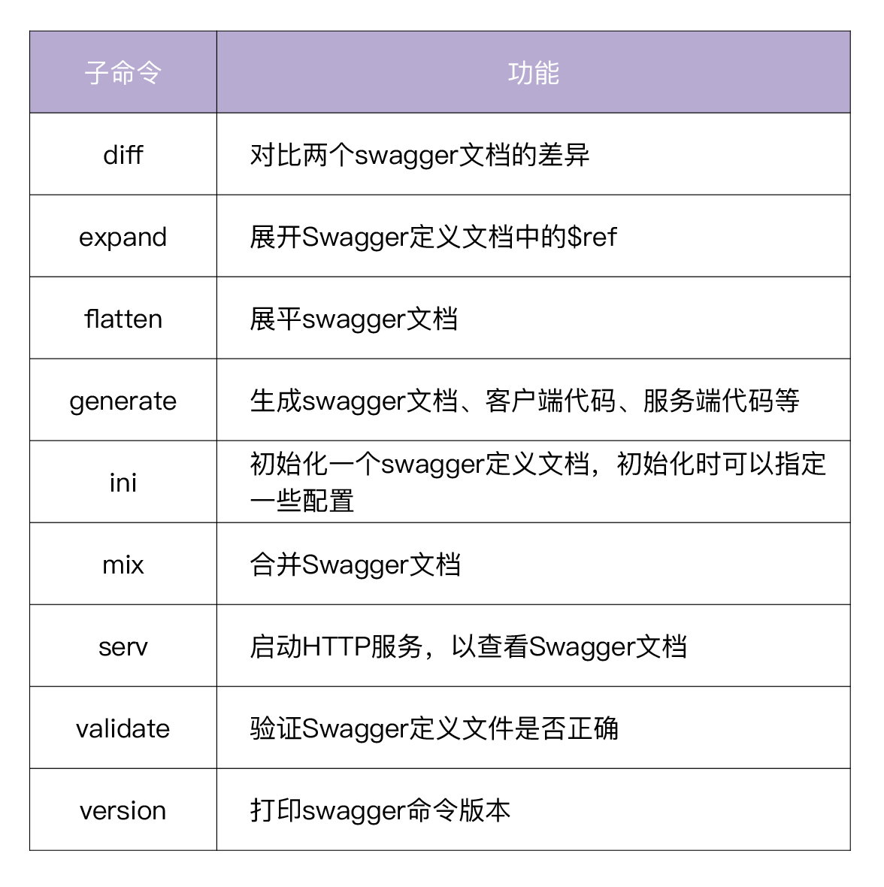
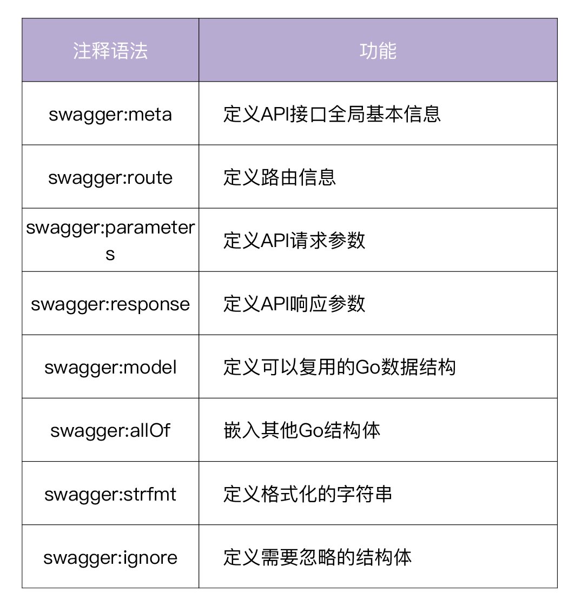
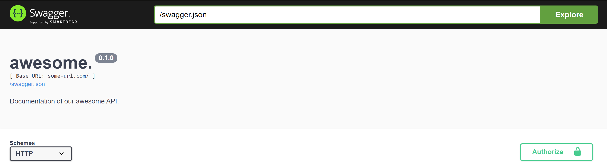
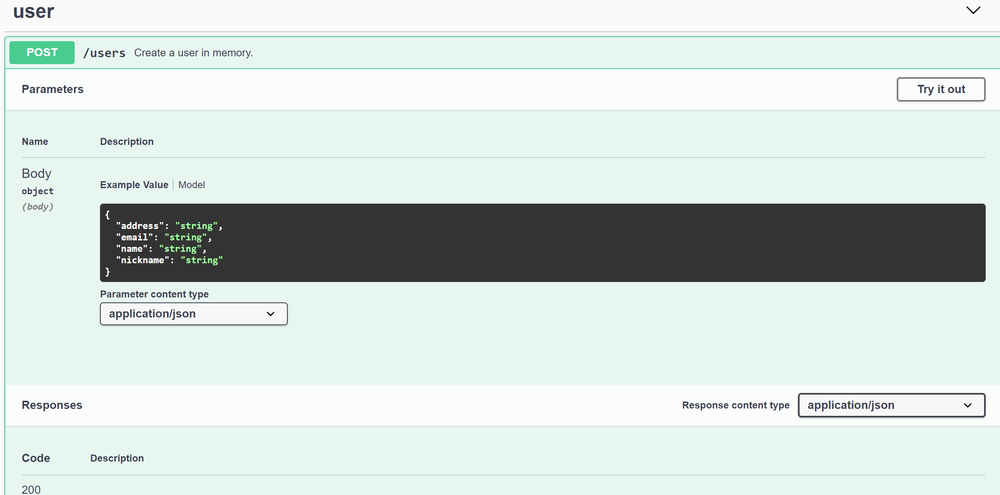
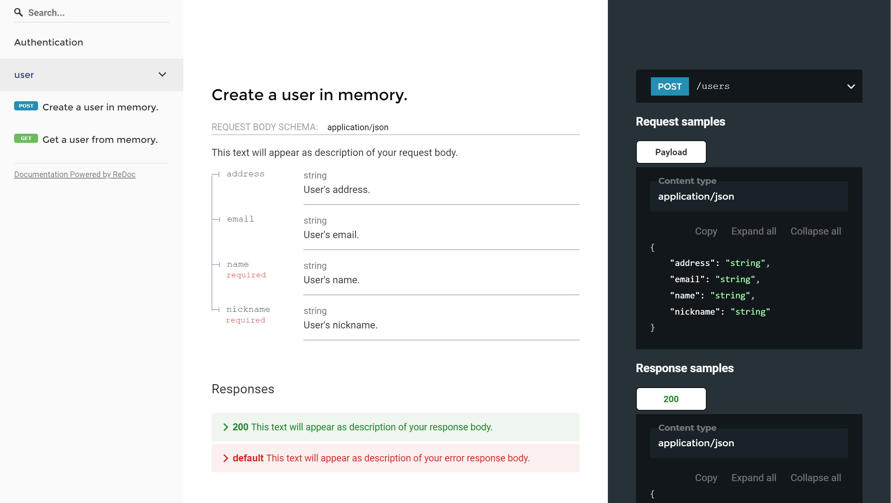
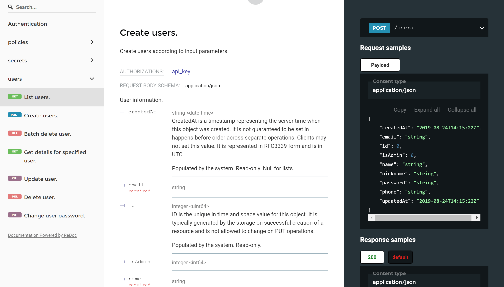
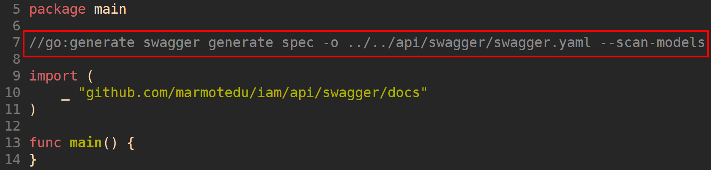

# 17 | API 文档：如何生成 Swagger API 文档 ？
你好，我是孔令飞。

作为一名开发者，我们通常讨厌编写文档，因为这是一件重复和缺乏乐趣的事情。但是在开发过程中，又有一些文档是我们必须要编写的，比如API文档。

一个企业级的Go后端项目，通常也会有个配套的前端。为了加快研发进度，通常是后端和前端并行开发，这就需要后端开发者在开发后端代码之前，先设计好API接口，提供给前端。所以在设计阶段，我们就需要生成API接口文档。

一个好的API文档，可以减少用户上手的复杂度，也意味着更容易留住用户。好的API文档也可以减少沟通成本，帮助开发者更好地理解API的调用方式，从而节省时间，提高开发效率。这时候，我们一定希望有一个工具能够帮我们自动生成API文档，解放我们的双手。Swagger就是这么一个工具，可以帮助我们 **生成易于共享且具有足够描述性的API文档**。

接下来，我们就来看下，如何使用Swagger生成API文档。

## Swagger介绍

Swagger是一套围绕OpenAPI规范构建的开源工具，可以设计、构建、编写和使用REST API。Swagger包含很多工具，其中主要的Swagger工具包括：

- **Swagger编辑器：** 基于浏览器的编辑器，可以在其中编写OpenAPI规范，并实时预览API文档。 [https://editor.swagger.io](https://editor.swagger.io/) 就是一个Swagger编辑器，你可以尝试在其中编辑和预览API文档。
- **Swagger UI：** 将OpenAPI 规范呈现为交互式API文档，并可以在浏览器中尝试API调用。
- **Swagger Codegen：** 根据OpenAPI规范，生成服务器存根和客户端代码库，目前已涵盖了40多种语言。

### Swagger和OpenAPI的区别

我们在谈到Swagger时，也经常会谈到OpenAPI。那么二者有什么区别呢？

OpenAPI是一个API规范，它的前身叫Swagger规范，通过定义一种用来描述API格式或API定义的语言，来规范RESTful服务开发过程，目前最新的OpenAPI规范是 [OpenAPI 3.0](https://swagger.io/docs/specification)（也就是Swagger 2.0规范）。

OpenAPI规范规定了一个API必须包含的基本信息，这些信息包括：

- 对API的描述，介绍API可以实现的功能。
- 每个API上可用的路径（/users）和操作（GET /users，POST /users）。
- 每个API的输入/返回的参数。
- 验证方法。
- 联系信息、许可证、使用条款和其他信息。

所以，你可以简单地这么理解：OpenAPI是一个API规范，Swagger则是实现规范的工具。

另外，要编写Swagger文档，首先要会使用Swagger文档编写语法，因为语法比较多，这里就不多介绍了，你可以参考Swagger官方提供的 [OpenAPI Specification](https://swagger.io/specification/) 来学习。

## 用go-swagger来生成Swagger API文档

在Go项目开发中，我们可以通过下面两种方法来生成Swagger API文档：

第一，如果你熟悉Swagger语法的话，可以直接编写JSON/YAML格式的Swagger文档。建议选择YAML格式，因为它比JSON格式更简洁直观。

第二，通过工具生成Swagger文档，目前可以通过 [swag](https://github.com/swaggo/swag) 和 [go-swagger](https://github.com/go-swagger/go-swagger) 两个工具来生成。

对比这两种方法，直接编写Swagger文档，不比编写Markdown格式的API文档工作量小，我觉得不符合程序员“偷懒”的习惯。所以，本专栏我们就使用go-swagger工具，基于代码注释来自动生成Swagger文档。为什么选go-swagger呢？有这么几个原因：

- go-swagger比swag功能更强大：go-swagger提供了更灵活、更多的功能来描述我们的API。
- 使我们的代码更易读：如果使用swag，我们每一个API都需要有一个冗长的注释，有时候代码注释比代码还要长，但是通过go-swagger我们可以将代码和注释分开编写，一方面可以使我们的代码保持简洁，清晰易读，另一方面我们可以在另外一个包中，统一管理这些Swagger API文档定义。
- 更好的社区支持：go-swagger目前有非常多的Github star数，出现Bug的概率很小，并且处在一个频繁更新的活跃状态。

你已经知道了，go-swagger是一个功能强大的、高性能的、可以根据代码注释生成Swagger API文档的工具。除此之外，go-swagger还有很多其他特性：

- 根据Swagger定义文件生成服务端代码。
- 根据Swagger定义文件生成客户端代码。
- 校验Swagger定义文件是否正确。
- 启动一个HTTP服务器，使我们可以通过浏览器访问API文档。
- 根据Swagger文档定义的参数生成Go model结构体定义。

可以看到，使用go-swagger生成Swagger文档，可以帮助我们减少编写文档的时间，提高开发效率，并能保证文档的及时性和准确性。

这里需要注意，如果我们要对外提供API的Go SDK，可以考虑使用go-swagger来生成客户端代码。但是我觉得go-swagger生成的服务端代码不够优雅，所以建议你自行编写服务端代码。

目前，有很多知名公司和组织的项目都使用了go-swagger，例如 Moby、CoreOS、Kubernetes、Cilium等。

### 安装Swagger工具

go-swagger通过swagger命令行工具来完成其功能，swagger安装方法如下：

```
$ go get -u github.com/go-swagger/go-swagger/cmd/swagger
$ swagger version
dev

```

### swagger命令行工具介绍

swagger命令格式为 `swagger [OPTIONS] <command>`。可以通过 `swagger -h` 查看swagger使用帮助。swagger提供的子命令及功能见下表：



## 如何使用swagger命令生成Swagger文档？

go-swagger通过解析源码中的注释来生成Swagger文档，go-swagger的详细注释语法可参考 [官方文档](https://goswagger.io)。常用的有如下几类注释语法：



### 解析注释生成Swagger文档

swagger generate命令会找到main函数，然后遍历所有源码文件，解析源码中与Swagger相关的注释，然后自动生成swagger.json/swagger.yaml文件。

这一过程的示例代码为 [gopractise-demo/swagger](https://github.com/marmotedu/gopractise-demo/tree/main/swagger)。目录下有一个main.go文件，定义了如下API接口：

```
package main

import (
    "fmt"
    "log"
    "net/http"

    "github.com/gin-gonic/gin"

    "github.com/marmotedu/gopractise-demo/swagger/api"
    // This line is necessary for go-swagger to find your docs!
    _ "github.com/marmotedu/gopractise-demo/swagger/docs"
)

var users []*api.User

func main() {
    r := gin.Default()
    r.POST("/users", Create)
    r.GET("/users/:name", Get)

    log.Fatal(r.Run(":5555"))
}

// Create create a user in memory.
func Create(c *gin.Context) {
    var user api.User
    if err := c.ShouldBindJSON(&user); err != nil {
        c.JSON(http.StatusBadRequest, gin.H{"message": err.Error(), "code": 10001})
        return
    }

    for _, u := range users {
        if u.Name == user.Name {
            c.JSON(http.StatusBadRequest, gin.H{"message": fmt.Sprintf("user %s already exist", user.Name), "code": 10001})
            return
        }
    }

    users = append(users, &user)
    c.JSON(http.StatusOK, user)
}

// Get return the detail information for a user.
func Get(c *gin.Context) {
    username := c.Param("name")
    for _, u := range users {
        if u.Name == username {
            c.JSON(http.StatusOK, u)
            return
        }
    }

    c.JSON(http.StatusBadRequest, gin.H{"message": fmt.Sprintf("user %s not exist", username), "code": 10002})
}

```

main包中引入的 **User struct** 位于gopractise-demo/swagger/api目录下的 [user.go](https://github.com/marmotedu/gopractise-demo/blob/main/swagger/api/user.go) 文件：

```
// Package api defines the user model.
package api

// User represents body of User request and response.
type User struct {
    // User's name.
    // Required: true
    Name string `json:"name"`

    // User's nickname.
    // Required: true
    Nickname string `json:"nickname"`

    // User's address.
    Address string `json:"address"`

    // User's email.
    Email string `json:"email"`
}

```

`// Required: true` 说明字段是必须的，生成Swagger文档时，也会在文档中声明该字段是必须字段。

为了使代码保持简洁，我们在另外一个Go包中编写带go-swagger注释的API文档。假设该Go包名字为docs，在开始编写Go API注释之前，需要在main.go文件中导入docs包：

```
_ "github.com/marmotedu/gopractise-demo/swagger/docs"

```

通过导入docs包，可以使go-swagger在递归解析main包的依赖包时，找到docs包，并解析包中的注释。

在gopractise-demo/swagger目录下，创建docs文件夹：

```
$ mkdir docs
$ cd docs

```

在docs目录下，创建一个doc.go文件，在该文件中提供API接口的基本信息：

```
// Package docs awesome.
//
// Documentation of our awesome API.
//
//     Schemes: http, https
//     BasePath: /
//     Version: 0.1.0
//     Host: some-url.com
//
//     Consumes:
//     - application/json
//
//     Produces:
//     - application/json
//
//     Security:
//     - basic
//
//    SecurityDefinitions:
//    basic:
//      type: basic
//
// swagger:meta
package docs

```

**Package docs** 后面的字符串 `awesome` 代表我们的HTTP服务名。 `Documentation of our awesome API` 是我们API的描述。其他都是go-swagger可识别的注释，代表一定的意义。最后以 `swagger:meta` 注释结束。

编写完doc.go文件后，进入gopractise-demo/swagger目录，执行如下命令，生成Swagger API文档，并启动HTTP服务，在浏览器查看Swagger：

```
$ swagger generate spec -o swagger.yaml
$ swagger serve --no-open -F=swagger --port 36666 swagger.yaml

2020/10/20 23:16:47 serving docs at http://localhost:36666/docs

```

- -o：指定要输出的文件名。swagger会根据文件名后缀.yaml或者.json，决定生成的文件格式为YAML或JSON。
- –no-open：因为是在Linux服务器下执行命令，没有安装浏览器，所以使–no-open禁止调用浏览器打开URL。
- -F：指定文档的风格，可选swagger和redoc。我选用了redoc，因为觉得redoc格式更加易读和清晰。
- –port：指定启动的HTTP服务监听端口。

打开浏览器，访问 [http://localhost:36666/docs](http://url) ，如下图所示：



如果我们想要JSON格式的Swagger文档，可执行如下命令，将生成的swagger.yaml转换为swagger.json：

```
$ swagger generate spec -i ./swagger.yaml -o ./swagger.json

```

接下来，我们就可以编写API接口的定义文件（位于 [gopractise-demo/swagger/docs/user.go](https://github.com/marmotedu/gopractise-demo/blob/main/swagger/docs/user.go) 文件中）：

```
package docs

import (
    "github.com/marmotedu/gopractise-demo/swagger/api"
)

// swagger:route POST /users user createUserRequest
// Create a user in memory.
// responses:
//   200: createUserResponse
//   default: errResponse

// swagger:route GET /users/{name} user getUserRequest
// Get a user from memory.
// responses:
//   200: getUserResponse
//   default: errResponse

// swagger:parameters createUserRequest
type userParamsWrapper struct {
    // This text will appear as description of your request body.
    // in:body
    Body api.User
}

// This text will appear as description of your request url path.
// swagger:parameters getUserRequest
type getUserParamsWrapper struct {
    // in:path
    Name string `json:"name"`
}

// This text will appear as description of your response body.
// swagger:response createUserResponse
type createUserResponseWrapper struct {
    // in:body
    Body api.User
}

// This text will appear as description of your response body.
// swagger:response getUserResponse
type getUserResponseWrapper struct {
    // in:body
    Body api.User
}

// This text will appear as description of your error response body.
// swagger:response errResponse
type errResponseWrapper struct {
    // Error code.
    Code int `json:"code"`

    // Error message.
    Message string `json:"message"`
}

```

user.go文件说明：

- swagger:route： `swagger:route` 代表API接口描述的开始，后面的字符串格式为 `HTTP方法 URL Tag ID`。可以填写多个tag，相同tag的API接口在Swagger文档中会被分为一组。ID是一个标识符， `swagger:parameters` 是具有相同ID的 `swagger:route` 的请求参数。 `swagger:route` 下面的一行是该API接口的描述，需要以英文点号为结尾。 `responses:` 定义了API接口的返回参数，例如当HTTP状态码是200时，返回createUserResponse，createUserResponse会跟 `swagger:response` 进行匹配，匹配成功的 `swagger:response` 就是该API接口返回200状态码时的返回。
- swagger:response： `swagger:response` 定义了API接口的返回，例如getUserResponseWrapper，关于名字，我们可以根据需要自由命名，并不会带来任何不同。getUserResponseWrapper中有一个Body字段，其注释为 `// in:body`，说明该参数是在HTTP Body中返回。 `swagger:response` 之上的注释会被解析为返回参数的描述。api.User自动被go-swagger解析为 `Example Value` 和 `Model`。我们不用再去编写重复的返回字段，只需要引用已有的Go结构体即可，这也是通过工具生成Swagger文档的魅力所在。
- swagger:parameters： `swagger:parameters` 定义了API接口的请求参数，例如userParamsWrapper。userParamsWrapper之上的注释会被解析为请求参数的描述， `// in:body` 代表该参数是位于HTTP Body中。同样，userParamsWrapper结构体名我们也可以随意命名，不会带来任何不同。 `swagger:parameters` 之后的createUserRequest会跟 `swagger:route` 的ID进行匹配，匹配成功则说明是该ID所在API接口的请求参数。

进入gopractise-demo/swagger目录，执行如下命令，生成Swagger API文档，并启动HTTP服务，在浏览器查看Swagger：

```
$ swagger generate spec -o swagger.yaml
$ swagger serve --no-open -F=swagger --port 36666 swagger.yaml
2020/10/20 23:28:30 serving docs at http://localhost:36666/docs

```

打开浏览器，访问 [http://localhost:36666/docs](http://localhost:36666/docs) ，如下图所示：



上面我们生成了swagger风格的UI界面，我们也可以使用redoc风格的UI界面，如下图所示：



### go-swagger其他常用功能介绍

上面，我介绍了swagger最常用的generate、serve命令，关于swagger其他有用的命令，这里也简单介绍一下。

1. 对比Swagger文档

```
$ swagger diff -d change.log swagger.new.yaml swagger.old.yaml
$ cat change.log

BREAKING CHANGES:
=================
/users:post Request - Body.Body.nickname.address.email.name.Body : User - Deleted property
compatibility test FAILED: 1 breaking changes detected

```

1. 生成服务端代码

我们也可以先定义Swagger接口文档，再用swagger命令，基于Swagger接口文档生成服务端代码。假设我们的应用名为go-user，进入gopractise-demo/swagger目录，创建go-user目录，并生成服务端代码：

```
$ mkdir go-user
$ cd go-user
$ swagger generate server -f ../swagger.yaml -A go-user

```

上述命令会在当前目录生成cmd、restapi、models文件夹，可执行如下命令查看server组件启动方式：

```
$ go run cmd/go-user-server/main.go -h

```

1. 生成客户端代码

在go-user目录下执行如下命令：

```
$ swagger generate client -f ../swagger.yaml -A go-user

```

上述命令会在当前目录生成client，包含了API接口的调用函数，也就是API接口的Go SDK。

1. 验证Swagger文档是否合法

```
$ swagger validate swagger.yaml
2020/10/21 09:53:18
The swagger spec at "swagger.yaml" is valid against swagger specification 2.0

```

1. 合并Swagger文档

```
$ swagger mixin swagger_part1.yaml swagger_part2.yaml

```

## IAM Swagger文档

IAM的Swagger文档定义在 [iam/api/swagger/docs](https://github.com/marmotedu/iam/tree/v1.0.0/api/swagger/docs) 目录下，遵循go-swagger规范进行定义。

[iam/api/swagger/docs/doc.go](https://github.com/marmotedu/iam/blob/v1.0.0/api/swagger/docs/doc.go) 文件定义了更多Swagger文档的基本信息，比如开源协议、联系方式、安全认证等。

更详细的定义，你可以直接查看iam/api/swagger/docs目录下的Go源码文件。

为了便于生成文档和启动HTTP服务查看Swagger文档，该操作被放在Makefile中执行（位于 [iam/scripts/make-rules/swagger.mk](https://github.com/marmotedu/iam/blob/v1.0.0/scripts/make-rules/swagger.mk) 文件中）：

```
.PHONY: swagger.run
swagger.run: tools.verify.swagger
  @echo "===========> Generating swagger API docs"
  @swagger generate spec --scan-models -w $(ROOT_DIR)/cmd/genswaggertypedocs -o $(ROOT_DIR)/api/swagger/swagger.yaml

.PHONY: swagger.serve
swagger.serve: tools.verify.swagger
  @swagger serve -F=redoc --no-open --port 36666 $(ROOT_DIR)/api/swagger/swagger.yaml

```

Makefile文件说明：

- tools.verify.swagger：检查Linux系统是否安装了go-swagger的命令行工具swagger，如果没有安装则运行go get安装。
- swagger.run：运行 `swagger generate spec` 命令生成Swagger文档swagger.yaml，运行前会检查swagger是否安装。 `--scan-models` 指定生成的文档中包含带有swagger:model 注释的Go Models。 `-w` 指定swagger命令运行的目录。
- swagger.serve：运行 `swagger serve` 命令打开Swagger文档swagger.yaml，运行前会检查swagger是否安装。

在iam源码根目录下执行如下命令，即可生成并启动HTTP服务查看Swagger文档：

```
$ make swagger
$ make serve-swagger
2020/10/21 06:45:03 serving docs at http://localhost:36666/docs

```

打开浏览器，打开 `http://x.x.x.x:36666/docs` 查看Swagger文档，x.x.x.x是服务器的IP地址，如下图所示：



IAM的Swagger文档，还可以通过在iam源码根目录下执行 `go generate ./...` 命令生成，为此，我们需要在iam/cmd/genswaggertypedocs/swagger\_type\_docs.go文件中，添加 `//go:generate` 注释。如下图所示：



## 总结

在做Go服务开发时，我们要向前端或用户提供API文档，手动编写API文档工作量大，也难以维护。所以，现在很多项目都是自动生成Swagger格式的API文档。提到Swagger，很多开发者不清楚其和OpenAPI的区别，所以我也给你总结了：OpenAPI是一个API规范，Swagger则是实现规范的工具。

在Go中，用得最多的是利用go-swagger来生成Swagger格式的API文档。go-swagger包含了很多语法，我们可以访问 [Swagger 2.0](https://goswagger.io) 进行学习。学习完Swagger 2.0的语法之后，就可以编写swagger注释了，之后可以通过

```
$ swagger generate spec -o swagger.yaml

```

来生成swagger文档 swagger.yaml。通过

```
$ swagger serve --no-open -F=swagger --port 36666 swagger.yaml

```

来提供一个前端界面，供我们访问swagger文档。

为了方便管理，我们可以将 `swagger generate spec` 和 `swagger serve` 命令加入到Makefile文件中，通过Makefile来生成Swagger文档，并提供给前端界面。

## 课后练习

1. 尝试将你当前项目的一个API接口，用go-swagger生成swagger格式的API文档，如果中间遇到问题，欢迎在留言区与我讨论。
2. 思考下，为什么IAM项目的swagger定义文档会放在iam/api/swagger/docs目录下，这样做有什么好处？

欢迎你在留言区与我交流讨论，我们下一讲见。