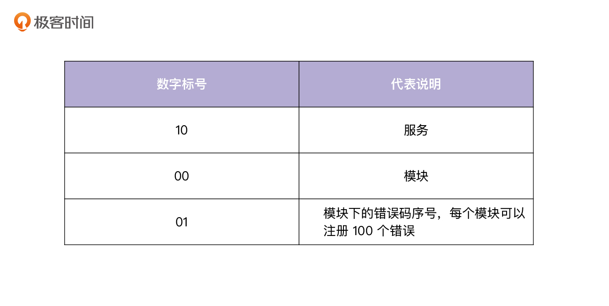
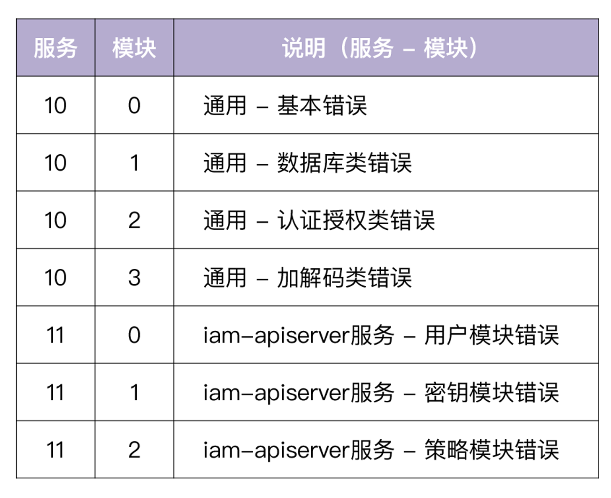
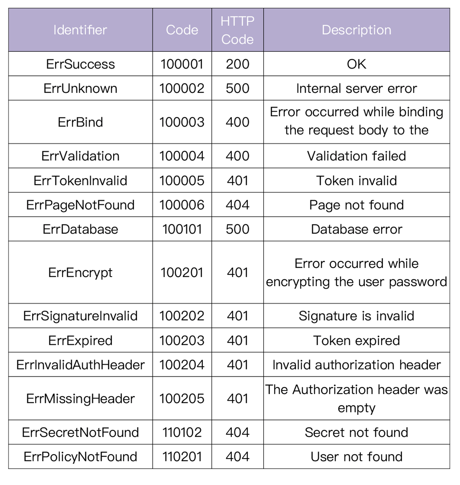
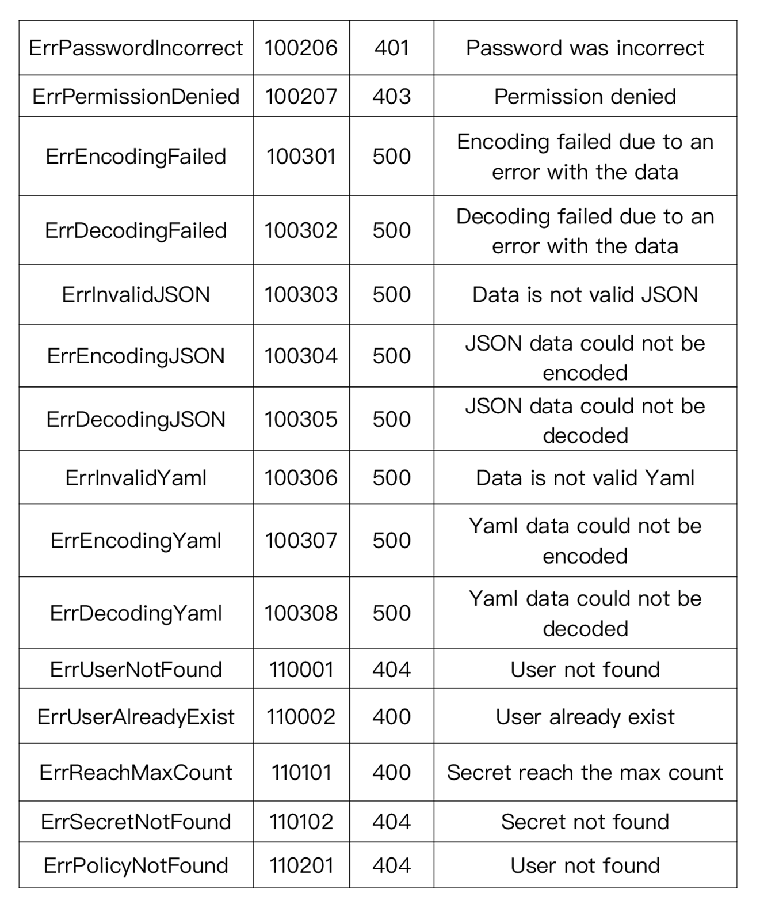

# 18 | 错误处理（上）：如何设计一套科学的错误码？
你好，我是孔令飞。今天我们来聊聊如何设计业务的错误码。

现代的软件架构，很多都是对外暴露RESTful API接口，内部系统通信采用RPC协议。因为RESTful API接口有一些天生的优势，比如规范、调试友好、易懂，所以通常作为直接面向用户的通信规范。

既然是直接面向用户，那么首先就要求消息返回格式是规范的；其次，如果接口报错，还要能给用户提供一些有用的报错信息，通常需要包含Code码（用来唯一定位一次错误）和Message（用来展示出错的信息）。这就需要我们设计一套规范的、科学的错误码。

这一讲，我就来详细介绍下，如何设计一套规范的、科学的错误码。下一讲，我还会介绍如何提供一个errors包来支持我们设计的错误码。

## 期望错误码实现的功能

要想设计一套错误码，首先就得弄清我们的需求。

RESTful API是基于HTTP协议的一系列API开发规范，HTTP请求结束后，无论API请求成功或失败，都需要让客户端感知到，以便客户端决定下一步该如何处理。

为了让用户拥有最好的体验，需要有一个比较好的错误码实现方式。这里我介绍下在设计错误码时，期望能够实现的功能。

第一个功能是有业务Code码标识。

因为HTTP Code码有限，并且都是跟HTTP Transport层相关的Code码，所以我们希望能有自己的错误Code码。一方面，可以根据需要自行扩展，另一方面也能够精准地定位到具体是哪个错误。同时，因为Code码通常是对计算机友好的10进制整数，基于Code码，计算机也可以很方便地进行一些分支处理。当然了，业务码也要有一定规则，可以通过业务码迅速定位出是哪类错误。

第二个功能，考虑到安全，希望能够对外对内分别展示不同的错误信息。

当开发一个对外的系统，业务出错时，需要一些机制告诉用户出了什么错误，如果能够提供一些帮助文档会更好。但是，我们不可能把所有的错误都暴露给外部用户，这不仅没必要，也不安全。所以也需要能让我们获取到更详细的内部错误信息的机制，这些内部错误信息可能包含一些敏感的数据，不宜对外展示，但可以协助我们进行问题定位。

所以，我们需要设计的错误码应该是规范的，能方便客户端感知到HTTP是否请求成功，并带有业务码和出错信息。

## 常见的错误码设计方式

在业务中，大致有三种错误码实现方式。我用一次因为用户账号没有找到而请求失败的例子，分别给你解释一下：

第一种方式，不论请求成功或失败，始终返回 `200 http status code`，在HTTP Body中包含用户账号没有找到的错误信息。

例如Facebook API的错误Code设计，始终返回200 http status code：

```
{
  "error": {
    "message": "Syntax error \"Field picture specified more than once. This is only possible before version 2.1\" at character 23: id,name,picture,picture",
    "type": "OAuthException",
    "code": 2500,
    "fbtrace_id": "xxxxxxxxxxx"
  }
}

```

采用固定返回 `200 http status code` 的方式，有其合理性。比如，HTTP Code通常代表HTTP Transport层的状态信息。当我们收到HTTP请求，并返回时，HTTP Transport层是成功的，所以从这个层面上来看，HTTP Status固定为200也是合理的。

但是这个方式的缺点也很明显：对于每一次请求，我们都要去解析HTTP Body，从中解析出错误码和错误信息。实际上，大部分情况下，我们对于成功的请求，要么直接转发，要么直接解析到某个结构体中；对于失败的请求，我们也希望能够更直接地感知到请求失败。这种方式对性能会有一定的影响，对客户端不友好。所以我不建议你使用这种方式。

第二种方式，返回 `http 404 Not Found` 错误码，并在Body中返回简单的错误信息。

例如：Twitter API的错误设计，会根据错误类型，返回合适的HTTP Code，并在Body中返回错误信息和自定义业务Code。

```
HTTP/1.1 400 Bad Request
x-connection-hash: xxxxxxxxxxxxxxxxxxxxxxxxxxxxxxxxxxxxxxxxxxxxxxxxxxxxxx
set-cookie: guest_id=xxxxxxxxxxxxxxxxxxxxxxxxxxxxxxxxxxxxxxxxxxxxxxxxxxxxxx
Date: Thu, 01 Jun 2017 03:04:23 GMT
Content-Length: 62
x-response-time: 5
strict-transport-security: max-age=631138519
Connection: keep-alive
Content-Type: application/json; charset=utf-8
Server: tsa_b

{"errors":[{"code":215,"message":"Bad Authentication data."}]}

```

这种方式比第一种要好一些，通过 `http status code` 可以使客户端非常直接地感知到请求失败，并且提供给客户端一些错误信息供参考。但是仅仅靠这些信息，还不能准确地定位和解决问题。

第三种方式，返回 `http 404 Not Found` 错误码，并在Body中返回详细的错误信息。

例如：微软Bing API的错误设计，会根据错误类型，返回合适的HTTP Code，并在Body中返回详尽的错误信息。

```
HTTP/1.1 400
Date: Thu, 01 Jun 2017 03:40:55 GMT
Content-Length: 276
Connection: keep-alive
Content-Type: application/json; charset=utf-8
Server: Microsoft-IIS/10.0
X-Content-Type-Options: nosniff

{"SearchResponse":{"Version":"2.2","Query":{"SearchTerms":"api error codes"},"Errors":[{"Code":1001,"Message":"Required parameter is missing.","Parameter":"SearchRequest.AppId","HelpUrl":"http\u003a\u002f\u002fmsdn.microsoft.com\u002fen-us\u002flibrary\u002fdd251042.aspx"}]}}

```

这是我比较推荐的一种方式，既能通过 `http status code` 使客户端方便地知道请求出错，又可以使用户根据返回的信息知道哪里出错，以及如何解决问题。同时，返回了机器友好的业务Code码，可以在有需要时让程序进一步判断处理。

## 错误码设计建议

综合刚才讲到的，我们可以总结出一套优秀的错误码设计思路：

- 有区别于 `http status code` 的业务码，业务码需要有一定规则，可以通过业务码判断出是哪类错误。
- 请求出错时，可以通过 `http status code` 直接感知到请求出错。
- 需要在请求出错时，返回详细的信息，通常包括3类信息：业务Code码、错误信息和参考文档（可选）。
- 返回的错误信息，需要是可以直接展示给用户的安全信息，也就是说不能包含敏感信息；同时也要有内部更详细的错误信息，方便debug。
- 返回的数据格式应该是固定的、规范的。
- 错误信息要保持简洁，并且提供有用的信息。

这里其实还有两个功能点需要我们实现：业务Code码设计，以及请求出错时，如何设置 `http status code`。

接下来，我会详细介绍下如何实现这两个功能点。

## 业务Code码设计

要解决业务Code码如何设计这个问题，我们先来看下为什么要引入业务Code码。

在实际开发中，引入业务Code码有下面几个好处：

- 可以非常方便地定位问题和定位代码行（看到错误码知道什么意思、grep错误码可以定位到错误码所在行、某个错误类型的唯一标识）。
- 错误码包含一定的信息，通过错误码可以判断出错误级别、错误模块和具体错误信息。
- Go中的HTTP服务器开发都是引用net/http包，该包中只有60个错误码，基本都是跟HTTP请求相关的错误码，在一个大型系统中，这些错误码完全不够用，而且这些错误码跟业务没有任何关联，满足不了业务的需求。引入业务的Code码，则可以解决这些问题。
- 业务开发过程中，可能需要判断错误是哪种类型，以便做相应的逻辑处理，通过定制的错误可以很容易做到这点，例如：

```
if err == code.ErrBind {
    ...
}

```

这里要注意，业务Code码可以是一个整数，也可以是一个整型字符串，还可以是一个字符型字符串，它是错误的唯一标识。

通过研究腾讯云、阿里云、新浪的开放API，我发现新浪的API Code码设计更合理些。所以，我参考新浪的Code码设计，总结出了我推荐的 **Code码设计规范：纯数字表示，不同部位代表不同的服务，不同的模块。**

错误代码说明： `100101`

- **10:** 服务。
- **01:** 某个服务下的某个模块。
- **01:** 模块下的错误码序号，每个模块可以注册100个错误。

通过 `100101` 可以知道这个错误是 **服务 A**， **数据库** 模块下的 **记录没有找到错误**。

你可能会问：按这种设计，每个模块下最多能注册100个错误，是不是有点少？其实在我看来，如果每个模块的错误码超过100个，要么说明这个模块太大了，建议拆分；要么说明错误码设计得不合理，共享性差，需要重新设计。

### 如何设置HTTP Status Code

Go net/http包提供了60个错误码，大致分为如下5类：

- 1XX - （指示信息）表示请求已接收，继续处理。
- 2XX - （请求成功）表示成功处理了请求的状态代码。
- 3XX - （请求被重定向）表示要完成请求，需要进一步操作。通常，这些状态代码用来重定向。
- 4XX - （请求错误）这些状态代码表示请求可能出错，妨碍了服务器的处理，通常是客户端出错，需要客户端做进一步的处理。
- 5XX - （服务器错误）这些状态代码表示服务器在尝试处理请求时发生内部错误。这些错误可能是服务器本身的错误，而不是客户端的问题。

可以看到HTTP Code有很多种，如果每个Code都做错误映射，会面临很多问题。比如，研发同学不太好判断错误属于哪种 `http status code`，到最后很可能会导致错误或者 `http status code` 不匹配，变成一种形式。而且，客户端也难以应对这么多的HTTP错误码。

所以，这里建议 `http status code` 不要太多，基本上只需要这3个HTTP Code:

- 200 - 表示请求成功执行。
- 400 - 表示客户端出问题。
- 500 - 表示服务端出问题。

如果觉得这3个错误码不够用，最多可以加如下3个错误码：

- 401 - 表示认证失败。
- 403 - 表示授权失败。
- 404 - 表示资源找不到，这里的资源可以是URL或者RESTful资源。

将错误码控制在适当的数目内，客户端比较容易处理和判断，开发也比较容易进行错误码映射。

## IAM项目错误码设计规范

接下来，我们来看下IAM项目的错误码是如何设计的。

### Code 设计规范

先来看下IAM项目业务的Code码设计规范，具体实现可参考 [internal/pkg/code目录](https://github.com/marmotedu/iam/tree/master/internal/pkg/code)。IAM项目的错误码设计规范符合上面介绍的错误码设计思路和规范，具体规范见下。

Code 代码从 **100001** 开始，1000 以下为 `github.com/marmotedu/errors` 保留 code。

**错误代码说明：** `100001`



**服务和模块说明**



通用 **：** 说明所有服务都适用的错误，提高复用性，避免重复造轮子。

**错误信息规范说明**

- 对外暴露的错误，统一大写开头，结尾不要加 `.`。
- 对外暴露的错误要简洁，并能准确说明问题。
- 对外暴露的错误说明，应该是 `该怎么做` 而不是 `哪里错了`。

这里你需要注意，错误信息是直接暴露给用户的，不能包含敏感信息。

### IAM API接口返回值说明

如果返回结果中存在 `code` 字段，则表示调用 API 接口失败。例如：

```
{
  "code": 100101,
  "message": "Database error",
  "reference": "https://github.com/marmotedu/iam/tree/master/docs/guide/zh-CN/faq/iam-apiserver"
}

```

上述返回中 `code` 表示错误码， `message` 表示该错误的具体信息。每个错误同时也对应一个 HTTP 状态码。比如上述错误码对应了 HTTP 状态码 500(Internal Server Error)。另外，在出错时，也返回了 `reference` 字段，该字段包含了可以解决这个错误的文档链接地址。

关于IAM 系统支持的错误码，我给你列了一个表格，你可以看看：



## 总结

对外暴露的API接口需要有一套规范的、科学的错误码。目前业界的错误码大概有3种设计方式，我用一次因为用户账号没有找到而请求失败的例子，给你做了解释：

- 不论请求成功失败，始终返回 `200 http status code`，在HTTP Body中包含用户账号没有找到的错误信息。
- 返回 `http 404 Not Found` 错误码，并在Body中返回简单的错误信息。
- 返回 `http 404 Not Found` 错误码，并在Body中返回详细的错误信息。

这一讲，我参考这3个错误码设计，给出了自己的错误码设计建议：错误码包含HTTP Code和业务Code，并且业务Code会映射为一个HTTP Code。错误码也会对外暴露两种错误信息，一种是直接暴露给用户的，不包含敏感信息的信息；另一种是供内部开发查看，定位问题的错误信息。该错误码还支持返回参考文档，用于在出错时展示给用户，供用户查看解决问题。

建议你重点关注我总结的Code码设计规范： **纯数字表示，不同部位代表不同的服务，不同的模块。**

比如错误代码 `100101`，其中10代表服务；中间的01代表某个服务下的某个模块；最后的01代表模块下的错误码序号，每个模块可以注册100个错误。

## 课后练习

1. 既然错误码是符合规范的，请思考下：有没有一种Low Code的方式，根据错误码规范，自动生成错误码文档呢？
2. 思考下你还遇到过哪些更科学的错误码设计。如果有，也欢迎在留言区分享交流。

欢迎你在留言区与我交流讨论，我们下一讲见。