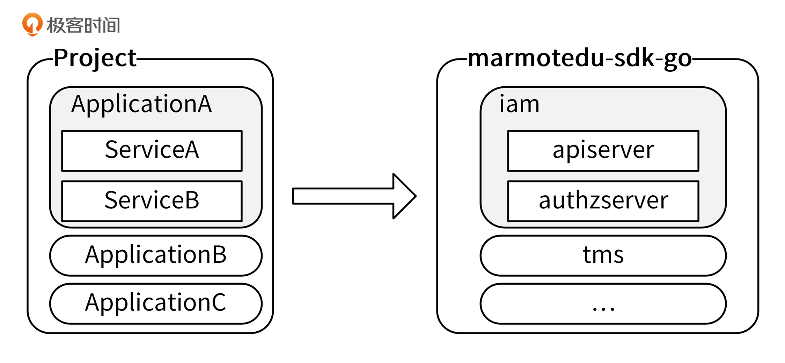
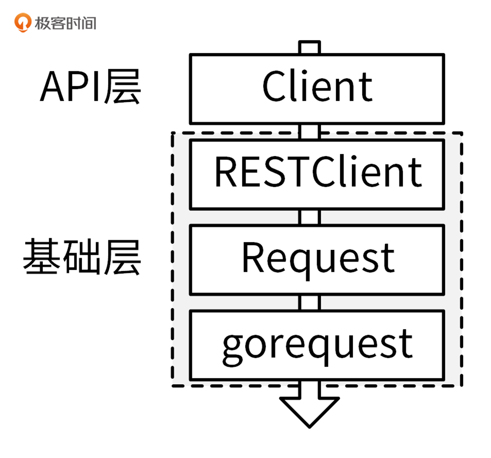

# 34 | SDK 设计（下）：IAM项目Go SDK设计和实现
你好，我是孔令飞。

上一讲，我介绍了公有云厂商普遍采用的SDK设计方式。其实，还有一些比较优秀的SDK设计方式，比如 Kubernetes的 [client-go](https://github.com/kubernetes/client-go) SDK设计方式。IAM项目参考client-go，也实现了client-go风格的SDK： [marmotedu-sdk-go](https://github.com/marmotedu/marmotedu-sdk-go)。

和 [33讲](https://time.geekbang.org/column/article/406389) 介绍的SDK设计方式相比，client-go风格的SDK具有以下优点：

- 大量使用了Go interface特性，将接口的定义和实现解耦，可以支持多种实现方式。
- 接口调用层级跟资源的层级相匹配，调用方式更加友好。
- 多版本共存。

所以，我更推荐你使用marmotedu-sdk-go。接下来，我们就来看下marmotedu-sdk-go是如何设计和实现的。

## marmotedu-sdk-go设计

和medu-sdk-go相比，marmotedu-sdk-go的设计和实现要复杂一些，但功能更强大，使用体验也更好。

这里，我们先来看一个使用SDK调用iam-authz-server `/v1/authz` 接口的示例，代码保存在 [marmotedu-sdk-go/examples/authz\_clientset/main.go](https://github.com/marmotedu/marmotedu-sdk-go/blob/v1.0.3/examples/authz_clientset/main.go) 文件中：

```go
package main

import (
	"context"
	"flag"
	"fmt"
	"path/filepath"

	"github.com/ory/ladon"

	metav1 "github.com/marmotedu/component-base/pkg/meta/v1"
	"github.com/marmotedu/component-base/pkg/util/homedir"

	"github.com/marmotedu/marmotedu-sdk-go/marmotedu"
	"github.com/marmotedu/marmotedu-sdk-go/tools/clientcmd"
)

func main() {
	var iamconfig *string
	if home := homedir.HomeDir(); home != "" {
		iamconfig = flag.String(
			"iamconfig",
			filepath.Join(home, ".iam", "config"),
			"(optional) absolute path to the iamconfig file",
		)
	} else {
		iamconfig = flag.String("iamconfig", "", "absolute path to the iamconfig file")
	}
	flag.Parse()

	// use the current context in iamconfig
	config, err := clientcmd.BuildConfigFromFlags("", *iamconfig)
	if err != nil {
		panic(err.Error())
	}

	// create the clientset
	clientset, err := marmotedu.NewForConfig(config)
	if err != nil {
		panic(err.Error())
	}

	request := &ladon.Request{
		Resource: "resources:articles:ladon-introduction",
		Action:   "delete",
		Subject:  "users:peter",
		Context: ladon.Context{
			"remoteIP": "192.168.0.5",
		},
	}

	// Authorize the request
	fmt.Println("Authorize request...")
	ret, err := clientset.Iam().AuthzV1().Authz().Authorize(context.TODO(), request, metav1.AuthorizeOptions{})
	if err != nil {
		panic(err.Error())
	}

	fmt.Printf("Authorize response: %s.\n", ret.ToString())
}

```

在上面的代码示例中，包含了下面的操作。

- 首先，调用 `BuildConfigFromFlags` 函数，创建出SDK的配置实例config；
- 接着，调用 `marmotedu.NewForConfig(config)` 创建了IAM项目的客户端 `clientset` ;
- 最后，调用以下代码请求 `/v1/authz` 接口执行资源授权请求：

```go
ret, err := clientset.Iam().AuthzV1().Authz().Authorize(context.TODO(), request, metav1.AuthorizeOptions{})
if err != nil {
    panic(err.Error())
}

fmt.Printf("Authorize response: %s.\n", ret.ToString())

```

调用格式为 `项目客户端.应用客户端.服务客户端.资源名.接口` 。

所以，上面的代码通过创建项目级别的客户端、应用级别的客户端和服务级别的客户端，来调用资源的API接口。接下来，我们来看下如何创建这些客户端。

### marmotedu-sdk-go客户端设计

在讲客户端创建之前，我们先来看下客户端的设计思路。

Go项目的组织方式是有层级的： **Project -> Application -> Service**。marmotedu-sdk-go很好地体现了这种层级关系，使得SDK的调用更加易懂、易用。marmotedu-sdk-go的层级关系如下图所示：



marmotedu-sdk-go定义了3类接口，分别代表了项目、应用和服务级别的API接口：

```go
// 项目级别的接口
type Interface interface {
    Iam() iam.IamInterface
    Tms() tms.TmsInterface
}

// 应用级别的接口
type IamInterface interface {
    APIV1() apiv1.APIV1Interface
    AuthzV1() authzv1.AuthzV1Interface
}

// 服务级别的接口
type APIV1Interface interface {
    RESTClient() rest.Interface
    SecretsGetter
    UsersGetter
    PoliciesGetter
}

// 资源级别的客户端
type SecretsGetter interface {
    Secrets() SecretInterface
}

// 资源的接口定义
type SecretInterface interface {
    Create(ctx context.Context, secret *v1.Secret, opts metav1.CreateOptions) (*v1.Secret, error)
    Update(ctx context.Context, secret *v1.Secret, opts metav1.UpdateOptions) (*v1.Secret, error)
    Delete(ctx context.Context, name string, opts metav1.DeleteOptions) error
    DeleteCollection(ctx context.Context, opts metav1.DeleteOptions, listOpts metav1.ListOptions) error
    Get(ctx context.Context, name string, opts metav1.GetOptions) (*v1.Secret, error)
    List(ctx context.Context, opts metav1.ListOptions) (*v1.SecretList, error)
    SecretExpansion
}

```

`Interface` 代表了项目级别的接口，里面包含了 `Iam` 和 `Tms` 两个应用； `IamInterface` 代表了应用级别的接口，里面包含了api（iam-apiserver）和authz（iam-authz-server）两个服务级别的接口。api和authz服务中，又包含了各自服务中REST资源的CURD接口。

marmotedu-sdk-go通过 `XxxV1` 这种命名方式来支持不同版本的API接口，好处是可以在程序中同时调用同一个API接口的不同版本，例如：

`clientset.Iam().AuthzV1().Authz().Authorize()` 、 `clientset.Iam().AuthzV2().Authz().Authorize()` 分别调用了 `/v1/authz` 和 `/v2/authz` 两个版本的API接口。

上述关系也可以从目录结构中反映出来，marmotedu-sdk-go目录设计如下（只列出了一些重要的文件）：

```bash
├── examples                        # 存放SDK的使用示例
├── Makefile                        # 管理SDK源码，静态代码检查、代码格式化、测试、添加版权信息等
├── marmotedu
│   ├── clientset.go                # clientset实现，clientset中包含多个应用，多个服务的API接口
│   ├── fake                        # clientset的fake实现，主要用于单元测试
│   └── service                     # 按应用进行分类，存放应用中各服务API接口的具体实现
│       ├── iam                     # iam应用的API接口实现，包含多个服务
│       │   ├── apiserver           # iam应用中，apiserver服务的API接口，包含多个版本
│       │   │   └── v1              # apiserver v1版本API接口
│       │   ├── authz               # iam应用中，authz服务的API接口
│       │   │   └── v1              # authz服务v1版本接口
│       │   └── iam_client.go       # iam应用的客户端，包含了apiserver和authz 2个服务的客户端
│       └── tms                     # tms应用的API接口实现
├── pkg                             # 存放一些共享包，可对外暴露
├── rest                            # HTTP请求的底层实现
├── third_party                     # 存放修改过的第三方包，例如：gorequest
└── tools
    └── clientcmd                   # 一些函数用来帮助创建rest.Config配置

```

每种类型的客户端，都可以通过以下相似的方式来创建：

```go
config, err := clientcmd.BuildConfigFromFlags("", "/root/.iam/config")
clientset, err := xxxx.NewForConfig(config)

```

`/root/.iam/config` 为配置文件，里面包含了服务的地址和认证信息。 `BuildConfigFromFlags` 函数加载配置文件，创建并返回 `rest.Config` 类型的配置变量，并通过 `xxxx.NewForConfig` 函数创建需要的客户端。 `xxxx` 是所在层级的client包，例如 iam、tms。

marmotedu-sdk-go客户端定义了3类接口，这可以带来两个好处。

第一，API接口调用格式规范，层次清晰，可以使API接口调用更加清晰易记。

第二，可以根据需要，自行选择客户端类型，调用灵活。举个例子，在A服务中需要同时用到iam-apiserver 和 iam-authz-server提供的接口，就可以创建应用级别的客户端IamClient，然后通过 `iamclient.APIV1()` 和 `iamclient.AuthzV1()` ，来切换调用不同服务的API接口。

接下来，我们来看看如何创建三个不同级别的客户端。

### 项目级别客户端创建

`Interface` 对应的客户端实现为 [Clientset](https://github.com/marmotedu/marmotedu-sdk-go/blob/v1.0.2/marmotedu/clientset.go#L20-L23)，所在的包为 [marmotedu-sdk-go/marmotedu](https://github.com/marmotedu/marmotedu-sdk-go/tree/v1.0.2/marmotedu)，Clientset客户端的创建方式为：

```go
config, err := clientcmd.BuildConfigFromFlags("", "/root/.iam/config")
clientset, err := marmotedu.NewForConfig(config)

```

调用方式为 `clientset.应用.服务.资源名.接口` ，例如：

```go
rsp, err := clientset.Iam().AuthzV1().Authz().Authorize()

```

参考示例为 [marmotedu-sdk-go/examples/authz\_clientset/main.go](https://github.com/marmotedu/marmotedu-sdk-go/blob/v1.0.3/examples/authz_clientset/main.go)。

### 应用级别客户端创建

`IamInterface` 对应的客户端实现为 [IamClient](https://github.com/marmotedu/marmotedu-sdk-go/blob/v1.0.2/marmotedu/service/iam/iam_client.go#L22-L25)，所在的包为 [marmotedu-sdk-go/marmotedu/service/iam](https://github.com/marmotedu/marmotedu-sdk-go/tree/v1.0.2/marmotedu/service/iam)，IamClient客户端的创建方式为：

```go
config, err := clientcmd.BuildConfigFromFlags("", "/root/.iam/config")
iamclient,, err := iam.NewForConfig(config)

```

调用方式为 `iamclient.服务.资源名.接口` ，例如：

```go
rsp, err := iamclient.AuthzV1().Authz().Authorize()

```

参考示例为 [marmotedu-sdk-go/examples/authz\_iam/main.go](https://github.com/marmotedu/marmotedu-sdk-go/blob/v1.0.2/examples/authz_iam/main.go)。

### 服务级别客户端创建

`AuthzV1Interface` 对应的客户端实现为 [AuthzV1Client](https://github.com/marmotedu/marmotedu-sdk-go/blob/v1.0.2/marmotedu/service/iam/authz/v1/authz_client.go#L21-L23)，所在的包为 [marmotedu-sdk-go/marmotedu/service/iam/authz/v1](https://github.com/marmotedu/marmotedu-sdk-go/tree/v1.0.2/marmotedu/service/iam/authz/v1)，AuthzV1Client客户端的创建方式为：

```go
config, err := clientcmd.BuildConfigFromFlags("", "/root/.iam/config")
client, err := v1.NewForConfig(config)

```

调用方式为 `client.资源名.接口` ，例如：

```go
rsp, err := client.Authz().Authorize()

```

参考示例为 [marmotedu-sdk-go/examples/authz/main.go](https://github.com/marmotedu/marmotedu-sdk-go/blob/v1.0.3/examples/authz/main.go)。

上面我介绍了marmotedu-sdk-go的客户端创建方法，接下来我们再来看下，这些客户端具体是如何执行REST API请求的。

## marmotedu-sdk-go的实现

marmotedu-sdk-go的实现和medu-sdk-go一样，也是采用分层结构，分为API层和基础层。如下图所示：



[RESTClient](https://github.com/marmotedu/marmotedu-sdk-go/blob/v1.0.2/rest/client.go#L95-L105) 是整个SDK的核心，RESTClient向下通过调用 [Request](https://github.com/marmotedu/marmotedu-sdk-go/blob/v1.0.2/rest/request.go#L28-L50) 模块，来完成HTTP请求方法、请求路径、请求体、认证信息的构建。Request模块最终通过调用 [gorequest](https://github.com/parnurzeal/gorequest) 包提供的方法，完成HTTP的POST、PUT、GET、DELETE等请求，获取HTTP返回结果，并解析到指定的结构体中。RESTClient向上提供 `Post()` 、 `Put()` 、 `Get()` 、 `Delete()` 等方法来供客户端完成HTTP请求。

marmotedu-sdk-go提供了两类客户端，分别是RESTClient客户端和基于RESTClient封装的客户端。

- RESTClient：Raw类型的客户端，可以通过指定HTTP的请求方法、请求路径、请求参数等信息，直接发送HTTP请求，例如 `client.Get().AbsPath("/version").Do().Into()` 。
- 基于RESTClient封装的客户端：例如AuthzV1Client、APIV1Client等，执行特定REST资源、特定API接口的请求，方便开发者调用。

接下来，我们具体看下如何创建RESTClient客户端，以及Request模块的实现。

### RESTClient客户端实现

我通过下面两个步骤，实现了RESTClient客户端。

**第一步，创建** [rest.Config](https://github.com/marmotedu/marmotedu-sdk-go/blob/v1.0.2/rest/config.go#L29-L60) **类型的变量。**

[BuildConfigFromFlags](https://github.com/marmotedu/marmotedu-sdk-go/blob/v1.0.2/tools/clientcmd/client_config.go#L190-L203) 函数通过加载yaml格式的配置文件，来创建 `rest.Config` 类型的变量，加载的yaml格式配置文件内容为：

```yaml
apiVersion: v1
user:
  #token: # JWT Token
  username: admin # iam 用户名
  password: Admin@2020 # iam 密码
  #secret-id: # 密钥 ID
  #secret-key: # 密钥 Key
  client-certificate: /home/colin/.iam/cert/admin.pem # 用于 TLS 的客户端证书文件路径
  client-key: /home/colin/.iam/cert/admin-key.pem # 用于 TLS 的客户端 key 文件路径
  #client-certificate-data:
  #client-key-data:

server:
  address: https://127.0.0.1:8443 # iam api-server 地址
  timeout: 10s # 请求 api-server 超时时间
  #max-retries: # 最大重试次数，默认为 0
  #retry-interval: # 重试间隔，默认为 1s
  #tls-server-name: # TLS 服务器名称
  #insecure-skip-tls-verify: # 设置为 true 表示跳过 TLS 安全验证模式，将使得 HTTPS 连接不安全
  certificate-authority: /home/colin/.iam/cert/ca.pem # 用于 CA 授权的 cert 文件路径
  #certificate-authority-data:

```

在配置文件中，我们可以指定服务的地址、用户名/密码、密钥、TLS证书、超时时间、重试次数等信息。

创建方法如下：

```go
config, err := clientcmd.BuildConfigFromFlags("", *iamconfig)
if err != nil {
    panic(err.Error())
}

```

这里的代码中， `*iamconfig` 是yaml格式的配置文件路径。 `BuildConfigFromFlags` 函数中，调用 [LoadFromFile](https://github.com/marmotedu/marmotedu-sdk-go/blob/v1.0.3/tools/clientcmd/loader.go#L32-L56) 函数来解析yaml配置文件。LoadFromFile最终是通过 `yaml.Unmarshal` 的方式来解析yaml格式的配置文件的。

**第二步，根据rest.Config类型的变量，创建RESTClient客户端。**

通过 [RESTClientFor](https://github.com/marmotedu/marmotedu-sdk-go/blob/v1.0.2/rest/config.go#L191-L237) 函数来创建RESTClient客户端：

```go
func RESTClientFor(config *Config) (*RESTClient, error) {
    ...
    baseURL, versionedAPIPath, err := defaultServerURLFor(config)
    if err != nil {
        return nil, err
    }

    // Get the TLS options for this client config
    tlsConfig, err := TLSConfigFor(config)
    if err != nil {
        return nil, err
    }

    // Only retry when get a server side error.
    client := gorequest.New().TLSClientConfig(tlsConfig).Timeout(config.Timeout).
        Retry(config.MaxRetries, config.RetryInterval, http.StatusInternalServerError)
    // NOTICE: must set DoNotClearSuperAgent to true, or the client will clean header befor http.Do
    client.DoNotClearSuperAgent = true

    ...

    clientContent := ClientContentConfig{
        Username:           config.Username,
        Password:           config.Password,
        SecretID:           config.SecretID,
        SecretKey:          config.SecretKey,
        ...
    }

    return NewRESTClient(baseURL, versionedAPIPath, clientContent, client)
}

```

RESTClientFor函数调用 [defaultServerURLFor(config)](https://github.com/marmotedu/marmotedu-sdk-go/blob/v1.0.2/rest/url_utils.go#L69-L81) 生成基本的HTTP请求路径：baseURL=http://127.0.0.1:8080，versionedAPIPath=/v1。然后，通过 [TLSConfigFor](https://github.com/marmotedu/marmotedu-sdk-go/blob/v1.0.2/rest/config.go#L241-L298) 函数生成TLS配置，并调用 `gorequest.New()` 创建gorequest客户端，将客户端配置信息保存在变量中。最后，调用 [NewRESTClient](https://github.com/marmotedu/marmotedu-sdk-go/blob/v1.0.2/rest/client.go#L109-L130) 函数创建RESTClient客户端。

RESTClient客户端提供了以下方法，来供调用者完成HTTP请求：

```go
func (c *RESTClient) APIVersion() scheme.GroupVersion
func (c *RESTClient) Delete() *Request
func (c *RESTClient) Get() *Request
func (c *RESTClient) Post() *Request
func (c *RESTClient) Put() *Request
func (c *RESTClient) Verb(verb string) *Request

```

可以看到，RESTClient提供了 `Delete` 、 `Get` 、 `Post` 、 `Put` 方法，分别用来执行HTTP的DELETE、GET、POST、PUT方法，提供的 `Verb` 方法可以灵活地指定HTTP方法。这些方法都返回了 `Request` 类型的变量。 `Request` 类型的变量提供了一些方法，用来完成具体的HTTP请求，例如：

```go
  type Response struct {
    Allowed bool   `json:"allowed"`
    Denied  bool   `json:"denied,omitempty"`
    Reason  string `json:"reason,omitempty"`
    Error   string `json:"error,omitempty"`
}

func (c *authz) Authorize(ctx context.Context, request *ladon.Request, opts metav1.AuthorizeOptions) (result *Response, err error) {
    result = &Response{}
    err = c.client.Post().
        Resource("authz").
        VersionedParams(opts).
        Body(request).
        Do(ctx).
        Into(result)

    return
}

```

上面的代码中， `c.client` 是RESTClient客户端，通过调用RESTClient客户端的 `Post` 方法，返回了 `*Request` 类型的变量。

`*Request` 类型的变量提供了 `Resource` 和 `VersionedParams` 方法，来构建请求HTTP URL中的路径 `/v1/authz` ；通过 `Body` 方法，指定了HTTP请求的Body。

到这里，我们分别构建了HTTP请求需要的参数：HTTP Method、请求URL、请求Body。所以，之后就可以调用 `Do` 方法来执行HTTP请求，并将返回结果通过 `Into` 方法保存在传入的result变量中。

### Request模块实现

RESTClient客户端的方法会返回Request类型的变量，Request类型的变量提供了一系列的方法用来构建HTTP请求参数，并执行HTTP请求。

所以，Request模块可以理解为最底层的通信层，我们来看下Request模块具体是如何完成HTTP请求的。

我们先来看下 [Request结构体](https://github.com/marmotedu/marmotedu-sdk-go/blob/v1.0.3/rest/request.go#L28-L50) 的定义：

```go
type RESTClient struct {
    // base is the root URL for all invocations of the client
    base *url.URL
    // group stand for the client group, eg: iam.api, iam.authz
    group string
    // versionedAPIPath is a path segment connecting the base URL to the resource root
    versionedAPIPath string
    // content describes how a RESTClient encodes and decodes responses.
    content ClientContentConfig
    Client  *gorequest.SuperAgent
}

type Request struct {
	c *RESTClient

	timeout time.Duration

	// generic components accessible via method setters
	verb       string
	pathPrefix string
	subpath    string
	params     url.Values
	headers    http.Header

	// structural elements of the request that are part of the IAM API conventions
	// namespace    string
	// namespaceSet bool
	resource     string
	resourceName string
	subresource  string

	// output
	err  error
	body interface{}
}

```

再来看下Request结构体提供的方法：

```go
func (r *Request) AbsPath(segments ...string) *Request
func (r *Request) Body(obj interface{}) *Request
func (r *Request) Do(ctx context.Context) Result
func (r *Request) Name(resourceName string) *Request
func (r *Request) Param(paramName, s string) *Request
func (r *Request) Prefix(segments ...string) *Request
func (r *Request) RequestURI(uri string) *Request
func (r *Request) Resource(resource string) *Request
func (r *Request) SetHeader(key string, values ...string) *Request
func (r *Request) SubResource(subresources ...string) *Request
func (r *Request) Suffix(segments ...string) *Request
func (r *Request) Timeout(d time.Duration) *Request
func (r *Request) URL() *url.URL
func (r *Request) Verb(verb string) *Request
func (r *Request) VersionedParams(v interface{}) *Request

```

通过Request结构体的定义和使用方法，我们不难猜测出：Request模块通过 `Name` 、 `Resource` 、 `Body` 、 `SetHeader` 等方法来设置Request结构体中的各个字段。这些字段最终用来构建出一个HTTP请求，并通过 `Do` 方法来执行HTTP请求。

那么，如何构建并执行一个HTTP请求呢？我们可以通过以下5步，来构建并执行HTTP请求：

1. 构建HTTP URL；
2. 构建HTTP Method；
3. 构建HTTP Body；
4. 执行HTTP请求；
5. 保存HTTP返回结果。

接下来，我们就来具体看下Request模块是如何构建这些请求参数，并发送HTTP请求的。

**第一步，构建HTTP URL。**

首先，通过 [defaultServerURLFor](https://github.com/marmotedu/marmotedu-sdk-go/blob/v1.0.3/rest/url_utils.go#L69-L81) 函数返回了 `http://iam.api.marmotedu.com:8080` 和 `/v1` ，并将二者分别保存在了Request类型结构体变量中 `c` 字段的 `base` 字段和 `versionedAPIPath` 字段中。

通过 [Do](https://github.com/marmotedu/marmotedu-sdk-go/blob/v1.0.3/rest/request.go#L379-L416) 方法执行HTTP时，会调用 [r.URL()](https://github.com/marmotedu/marmotedu-sdk-go/blob/v1.0.3/rest/request.go#L392) 方法来构建请求URL。 `r.URL` 方法中，通过以下代码段构建了HTTP请求URL：

```go
func (r *Request) URL() *url.URL {
    p := r.pathPrefix
    if len(r.resource) != 0 {
        p = path.Join(p, strings.ToLower(r.resource))
    }

    if len(r.resourceName) != 0 || len(r.subpath) != 0 || len(r.subresource) != 0 {
        p = path.Join(p, r.resourceName, r.subresource, r.subpath)
    }

    finalURL := &url.URL{}
    if r.c.base != nil {
        *finalURL = *r.c.bas
    }

    finalURL.Path = p
    ...
}

```

`p := r.pathPrefix` 和 `r.c.base` ，是通过 `defaultServerURLFor` 调用返回的 `v1` 和 `http://iam.api.marmotedu.com:8080` 来构建的。

`resourceName` 通过 `func (r *Request) Resource(resource string) *Request` 来指定，例如 `authz` 。

所以，最终我们构建的请求URL为 `http://iam.api.marmotedu.com:8080/v1/authz` 。

**第二步，构建HTTP Method。**

HTTP Method通过RESTClient提供的 `Post` 、 `Delete` 、 `Get` 等方法来设置，例如：

```go
func (c *RESTClient) Post() *Request {
    return c.Verb("POST")
}

func (c *RESTClient) Verb(verb string) *Request {
    return NewRequest(c).Verb(verb)
}

```

`NewRequest(c).Verb(verb)` 最终设置了Request结构体的 `verb` 字段，供 `Do` 方法使用。

**第三步，构建HTTP Body。**

HTTP Body通过Request结构体提供的Body方法来指定：

```go
func (r *Request) Body(obj interface{}) *Request {
    if v := reflect.ValueOf(obj); v.Kind() == reflect.Struct {
        r.SetHeader("Content-Type", r.c.content.ContentType)
    }

    r.body = obj

    return r
}

```

**第四步，执行HTTP请求。**

通过Request结构体提供的Do方法来执行具体的HTTP请求，代码如下：

```go
func (r *Request) Do(ctx context.Context) Result {
	client := r.c.Client
	client.Header = r.headers

	if r.timeout > 0 {
		var cancel context.CancelFunc
		ctx, cancel = context.WithTimeout(ctx, r.timeout)

		defer cancel()
	}

	client.WithContext(ctx)

	resp, body, errs := client.CustomMethod(r.verb, r.URL().String()).Send(r.body).EndBytes()
	if err := combineErr(resp, body, errs); err != nil {
		return Result{
			response: &resp,
			err:      err,
			body:     body,
		}
	}

	decoder, err := r.c.content.Negotiator.Decoder()
	if err != nil {
		return Result{
			response: &resp,
			err:      err,
			body:     body,
			decoder:  decoder,
		}
	}

	return Result{
		response: &resp,
		body:     body,
		decoder:  decoder,
	}
}

```

在Do方法中，使用了Request结构体变量中各个字段的值，通过 `client.CustomMethod` 来执行HTTP请求。 `client` 是 `*gorequest.SuperAgent` 类型的客户端。

**第五步，保存HTTP返回结果。**

通过Request结构体的 `Into` 方法来保存HTTP返回结果：

```go
func (r Result) Into(v interface{}) error {
    if r.err != nil {
        return r.Error()
    }

    if r.decoder == nil {
        return fmt.Errorf("serializer doesn't exist")
    }

    if err := r.decoder.Decode(r.body, &v); err != nil {
        return err
    }

    return nil
}

```

`r.body` 是在Do方法中，执行完HTTP请求后设置的，它的值为HTTP请求返回的Body。

### 请求认证

接下来，我再来介绍下marmotedu-sdk-go另外一个比较核心的功能：请求认证。

marmotedu-sdk-go支持两种认证方式：

- Basic认证：通过给请求添加 `Authorization: Basic xxxx` 来实现。
- Bearer认证：通过给请求添加 `Authorization: Bearer xxxx` 来实现。这种方式又支持直接指定JWT Token，或者通过指定密钥对由SDK自动生成JWT Token。

Basic认证和Bearer认证，我在 [25讲](https://time.geekbang.org/column/article/398410) 介绍过，你可以返回查看下。

认证头是RESTClient客户端发送HTTP请求时指定的，具体实现位于 [NewRequest](https://github.com/marmotedu/marmotedu-sdk-go/blob/v1.0.2/rest/request.go#L53-L102) 函数中：

```go
switch {
    case c.content.HasTokenAuth():
        r.SetHeader("Authorization", fmt.Sprintf("Bearer %s", c.content.BearerToken))
    case c.content.HasKeyAuth():
        tokenString := auth.Sign(c.content.SecretID, c.content.SecretKey, "marmotedu-sdk-go", c.group+".marmotedu.com")
        r.SetHeader("Authorization", fmt.Sprintf("Bearer %s", tokenString))
    case c.content.HasBasicAuth():
        // TODO: get token and set header
        r.SetHeader("Authorization", "Basic "+basicAuth(c.content.Username, c.content.Password))
}

```

上面的代码会根据配置信息，自动判断使用哪种认证方式。

## 总结

这一讲中，我介绍了Kubernetes client-go风格的SDK实现方式。和公有云厂商的SDK设计相比，client-go风格的SDK设计有很多优点。

marmotedu-sdk-go在设计时，通过接口实现了3类客户端，分别是项目级别的客户端、应用级别的客户端和服务级别的客户端。开发人员可以根据需要，自行创建客户端类型。

marmotedu-sdk-go通过 [RESTClientFor](https://github.com/marmotedu/marmotedu-sdk-go/blob/v1.0.2/rest/config.go#L191-L237)，创建了RESTClient类型的客户端，RESTClient向下通过调用 [Request](https://github.com/marmotedu/marmotedu-sdk-go/blob/v1.0.2/rest/request.go#L28-L50) 模块，来完成HTTP请求方法、请求路径、请求体、认证信息的构建。Request模块最终通过调用 [gorequest](https://github.com/parnurzeal/gorequest) 包提供的方法，完成HTTP的POST、PUT、GET、DELETE等请求，获取HTTP返回结果，并解析到指定的结构体中。RESTClient向上提供 `Post()` 、 `Put()` 、 `Get()` 、 `Delete()` 等方法，来供客户端完成HTTP请求。

## 课后练习

1. 阅读 [defaultServerURLFor](https://github.com/marmotedu/marmotedu-sdk-go/blob/v1.0.3/rest/url_utils.go#L69-L81) 源码，思考下defaultServerURLFor是如何构建请求地址 `http://iam.api.marmotedu.com:8080` 和API版本 `/v1` 的。
2. 使用 [gorequest](https://github.com/parnurzeal/gorequest) 包，编写一个可以执行以下HTTP请求的示例：

```bash
curl -XPOST http://example.com/v1/user -d '{"username":"colin","address":"shenzhen"}'

```

欢迎你在留言区与我交流讨论，我们下一讲见。