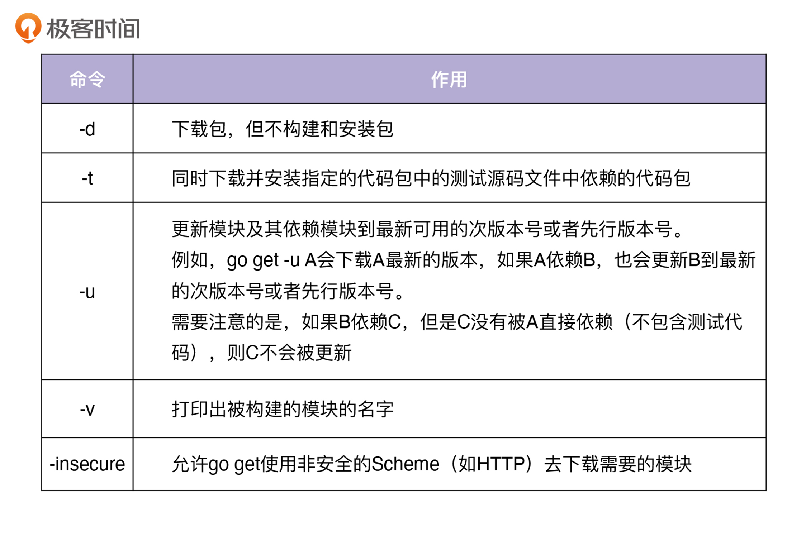

# 特别放送 | Go Modules实战
你好，我是孔令飞。

今天我们更新一期特别放送作为加餐。在 [特别放送 \| Go Modules依赖包管理全讲](https://time.geekbang.org/column/article/416397) 中，我介绍了Go Modules的知识，里面内容比较多，你可能还不知道具体怎么使用Go Modules来为你的项目管理Go依赖包。

这一讲，我就通过一个具体的案例，带你一步步学习Go Modules的常见用法以及操作方法，具体包含以下内容：

1. 准备一个演示项目。
2. 配置Go Modules。
3. 初始化Go包为Go模块。
4. Go包依赖管理。

## 准备一个演示项目

为了演示Go Modules的用法，我们首先需要一个Demo项目。假设我们有一个hello的项目，里面有两个文件，分别是hello.go和hello\_test.go，所在目录为 `/home/lk/workspace/golang/src/github.com/marmotedu/gopractise-demo/modules/hello`。

hello.go文件内容为：

```go
package hello

func Hello() string {
	return "Hello, world."
}

```

hello\_test.go文件内容为：

```go
package hello

import "testing"

func TestHello(t *testing.T) {
	want := "Hello, world."
	if got := Hello(); got != want {
		t.Errorf("Hello() = %q, want %q", got, want)
	}
}

```

这时候，该目录包含了一个Go包，但还不是Go模块，因为没有go.mod件。接下来，我就给你演示下，如何将这个包变成一个Go模块，并执行Go依赖包的管理操作。这些操作共有10个步骤，下面我们来一步步看下。

## 配置Go Modules

1. 打开Go Modules

确保Go版本 `>=go1.11`，并开启Go Modules，可以通过设置环境变量 `export GO111MODULE=on` 开启。如果你觉得每次都设置比较繁琐，可以将 `export GO111MODULE=on` 追加到文件 `$HOME/.bashrc` 中，并执行 `bash` 命令加载到当前shell环境中。

1. 设置环境变量

对于国内的开发者来说，需要设置 `export GOPROXY=https://goproxy.cn,direct`，这样一些被墙的包可以通过国内的镜像源安装。如果我们有一些模块存放在私有仓库中，也需要设置GOPRIVATE环境变量。

因为Go Modules会请求Go Checksum Database，Checksum Database国内也可能会访问失败，可以设置 `export GOSUMDB=off` 来关闭Checksum校验。对于一些模块，如果你希望不通过代理服务器，或者不校验 `checksum`，也可以根据需要设置GONOPROXY和GONOSUMDB。

## 初始化Go包为Go模块

1. 创建一个新模块

你可以通过 `go mod init` 命令，初始化项目为Go Modules。 `init` 命令会在当前目录初始化并创建一个新的go.mod文件，也代表着创建了一个以项目根目录为根的Go Modules。如果当前目录已经存在go.mod文件，则会初始化失败。

在初始化Go Modules时，需要告知 `go mod init` 要初始化的模块名，可以指定模块名，例如 `go mod init github.com/marmotedu/gopractise-demo/modules/hello`。也可以不指定模块名，让 `init` 自己推导。下面我来介绍下推导规则。

- 如果有导入路径注释，则使用注释作为模块名，比如：

```bash
package hello // import "github.com/marmotedu/gopractise-demo/modules/hello"

```

则模块名为 `github.com/marmotedu/gopractise-demo/modules/hello`。

- 如果没有导入路径注释，并且项目位于GOPATH路径下，则模块名为绝对路径去掉 `$GOPATH/src` 后的路径名，例如 `GOPATH=/home/lk/workspace/golang`，项目绝对路径为 `/home/colin/workspace/golang/src/github.com/marmotedu/gopractise-demo/modules/hello`，则模块名为 `github.com/marmotedu/gopractise-demo/modules/hello`。

初始化完成之后，会在当前目录生成一个go.mod文件：

```bash
$ cat go.mod
module github.com/marmotedu/gopractise-demo/modules/hello

go 1.14

```

文件内容表明，当前模块的导入路径为 `github.com/marmotedu/gopractise-demo/modules/hello`，使用的Go版本是 `go 1.14`。

如果要新增子目录创建新的package，则package的导入路径自动为 `模块名/子目录名` ： `github.com/marmotedu/gopractise-demo/modules/hello/<sub-package-name>`，不需要在子目录中再次执行 `go mod init`。

比如，我们在hello目录下又创建了一个world包 `world/world.go`，则world包的导入路径为 `github.com/marmotedu/gopractise-demo/modules/hello/world`。

## Go包依赖管理

1. 增加一个依赖

Go Modules主要是用来对包依赖进行管理的，所以这里我们来给hello包增加一个依赖 `rsc.io/quote`：

```go
package hello

import "rsc.io/quote"

func Hello() string {
	return quote.Hello()
}

```

运行 `go test`：

```bash
$ go test
go: finding module for package rsc.io/quote
go: downloading rsc.io/quote v1.5.2
go: found rsc.io/quote in rsc.io/quote v1.5.2
go: downloading rsc.io/sampler v1.3.0
PASS
ok  	github.com/google/addlicense/golang/src/github.com/marmotedu/gopractise-demo/modules/hello	0.003s

```

当go命令在解析源码时，遇到需要导入一个模块的情况，就会去go.mod文件中查询该模块的版本，如果有指定版本，就导入指定的版本。

如果没有查询到该模块，go命令会自动根据模块的导入路径安装模块，并将模块和其最新的版本写入go.mod文件中。在我们的示例中， `go test` 将模块 `rsc.io/quote` 解析为 `rsc.io/quote v1.5.2`，并且同时还下载了 `rsc.io/quote` 模块的两个依赖模块： `rsc.io/quote` 和 `rsc.io/sampler`。只有直接依赖才会被记录到go.mod文件中。

查看go.mod文件：

```bash
module github.com/marmotedu/gopractise-demo/modules/hello

go 1.14

require rsc.io/quote v1.5.2

```

再次执行 `go test`：

```bash
$ go test
PASS
ok  	github.com/marmotedu/gopractise-demo/modules/hello	0.003s

```

当我们再次执行 `go test` 时，不会再下载并记录需要的模块，因为go.mod目前是最新的，并且需要的模块已经缓存到了本地的 `$GOPATH/pkg/mod` 目录下。可以看到，在当前目录还新生成了一个go.sum文件：

```bash
$ cat go.sum
golang.org/x/text v0.0.0-20170915032832-14c0d48ead0c h1:qgOY6WgZOaTkIIMiVjBQcw93ERBE4m30iBm00nkL0i8=
golang.org/x/text v0.0.0-20170915032832-14c0d48ead0c/go.mod h1:NqM8EUOU14njkJ3fqMW+pc6Ldnwhi/IjpwHt7yyuwOQ=
rsc.io/quote v1.5.2 h1:w5fcysjrx7yqtD/aO+QwRjYZOKnaM9Uh2b40tElTs3Y=
rsc.io/quote v1.5.2/go.mod h1:LzX7hefJvL54yjefDEDHNONDjII0t9xZLPXsUe+TKr0=
rsc.io/sampler v1.3.0 h1:7uVkIFmeBqHfdjD+gZwtXXI+RODJ2Wc4O7MPEh/QiW4=
rsc.io/sampler v1.3.0/go.mod h1:T1hPZKmBbMNahiBKFy5HrXp6adAjACjK9JXDnKaTXpA=

```

`go test` 在执行时，还可以添加 `-mod` 选项，比如 `go test -mod=vendor`。 `-mod` 有3个值，我来分别介绍下。

- readonly：不更新go.mod，任何可能会导致go.mod变更的操作都会失败。通常用来检查go.mod文件是否需要更新，例如用在CI或者测试场景。
- vendor：从项目顶层目录下的vendor中导入包，而不是从模块缓存中导入包，需要确保vendor包完整准确。
- mod：从模块缓存中导入包，即使项目根目录下有vendor目录。

如果 `go test` 执行时没有 `-mod` 选项，并且项目根目录存在vendor目录，go.mod中记录的go版本大于等于 `1.14`，此时 `go test` 执行效果等效于 `go test -mod=vendor`。 `-mod` 标志同样适用于go build、go install、go run、go test、go list、go vet命令。

1. 查看所有依赖模块

我们可以通过 `go list -m all` 命令查看所有依赖模块：

```bash
$ go list -m all
github.com/marmotedu/gopractise-demo/modules/hello
golang.org/x/text v0.0.0-20170915032832-14c0d48ead0c
rsc.io/quote v1.5.2
rsc.io/sampler v1.3.0

```

可以看出，除了 `rsc.io/quote v1.5.2` 外，还间接依赖了其他模块。

1. 更新依赖

通过 `go list -m all`，我们可以看到模块依赖的 `golang.org/x/text` 模块版本是 `v0.0.0`，我们可以通过 `go get` 命令，将其更新到最新版本，并观察测试是否通过：

```bash
$ go get golang.org/x/text
go: golang.org/x/text upgrade => v0.3.3
$ go test
PASS
ok  	github.com/marmotedu/gopractise-demo/modules/hello	0.003s

```

`go test` 命令执行后输出PASS说明升级成功，再次看下 `go list -m all` 和go.mod文件：

```bash
$ go list -m all
github.com/marmotedu/gopractise-demo/modules/hello
golang.org/x/text v0.3.3
golang.org/x/tools v0.0.0-20180917221912-90fa682c2a6e
rsc.io/quote v1.5.2
rsc.io/sampler v1.3.0
$ cat go.mod
module github.com/marmotedu/gopractise-demo/modules/hello

go 1.14

require (
	golang.org/x/text v0.3.3 // indirect
	rsc.io/quote v1.5.2
)

```

可以看到， `golang.org/x/text` 包被更新到最新的tag版本( `v0.3.3`)，并且同时更新了go.mod文件。 `// indirect` 说明 `golang.org/x/text` 是间接依赖。现在我们再尝试更新 `rsc.io/sampler` 并测试：

```bash
$ go get rsc.io/sampler
go: rsc.io/sampler upgrade => v1.99.99
go: downloading rsc.io/sampler v1.99.99
$ go test
--- FAIL: TestHello (0.00s)
    hello_test.go:8: Hello() = "99 bottles of beer on the wall, 99 bottles of beer, ...", want "Hello, world."
FAIL
exit status 1
FAIL	github.com/marmotedu/gopractise-demo/modules/hello	0.004s

```

测试失败，说明最新的版本 `v1.99.99` 与我们当前的模块不兼容，我们可以列出 `rsc.io/sampler` 所有可用的版本，并尝试更新到其他版本：

```bash
$ go list -m -versions rsc.io/sampler
rsc.io/sampler v1.0.0 v1.2.0 v1.2.1 v1.3.0 v1.3.1 v1.99.99

# 我们尝试选择一个次新的版本v1.3.1
$ go get rsc.io/sampler@v1.3.1
go: downloading rsc.io/sampler v1.3.1
$ go test
PASS
ok  	github.com/marmotedu/gopractise-demo/modules/hello	0.004s

```

可以看到，更新到 `v1.3.1` 版本，测试是通过的。 `go get` 还支持多种参数，如下表所示：



1. 添加一个新的major版本依赖

我们尝试添加一个新的函数 `func Proverb`，该函数通过调用 `rsc.io/quote/v3` 的 `quote.Concurrency` 函数实现。

首先，我们在hello.go文件中添加新函数：

```go
package hello

import (
	"rsc.io/quote"
	quoteV3 "rsc.io/quote/v3"
)

func Hello() string {
	return quote.Hello()
}

func Proverb() string {
	return quoteV3.Concurrency()
}

```

在hello\_test.go中添加该函数的测试用例：

```go
func TestProverb(t *testing.T) {
    want := "Concurrency is not parallelism."
    if got := Proverb(); got != want {
        t.Errorf("Proverb() = %q, want %q", got, want)
    }
}

```

然后执行测试：

```bash
$ go test
go: finding module for package rsc.io/quote/v3
go: found rsc.io/quote/v3 in rsc.io/quote/v3 v3.1.0
PASS
ok  	github.com/marmotedu/gopractise-demo/modules/hello	0.003s

```

测试通过，可以看到当前模块同时依赖了同一个模块的不同版本 `rsc.io/quote` 和 `rsc.io/quote/v3`：

```bash
$ go list -m rsc.io/q...
rsc.io/quote v1.5.2
rsc.io/quote/v3 v3.1.0

```

1. 升级到不兼容的版本

在上一步中，我们使用 `rsc.io/quote v1` 版本的 `Hello()` 函数。按照语义化版本规则，如果我们想升级 `major` 版本，可能面临接口不兼容的问题，需要我们变更代码。我们来看下 `rsc.io/quote/v3` 的函数：

```bash
$ go doc rsc.io/quote/v3
package quote // import "github.com/google/addlicense/golang/pkg/mod/rsc.io/quote/v3@v3.1.0"

Package quote collects pithy sayings.

func Concurrency() string
func GlassV3() string
func GoV3() string
func HelloV3() string
func OptV3() string

```

可以看到， `Hello()` 函数变成了 `HelloV3()`，这就需要我们变更代码做适配。因为我们都统一模块到一个版本了，这时候就不需要再为了避免重名而重命名模块，所以此时hello.go内容为：

```go
package hello

import (
	"rsc.io/quote/v3"
)

func Hello() string {
	return quote.HelloV3()
}

func Proverb() string {
	return quote.Concurrency()
}

```

执行 `go test`：

```bash
$ go test
PASS
ok  	github.com/marmotedu/gopractise-demo/modules/hello	0.003s

```

可以看到测试成功。

1. 删除不使用的依赖

在上一步中，我们移除了 `rsc.io/quote` 包，但是它仍然存在于 `go list -m all` 和go.mod中，这时候我们要执行 `go mod tidy` 清理不再使用的依赖：

```bash
$ go mod tidy
[colin@dev hello]$ cat go.mod
module github.com/marmotedu/gopractise-demo/modules/hello

go 1.14

require (
	golang.org/x/text v0.3.3 // indirect
	rsc.io/quote/v3 v3.1.0
	rsc.io/sampler v1.3.1 // indirect
)

```

1. 使用vendor

如果我们想把所有依赖都保存起来，在Go命令执行时不再下载，可以执行 `go mod vendor`，该命令会把当前项目的所有依赖都保存在项目根目录的vendor目录下，也会创建 `vendor/modules.txt` 文件，来记录包和模块的版本信息：

```bash
$ go mod vendor
$ ls
go.mod  go.sum  hello.go  hello_test.go  vendor  world

```

到这里，我就讲完了Go依赖包管理常用的10个操作。

## 总结

这一讲中，我详细介绍了如何使用Go Modules来管理依赖，它包括以下Go Modules操作：

01. 打开Go Modules；
02. 设置环境变量；
03. 创建一个新模块；
04. 增加一个依赖；
05. 查看所有依赖模块；
06. 更新依赖；
07. 添加一个新的major版本依赖；
08. 升级到不兼容的版本；
09. 删除不使用的依赖。
10. 使用vendor。

## 课后练习

1. 思考下，如何更新项目的所有依赖到最新的版本？

2. 思考下，如果我们的编译机器访问不了外网，如何通过Go Modules下载Go依赖包？


欢迎你在留言区与我交流讨论，我们下一讲见。