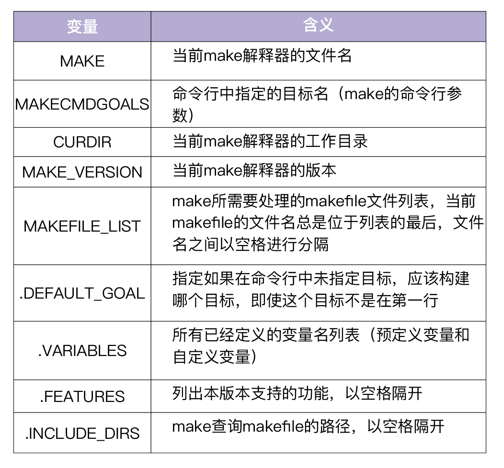
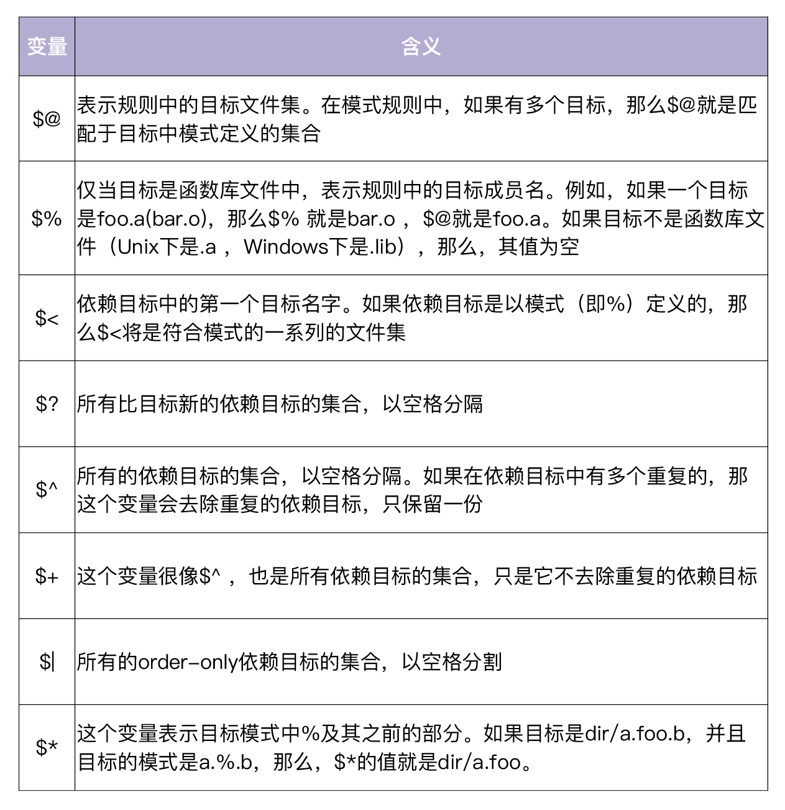
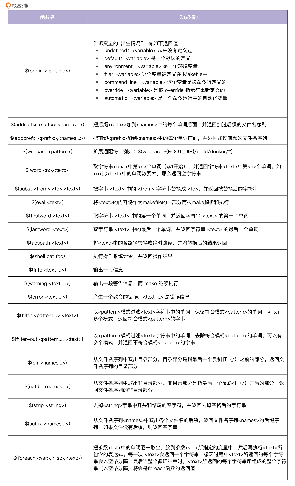

# 特别放送 | 给你一份Go项目中最常用的Makefile核心语法
你好，我是孔令飞。今天，我们更新一期特别放送作为“加餐”，希望日常催更的朋友们食用愉快。

在第 [**14讲**](https://time.geekbang.org/column/article/388920) 里 **，** 我强调了熟练掌握Makefile语法的重要性，还推荐你去学习陈皓老师编写的 [《跟我一起写 Makefile》 (PDF 重制版)](https://github.com/seisman/how-to-write-makefile)。也许你已经点开了链接，看到那么多Makefile语法，是不是有点被“劝退”的感觉？

其实在我看来，虽然Makefile有很多语法，但不是所有的语法都需要你熟练掌握，有些语法在Go项目中是很少用到的。要编写一个高质量的Makefile，首先应该掌握一些核心的、最常用的语法知识。这一讲我就来具体介绍下Go项目中常用的Makefile语法和规则，帮助你快速打好最重要的基础。

Makefile文件由三个部分组成，分别是Makefile规则、Makefile语法和Makefile命令（这些命令可以是Linux命令，也可以是可执行的脚本文件）。在这一讲里，我会介绍下Makefile规则和Makefile语法里的一些核心语法知识。在介绍这些语法知识之前，我们先来看下如何使用Makefile脚本。

## Makefile的使用方法

在实际使用过程中，我们一般是先编写一个Makefile文件，指定整个项目的编译规则，然后通过Linux make命令来解析该Makefile文件，实现项目编译、管理的自动化。

默认情况下，make命令会在当前目录下，按照GNUmakefile、makefile、Makefile文件的顺序查找Makefile文件，一旦找到，就开始读取这个文件并执行。

大多数的make都支持“makefile”和“Makefile”这两种文件名，但 **我建议使用“Makefile”**。因为这个文件名第一个字符大写，会很明显，容易辨别。make也支持 `-f` 和 `--file` 参数来指定其他文件名，比如 `make -f golang.mk` 或者 `make --file golang.mk` 。

## Makefile规则介绍

学习Makefile，最核心的就是学习Makefile的规则。规则是Makefile中的重要概念，它一般由目标、依赖和命令组成，用来指定源文件编译的先后顺序。Makefile之所以受欢迎，核心原因就是Makefile规则，因为Makefile规则可以自动判断是否需要重新编译某个目标，从而确保目标仅在需要时编译。

这一讲我们主要来看Makefile规则里的规则语法、伪目标和order-only依赖。

### 规则语法

Makefile的规则语法，主要包括target、prerequisites和command，示例如下：

```
target ...: prerequisites ...
    command
	  ...
	  ...

```

**target，** 可以是一个object file（目标文件），也可以是一个执行文件，还可以是一个标签（label）。target可使用通配符，当有多个目标时，目标之间用空格分隔。

**prerequisites，** 代表生成该target所需要的依赖项。当有多个依赖项时，依赖项之间用空格分隔。

**command**，代表该target要执行的命令（可以是任意的shell命令）。

- 在执行command之前，默认会先打印出该命令，然后再输出命令的结果；如果不想打印出命令，可在各个command前加上 `@`。
- command可以为多条，也可以分行写，但每行都要以tab键开始。另外，如果后一条命令依赖前一条命令，则这两条命令需要写在同一行，并用分号进行分隔。
- 如果要忽略命令的出错，需要在各个command之前加上减号 `-`。

**只要targets不存在，或prerequisites中有一个以上的文件比targets文件新，那么command所定义的命令就会被执行，从而产生我们需要的文件，或执行我们期望的操作。**

我们直接通过一个例子来理解下Makefile的规则吧。

第一步，先编写一个hello.c文件。

```
#include <stdio.h>
int main()
{
  printf("Hello World!\n");
  return 0;
}

```

第二步，在当前目录下，编写Makefile文件。

```
hello: hello.o
	gcc -o hello hello.o

hello.o: hello.c
	gcc -c hello.c

clean:
	rm hello.o

```

第三步，执行make，产生可执行文件。

```
$ make
gcc -c hello.c
gcc -o hello hello.o
$ ls
hello  hello.c  hello.o  Makefile

```

上面的示例Makefile文件有两个target，分别是hello和hello.o，每个target都指定了构建command。当执行make命令时，发现hello、hello.o文件不存在，就会执行command命令生成target。

第四步，不更新任何文件，再次执行make。

```
$ make
make: 'hello' is up to date.

```

当target存在，并且prerequisites都不比target新时，不会执行对应的command。

第五步，更新hello.c，并再次执行make。

```
$ touch hello.c
$ make
gcc -c hello.c
gcc -o hello hello.o

```

当target存在，但 prerequisites 比 target 新时，会重新执行对应的command。

第六步，清理编译中间文件。

Makefile一般都会有一个clean伪目标，用来清理编译中间产物，或者对源码目录做一些定制化的清理：

```
$ make clean
rm hello.o

```

我们可以在规则中使用通配符，make 支持三个通配符：\*，?和~，例如：

```
objects = *.o
print: *.c
    rm *.c

```

### 伪目标

接下来我们介绍下Makefile中的伪目标。Makefile的管理能力基本上都是通过伪目标来实现的。

在上面的Makefile示例中，我们定义了一个clean目标，这其实是一个伪目标，也就是说我们不会为该目标生成任何文件。因为伪目标不是文件，make 无法生成它的依赖关系，也无法决定是否要执行它。

通常情况下，我们需要显式地标识这个目标为伪目标。在Makefile中可以使用 `.PHONY` 来标识一个目标为伪目标：

```
.PHONY: clean
clean:
    rm hello.o

```

伪目标可以有依赖文件，也可以作为“默认目标”，例如：

```
.PHONY: all
all: lint test build

```

因为伪目标总是会被执行，所以其依赖总是会被决议。通过这种方式，可以达到 **同时执行所有依赖项** 的目的。

### order-only依赖

在上面介绍的规则中，只要prerequisites中有任何文件发生改变，就会重新构造target。但是有时候，我们希望 **只有当prerequisites中的部分文件改变时，才重新构造target。** 这时，你可以通过order-only prerequisites实现。

order-only prerequisites的形式如下：

```
targets : normal-prerequisites | order-only-prerequisites
    command
    ...
    ...

```

在上面的规则中，只有第一次构造targets时，才会使用order-only-prerequisites。后面即使order-only-prerequisites发生改变，也不会重新构造targets。

只有normal-prerequisites中的文件发生改变时，才会重新构造targets。这里，符号“ \| ”后面的prerequisites就是order-only-prerequisites。

到这里，我们就介绍了Makefile的规则。接下来，我们再来看下Makefile中的一些核心语法知识。

## Makefile语法概览

因为Makefile的语法比较多，这一讲只介绍Makefile的核心语法，以及 IAM项目的Makefile用到的语法，包括命令、变量、条件语句和函数。因为Makefile没有太多复杂的语法，你掌握了这些知识点之后，再在实践中多加运用，融会贯通，就可以写出非常复杂、功能强大的Makefile文件了。

### 命令

Makefile支持Linux命令，调用方式跟在Linux系统下调用命令的方式基本一致。默认情况下，make会把正在执行的命令输出到当前屏幕上。但我们可以通过在命令前加 `@` 符号的方式，禁止make输出当前正在执行的命令。

我们看一个例子。现在有这么一个Makefile：

```
.PHONY: test
test:
    echo "hello world"

```

执行make命令：

```
$ make test
echo "hello world"
hello world

```

可以看到，make输出了执行的命令。很多时候，我们不需要这样的提示，因为我们更想看的是命令产生的日志，而不是执行的命令。这时就可以在命令行前加 `@`，禁止make输出所执行的命令：

```
.PHONY: test
test:
    @echo "hello world"

```

再次执行make命令：

```
$ make test
hello world

```

可以看到，make只是执行了命令，而没有打印命令本身。这样make输出就清晰了很多。

这里， **我建议在命令前都加** `@` 符号，禁止打印命令本身，以保证你的Makefile输出易于阅读的、有用的信息。

默认情况下，每条命令执行完make就会检查其返回码。如果返回成功（返回码为0），make就执行下一条指令；如果返回失败（返回码非0），make就会终止当前命令。很多时候，命令出错（比如删除了一个不存在的文件）时，我们并不想终止，这时就可以在命令行前加 `-` 符号，来让make忽略命令的出错，以继续执行下一条命令，比如：

```
clean:
    -rm hello.o

```

### 变量

变量，可能是Makefile中使用最频繁的语法了，Makefile支持变量赋值、多行变量和环境变量。另外，Makefile还内置了一些特殊变量和自动化变量。

我们先来看下最基本的 **变量赋值** 功能。

Makefile也可以像其他语言一样支持变量。在使用变量时，会像shell变量一样原地展开，然后再执行替换后的内容。

Makefile可以通过变量声明来声明一个变量，变量在声明时需要赋予一个初值，比如 `ROOT_PACKAGE=github.com/marmotedu/iam`。

引用变量时可以通过 `$()` 或者 `${}` 方式引用。我的建议是，用 `$()` 方式引用变量，例如 `$(ROOT_PACKAGE)`，也建议整个makefile的变量引用方式保持一致。

变量会像bash变量一样，在使用它的地方展开。比如：

```
GO=go
build:
    $(GO) build -v .

```

展开后为：

```
GO=go
build:
    go build -v .

```

接下来，我给你介绍下Makefile中的4种变量赋值方法。

1. `=` 最基本的赋值方法。

例如：

```
BASE_IMAGE = alpine:3.10

```

使用 `=` 进行赋值时，要注意下面这样的情况：

```
A = a
B = $(A) b
A = c

```

B最后的值为 c b，而不是a b。也就是说，在用变量给变量赋值时，右边变量的取值，取的是最终的变量值。

1. `:=` 直接赋值，赋予当前位置的值。

例如：

```
A = a
B := $(A) b
A = c

```

B最后的值为 a b。通过 `:=` 的赋值方式，可以避免 `=` 赋值带来的潜在的不一致。

1. `?=` 表示如果该变量没有被赋值，则赋予等号后的值。

例如：

```
PLATFORMS ?= linux_amd64 linux_arm64

```

1. `+=` 表示将等号后面的值添加到前面的变量上。

例如：

```
MAKEFLAGS += --no-print-directory

```

Makefile还支持 **多行变量**。可以通过define关键字设置多行变量，变量中允许换行。定义方式为：

```
define 变量名
变量内容
...
endef

```

变量的内容可以包含函数、命令、文字或是其他变量。例如，我们可以定义一个USAGE\_OPTIONS变量：

```
define USAGE_OPTIONS

Options:
  DEBUG        Whether to generate debug symbols. Default is 0.
  BINS         The binaries to build. Default is all of cmd.
  ...
  V            Set to 1 enable verbose build. Default is 0.
endef

```

Makefile还支持 **环境变量**。在Makefile中，有两种环境变量，分别是Makefile预定义的环境变量和自定义的环境变量。

其中，自定义的环境变量可以覆盖Makefile预定义的环境变量。默认情况下，Makefile中定义的环境变量只在当前Makefile有效，如果想向下层传递（Makefile中调用另一个Makefile），需要使用export关键字来声明。

下面的例子声明了一个环境变量，并可以在下层Makefile中使用：

```
...
export USAGE_OPTIONS
...

```

此外，Makefile还支持两种内置的变量：特殊变量和自动化变量。

**特殊变量** 是make提前定义好的，可以在makefile中直接引用。特殊变量列表如下：



Makefile还支持 **自动化变量**。自动化变量可以提高我们编写Makefile的效率和质量。

在Makefile的模式规则中，目标和依赖文件都是一系列的文件，那么我们如何书写一个命令，来完成从不同的依赖文件生成相对应的目标呢？

这时就可以用到自动化变量。所谓自动化变量，就是这种变量会把模式中所定义的一系列的文件自动地挨个取出，一直到所有符合模式的文件都取完为止。这种自动化变量只应出现在规则的命令中。Makefile中支持的自动化变量见下表。



上面这些自动化变量中， `$*` 是用得最多的。 `$*` 对于构造有关联的文件名是比较有效的。如果目标中没有模式的定义，那么 `$*` 也就不能被推导出。但是，如果目标文件的后缀是make所识别的，那么 `$*` 就是除了后缀的那一部分。例如：如果目标是foo.c ，因为.c是make所能识别的后缀名，所以 `$*` 的值就是foo。

### 条件语句

Makefile也支持条件语句。这里先看一个示例。

下面的例子判断变量 `ROOT_PACKAGE` 是否为空，如果为空，则输出错误信息，不为空则打印变量值：

```
ifeq ($(ROOT_PACKAGE),)
$(error the variable ROOT_PACKAGE must be set prior to including golang.mk)
else
$(info the value of ROOT_PACKAGE is $(ROOT_PACKAGE))
endif

```

条件语句的语法为：

```
# if ...
<conditional-directive>
<text-if-true>
endif
# if ... else ...
<conditional-directive>
<text-if-true>
else
<text-if-false>
endif

```

例如，判断两个值是否相等：

```
ifeq 条件表达式
...
else
...
endif

```

- ifeq表示条件语句的开始，并指定一个条件表达式。表达式包含两个参数，参数之间用逗号分隔，并且表达式用圆括号括起来。
- else表示条件表达式为假的情况。
- endif表示一个条件语句的结束，任何一个条件表达式都应该以endif结束。
- 表示条件关键字，有4个关键字：ifeq、ifneq、ifdef、ifndef。

为了加深你的理解，我们分别来看下这4个关键字的例子。

1. ifeq：条件判断，判断是否相等。

例如：

```
ifeq (<arg1>, <arg2>)
ifeq '<arg1>' '<arg2>'
ifeq "<arg1>" "<arg2>"
ifeq "<arg1>" '<arg2>'
ifeq '<arg1>' "<arg2>"

```

比较arg1和arg2的值是否相同，如果相同则为真。也可以用make函数/变量替代arg1或arg2，例如 `ifeq ($(origin ROOT_DIR),undefined)` 或 `ifeq ($(ROOT_PACKAGE),)` 。origin函数会在之后专门讲函数的一讲中介绍到。

1. ifneq：条件判断，判断是否不相等。

```
ifneq (<arg1>, <arg2>)
ifneq '<arg1>' '<arg2>'
ifneq "<arg1>" "<arg2>"
ifneq "<arg1>" '<arg2>'
ifneq '<arg1>' "<arg2>"

```

比较arg1和arg2的值是否不同，如果不同则为真。

1. ifdef：条件判断，判断变量是否已定义。

```
ifdef <variable-name>

```

如果值非空，则表达式为真，否则为假。也可以是函数的返回值。

1. ifndef：条件判断，判断变量是否未定义。

```
ifndef <variable-name>

```

如果值为空，则表达式为真，否则为假。也可以是函数的返回值。

### 函数

Makefile同样也支持函数，函数语法包括定义语法和调用语法。

**我们先来看下自定义函数。** make解释器提供了一系列的函数供Makefile调用，这些函数是Makefile的预定义函数。我们可以通过define关键字来自定义一个函数。自定义函数的语法为：

```
define 函数名
函数体
endef

```

例如，下面这个自定义函数：

```
define Foo
    @echo "my name is $(0)"
    @echo "param is $(1)"
endef

```

define本质上是定义一个多行变量，可以在call的作用下当作函数来使用，在其他位置使用只能作为多行变量来使用，例如：

```
var := $(call Foo)
new := $(Foo)

```

自定义函数是一种过程调用，没有任何的返回值。可以使用自定义函数来定义命令的集合，并应用在规则中。

**再来看下预定义函数。** 刚才提到，make编译器也定义了很多函数，这些函数叫作预定义函数，调用语法和变量类似，语法为：

```
$(<function> <arguments>)

```

或者

```
${<function> <arguments>}

```

`<function>` 是函数名， `<arguments>` 是函数参数，参数间用逗号分割。函数的参数也可以是变量。

我们来看一个例子：

```
PLATFORM = linux_amd64
GOOS := $(word 1, $(subst _, ,$(PLATFORM)))

```

上面的例子用到了两个函数：word和subst。word函数有两个参数，1和subst函数的输出。subst函数将PLATFORM变量值中的\_替换成空格（替换后的PLATFORM值为linux amd64）。word函数取linux amd64字符串中的第一个单词。所以最后GOOS的值为linux。

Makefile预定义函数能够帮助我们实现很多强大的功能，在编写Makefile的过程中，如果有功能需求，可以优先使用这些函数。如果你想使用这些函数，那就需要知道有哪些函数，以及它们实现的功能。

常用的函数包括下面这些，你需要先有个印象，以后用到时再来查看。



## 引入其他Makefile

除了Makefile规则、Makefile语法之外，Makefile还有很多特性，比如可以引入其他Makefile、自动生成依赖关系、文件搜索等等。这里我再介绍一个IAM项目的Makefile用到的重点特性：引入其他Makefile。

在 [**14讲**](https://time.geekbang.org/column/article/388920) 中，我们介绍过Makefile要结构化、层次化，这一点可以通过 **在项目根目录下的Makefile中引入其他Makefile** 来实现。

在Makefile中，我们可以通过关键字include，把别的makefile包含进来，类似于C语言的 `#include`，被包含的文件会插入在当前的位置。include用法为 `include <filename>`，示例如下：

```
include scripts/make-rules/common.mk
include scripts/make-rules/golang.mk

```

include也可以包含通配符 `include scripts/make-rules/*`。make命令会按下面的顺序查找makefile文件：

1. 如果是绝对或相对路径，就直接根据路径include进来。
2. 如果make执行时，有 `-I` 或 `--include-dir` 参数，那么make就会在这个参数所指定的目录下去找。
3. 如果目录 `<prefix>/include`（一般是 `/usr/local/bin` 或 `/usr/include`）存在的话，make也会去找。

如果有文件没有找到，make会生成一条警告信息，但不会马上出现致命错误，而是继续载入其他的文件。一旦完成makefile的读取，make会再重试这些没有找到或是不能读取的文件。如果还是不行，make才会出现一条致命错误信息。如果你想让make忽略那些无法读取的文件继续执行，可以在include前加一个减号 `-`，如 `-include <filename>`。

## 总结

在这一讲里，为了帮助你编写一个高质量的Makefile，我重点介绍了Makefile规则和Makefile语法里的一些核心语法知识。

在讲Makefile规则时，我们主要学习了规则语法、伪目标和order-only依赖。掌握了这些Makefile规则，你就掌握了Makefile中最核心的内容。

在介绍Makefile的语法时，我只介绍了Makefile的核心语法，以及 IAM项目的Makefile用到的语法，包括命令、变量、条件语句和函数。你可能会觉得这些语法学习起来比较枯燥，但还是那句话，工欲善其事，必先利其器。希望你能熟练掌握Makefile的核心语法，为编写高质量的Makefile打好基础。

今天的内容就到这里啦，欢迎你在下面的留言区谈谈自己的看法，我们下一讲见。