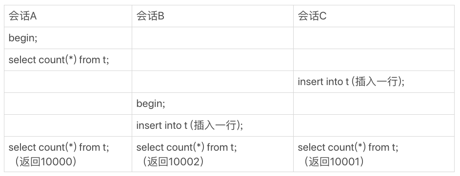
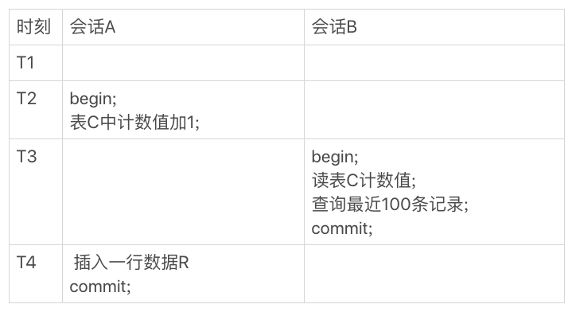

# 14 | count(*)这么慢，我该怎么办？
在开发系统的时候，你可能经常需要计算一个表的行数，比如一个交易系统的所有变更记录总数。这时候你可能会想，一条select count(\*) from t 语句不就解决了吗？

但是，你会发现随着系统中记录数越来越多，这条语句执行得也会越来越慢。然后你可能就想了，MySQL怎么这么笨啊，记个总数，每次要查的时候直接读出来，不就好了吗。

那么今天，我们就来聊聊count(\*)语句到底是怎样实现的，以及MySQL为什么会这么实现。然后，我会再和你说说，如果应用中有这种频繁变更并需要统计表行数的需求，业务设计上可以怎么做。

# count(\*)的实现方式

你首先要明确的是，在不同的MySQL引擎中，count(\*)有不同的实现方式。

- MyISAM引擎把一个表的总行数存在了磁盘上，因此执行count(\*)的时候会直接返回这个数，效率很高；
- 而InnoDB引擎就麻烦了，它执行count(\*)的时候，需要把数据一行一行地从引擎里面读出来，然后累积计数。

这里需要注意的是，我们在这篇文章里讨论的是没有过滤条件的count(\*)，如果加了where 条件的话，MyISAM表也是不能返回得这么快的。

在前面的文章中，我们一起分析了为什么要使用InnoDB，因为不论是在事务支持、并发能力还是在数据安全方面，InnoDB都优于MyISAM。我猜你的表也一定是用了InnoDB引擎。这就是当你的记录数越来越多的时候，计算一个表的总行数会越来越慢的原因。

那 **为什么InnoDB不跟MyISAM一样，也把数字存起来呢？**

这是因为即使是在同一个时刻的多个查询，由于多版本并发控制（MVCC）的原因，InnoDB表“应该返回多少行”也是不确定的。这里，我用一个算count(\*)的例子来为你解释一下。

假设表t中现在有10000条记录，我们设计了三个用户并行的会话。

- 会话A先启动事务并查询一次表的总行数；
- 会话B启动事务，插入一行后记录后，查询表的总行数；
- 会话C先启动一个单独的语句，插入一行记录后，查询表的总行数。

我们假设从上到下是按照时间顺序执行的，同一行语句是在同一时刻执行的。

图1 会话A、B、C的执行流程

你会看到，在最后一个时刻，三个会话A、B、C会同时查询表t的总行数，但拿到的结果却不同。

这和InnoDB的事务设计有关系，可重复读是它默认的隔离级别，在代码上就是通过多版本并发控制，也就是MVCC来实现的。每一行记录都要判断自己是否对这个会话可见，因此对于count(\*)请求来说，InnoDB只好把数据一行一行地读出依次判断，可见的行才能够用于计算“基于这个查询”的表的总行数。

> 备注：如果你对MVCC记忆模糊了，可以再回顾下第3篇文章 [《事务隔离：为什么你改了我还看不见？》](https://time.geekbang.org/column/article/68963) 和第8篇文章 [《事务到底是隔离的还是不隔离的？》](https://time.geekbang.org/column/article/70562) 中的相关内容。

当然，现在这个看上去笨笨的MySQL，在执行count(\*)操作的时候还是做了优化的。

你知道的，InnoDB是索引组织表，主键索引树的叶子节点是数据，而普通索引树的叶子节点是主键值。所以，普通索引树比主键索引树小很多。对于count(\*)这样的操作，遍历哪个索引树得到的结果逻辑上都是一样的。因此，MySQL优化器会找到最小的那棵树来遍历。 **在保证逻辑正确的前提下，尽量减少扫描的数据量，是数据库系统设计的通用法则之一。**

如果你用过show table status 命令的话，就会发现这个命令的输出结果里面也有一个TABLE\_ROWS用于显示这个表当前有多少行，这个命令执行挺快的，那这个TABLE\_ROWS能代替count(\*)吗？

你可能还记得在第10篇文章 [《 MySQL为什么有时候会选错索引？》](https://time.geekbang.org/column/article/71173) 中我提到过，索引统计的值是通过采样来估算的。实际上，TABLE\_ROWS就是从这个采样估算得来的，因此它也很不准。有多不准呢，官方文档说误差可能达到40%到50%。 **所以，show table status命令显示的行数也不能直接使用。**

到这里我们小结一下：

- MyISAM表虽然count(\*)很快，但是不支持事务；
- show table status命令虽然返回很快，但是不准确；
- InnoDB表直接count(\*)会遍历全表，虽然结果准确，但会导致性能问题。

那么，回到文章开头的问题，如果你现在有一个页面经常要显示交易系统的操作记录总数，到底应该怎么办呢？答案是，我们只能自己计数。

接下来，我们讨论一下，看看自己计数有哪些方法，以及每种方法的优缺点有哪些。

这里，我先和你说一下这些方法的基本思路：你需要自己找一个地方，把操作记录表的行数存起来。

# 用缓存系统保存计数

对于更新很频繁的库来说，你可能会第一时间想到，用缓存系统来支持。

你可以用一个Redis服务来保存这个表的总行数。这个表每被插入一行Redis计数就加1，每被删除一行Redis计数就减1。这种方式下，读和更新操作都很快，但你再想一下这种方式存在什么问题吗？

没错，缓存系统可能会丢失更新。

Redis的数据不能永久地留在内存里，所以你会找一个地方把这个值定期地持久化存储起来。但即使这样，仍然可能丢失更新。试想如果刚刚在数据表中插入了一行，Redis中保存的值也加了1，然后Redis异常重启了，重启后你要从存储redis数据的地方把这个值读回来，而刚刚加1的这个计数操作却丢失了。

当然了，这还是有解的。比如，Redis异常重启以后，到数据库里面单独执行一次count(\*)获取真实的行数，再把这个值写回到Redis里就可以了。异常重启毕竟不是经常出现的情况，这一次全表扫描的成本，还是可以接受的。

但实际上， **将计数保存在缓存系统中的方式，还不只是丢失更新的问题。即使Redis正常工作，这个值还是逻辑上不精确的。**

你可以设想一下有这么一个页面，要显示操作记录的总数，同时还要显示最近操作的100条记录。那么，这个页面的逻辑就需要先到Redis里面取出计数，再到数据表里面取数据记录。

我们是这么定义不精确的：

1. 一种是，查到的100行结果里面有最新插入记录，而Redis的计数里还没加1；

2. 另一种是，查到的100行结果里没有最新插入的记录，而Redis的计数里已经加了1。

这两种情况，都是逻辑不一致的。

我们一起来看看这个时序图。

图2 会话A、B执行时序图

图2中，会话A是一个插入交易记录的逻辑，往数据表里插入一行R，然后Redis计数加1；会话B就是查询页面显示时需要的数据。

在图2的这个时序里，在T3时刻会话B来查询的时候，会显示出新插入的R这个记录，但是Redis的计数还没加1。这时候，就会出现我们说的数据不一致。

你一定会说，这是因为我们执行新增记录逻辑时候，是先写数据表，再改Redis计数。而读的时候是先读Redis，再读数据表，这个顺序是相反的。那么，如果保持顺序一样的话，是不是就没问题了？我们现在把会话A的更新顺序换一下，再看看执行结果。

图3 调整顺序后，会话A、B的执行时序图

你会发现，这时候反过来了，会话B在T3时刻查询的时候，Redis计数加了1了，但还查不到新插入的R这一行，也是数据不一致的情况。

在并发系统里面，我们是无法精确控制不同线程的执行时刻的，因为存在图中的这种操作序列，所以，我们说即使Redis正常工作，这个计数值还是逻辑上不精确的。

# 在数据库保存计数

根据上面的分析，用缓存系统保存计数有丢失数据和计数不精确的问题。那么， **如果我们把这个计数直接放到数据库里单独的一张计数表C中，又会怎么样呢？**

首先，这解决了崩溃丢失的问题，InnoDB是支持崩溃恢复不丢数据的。

> 备注：关于InnoDB的崩溃恢复，你可以再回顾一下第2篇文章 [《日志系统：一条SQL更新语句是如何执行的？》](https://time.geekbang.org/column/article/68633) 中的相关内容。

然后，我们再看看能不能解决计数不精确的问题。

你会说，这不一样吗？无非就是把图3中对Redis的操作，改成了对计数表C的操作。只要出现图3的这种执行序列，这个问题还是无解的吧？

这个问题还真不是无解的。

我们这篇文章要解决的问题，都是由于InnoDB要支持事务，从而导致InnoDB表不能把count(\*)直接存起来，然后查询的时候直接返回形成的。

所谓以子之矛攻子之盾，现在我们就利用“事务”这个特性，把问题解决掉。

图4 会话A、B的执行时序图

我们来看下现在的执行结果。虽然会话B的读操作仍然是在T3执行的，但是因为这时候更新事务还没有提交，所以计数值加1这个操作对会话B还不可见。

因此，会话B看到的结果里， 查计数值和“最近100条记录”看到的结果，逻辑上就是一致的。

# 不同的count用法

在前面文章的评论区，有同学留言问到：在select count(?) from t这样的查询语句里面，count(\*)、count(主键id)、count(字段)和count(1)等不同用法的性能，有哪些差别。今天谈到了count(\*)的性能问题，我就借此机会和你详细说明一下这几种用法的性能差别。

需要注意的是，下面的讨论还是基于InnoDB引擎的。

这里，首先你要弄清楚count()的语义。count()是一个聚合函数，对于返回的结果集，一行行地判断，如果count函数的参数不是NULL，累计值就加1，否则不加。最后返回累计值。

所以，count(\*)、count(主键id)和count(1) 都表示返回满足条件的结果集的总行数；而count(字段），则表示返回满足条件的数据行里面，参数“字段”不为NULL的总个数。

至于分析性能差别的时候，你可以记住这么几个原则：

1. server层要什么就给什么；

2. InnoDB只给必要的值；

3. 现在的优化器只优化了count(\*)的语义为“取行数”，其他“显而易见”的优化并没有做。

这是什么意思呢？接下来，我们就一个个地来看看。

**对于count(主键id)来说**，InnoDB引擎会遍历整张表，把每一行的id值都取出来，返回给server层。server层拿到id后，判断是不可能为空的，就按行累加。

**对于count(1)来说**，InnoDB引擎遍历整张表，但不取值。server层对于返回的每一行，放一个数字“1”进去，判断是不可能为空的，按行累加。

单看这两个用法的差别的话，你能对比出来，count(1)执行得要比count(主键id)快。因为从引擎返回id会涉及到解析数据行，以及拷贝字段值的操作。

**对于count(字段)来说**：

1. 如果这个“字段”是定义为not null的话，一行行地从记录里面读出这个字段，判断不能为null，按行累加；

2. 如果这个“字段”定义允许为null，那么执行的时候，判断到有可能是null，还要把值取出来再判断一下，不是null才累加。

也就是前面的第一条原则，server层要什么字段，InnoDB就返回什么字段。

**但是count(\*)是例外**，并不会把全部字段取出来，而是专门做了优化，不取值。count(\*)肯定不是null，按行累加。

看到这里，你一定会说，优化器就不能自己判断一下吗，主键id肯定非空啊，为什么不能按照count(\*)来处理，多么简单的优化啊。

当然，MySQL专门针对这个语句进行优化，也不是不可以。但是这种需要专门优化的情况太多了，而且MySQL已经优化过count(\*)了，你直接使用这种用法就可以了。

所以结论是：按照效率排序的话，count(字段)<count(主键id)<count(1)≈count(\*)，所以我建议你，尽量使用count(\*)。

# 小结

今天，我和你聊了聊MySQL中获得表行数的两种方法。我们提到了在不同引擎中count(\*)的实现方式是不一样的，也分析了用缓存系统来存储计数值存在的问题。

其实，把计数放在Redis里面，不能够保证计数和MySQL表里的数据精确一致的原因，是 **这两个不同的存储构成的系统，不支持分布式事务，无法拿到精确一致的视图。** 而把计数值也放在MySQL中，就解决了一致性视图的问题。

InnoDB引擎支持事务，我们利用好事务的原子性和隔离性，就可以简化在业务开发时的逻辑。这也是InnoDB引擎备受青睐的原因之一。

最后，又到了今天的思考题时间了。

在刚刚讨论的方案中，我们用了事务来确保计数准确。由于事务可以保证中间结果不被别的事务读到，因此修改计数值和插入新记录的顺序是不影响逻辑结果的。但是，从并发系统性能的角度考虑，你觉得在这个事务序列里，应该先插入操作记录，还是应该先更新计数表呢？

你可以把你的思考和观点写在留言区里，我会在下一篇文章的末尾给出我的参考答案。感谢你的收听，也欢迎你把这篇文章分享给更多的朋友一起阅读。

# 上期问题时间

上期我给你留的问题是，什么时候使用alter table t engine=InnoDB会让一个表占用的空间反而变大。

在这篇文章的评论区里面，大家都提到了一个点，就是这个表，本身就已经没有空洞的了，比如说刚刚做过一次重建表操作。

在DDL期间，如果刚好有外部的DML在执行，这期间可能会引入一些新的空洞。

@飞翔 提到了一个更深刻的机制，是我们在文章中没说的。在重建表的时候，InnoDB不会把整张表占满，每个页留了1/16给后续的更新用。也就是说，其实重建表之后不是“最”紧凑的。

假如是这么一个过程：

1. 将表t重建一次；

2. 插入一部分数据，但是插入的这些数据，用掉了一部分的预留空间；

3. 这种情况下，再重建一次表t，就可能会出现问题中的现象。

评论区留言点赞板：

> @W\_T 等同学提到了数据表本身紧凑的情况；
>
> @undifined 提了一个好问题， @帆帆帆帆帆帆帆帆 同学回答了这个问题；
>
> @陈飞 @郜 @wang chen wen 都提了很不错的问题，大家可以去看看。