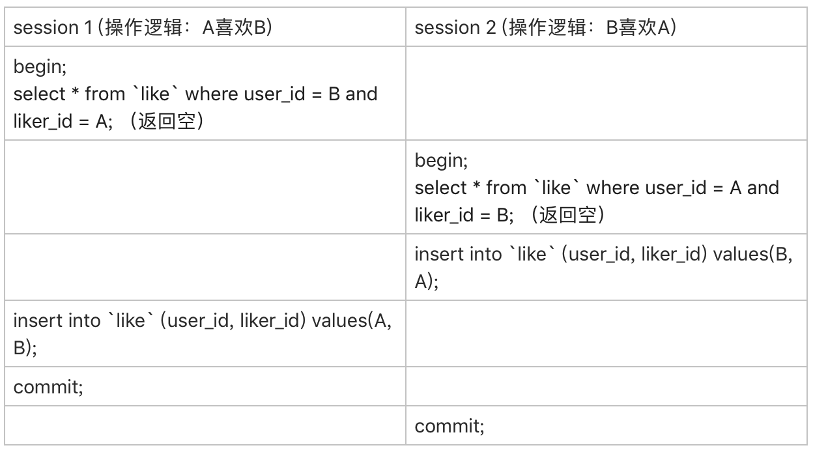

# 15 | 答疑文章（一）：日志和索引相关问题
在今天这篇答疑文章更新前，MySQL实战这个专栏已经更新了14篇。在这些文章中，大家在评论区留下了很多高质量的留言。现在，每篇文章的评论区都有热心的同学帮忙总结文章知识点，也有不少同学提出了很多高质量的问题，更有一些同学帮忙解答其他同学提出的问题。

在浏览这些留言并回复的过程中，我倍受鼓舞，也尽我所知地帮助你解决问题、和你讨论。可以说，你们的留言活跃了整个专栏的氛围、提升了整个专栏的质量，谢谢你们。

评论区的大多数留言我都直接回复了，对于需要展开说明的问题，我都拿出小本子记了下来。这些被记下来的问题，就是我们今天这篇答疑文章的素材了。

到目前为止，我已经收集了47个问题，很难通过今天这一篇文章全部展开。所以，我就先从中找了几个联系非常紧密的问题，串了起来，希望可以帮你解决关于日志和索引的一些疑惑。而其他问题，我们就留着后面慢慢展开吧。

# 日志相关问题

我在第2篇文章 [《日志系统：一条SQL更新语句是如何执行的？》](https://time.geekbang.org/column/article/68633) 中，和你讲到binlog（归档日志）和redo log（重做日志）配合崩溃恢复的时候，用的是反证法，说明了如果没有两阶段提交，会导致MySQL出现主备数据不一致等问题。

在这篇文章下面，很多同学在问，在两阶段提交的不同瞬间，MySQL如果发生异常重启，是怎么保证数据完整性的？

现在，我们就从这个问题开始吧。

我再放一次两阶段提交的图，方便你学习下面的内容。


图1 两阶段提交示意图

这里，我要先和你解释一个误会式的问题。有同学在评论区问到，这个图不是一个update语句的执行流程吗，怎么还会调用commit语句？

他产生这个疑问的原因，是把 **两个“commit”的概念** 混淆了：

- 他说的“commit语句”，是指MySQL语法中，用于提交一个事务的命令。一般跟begin/start transaction 配对使用。
- 而我们图中用到的这个“commit步骤”，指的是事务提交过程中的一个小步骤，也是最后一步。当这个步骤执行完成后，这个事务就提交完成了。
- “commit语句”执行的时候，会包含“commit 步骤”。

而我们这个例子里面，没有显式地开启事务，因此这个update语句自己就是一个事务，在执行完成后提交事务时，就会用到这个“commit步骤“。

接下来，我们就一起分析一下 **在两阶段提交的不同时刻，MySQL异常重启会出现什么现象。**

如果在图中时刻A的地方，也就是写入redo log 处于prepare阶段之后、写binlog之前，发生了崩溃（crash），由于此时binlog还没写，redo log也还没提交，所以崩溃恢复的时候，这个事务会回滚。这时候，binlog还没写，所以也不会传到备库。到这里，大家都可以理解。

大家出现问题的地方，主要集中在时刻B，也就是binlog写完，redo log还没commit前发生crash，那崩溃恢复的时候MySQL会怎么处理？

我们先来看一下崩溃恢复时的判断规则。

1. 如果redo log里面的事务是完整的，也就是已经有了commit标识，则直接提交；

2. 如果redo log里面的事务只有完整的prepare，则判断对应的事务binlog是否存在并完整：


   a. 如果是，则提交事务；


   b. 否则，回滚事务。


这里，时刻B发生crash对应的就是2(a)的情况，崩溃恢复过程中事务会被提交。

现在，我们继续延展一下这个问题。

## 追问1：MySQL怎么知道binlog是完整的?

回答：一个事务的binlog是有完整格式的：

- statement格式的binlog，最后会有COMMIT；
- row格式的binlog，最后会有一个XID event。

另外，在MySQL 5.6.2版本以后，还引入了binlog-checksum参数，用来验证binlog内容的正确性。对于binlog日志由于磁盘原因，可能会在日志中间出错的情况，MySQL可以通过校验checksum的结果来发现。所以，MySQL还是有办法验证事务binlog的完整性的。

## 追问2：redo log 和 binlog是怎么关联起来的?

回答：它们有一个共同的数据字段，叫XID。崩溃恢复的时候，会按顺序扫描redo log：

- 如果碰到既有prepare、又有commit的redo log，就直接提交；
- 如果碰到只有parepare、而没有commit的redo log，就拿着XID去binlog找对应的事务。

## 追问3：处于prepare阶段的redo log加上完整binlog，重启就能恢复，MySQL为什么要这么设计?

回答：其实，这个问题还是跟我们在反证法中说到的数据与备份的一致性有关。在时刻B，也就是binlog写完以后MySQL发生崩溃，这时候binlog已经写入了，之后就会被从库（或者用这个binlog恢复出来的库）使用。

所以，在主库上也要提交这个事务。采用这个策略，主库和备库的数据就保证了一致性。

## 追问4：如果这样的话，为什么还要两阶段提交呢？干脆先redo log写完，再写binlog。崩溃恢复的时候，必须得两个日志都完整才可以。是不是一样的逻辑？

回答：其实，两阶段提交是经典的分布式系统问题，并不是MySQL独有的。

如果必须要举一个场景，来说明这么做的必要性的话，那就是事务的持久性问题。

对于InnoDB引擎来说，如果redo log提交完成了，事务就不能回滚（如果这还允许回滚，就可能覆盖掉别的事务的更新）。而如果redo log直接提交，然后binlog写入的时候失败，InnoDB又回滚不了，数据和binlog日志又不一致了。

两阶段提交就是为了给所有人一个机会，当每个人都说“我ok”的时候，再一起提交。

## 追问5：不引入两个日志，也就没有两阶段提交的必要了。只用binlog来支持崩溃恢复，又能支持归档，不就可以了？

回答：这位同学的意思是，只保留binlog，然后可以把提交流程改成这样：… -> “数据更新到内存” -> “写 binlog” -> “提交事务”，是不是也可以提供崩溃恢复的能力？

答案是不可以。

如果说 **历史原因** 的话，那就是InnoDB并不是MySQL的原生存储引擎。MySQL的原生引擎是MyISAM，设计之初就有没有支持崩溃恢复。

InnoDB在作为MySQL的插件加入MySQL引擎家族之前，就已经是一个提供了崩溃恢复和事务支持的引擎了。

InnoDB接入了MySQL后，发现既然binlog没有崩溃恢复的能力，那就用InnoDB原有的redo log好了。

而如果说 **实现上的原因** 的话，就有很多了。就按照问题中说的，只用binlog来实现崩溃恢复的流程，我画了一张示意图，这里就没有redo log了。


图2 只用binlog支持崩溃恢复

这样的流程下，binlog还是不能支持崩溃恢复的。我说一个不支持的点吧：binlog没有能力恢复“数据页”。

如果在图中标的位置，也就是binlog2写完了，但是整个事务还没有commit的时候，MySQL发生了crash。

重启后，引擎内部事务2会回滚，然后应用binlog2可以补回来；但是对于事务1来说，系统已经认为提交完成了，不会再应用一次binlog1。

但是，InnoDB引擎使用的是WAL技术，执行事务的时候，写完内存和日志，事务就算完成了。如果之后崩溃，要依赖于日志来恢复数据页。

也就是说在图中这个位置发生崩溃的话，事务1也是可能丢失了的，而且是数据页级的丢失。此时，binlog里面并没有记录数据页的更新细节，是补不回来的。

你如果要说，那我优化一下binlog的内容，让它来记录数据页的更改可以吗？但，这其实就是又做了一个redo log出来。

所以，至少现在的binlog能力，还不能支持崩溃恢复。

## 追问6：那能不能反过来，只用redo log，不要binlog？

回答：如果只从崩溃恢复的角度来讲是可以的。你可以把binlog关掉，这样就没有两阶段提交了，但系统依然是crash-safe的。

但是，如果你了解一下业界各个公司的使用场景的话，就会发现在正式的生产库上，binlog都是开着的。因为binlog有着redo log无法替代的功能。

一个是归档。redo log是循环写，写到末尾是要回到开头继续写的。这样历史日志没法保留，redo log也就起不到归档的作用。

一个就是MySQL系统依赖于binlog。binlog作为MySQL一开始就有的功能，被用在了很多地方。其中，MySQL系统高可用的基础，就是binlog复制。

还有很多公司有异构系统（比如一些数据分析系统），这些系统就靠消费MySQL的binlog来更新自己的数据。关掉binlog的话，这些下游系统就没法输入了。

总之，由于现在包括MySQL高可用在内的很多系统机制都依赖于binlog，所以“鸠占鹊巢”redo log还做不到。你看，发展生态是多么重要。

## 追问7：redo log一般设置多大？

回答：redo log太小的话，会导致很快就被写满，然后不得不强行刷redo log，这样WAL机制的能力就发挥不出来了。

所以，如果是现在常见的几个TB的磁盘的话，就不要太小气了，直接将redo log设置为4个文件、每个文件1GB吧。

## 追问8：正常运行中的实例，数据写入后的最终落盘，是从redo log更新过来的还是从buffer pool更新过来的呢？

回答：这个问题其实问得非常好。这里涉及到了，“redo log里面到底是什么”的问题。

实际上，redo log并没有记录数据页的完整数据，所以它并没有能力自己去更新磁盘数据页，也就不存在“数据最终落盘，是由redo log更新过去”的情况。

1. 如果是正常运行的实例的话，数据页被修改以后，跟磁盘的数据页不一致，称为脏页。最终数据落盘，就是把内存中的数据页写盘。这个过程，甚至与redo log毫无关系。

2. 在崩溃恢复场景中，InnoDB如果判断到一个数据页可能在崩溃恢复的时候丢失了更新，就会将它读到内存，然后让redo log更新内存内容。更新完成后，内存页变成脏页，就回到了第一种情况的状态。


## 追问9：redo log buffer是什么？是先修改内存，还是先写redo log文件？

回答：这两个问题可以一起回答。

在一个事务的更新过程中，日志是要写多次的。比如下面这个事务：

```
begin;
insert into t1 ...
insert into t2 ...
commit;

```

这个事务要往两个表中插入记录，插入数据的过程中，生成的日志都得先保存起来，但又不能在还没commit的时候就直接写到redo log文件里。

所以，redo log buffer就是一块内存，用来先存redo日志的。也就是说，在执行第一个insert的时候，数据的内存被修改了，redo log buffer也写入了日志。

但是，真正把日志写到redo log文件（文件名是 ib\_logfile+数字），是在执行commit语句的时候做的。

（这里说的是事务执行过程中不会“主动去刷盘”，以减少不必要的IO消耗。但是可能会出现“被动写入磁盘”，比如内存不够、其他事务提交等情况。这个问题我们会在后面第22篇文章《MySQL有哪些“饮鸩止渴”的提高性能的方法？》中再详细展开）。

单独执行一个更新语句的时候，InnoDB会自己启动一个事务，在语句执行完成的时候提交。过程跟上面是一样的，只不过是“压缩”到了一个语句里面完成。

以上这些问题，就是把大家提过的关于redo log和binlog的问题串起来，做的一次集中回答。如果你还有问题，可以在评论区继续留言补充。

# 业务设计问题

接下来，我再和你分享@ithunter 同学在第8篇文章 [《](https://time.geekbang.org/column/article/70562) [事务到底是隔离的还是不隔离的？](https://time.geekbang.org/column/article/70562) [》](https://time.geekbang.org/column/article/70562) 的评论区提到的跟索引相关的一个问题。我觉得这个问题挺有趣、也挺实用的，其他同学也可能会碰上这样的场景，在这里解答和分享一下。

问题是这样的（我文字上稍微做了点修改，方便大家理解）：

> 业务上有这样的需求，A、B两个用户，如果互相关注，则成为好友。设计上是有两张表，一个是like表，一个是friend表，like表有user\_id、liker\_id两个字段，我设置为复合唯一索引即uk\_user\_id\_liker\_id。语句执行逻辑是这样的：

> 以A关注B为例：
>
> 第一步，先查询对方有没有关注自己（B有没有关注A）
>
> select \* from like where user\_id = B and liker\_id = A;

> 如果有，则成为好友
>
> insert into friend;

> 没有，则只是单向关注关系
>
> insert into like;

> 但是如果A、B同时关注对方，会出现不会成为好友的情况。因为上面第1步，双方都没关注对方。第1步即使使用了排他锁也不行，因为记录不存在，行锁无法生效。请问这种情况，在MySQL锁层面有没有办法处理？

首先，我要先赞一下这样的提问方式。虽然极客时间现在的评论区还不能追加评论，但如果大家能够一次留言就把问题讲清楚的话，其实影响也不大。所以，我希望你在留言提问的时候，也能借鉴这种方式。

接下来，我把@ithunter 同学说的表模拟出来，方便我们讨论。

```
CREATE TABLE `like` (
  `id` int(11) NOT NULL AUTO_INCREMENT,
  `user_id` int(11) NOT NULL,
  `liker_id` int(11) NOT NULL,
  PRIMARY KEY (`id`),
  UNIQUE KEY `uk_user_id_liker_id` (`user_id`,`liker_id`)
) ENGINE=InnoDB;

CREATE TABLE `friend` (
  `id` int(11) NOT NULL AUTO_INCREMENT,
  `friend_1_id` int(11) NOT NULL,
  `friend_2_id` int(11) NOT NULL,
  UNIQUE KEY `uk_friend` (`friend_1_id`,`friend_2_id`),
  PRIMARY KEY (`id`)
) ENGINE=InnoDB;

```

虽然这个题干中，并没有说到friend表的索引结构。但我猜测friend\_1\_id和friend\_2\_id也有索引，为便于描述，我给加上唯一索引。

顺便说明一下，“like”是关键字，我一般不建议使用关键字作为库名、表名、字段名或索引名。

我把他的疑问翻译一下，在并发场景下，同时有两个人，设置为关注对方，就可能导致无法成功加为朋友关系。

现在，我用你已经熟悉的时刻顺序表的形式，把这两个事务的执行语句列出来：



图3 并发“喜欢”逻辑操作顺序

由于一开始A和B之间没有关注关系，所以两个事务里面的select语句查出来的结果都是空。

因此，session 1的逻辑就是“既然B没有关注A，那就只插入一个单向关注关系”。session 2也同样是这个逻辑。

这个结果对业务来说就是bug了。因为在业务设定里面，这两个逻辑都执行完成以后，是应该在friend表里面插入一行记录的。

如提问里面说的，“第1步即使使用了排他锁也不行，因为记录不存在，行锁无法生效”。不过，我想到了另外一个方法，来解决这个问题。

首先，要给“like”表增加一个字段，比如叫作 relation\_ship，并设为整型，取值1、2、3。

> 值是1的时候，表示user\_id 关注 liker\_id;
>
> 值是2的时候，表示liker\_id 关注 user\_id;
>
> 值是3的时候，表示互相关注。

然后，当 A关注B的时候，逻辑改成如下所示的样子：

应用代码里面，比较A和B的大小，如果A<B，就执行下面的逻辑

```
mysql> begin; /*启动事务*/
insert into `like`(user_id, liker_id, relation_ship) values(A, B, 1) on duplicate key update relation_ship=relation_ship | 1;
select relation_ship from `like` where user_id=A and liker_id=B;
/*代码中判断返回的 relation_ship，
  如果是1，事务结束，执行 commit
  如果是3，则执行下面这两个语句：
  */
insert ignore into friend(friend_1_id, friend_2_id) values(A,B);
commit;

```

如果A>B，则执行下面的逻辑

```
mysql> begin; /*启动事务*/
insert into `like`(user_id, liker_id, relation_ship) values(B, A, 2) on duplicate key update relation_ship=relation_ship | 2;
select relation_ship from `like` where user_id=B and liker_id=A;
/*代码中判断返回的 relation_ship，
  如果是2，事务结束，执行 commit
  如果是3，则执行下面这两个语句：
*/
insert ignore into friend(friend_1_id, friend_2_id) values(B,A);
commit;

```

这个设计里，让“like”表里的数据保证user\_id < liker\_id，这样不论是A关注B，还是B关注A，在操作“like”表的时候，如果反向的关系已经存在，就会出现行锁冲突。

然后，insert … on duplicate语句，确保了在事务内部，执行了这个SQL语句后，就强行占住了这个行锁，之后的select 判断relation\_ship这个逻辑时就确保了是在行锁保护下的读操作。

操作符 “\|” 是按位或，连同最后一句insert语句里的ignore，是为了保证重复调用时的幂等性。

这样，即使在双方“同时”执行关注操作，最终数据库里的结果，也是like表里面有一条关于A和B的记录，而且relation\_ship的值是3， 并且friend表里面也有了A和B的这条记录。

不知道你会不会吐槽：之前明明还说尽量不要使用唯一索引，结果这个例子一上来我就创建了两个。这里我要再和你说明一下，之前文章我们讨论的，是在“业务开发保证不会插入重复记录”的情况下，着重要解决性能问题的时候，才建议尽量使用普通索引。

而像这个例子里，按照这个设计，业务根本就是保证“我一定会插入重复数据，数据库一定要要有唯一性约束”，这时就没啥好说的了，唯一索引建起来吧。

# 小结

这是专栏的第一篇答疑文章。

我针对前14篇文章，大家在评论区中的留言，从中摘取了关于日志和索引的相关问题，串成了今天这篇文章。这里我也要再和你说一声，有些我答应在答疑文章中进行扩展的话题，今天这篇文章没来得及扩展，后续我会再找机会为你解答。所以，篇幅所限，评论区见吧。

最后，虽然这篇是答疑文章，但课后问题还是要有的。

我们创建了一个简单的表t，并插入一行，然后对这一行做修改。

```
mysql> CREATE TABLE `t` (
`id` int(11) NOT NULL primary key auto_increment,
`a` int(11) DEFAULT NULL
) ENGINE=InnoDB;
insert into t values(1,2);

```

这时候，表t里有唯一的一行数据(1,2)。假设，我现在要执行：

```
mysql> update t set a=2 where id=1;

```

你会看到这样的结果：


结果显示，匹配(rows matched)了一行，修改(Changed)了0行。

仅从现象上看，MySQL内部在处理这个命令的时候，可以有以下三种选择：

1. 更新都是先读后写的，MySQL读出数据，发现a的值本来就是2，不更新，直接返回，执行结束；

2. MySQL调用了InnoDB引擎提供的“修改为(1,2)”这个接口，但是引擎发现值与原来相同，不更新，直接返回；

3. InnoDB认真执行了“把这个值修改成(1,2)"这个操作，该加锁的加锁，该更新的更新。


你觉得实际情况会是以上哪种呢？你可否用构造实验的方式，来证明你的结论？进一步地，可以思考一下，MySQL为什么要选择这种策略呢？

你可以把你的验证方法和思考写在留言区里，我会在下一篇文章的末尾和你讨论这个问题。感谢你的收听，也欢迎你把这篇文章分享给更多的朋友一起阅读。

# 上期问题时间

上期的问题是，用一个计数表记录一个业务表的总行数，在往业务表插入数据的时候，需要给计数值加1。

逻辑实现上是启动一个事务，执行两个语句：

1. insert into 数据表；

2. update 计数表，计数值加1。


从系统并发能力的角度考虑，怎么安排这两个语句的顺序。

这里，我直接复制 @阿建 的回答过来供你参考：

> 并发系统性能的角度考虑，应该先插入操作记录，再更新计数表。
>
> 知识点在 [《行锁功过：怎么减少行锁对性能的影响？》](https://time.geekbang.org/column/article/70215)
>
> 因为更新计数表涉及到行锁的竞争，先插入再更新能最大程度地减少事务之间的锁等待，提升并发度。

评论区有同学说，应该把update计数表放后面，因为这个计数表可能保存了多个业务表的计数值。如果把update计数表放到事务的第一个语句，多个业务表同时插入数据的话，等待时间会更长。

这个答案的结论是对的，但是理解不太正确。即使我们用一个计数表记录多个业务表的行数，也肯定会给表名字段加唯一索引。类似于下面这样的表结构：

```
CREATE TABLE `rows_stat` (
  `table_name` varchar(64) NOT NULL,
  `row_count` int(10) unsigned NOT NULL,
  PRIMARY KEY (`table_name`)
) ENGINE=InnoDB;

```

在更新计数表的时候，一定会传入where table\_name=$table\_name，使用主键索引，更新加行锁只会锁在一行上。

而在不同业务表插入数据，是更新不同的行，不会有行锁。

评论区留言点赞板：

> @北天魔狼、@斜面镜子 Bil 和@Bin 等同学，都给出了正确答案；
>
> @果然如此 同学提了一个好问题，虽然引入事务，避免看到”业务上还没提交的更新”，但是Redis的计数被提前看到了。核心原因还是两个系统，不支持一致性视图；
>
> @ 帆帆帆帆帆帆帆帆 同学的问题提醒了大家，count(id)也是可以走普通索引得到的。