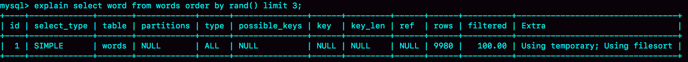
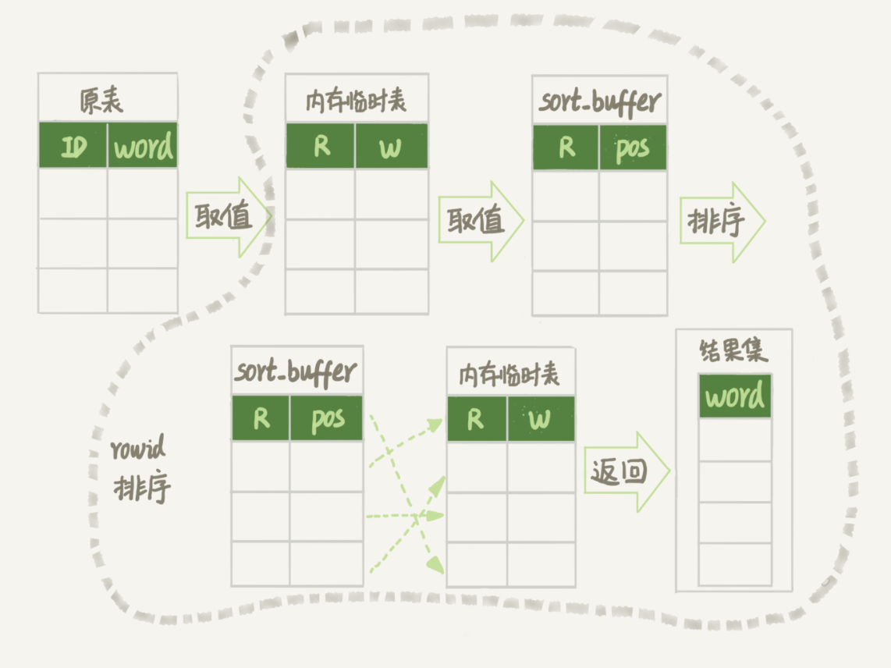
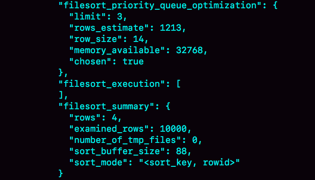
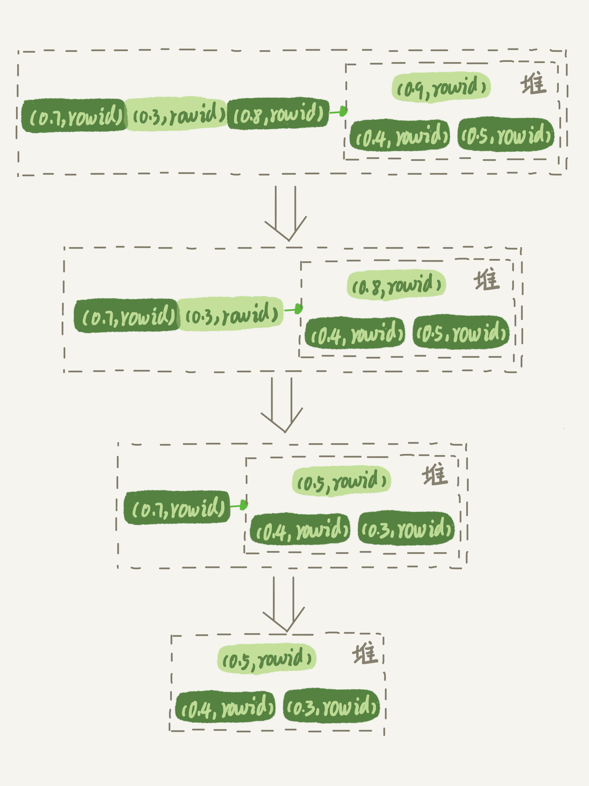

# 17 | 如何正确地显示随机消息？
我在上一篇文章，为你讲解完order by语句的几种执行模式后，就想到了之前一个做英语学习App的朋友碰到过的一个性能问题。今天这篇文章，我就从这个性能问题说起，和你说说MySQL中的另外一种排序需求，希望能够加深你对MySQL排序逻辑的理解。

这个英语学习App首页有一个随机显示单词的功能，也就是根据每个用户的级别有一个单词表，然后这个用户每次访问首页的时候，都会随机滚动显示三个单词。他们发现随着单词表变大，选单词这个逻辑变得越来越慢，甚至影响到了首页的打开速度。

现在，如果让你来设计这个SQL语句，你会怎么写呢？

为了便于理解，我对这个例子进行了简化：去掉每个级别的用户都有一个对应的单词表这个逻辑，直接就是从一个单词表中随机选出三个单词。这个表的建表语句和初始数据的命令如下：

```
mysql> CREATE TABLE `words` (
  `id` int(11) NOT NULL AUTO_INCREMENT,
  `word` varchar(64) DEFAULT NULL,
  PRIMARY KEY (`id`)
) ENGINE=InnoDB;

delimiter ;;
create procedure idata()
begin
  declare i int;
  set i=0;
  while i<10000 do
    insert into words(word) values(concat(char(97+(i div 1000)), char(97+(i % 1000 div 100)), char(97+(i % 100 div 10)), char(97+(i % 10))));
    set i=i+1;
  end while;
end;;
delimiter ;

call idata();

```

为了便于量化说明，我在这个表里面插入了10000行记录。接下来，我们就一起看看要随机选择3个单词，有什么方法实现，存在什么问题以及如何改进。

# 内存临时表

首先，你会想到用order by rand()来实现这个逻辑。

```
mysql> select word from words order by rand() limit 3;

```

这个语句的意思很直白，随机排序取前3个。虽然这个SQL语句写法很简单，但执行流程却有点复杂的。

我们先用explain命令来看看这个语句的执行情况。



图1 使用explain命令查看语句的执行情况

Extra字段显示Using temporary，表示的是需要使用临时表；Using filesort，表示的是需要执行排序操作。

因此这个Extra的意思就是，需要临时表，并且需要在临时表上排序。

这里，你可以先回顾一下 [上一篇文章](https://time.geekbang.org/column/article/73479) 中全字段排序和rowid排序的内容。我把上一篇文章的两个流程图贴过来，方便你复习。


图2 全字段排序


图3 rowid排序

然后，我再问你一个问题，你觉得对于临时内存表的排序来说，它会选择哪一种算法呢？回顾一下上一篇文章的一个结论： **对于InnoDB表来说**，执行全字段排序会减少磁盘访问，因此会被优先选择。

我强调了“InnoDB表”，你肯定想到了， **对于内存表，回表过程只是简单地根据数据行的位置，直接访问内存得到数据，根本不会导致多访问磁盘**。优化器没有了这一层顾虑，那么它会优先考虑的，就是用于排序的行越小越好了，所以，MySQL这时就会选择rowid排序。

理解了这个算法选择的逻辑，我们再来看看语句的执行流程。同时，通过今天的这个例子，我们来尝试分析一下语句的扫描行数。

这条语句的执行流程是这样的：

1. 创建一个临时表。这个临时表使用的是memory引擎，表里有两个字段，第一个字段是double类型，为了后面描述方便，记为字段R，第二个字段是varchar(64)类型，记为字段W。并且，这个表没有建索引。

2. 从words表中，按主键顺序取出所有的word值。对于每一个word值，调用rand()函数生成一个大于0小于1的随机小数，并把这个随机小数和word分别存入临时表的R和W字段中，到此，扫描行数是10000。

3. 现在临时表有10000行数据了，接下来你要在这个没有索引的内存临时表上，按照字段R排序。

4. 初始化 sort\_buffer。sort\_buffer中有两个字段，一个是double类型，另一个是整型。

5. 从内存临时表中一行一行地取出R值和位置信息（我后面会和你解释这里为什么是“位置信息”），分别存入sort\_buffer中的两个字段里。这个过程要对内存临时表做全表扫描，此时扫描行数增加10000，变成了20000。

6. 在sort\_buffer中根据R的值进行排序。注意，这个过程没有涉及到表操作，所以不会增加扫描行数。

7. 排序完成后，取出前三个结果的位置信息，依次到内存临时表中取出word值，返回给客户端。这个过程中，访问了表的三行数据，总扫描行数变成了20003。


接下来，我们通过慢查询日志（slow log）来验证一下我们分析得到的扫描行数是否正确。

```
# Query_time: 0.900376  Lock_time: 0.000347 Rows_sent: 3 Rows_examined: 20003
SET timestamp=1541402277;
select word from words order by rand() limit 3;

```

其中，Rows\_examined：20003就表示这个语句执行过程中扫描了20003行，也就验证了我们分析得出的结论。

这里插一句题外话，在平时学习概念的过程中，你可以经常这样做，先通过原理分析算出扫描行数，然后再通过查看慢查询日志，来验证自己的结论。我自己就是经常这么做，这个过程很有趣，分析对了开心，分析错了但是弄清楚了也很开心。

现在，我来把完整的排序执行流程图画出来。



图4 随机排序完整流程图1

图中的pos就是位置信息，你可能会觉得奇怪，这里的“位置信息”是个什么概念？在上一篇文章中，我们对InnoDB表排序的时候，明明用的还是ID字段。

这时候，我们就要回到一个基本概念： **MySQL的表是用什么方法来定位“一行数据”的。**

在前面 [第4](https://time.geekbang.org/column/article/69236) 和 [第5](https://time.geekbang.org/column/article/69636) 篇介绍索引的文章中，有几位同学问到，如果把一个InnoDB表的主键删掉，是不是就没有主键，就没办法回表了？

其实不是的。如果你创建的表没有主键，或者把一个表的主键删掉了，那么InnoDB会自己生成一个长度为6字节的rowid来作为主键。

这也就是排序模式里面，rowid名字的来历。实际上它表示的是：每个引擎用来唯一标识数据行的信息。

- 对于有主键的InnoDB表来说，这个rowid就是主键ID；
- 对于没有主键的InnoDB表来说，这个rowid就是由系统生成的；
- MEMORY引擎不是索引组织表。在这个例子里面，你可以认为它就是一个数组。因此，这个rowid其实就是数组的下标。

到这里，我来稍微小结一下： **order by rand()使用了内存临时表，内存临时表排序的时候使用了rowid排序方法。**

# 磁盘临时表

那么，是不是所有的临时表都是内存表呢？

其实不是的。tmp\_table\_size这个配置限制了内存临时表的大小，默认值是16M。如果临时表大小超过了tmp\_table\_size，那么内存临时表就会转成磁盘临时表。

磁盘临时表使用的引擎默认是InnoDB，是由参数internal\_tmp\_disk\_storage\_engine控制的。

当使用磁盘临时表的时候，对应的就是一个没有显式索引的InnoDB表的排序过程。

为了复现这个过程，我把tmp\_table\_size设置成1024，把sort\_buffer\_size设置成 32768, 把 max\_length\_for\_sort\_data 设置成16。

```
set tmp_table_size=1024;
set sort_buffer_size=32768;
set max_length_for_sort_data=16;
/* 打开 optimizer_trace，只对本线程有效 */
SET optimizer_trace='enabled=on';

/* 执行语句 */
select word from words order by rand() limit 3;

/* 查看 OPTIMIZER_TRACE 输出 */
SELECT * FROM `information_schema`.`OPTIMIZER_TRACE`\G

```



图5 OPTIMIZER\_TRACE部分结果

然后，我们来看一下这次OPTIMIZER\_TRACE的结果。

因为将max\_length\_for\_sort\_data设置成16，小于word字段的长度定义，所以我们看到sort\_mode里面显示的是rowid排序，这个是符合预期的，参与排序的是随机值R字段和rowid字段组成的行。

这时候你可能心算了一下，发现不对。R字段存放的随机值就8个字节，rowid是6个字节（至于为什么是6字节，就留给你课后思考吧），数据总行数是10000，这样算出来就有140000字节，超过了sort\_buffer\_size 定义的 32768字节了。但是，number\_of\_tmp\_files的值居然是0，难道不需要用临时文件吗？

这个SQL语句的排序确实没有用到临时文件，采用是MySQL 5.6版本引入的一个新的排序算法，即：优先队列排序算法。接下来，我们就看看为什么没有使用临时文件的算法，也就是归并排序算法，而是采用了优先队列排序算法。

其实，我们现在的SQL语句，只需要取R值最小的3个rowid。但是，如果使用归并排序算法的话，虽然最终也能得到前3个值，但是这个算法结束后，已经将10000行数据都排好序了。

也就是说，后面的9997行也是有序的了。但，我们的查询并不需要这些数据是有序的。所以，想一下就明白了，这浪费了非常多的计算量。

而优先队列算法，就可以精确地只得到三个最小值，执行流程如下：

1. 对于这10000个准备排序的(R,rowid)，先取前三行，构造成一个堆；

（对数据结构印象模糊的同学，可以先设想成这是一个由三个元素组成的数组）

1. 取下一个行(R’,rowid’)，跟当前堆里面最大的R比较，如果R’小于R，把这个(R,rowid)从堆中去掉，换成(R’,rowid’)；

2. 重复第2步，直到第10000个(R’,rowid’)完成比较。


这里我简单画了一个优先队列排序过程的示意图。



图6 优先队列排序算法示例

图6是模拟6个(R,rowid)行，通过优先队列排序找到最小的三个R值的行的过程。整个排序过程中，为了最快地拿到当前堆的最大值，总是保持最大值在堆顶，因此这是一个最大堆。

图5的OPTIMIZER\_TRACE结果中，filesort\_priority\_queue\_optimization这个部分的chosen=true，就表示使用了优先队列排序算法，这个过程不需要临时文件，因此对应的number\_of\_tmp\_files是0。

这个流程结束后，我们构造的堆里面，就是这个10000行里面R值最小的三行。然后，依次把它们的rowid取出来，去临时表里面拿到word字段，这个过程就跟上一篇文章的rowid排序的过程一样了。

我们再看一下上面一篇文章的SQL查询语句：

```
select city,name,age from t where city='杭州' order by name limit 1000  ;

```

你可能会问，这里也用到了limit，为什么没用优先队列排序算法呢？原因是，这条SQL语句是limit 1000，如果使用优先队列算法的话，需要维护的堆的大小就是1000行的(name,rowid)，超过了我设置的sort\_buffer\_size大小，所以只能使用归并排序算法。

总之，不论是使用哪种类型的临时表，order by rand()这种写法都会让计算过程非常复杂，需要大量的扫描行数，因此排序过程的资源消耗也会很大。

再回到我们文章开头的问题，怎么正确地随机排序呢？

# 随机排序方法

我们先把问题简化一下，如果只随机选择1个word值，可以怎么做呢？思路上是这样的：

1. 取得这个表的主键id的最大值M和最小值N;

2. 用随机函数生成一个最大值到最小值之间的数 X = (M-N)\*rand() + N;

3. 取不小于X的第一个ID的行。


我们把这个算法，暂时称作随机算法1。这里，我直接给你贴一下执行语句的序列:

```
mysql> select max(id),min(id) into @M,@N from t ;
set @X= floor((@M-@N+1)*rand() + @N);
select * from t where id >= @X limit 1;

```

这个方法效率很高，因为取max(id)和min(id)都是不需要扫描索引的，而第三步的select也可以用索引快速定位，可以认为就只扫描了3行。但实际上，这个算法本身并不严格满足题目的随机要求，因为ID中间可能有空洞，因此选择不同行的概率不一样，不是真正的随机。

比如你有4个id，分别是1、2、4、5，如果按照上面的方法，那么取到 id=4的这一行的概率是取得其他行概率的两倍。

如果这四行的id分别是1、2、40000、40001呢？这个算法基本就能当bug来看待了。

所以，为了得到严格随机的结果，你可以用下面这个流程:

1. 取得整个表的行数，并记为C。

2. 取得 Y = floor(C \* rand())。 floor函数在这里的作用，就是取整数部分。

3. 再用limit Y,1 取得一行。


我们把这个算法，称为随机算法2。下面这段代码，就是上面流程的执行语句的序列。

```
mysql> select count(*) into @C from t;
set @Y = floor(@C * rand());
set @sql = concat("select * from t limit ", @Y, ",1");
prepare stmt from @sql;
execute stmt;
DEALLOCATE prepare stmt;

```

由于limit 后面的参数不能直接跟变量，所以我在上面的代码中使用了prepare+execute的方法。你也可以把拼接SQL语句的方法写在应用程序中，会更简单些。

这个随机算法2，解决了算法1里面明显的概率不均匀问题。

MySQL处理limit Y,1 的做法就是按顺序一个一个地读出来，丢掉前Y个，然后把下一个记录作为返回结果，因此这一步需要扫描Y+1行。再加上，第一步扫描的C行，总共需要扫描C+Y+1行，执行代价比随机算法1的代价要高。

当然，随机算法2跟直接order by rand()比起来，执行代价还是小很多的。

你可能问了，如果按照这个表有10000行来计算的话，C=10000，要是随机到比较大的Y值，那扫描行数也跟20000差不多了，接近order by rand()的扫描行数，为什么说随机算法2的代价要小很多呢？我就把这个问题留给你去课后思考吧。

现在，我们再看看，如果我们按照随机算法2的思路，要随机取3个word值呢？你可以这么做：

1. 取得整个表的行数，记为C；

2. 根据相同的随机方法得到Y1、Y2、Y3；

3. 再执行三个limit Y, 1语句得到三行数据。


我们把这个算法，称作随机算法3。下面这段代码，就是上面流程的执行语句的序列。

```
mysql> select count(*) into @C from t;
set @Y1 = floor(@C * rand());
set @Y2 = floor(@C * rand());
set @Y3 = floor(@C * rand());
select * from t limit @Y1，1； //在应用代码里面取Y1、Y2、Y3值，拼出SQL后执行
select * from t limit @Y2，1；
select * from t limit @Y3，1；

```

# 小结

今天这篇文章，我是借着随机排序的需求，跟你介绍了MySQL对临时表排序的执行过程。

如果你直接使用order by rand()，这个语句需要Using temporary 和 Using filesort，查询的执行代价往往是比较大的。所以，在设计的时候你要尽量避开这种写法。

今天的例子里面，我们不是仅仅在数据库内部解决问题，还会让应用代码配合拼接SQL语句。在实际应用的过程中，比较规范的用法就是：尽量将业务逻辑写在业务代码中，让数据库只做“读写数据”的事情。因此，这类方法的应用还是比较广泛的。

最后，我给你留下一个思考题吧。

上面的随机算法3的总扫描行数是 C+(Y1+1)+(Y2+1)+(Y3+1)，实际上它还是可以继续优化，来进一步减少扫描行数的。

我的问题是，如果你是这个需求的开发人员，你会怎么做，来减少扫描行数呢？说说你的方案，并说明你的方案需要的扫描行数。

你可以把你的设计和结论写在留言区里，我会在下一篇文章的末尾和你讨论这个问题。感谢你的收听，也欢迎你把这篇文章分享给更多的朋友一起阅读。

# 上期问题时间

我在上一篇文章最后留给你的问题是，select \* from t where city in (“杭州”," 苏州 ") order by name limit 100;这个SQL语句是否需要排序？有什么方案可以避免排序？

虽然有(city,name)联合索引，对于单个city内部，name是递增的。但是由于这条SQL语句不是要单独地查一个city的值，而是同时查了"杭州"和" 苏州 "两个城市，因此所有满足条件的name就不是递增的了。也就是说，这条SQL语句需要排序。

那怎么避免排序呢？

这里，我们要用到(city,name)联合索引的特性，把这一条语句拆成两条语句，执行流程如下：

1. 执行select \* from t where city=“杭州” order by name limit 100; 这个语句是不需要排序的，客户端用一个长度为100的内存数组A保存结果。

2. 执行select \* from t where city=“苏州” order by name limit 100; 用相同的方法，假设结果被存进了内存数组B。

3. 现在A和B是两个有序数组，然后你可以用归并排序的思想，得到name最小的前100值，就是我们需要的结果了。


如果把这条SQL语句里“limit 100”改成“limit 10000,100”的话，处理方式其实也差不多，即：要把上面的两条语句改成写：

```
select * from t where city="杭州" order by name limit 10100;

```

和

```
 select * from t where city="苏州" order by name limit 10100。

```

这时候数据量较大，可以同时起两个连接一行行读结果，用归并排序算法拿到这两个结果集里，按顺序取第10001~10100的name值，就是需要的结果了。

当然这个方案有一个明显的损失，就是从数据库返回给客户端的数据量变大了。

所以，如果数据的单行比较大的话，可以考虑把这两条SQL语句改成下面这种写法：

```
select id,name from t where city="杭州" order by name limit 10100;

```

和

```
select id,name from t where city="苏州" order by name limit 10100。

```

然后，再用归并排序的方法取得按name顺序第10001~10100的name、id的值，然后拿着这100个id到数据库中去查出所有记录。

上面这些方法，需要你根据性能需求和开发的复杂度做出权衡。

评论区留言点赞板：

> 评论区很多同学都提到不能排序，说明各位对索引的存储都理解对了。
>
> @峰 同学提到了归并排序，是我们这个问题解法的核心思想；
>
> @老杨同志 的回答中提到了“从业务上砍掉功能”，这个也确实是在业务设计中可以考虑的一个方向；
>
> @某、人 帮忙回答了@发条橙子同学的问题，尤其是对问题一的回答，非常精彩。