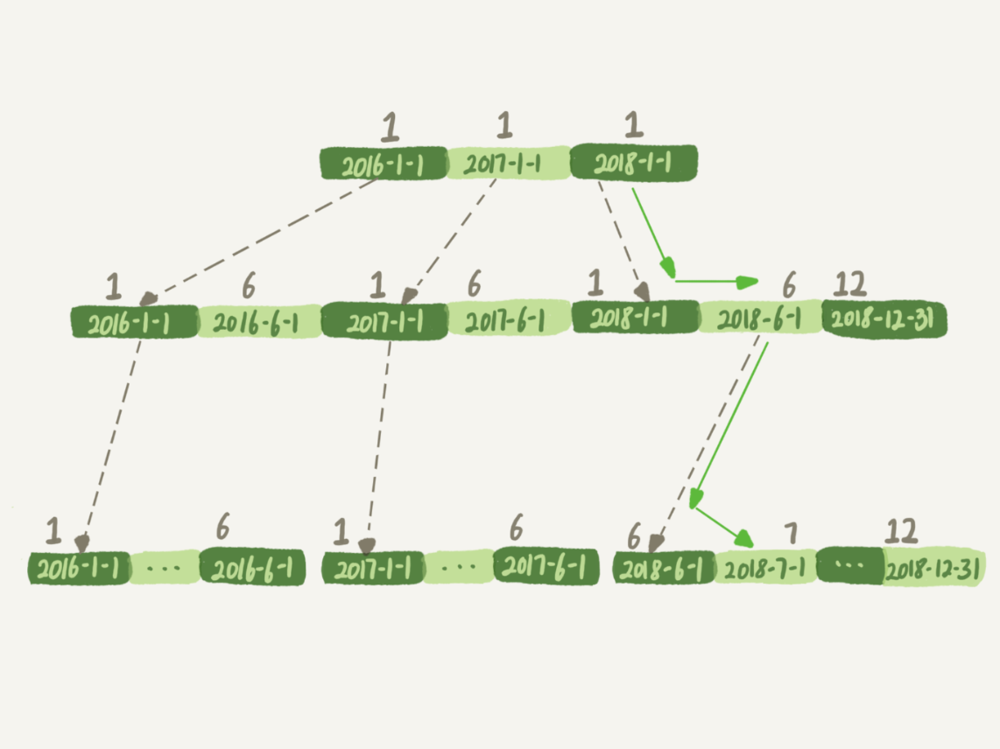
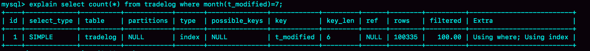
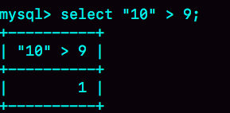
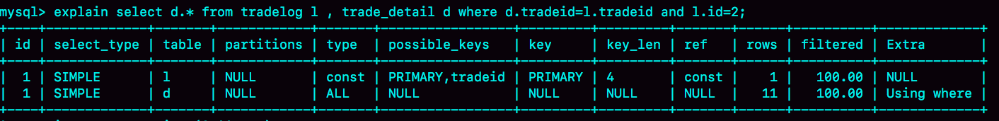
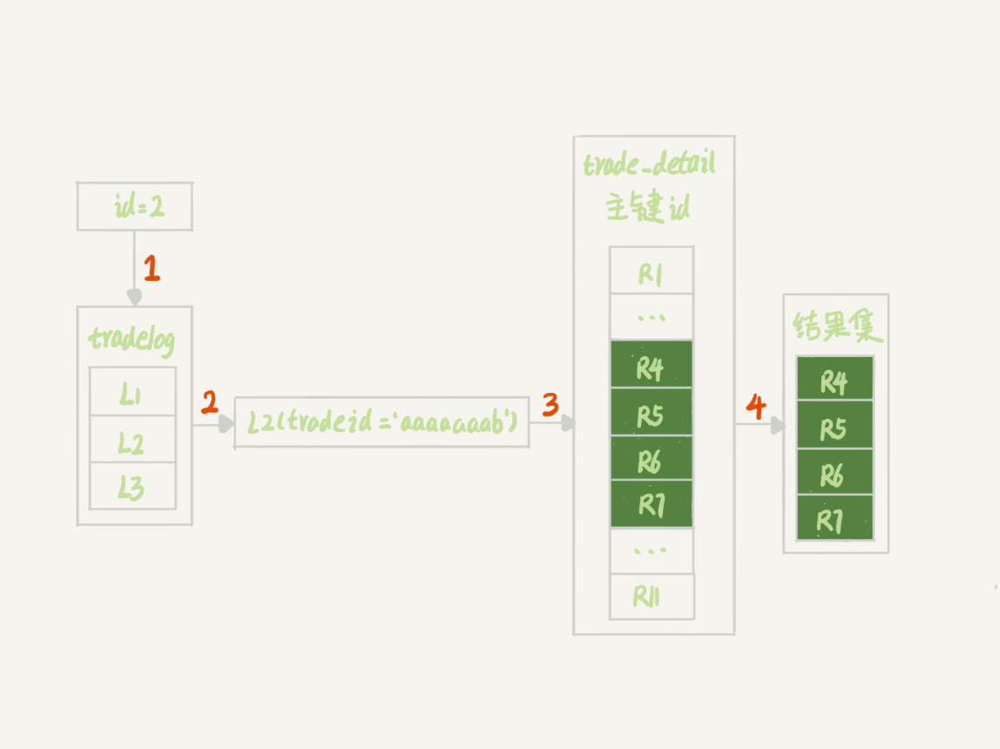
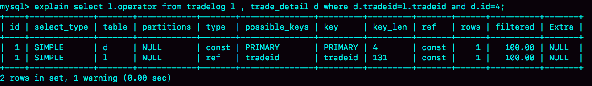
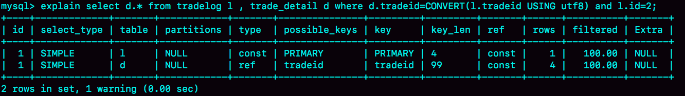

# 18 | 为什么这些SQL语句逻辑相同，性能却差异巨大？
在MySQL中，有很多看上去逻辑相同，但性能却差异巨大的SQL语句。对这些语句使用不当的话，就会不经意间导致整个数据库的压力变大。

我今天挑选了三个这样的案例和你分享。希望再遇到相似的问题时，你可以做到举一反三、快速解决问题。

# 案例一：条件字段函数操作

假设你现在维护了一个交易系统，其中交易记录表tradelog包含交易流水号（tradeid）、交易员id（operator）、交易时间（t\_modified）等字段。为了便于描述，我们先忽略其他字段。这个表的建表语句如下：

```
mysql> CREATE TABLE `tradelog` (
  `id` int(11) NOT NULL,
  `tradeid` varchar(32) DEFAULT NULL,
  `operator` int(11) DEFAULT NULL,
  `t_modified` datetime DEFAULT NULL,
  PRIMARY KEY (`id`),
  KEY `tradeid` (`tradeid`),
  KEY `t_modified` (`t_modified`)
) ENGINE=InnoDB DEFAULT CHARSET=utf8mb4;

```

假设，现在已经记录了从2016年初到2018年底的所有数据，运营部门有一个需求是，要统计发生在所有年份中7月份的交易记录总数。这个逻辑看上去并不复杂，你的SQL语句可能会这么写：

```
mysql> select count(*) from tradelog where month(t_modified)=7;

```

由于t\_modified字段上有索引，于是你就很放心地在生产库中执行了这条语句，但却发现执行了特别久，才返回了结果。

如果你问DBA同事为什么会出现这样的情况，他大概会告诉你：如果对字段做了函数计算，就用不上索引了，这是MySQL的规定。

现在你已经学过了InnoDB的索引结构了，可以再追问一句为什么？为什么条件是where t\_modified='2018-7-1’的时候可以用上索引，而改成where month(t\_modified)=7的时候就不行了？

下面是这个t\_modified索引的示意图。方框上面的数字就是month()函数对应的值。



图1 t\_modified索引示意图

如果你的SQL语句条件用的是where t\_modified='2018-7-1’的话，引擎就会按照上面绿色箭头的路线，快速定位到 t\_modified='2018-7-1’需要的结果。

实际上，B+树提供的这个快速定位能力，来源于同一层兄弟节点的有序性。

但是，如果计算month()函数的话，你会看到传入7的时候，在树的第一层就不知道该怎么办了。

也就是说， **对索引字段做函数操作，可能会破坏索引值的有序性，因此优化器就决定放弃走树搜索功能。**

需要注意的是，优化器并不是要放弃使用这个索引。

在这个例子里，放弃了树搜索功能，优化器可以选择遍历主键索引，也可以选择遍历索引t\_modified，优化器对比索引大小后发现，索引t\_modified更小，遍历这个索引比遍历主键索引来得更快。因此最终还是会选择索引t\_modified。

接下来，我们使用explain命令，查看一下这条SQL语句的执行结果。



图2 explain 结果

key="t\_modified"表示的是，使用了t\_modified这个索引；我在测试表数据中插入了10万行数据，rows=100335，说明这条语句扫描了整个索引的所有值；Extra字段的Using index，表示的是使用了覆盖索引。

也就是说，由于在t\_modified字段加了month()函数操作，导致了全索引扫描。为了能够用上索引的快速定位能力，我们就要把SQL语句改成基于字段本身的范围查询。按照下面这个写法，优化器就能按照我们预期的，用上t\_modified索引的快速定位能力了。

```
mysql> select count(*) from tradelog where
    -> (t_modified >= '2016-7-1' and t_modified<'2016-8-1') or
    -> (t_modified >= '2017-7-1' and t_modified<'2017-8-1') or
    -> (t_modified >= '2018-7-1' and t_modified<'2018-8-1');

```

当然，如果你的系统上线时间更早，或者后面又插入了之后年份的数据的话，你就需要再把其他年份补齐。

到这里我给你说明了，由于加了month()函数操作，MySQL无法再使用索引快速定位功能，而只能使用全索引扫描。

不过优化器在个问题上确实有“偷懒”行为，即使是对于不改变有序性的函数，也不会考虑使用索引。比如，对于select \* from tradelog where id + 1 = 10000这个SQL语句，这个加1操作并不会改变有序性，但是MySQL优化器还是不能用id索引快速定位到9999这一行。所以，需要你在写SQL语句的时候，手动改写成 where id = 10000 -1才可以。

# 案例二：隐式类型转换

接下来我再跟你说一说，另一个经常让程序员掉坑里的例子。

我们一起看一下这条SQL语句：

```
mysql> select * from tradelog where tradeid=110717;

```

交易编号tradeid这个字段上，本来就有索引，但是explain的结果却显示，这条语句需要走全表扫描。你可能也发现了，tradeid的字段类型是varchar(32)，而输入的参数却是整型，所以需要做类型转换。

那么，现在这里就有两个问题：

1. 数据类型转换的规则是什么？

2. 为什么有数据类型转换，就需要走全索引扫描？


先来看第一个问题，你可能会说，数据库里面类型这么多，这种数据类型转换规则更多，我记不住，应该怎么办呢？

这里有一个简单的方法，看 select “10” > 9的结果：

1. 如果规则是“将字符串转成数字”，那么就是做数字比较，结果应该是1；

2. 如果规则是“将数字转成字符串”，那么就是做字符串比较，结果应该是0。


验证结果如图3所示。



图3 MySQL中字符串和数字转换的效果示意图

从图中可知，select “10” > 9返回的是1，所以你就能确认MySQL里的转换规则了：在MySQL中，字符串和数字做比较的话，是将字符串转换成数字。

这时，你再看这个全表扫描的语句：

```
mysql> select * from tradelog where tradeid=110717;

```

就知道对于优化器来说，这个语句相当于：

```
mysql> select * from tradelog where  CAST(tradid AS signed int) = 110717;

```

也就是说，这条语句触发了我们上面说到的规则：对索引字段做函数操作，优化器会放弃走树搜索功能。

现在，我留给你一个小问题，id的类型是int，如果执行下面这个语句，是否会导致全表扫描呢？

```
select * from tradelog where id="83126";

```

你可以先自己分析一下，再到数据库里面去验证确认。

接下来，我们再来看一个稍微复杂点的例子。

# 案例三：隐式字符编码转换

假设系统里还有另外一个表trade\_detail，用于记录交易的操作细节。为了便于量化分析和复现，我往交易日志表tradelog和交易详情表trade\_detail这两个表里插入一些数据。

```
mysql> CREATE TABLE `trade_detail` (
  `id` int(11) NOT NULL,
  `tradeid` varchar(32) DEFAULT NULL,
  `trade_step` int(11) DEFAULT NULL, /*操作步骤*/
  `step_info` varchar(32) DEFAULT NULL, /*步骤信息*/
  PRIMARY KEY (`id`),
  KEY `tradeid` (`tradeid`)
) ENGINE=InnoDB DEFAULT CHARSET=utf8;

insert into tradelog values(1, 'aaaaaaaa', 1000, now());
insert into tradelog values(2, 'aaaaaaab', 1000, now());
insert into tradelog values(3, 'aaaaaaac', 1000, now());

insert into trade_detail values(1, 'aaaaaaaa', 1, 'add');
insert into trade_detail values(2, 'aaaaaaaa', 2, 'update');
insert into trade_detail values(3, 'aaaaaaaa', 3, 'commit');
insert into trade_detail values(4, 'aaaaaaab', 1, 'add');
insert into trade_detail values(5, 'aaaaaaab', 2, 'update');
insert into trade_detail values(6, 'aaaaaaab', 3, 'update again');
insert into trade_detail values(7, 'aaaaaaab', 4, 'commit');
insert into trade_detail values(8, 'aaaaaaac', 1, 'add');
insert into trade_detail values(9, 'aaaaaaac', 2, 'update');
insert into trade_detail values(10, 'aaaaaaac', 3, 'update again');
insert into trade_detail values(11, 'aaaaaaac', 4, 'commit');

```

这时候，如果要查询id=2的交易的所有操作步骤信息，SQL语句可以这么写：

```
mysql> select d.* from tradelog l, trade_detail d where d.tradeid=l.tradeid and l.id=2; /*语句Q1*/

```



图4 语句Q1的explain 结果

我们一起来看下这个结果：

1. 第一行显示优化器会先在交易记录表tradelog上查到id=2的行，这个步骤用上了主键索引，rows=1表示只扫描一行；

2. 第二行key=NULL，表示没有用上交易详情表trade\_detail上的tradeid索引，进行了全表扫描。


在这个执行计划里，是从tradelog表中取tradeid字段，再去trade\_detail表里查询匹配字段。因此，我们把tradelog称为驱动表，把trade\_detail称为被驱动表，把tradeid称为关联字段。

接下来，我们看下这个explain结果表示的执行流程：



图5 语句Q1的执行过程

图中：

- 第1步，是根据id在tradelog表里找到L2这一行；
- 第2步，是从L2中取出tradeid字段的值；
- 第3步，是根据tradeid值到trade\_detail表中查找条件匹配的行。explain的结果里面第二行的key=NULL表示的就是，这个过程是通过遍历主键索引的方式，一个一个地判断tradeid的值是否匹配。

进行到这里，你会发现第3步不符合我们的预期。因为表trade\_detail里tradeid字段上是有索引的，我们本来是希望通过使用tradeid索引能够快速定位到等值的行。但，这里并没有。

如果你去问DBA同学，他们可能会告诉你，因为这两个表的字符集不同，一个是utf8，一个是utf8mb4，所以做表连接查询的时候用不上关联字段的索引。这个回答，也是通常你搜索这个问题时会得到的答案。

但是你应该再追问一下，为什么字符集不同就用不上索引呢？

我们说问题是出在执行步骤的第3步，如果单独把这一步改成SQL语句的话，那就是：

```
mysql> select * from trade_detail where tradeid=$L2.tradeid.value;

```

其中，$L2.tradeid.value的字符集是utf8mb4。

参照前面的两个例子，你肯定就想到了，字符集utf8mb4是utf8的超集，所以当这两个类型的字符串在做比较的时候，MySQL内部的操作是，先把utf8字符串转成utf8mb4字符集，再做比较。

> 这个设定很好理解，utf8mb4是utf8的超集。类似地，在程序设计语言里面，做自动类型转换的时候，为了避免数据在转换过程中由于截断导致数据错误，也都是“按数据长度增加的方向”进行转换的。

因此， 在执行上面这个语句的时候，需要将被驱动数据表里的字段一个个地转换成utf8mb4，再跟L2做比较。

也就是说，实际上这个语句等同于下面这个写法：

```
select * from trade_detail  where CONVERT(traideid USING utf8mb4)=$L2.tradeid.value;

```

CONVERT()函数，在这里的意思是把输入的字符串转成utf8mb4字符集。

这就再次触发了我们上面说到的原则：对索引字段做函数操作，优化器会放弃走树搜索功能。

到这里，你终于明确了，字符集不同只是条件之一， **连接过程中要求在被驱动表的索引字段上加函数操作**，是直接导致对被驱动表做全表扫描的原因。

作为对比验证，我给你提另外一个需求，“查找trade\_detail表里id=4的操作，对应的操作者是谁”，再来看下这个语句和它的执行计划。

```
mysql>select l.operator from tradelog l , trade_detail d where d.tradeid=l.tradeid and d.id=4;

```



图6 explain 结果

这个语句里trade\_detail 表成了驱动表，但是explain结果的第二行显示，这次的查询操作用上了被驱动表tradelog里的索引(tradeid)，扫描行数是1。

这也是两个tradeid字段的join操作，为什么这次能用上被驱动表的tradeid索引呢？我们来分析一下。

假设驱动表trade\_detail里id=4的行记为R4，那么在连接的时候（图5的第3步），被驱动表tradelog上执行的就是类似这样的SQL 语句：

```
select operator from tradelog  where traideid =$R4.tradeid.value;

```

这时候$R4.tradeid.value的字符集是utf8, 按照字符集转换规则，要转成utf8mb4，所以这个过程就被改写成：

```
select operator from tradelog  where traideid =CONVERT($R4.tradeid.value USING utf8mb4);

```

你看，这里的CONVERT函数是加在输入参数上的，这样就可以用上被驱动表的traideid索引。

理解了原理以后，就可以用来指导操作了。如果要优化语句

```
select d.* from tradelog l, trade_detail d where d.tradeid=l.tradeid and l.id=2;

```

的执行过程，有两种做法：

- 比较常见的优化方法是，把trade\_detail表上的tradeid字段的字符集也改成utf8mb4，这样就没有字符集转换的问题了。

```
alter table trade_detail modify tradeid varchar(32) CHARACTER SET utf8mb4 default null;

```

- 如果能够修改字段的字符集的话，是最好不过了。但如果数据量比较大， 或者业务上暂时不能做这个DDL的话，那就只能采用修改SQL语句的方法了。

```
mysql> select d.* from tradelog l , trade_detail d where d.tradeid=CONVERT(l.tradeid USING utf8) and l.id=2;

```



图7 SQL语句优化后的explain结果

这里，我主动把 l.tradeid转成utf8，就避免了被驱动表上的字符编码转换，从explain结果可以看到，这次索引走对了。

# 小结

今天我给你举了三个例子，其实是在说同一件事儿，即： **对索引字段做函数操作，可能会破坏索引值的有序性，因此优化器就决定放弃走树搜索功能。**

第二个例子是隐式类型转换，第三个例子是隐式字符编码转换，它们都跟第一个例子一样，因为要求在索引字段上做函数操作而导致了全索引扫描。

MySQL的优化器确实有“偷懒”的嫌疑，即使简单地把where id+1=1000改写成where id=1000-1就能够用上索引快速查找，也不会主动做这个语句重写。

因此，每次你的业务代码升级时，把可能出现的、新的SQL语句explain一下，是一个很好的习惯。

最后，又到了思考题时间。

今天我留给你的课后问题是，你遇到过别的、类似今天我们提到的性能问题吗？你认为原因是什么，又是怎么解决的呢？

你可以把你经历和分析写在留言区里，我会在下一篇文章的末尾选取有趣的评论跟大家一起分享和分析。感谢你的收听，也欢迎你把这篇文章分享给更多的朋友一起阅读。

# 上期问题时间

我在上篇文章的最后，留给你的问题是：我们文章中最后的一个方案是，通过三次limit Y,1 来得到需要的数据，你觉得有没有进一步的优化方法。

这里我给出一种方法，取Y1、Y2和Y3里面最大的一个数，记为M，最小的一个数记为N，然后执行下面这条SQL语句：

```
mysql> select * from t limit N, M-N+1;

```

再加上取整个表总行数的C行，这个方案的扫描行数总共只需要C+M+1行。

当然也可以先取回id值，在应用中确定了三个id值以后，再执行三次where id=X的语句也是可以的。@倪大人 同学在评论区就提到了这个方法。

这次评论区出现了很多很棒的留言：

> @老杨同志 提出了重新整理的方法、@雪中鼠\[悠闲\] 提到了用rowid的方法，是类似的思路，就是让表里面保存一个无空洞的自增值，这样就可以用我们的随机算法1来实现；
>
> @吴宇晨 提到了拿到第一个值以后，用id迭代往下找的方案，利用了主键索引的有序性。