# 19 | 为什么我只查一行的语句，也执行这么慢？
一般情况下，如果我跟你说查询性能优化，你首先会想到一些复杂的语句，想到查询需要返回大量的数据。但有些情况下，“查一行”，也会执行得特别慢。今天，我就跟你聊聊这个有趣的话题，看看什么情况下，会出现这个现象。

需要说明的是，如果MySQL数据库本身就有很大的压力，导致数据库服务器CPU占用率很高或ioutil（IO利用率）很高，这种情况下所有语句的执行都有可能变慢，不属于我们今天的讨论范围。

为了便于描述，我还是构造一个表，基于这个表来说明今天的问题。这个表有两个字段id和c，并且我在里面插入了10万行记录。

```
mysql> CREATE TABLE `t` (
  `id` int(11) NOT NULL,
  `c` int(11) DEFAULT NULL,
  PRIMARY KEY (`id`)
) ENGINE=InnoDB;

delimiter ;;
create procedure idata()
begin
  declare i int;
  set i=1;
  while(i<=100000) do
    insert into t values(i,i);
    set i=i+1;
  end while;
end;;
delimiter ;

call idata();

```

接下来，我会用几个不同的场景来举例，有些是前面的文章中我们已经介绍过的知识点，你看看能不能一眼看穿，来检验一下吧。

# 第一类：查询长时间不返回

如图1所示，在表t执行下面的SQL语句：

```
mysql> select * from t where id=1;

```

查询结果长时间不返回。


图1 查询长时间不返回

一般碰到这种情况的话，大概率是表t被锁住了。接下来分析原因的时候，一般都是首先执行一下show processlist命令，看看当前语句处于什么状态。

然后我们再针对每种状态，去分析它们产生的原因、如何复现，以及如何处理。

## 等MDL锁

如图2所示，就是使用show processlist命令查看Waiting for table metadata lock的示意图。

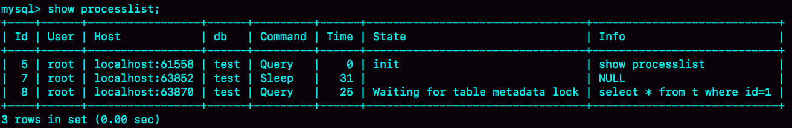

图2 Waiting for table metadata lock状态示意图

出现 **这个状态表示的是，现在有一个线程正在表t上请求或者持有MDL写锁，把select语句堵住了。**

在第6篇文章 [《全局锁和表锁 ：给表加个字段怎么有这么多阻碍？》](https://time.geekbang.org/column/article/69862) 中，我给你介绍过一种复现方法。但需要说明的是，那个复现过程是基于MySQL 5.6版本的。而MySQL 5.7版本修改了MDL的加锁策略，所以就不能复现这个场景了。

不过，在MySQL 5.7版本下复现这个场景，也很容易。如图3所示，我给出了简单的复现步骤。


图3 MySQL 5.7中Waiting for table metadata lock的复现步骤

session A 通过lock table命令持有表t的MDL写锁，而session B的查询需要获取MDL读锁。所以，session B进入等待状态。

这类问题的处理方式，就是找到谁持有MDL写锁，然后把它kill掉。

但是，由于在show processlist的结果里面，session A的Command列是“Sleep”，导致查找起来很不方便。不过有了performance\_schema和sys系统库以后，就方便多了。（MySQL启动时需要设置performance\_schema=on，相比于设置为off会有10%左右的性能损失)

通过查询sys.schema\_table\_lock\_waits这张表，我们就可以直接找出造成阻塞的process id，把这个连接用kill 命令断开即可。

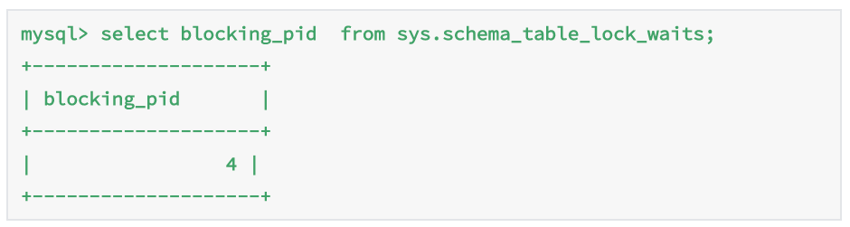

图4 查获加表锁的线程id

## 等flush

接下来，我给你举另外一种查询被堵住的情况。

我在表t上，执行下面的SQL语句：

```
mysql> select * from information_schema.processlist where id=1;

```

这里，我先卖个关子。

你可以看一下图5。我查出来这个线程的状态是Waiting for table flush，你可以设想一下这是什么原因。

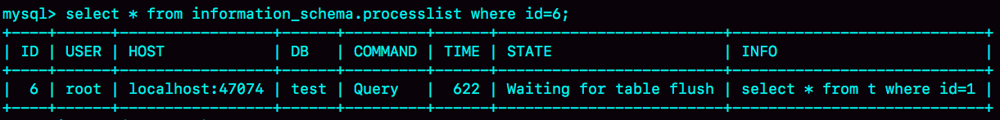

图5 Waiting for table flush状态示意图

这个状态表示的是，现在有一个线程正要对表t做flush操作。MySQL里面对表做flush操作的用法，一般有以下两个：

```
flush tables t with read lock;

flush tables with read lock;

```

这两个flush语句，如果指定表t的话，代表的是只关闭表t；如果没有指定具体的表名，则表示关闭MySQL里所有打开的表。

但是正常这两个语句执行起来都很快，除非它们也被别的线程堵住了。

所以，出现Waiting for table flush状态的可能情况是：有一个flush tables命令被别的语句堵住了，然后它又堵住了我们的select语句。

现在，我们一起来复现一下这种情况， **复现步骤** 如图6所示：

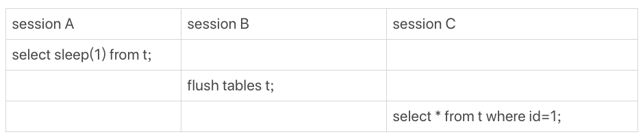

图6 Waiting for table flush的复现步骤

在session A中，我故意每行都调用一次sleep(1)，这样这个语句默认要执行10万秒，在这期间表t一直是被session A“打开”着。然后，session B的flush tables t命令再要去关闭表t，就需要等session A的查询结束。这样，session C要再次查询的话，就会被flush 命令堵住了。

图7是这个复现步骤的show processlist结果。这个例子的排查也很简单，你看到这个show processlist的结果，肯定就知道应该怎么做了。

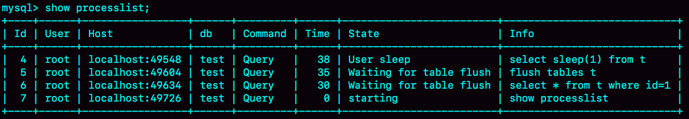

图 7 Waiting for table flush的show processlist 结果

## 等行锁

现在，经过了表级锁的考验，我们的select 语句终于来到引擎里了。

```
mysql> select * from t where id=1 lock in share mode;

```

上面这条语句的用法你也很熟悉了，我们在第8篇 [《事务到底是隔离的还是不隔离的？》](https://time.geekbang.org/column/article/70562) 文章介绍当前读时提到过。

由于访问id=1这个记录时要加读锁，如果这时候已经有一个事务在这行记录上持有一个写锁，我们的select语句就会被堵住。

复现步骤和现场如下：

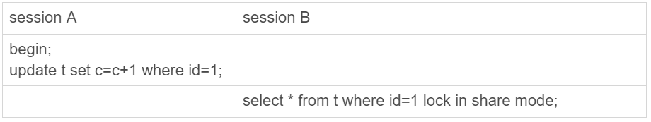

图 8 行锁复现

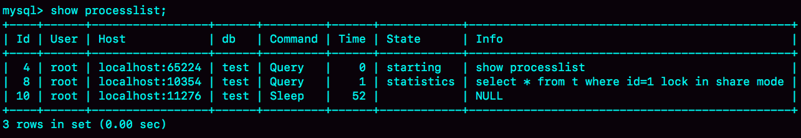

图 9 行锁show processlist 现场

显然，session A启动了事务，占有写锁，还不提交，是导致session B被堵住的原因。

这个问题并不难分析，但问题是怎么查出是谁占着这个写锁。如果你用的是MySQL 5.7版本，可以通过sys.innodb\_lock\_waits 表查到。

查询方法是：

```
mysql> select * from t sys.innodb_lock_waits where locked_table='`test`.`t`'\G

```

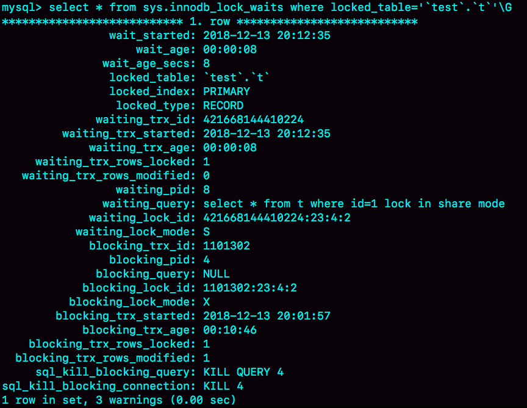

图10 通过sys.innodb\_lock\_waits 查行锁

可以看到，这个信息很全，4号线程是造成堵塞的罪魁祸首。而干掉这个罪魁祸首的方式，就是KILL QUERY 4或KILL 4。

不过，这里不应该显示“KILL QUERY 4”。这个命令表示停止4号线程当前正在执行的语句，而这个方法其实是没有用的。因为占有行锁的是update语句，这个语句已经是之前执行完成了的，现在执行KILL QUERY，无法让这个事务去掉id=1上的行锁。

实际上，KILL 4才有效，也就是说直接断开这个连接。这里隐含的一个逻辑就是，连接被断开的时候，会自动回滚这个连接里面正在执行的线程，也就释放了id=1上的行锁。

# 第二类：查询慢

经过了重重封“锁”，我们再来看看一些查询慢的例子。

先来看一条你一定知道原因的SQL语句：

```
mysql> select * from t where c=50000 limit 1;

```

由于字段c上没有索引，这个语句只能走id主键顺序扫描，因此需要扫描5万行。

作为确认，你可以看一下慢查询日志。注意，这里为了把所有语句记录到slow log里，我在连接后先执行了 set long\_query\_time=0，将慢查询日志的时间阈值设置为0。

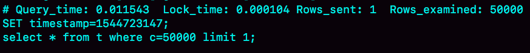

图11 全表扫描5万行的slow log

Rows\_examined显示扫描了50000行。你可能会说，不是很慢呀，11.5毫秒就返回了，我们线上一般都配置超过1秒才算慢查询。但你要记住： **坏查询不一定是慢查询**。我们这个例子里面只有10万行记录，数据量大起来的话，执行时间就线性涨上去了。

扫描行数多，所以执行慢，这个很好理解。

但是接下来，我们再看一个只扫描一行，但是执行很慢的语句。

如图12所示，是这个例子的slow log。可以看到，执行的语句是

```
mysql> select * from t where id=1；

```

虽然扫描行数是1，但执行时间却长达800毫秒。

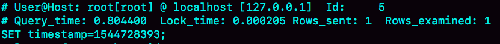

图12 扫描一行却执行得很慢

是不是有点奇怪呢，这些时间都花在哪里了？

如果我把这个slow log的截图再往下拉一点，你可以看到下一个语句，select \* from t where id=1 lock in share mode，执行时扫描行数也是1行，执行时间是0.2毫秒。

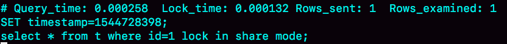

图 13 加上lock in share mode的slow log

看上去是不是更奇怪了？按理说lock in share mode还要加锁，时间应该更长才对啊。

可能有的同学已经有答案了。如果你还没有答案的话，我再给你一个提示信息，图14是这两个语句的执行输出结果。

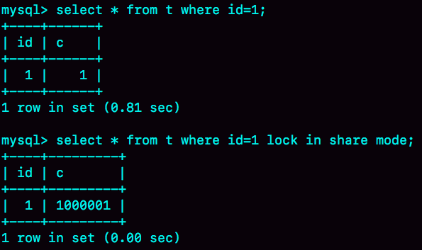

图14 两个语句的输出结果

第一个语句的查询结果里c=1，带lock in share mode的语句返回的是c=1000001。看到这里应该有更多的同学知道原因了。如果你还是没有头绪的话，也别着急。我先跟你说明一下复现步骤，再分析原因。

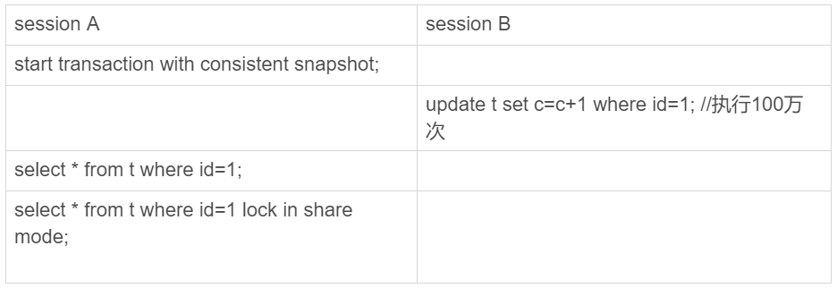

图15 复现步骤

你看到了，session A先用start transaction with consistent snapshot命令启动了一个事务，之后session B才开始执行update 语句。

session B执行完100万次update语句后，id=1这一行处于什么状态呢？你可以从图16中找到答案。

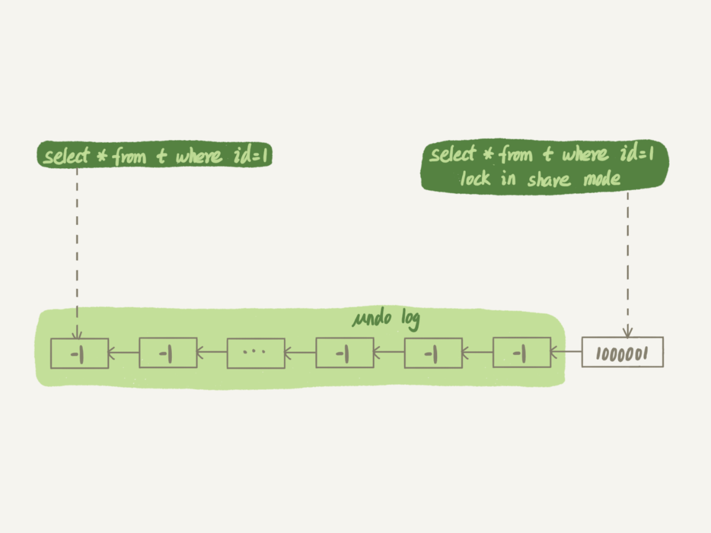

图16 id=1的数据状态

session B更新完100万次，生成了100万个回滚日志(undo log)。

带lock in share mode的SQL语句，是当前读，因此会直接读到1000001这个结果，所以速度很快；而select \* from t where id=1这个语句，是一致性读，因此需要从1000001开始，依次执行undo log，执行了100万次以后，才将1这个结果返回。

注意，undo log里记录的其实是“把2改成1”，“把3改成2”这样的操作逻辑，画成减1的目的是方便你看图。

# 小结

今天我给你举了在一个简单的表上，执行“查一行”，可能会出现的被锁住和执行慢的例子。这其中涉及到了表锁、行锁和一致性读的概念。

在实际使用中，碰到的场景会更复杂。但大同小异，你可以按照我在文章中介绍的定位方法，来定位并解决问题。

最后，我给你留一个问题吧。

我们在举例加锁读的时候，用的是这个语句，select \* from t where id=1 lock in share mode。由于id上有索引，所以可以直接定位到id=1这一行，因此读锁也是只加在了这一行上。

但如果是下面的SQL语句，

```
begin;
select * from t where c=5 for update;
commit;

```

这个语句序列是怎么加锁的呢？加的锁又是什么时候释放呢？

你可以把你的观点和验证方法写在留言区里，我会在下一篇文章的末尾给出我的参考答案。感谢你的收听，也欢迎你把这篇文章分享给更多的朋友一起阅读。

# 上期问题时间

在上一篇文章最后，我留给你的问题是，希望你可以分享一下之前碰到过的、与文章中类似的场景。

@封建的风 提到一个有趣的场景，值得一说。我把他的问题重写一下，表结构如下：

```
mysql> CREATE TABLE `table_a` (
  `id` int(11) NOT NULL,
  `b` varchar(10) DEFAULT NULL,
  PRIMARY KEY (`id`),
  KEY `b` (`b`)
) ENGINE=InnoDB;

```

假设现在表里面，有100万行数据，其中有10万行数据的b的值是’1234567890’， 假设现在执行语句是这么写的:

```
mysql> select * from table_a where b='1234567890abcd';

```

这时候，MySQL会怎么执行呢？

最理想的情况是，MySQL看到字段b定义的是varchar(10)，那肯定返回空呀。可惜，MySQL并没有这么做。

那要不，就是把’1234567890abcd’拿到索引里面去做匹配，肯定也没能够快速判断出索引树b上并没有这个值，也很快就能返回空结果。

但实际上，MySQL也不是这么做的。

这条SQL语句的执行很慢，流程是这样的：

1. 在传给引擎执行的时候，做了字符截断。因为引擎里面这个行只定义了长度是10，所以只截了前10个字节，就是’1234567890’进去做匹配；

2. 这样满足条件的数据有10万行；

3. 因为是select \*， 所以要做10万次回表；

4. 但是每次回表以后查出整行，到server层一判断，b的值都不是’1234567890abcd’;

5. 返回结果是空。


这个例子，是我们文章内容的一个很好的补充。虽然执行过程中可能经过函数操作，但是最终在拿到结果后，server层还是要做一轮判断的。

评论区留言点赞板：

> @赖阿甘 提到了等号顺序问题，实际上MySQL优化器执行过程中，where 条件部分， a=b和 b=a的写法是一样的。
>
> @沙漠里的骆驼 提到了一个常见的问题。相同的模板语句，但是匹配行数不同，语句执行时间相差很大。这种情况，在语句里面有order by这样的操作时会更明显。
>
> @Justin 回答了我们正文中的问题，如果id 的类型是整数，传入的参数类型是字符串的时候，可以用上索引。