# 21 | 为什么我只改一行的语句，锁这么多？
在上一篇文章中，我和你介绍了间隙锁和next-key lock的概念，但是并没有说明加锁规则。间隙锁的概念理解起来确实有点儿难，尤其在配合上行锁以后，很容易在判断是否会出现锁等待的问题上犯错。

所以今天，我们就先从这个加锁规则开始吧。

首先说明一下，这些加锁规则我没在别的地方看到过有类似的总结，以前我自己判断的时候都是想着代码里面的实现来脑补的。这次为了总结成不看代码的同学也能理解的规则，是我又重新刷了代码临时总结出来的。所以， **这个规则有以下两条前提说明：**

1. MySQL后面的版本可能会改变加锁策略，所以这个规则只限于截止到现在的最新版本，即5.x系列<=5.7.24，8.0系列 <=8.0.13。

2. 如果大家在验证中有发现bad case的话，请提出来，我会再补充进这篇文章，使得一起学习本专栏的所有同学都能受益。


因为间隙锁在可重复读隔离级别下才有效，所以本篇文章接下来的描述，若没有特殊说明，默认是可重复读隔离级别。

**我总结的加锁规则里面，包含了两个“原则”、两个“优化”和一个“bug”。**

1. 原则1：加锁的基本单位是next-key lock。希望你还记得，next-key lock是前开后闭区间。

2. 原则2：查找过程中访问到的对象才会加锁。

3. 优化1：索引上的等值查询，给唯一索引加锁的时候，next-key lock退化为行锁。

4. 优化2：索引上的等值查询，向右遍历时且最后一个值不满足等值条件的时候，next-key lock退化为间隙锁。

5. 一个bug：唯一索引上的范围查询会访问到不满足条件的第一个值为止。


我还是以上篇文章的表t为例，和你解释一下这些规则。表t的建表语句和初始化语句如下。

```
CREATE TABLE `t` (
  `id` int(11) NOT NULL,
  `c` int(11) DEFAULT NULL,
  `d` int(11) DEFAULT NULL,
  PRIMARY KEY (`id`),
  KEY `c` (`c`)
) ENGINE=InnoDB;

insert into t values(0,0,0),(5,5,5),
(10,10,10),(15,15,15),(20,20,20),(25,25,25);

```

接下来的例子基本都是配合着图片说明的，所以我建议你可以对照着文稿看，有些例子可能会“毁三观”，也建议你读完文章后亲手实践一下。

# 案例一：等值查询间隙锁

第一个例子是关于等值条件操作间隙：

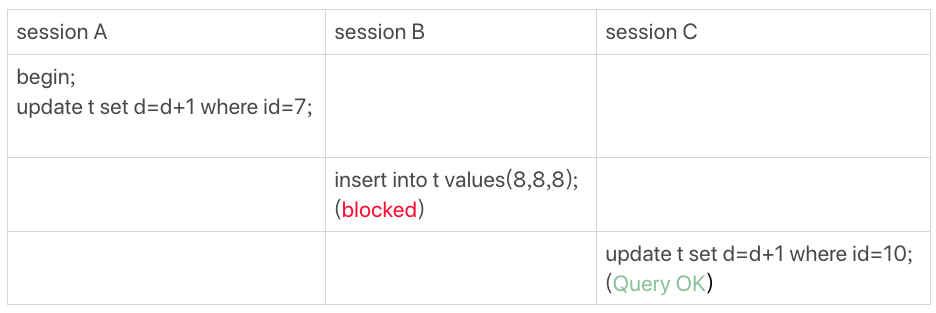

图1 等值查询的间隙锁

由于表t中没有id=7的记录，所以用我们上面提到的加锁规则判断一下的话：

1. 根据原则1，加锁单位是next-key lock，session A加锁范围就是(5,10\]；

2. 同时根据优化2，这是一个等值查询(id=7)，而id=10不满足查询条件，next-key lock退化成间隙锁，因此最终加锁的范围是(5,10)。


所以，session B要往这个间隙里面插入id=8的记录会被锁住，但是session C修改id=10这行是可以的。

# 案例二：非唯一索引等值锁

第二个例子是关于覆盖索引上的锁：

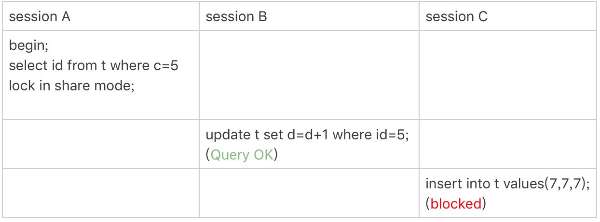

图2 只加在非唯一索引上的锁

看到这个例子，你是不是有一种“该锁的不锁，不该锁的乱锁”的感觉？我们来分析一下吧。

这里session A要给索引c上c=5的这一行加上读锁。

1. 根据原则1，加锁单位是next-key lock，因此会给(0,5\]加上next-key lock。

2. 要注意c是普通索引，因此仅访问c=5这一条记录是不能马上停下来的，需要向右遍历，查到c=10才放弃。根据原则2，访问到的都要加锁，因此要给(5,10\]加next-key lock。

3. 但是同时这个符合优化2：等值判断，向右遍历，最后一个值不满足c=5这个等值条件，因此退化成间隙锁(5,10)。

4. 根据原则2 ， **只有访问到的对象才会加锁**，这个查询使用覆盖索引，并不需要访问主键索引，所以主键索引上没有加任何锁，这就是为什么session B的update语句可以执行完成。


但session C要插入一个(7,7,7)的记录，就会被session A的间隙锁(5,10)锁住。

需要注意，在这个例子中，lock in share mode只锁覆盖索引，但是如果是for update就不一样了。 执行 for update时，系统会认为你接下来要更新数据，因此会顺便给主键索引上满足条件的行加上行锁。

这个例子说明，锁是加在索引上的；同时，它给我们的指导是，如果你要用lock in share mode来给行加读锁避免数据被更新的话，就必须得绕过覆盖索引的优化，在查询字段中加入索引中不存在的字段。比如，将session A的查询语句改成select d from t where c=5 lock in share mode。你可以自己验证一下效果。

# 案例三：主键索引范围锁

第三个例子是关于范围查询的。

举例之前，你可以先思考一下这个问题：对于我们这个表t，下面这两条查询语句，加锁范围相同吗？

```
mysql> select * from t where id=10 for update;
mysql> select * from t where id>=10 and id<11 for update;

```

你可能会想，id定义为int类型，这两个语句就是等价的吧？其实，它们并不完全等价。

在逻辑上，这两条查语句肯定是等价的，但是它们的加锁规则不太一样。现在，我们就让session A执行第二个查询语句，来看看加锁效果。

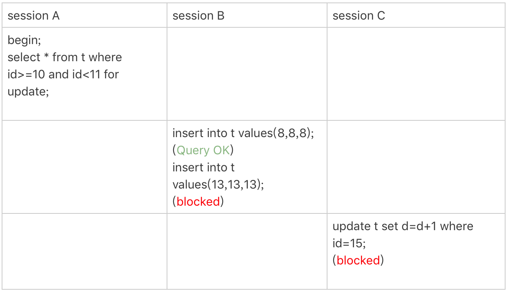

图3 主键索引上范围查询的锁

现在我们就用前面提到的加锁规则，来分析一下session A 会加什么锁呢？

1. 开始执行的时候，要找到第一个id=10的行，因此本该是next-key lock(5,10\]。 根据优化1， 主键id上的等值条件，退化成行锁，只加了id=10这一行的行锁。

2. 范围查找就往后继续找，找到id=15这一行停下来，因此需要加next-key lock(10,15\]。


所以，session A这时候锁的范围就是主键索引上，行锁id=10和next-key lock(10,15\]。这样，session B和session C的结果你就能理解了。

这里你需要注意一点，首次session A定位查找id=10的行的时候，是当做等值查询来判断的，而向右扫描到id=15的时候，用的是范围查询判断。

# 案例四：非唯一索引范围锁

接下来，我们再看两个范围查询加锁的例子，你可以对照着案例三来看。

需要注意的是，与案例三不同的是，案例四中查询语句的where部分用的是字段c。

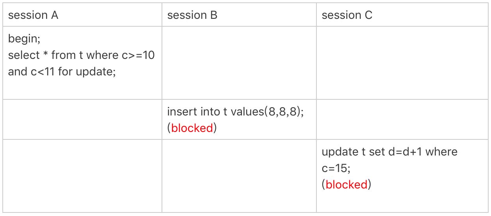

图4 非唯一索引范围锁

这次session A用字段c来判断，加锁规则跟案例三唯一的不同是：在第一次用c=10定位记录的时候，索引c上加了(5,10\]这个next-key lock后，由于索引c是非唯一索引，没有优化规则，也就是说不会蜕变为行锁，因此最终sesion A加的锁是，索引c上的(5,10\] 和(10,15\] 这两个next-key lock。

所以从结果上来看，sesson B要插入（8,8,8)的这个insert语句时就被堵住了。

这里需要扫描到c=15才停止扫描，是合理的，因为InnoDB要扫到c=15，才知道不需要继续往后找了。

# 案例五：唯一索引范围锁bug

前面的四个案例，我们已经用到了加锁规则中的两个原则和两个优化，接下来再看一个关于加锁规则中bug的案例。

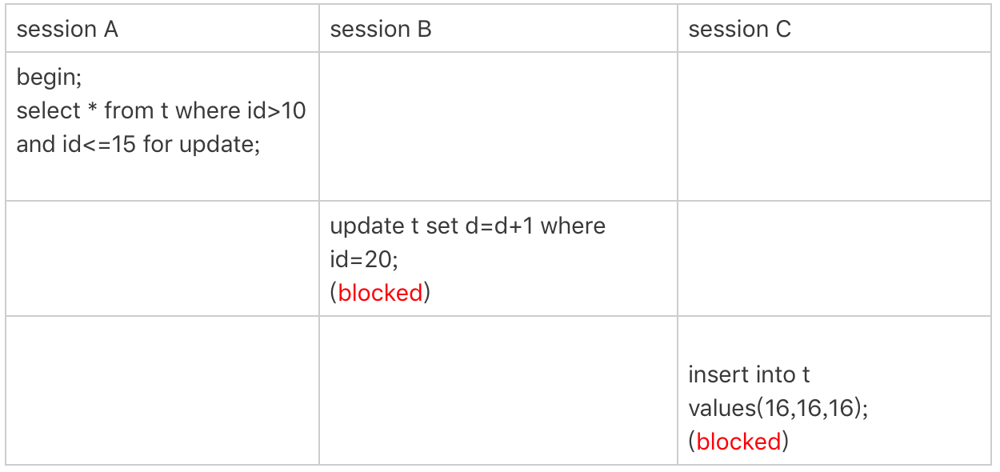

图5 唯一索引范围锁的bug

session A是一个范围查询，按照原则1的话，应该是索引id上只加(10,15\]这个next-key lock，并且因为id是唯一键，所以循环判断到id=15这一行就应该停止了。

但是实现上，InnoDB会往前扫描到第一个不满足条件的行为止，也就是id=20。而且由于这是个范围扫描，因此索引id上的(15,20\]这个next-key lock也会被锁上。

所以你看到了，session B要更新id=20这一行，是会被锁住的。同样地，session C要插入id=16的一行，也会被锁住。

照理说，这里锁住id=20这一行的行为，其实是没有必要的。因为扫描到id=15，就可以确定不用往后再找了。但实现上还是这么做了，因此我认为这是个bug。

我也曾找社区的专家讨论过，官方bug系统上也有提到，但是并未被verified。所以，认为这是bug这个事儿，也只能算我的一家之言，如果你有其他见解的话，也欢迎你提出来。

# 案例六：非唯一索引上存在"等值"的例子

接下来的例子，是为了更好地说明“间隙”这个概念。这里，我给表t插入一条新记录。

```
mysql> insert into t values(30,10,30);

```

新插入的这一行c=10，也就是说现在表里有两个c=10的行。那么，这时候索引c上的间隙是什么状态了呢？你要知道，由于非唯一索引上包含主键的值，所以是不可能存在“相同”的两行的。

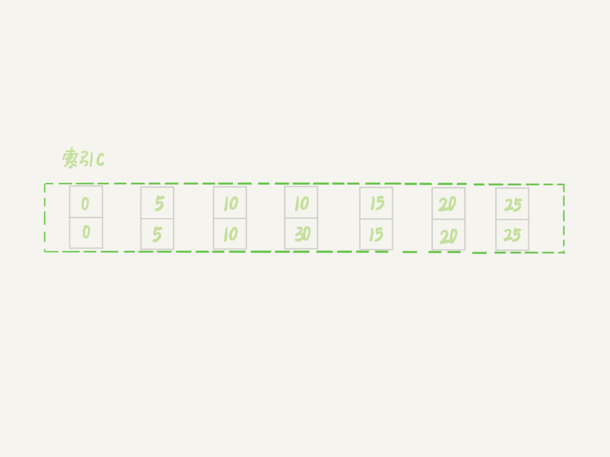

图6 非唯一索引等值的例子

可以看到，虽然有两个c=10，但是它们的主键值id是不同的（分别是10和30），因此这两个c=10的记录之间，也是有间隙的。

图中我画出了索引c上的主键id。为了跟间隙锁的开区间形式进行区别，我用(c=10,id=30)这样的形式，来表示索引上的一行。

现在，我们来看一下案例六。

这次我们用delete语句来验证。注意，delete语句加锁的逻辑，其实跟select ... for update 是类似的，也就是我在文章开始总结的两个“原则”、两个“优化”和一个“bug”。

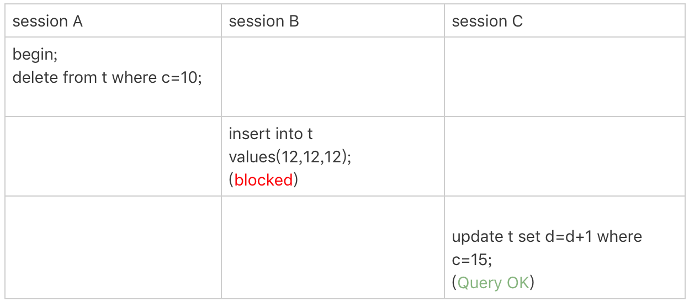

图7 delete 示例

这时，session A在遍历的时候，先访问第一个c=10的记录。同样地，根据原则1，这里加的是(c=5,id=5)到(c=10,id=10)这个next-key lock。

然后，session A向右查找，直到碰到(c=15,id=15)这一行，循环才结束。根据优化2，这是一个等值查询，向右查找到了不满足条件的行，所以会退化成(c=10,id=10) 到 (c=15,id=15)的间隙锁。

也就是说，这个delete语句在索引c上的加锁范围，就是下图中蓝色区域覆盖的部分。

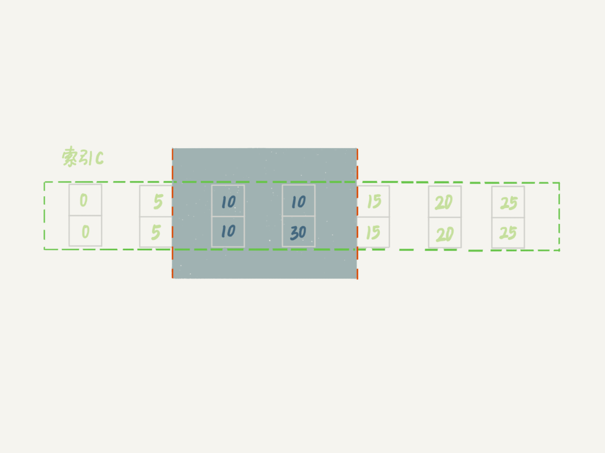

图8 delete加锁效果示例

这个蓝色区域左右两边都是虚线，表示开区间，即(c=5,id=5)和(c=15,id=15)这两行上都没有锁。

# 案例七：limit 语句加锁

例子6也有一个对照案例，场景如下所示：

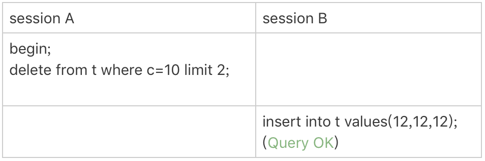

图9 limit 语句加锁

这个例子里，session A的delete语句加了 limit 2。你知道表t里c=10的记录其实只有两条，因此加不加limit 2，删除的效果都是一样的，但是加锁的效果却不同。可以看到，session B的insert语句执行通过了，跟案例六的结果不同。

这是因为，案例七里的delete语句明确加了limit 2的限制，因此在遍历到(c=10, id=30)这一行之后，满足条件的语句已经有两条，循环就结束了。

因此，索引c上的加锁范围就变成了从（c=5,id=5)到（c=10,id=30)这个前开后闭区间，如下图所示：

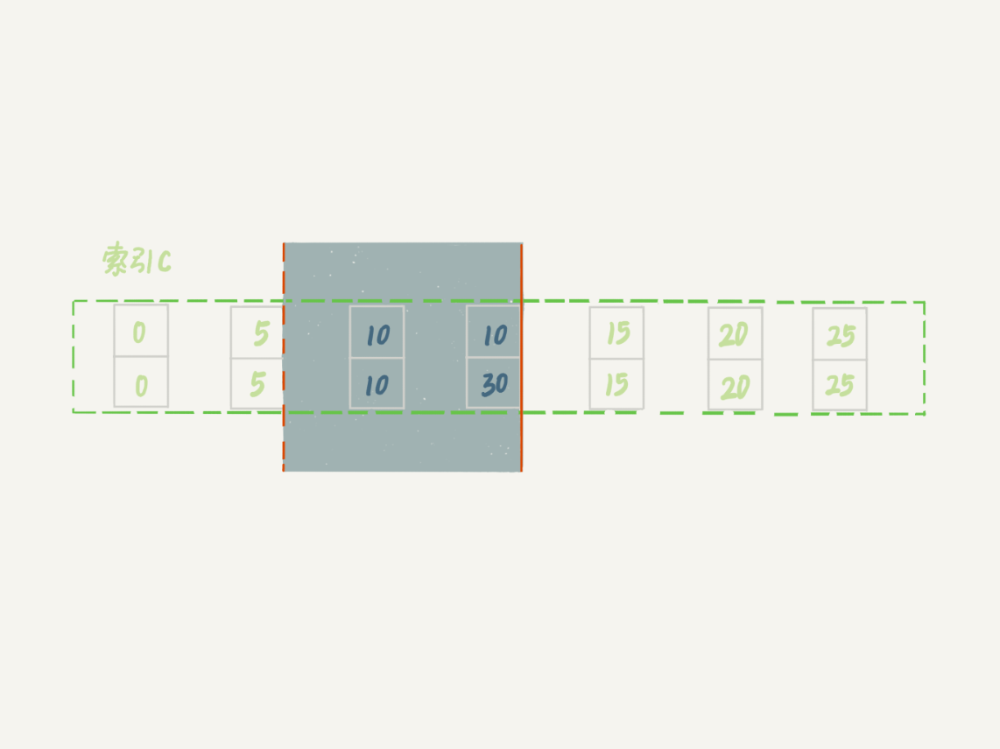

图10 带limit 2的加锁效果

可以看到，(c=10,id=30）之后的这个间隙并没有在加锁范围里，因此insert语句插入c=12是可以执行成功的。

这个例子对我们实践的指导意义就是， **在删除数据的时候尽量加limit**。这样不仅可以控制删除数据的条数，让操作更安全，还可以减小加锁的范围。

# 案例八：一个死锁的例子

前面的例子中，我们在分析的时候，是按照next-key lock的逻辑来分析的，因为这样分析比较方便。最后我们再看一个案例，目的是说明：next-key lock实际上是间隙锁和行锁加起来的结果。

你一定会疑惑，这个概念不是一开始就说了吗？不要着急，我们先来看下面这个例子：

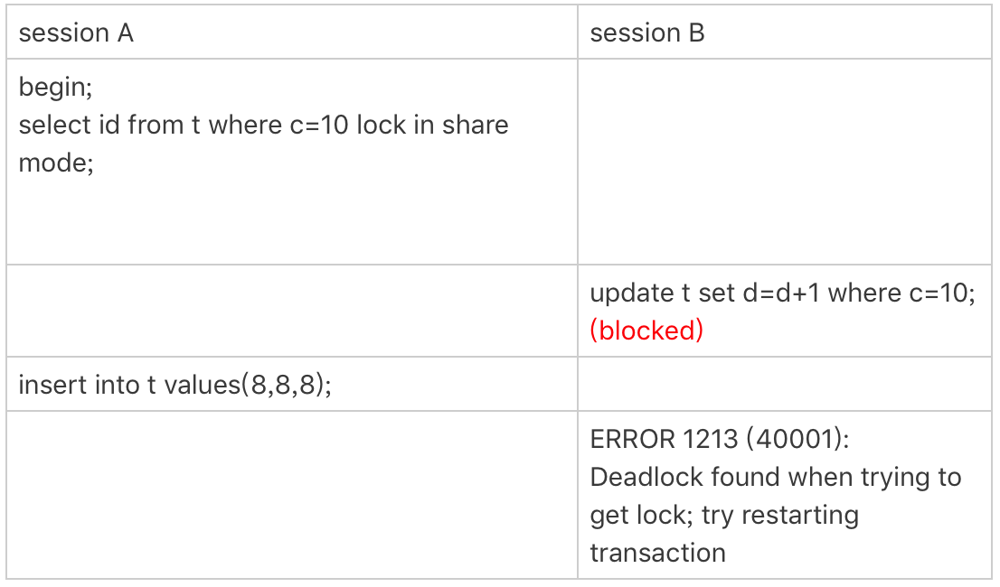

图11 案例八的操作序列

现在，我们按时间顺序来分析一下为什么是这样的结果。

1. session A 启动事务后执行查询语句加lock in share mode，在索引c上加了next-key lock(5,10\] 和间隙锁(10,15)；

2. session B 的update语句也要在索引c上加next-key lock(5,10\] ，进入锁等待；

3. 然后session A要再插入(8,8,8)这一行，被session B的间隙锁锁住。由于出现了死锁，InnoDB让session B回滚。


你可能会问，session B的next-key lock不是还没申请成功吗？

其实是这样的，session B的“加next-key lock(5,10\] ”操作，实际上分成了两步，先是加(5,10)的间隙锁，加锁成功；然后加c=10的行锁，这时候才被锁住的。

也就是说，我们在分析加锁规则的时候可以用next-key lock来分析。但是要知道，具体执行的时候，是要分成间隙锁和行锁两段来执行的。

# 小结

这里我再次说明一下，我们上面的所有案例都是在可重复读隔离级别(repeatable-read)下验证的。同时，可重复读隔离级别遵守两阶段锁协议，所有加锁的资源，都是在事务提交或者回滚的时候才释放的。

在最后的案例中，你可以清楚地知道next-key lock实际上是由间隙锁加行锁实现的。如果切换到读提交隔离级别(read-committed)的话，就好理解了，过程中去掉间隙锁的部分，也就是只剩下行锁的部分。

其实读提交隔离级别在外键场景下还是有间隙锁，相对比较复杂，我们今天先不展开。

另外，在读提交隔离级别下还有一个优化，即：语句执行过程中加上的行锁，在语句执行完成后，就要把“不满足条件的行”上的行锁直接释放了，不需要等到事务提交。

也就是说，读提交隔离级别下，锁的范围更小，锁的时间更短，这也是不少业务都默认使用读提交隔离级别的原因。

不过，我希望你学过今天的课程以后，可以对next-key lock的概念有更清晰的认识，并且会用加锁规则去判断语句的加锁范围。

在业务需要使用可重复读隔离级别的时候，能够更细致地设计操作数据库的语句，解决幻读问题的同时，最大限度地提升系统并行处理事务的能力。

经过这篇文章的介绍，你再看一下上一篇文章最后的思考题，再来尝试分析一次。

我把题目重新描述和简化一下：还是我们在文章开头初始化的表t，里面有6条记录，图12的语句序列中，为什么session B的insert操作，会被锁住呢？

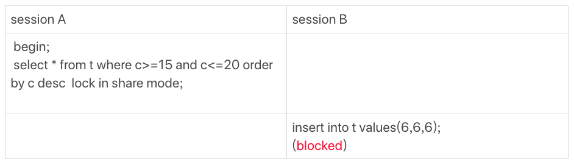

图12 锁分析思考题

另外，如果你有兴趣多做一些实验的话，可以设计好语句序列，在执行之前先自己分析一下，然后实际地验证结果是否跟你的分析一致。

对于那些你自己无法解释的结果，可以发到评论区里，后面我争取挑一些有趣的案例在文章中分析。

你可以把你关于思考题的分析写在留言区，也可以分享你自己设计的锁验证方案，我会在下一篇文章的末尾选取有趣的评论跟大家分享。感谢你的收听，也欢迎你把这篇文章分享给更多的朋友一起阅读。

## 上期问题时间

上期的问题，我在本期继续作为了课后思考题，所以会在下篇文章再一起公布“答案”。

这里，我展开回答一下评论区几位同学的问题。

- @令狐少侠 说，以前一直认为间隙锁只在二级索引上有。现在你知道了，有间隙的地方就可能有间隙锁。
- @浪里白条 同学问，如果是varchar类型，加锁规则是什么样的。


  回答：实际上在判断间隙的时候，varchar和int是一样的，排好序以后，相邻两个值之间就有间隙。
- 有几位同学提到说，上一篇文章自己验证的结果跟案例一不同，就是在session A执行完这两个语句：

```
begin;
select * from t where d=5 for update; /*Q1*/

```

以后，session B 的update 和session C的insert 都会被堵住。这是不是跟文章的结论矛盾？

其实不是的，这个例子用的是反证假设，就是假设不堵住，会出现问题；然后，推导出session A需要锁整个表所有的行和所有间隙。

评论区留言点赞板：

> @ 某、人 、@郭江伟 两位同学尝试分析了上期问题，并给了有启发性的解答。