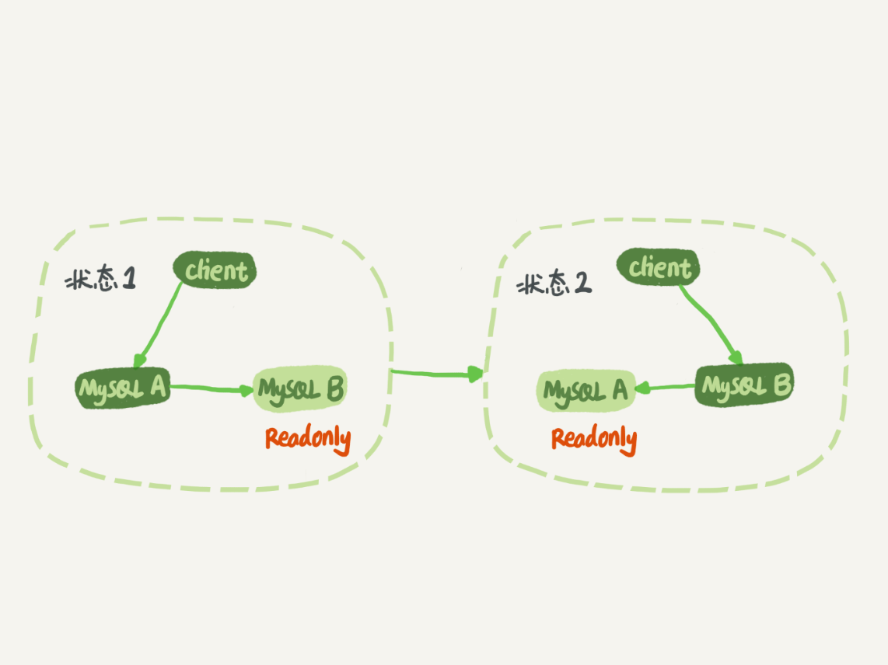
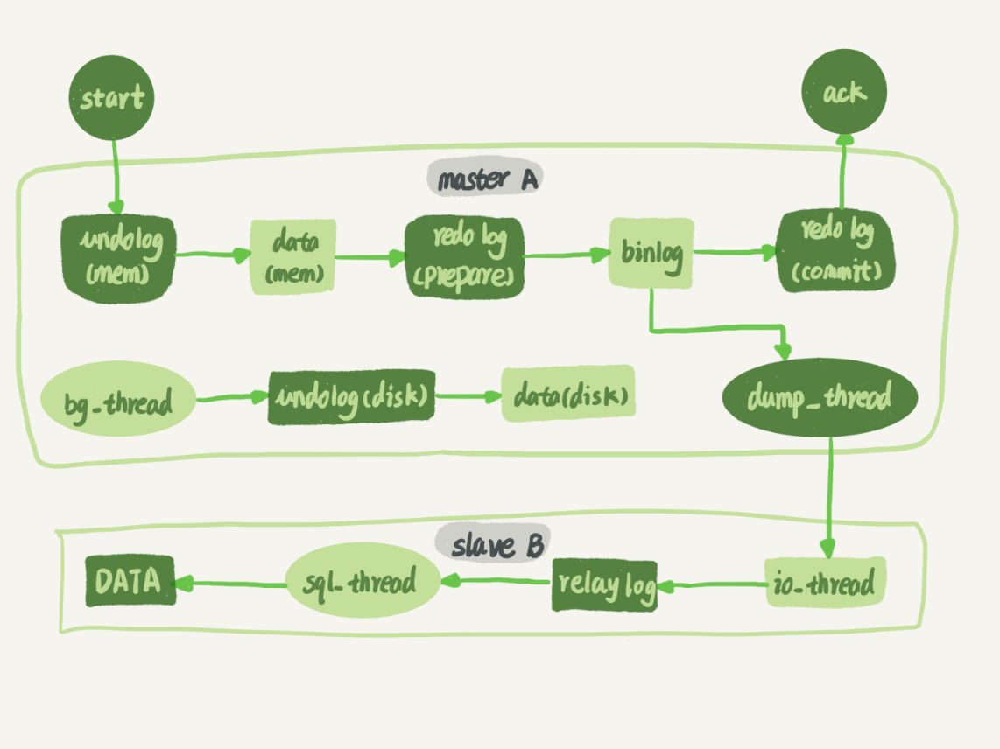
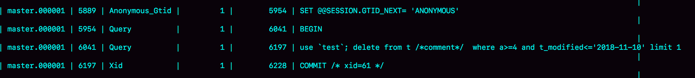
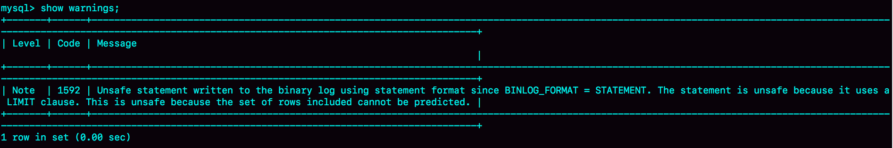
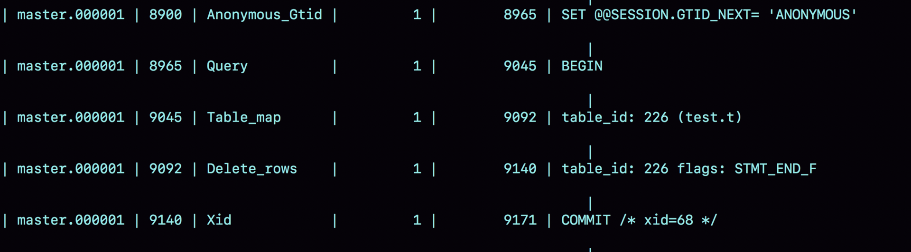
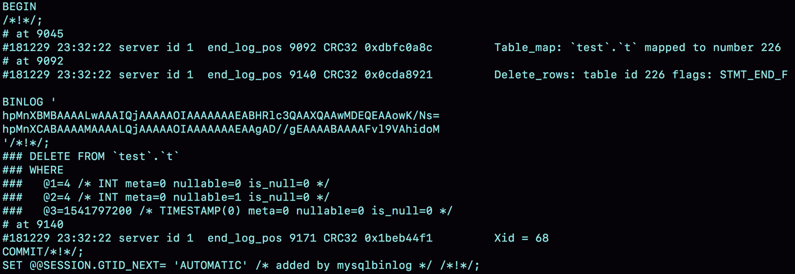
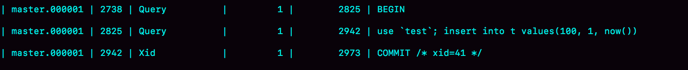
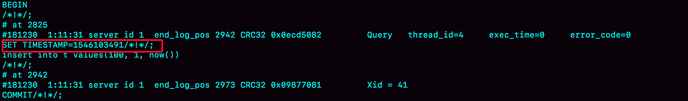
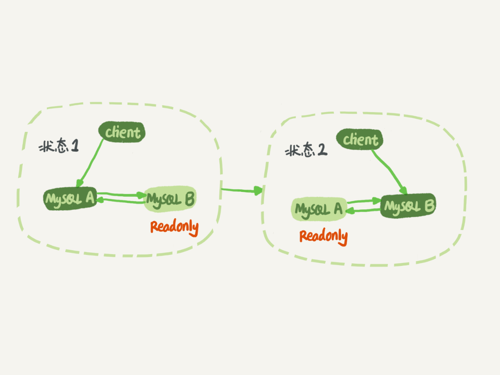

# 24 | MySQL是怎么保证主备一致的？
在前面的文章中，我不止一次地和你提到了binlog，大家知道binlog可以用来归档，也可以用来做主备同步，但它的内容是什么样的呢？为什么备库执行了binlog就可以跟主库保持一致了呢？今天我就正式地和你介绍一下它。

毫不夸张地说，MySQL能够成为现下最流行的开源数据库，binlog功不可没。

在最开始，MySQL是以容易学习和方便的高可用架构，被开发人员青睐的。而它的几乎所有的高可用架构，都直接依赖于binlog。虽然这些高可用架构已经呈现出越来越复杂的趋势，但都是从最基本的一主一备演化过来的。

今天这篇文章我主要为你介绍主备的基本原理。理解了背后的设计原理，你也可以从业务开发的角度，来借鉴这些设计思想。

# MySQL主备的基本原理

如图1所示就是基本的主备切换流程。



图 1 MySQL主备切换流程

在状态1中，客户端的读写都直接访问节点A，而节点B是A的备库，只是将A的更新都同步过来，到本地执行。这样可以保持节点B和A的数据是相同的。

当需要切换的时候，就切成状态2。这时候客户端读写访问的都是节点B，而节点A是B的备库。

在状态1中，虽然节点B没有被直接访问，但是我依然建议你把节点B（也就是备库）设置成只读（readonly）模式。这样做，有以下几个考虑：

1. 有时候一些运营类的查询语句会被放到备库上去查，设置为只读可以防止误操作；

2. 防止切换逻辑有bug，比如切换过程中出现双写，造成主备不一致；

3. 可以用readonly状态，来判断节点的角色。


你可能会问，我把备库设置成只读了，还怎么跟主库保持同步更新呢？

这个问题，你不用担心。因为readonly设置对超级(super)权限用户是无效的，而用于同步更新的线程，就拥有超级权限。

接下来，我们再看看 **节点A到B这条线的内部流程是什么样的**。图2中画出的就是一个update语句在节点A执行，然后同步到节点B的完整流程图。



图2 主备流程图

图2中，包含了我在上一篇文章中讲到的binlog和redo log的写入机制相关的内容，可以看到：主库接收到客户端的更新请求后，执行内部事务的更新逻辑，同时写binlog。

备库B跟主库A之间维持了一个长连接。主库A内部有一个线程，专门用于服务备库B的这个长连接。一个事务日志同步的完整过程是这样的：

1. 在备库B上通过change master命令，设置主库A的IP、端口、用户名、密码，以及要从哪个位置开始请求binlog，这个位置包含文件名和日志偏移量。

2. 在备库B上执行start slave命令，这时候备库会启动两个线程，就是图中的io\_thread和sql\_thread。其中io\_thread负责与主库建立连接。

3. 主库A校验完用户名、密码后，开始按照备库B传过来的位置，从本地读取binlog，发给B。

4. 备库B拿到binlog后，写到本地文件，称为中转日志（relay log）。

5. sql\_thread读取中转日志，解析出日志里的命令，并执行。


这里需要说明，后来由于多线程复制方案的引入，sql\_thread演化成为了多个线程，跟我们今天要介绍的原理没有直接关系，暂且不展开。

分析完了这个长连接的逻辑，我们再来看一个问题：binlog里面到底是什么内容，为什么备库拿过去可以直接执行。

# binlog的三种格式对比

我在 [第15篇答疑文章](https://time.geekbang.org/column/article/73161) 中，和你提到过binlog有两种格式，一种是statement，一种是row。可能你在其他资料上还会看到有第三种格式，叫作mixed，其实它就是前两种格式的混合。

为了便于描述binlog的这三种格式间的区别，我创建了一个表，并初始化几行数据。

```
mysql> CREATE TABLE `t` (
  `id` int(11) NOT NULL,
  `a` int(11) DEFAULT NULL,
  `t_modified` timestamp NOT NULL DEFAULT CURRENT_TIMESTAMP,
  PRIMARY KEY (`id`),
  KEY `a` (`a`),
  KEY `t_modified`(`t_modified`)
) ENGINE=InnoDB;

insert into t values(1,1,'2018-11-13');
insert into t values(2,2,'2018-11-12');
insert into t values(3,3,'2018-11-11');
insert into t values(4,4,'2018-11-10');
insert into t values(5,5,'2018-11-09');

```

如果要在表中删除一行数据的话，我们来看看这个delete语句的binlog是怎么记录的。

注意，下面这个语句包含注释，如果你用MySQL客户端来做这个实验的话，要记得加-c参数，否则客户端会自动去掉注释。

```
mysql> delete from t /*comment*/  where a>=4 and t_modified<='2018-11-10' limit 1;

```

当binlog\_format=statement时，binlog里面记录的就是SQL语句的原文。你可以用

```
mysql> show binlog events in 'master.000001';

```

命令看binlog中的内容。



图3 statement格式binlog 示例

现在，我们来看一下图3的输出结果。

- 第一行SET @@SESSION.GTID\_NEXT='ANONYMOUS’你可以先忽略，后面文章我们会在介绍主备切换的时候再提到；
- 第二行是一个BEGIN，跟第四行的commit对应，表示中间是一个事务；
- 第三行就是真实执行的语句了。可以看到，在真实执行的delete命令之前，还有一个“use ‘test’”命令。这条命令不是我们主动执行的，而是MySQL根据当前要操作的表所在的数据库，自行添加的。这样做可以保证日志传到备库去执行的时候，不论当前的工作线程在哪个库里，都能够正确地更新到test库的表t。


  use 'test’命令之后的delete 语句，就是我们输入的SQL原文了。可以看到，binlog“忠实”地记录了SQL命令，甚至连注释也一并记录了。
- 最后一行是一个COMMIT。你可以看到里面写着xid=61。你还记得这个XID是做什么用的吗？如果记忆模糊了，可以再回顾一下 [第15篇文章](https://time.geekbang.org/column/article/73161) 中的相关内容。

为了说明statement 和 row格式的区别，我们来看一下这条delete命令的执行效果图：



图4 delete执行warnings

可以看到，运行这条delete命令产生了一个warning，原因是当前binlog设置的是statement格式，并且语句中有limit，所以这个命令可能是unsafe的。

为什么这么说呢？这是因为delete 带limit，很可能会出现主备数据不一致的情况。比如上面这个例子：

1. 如果delete语句使用的是索引a，那么会根据索引a找到第一个满足条件的行，也就是说删除的是a=4这一行；

2. 但如果使用的是索引t\_modified，那么删除的就是 t\_modified='2018-11-09’也就是a=5这一行。


由于statement格式下，记录到binlog里的是语句原文，因此可能会出现这样一种情况：在主库执行这条SQL语句的时候，用的是索引a；而在备库执行这条SQL语句的时候，却使用了索引t\_modified。因此，MySQL认为这样写是有风险的。

那么，如果我把binlog的格式改为binlog\_format=‘row’， 是不是就没有这个问题了呢？我们先来看看这时候binog中的内容吧。



图5 row格式binlog 示例

可以看到，与statement格式的binlog相比，前后的BEGIN和COMMIT是一样的。但是，row格式的binlog里没有了SQL语句的原文，而是替换成了两个event：Table\_map和Delete\_rows。

1. Table\_map event，用于说明接下来要操作的表是test库的表t;

2. Delete\_rows event，用于定义删除的行为。


其实，我们通过图5是看不到详细信息的，还需要借助mysqlbinlog工具，用下面这个命令解析和查看binlog中的内容。因为图5中的信息显示，这个事务的binlog是从8900这个位置开始的，所以可以用start-position参数来指定从这个位置的日志开始解析。

```
mysqlbinlog  -vv data/master.000001 --start-position=8900;

```



图6 row格式binlog 示例的详细信息

从这个图中，我们可以看到以下几个信息：

- server id 1，表示这个事务是在server\_id=1的这个库上执行的。
- 每个event都有CRC32的值，这是因为我把参数binlog\_checksum设置成了CRC32。
- Table\_map event跟在图5中看到的相同，显示了接下来要打开的表，map到数字226。现在我们这条SQL语句只操作了一张表，如果要操作多张表呢？每个表都有一个对应的Table\_map event、都会map到一个单独的数字，用于区分对不同表的操作。
- 我们在mysqlbinlog的命令中，使用了-vv参数是为了把内容都解析出来，所以从结果里面可以看到各个字段的值（比如，@1=4、 @2=4这些值）。
- binlog\_row\_image的默认配置是FULL，因此Delete\_event里面，包含了删掉的行的所有字段的值。如果把binlog\_row\_image设置为MINIMAL，则只会记录必要的信息，在这个例子里，就是只会记录id=4这个信息。
- 最后的Xid event，用于表示事务被正确地提交了。

你可以看到，当binlog\_format使用row格式的时候，binlog里面记录了真实删除行的主键id，这样binlog传到备库去的时候，就肯定会删除id=4的行，不会有主备删除不同行的问题。

# 为什么会有mixed格式的binlog？

基于上面的信息，我们来讨论一个问题： **为什么会有mixed这种binlog格式的存在场景？** 推论过程是这样的：

- 因为有些statement格式的binlog可能会导致主备不一致，所以要使用row格式。
- 但row格式的缺点是，很占空间。比如你用一个delete语句删掉10万行数据，用statement的话就是一个SQL语句被记录到binlog中，占用几十个字节的空间。但如果用row格式的binlog，就要把这10万条记录都写到binlog中。这样做，不仅会占用更大的空间，同时写binlog也要耗费IO资源，影响执行速度。
- 所以，MySQL就取了个折中方案，也就是有了mixed格式的binlog。mixed格式的意思是，MySQL自己会判断这条SQL语句是否可能引起主备不一致，如果有可能，就用row格式，否则就用statement格式。

也就是说，mixed格式可以利用statment格式的优点，同时又避免了数据不一致的风险。

因此，如果你的线上MySQL设置的binlog格式是statement的话，那基本上就可以认为这是一个不合理的设置。你至少应该把binlog的格式设置为mixed。

比如我们这个例子，设置为mixed后，就会记录为row格式；而如果执行的语句去掉limit 1，就会记录为statement格式。

当然我要说的是，现在越来越多的场景要求把MySQL的binlog格式设置成row。这么做的理由有很多，我来给你举一个可以直接看出来的好处： **恢复数据**。

接下来，我们就分别从delete、insert和update这三种SQL语句的角度，来看看数据恢复的问题。

通过图6你可以看出来，即使我执行的是delete语句，row格式的binlog也会把被删掉的行的整行信息保存起来。所以，如果你在执行完一条delete语句以后，发现删错数据了，可以直接把binlog中记录的delete语句转成insert，把被错删的数据插入回去就可以恢复了。

如果你是执行错了insert语句呢？那就更直接了。row格式下，insert语句的binlog里会记录所有的字段信息，这些信息可以用来精确定位刚刚被插入的那一行。这时，你直接把insert语句转成delete语句，删除掉这被误插入的一行数据就可以了。

如果执行的是update语句的话，binlog里面会记录修改前整行的数据和修改后的整行数据。所以，如果你误执行了update语句的话，只需要把这个event前后的两行信息对调一下，再去数据库里面执行，就能恢复这个更新操作了。

其实，由delete、insert或者update语句导致的数据操作错误，需要恢复到操作之前状态的情况，也时有发生。MariaDB的 [Flashback](https://mariadb.com/kb/en/library/flashback/) 工具就是基于上面介绍的原理来回滚数据的。

虽然mixed格式的binlog现在已经用得不多了，但这里我还是要再借用一下mixed格式来说明一个问题，来看一下这条SQL语句：

```
mysql> insert into t values(10,10, now());

```

如果我们把binlog格式设置为mixed，你觉得MySQL会把它记录为row格式还是statement格式呢？

先不要着急说结果，我们一起来看一下这条语句执行的效果。



图7 mixed格式和now()

可以看到，MySQL用的居然是statement格式。你一定会奇怪，如果这个binlog过了1分钟才传给备库的话，那主备的数据不就不一致了吗？

接下来，我们再用mysqlbinlog工具来看看：



图8 TIMESTAMP 命令

从图中的结果可以看到，原来binlog在记录event的时候，多记了一条命令：SET TIMESTAMP=1546103491。它用 SET TIMESTAMP命令约定了接下来的now()函数的返回时间。

因此，不论这个binlog是1分钟之后被备库执行，还是3天后用来恢复这个库的备份，这个insert语句插入的行，值都是固定的。也就是说，通过这条SET TIMESTAMP命令，MySQL就确保了主备数据的一致性。

我之前看过有人在重放binlog数据的时候，是这么做的：用mysqlbinlog解析出日志，然后把里面的statement语句直接拷贝出来执行。

你现在知道了，这个方法是有风险的。因为有些语句的执行结果是依赖于上下文命令的，直接执行的结果很可能是错误的。

所以，用binlog来恢复数据的标准做法是，用 mysqlbinlog工具解析出来，然后把解析结果整个发给MySQL执行。类似下面的命令：

```
mysqlbinlog master.000001  --start-position=2738 --stop-position=2973 | mysql -h127.0.0.1 -P13000 -u$user -p$pwd;

```

这个命令的意思是，将 master.000001 文件里面从第2738字节到第2973字节中间这段内容解析出来，放到MySQL去执行。

# 循环复制问题

通过上面对MySQL中binlog基本内容的理解，你现在可以知道，binlog的特性确保了在备库执行相同的binlog，可以得到与主库相同的状态。

因此，我们可以认为正常情况下主备的数据是一致的。也就是说，图1中A、B两个节点的内容是一致的。其实，图1中我画的是M-S结构，但实际生产上使用比较多的是双M结构，也就是图9所示的主备切换流程。



图 9 MySQL主备切换流程--双M结构

对比图9和图1，你可以发现，双M结构和M-S结构，其实区别只是多了一条线，即：节点A和B之间总是互为主备关系。这样在切换的时候就不用再修改主备关系。

但是，双M结构还有一个问题需要解决。

业务逻辑在节点A上更新了一条语句，然后再把生成的binlog 发给节点B，节点B执行完这条更新语句后也会生成binlog。（我建议你把参数log\_slave\_updates设置为on，表示备库执行relay log后生成binlog）。

那么，如果节点A同时是节点B的备库，相当于又把节点B新生成的binlog拿过来执行了一次，然后节点A和B间，会不断地循环执行这个更新语句，也就是循环复制了。这个要怎么解决呢？

从上面的图6中可以看到，MySQL在binlog中记录了这个命令第一次执行时所在实例的server id。因此，我们可以用下面的逻辑，来解决两个节点间的循环复制的问题：

1. 规定两个库的server id必须不同，如果相同，则它们之间不能设定为主备关系；

2. 一个备库接到binlog并在重放的过程中，生成与原binlog的server id相同的新的binlog；

3. 每个库在收到从自己的主库发过来的日志后，先判断server id，如果跟自己的相同，表示这个日志是自己生成的，就直接丢弃这个日志。


按照这个逻辑，如果我们设置了双M结构，日志的执行流就会变成这样：

1. 从节点A更新的事务，binlog里面记的都是A的server id；

2. 传到节点B执行一次以后，节点B生成的binlog 的server id也是A的server id；

3. 再传回给节点A，A判断到这个server id与自己的相同，就不会再处理这个日志。所以，死循环在这里就断掉了。


# 小结

今天这篇文章，我给你介绍了MySQL binlog的格式和一些基本机制，是后面我要介绍的读写分离等系列文章的背景知识，希望你可以认真消化理解。

binlog在MySQL的各种高可用方案上扮演了重要角色。今天介绍的可以说是所有MySQL高可用方案的基础。在这之上演化出了诸如多节点、半同步、MySQL group replication等相对复杂的方案。

我也跟你介绍了MySQL不同格式binlog的优缺点，和设计者的思考。希望你在做系统开发时候，也能借鉴这些设计思想。

最后，我给你留下一个思考题吧。

说到循环复制问题的时候，我们说MySQL通过判断server id的方式，断掉死循环。但是，这个机制其实并不完备，在某些场景下，还是有可能出现死循环。

你能构造出一个这样的场景吗？又应该怎么解决呢？

你可以把你的设计和分析写在评论区，我会在下一篇文章跟你讨论这个问题。感谢你的收听，也欢迎你把这篇文章分享给更多的朋友一起阅读。

# 上期问题时间

上期我留给你的问题是，你在什么时候会把线上生产库设置成“非双1”。我目前知道的场景，有以下这些：

1. 业务高峰期。一般如果有预知的高峰期，DBA会有预案，把主库设置成“非双1”。

2. 备库延迟，为了让备库尽快赶上主库。@永恒记忆和@Second Sight提到了这个场景。

3. 用备份恢复主库的副本，应用binlog的过程，这个跟上一种场景类似。

4. 批量导入数据的时候。


一般情况下，把生产库改成“非双1”配置，是设置innodb\_flush\_logs\_at\_trx\_commit=2、sync\_binlog=1000。

评论区留言点赞板：

> @way 同学提到了一个有趣的现象，由于从库设置了 binlog\_group\_commit\_sync\_delay和binlog\_group\_commit\_sync\_no\_delay\_count导致一直延迟的情况。我们在主库设置这两个参数，是为了减少binlog的写盘压力。备库这么设置，尤其在“快要追上”的时候，就反而会受这两个参数的拖累。一般追主备就用“非双1”（追上记得改回来）。

> @一大只 同学验证了在sync\_binlog=0的情况下，设置sync\_delay和sync\_no\_delay\_count的现象，点赞这种发现边界的意识和手动验证的好习惯。是这样的：sync\_delay和sync\_no\_delay\_count的逻辑先走，因此该等还是会等。等到满足了这两个条件之一，就进入sync\_binlog阶段。这时候如果判断sync\_binlog=0，就直接跳过，还是不调fsync。

> @锅子 同学提到，设置sync\_binlog=0的时候，还是可以看到binlog文件马上做了修改。这个是对的，我们说“写到了page cache”，就是文件系统的page cache。而你用ls命令看到的就是文件系统返回的结果。