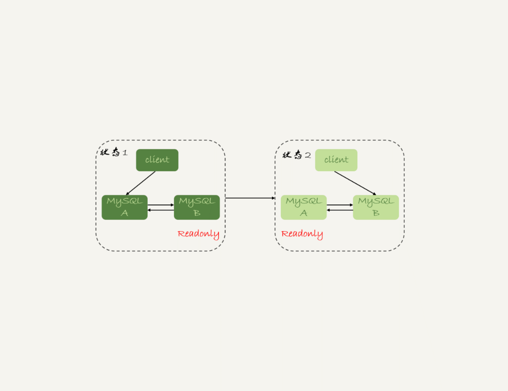
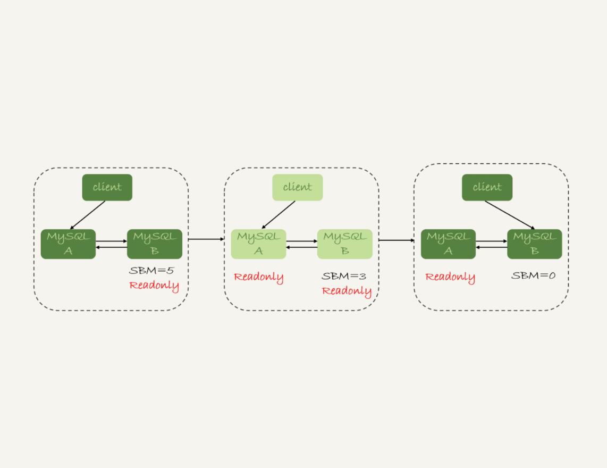
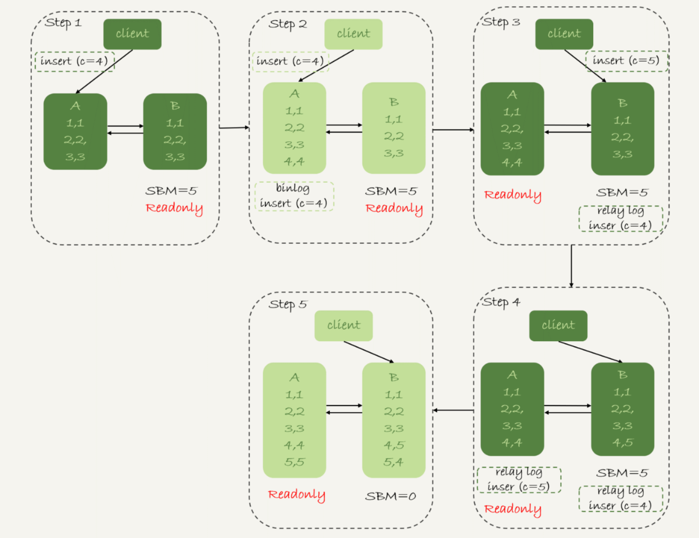
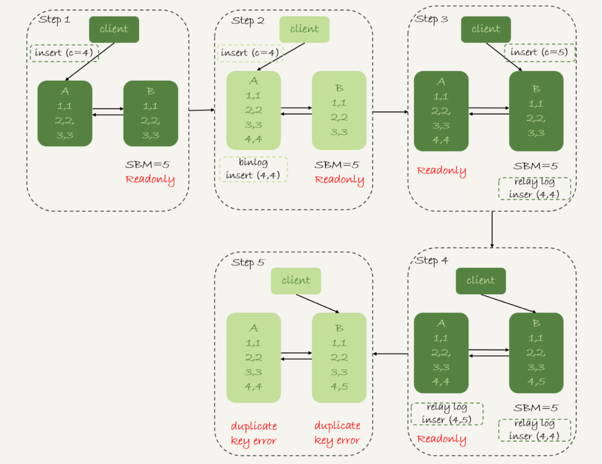
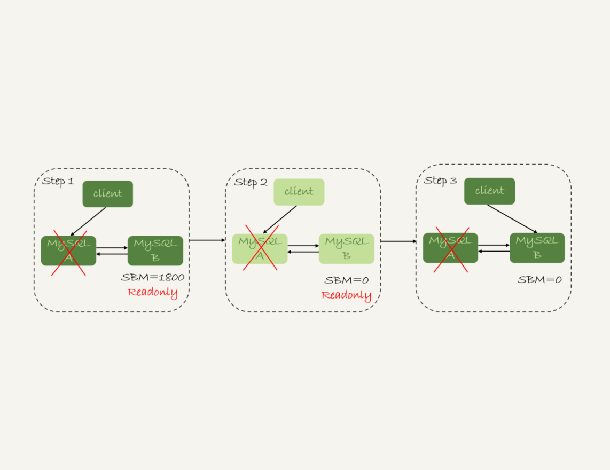
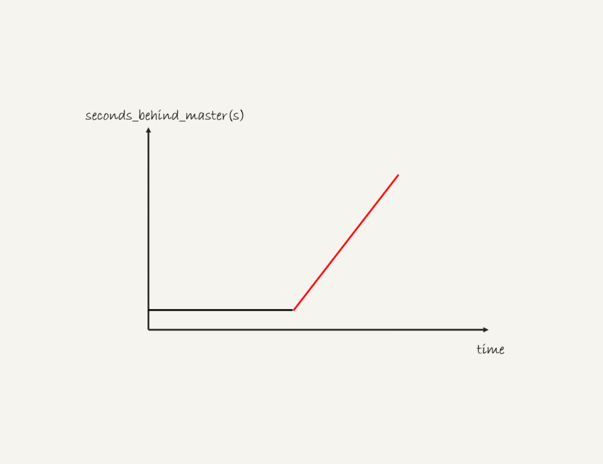
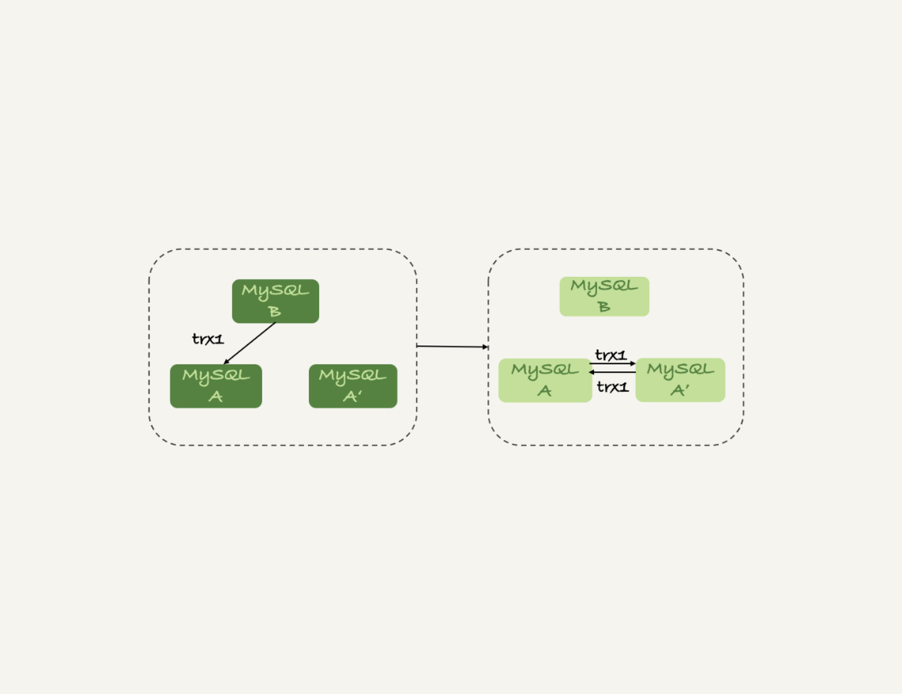

# 25 | MySQL是怎么保证高可用的？
在上一篇文章中，我和你介绍了binlog的基本内容，在一个主备关系中，每个备库接收主库的binlog并执行。

正常情况下，只要主库执行更新生成的所有binlog，都可以传到备库并被正确地执行，备库就能达到跟主库一致的状态，这就是最终一致性。

但是，MySQL要提供高可用能力，只有最终一致性是不够的。为什么这么说呢？今天我就着重和你分析一下。

这里，我再放一次上一篇文章中讲到的双M结构的主备切换流程图。



图 1 MySQL主备切换流程--双M结构

# 主备延迟

主备切换可能是一个主动运维动作，比如软件升级、主库所在机器按计划下线等，也可能是被动操作，比如主库所在机器掉电。

接下来，我们先一起看看主动切换的场景。

在介绍主动切换流程的详细步骤之前，我要先跟你说明一个概念，即“同步延迟”。与数据同步有关的时间点主要包括以下三个：

1. 主库A执行完成一个事务，写入binlog，我们把这个时刻记为T1;

2. 之后传给备库B，我们把备库B接收完这个binlog的时刻记为T2;

3. 备库B执行完成这个事务，我们把这个时刻记为T3。


所谓主备延迟，就是同一个事务，在备库执行完成的时间和主库执行完成的时间之间的差值，也就是T3-T1。

你可以在备库上执行show slave status命令，它的返回结果里面会显示seconds\_behind\_master，用于表示当前备库延迟了多少秒。

seconds\_behind\_master的计算方法是这样的：

1. 每个事务的binlog 里面都有一个时间字段，用于记录主库上写入的时间；

2. 备库取出当前正在执行的事务的时间字段的值，计算它与当前系统时间的差值，得到seconds\_behind\_master。


可以看到，其实seconds\_behind\_master这个参数计算的就是T3-T1。所以，我们可以用seconds\_behind\_master来作为主备延迟的值，这个值的时间精度是秒。

你可能会问，如果主备库机器的系统时间设置不一致，会不会导致主备延迟的值不准？

其实不会的。因为，备库连接到主库的时候，会通过执行SELECT UNIX\_TIMESTAMP()函数来获得当前主库的系统时间。如果这时候发现主库的系统时间与自己不一致，备库在执行seconds\_behind\_master计算的时候会自动扣掉这个差值。

需要说明的是，在网络正常的时候，日志从主库传给备库所需的时间是很短的，即T2-T1的值是非常小的。也就是说，网络正常情况下，主备延迟的主要来源是备库接收完binlog和执行完这个事务之间的时间差。

所以说，主备延迟最直接的表现是，备库消费中转日志（relay log）的速度，比主库生产binlog的速度要慢。接下来，我就和你一起分析下，这可能是由哪些原因导致的。

# 主备延迟的来源

**首先，有些部署条件下，备库所在机器的性能要比主库所在的机器性能差。**

一般情况下，有人这么部署时的想法是，反正备库没有请求，所以可以用差一点儿的机器。或者，他们会把20个主库放在4台机器上，而把备库集中在一台机器上。

其实我们都知道，更新请求对IOPS的压力，在主库和备库上是无差别的。所以，做这种部署时，一般都会将备库设置为“非双1”的模式。

但实际上，更新过程中也会触发大量的读操作。所以，当备库主机上的多个备库都在争抢资源的时候，就可能会导致主备延迟了。

当然，这种部署现在比较少了。因为主备可能发生切换，备库随时可能变成主库，所以主备库选用相同规格的机器，并且做对称部署，是现在比较常见的情况。

追问1：但是，做了对称部署以后，还可能会有延迟。这是为什么呢？

这就是 **第二种常见的可能了，即备库的压力大**。一般的想法是，主库既然提供了写能力，那么备库可以提供一些读能力。或者一些运营后台需要的分析语句，不能影响正常业务，所以只能在备库上跑。

我真就见过不少这样的情况。由于主库直接影响业务，大家使用起来会比较克制，反而忽视了备库的压力控制。结果就是，备库上的查询耗费了大量的CPU资源，影响了同步速度，造成主备延迟。

这种情况，我们一般可以这么处理：

1. 一主多从。除了备库外，可以多接几个从库，让这些从库来分担读的压力。

2. 通过binlog输出到外部系统，比如Hadoop这类系统，让外部系统提供统计类查询的能力。


其中，一主多从的方式大都会被采用。因为作为数据库系统，还必须保证有定期全量备份的能力。而从库，就很适合用来做备份。

> 备注：这里需要说明一下，从库和备库在概念上其实差不多。在我们这个专栏里，为了方便描述，我把会在HA过程中被选成新主库的，称为备库，其他的称为从库。

追问2：采用了一主多从，保证备库的压力不会超过主库，还有什么情况可能导致主备延迟吗？

**这就是第三种可能了，即大事务。**

大事务这种情况很好理解。因为主库上必须等事务执行完成才会写入binlog，再传给备库。所以，如果一个主库上的语句执行10分钟，那这个事务很可能就会导致从库延迟10分钟。

不知道你所在公司的DBA有没有跟你这么说过：不要 **一次性地用delete语句删除太多数据**。其实，这就是一个典型的大事务场景。

比如，一些归档类的数据，平时没有注意删除历史数据，等到空间快满了，业务开发人员要一次性地删掉大量历史数据。同时，又因为要避免在高峰期操作会影响业务（至少有这个意识还是很不错的），所以会在晚上执行这些大量数据的删除操作。

结果，负责的DBA同学半夜就会收到延迟报警。然后，DBA团队就要求你后续再删除数据的时候，要控制每个事务删除的数据量，分成多次删除。

**另一种典型的大事务场景，就是大表DDL。** 这个场景，我在前面的文章中介绍过。处理方案就是，计划内的DDL，建议使用gh-ost方案（这里，你可以再回顾下第13篇文章 [《为什么表数据删掉一半，表文件大小不变？》](https://time.geekbang.org/column/article/72388) 中的相关内容）。

追问3：如果主库上也不做大事务了，还有什么原因会导致主备延迟吗？

造成主备延迟还有一个大方向的原因，就是 **备库的并行复制能力**。这个话题，我会留在下一篇文章再和你详细介绍。

其实还是有不少其他情况会导致主备延迟，如果你还碰到过其他场景，欢迎你在评论区给我留言，我来和你一起分析、讨论。

由于主备延迟的存在，所以在主备切换的时候，就相应的有不同的策略。

# 可靠性优先策略

在图1的双M结构下，从状态1到状态2切换的详细过程是这样的：

1. 判断备库B现在的seconds\_behind\_master，如果小于某个值（比如5秒）继续下一步，否则持续重试这一步；

2. 把主库A改成只读状态，即把readonly设置为true；

3. 判断备库B的seconds\_behind\_master的值，直到这个值变成0为止；

4. 把备库B改成可读写状态，也就是把readonly 设置为false；

5. 把业务请求切到备库B。


这个切换流程，一般是由专门的HA系统来完成的，我们暂时称之为可靠性优先流程。



图2 MySQL可靠性优先主备切换流程

备注：图中的SBM，是seconds\_behind\_master参数的简写。

可以看到，这个切换流程中是有不可用时间的。因为在步骤2之后，主库A和备库B都处于readonly状态，也就是说这时系统处于不可写状态，直到步骤5完成后才能恢复。

在这个不可用状态中，比较耗费时间的是步骤3，可能需要耗费好几秒的时间。这也是为什么需要在步骤1先做判断，确保seconds\_behind\_master的值足够小。

试想如果一开始主备延迟就长达30分钟，而不先做判断直接切换的话，系统的不可用时间就会长达30分钟，这种情况一般业务都是不可接受的。

当然，系统的不可用时间，是由这个数据可靠性优先的策略决定的。你也可以选择可用性优先的策略，来把这个不可用时间几乎降为0。

# 可用性优先策略

如果我强行把步骤4、5调整到最开始执行，也就是说不等主备数据同步，直接把连接切到备库B，并且让备库B可以读写，那么系统几乎就没有不可用时间了。

我们把这个切换流程，暂时称作可用性优先流程。这个切换流程的代价，就是可能出现数据不一致的情况。

接下来，我就和你分享一个可用性优先流程产生数据不一致的例子。假设有一个表 t：

```
mysql> CREATE TABLE `t` (
  `id` int(11) unsigned NOT NULL AUTO_INCREMENT,
  `c` int(11) unsigned DEFAULT NULL,
  PRIMARY KEY (`id`)
) ENGINE=InnoDB;

insert into t(c) values(1),(2),(3);

```

这个表定义了一个自增主键id，初始化数据后，主库和备库上都是3行数据。接下来，业务人员要继续在表t上执行两条插入语句的命令，依次是：

```
insert into t(c) values(4);
insert into t(c) values(5);

```

假设，现在主库上其他的数据表有大量的更新，导致主备延迟达到5秒。在插入一条c=4的语句后，发起了主备切换。

图3是 **可用性优先策略，且binlog\_format=mixed** 时的切换流程和数据结果。



图3 可用性优先策略，且binlog\_format=mixed

现在，我们一起分析下这个切换流程：

1. 步骤2中，主库A执行完insert语句，插入了一行数据（4,4），之后开始进行主备切换。

2. 步骤3中，由于主备之间有5秒的延迟，所以备库B还没来得及应用“插入c=4”这个中转日志，就开始接收客户端“插入 c=5”的命令。

3. 步骤4中，备库B插入了一行数据（4,5），并且把这个binlog发给主库A。

4. 步骤5中，备库B执行“插入c=4”这个中转日志，插入了一行数据（5,4）。而直接在备库B执行的“插入c=5”这个语句，传到主库A，就插入了一行新数据（5,5）。


最后的结果就是，主库A和备库B上出现了两行不一致的数据。可以看到，这个数据不一致，是由可用性优先流程导致的。

那么，如果我还是用 **可用性优先策略，但设置binlog\_format=row**，情况又会怎样呢？

因为row格式在记录binlog的时候，会记录新插入的行的所有字段值，所以最后只会有一行不一致。而且，两边的主备同步的应用线程会报错duplicate key error并停止。也就是说，这种情况下，备库B的(5,4)和主库A的(5,5)这两行数据，都不会被对方执行。

图4中我画出了详细过程，你可以自己再分析一下。



图4 可用性优先策略，且binlog\_format=row

从上面的分析中，你可以看到一些结论：

1. 使用row格式的binlog时，数据不一致的问题更容易被发现。而使用mixed或者statement格式的binlog时，数据很可能悄悄地就不一致了。如果你过了很久才发现数据不一致的问题，很可能这时的数据不一致已经不可查，或者连带造成了更多的数据逻辑不一致。

2. 主备切换的可用性优先策略会导致数据不一致。因此，大多数情况下，我都建议你使用可靠性优先策略。毕竟对数据服务来说的话，数据的可靠性一般还是要优于可用性的。


但事无绝对， **有没有哪种情况数据的可用性优先级更高呢？**

答案是，有的。

我曾经碰到过这样的一个场景：

- 有一个库的作用是记录操作日志。这时候，如果数据不一致可以通过binlog来修补，而这个短暂的不一致也不会引发业务问题。
- 同时，业务系统依赖于这个日志写入逻辑，如果这个库不可写，会导致线上的业务操作无法执行。

这时候，你可能就需要选择先强行切换，事后再补数据的策略。

当然，事后复盘的时候，我们想到了一个改进措施就是，让业务逻辑不要依赖于这类日志的写入。也就是说，日志写入这个逻辑模块应该可以降级，比如写到本地文件，或者写到另外一个临时库里面。

这样的话，这种场景就又可以使用可靠性优先策略了。

接下来我们再看看， **按照可靠性优先的思路，异常切换会是什么效果？**

假设，主库A和备库B间的主备延迟是30分钟，这时候主库A掉电了，HA系统要切换B作为主库。我们在主动切换的时候，可以等到主备延迟小于5秒的时候再启动切换，但这时候已经别无选择了。



图5 可靠性优先策略，主库不可用

采用可靠性优先策略的话，你就必须得等到备库B的seconds\_behind\_master=0之后，才能切换。但现在的情况比刚刚更严重，并不是系统只读、不可写的问题了，而是系统处于完全不可用的状态。因为，主库A掉电后，我们的连接还没有切到备库B。

你可能会问，那能不能直接切换到备库B，但是保持B只读呢？

这样也不行。

因为，这段时间内，中转日志还没有应用完成，如果直接发起主备切换，客户端查询看不到之前执行完成的事务，会认为有“数据丢失”。

虽然随着中转日志的继续应用，这些数据会恢复回来，但是对于一些业务来说，查询到“暂时丢失数据的状态”也是不能被接受的。

聊到这里你就知道了，在满足数据可靠性的前提下，MySQL高可用系统的可用性，是依赖于主备延迟的。延迟的时间越小，在主库故障的时候，服务恢复需要的时间就越短，可用性就越高。

# 小结

今天这篇文章，我先和你介绍了MySQL高可用系统的基础，就是主备切换逻辑。紧接着，我又和你讨论了几种会导致主备延迟的情况，以及相应的改进方向。

然后，由于主备延迟的存在，切换策略就有不同的选择。所以，我又和你一起分析了可靠性优先和可用性优先策略的区别。

在实际的应用中，我更建议使用可靠性优先的策略。毕竟保证数据准确，应该是数据库服务的底线。在这个基础上，通过减少主备延迟，提升系统的可用性。

最后，我给你留下一个思考题吧。

一般现在的数据库运维系统都有备库延迟监控，其实就是在备库上执行 show slave status，采集seconds\_behind\_master的值。

假设，现在你看到你维护的一个备库，它的延迟监控的图像类似图6，是一个45°斜向上的线段，你觉得可能是什么原因导致呢？你又会怎么去确认这个原因呢？



图6 备库延迟

你可以把你的分析写在评论区，我会在下一篇文章的末尾跟你讨论这个问题。感谢你的收听，也欢迎你把这篇文章分享给更多的朋友一起阅读。

# 上期问题时间

上期我留给你的问题是，什么情况下双M结构会出现循环复制。

一种场景是，在一个主库更新事务后，用命令set global server\_id=x修改了server\_id。等日志再传回来的时候，发现server\_id跟自己的server\_id不同，就只能执行了。

另一种场景是，有三个节点的时候，如图7所示，trx1是在节点 B执行的，因此binlog上的server\_id就是B，binlog传给节点 A，然后A和A’搭建了双M结构，就会出现循环复制。



图7 三节点循环复制

这种三节点复制的场景，做数据库迁移的时候会出现。

如果出现了循环复制，可以在A或者A’上，执行如下命令：

```
stop slave；
CHANGE MASTER TO IGNORE_SERVER_IDS=(server_id_of_B);
start slave;

```

这样这个节点收到日志后就不会再执行。过一段时间后，再执行下面的命令把这个值改回来。

```
stop slave；
CHANGE MASTER TO IGNORE_SERVER_IDS=();
start slave;

```

评论区留言点赞板：

> @一大只、@HuaMax 同学提到了第一个复现方法；

> @Jonh同学提到了IGNORE\_SERVER\_IDS这个解决方法；

> @React 提到，如果主备设置不同的步长，备库是不是可以设置为可读写。我的建议是，只要这个节点设计内就不会有业务直接在上面执行更新，就建议设置为readonly。