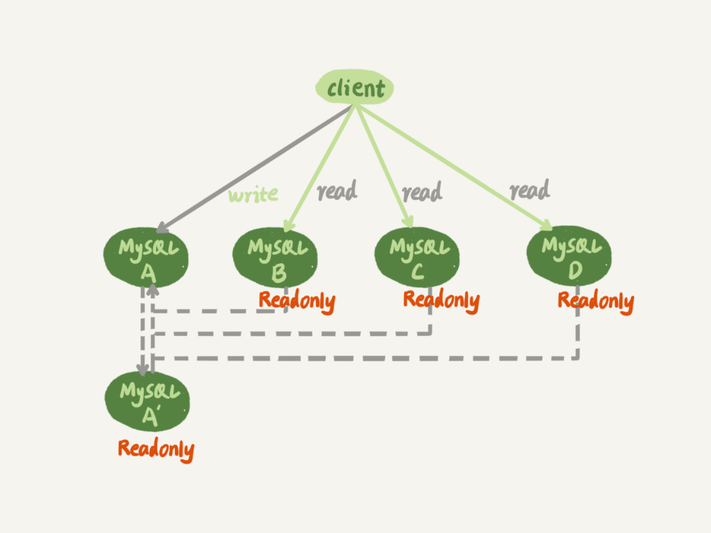
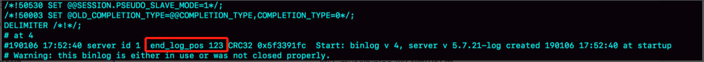
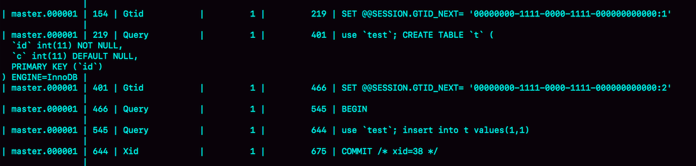
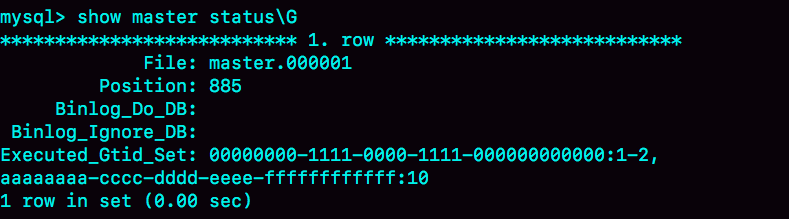

# 27 | 主库出问题了，从库怎么办？
在前面的第 [24](https://time.geekbang.org/column/article/76446)、 [25](https://time.geekbang.org/column/article/76795) 和 [26](https://time.geekbang.org/column/article/77083) 篇文章中，我和你介绍了MySQL主备复制的基础结构，但这些都是一主一备的结构。

大多数的互联网应用场景都是读多写少，因此你负责的业务，在发展过程中很可能先会遇到读性能的问题。而在数据库层解决读性能问题，就要涉及到接下来两篇文章要讨论的架构：一主多从。

今天这篇文章，我们就先聊聊一主多从的切换正确性。然后，我们在下一篇文章中再聊聊解决一主多从的查询逻辑正确性的方法。

如图1所示，就是一个基本的一主多从结构。



图1 一主多从基本结构

图中，虚线箭头表示的是主备关系，也就是A和A’互为主备， 从库B、C、D指向的是主库A。一主多从的设置，一般用于读写分离，主库负责所有的写入和一部分读，其他的读请求则由从库分担。

今天我们要讨论的就是，在一主多从架构下，主库故障后的主备切换问题。

如图2所示，就是主库发生故障，主备切换后的结果。


图2 一主多从基本结构--主备切换

相比于一主一备的切换流程，一主多从结构在切换完成后，A’会成为新的主库，从库B、C、D也要改接到A’。正是由于多了从库B、C、D重新指向的这个过程，所以主备切换的复杂性也相应增加了。

接下来，我们再一起看看一个切换系统会怎么完成一主多从的主备切换过程。

# 基于位点的主备切换

这里，我们需要先来回顾一个知识点。

当我们把节点B设置成节点A’的从库的时候，需要执行一条change master命令：

```
CHANGE MASTER TO
MASTER_HOST=$host_name
MASTER_PORT=$port
MASTER_USER=$user_name
MASTER_PASSWORD=$password
MASTER_LOG_FILE=$master_log_name
MASTER_LOG_POS=$master_log_pos

```

这条命令有这么6个参数：

- MASTER\_HOST、MASTER\_PORT、MASTER\_USER和MASTER\_PASSWORD四个参数，分别代表了主库A’的IP、端口、用户名和密码。
- 最后两个参数MASTER\_LOG\_FILE和MASTER\_LOG\_POS表示，要从主库的master\_log\_name文件的master\_log\_pos这个位置的日志继续同步。而这个位置就是我们所说的同步位点，也就是主库对应的文件名和日志偏移量。

那么，这里就有一个问题了，节点B要设置成A’的从库，就要执行change master命令，就不可避免地要设置位点的这两个参数，但是这两个参数到底应该怎么设置呢？

原来节点B是A的从库，本地记录的也是A的位点。但是相同的日志，A的位点和A’的位点是不同的。因此，从库B要切换的时候，就需要先经过“找同步位点”这个逻辑。

这个位点很难精确取到，只能取一个大概位置。为什么这么说呢？

我来和你分析一下看看这个位点一般是怎么获取到的，你就清楚其中不精确的原因了。

考虑到切换过程中不能丢数据，所以我们找位点的时候，总是要找一个“稍微往前”的，然后再通过判断跳过那些在从库B上已经执行过的事务。

一种取同步位点的方法是这样的：

1. 等待新主库A’把中转日志（relay log）全部同步完成；

2. 在A’上执行show master status命令，得到当前A’上最新的File 和 Position；

3. 取原主库A故障的时刻T；

4. 用mysqlbinlog工具解析A’的File，得到T时刻的位点。


```
mysqlbinlog File --stop-datetime=T --start-datetime=T

```



图3 mysqlbinlog 部分输出结果

图中，end\_log\_pos后面的值“123”，表示的就是A’这个实例，在T时刻写入新的binlog的位置。然后，我们就可以把123这个值作为$master\_log\_pos ，用在节点B的change master命令里。

当然这个值并不精确。为什么呢？

你可以设想有这么一种情况，假设在T这个时刻，主库A已经执行完成了一个insert 语句插入了一行数据R，并且已经将binlog传给了A’和B，然后在传完的瞬间主库A的主机就掉电了。

那么，这时候系统的状态是这样的：

1. 在从库B上，由于同步了binlog， R这一行已经存在；

2. 在新主库A’上， R这一行也已经存在，日志是写在123这个位置之后的；

3. 我们在从库B上执行change master命令，指向A’的File文件的123位置，就会把插入R这一行数据的binlog又同步到从库B去执行。


这时候，从库B的同步线程就会报告 Duplicate entry ‘id\_of\_R’ for key ‘PRIMARY’ 错误，提示出现了主键冲突，然后停止同步。

所以， **通常情况下，我们在切换任务的时候，要先主动跳过这些错误，有两种常用的方法。**

**一种做法是**，主动跳过一个事务。跳过命令的写法是：

```
set global sql_slave_skip_counter=1;
start slave;

```

因为切换过程中，可能会不止重复执行一个事务，所以我们需要在从库B刚开始接到新主库A’时，持续观察，每次碰到这些错误就停下来，执行一次跳过命令，直到不再出现停下来的情况，以此来跳过可能涉及的所有事务。

**另外一种方式是，** 通过设置slave\_skip\_errors参数，直接设置跳过指定的错误。

在执行主备切换时，有这么两类错误，是经常会遇到的：

- 1062错误是插入数据时唯一键冲突；
- 1032错误是删除数据时找不到行。

因此，我们可以把slave\_skip\_errors 设置为 “1032,1062”，这样中间碰到这两个错误时就直接跳过。

这里需要注意的是，这种直接跳过指定错误的方法，针对的是主备切换时，由于找不到精确的同步位点，所以只能采用这种方法来创建从库和新主库的主备关系。

这个背景是，我们很清楚在主备切换过程中，直接跳过1032和1062这两类错误是无损的，所以才可以这么设置slave\_skip\_errors参数。等到主备间的同步关系建立完成，并稳定执行一段时间之后，我们还需要把这个参数设置为空，以免之后真的出现了主从数据不一致，也跳过了。

# GTID

通过sql\_slave\_skip\_counter跳过事务和通过slave\_skip\_errors忽略错误的方法，虽然都最终可以建立从库B和新主库A’的主备关系，但这两种操作都很复杂，而且容易出错。所以，MySQL 5.6版本引入了GTID，彻底解决了这个困难。

那么，GTID到底是什么意思，又是如何解决找同步位点这个问题呢？现在，我就和你简单介绍一下。

GTID的全称是Global Transaction Identifier，也就是全局事务ID，是一个事务在提交的时候生成的，是这个事务的唯一标识。它由两部分组成，格式是：

```
GTID=server_uuid:gno

```

其中：

- server\_uuid是一个实例第一次启动时自动生成的，是一个全局唯一的值；
- gno是一个整数，初始值是1，每次提交事务的时候分配给这个事务，并加1。

这里我需要和你说明一下，在MySQL的官方文档里，GTID格式是这么定义的：

```
GTID=source_id:transaction_id

```

这里的source\_id就是server\_uuid；而后面的这个transaction\_id，我觉得容易造成误导，所以我改成了gno。为什么说使用transaction\_id容易造成误解呢？

因为，在MySQL里面我们说transaction\_id就是指事务id，事务id是在事务执行过程中分配的，如果这个事务回滚了，事务id也会递增，而gno是在事务提交的时候才会分配。

从效果上看，GTID往往是连续的，因此我们用gno来表示更容易理解。

GTID模式的启动也很简单，我们只需要在启动一个MySQL实例的时候，加上参数gtid\_mode=on和enforce\_gtid\_consistency=on就可以了。

在GTID模式下，每个事务都会跟一个GTID一一对应。这个GTID有两种生成方式，而使用哪种方式取决于session变量gtid\_next的值。

1. 如果gtid\_next=automatic，代表使用默认值。这时，MySQL就会把server\_uuid:gno分配给这个事务。


   a. 记录binlog的时候，先记录一行 SET @@SESSION.GTID\_NEXT=‘server\_uuid:gno’;


   b. 把这个GTID加入本实例的GTID集合。

2. 如果gtid\_next是一个指定的GTID的值，比如通过set gtid\_next='current\_gtid’指定为current\_gtid，那么就有两种可能：


   a. 如果current\_gtid已经存在于实例的GTID集合中，接下来执行的这个事务会直接被系统忽略；


   b. 如果current\_gtid没有存在于实例的GTID集合中，就将这个current\_gtid分配给接下来要执行的事务，也就是说系统不需要给这个事务生成新的GTID，因此gno也不用加1。


注意，一个current\_gtid只能给一个事务使用。这个事务提交后，如果要执行下一个事务，就要执行set 命令，把gtid\_next设置成另外一个gtid或者automatic。

这样，每个MySQL实例都维护了一个GTID集合，用来对应“这个实例执行过的所有事务”。

这样看上去不太容易理解，接下来我就用一个简单的例子，来和你说明GTID的基本用法。

我们在实例X中创建一个表t。

```
CREATE TABLE `t` (
  `id` int(11) NOT NULL,
  `c` int(11) DEFAULT NULL,
  PRIMARY KEY (`id`)
) ENGINE=InnoDB;

insert into t values(1,1);

```



图4 初始化数据的binlog

可以看到，事务的BEGIN之前有一条SET @@SESSION.GTID\_NEXT命令。这时，如果实例X有从库，那么将CREATE TABLE和insert语句的binlog同步过去执行的话，执行事务之前就会先执行这两个SET命令， 这样被加入从库的GTID集合的，就是图中的这两个GTID。

假设，现在这个实例X是另外一个实例Y的从库，并且此时在实例Y上执行了下面这条插入语句：

```
insert into t values(1,1);

```

并且，这条语句在实例Y上的GTID是 “aaaaaaaa-cccc-dddd-eeee-ffffffffffff:10”。

那么，实例X作为Y的从库，就要同步这个事务过来执行，显然会出现主键冲突，导致实例X的同步线程停止。这时，我们应该怎么处理呢？

处理方法就是，你可以执行下面的这个语句序列：

```
set gtid_next='aaaaaaaa-cccc-dddd-eeee-ffffffffffff:10';
begin;
commit;
set gtid_next=automatic;
start slave;

```

其中，前三条语句的作用，是通过提交一个空事务，把这个GTID加到实例X的GTID集合中。如图5所示，就是执行完这个空事务之后的show master status的结果。



图5 show master status结果

可以看到实例X的Executed\_Gtid\_set里面，已经加入了这个GTID。

这样，我再执行start slave命令让同步线程执行起来的时候，虽然实例X上还是会继续执行实例Y传过来的事务，但是由于“aaaaaaaa-cccc-dddd-eeee-ffffffffffff:10”已经存在于实例X的GTID集合中了，所以实例X就会直接跳过这个事务，也就不会再出现主键冲突的错误。

在上面的这个语句序列中，start slave命令之前还有一句set gtid\_next=automatic。这句话的作用是“恢复GTID的默认分配行为”，也就是说如果之后有新的事务再执行，就还是按照原来的分配方式，继续分配gno=3。

# 基于GTID的主备切换

现在，我们已经理解GTID的概念，再一起来看看基于GTID的主备复制的用法。

在GTID模式下，备库B要设置为新主库A’的从库的语法如下：

```
CHANGE MASTER TO
MASTER_HOST=$host_name
MASTER_PORT=$port
MASTER_USER=$user_name
MASTER_PASSWORD=$password
master_auto_position=1

```

其中，master\_auto\_position=1就表示这个主备关系使用的是GTID协议。可以看到，前面让我们头疼不已的MASTER\_LOG\_FILE和MASTER\_LOG\_POS参数，已经不需要指定了。

我们把现在这个时刻，实例A’的GTID集合记为set\_a，实例B的GTID集合记为set\_b。接下来，我们就看看现在的主备切换逻辑。

我们在实例B上执行start slave命令，取binlog的逻辑是这样的：

1. 实例B指定主库A’，基于主备协议建立连接。

2. 实例B把set\_b发给主库A’。

3. 实例A’算出set\_a与set\_b的差集，也就是所有存在于set\_a，但是不存在于set\_b的GTID的集合，判断A’本地是否包含了这个差集需要的所有binlog事务。


   a. 如果不包含，表示A’已经把实例B需要的binlog给删掉了，直接返回错误；


   b. 如果确认全部包含，A’从自己的binlog文件里面，找出第一个不在set\_b的事务，发给B；

4. 之后就从这个事务开始，往后读文件，按顺序取binlog发给B去执行。


其实，这个逻辑里面包含了一个设计思想：在基于GTID的主备关系里，系统认为只要建立主备关系，就必须保证主库发给备库的日志是完整的。因此，如果实例B需要的日志已经不存在，A’就拒绝把日志发给B。

这跟基于位点的主备协议不同。基于位点的协议，是由备库决定的，备库指定哪个位点，主库就发哪个位点，不做日志的完整性判断。

基于上面的介绍，我们再来看看引入GTID后，一主多从的切换场景下，主备切换是如何实现的。

由于不需要找位点了，所以从库B、C、D只需要分别执行change master命令指向实例A’即可。

其实，严谨地说，主备切换不是不需要找位点了，而是找位点这个工作，在实例A’内部就已经自动完成了。但由于这个工作是自动的，所以对HA系统的开发人员来说，非常友好。

之后这个系统就由新主库A’写入，主库A’的自己生成的binlog中的GTID集合格式是：server\_uuid\_of\_A’:1-M。

如果之前从库B的GTID集合格式是 server\_uuid\_of\_A:1-N， 那么切换之后GTID集合的格式就变成了server\_uuid\_of\_A:1-N, server\_uuid\_of\_A’:1-M。

当然，主库A’之前也是A的备库，因此主库A’和从库B的GTID集合是一样的。这就达到了我们预期。

# GTID和在线DDL

接下来，我再举个例子帮你理解GTID。

之前在第22篇文章 [《MySQL有哪些“饮鸩止渴”提高性能的方法？》](https://time.geekbang.org/column/article/75746) 中，我和你提到业务高峰期的慢查询性能问题时，分析到如果是由于索引缺失引起的性能问题，我们可以通过在线加索引来解决。但是，考虑到要避免新增索引对主库性能造成的影响，我们可以先在备库加索引，然后再切换。

当时我说，在双M结构下，备库执行的DDL语句也会传给主库，为了避免传回后对主库造成影响，要通过set sql\_log\_bin=off关掉binlog。

评论区有位同学提出了一个问题：这样操作的话，数据库里面是加了索引，但是binlog并没有记录下这一个更新，是不是会导致数据和日志不一致？

这个问题提得非常好。当时，我在留言的回复中就引用了GTID来说明。今天，我再和你展开说明一下。

假设，这两个互为主备关系的库还是实例X和实例Y，且当前主库是X，并且都打开了GTID模式。这时的主备切换流程可以变成下面这样：

- 在实例X上执行stop slave。

- 在实例Y上执行DDL语句。注意，这里并不需要关闭binlog。

- 执行完成后，查出这个DDL语句对应的GTID，并记为 server\_uuid\_of\_Y:gno。

- 到实例X上执行以下语句序列：


```
set GTID_NEXT="server_uuid_of_Y:gno";
begin;
commit;
set gtid_next=automatic;
start slave;

```

这样做的目的在于，既可以让实例Y的更新有binlog记录，同时也可以确保不会在实例X上执行这条更新。

- 接下来，执行完主备切换，然后照着上述流程再执行一遍即可。

# 小结

在今天这篇文章中，我先和你介绍了一主多从的主备切换流程。在这个过程中，从库找新主库的位点是一个痛点。由此，我们引出了MySQL 5.6版本引入的GTID模式，介绍了GTID的基本概念和用法。

可以看到，在GTID模式下，一主多从切换就非常方便了。

因此，如果你使用的MySQL版本支持GTID的话，我都建议你尽量使用GTID模式来做一主多从的切换。

在下一篇文章中，我们还能看到GTID模式在读写分离场景的应用。

最后，又到了我们的思考题时间。

你在GTID模式下设置主从关系的时候，从库执行start slave命令后，主库发现需要的binlog已经被删除掉了，导致主备创建不成功。这种情况下，你觉得可以怎么处理呢？

你可以把你的方法写在留言区，我会在下一篇文章的末尾和你讨论这个问题。感谢你的收听，也欢迎你把这篇文章分享给更多的朋友一起阅读。

# 上期问题时间

上一篇文章最后，我给你留的问题是，如果主库都是单线程压力模式，在从库追主库的过程中，binlog-transaction-dependency-tracking 应该选用什么参数？

这个问题的答案是，应该将这个参数设置为WRITESET。

由于主库是单线程压力模式，所以每个事务的commit\_id都不同，那么设置为COMMIT\_ORDER模式的话，从库也只能单线程执行。

同样地，由于WRITESET\_SESSION模式要求在备库应用日志的时候，同一个线程的日志必须与主库上执行的先后顺序相同，也会导致主库单线程压力模式下退化成单线程复制。

所以，应该将binlog-transaction-dependency-tracking 设置为WRITESET。

**评论区留言点赞板：**

> @慧鑫coming 问了一个好问题，对同一行作更新的几个事务，如果commit\_id相同，是不是在备库并行执行的时候会导致数据不一致？这个问题的答案是更新同一行的事务是不可能同时进入commit状态的。
>
> @老杨同志 对这个问题给出了更详细的回答，大家可以去看一下。