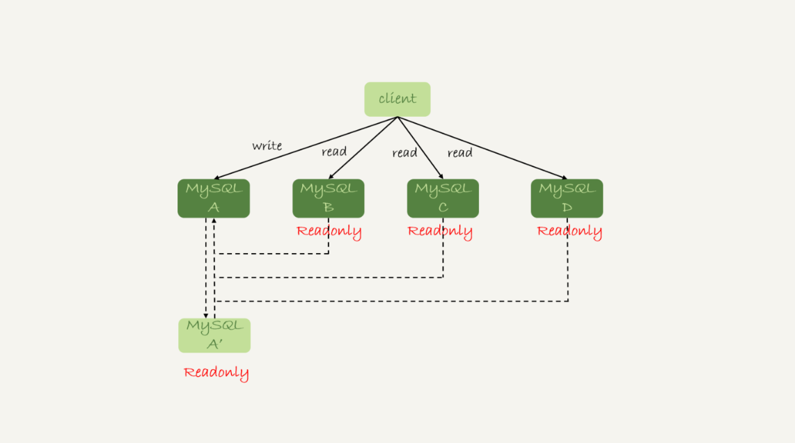
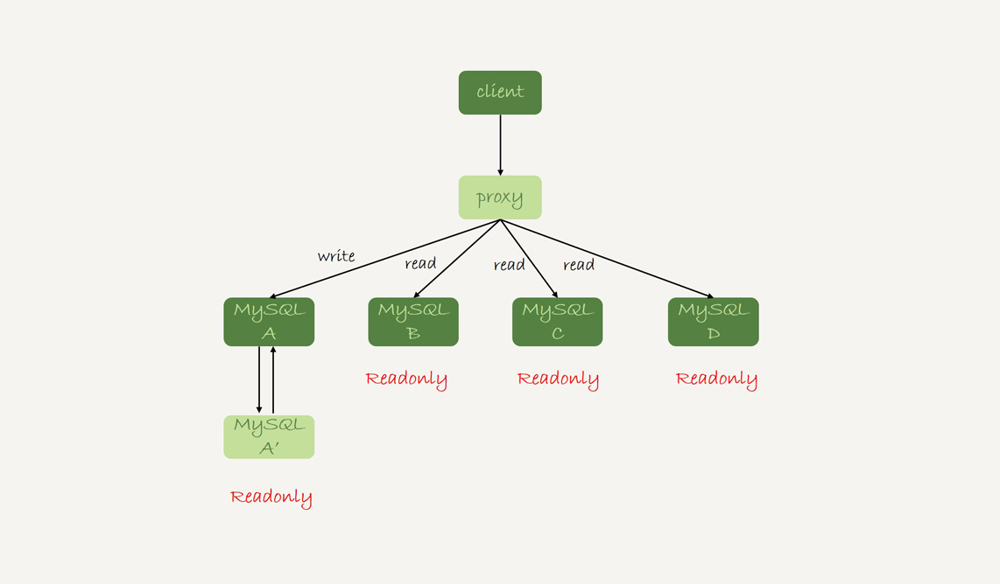
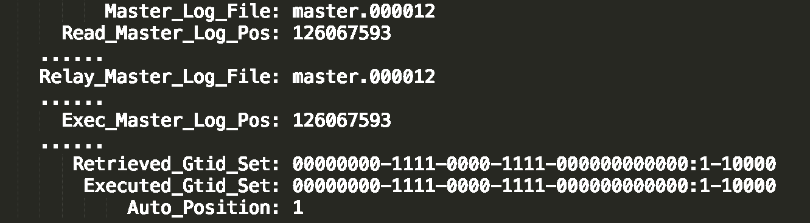
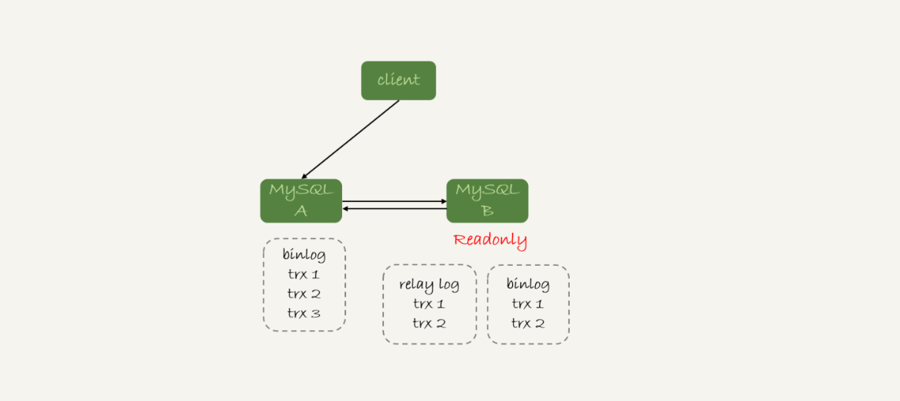
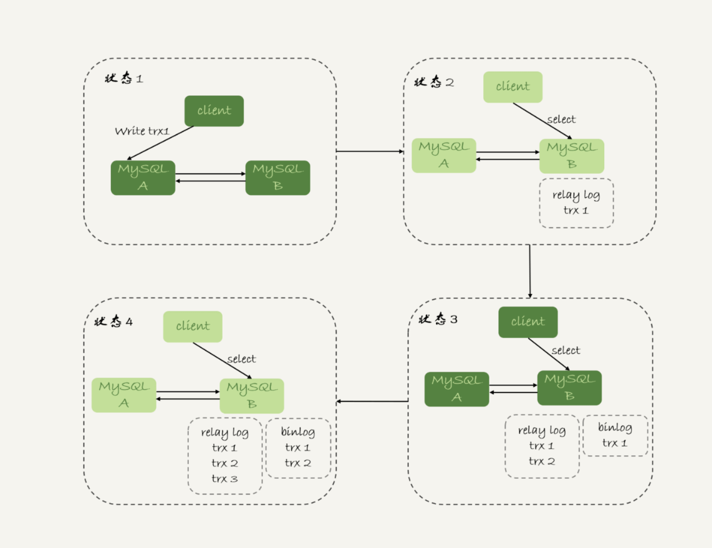
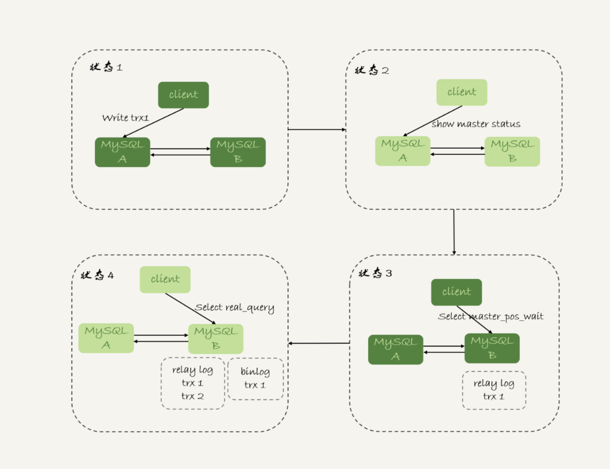
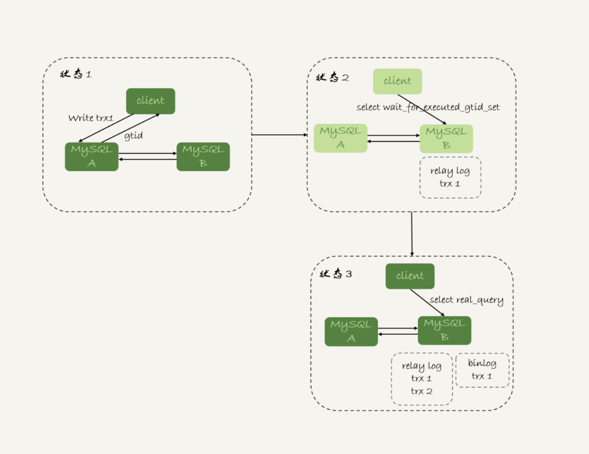
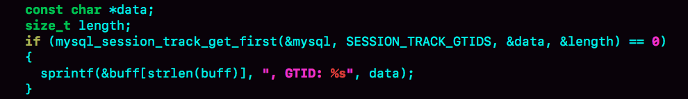
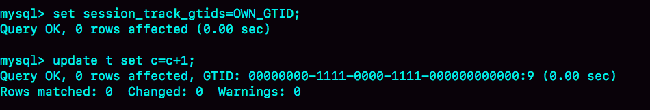

# 28 | 读写分离有哪些坑？
在上一篇文章中，我和你介绍了一主多从的结构以及切换流程。今天我们就继续聊聊一主多从架构的应用场景：读写分离，以及怎么处理主备延迟导致的读写分离问题。

我们在上一篇文章中提到的一主多从的结构，其实就是读写分离的基本结构了。这里，我再把这张图贴过来，方便你理解。



图1 读写分离基本结构

读写分离的主要目标就是分摊主库的压力。图1中的结构是客户端（client）主动做负载均衡，这种模式下一般会把数据库的连接信息放在客户端的连接层。也就是说，由客户端来选择后端数据库进行查询。

还有一种架构是，在MySQL和客户端之间有一个中间代理层proxy，客户端只连接proxy， 由proxy根据请求类型和上下文决定请求的分发路由。



图2 带proxy的读写分离架构

接下来，我们就看一下客户端直连和带proxy的读写分离架构，各有哪些特点。

1. 客户端直连方案，因为少了一层proxy转发，所以查询性能稍微好一点儿，并且整体架构简单，排查问题更方便。但是这种方案，由于要了解后端部署细节，所以在出现主备切换、库迁移等操作的时候，客户端都会感知到，并且需要调整数据库连接信息。


   你可能会觉得这样客户端也太麻烦了，信息大量冗余，架构很丑。其实也未必，一般采用这样的架构，一定会伴随一个负责管理后端的组件，比如Zookeeper，尽量让业务端只专注于业务逻辑开发。

2. 带proxy的架构，对客户端比较友好。客户端不需要关注后端细节，连接维护、后端信息维护等工作，都是由proxy完成的。但这样的话，对后端维护团队的要求会更高。而且，proxy也需要有高可用架构。因此，带proxy架构的整体就相对比较复杂。


理解了这两种方案的优劣，具体选择哪个方案就取决于数据库团队提供的能力了。但目前看，趋势是往带proxy的架构方向发展的。

但是，不论使用哪种架构，你都会碰到我们今天要讨论的问题：由于主从可能存在延迟，客户端执行完一个更新事务后马上发起查询，如果查询选择的是从库的话，就有可能读到刚刚的事务更新之前的状态。

**这种“在从库上会读到系统的一个过期状态”的现象，在这篇文章里，我们暂且称之为“过期读”。**

前面我们说过了几种可能导致主备延迟的原因，以及对应的优化策略，但是主从延迟还是不能100%避免的。

不论哪种结构，客户端都希望查询从库的数据结果，跟查主库的数据结果是一样的。

接下来，我们就来讨论怎么处理过期读问题。

这里，我先把文章中涉及到的处理过期读的方案汇总在这里，以帮助你更好地理解和掌握全文的知识脉络。这些方案包括：

- 强制走主库方案；
- sleep方案；
- 判断主备无延迟方案；
- 配合semi-sync方案；
- 等主库位点方案；
- 等GTID方案。

# 强制走主库方案

强制走主库方案其实就是，将查询请求做分类。通常情况下，我们可以将查询请求分为这么两类：

1. 对于必须要拿到最新结果的请求，强制将其发到主库上。比如，在一个交易平台上，卖家发布商品以后，马上要返回主页面，看商品是否发布成功。那么，这个请求需要拿到最新的结果，就必须走主库。

2. 对于可以读到旧数据的请求，才将其发到从库上。在这个交易平台上，买家来逛商铺页面，就算晚几秒看到最新发布的商品，也是可以接受的。那么，这类请求就可以走从库。


你可能会说，这个方案是不是有点畏难和取巧的意思，但其实这个方案是用得最多的。

当然，这个方案最大的问题在于，有时候你会碰到“所有查询都不能是过期读”的需求，比如一些金融类的业务。这样的话，你就要放弃读写分离，所有读写压力都在主库，等同于放弃了扩展性。

因此接下来，我们来讨论的话题是：可以支持读写分离的场景下，有哪些解决过期读的方案，并分析各个方案的优缺点。

# Sleep 方案

主库更新后，读从库之前先sleep一下。具体的方案就是，类似于执行一条select sleep(1)命令。

这个方案的假设是，大多数情况下主备延迟在1秒之内，做一个sleep可以有很大概率拿到最新的数据。

这个方案给你的第一感觉，很可能是不靠谱儿，应该不会有人用吧？并且，你还可能会说，直接在发起查询时先执行一条sleep语句，用户体验很不友好啊。

但，这个思路确实可以在一定程度上解决问题。为了看起来更靠谱儿，我们可以换一种方式。

以卖家发布商品为例，商品发布后，用Ajax（Asynchronous JavaScript + XML，异步JavaScript和XML）直接把客户端输入的内容作为“新的商品”显示在页面上，而不是真正地去数据库做查询。

这样，卖家就可以通过这个显示，来确认产品已经发布成功了。等到卖家再刷新页面，去查看商品的时候，其实已经过了一段时间，也就达到了sleep的目的，进而也就解决了过期读的问题。

也就是说，这个sleep方案确实解决了类似场景下的过期读问题。但，从严格意义上来说，这个方案存在的问题就是不精确。这个不精确包含了两层意思：

1. 如果这个查询请求本来0.5秒就可以在从库上拿到正确结果，也会等1秒；

2. 如果延迟超过1秒，还是会出现过期读。


看到这里，你是不是有一种“你是不是在逗我”的感觉，这个改进方案虽然可以解决类似Ajax场景下的过期读问题，但还是怎么看都不靠谱儿。别着急，接下来我就和你介绍一些更准确的方案。

# 判断主备无延迟方案

要确保备库无延迟，通常有三种做法。

通过前面的 [第25篇](https://time.geekbang.org/column/article/76795) 文章，我们知道show slave status结果里的seconds\_behind\_master参数的值，可以用来衡量主备延迟时间的长短。

所以 **第一种确保主备无延迟的方法是，** 每次从库执行查询请求前，先判断seconds\_behind\_master是否已经等于0。如果还不等于0 ，那就必须等到这个参数变为0才能执行查询请求。

seconds\_behind\_master的单位是秒，如果你觉得精度不够的话，还可以采用对比位点和GTID的方法来确保主备无延迟，也就是我们接下来要说的第二和第三种方法。

如图3所示，是一个show slave status结果的部分截图。



图3 show slave status结果

现在，我们就通过这个结果，来看看具体如何通过对比位点和GTID来确保主备无延迟。

**第二种方法，** 对比位点确保主备无延迟：

- Master\_Log\_File和Read\_Master\_Log\_Pos，表示的是读到的主库的最新位点；
- Relay\_Master\_Log\_File和Exec\_Master\_Log\_Pos，表示的是备库执行的最新位点。

如果Master\_Log\_File和Relay\_Master\_Log\_File、Read\_Master\_Log\_Pos和Exec\_Master\_Log\_Pos这两组值完全相同，就表示接收到的日志已经同步完成。

**第三种方法，** 对比GTID集合确保主备无延迟：

- Auto\_Position=1 ，表示这对主备关系使用了GTID协议。
- Retrieved\_Gtid\_Set，是备库收到的所有日志的GTID集合；
- Executed\_Gtid\_Set，是备库所有已经执行完成的GTID集合。

如果这两个集合相同，也表示备库接收到的日志都已经同步完成。

可见，对比位点和对比GTID这两种方法，都要比判断seconds\_behind\_master是否为0更准确。

在执行查询请求之前，先判断从库是否同步完成的方法，相比于sleep方案，准确度确实提升了不少，但还是没有达到“精确”的程度。为什么这么说呢？

我们现在一起来回顾下，一个事务的binlog在主备库之间的状态：

1. 主库执行完成，写入binlog，并反馈给客户端；

2. binlog被从主库发送给备库，备库收到；

3. 在备库执行binlog完成。


我们上面判断主备无延迟的逻辑，是“备库收到的日志都执行完成了”。但是，从binlog在主备之间状态的分析中，不难看出还有一部分日志，处于客户端已经收到提交确认，而备库还没收到日志的状态。

如图4所示就是这样的一个状态。



图4 备库还没收到trx3

这时，主库上执行完成了三个事务trx1、trx2和trx3，其中：

1. trx1和trx2已经传到从库，并且已经执行完成了；

2. trx3在主库执行完成，并且已经回复给客户端，但是还没有传到从库中。


如果这时候你在从库B上执行查询请求，按照我们上面的逻辑，从库认为已经没有同步延迟，但还是查不到trx3的。严格地说，就是出现了过期读。

那么，这个问题有没有办法解决呢？

# 配合semi-sync

要解决这个问题，就要引入半同步复制，也就是semi-sync replication。

semi-sync做了这样的设计：

1. 事务提交的时候，主库把binlog发给从库；

2. 从库收到binlog以后，发回给主库一个ack，表示收到了；

3. 主库收到这个ack以后，才能给客户端返回“事务完成”的确认。


也就是说，如果启用了semi-sync，就表示所有给客户端发送过确认的事务，都确保了备库已经收到了这个日志。

在 [第25篇文章](https://time.geekbang.org/column/article/76795) 的评论区，有同学问到：如果主库掉电的时候，有些binlog还来不及发给从库，会不会导致系统数据丢失？

答案是，如果使用的是普通的异步复制模式，就可能会丢失，但semi-sync就可以解决这个问题。

这样，semi-sync配合前面关于位点的判断，就能够确定在从库上执行的查询请求，可以避免过期读。

但是，semi-sync+位点判断的方案，只对一主一备的场景是成立的。在一主多从场景中，主库只要等到一个从库的ack，就开始给客户端返回确认。这时，在从库上执行查询请求，就有两种情况：

1. 如果查询是落在这个响应了ack的从库上，是能够确保读到最新数据；

2. 但如果是查询落到其他从库上，它们可能还没有收到最新的日志，就会产生过期读的问题。


其实，判断同步位点的方案还有另外一个潜在的问题，即：如果在业务更新的高峰期，主库的位点或者GTID集合更新很快，那么上面的两个位点等值判断就会一直不成立，很可能出现从库上迟迟无法响应查询请求的情况。

实际上，回到我们最初的业务逻辑里，当发起一个查询请求以后，我们要得到准确的结果，其实并不需要等到“主备完全同步”。

为什么这么说呢？我们来看一下这个时序图。



图5 主备持续延迟一个事务

图5所示，就是等待位点方案的一个bad case。图中备库B下的虚线框，分别表示relaylog和binlog中的事务。可以看到，图5中从状态1 到状态4，一直处于延迟一个事务的状态。

备库B一直到状态4都和主库A存在延迟，如果用上面必须等到无延迟才能查询的方案，select语句直到状态4都不能被执行。

但是，其实客户端是在发完trx1更新后发起的select语句，我们只需要确保trx1已经执行完成就可以执行select语句了。也就是说，如果在状态3执行查询请求，得到的就是预期结果了。

到这里，我们小结一下，semi-sync配合判断主备无延迟的方案，存在两个问题：

1. 一主多从的时候，在某些从库执行查询请求会存在过期读的现象；

2. 在持续延迟的情况下，可能出现过度等待的问题。


接下来，我要和你介绍的等主库位点方案，就可以解决这两个问题。

# 等主库位点方案

要理解等主库位点方案，我需要先和你介绍一条命令：

```
select master_pos_wait(file, pos[, timeout]);

```

这条命令的逻辑如下：

1. 它是在从库执行的；

2. 参数file和pos指的是主库上的文件名和位置；

3. timeout可选，设置为正整数N表示这个函数最多等待N秒。


这个命令正常返回的结果是一个正整数M，表示从命令开始执行，到应用完file和pos表示的binlog位置，执行了多少事务。

当然，除了正常返回一个正整数M外，这条命令还会返回一些其他结果，包括：

1. 如果执行期间，备库同步线程发生异常，则返回NULL；

2. 如果等待超过N秒，就返回-1；

3. 如果刚开始执行的时候，就发现已经执行过这个位置了，则返回0。


对于图5中先执行trx1，再执行一个查询请求的逻辑，要保证能够查到正确的数据，我们可以使用这个逻辑：

1. trx1事务更新完成后，马上执行show master status得到当前主库执行到的File和Position；

2. 选定一个从库执行查询语句；

3. 在从库上执行select master\_pos\_wait(File, Position, 1)；

4. 如果返回值是>=0的正整数，则在这个从库执行查询语句；

5. 否则，到主库执行查询语句。


我把上面这个流程画出来。



图6 master\_pos\_wait方案

这里我们假设，这条select查询最多在从库上等待1秒。那么，如果1秒内master\_pos\_wait返回一个大于等于0的整数，就确保了从库上执行的这个查询结果一定包含了trx1的数据。

步骤5到主库执行查询语句，是这类方案常用的退化机制。因为从库的延迟时间不可控，不能无限等待，所以如果等待超时，就应该放弃，然后到主库去查。

你可能会说，如果所有的从库都延迟超过1秒了，那查询压力不就都跑到主库上了吗？确实是这样。

但是，按照我们设定不允许过期读的要求，就只有两种选择，一种是超时放弃，一种是转到主库查询。具体怎么选择，就需要业务开发同学做好限流策略了。

# GTID方案

如果你的数据库开启了GTID模式，对应的也有等待GTID的方案。

MySQL中同样提供了一个类似的命令：

```
 select wait_for_executed_gtid_set(gtid_set, 1);

```

这条命令的逻辑是：

1. 等待，直到这个库执行的事务中包含传入的gtid\_set，返回0；

2. 超时返回1。


在前面等位点的方案中，我们执行完事务后，还要主动去主库执行show master status。而MySQL 5.7.6版本开始，允许在执行完更新类事务后，把这个事务的GTID返回给客户端，这样等GTID的方案就可以减少一次查询。

这时，等GTID的执行流程就变成了：

1. trx1事务更新完成后，从返回包直接获取这个事务的GTID，记为gtid1；

2. 选定一个从库执行查询语句；

3. 在从库上执行 select wait\_for\_executed\_gtid\_set(gtid1, 1)；

4. 如果返回值是0，则在这个从库执行查询语句；

5. 否则，到主库执行查询语句。


跟等主库位点的方案一样，等待超时后是否直接到主库查询，需要业务开发同学来做限流考虑。

我把这个流程图画出来。



图7 wait\_for\_executed\_gtid\_set方案

在上面的第一步中，trx1事务更新完成后，从返回包直接获取这个事务的GTID。问题是，怎么能够让MySQL在执行事务后，返回包中带上GTID呢？

你只需要将参数session\_track\_gtids设置为OWN\_GTID，然后通过API接口mysql\_session\_track\_get\_first从返回包解析出GTID的值即可。

在专栏的 [第一篇文章](https://time.geekbang.org/column/article/68319) 中，我介绍mysql\_reset\_connection的时候，评论区有同学留言问这类接口应该怎么使用。

这里我再回答一下。其实，MySQL并没有提供这类接口的SQL用法，是提供给程序的API( [https://dev.mysql.com/doc/refman/5.7/en/c-api-functions.html](https://dev.mysql.com/doc/refman/5.7/en/c-api-functions.html))。

比如，为了让客户端在事务提交后，返回的GITD能够在客户端显示出来，我对MySQL客户端代码做了点修改，如下所示：



图8 显示更新事务的GTID--代码

这样，就可以看到语句执行完成，显示出GITD的值。



图9 显示更新事务的GTID--效果

当然了，这只是一个例子。你要使用这个方案的时候，还是应该在你的客户端代码中调用mysql\_session\_track\_get\_first这个函数。

# 小结

在今天这篇文章中，我跟你介绍了一主多从做读写分离时，可能碰到过期读的原因，以及几种应对的方案。

这几种方案中，有的方案看上去是做了妥协，有的方案看上去不那么靠谱儿，但都是有实际应用场景的，你需要根据业务需求选择。

即使是最后等待位点和等待GTID这两个方案，虽然看上去比较靠谱儿，但仍然存在需要权衡的情况。如果所有的从库都延迟，那么请求就会全部落到主库上，这时候会不会由于压力突然增大，把主库打挂了呢？

其实，在实际应用中，这几个方案是可以混合使用的。

比如，先在客户端对请求做分类，区分哪些请求可以接受过期读，而哪些请求完全不能接受过期读；然后，对于不能接受过期读的语句，再使用等GTID或等位点的方案。

但话说回来，过期读在本质上是由一写多读导致的。在实际应用中，可能会有别的不需要等待就可以水平扩展的数据库方案，但这往往是用牺牲写性能换来的，也就是需要在读性能和写性能中取权衡。

最后 ，我给你留下一个问题吧。

假设你的系统采用了我们文中介绍的最后一个方案，也就是等GTID的方案，现在你要对主库的一张大表做DDL，可能会出现什么情况呢？为了避免这种情况，你会怎么做呢？

你可以把你的分析和方案设计写在评论区，我会在下一篇文章跟你讨论这个问题。感谢你的收听，也欢迎你把这篇文章分享给更多的朋友一起阅读。

# 上期问题时间

上期给你留的问题是，在GTID模式下，如果一个新的从库接上主库，但是需要的binlog已经没了，要怎么做？

@某、人同学给了很详细的分析，我把他的回答略做修改贴过来。

1. 如果业务允许主从不一致的情况，那么可以在主库上先执行show global variables like ‘gtid\_purged’，得到主库已经删除的GTID集合，假设是gtid\_purged1；然后先在从库上执行reset master，再执行set global gtid\_purged =‘gtid\_purged1’；最后执行start slave，就会从主库现存的binlog开始同步。binlog缺失的那一部分，数据在从库上就可能会有丢失，造成主从不一致。

2. 如果需要主从数据一致的话，最好还是通过重新搭建从库来做。

3. 如果有其他的从库保留有全量的binlog的话，可以把新的从库先接到这个保留了全量binlog的从库，追上日志以后，如果有需要，再接回主库。

4. 如果binlog有备份的情况，可以先在从库上应用缺失的binlog，然后再执行start slave。


评论区留言点赞板：

> @悟空 同学级联实验，验证了seconds\_behind\_master的计算逻辑。

> @\_CountingStars 问了一个好问题：MySQL是怎么快速定位binlog里面的某一个GTID位置的？答案是，在binlog文件头部的Previous\_gtids可以解决这个问题。

> @王朋飞 同学问了一个好问题，sql\_slave\_skip\_counter跳过的是一个event，由于MySQL总不能执行一半的事务，所以既然跳过了一个event，就会跳到这个事务的末尾，因此set global sql\_slave\_skip\_counter=1;start slave是可以跳过整个事务的。