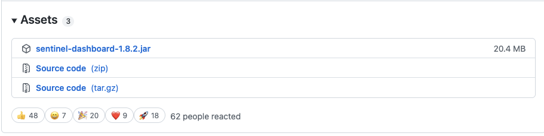

# 18 | Sentinel 实战：如何实施流量整形与限流策略？
你好，我是姚秋辰。

今天我们来学习Sentinel组件最为核心的功能：流量整形（也可以叫流控）。

在这节课，我会通过项目实战将优惠券系统集成到Sentinel中，对用户领券和查找优惠券两个场景添加流控规则。在这个过程中，我会带你了解Sentinel的三种流控模式，以及对应的流控效果。此外，我还会针对Sentinel框架做一个小扩展，对特定的调用来源做流控。掌握了这些内容之后，你就可以清楚如何用流控手段来降低高并发场景下的系统压力。

在进行实战项目之前，我需要带你搭建Sentinel控制台。你可以把它看作一个中心化的控制中心，所有的应用程序都会接入这个控制台，我们可以在这里设置各种流控规则，这些规则也会在应用程序中实时生效。

## 运行Sentinel控制台

我们可以从 [Sentinel官方GitHub](https://github.com/alibaba/Sentinel/releases) 的Release页面下载可供本地执行的jar文件，为了避免版本不一致导致的兼容性问题，我推荐你下载1.8.2.Release版本。在该版本下的Assets部分，你可以直接下载sentinel-dashboard-1.8.2.jar这个文件。



下载好文件之后，你可以使用命令行进入到这个jar包所在的目录，然后就可以直接执行下面这行命令启动Sentinel控制台了。

```plain
java -Dserver.port=8080 -Dcsp.sentinel.dashboard.server=localhost:8080 -Dproject.name=sentinel-dashboard -jar sentinel-dashboard-1.8.2.jar

```

这行命令以8080为端口启动了Sentinel控制台，启动成功后你可以在浏览器直接访问localhost:8080地址。

当你看到登录界面，你就可以使用默认账号进行登录了，登录名和密码都是sentinel。登陆成功之后你就可以进入到Sentinel控制台主页面，在左侧的导航栏会列出当前已经接入Sentinel的所有应用，这里默认展示的sentinal-dashboard应用其实就是控制台程序本尊了。


到这里，我们的Sentinel控制台就已经搭建完成了，是不是非常简单呢？接下来，我带你将实战项目集成到Sentinel控制台中。

## 将微服务接入到Sentinel控制台

为了演示Sentinel的多种流控效果，我们需要将两个具有前后调用关系的模块集成到Sentinel控制台，我这里选择的是模板微服务和用户微服务。

首先，你需要把Sentinel的依赖项引入到项目里。你只用将spring-cloud-starter-alibaba-sentinel组件分别加入到template和customer这两个服务的pom文件中就好了。

```plain
<dependency>
    <groupId>com.alibaba.cloud</groupId>
    <artifactId>spring-cloud-starter-alibaba-sentinel</artifactId>
</dependency>

```

然后，你需要做一些基本的配置，将应用直连到Sentinel控制台。这一步也非常简单，你只需要在项目的application.yml文件中加入下面的sentinel属性就可以了，具体代码在这里：

```plain
spring:
  cloud:
    sentinel:
      transport:
        # sentinel api端口，默认8719
        port: 8719
        # dashboard地址
        dashboard: localhost:8080

```

在上面的代码中，port属性是Sentinal API的默认端口，默认值是8719；而dashboard属性则是指向了Sentinel控制台的地址，这里我们填写的是localhost:8080。

最后，你还需要在代码中使用Sentinel注解对资源进行标记。在上一课里我讲到过，在Sentinel的世界中，一切都是以“资源”的方式存在的。Controller类里面写的API也是资源，这个资源便是Sentinel要守护的对象。

Sentinel会为Controller中的API生成一个默认的资源名称，这个名称就是URL的路径，如/template/getTemplateInBatch。当然了，你也可以使用特定的注解为资源打上一个你自己指定的名称标记，以CouponTemplateController为例，你可以参考这段代码：

```java
@GetMapping("/getTemplate")
@SentinelResource(value = "getTemplate")
public CouponTemplateInfo getTemplate(@RequestParam("id") Long id){
}

@GetMapping("/getBatch")
@SentinelResource(value = "getTemplateInBatch", blockHandler = "getTemplateInBatch_block")
public Map<Long, CouponTemplateInfo> getTemplateInBatch(
        @RequestParam("ids") Collection<Long> ids) {
}
public Map<Long, CouponTemplateInfo> getTemplateInBatch_block(
        Collection<Long> ids, BlockException exception) {
    log.info("接口被限流");
    return Maps.newHashMap();
}

```

在上面的代码中，我使用SentinelResource注解对模板服务的getTemplate方法和getTemplateInBatch方法做了标记，将它们的资源名称设置为方法名。除此之外，在getTemplateInBatch方法中，我还使用了注解中的blockHandler属性为当前资源指定了限流后的降级方法，如果当前服务抛出了BlockException，那么就会转而执行这段限流方法。

你同样可以使用SentinelResource注解，为CouponCustoemrController类中的用户领券和查找优惠券的接口做资源标记。你可以参考下面的代码。

```java
@PostMapping("findCoupon")
@SentinelResource(value = "customer-findCoupon")
public List<CouponInfo> findCoupon(@Valid @RequestBody SearchCoupon request) {
}

@PostMapping("requestCoupon")
@SentinelResource(value = "requestCoupon")
public Coupon requestCoupon(@Valid @RequestBody RequestCoupon request) {
}

```

到这里，我们就成功地把微服务接入到了Sentinel控制台。那么接下来，我们就可以把Template服务和Customer服务都启动起来，到Sentinel控制台去设置流控规则了。

## 设置流控规则

登录Sentinel控制台之后，你在左侧的导航栏是看不到我们刚注册的微服务的。这时你只要对Template和Customer服务发起几个调用，触发服务信息的上报，再等上个几秒钟，你就可以在Sentinel里看到自己的微服务啦。

Sentinel支持三种不同的流控模式，分别是直接流控、关联流控和链路流控。

- 直接流控：直接作用于当前资源，如果访问压力大于某个阈值，后续请求将被直接拦下来；
- 关联流控：当关联资源的访问量达到某个阈值时，对当前资源进行限流；
- 链路流控：当指定链路上的访问量大于某个阈值时，对当前资源进行限流，这里的“指定链路”是细化到API级别的限流维度。

接下来，我就带你了解这三种流控方式各自的使用场景，并带你上手为微服务添加流控规则。

### 直接流控

我们平时最常用的就是“直接流控”，所以我要带你去控制台操作一把，为Template服务添加一个直接流控规则。

打开Sentinel控制台，在左侧导航栏你会看到所有已经接入Sentinel的应用名称，如果没找到Coupon应用，你只需要在本地Postman发起一个API调用，触发一次信息上报，再等待十几秒后刷新页面，就可以看到自己的应用啦。

我录了一段设置“直接流控”的截屏，你可以参考一下。

在这段视频中，我为Template服务的getTemplateInBatch接口指定了一个直接限流规则，这里的资源名就是我在SentinelResource注解中指定的名称。我设置了以QPS为限定条件，如果单机QPS阈值大于1（QPS=1就是每秒一次请求），就触发限流。当然了，你也可以在页面中将阈值类型改为“并发连接数”。

设置完限流限定条件之后，你就可以尝试在本地直接调用这个接口了。不管你是通过Template服务直接调用，还是通过Customer服务的findCoupon接口间接调用，只要超过了每秒1次的频率，请求就会被Sentinel阻断。这样一来，我们就在Template服务中实现了优惠券模板查找的限流规则。

### 关联流控

如果两个资源之间有竞争关系，比如说，它们 **共享同一个数据库连接池**，这时候你就可以使用“关联流控”对低优先级的资源进行流控，让高优先级的资源获得竞争优势。

我们假设Template服务中的getTemplateInBatch接口和getTemplate接口之间就存在了竞争关系，而且前者的优先级低于后者，在这种情况下，我们应该尽可能地对低优先级的接口实施限流规则。

这里我将“关联流控”应用到了低优先级的getTemplateInBatch接口上。配置细节在下面的图里，你可以参考一下。


在流控规则设置页面里，我在“关联资源”一栏填了getTemplate，写在这里的是高优先级资源的名称。同时，我设置了阈值判断条件为QPS=1，它的意思是，如果高优先级资源的访问频率达到了每秒一次，那么低优先级资源就会被限流。

所以，这里需要你注意的一点是， **关联限流的阈值判断是作用于高优先级资源之上的，但是流控效果是作用于低优先级资源之上**。

### 链路流控

如果在一个应用中， **对同一个资源有多条不同的访问链路**，那么我们就可以应用“链路流控”，实现API级别的精细粒度限流。我画了一张图帮你理解链路流控的作用点。


在上面的图里，一个服务应用中有/api/edit和/api/add两个接口，这两个接口都调用了同一个资源resource-1。如果我想只对/api/edit接口流进行限流，那么就可以将“链路流控”应用在resource-1之上，同时指定当前流控规则的“入口资源”是/api/edit。

现在，你已经了解了Sentinel的三种流控模式。接下来，我们再来看一看如何针对调用源进行限流。这里需要我们对Sentinel源代码做一些改造。

### 实现针对调用源的限流

在微服务架构中，一个服务可能被多个服务调用。比如说，Customer服务会调用Template服务的getTemplateInBatch资源，未来我们可能会研发一个新的服务叫coupon-other-serv，它也会调用相同资源。

如果我想为getTemplateInBatch资源设置一个限流规则，并指定其只对来自Customer服务的调用起作用，应该怎么实现呢？


这个实现过程分为两步。第一步，你要想办法在服务请求中加上一个特殊标记，告诉Template服务是谁调用了你；第二步，你需要在Sentinel控制台设置流控规则的针对来源。

我们先从第一步开始做起。

首先，你需要对Customer服务的OpenFeign组件做一点手脚，将调用源的应用名加入到由OpenFeign组件构造的Request中。我们可以借助OpenFeign的RequestInterceptor扩展接口，编写一个自定义的拦截器，在服务请求发送出去之前，往Request的Header里写入一个特殊变量，你可以参考我这段代码。

```java
@Configuration
public class OpenfeignSentinelInterceptor implements RequestInterceptor {

    @Override
    public void apply(RequestTemplate template) {
        template.header("SentinelSource", "coupon-customer-serv");
    }
}

```

在上面的代码中，我在Customer服务中新建了一个OpenfeignSentinelInterceptor的类，继承自RequestInterceptor并实现了其中的apply方法。在这个方法里，我向服务请求的header里加入了一个SentinelSource属性，对应的值是当前服务的名称coupon-customer-serv。这就是我要传递给下游服务的“来源标记”。

接下来，你需要在Template服务中识别来自上游的标记，并将其加入到Sentinel的链路统计中。我们可以借助Sentinel提供的RequestOriginParser扩展接口，编写一个自定义的解析器。你可以参考我这里的代码实现。

```java
@Component
@Slf4j
public class SentinelOriginParser implements RequestOriginParser {

    @Override
    public String parseOrigin(HttpServletRequest request) {
        log.info("request {}, header={}", request.getParameterMap(), request.getHeaderNames());
        return request.getHeader("SentinelSource");
    }
}

```

在上面的代码中，我在Template服务中新建了一个SentinelOriginParser的类，它实现了RequestOriginParser接口中的parseOrigin方法。在方法中，我们从服务请求的Header中获取SentinelSource变量的值，作为调用源的name。

到这里第一步“来源标记传递”就完成了，接下来你还需要在Sentinel控制台设置流控规则的针对来源。

在流控规则的编辑页面，你可以在“针对来源”这一栏填上coupon-customer-serv并保存，这样一来，当前限流规则就只会针对来自Customer服务的请求生效了。


现在，相信你对Sentinel的流控模式都已经比较了解了，接下来我们再去学习一下Sentinel所支持的流控效果吧。

## Sentinel的流控效果

Sentinel总共支持三种流控效果，分别是 **快速失败**、 **Warm Up** 和 **排队等待**。

先来说说 **快速失败**，Sentinel默认的流控效果就是快速失败，前面做的实战改造都是采用了这种模式。这种流控效果非常好理解，在快速失败模式下，超过阈值设定的请求将会被立即阻拦住。

第二种流控效果 **Warm Up** 则实现了“预热模式的流控效果”，这种方式可以平缓拉高系统水位，避免突发流量对当前处于低水位的系统的可用性造成破坏。

举个例子，如果我们设置的系统阈值是QPS=10，预热时间=5，那么Sentinel会在这5秒的预热时间内，将限流阈值从3缓慢拉高到10。为什么起始阈值是3呢？因为Sentinel内部有一个冷加载因子，它的值是3，在预热模式下，起始阈值的计算公式是单机阈值/冷加载因子，也就是10/3=3。

我截了一张图，你可以参考一下，看看Warm Up配置项是如何填写的。


话说回来，为什么我们要使用预热模型呢？我来举一个例子帮你理解好了。

我开发了一个接口用来查询商品详情信息，它采用了通用的缓存+DB读写的逻辑，即一次请求过来之后，先查询缓存，如果缓存未命中那么再查询DB，同时把查到的数据写入缓存并设置一个缓存过期时间。

假如这个接口长期处于低水位状态，那么大部分缓存数据已经过期了，如果这时候发生了突发流量，比如双11的0点抢购开始了，由于缓存还未充分构建起来，突发流量就会对数据库形成一个峰值压力，很有可能就把DB层打穿。如果我们可以设置一个预热模型，给系统一段时间的缓冲，在缓慢拉高应用水位的过程中，缓存也逐渐地构建了起来。这样就大大降低了峰值流量对系统的冲击。

了解了Warm Up之后，我们再来看一下最后一个流控效果，那就是排队等待。

顾名思义，在 **排队等待** 模式下，超过阈值的请求不会立即失败，而是会被放入一个队列中，排好队等待被处理。当然了，每个请求的排队时间可不是永恒的，一旦请求在队列中等待的时间超过了我们设置的超时时间，那么请求就会被从队列中移除。

我截图了一张图，你可以参考一下图中是如何设置排队等待参数的。


到这里，相信你已经对Sentinel的各种流控效果有了比较全面的了解。现在，我们来回顾一下这节课的重点内容。

## 总结

今天我带你了解了Sentinel的三大流控模式，分别是直连流控、关联流控和链路流控。我们还了解了三种流控效果，分别是快速失败、预热和排队等待。如果你想要将流控规则应用到特定来源的服务，一定要记得 **在本地服务中做一些小改造，让Sentinel识别调用源**，否则针对来源的限流方式是不会生效的。

从流控的角度来讲，Sentinel还实现了基于热点规则的限流。热点限流也是互联网场景下的重要稳定性保障手段，比如电商业务的爆款商品、微博系统的明星出轨消息等等，这些都是发生热点数据宕机的常客。我建议你去通过网上的资料了解一下什么是热点数据，然后自己把玩一下Sentinel控制台的“热点规则”页面，尝试配置一个简单的热点规则到实战项目中。

在后面的课程中，我将带你了解Sentinel的另一个最常用的稳定性保障手段：降级熔断规则。

## 思考题

通过这节课的内容，你能深入说说流控效果的底层实现吗？最好能够从 **算法** 的角度来描述一下Sentinel是如何判断一个请求可否被放行的。

好啦，这节课就结束啦。欢迎你把这节课分享给更多对Spring Cloud感兴趣的朋友。我是姚秋辰，我们下节课再见！