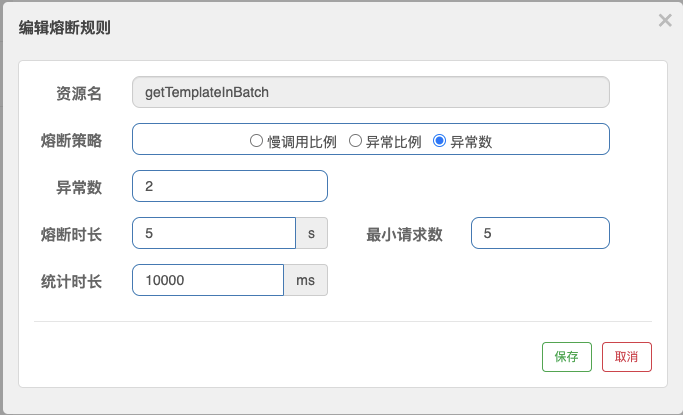
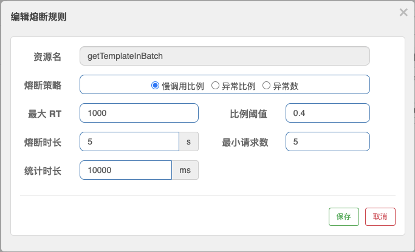

# 19 | Sentinel 实战：如何为项目添加异常降级方案？
你好，我是姚秋辰。

上节课我们学习了如何将应用接入Sentinel实现不同的流控效果，今天我们来学习Sentinel组件另一个重要功能：降级熔断。通过这节课，你可以知道如何通过Sentinel的熔断策略处理各种调用异常。除此之外，我还会讲解Sentinel熔断器开关的状态变化过程。

在 [第17课](https://time.geekbang.org/column/article/479785) 中我们学习过降级和熔断的作用，今天我们就先从降级开始，了解一下如何利用Sentinel的注解指定降级方法。

这里我将以Template服务的模板批量查询接口为例，向你演示如何设置降级方法。为什么我会选择这个接口？因为券模板查询是一个基础服务，很多上游的业务场景都依赖这个接口获取模板信息，所以它的访问压力相比于其它接口就大得多了，也更容易发生各种服务超时之类的异常情况。

如果你已经准备好了，我们就从编写降级逻辑开始吧。

## 编写降级逻辑

上一节课中，我们在Template服务的批量领劵接口之上添加了一个SentinelResource注解，并在其中使用blockHandler属性指定了降级方法的名称。不过呢，这个注解可不是一个万金油注解，它只能在服务抛出BlockException的情况下执行降级逻辑。

什么是BlockException呢？这个异常类是Sentinel组件自带的类，当一个请求被Sentinel规则拦截，这个异常便会被抛出。比如请求被Sentinel流控策略阻拦住，或者请求被熔断策略阻断了，这些情况下你可以使用SentinelResource的blockHandler注解来指定降级逻辑。但是对于其它RuntimeException的异常类型它就无能为力了。

我们如何指定一段通用的降级逻辑，来应对BlockException以外的RuntimeException呢？你可以使用SentinelResource中的另一个属性： **fallback**。

以Template服务的批量查询接口为例，我通过fallback属性指定了一段降级逻辑，用来处理各种运行期异常的情况。你可以参考下面这段代码。

```java
@GetMapping("/getBatch")
@SentinelResource(value = "getTemplateInBatch",
        fallback = "getTemplateInBatch_fallback",
        blockHandler = "getTemplateInBatch_block")
public Map<Long, CouponTemplateInfo> getTemplateInBatch(
        @RequestParam("ids") Collection<Long> ids) {
    // 如果接口被熔断，那么下面这行log不会被打印出来
    log.info("getTemplateInBatch: {}", JSON.toJSONString(ids));
}

// 接口被降级时的方法
public Map<Long, CouponTemplateInfo> getTemplateInBatch_fallback(
        Collection<Long> ids) {
    log.info("接口被降级");
    return Maps.newHashMap();
}

```

在这段代码中，我通过fallback属性指定了当前资源的降级方法是getTemplatInBatch\_fallback。

这里你需要注意，如果降级方法的方法签名是BlockException，那么fallback是无法正常工作的。这点和blockHandler属性的用法是不一样的。我在注解中同时使用了fallback和blockHandler属性，如果服务抛出BlockException，则执行blockHandler属性指定的方法，其他异常就由fallback属性所对应的降级方法接管。

如果你不想把降级方法定义在当前Class中，而是想新建一个Class来统一管理这些降级逻辑，那么你可以通过SentinelResource注解的fallbackClass属性指定一个保存降级逻辑的Class。

在大多数的实际场景下，我们在降级方法中执行的是静默逻辑，即 **尽可能返回一个可被服务处理的默认值**。举个例子，对于商品详情页的营销优惠计算服务来说，如果发生了服务异常导致的降级，我们可以在服务中返回商品原价，并通过一个特殊标记或属性告诉前端优惠计算发生错误，让前端页面可以根据这个异常标记显示特定提示信息。

定义好降级逻辑，接下来我们就可以去Sentinel控制台设置熔断策略了。

## 在控制台添加熔断策略

你可以将Sentinel控制台和本地微服务模块一同启动。然后，登录Sentinel控制台并展开coupon-template-serv模块的导航栏，并在“熔断规则”面板中新建一个规则。

你会看到，Sentinel的熔断规则有3种，分别是异常比例、异常数和慢调用比例。我们可以分别看看它们是如何使用的。

首先，你可以指定以“ **异常比例**”为熔断开关的判断逻辑。在10秒的统计窗口内，如果异常调用的比例超过了60%，并且满足请求数量>=5，就开启一段为期5秒的熔断时间。

我录了一段video，你可以参考一下具体的设置规则。

在设置过程中，你一定要注意界面上显示的时间单位。 **“熔断时长”的时间单位是秒，而“统计窗口”的时间单位是毫秒**，这两者很容易弄混。

接下来，你可以故意在代码中选择性地抛出一个RuntimeException，比如当Template服务批量查询服务的ID数量为3时抛出异常，这样你就可以验证熔断器的效果了。

我画了一张流程图，可以帮助你理解Sentinel的熔断规则的统计方式，我们一起来看一下。


从图中你可以看出，Sentinel底层通过一段跨度为10秒的滑动窗口来统计服务调用情况。在这段窗口时间内，前三个服务请求全部失败，这时失败率已经达到100%，大大超过了我们定义的60%的阈值，但是熔断开关却没有打开，这是因为统计窗口的最小请求数还没有达到设定值5。

之后又有两个请求被处理，一个成功一个失败，这时请求个数已经达到了5，失败率是80%，那么Sentinel就开启了一段5秒的熔断时间。在这段时间内，所有来访请求都不会得到真实的执行，而是转而执行降级逻辑。

为了验证在熔断期间只有降级逻辑会被执行，你可以在getTemplateInBatch方法的第一行打印一条日志信息，我们预期的结果是，在熔断期间这行日志不会被打印到控制台。

你已经了解了如何基于异常比例添加熔断规则，接下来我们就趁热打铁，去看看如何根据“异常数”和“慢调用比例”来设置熔断规则。

“ **异常数**”熔断规则和前面我们设置的异常比例熔断规则几乎一样，唯一的区别就是“异常数”的判定条件是统计窗口内发生异常的个数，而不是去统计异常请求的比例。在下面这张图里，我设置了一个基于异常数判定的规则，即getTemplateInBatch请求在10秒内异常数>2，则触发5秒的熔断窗口。



在这里我想提醒你注意， **熔断器开启的判定条件是异常数>2**，注意这里是 **大于** 2而不是大于等于2。也就是说，即便在窗口期内你调用了5次接口，其中有2个接口发生了异常，那么你也要等下一次失败调用发生之后，才能满足异常数大于2的判定条件，触发熔断。

现在，你也了解了“异常数”熔断规则。那么接下来，我们就举一反三去了解如何设置基于慢调用比例的熔断规则。通常来说，慢调用请求所占比例逐渐增多，这是服务雪崩的前兆。为了将影响范围缩小，我们要做的就是 **尽早捕捉到慢调用请求的比例变化趋势，及时通过熔断规则对服务进行减压**。

在下面的图中，我设定了一条慢调用判定条件。在10秒的统计窗口内，如果响应时间大于1000ms的请求所占总请求数量的比例超过了0.4，并且请求总数量>=5，此时将触发Sentinel的熔断开关，开启5秒的熔断窗口。



需要注意的是，当服务请求超过设置的最大响应时间，Sentinel只是会将该次请求作为一次慢响应加入到统计数据里，并不会将这个请求直接阻塞掉。因此， **这里的最大RT只是一个用来做统计的条件参数，而不是超时判定的参数**。

在真实业务中，“慢调用”是一个关键侦测指标，拿阿里系的应用监控为例，业务层有RT监控，DB层也有慢SQL监控，目的就是将可能的服务雪崩扼杀于摇篮之中。因为当服务响应逐渐变慢的时候，说明集群所承接的业务流量也在同步增加，当RT越来越大直到达到一个阈值的时候，集群的吞吐量必然会迎来一个拐点。这个拐点也是全链路压测时要获取的一个关键指标，它是集群吞吐量的极限。

到这里，相信你已经对Sentinel的熔断策略有了全面的了解。但是，你知道Sentinel是如何判定熔断开关的开启和关闭吗？也许你会以为只要熔断时间结束，Sentinel就会立即回到正常状态。你只答对了一半，在熔断开关的开启和关闭之间，其实还有一个半开状态。接下来我就带你去了解Sentinel的熔断状态转换规则。

## Sentinel熔断开关的状态转换

Sentinel的熔断器会在开启、关闭和半开这三种逻辑状态之间来回切换，为了方便你理解整个过程，我画了一张图来解释熔断器的状态变化，你可以参考一下。


从图中你可以看出，在第一个统计窗口内熔断器是处于关闭状态的，达到熔断判定条件之后，Sentinel开启了一段熔断窗口。在这段窗口时间内，熔断器是处于开启状态的，这时新的服务请求会执行降级逻辑。待熔断窗口结束，Sentinel会将熔断器状态置为“半开”状态，这是一个介于完全开启和完全关闭之间的中间态。

在半开状态下，如果有一个新请求过来，那么Sentinel会试探性地让这个请求去执行正常的业务逻辑，如果执行成功，那么Sentinel将关闭熔断器并退出熔断状态，如果执行失败，那么Sentinel将再次开启一个新的熔断窗口。

从这里我们可以得出一个信息，当熔断器处于“半开”状态时，只要下一个请求失败，就立即打回熔断状态，并不需要再次满足熔断规则中设置的各种条件。

到这里，相信你已经对Sentinel的熔断机制都有了比较全面的认识。现在，我们就来回顾一下这节课的重点内容吧。

## 总结

今天我带你了解了Sentinel的三种熔断策略，分别是慢调用比例、异常比例、异常数，你还知道了这三种策略背后的熔断状态流转过程。借助Sentinel的三种熔断策略，我们可以对各种潜在的异常调用进行防范，并及时对异常链路做熔断处理，降低服务的访问压力。

在实际的业务场景中， **慢调用比例** 和 **异常比例** 是两个比较常用的熔断策略。因为无论当前服务处于低水位还是高水位，百分比数据都能够从统一口径反映出服务稳定性情况。

但是对于异常数来说，在低水位和高水位下就会产生一些统计偏差，比如我设置异常数>5触发熔断，在QPS=20的情况下，这个判定条件看起来没什么问题，但当QPS=200的情况下，只要有2.5%的请求失败就会进入熔断状态，这显然并不合理。

因此，我个人比较推荐你在项目中使用慢调用和异常比例策略作为容错规则，这样不管集群当前水位高还是低，都能获得一个相对准确的判定标准。

不知你是否注意到了，我们之前添加的限流规则和熔断规则都是临时数据，并没有持久化到某个存储介质中，所以每次重启控制台和应用的时候，这些规则都会消失不见，你还得去重新设置一遍，这显然是很不方便的。所以下一节课，我要带你解决这个问题，看看我们如何借助Nacos实现限流规则的持久化。

## 思考题

通过这节课的内容，你能结合Sentinel的源代码，去深入了解熔断策略的底层实现吗？我还是先把藤交到你手上，你可以先尝试找到哪个Slot类处理了熔断降级判定，再进一步了解每个不同的熔断策略对应了源码中的哪个类。如果你顺藤摸瓜往下探索，就能了解整个流程的全貌了。

好啦，这节课就结束啦。欢迎你把这节课分享给更多对Spring Cloud感兴趣的朋友。我是姚秋辰，我们下节课再见！