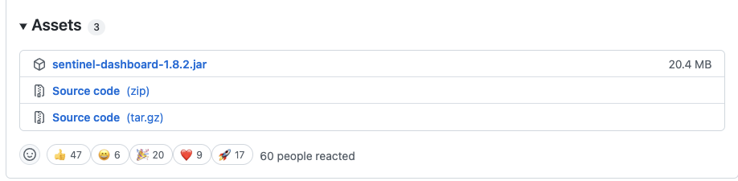
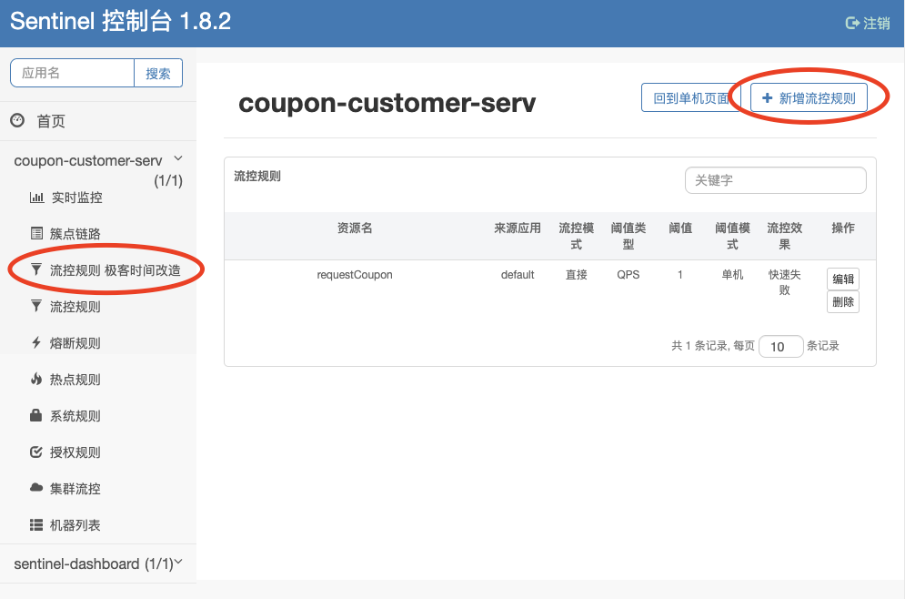
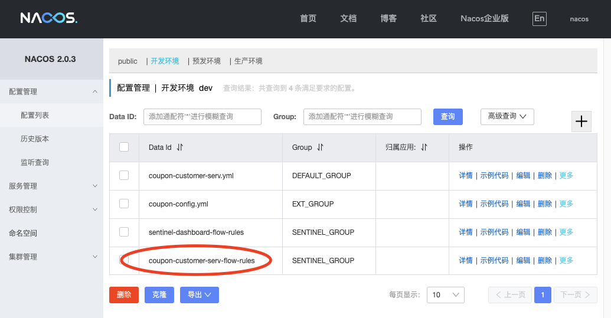

# 20 | Sentinel 实战：如何接入 Nacos 实现规则持久化？
你好，我是姚秋辰。

在前两节课里，我们已经知道了如何配置Sentinel的降级规则和流量整形规则。不过这套方案还有一个不完美的地方。因为我们配置的这些容错规则并没有被“保存”到某个存储介质中，所以，如果你重新启动Sentinel服务器或者重启应用程序，先前配置的所有规则就都消失不见了。那如何才能解决这个问题呢？

这节课，我将带你对Sentinel的源码做一下二次开发，我们将通过集成Nacos Config来实现一套持久化方案，把Sentinel中设置的限流规则保存到Nacos配置中心。这样一来，当应用服务或Sentinel Dashboard重新启动时，它们就可以自动把Nacos中的限流规则同步到本地，不管怎么重启服务都不会导致规则失效了。

在前两节课的实战环节，我们采取了一种“直连”的方式，将应用程序和Sentinel做了直接集成。在我们引入Nacos Config之后，现有的集成方式会发生些许的变化，我画了一幅图来帮你从架构层面理解新的对接方式。


从上面的图中，你会发现，Sentinel控制台将限流规则同步到了Nacos Config服务器来实现持久化。同时，在应用程序中，我们配置了一个Sentinel Datasource，从Nacos Config服务器获取具体配置信息。

在应用启动阶段，程序会主动从Sentinel Datasource获取限流规则配置。而在运行期，我们也可以在Sentinel控制台动态修改限流规则，应用程序会实时监听配置中心的数据变化，进而获取变更后的数据。

为了将Sentinel与Nacos Config集成，我们需要做两部分改造。

- Sentinel组件二次开发：将限流规则同步到Nacos Config服务器。
- 微服务改造：从Nacos Config获取限流规则。


  接下来我们就开始第一步改造：对Sentinel组件进行二次开发吧。

## Sentinel组件二次开发

在开始二次开发之前，我们需要将Sentinel的代码下载到本地。你可以从 [GitHub的Releases页面](https://github.com/alibaba/Sentinel/releases) 中找到1.8.2版本，在该版本下的Assets面板中下载Source code源文件。



我们把源码下载到本地并解压之后，你就可以将项目导入到开发工具中了。Sentinel项目下有很多子模块，我们这次主要针对其中的sentinel-dashboard子模块做二次开发。整个改造过程按照先后顺序将分为三个步骤：

1. 修改Nacos依赖项的应用范围，将其打入jar包中；
2. 后端程序对接Nacos，将Sentinel限流规则同步到Nacos；
3. 开放单独的前端限流规则配置页面。


   接下来我就带你按照上面的步骤来对Sentinel源码做改造。

### 修改Nacos依赖项

首先，你需要打开sentinel-dashboard项目的pom.xml文件，找到其中的依赖项sentinel-datasource-nacos，它是连接Nacos Config所依赖的必要组件。

但这里有一个问题。在Sentinel的源码中，sentinel-datasource-nacos的scope是test，意思是依赖项只在项目编译期的test阶段才会生效。

所以接下来，你需要将这个依赖项的标签注释掉。

```plain
<dependency>
    <groupId>com.alibaba.csp</groupId>
    <artifactId>sentinel-datasource-nacos</artifactId>
    <!-- 将scope注释掉，改为编译期打包 -->
    <!--<scope>test</scope>-->
</dependency>

```

我们将test这一行代码注释掉以后，sentinel-datasource-nacos就将作为编译期的依赖项，被打包到最终的sentinel-dashboard.jar执行文件中。

依赖项就这么轻松地修改完毕了，接下来我们就可以在后端程序中实现Nacos Config的对接了。

### 后端程序对接Nacos

首先，你需要打开sentinel-dashboard项目下的src/test/java目录（注意是test目录而不是main目录），然后定位到com.alibaba.csp.sentinel.dashboard.rule.nacos包。在这个包下面，你会看到4个和Nacos Config有关的类，它们的功能描述如下。

- NacosConfig：初始化Nacos Config的连接；
- NacosConfigUtil：约定了Nacos配置文件所属的Group和文件命名后缀等常量字段；
- FlowRuleNacosProvider：从Nacos Config上获取限流规则；
- FlowRuleNacosPublisher：将限流规则发布到Nacos Config。

  **为了让这些类在Sentinel运行期可以发挥作用，你需要在src/main/java下创建同样的包路径，然后将这四个文件从test路径拷贝到main路径下**。我在这节课的改造过程都将围绕main路径下的类展开。

接下来，我们要做两件事，一是在NacosConfig类中配置Nacos连接串，二是在Controller层接入Nacos做限流规则持久化。

我们先从Nacos连接串改起。你需要打开NacosConfig类，找到其中的nacosConfigService方法。这个方法创建了一个ConfigService类，它是Nacos Config定义的通用接口，提供了Nacos配置项的读取和更新功能。FlowRuleNacosProvider和FlowRuleNacosPublisher这两个类都是基于这个ConfigService类实现Nacos数据同步的。我们来看一下改造后的代码。

```java
@Bean
public ConfigService nacosConfigService() throws Exception {
    // 将Nacos的注册地址引入进来
    Properties properties = new Properties();
    properties.setProperty("serverAddr", "localhost:8848");
    properties.setProperty("namespace", "dev");

    return ConfigFactory.createConfigService(properties);
}

```

在上面的代码中，我通过自定义的Properties属性构造了一个ConfigService对象，将ConfigService背后的Nacos数据源地址指向了localhost:8848，并指定了命名空间为dev。这里我采用了硬编码的方式，你也可以对上面的实现过程做进一步改造，通过配置文件来注入serverAddr和namespace等属性。

这样，我们就完成了第一件事：在NacosConfig类中配置了Nacos连接串。别忘了还有第二件事，你需要在Controller层接入Nacos来实现限流规则持久化。

接下来，我们就在FlowControllerV2中正式接入Nacos吧。FlowControllerV2对外暴露了REST API，用来创建和修改限流规则。在这个类的源代码中，你需要修改两个变量的Qualifier注解值。你可以参考下面的代码。

```java
@Autowired
// 指向刚才我们从test包中迁移过来的FlowRuleNacosProvider类
@Qualifier("flowRuleNacosProvider")
private DynamicRuleProvider<List<FlowRuleEntity>> ruleProvider;

@Autowired
// 指向刚才我们从test包中迁移过来的FlowRuleNacosPublisher类
@Qualifier("flowRuleNacosPublisher")
private DynamicRulePublisher<List<FlowRuleEntity>> rulePublisher;

```

在代码中，我通过Qualifier标签将FlowRuleNacosProvider注入到了ruleProvier变量中，又采用同样的方式将FlowRuleNacosPublisher注入到了rulePublisher变量中。FlowRuleNacosProvider和FlowRuleNacosPublisher就是上一步我们刚从test目录Copy到main目录下的两个类。

修改完成之后，FlowControllerV2底层的限流规则改动就会被同步到Nacos服务器了。这个同步工作是由FlowRuleNacosPublisher执行的，它会发送一个POST请求到Nacos服务器来修改配置项。我来带你看一下FlowRuleNacosPublisher类的源码。

```java
@Component("flowRuleNacosPublisher")
public class FlowRuleNacosPublisher implements DynamicRulePublisher<List<FlowRuleEntity>> {

    // 底层借助configService与Nacos进行通信
    @Autowired
    private ConfigService configService;
    @Autowired
    private Converter<List<FlowRuleEntity>, String> converter;

    @Override
    public void publish(String app, List<FlowRuleEntity> rules) throws Exception {
        AssertUtil.notEmpty(app, "app name cannot be empty");
        if (rules == null) {
            return;
        }
        // 发布到Nacos上的配置文件名是：
        // app + NacosConfigUtil.FLOW_DATA_ID_POSTFIX
        //
        // 所属的Nacos group是NacosConfigUtil.GROUP_ID的值
        configService.publishConfig(app + NacosConfigUtil.FLOW_DATA_ID_POSTFIX,
            NacosConfigUtil.GROUP_ID, converter.convert(rules));
    }
}

```

在上面的代码中，FlowRuleNacosPublisher会在Nacos Config上创建一个用来保存限流规则的配置文件，这个配置文件以“application.name”开头，以“-flow-rules”结尾，而且它所属的Group为“SENTINEL\_GROUP”。这里用到的文件命名规则和Group都是通过NacosConfigUtil类中的常量指定的，我把这段代码贴在了下面，你可以参考一下。

```plain
public final class NacosConfigUtil {

    // 这个是Sentinel注册的配置项所在的分组
    public static final String GROUP_ID = "SENTINEL_GROUP";

    // 流量整形规则的后缀
    public static final String FLOW_DATA_ID_POSTFIX = "-flow-rules";

```

到这里，我们就完成了对后端程序的改造，将Sentinel限流规则同步到了Nacos。接下来我们需要对前端页面稍加修改，开放一个独立的页面，用来维护那些被同步到Nacos上的限流规则。

### 前端页面改造

首先，我们打开sentinel-dashboard模块下的webapp目录，该目录存放了Sentinel控制台的前端页面资源。我们需要改造的文件是sidebar.html，这个html文件定义了控制台的左侧导航栏。

接下来，我们在导航列表中加入下面这段代码，增加一个导航选项，这个选项指向一个全新的限流页面。

```plain
<li ui-sref-active="active">
  <a ui-sref="dashboard.flow({app: entry.app})">
    <i class="glyphicon glyphicon-filter"></i>&nbsp;&nbsp;流控规则 极客时间改造</a>
</li>

```

如果你点击这个新加入的导航选项，就会定向到一个全新的限流页面，你在这个页面上做的所有修改，都会同步到Nacos Config。同时，当Sentinel Dashboard启动的时候，它也会主动从Nacos Config获取上一次配置的限流规则。

到这里，我们的Sentinel二次开发就完成了。接下来，我来带你对微服务模块做一番改造，将微服务程序接入Nacos Config，获取Sentinel限流规则。

## 微服务改造

微服务端的改造非常简单，我们不需要对代码做任何改动，只需要添加一个新的依赖项，并在配置文件中添加sentinel datasource连接信息就可以了。

在前面的课程中，我们已经将coupon-customer-impl接入了Sentinel控制台，所以这节课我们就继续基于customer服务来做改造吧。

首先，我们需要往coupon-customer-serv的pom文件中添加sentinel-datasource-nacos的依赖项，这个组件用来对接Sentinel和Nacos Config：

```plain
<dependency>
    <groupId>com.alibaba.csp</groupId>
    <artifactId>sentinel-datasource-nacos</artifactId>
</dependency>

```

然后，我们在application.yml配置文件中找到spring.cloud.sentinel节点，在这个节点下添加一段Nacos数据源的配置。

```plain
spring:
 cloud:
  sentinel:
    datasource:
      # 数据源的key，可以自由命名
      geekbang-flow:
        # 指定当前数据源是nacos
        nacos:
          # 设置Nacos的连接地址、命名空间和Group ID
          server-addr: localhost:8848
          namespace: dev
          groupId: SENTINEL_GROUP
          # 设置Nacos中配置文件的命名规则
          dataId: ${spring.application.name}-flow-rules
          # 必填的重要字段，指定当前规则类型是"限流"
          rule-type: flow

```

在上面的配置项中，有几个重要的点需要强调一下。

1. 我们在微服务端的sentinal数据源中配置的namespace和groupID，一定要和Sentinal Dashoboard二次改造中的中的配置相同，否则将无法正常同步限流规则。Sentinal Dashboard中namespace是在NacosConfig类中指定的，而groupID是在NacosConfigUtil类中指定的。
2. dataId的文件命名规则，需要和Sentinel二次改造中的FlowRuleNacosPublisher类保持一致，如果你修改了FlowRuleNacosPublisher中的命名规则，那么也要在每个微服务端做相应的变更。


   到这里，我们所有的改造工作就已经完成了，接下来我们就启动程序来验证改造效果吧。

## 验证限流规则同步效果

首先，你需要整体编译Sentinel源代码，编译完成之后从命令行进入到sentinel-dashboard子模块下的target目录，你会看到一个sentinel-dashboard.jar文件。你可以在命令行执行以下命令，以8080为端口启动Sentinel Dashboard应用：

```plain
java -Dserver.port=8080 -Dcsp.sentinel.dashboard.server=localhost:8080 -Dproject.name=sentinel-dashboard -jar sentinel-dashboard.jar

```

然后，你需要启动coupon-customer-serv服务，并通过postman工具发送一个服务请求，调用requestCoupon服务领取优惠券。

接下来，你可以登录Sentinel Dashboard服务。这时你会看到左侧的导航栏多了一个“流控规则 极客时间改造”的选项。你可以点击这个选项，并手动在当前页面右上方点击“新增流控规则”，为requestCoupon添加一条“QPS=1 快速失败”的流控规则。



最后，打开Nacos Config的配置列表页，你就可以看到一个coupon-customer-serv-flow-rules的配置文件被创建了出来，它的Group是“SENTINEL\_GROUP”。

这时，如果我们在Sentinel Dashboard改动这条限流规则，那么改动后的数据会同步到Nacos Config，微服务端将通过监听配置中心的数据变化来实时获取变更后数据。



到这里，我们的限流规则持久化改造就完成了。这里有三个容易踩坑的环节，需要你注意一下。

1. 如果Sentinel控制台的左侧导航栏没有显示coupon-customer-serv服务，你需要通过postman对coupon-customer-serv发起一次调用， **触发信息上报** 之后就能看到这个选项了；
2. 只有在“流控规则 极客时间改造”这个Tab下手动创建的限流规则会持久化到Nacos服务器，而在“流控规则”这个Tab下创建的规则并不会做持久化。
3. 如果Dashboard在启动环节报出“端口被占用”的错，你可以kill掉占用8080端口的进程，或者换一个端口启动Dashboard应用。

## 总结

现在，我们来回顾一下这节课的重点内容。今天我们对Sentinel源代码做了二次改造，将限流规则同步到了Nacos Config。在这个环节里，你需要特别注意“ **配置一致性**”，也就是说 **控制台中的Nacos连接配置一定要和微服务端保持一致**，这是最容易出错的环节。

我们今天的持久化改造主要围绕“限流规则”展开，如果你想继续深入学习Sentinel持久化方案，我建议你结合今天讲的源码二次改造过程，对熔断规则、热点规则等模块做进一步改造，实现多项规则的Nacos数据同步。这个任务相当考验你的源码阅读能力，以及对Sentinel的理解程度，你可以挑战一下。

## 思考题

结合我今天的源码改造过程，请你想一想，如果要改造“熔断规则”，你知道有哪些改动点吗？

好啦，这节课就结束啦。欢迎你把这节课分享给更多对Spring Cloud感兴趣的朋友。我是姚秋辰，我们下节课再见！