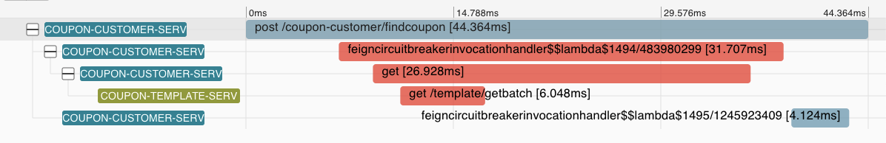

# 21 | Sleuth 体系架构：为什么微服务架构需要链路追踪？
你好，我是姚秋辰。

俗话说，人非圣贤孰能无过，你有过来我有过，微服务它也有过。所谓“过”，便是这线上环境所发生的Bug。

面对线上Bug怎么办？有则改之，无则加勉而已。Sentinel用自己的文治武功替我们搞定了后半句“无则加勉”。那么这前半句“有则改之”，我们该如何下手去改呢？

请你想一下，在开发小哥改正线上Bug之前，咱们是不是需要先找到Bug发生的原因呢？所以今天我们就来聊一聊“如何找Bug”这个话题，且看我是如何使用Sleuth提供的“调用链追踪”技术，按图索骥查明Bug真相的。

首先我来带你了解一下调用链追踪要解决的问题。

## 调用链追踪解决了什么问题

我们可以想象这样一个场景，你负责的是一个庞大的电商微服务架构系统，每个服务之间都有复杂的上下游调用关系，而且并发量还不小，每秒上万QPS不在话下。

在这个微服务系统中，用户通过浏览器的H5页面访问系统，这个用户请求会先抵达微服务网关组件，然后网关再把请求分发给各个微服务。所以你会发现，用户请求从发起到结束要经历很多个微服务的处理，这里面还涉及到消息组件的集成。

我画了一幅图来展示这个复杂的关系。

现在问题来了，突然有一天，有用户上报，说他在页面端看到了一个报错，每次点击下单都会报一个500错误。如果问题被交到了你手上，你该怎么排查呢？

作为开发人员我们知道500错误是Internal Server Error，这个异常可能发生在任何阶段，就算在同一时刻也可能有多条不同服务的Error日志。在一个没有链路追踪的微服务系统里，线上Bug排查无异于大海捞针，因为你根本无法梳理出一次请求的前后调用链。

因为缺少订单ID之类的唯一主键，你就很难缩小排查范围，只能耗费大量的时间用肉眼走查每一条日志。你需要找到用户所有下单记录的起始log，从前往后挨个摸排，从蛛丝马迹中梳理服务调用之间的关系并定位最终的问题，可见这种方式十分低效。

如果你想提高线上异常排查的效率，那么首先要做的一件事就是： **将一次调用请求中所有访问到的微服务日志前后串联起来**。这就像拔出萝卜带出泥一样，只要你找到了本次调用的任何一条日志，你就可以顺藤摸瓜将前后的关联日志信息全部找到。这就是“调用链追踪”技术要完成的工作了。

那么调用链追踪是如何实现日志信息串联的呢？简单来说，链路追踪技术会为每次服务调用生成一个全局唯一的ID（后面我们叫它Trace ID），从本次服务调用的起点到终点，这个过程中的所有日志信息都会被打上Trace ID的烙印。这样一来，根据日志中的Trace ID，我们就能很清晰地梳理出一次服务请求前后都经过了哪些微服务节点。

就像下面这张图一样，我们将调用链追踪应用到线上Bug排查的场景之后，一整条调用链（实线箭头）已是跃然纸上。我们只要找出当前用户下单请求的任意一条日志，就能根据这条日志中的Trace ID将整个调用链拎出来，到底是哪个服务调用环节的异常导致了用户下单失败，我们也就一目了然了。

到这里，相信你已经对调用链追踪所要解决的问题有了清晰的认识。那么接下来，我就带你了解一下Spring Cloud的链路追踪组件Sleuth是如何实现链路追踪的，也就是分析它的底层逻辑。

## Sleuth的底层逻辑

调用链追踪有两个任务，一是 **标记出一次调用请求中的所有日志**，二是 **梳理日志间的前后关系**。前面我提到了一个Trace ID，它是用来标记调用链的全局唯一ID。你一定可以联想到，Trace ID完成的是第一个任务：标记。不过呢，Trace ID并不能表达日志信息的前后关系，那么Sleuth是如何解决这个问题的呢？

Sleuth是通过打入到Log中的“卧底”来串联前后日志的。你集成了Sleuth组件之后，它会向你的日志中打入三个“特殊标记”，其中一个标记你应该已经清楚了，那便是Trace ID。剩下的两个标记分别是Span ID和Parent Span ID，这俩用来表示调用的前后顺序关系。

所谓Span，它是Sleuth下面的一个基本工作单元，当服务请求抵达当前单元时，Sleuth就会为这个单元分配一个独一无二的Span ID，并标记单元的开始时间和结束时间，这样就可以记录每个单元的处理用时了。

而Parent Span ID呢，顾名思义，它指向了当前单元的父级单元，也就是上游的调用者。一个环环相扣的调用链就通过Parent Span ID被串了起来。

为了让你更加形象地理解Trace ID、Span ID和Parent Span ID在调用链中的作用，我画了一个简化了服务调用的模拟流程图，带你梳理每一个调用步骤中的日志标记变化。

从上面的图中可以看出，这个服务请求调用了三个微服务，分别为服务A、服务B和服务C。

在一条调用链中，不管你调用了多少个微服务，Sleuth为本次调用生成的全局唯一Trace ID都会贯穿整个链路，所图中三个微服务所对应的日志Trace ID都是A1。

由于服务A是调用链的起点，所以它并没有父级单元，因此它的Parent Span ID为空，而起始单元的Span ID和Trace ID则是相同的，值都为A1。

对于服务B来说，它的父级调用单元是服务A，因此它的Parent Span ID指向了服务A的Span ID，即A1；同理，服务C的Parent Span ID指向了服务B的Span ID，即B2。

当然啦，上面的图示只是一个简化的流程，在实际的项目中，一次服务调用可不光只会生成一个Span。比如说服务A请求通过OpenFeign组件调用了服务B，那么服务A接收用户请求的过程就是一个单元，而OpenFeign组件发起远程调用的过程又是另一个单元。由此可见，单元的颗粒度其实是非常小的，在下节课我再通过实战让你近距离观察调用链中的单元分布。

通过这些Sleuth的特殊标记，我们就可以根据时间顺序，将一次服务请求经过的调用节点都梳理出来，这样你就能迅速发现报错信息发生在哪个阶段。这里我放了一张下节课的剧透图片，这是使用Zipkin生成的链路追踪的可视化信息。你可以看出，每个服务调用都以时间先后顺序规整好了，红色的部分就是发生线上Exception的服务。

除了Trace和Span之外，Sleuth还有一个特殊的数据结构，叫做Annotation，被用来记录一个具体的“事件”。我把Sleuth所支持的四种事件做成了一个表格，你可以参考一下。

在这里我举个例子，来帮你理解怎么使用这四种事件。

以服务A调用服务B的场景来说，服务A是一个Client，也就是发起调用的一方，而服务B是一个Server，也就是处理请求的一方。

如果你用服务B的ss减去sr，你就可以得到请求在服务B阶段的处理时间；如果用服务B的sr减去服务A的cs，就可以得到服务A到服务B之间的网络调用延迟时间；如果用服务A的cr减去cs，就可以得到当次请求从发起到结束所花费的总时间。

到这里，相信你已经对Sleuth的链路打标原理十分了解了，现在让我们来回顾一下这节课的重点内容吧。

## 总结

今天我带你了解了调用链追踪技术，以及它所能解决的问题。其中，我们重点了解了Sleuth是怎么通过特殊的“标记”来完成链路串联的。其中包括了三个重要的标记，它们分别是Trace ID、Span ID和Parent Span ID。Trace ID为每次调用链赋予了一个全局唯一的ID标识，后两个标记将调用链中的各个单元根据时间先后顺序做了串联。

Sleuth在调用链追踪的场景下主要完成了“ **打标**”的功能，如果你想要构建一套完整的线上异常排查流程，还是需要借助其它组件给Sleuth打打辅助。举个例子，如果你想要通过页面UI的方式，直观展示一个服务请求的完整调用链，那么你就需要一些分布式Tracing系统的帮助。再比如，如果你想要查询调用链中的具体日志信息，那么你还需要一套日志收集和分词系统，另外再加一个日志查询的UI系统。

我将在后面的两节课中，使用业界主流的Sleuth + Zikpin + ELK构建起这套完整的线上异常排查流程。

## 思考题

通过这节课的内容，我们知道了Sleuth的Trace ID在每个调用链中都是全局唯一的，这也就说明不管你本次调用链访问了多少个微服务，Sleuth必须想办法把这个Trace ID在调用链中依次传递下去，让每一个微服务都能读到这个Trace ID。基于这个情况，你能猜想一下，Sleuth是如何实现标签传递的吗？你可以大胆说出自己的设想，下节课我们就揭晓谜底。

好啦，这节课就结束啦。欢迎你把这节课分享给更多对Spring Cloud感兴趣的朋友。我是姚秋辰，我们下节课再见！