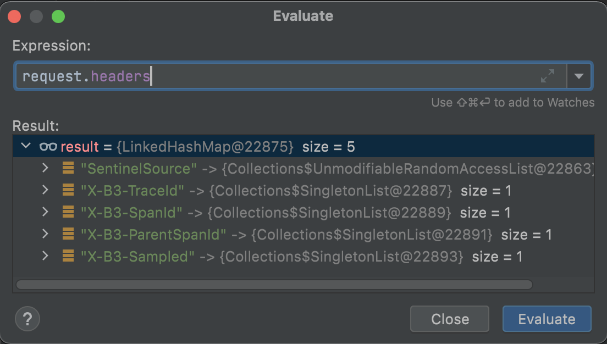
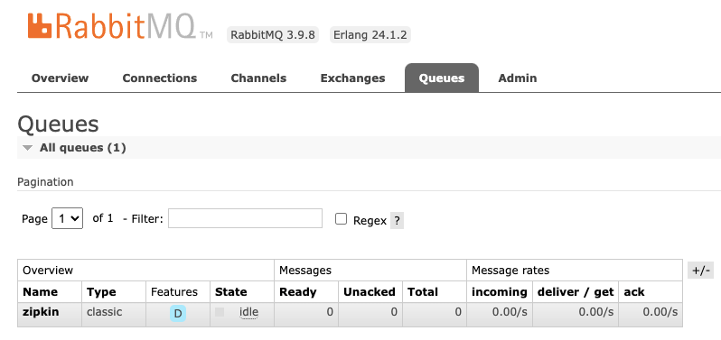
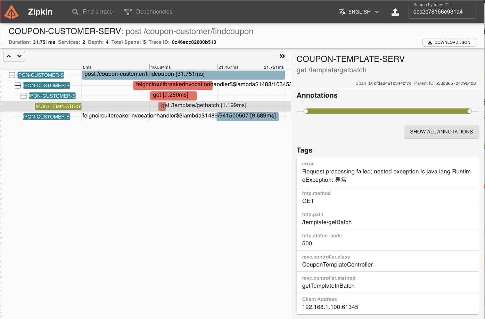

# 22 | 调用链追踪：集成 Sleuth 和 Zipkin，实现链路打标
你好，我是姚秋辰。

在上节课中，我们讲了链路追踪技术在线上故障排查中的重要作用，以及Sleuth是如何通过“打标记”来实现链路追踪的。

今天，我们就通过实战来落地一套完整的调用链追踪方案。在实战阶段，我会为你详细讲解Sleuth在调用链中传递标记信息的原理。为了进一步提高线上故障排查效率，我们还会搭建Zipkin组件作为链路追踪的数据可视化工具，并通过一条高可用的数据传输通道，借助RabbitMQ将日志信息从应用服务器传递到Zipkin服务器。当你学完这节课，你就可以掌握“调用链追踪”方案搭建的全过程了。

链路打标是整个调用链追踪方案的基础功能，所以我们就先从这里开始，在实战项目中集成Sleuth，实现日志打标动作。

## 集成Sleuth实现链路打标

我们的微服务模块在运行过程中会输出各种各样的日志信息，为了能在日志中打印出特殊的标记，我们需要将Sleuth的打标功能集成到各个微服务模块中。

Sleuth提供了一种无感知的集成方案，只需要添加一个依赖项，再做一些本地启动参数配置就可以开启打标功能了，整个过程不需要做任何的代码改动。

所以第一步，我们需要将Sleuth的依赖项添加到模板服务、优惠计算服务和用户服务的pom.xml文件中。具体代码如下。

```xml
<!-- Sleuth依赖项 -->
<dependency>
    <groupId>org.springframework.cloud</groupId>
    <artifactId>spring-cloud-starter-sleuth</artifactId>
</dependency>

```

第二步，我们打开微服务模块的application.yml配置文件，在配置文件中添加采样率和每秒采样记录条数。

```yaml
spring:
  sleuth:
    sampler:
      # 采样率的概率，100%采样
      probability: 1.0
      # 每秒采样数字最高为1000
      rate: 1000

```

你可以从代码中看到，我在配置文件里设置了一个 **probability**，它应该是一个0到1的浮点数，用来表示 **采样率**。我这里设置的probability是1，就表示对请求进行100%采样。如果我们把probability设置成小于1的数，就说明有的请求不会被采样。如果一个请求未被采样，那么它将不会被调用链追踪系统Track起来。

你还会在代码中看到 **rate参数**，它代表 **每秒最多可以对多少个Request进行采样**。这有点像一个“限流”参数，如果超过这个阈值，服务请求仍然会被正常处理，但调用链信息不会被采样。

到这里，我们的Sleuth集成工作就已经搞定了。这时你只要启动项目，顺手调用几个API，就能在控制台的日志信息里看到Sleuth默认打印出来的Trace ID和Span ID。比如我这里调用了Customer服务的优惠券查询接口，在日志中，你可以看到两串随机生成的数字和字母混合的ID，其中排在前面的那个ID就是Trace ID，而后面则是Span ID。

```plain
DEBUG [coupon-customer-serv,69e433d6432522e4,936d8af942b703d2] 81584
--- [io-20002-exec-1] c.g.c.customer.feign.TemplateService：xxxx

```

接下来问题来了，在跨服务的调用链中，你知道Sleuth是如何将这些标记从一个微服务传递给下一个微服务的吗？接下来我们就去看看Sleuth具体动了哪些手脚吧。

## Sleuth如何在调用链中传递标记

以Customer微服务为例，在我们访问findCoupon接口查询优惠券的时候，用户微服务通过OpenFeign组件向Template微服务发起了一次查询请求。

Sleuth为了将Trace ID和Customer服务的Span ID传递给Template微服务，它在OpenFeign的环节动了一个手脚。Sleuth通过 **TracingFeignClient类**，将一系列Tag标记塞进了OpenFeign构造的服务请求的Header结构中。

我在TracingFeignClient的类中打了一个Debug断点，将Request的Header信息打印了出来：



在这个Header结构中，我们可以看到有几个以X-B3开头的特殊标记，这个X-B3就是Sleuth的特殊接头暗号。其中X-B3-TraceId就是全局唯一的链路追踪ID，而X-B3-SpanId和X-B3-ParentSpandID分别是当前请求的单元ID和父级单元ID，最后的X-B3-Sampled则表示当前链路是否是一个已被采样的链路。通过Header里的这些信息，下游服务就完整地得到了上游服务的情报。

以上是Sleuth对OpenFeign动的手脚。为了应对调用链中可能出现的各种不同组件，Sleuth内部构造了各式各样的适配器，用来在不同组件中使用同样的接头暗号“X-B3-\*”，这样就可以传递链路追踪的信息。如果你对这部分的源码感兴趣，你可以深入研究spring-cloud-sleuth-instrumentation和spring-cloud-sleuth-brave两个依赖包的源代码，了解更加详细的实现过程。

搞定了链路打标之后，我们怎样才能通过Trace ID来查询链路信息呢？这时就要找Zipkin来帮忙了。

## 使用Zipkin收集并查看链路数据

Zipkin是一个分布式的Tracing系统，它可以用来收集时序化的链路打标数据。通过Zipkin内置的UI界面，我们可以根据Trace ID搜索出一次调用链所经过的所有访问单元，并获取每个单元在当前服务调用中所花费的时间。

为了搭建一条高可用的链路信息传递通道，我将使用RabbitMQ作为中转站，让各个应用服务器将服务调用链信息传递给RabbitMQ，而Zipkin服务器则通过监听RabbitMQ的队列来获取调用链数据。相比于让微服务通过Web接口直连Zipkin， **使用消息队列可以大幅提高信息的送达率和传递效率**。

我画了一张图来帮你理解Zipkin和微服务之间是如何通信的，你可以参考一下。


下面我来带你手动搭建Zikpin服务器。

### 搭建Zipkin服务器

首先，我们要下载一个Zipkin的可执行jar包，这里我推荐你使用2.23.9版本的Zipkin组件。你可以通过访问 [maven的中央仓库](https://search.maven.org/remote_content?g=io.zipkin&a=zipkin-server&c=exec&v=2.23.9) 下载zipkin-server-2.23.9-exec.jar文件，我已经将版本参数添加到了地址中，不过你可以将地址超链接复制出来，通过修改URL中的版本参数来下载指定版本。

搭建Zipkin有两种方式，一种是直接下载Jar包，这是官方推荐的标准集成方式；另一种是通过引入Zipkin依赖项的方式，在本地搭建一个Spring Boot版的Zipkin服务器。如果你需要对Zipkin做定制化开发，那么可以采取后一种方式。

接下来，我们需要在本地启动Zipkin服务器。我们打开命令行，在下载下来的jar包所在目录执行以下命令，就可以启动Zipkin服务器了。

```plain
java -jar zipkin-server-2.23.9-exec.jar --zipkin.collector.rabbitmq.addresses=localhost:5672

```

要注意的是，我在命令行中设置了zipkin.collector.rabbitmq.addresses参数，所以Zipkin在启动阶段将尝试连接RabbitMQ，你需要 **确保RabbitMQ始终处于启动状态**。Zipkin已经为我们内置了RabbitMQ的默认连接属性，如果没有特殊指定，那么Zipkin会使用guest默认用户登录RabbitMQ。如果你想要切换用户、指定默认监听队列或者设置连接参数，那么可以在命令行中添加以下参数进行配置。


启动成功后，你可以在命令行看到Zipkin的特色Logo，以及一行Serving HTTP的运行日志。


最后，我们只需要验证消息监听队列是否已就位就可以了。我们使用guest账号登录RabbitMQ，并切换到“Queues”面板，如果Zipkin和RabbitMQ的对接一切正常，那么你会在Queues面板下看到一个名为zipkin的队列，如下图所示。



到这里，我们就完成了Zipkin服务器的创建。接下来，你还需要将应用程序生成的链路数据发送给Zipkin服务器。

### 传送链路数据到Zipkin

我在方案中使用RabbitMQ作为中转站来传递链路调用数据，因此应用程序并不需要直连Zipkin，而是需要接入到RabbitMQ，并将链路数据发布到RabbitMQ中的“zipkin”队列中就可以了。

首先，我们需要在每个微服务模块的pom.xml中添加Zipkin适配插件和Stream的依赖。其中，Stream是Spring Cloud中专门用来对接消息中间件的组件，我会在下个章节为你详细讲解它。

```xml
<dependency>
    <groupId>org.springframework.cloud</groupId>
    <artifactId>spring-cloud-sleuth-zipkin</artifactId>
</dependency>
<!-- 提前剧透Stream -->
<dependency>
    <groupId>org.springframework.cloud</groupId>
    <artifactId>spring-cloud-stream-binder-rabbit</artifactId>
</dependency>

```

接下来，我们需要将Zipkin的配置信息添加到每个微服务模块的application.yml文件中。

在配置项中，我通过zipkin.sender.type属性指定了传输类型为RabbitMQ，除了RabbitMQ以外，Zipkin适配器还支持ActiveMQ、Kafka和直连的方式，我推荐你 **使用Kafka和RabbitMQ来保证消息投递的可靠性和高并发性**。我还通过spring.zipkin.rabbitmq属性声明了消息组件的连接地址和消息投递的队列名称。

```yaml
spring:
  zipkin:
    sender:
      type: rabbit
    rabbitmq:
      addresses: 127.0.0.1:5672
      queue: zipkin

```

有一点你需要注意， **在应用中指定的队列名称，一定要同Zipkin服务器所指定的队列名称保持一致**，否则Zipkin无法消费链路追踪数据。

到这里，我们就完成了一套完整的链路追踪系统的搭建，是不是很简单呢？接下来，就可以把你的应用启动起来，通过Postman发起几个跨服务的调用了。我来带你去Zipkin上看一下可视化的链路追踪数据长啥样。

### 查看链路追踪信息

你可以在浏览器中打开localhost:9411进到Zipkin的首页，在首页中你可以通过各种搜索条件的组合，从服务、时间等不同维度查询调用链数据。

我在本地调用了Customer服务的订单价格试算接口，而Customer服务又相继调用了Template服务和Calculation服务，现在我就用一段小video来演示如何在Zipkin上查询调用链数据。

在这段video中，我可以选择想要搜索的时间范围，还可以搜索包含特定服务的调用链。而在搜索结果中，当前调用链都访问了哪些微服务，你可以一目了然。

如果你知道了某个调用链的全局唯一Trace ID，那么你也可以通过这个Trace ID把一整条调用链路查出来。我又录了一段video来演示这个过程。在链路详情页面中， **所有Span都以时间序列的先后顺序进行排布**，你可以从链路中清晰地看到每个Span的开始、结束时间，以及处理用时。

如果某个调用链出现了运行期异常，那么你可以从调用链中轻松看出异常发生在哪个阶段。比如下图中的调用链在OpenFeign调用Template服务的时候抛出了RuntimeException，相关Span在页面上已被标红，如果你点击Span详情，就可以看到具体的Error异常提示信息。



除此之外，Zipkin还有一个很花哨的依赖报表功能，它会以图形化的方式展示某段时间内微服务之间的相互调用情况，如果两个微服务之间有调用关系，Zipkin就会用一条实线将两者关联起来，而实线上流动的小圆点则表示调用量的多少，圆点越多则表示这条链路的流量越多。而且，小圆点还会有红蓝两种颜色，其中红色表示调用失败，蓝色表示调用成功。

我录了一小段video，你可以感受一下依赖报表功能是怎么用的。

到这里，相信你已经对调用链追踪系统的搭建和使用十分了解了，现在让我们来回顾一下这节课的重点内容吧。

## 总结

今天我们通过集成Sleuth和Zipkin，搭建了一套完整的链路追踪系统。 **链路追踪的核心是“标记”**，也就是Sleuth在链路中打上的Trace ID等标记，我推荐你从Sleuth的源码入手，了解一下Sleuth是如何为每个不同的组件编写适配器，完成打标和标记传递的。

Zipkin在默认情况下将链路数据保存在内存中，默认最多保存50000个Span数据，所以这种保存数据的方式是不能应用在生产环境中的。

Zipkin天然支持通过Cassandra、ElasticSearch和MySQL这三种方式保存数据，如果你想要将内存方式切换为其它数据源，则需要在启动命令中添加数据源的连接信息，相关启动参数可以在 [Sleuth的配置文件](https://github.com/openzipkin/zipkin/blob/master/zipkin-server/src/main/resources/zipkin-server-shared.yml) 中找到。在这个链接中，你可以在zipkin.storage节点下找到每个数据源的参数列表，通过zipkin.storage.type字段你可以指定Zipkin的数据源。

在Spring Boot 2.0之后，Zipkin的官方社区就不再推荐我们通过自定义的方式搭建Zipkin Server端了。除非有很特殊的定制需求，否则我还是推荐你使用zipkin的可执行jar包，并通过标准的启动参数来搭建Zipkin服务器。

## 思考题

根据 [Sleuth配置文件](https://github.com/openzipkin/zipkin/blob/master/zipkin-server/src/main/resources/zipkin-server-shared.yml) 中的参数定义，你能通过传入启动参数的方式，对Zipkin做一个改造，并使用MySQL作为数据源吗？欢迎你在评论区把自己的改造过程分享出来。

好啦，这节课就结束啦。欢迎你把这节课分享给更多对Spring Cloud感兴趣的朋友。我是姚秋辰，我们下节课再见！