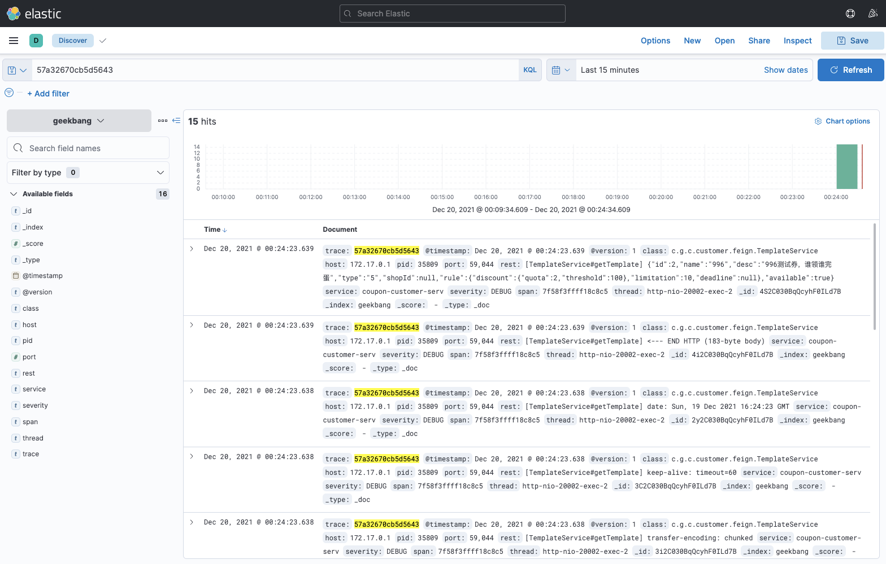

# 23 | 调用链追踪：如何通过 ELK 实现日志检索？
你好，我是姚秋辰。

在上节课中，我们借助Sleuth和Zikpin的合力，搭建了一套调用链追踪系统，它可以帮助我们串联调用链中的上下游访问单元，快速定位线上异常出现在哪个环节。不过呢，光有Tracing能力似乎还不够，如果我们想要更深一步调查异常背后的原因，那必须完整还原这个异常问题的案发现场。

在线上环境中，我们无法像操作本地开发环境一样去打断点一步步调试问题，服务器的Remote Debug端口通常也是被禁用的，我们唯一能重现案发现场的途径就是 **日志信息**。因此，我们还要去构建一套 **日志检索系统**，作为线上异常排查的辅助工具。

今天，我就来带你通过ELK组件来搭建日志检索系统，完成整个调用链追踪方案的最后一块拼图。在这个过程中，你会知道如何使用Docker搭建ELK镜像，以及如何把应用程序对接到Logstash日志收集器，当然了，还有如何在UI界面查询日志。

在开始之前，我们先来看看什么是ELK吧。

## 什么是ELK？

ELK并不是一个技术框架的名称，它其实是一个三位一体的技术名词，ELK的每个字母都来自一个技术组件，它们分别是Elasticsearch（简称ES）、Logstash和Kibana。取这三个组件各自的首字母，就组成了所谓的ELK。

那么这三个技术组件在日志检索平台中分别起到了什么作用呢？我用一幅图来表达一下它们之间的关系。


在Elastic解决方案中， **Logstash** 扮演了一个 **日志收集器** 的角色。它可以从多个数据源对数据进行采集，也可以对数据做初步过滤和清洗，比如将数据转换成通用格式、隐匿敏感数据等。

而 **Elasticsearch** 呢，它是一个 **分布式的搜索和数据分析引擎**。它在整套方案中扮演了日志存储和分词器的角色。Elasticsearch会收到来自Logstash的日志信息，并将这些日志信息集中存储起来。同时，Elasticserch还对外提供了多种RESTful风格的接口，上层应用可以通过这些接口完成数据查找和分析的任务。

**Kibana** 在整个Elastic方案中扮演了一个“ **花瓶**”的角色。它提供了一套UI界面，让我们可以对Elasticsearch中存储的数据进行查找。同时，它还提供了各种统计报表的功能，如柱状图、饼图、时序统计分析、图谱关联分析等等。当然了，报表数据都来自于Elasticsearch。

现在，你已经了解了Elasticsearch、Logstash和Kibana的用途和三者间的关系。接下来，我们就来动手搭建ELK环境吧。

## 搭建ELK环境

我们有两种搭建ELK环境的方法，一种是分别搭建Elasticsearch、Logstash和Kibana的集群，并将这些组件相互集成起来。就算我们可以通过Docker技术分别搭建三者的镜像环境，环境配置和启动异常排查还是有些麻烦的，很容易劝退初学者。

因此，我这里推荐你使用一种更简单的搭建方式，那就是 **直接下载sebp/elk镜像**。因为sebp/elk镜像已经为我们集成了完整的ELK环境，只需要稍加配置就能迅速构建ELK环境，而且异常排查也比较方便。

为了安装sebp/elk镜像，你要先确保本地电脑上已经安装了Docker环境。如果你对Docker已经比较熟悉，那么可以直接使用Docker的命令行程序来操作镜像；如果你之前没有使用过Docker，那么可以下载Docker桌面版简化操作流程。我在课程里将使用命令行程序来操作Docker容器和镜像。

#### 下载ELK镜像

搭建ELK环境的第一步，就是下载sebp/elk镜像。你可以在命令行运行以下命令，来下载7.16.1标签的镜像文件。因为镜像文件相当庞大，所以这个下载过程是非常漫长的，请你拿出对待初恋女友的耐心独自等待。

```bash
docker pull sebp/elk:7.16.1

```

为什么需要你选择7.16.1标签呢？因为默认情况下，docker会尝试获取LASTEST标签也就是最新版本的镜像文件，而Elastic的版本一直处于不断更新发布的过程中。为了保证你能获得和本节课一致的集成体验，我推荐你和我使用同样的镜像版本。

**在这里我要重点提醒你两个点。**

**第一，一定要记得尽可能多给Docker容器分配一些内存。** 否则，Elasticsearch很容易启动失败，要知道ES可是一个非常吃内存的组件。我本地为Docker分配的运行期内存是10G（顶配Mac就是豪横），我推荐你为Docker分配不低于5G的内存。

**第二，低配电脑可以降低ELK镜像版本。** 如果你的电脑配置比较吃紧，无法分配高内存，那么你可以尝试获取更低版本的ELK组件，因为版本越高对系统的资源要求越高。你可以在 [Docker Hub](https://hub.docker.com/r/sebp/elk) 网站上查看sebp/elk镜像的版本信息，再选择适合自己电脑配置的进行下载。

镜像下载完成之后，就可以创建一个ELK容器了。

#### 创建ELK容器

你可以在命令行使用如下命令创建并启动一个ELK容器，在这段命令中，我为Elasticsearch、Logstash和Kibana指定的启动端口分别为9200、5044和5601。命令中的–name elk参数指定了新创建的Container的名称为“elk”，当然了，这里你可以更换成自己喜欢的名称。

```xml
sudo docker run -p 5601:5601 -p 9200:9200 -p 5044:5044 -it --name elk sebp/elk

```

这里要注意的是，以上命令只用在容器创建的时候执行一次即可。一旦容器被创建完成，后续你就可以使用docker的标准命令来启动、关闭和重启容器了。

上面这行命令不光会创建容器，还会尝试启动ELK的组件，这个过程可能会花费几分钟。

你可以在浏览器中访问“localhost:9200”来验证ES是否成功被启动，正常情况下，你应该能在浏览器中看到ES集群的版本号等信息，这就说明ES启动成功了。

而Kibana的启动时间会更长一些，你可以在浏览器中访问“localhost:5601”来访问Kibana的网页。

如果启动过程中出现异常，你可以从启动日志中找到异常原因。首先你需要执行下面的命令，进入到Container内部。然后，使用cd命令进入到/var/log文件夹，在这里你可以找到ES、Logstash和Kibana的启动日志，查看具体的报错。

```xml
docker exec -it elk /bin/bash

```

接下来，我们需要对Logstash配置项做一些修改，定义数据传输方式。

#### 配置Logstash

我们使用docker exec命令进入到elk容器之后，需要使用编辑器打开/etc/logstash/conf.d/02-beats-input.conf文件，它是用来配置Logstash的输入输出源的文件。你可以使用vi命令或者vim命令进入文件编辑模式，接下来你需要将文件中的内容替换为以下配置项。

```plain
input {
    tcp {
        port => 5044
        codec => json_lines
    }
}

output {
    elasticsearch {
        hosts => ["localhost:9200"]
        index => "geekbang"
    }
}

```

在上面的文件中，我指定Logstash使用TCP插件作为数据输入源，并从5044端口收集数据，格式为JSON，你可以通过这个 [链接](https://www.elastic.co/guide/en/logstash/current/plugins-inputs-tcp.html) 访问TCP插件的完整参数列表。

同时，我还通过output参数将处理过后的日志数据输出到了ES组件中，这里我配置了ES的地址和数据索引，你可以点击这里的 [链接](https://www.elastic.co/guide/en/logstash/current/plugins-outputs-elasticsearch.html) 获取ES插件的详细信息。 **修改完成之后记得一定要保存文件**。

Logstash支持多种类型的输入和输出源，你可以结合自己的项目架构，选择适合的数据源。如果你对这部分内容感兴趣，可以分别参考以下的两个配置文档：

- [Logstash Input插件列表](https://www.elastic.co/guide/en/logstash/current/input-plugins.html)
- [Logstash Output插件列表](https://www.elastic.co/guide/en/logstash/current/output-plugins.html)

接下来，你还需要在容器外部执行下面这行命令，通过重启ELK容器，让Logstash重新加载最新的配置项。

```plain
docker restart elk

```

到这里，ELK容器就配置完成了，接下来我们需要将微服务生成的日志发送到ELK容器中。

## 对接ELK容器

应用程序对接ELK的过程很简单，只有两处改动，一处是添加依赖项，另一处是添加logback配置文件。

首先，你需要为三个微服务项目添加logstash-logback-encoder依赖项，它提供了对接Logstash的日志输出组件，这里我使用了7.0.1的稳定版本。

```xml
<dependency>
    <groupId>net.logstash.logback</groupId>
    <artifactId>logstash-logback-encoder</artifactId>
    <version>7.0.1</version>
</dependency>

```

接下来，你需要在每个项目的src/main/resources路径下创建logback-spring.xml组件，在这个文件中，我们定义了两个Appender用来输出日志信息。

第一个是 **ConsoleAppender**， **它可以将日志信息打印到控制台上**。这里我使用了Spring Boot默认的日志格式。

```plain
<appender name="console" class="ch.qos.logback.core.ConsoleAppender">
    <filter class="ch.qos.logback.classic.filter.ThresholdFilter">
        <level>DEBUG</level>
    </filter>
    <!-- 日志输出编码 -->
    <encoder>
        <pattern>${CONSOLE_LOG_PATTERN}</pattern>
        <charset>utf8</charset>
    </encoder>
</appender>

```

第二个是 **LogstashTcpSocketAppender**，由于我们在ELK容器中指定了使用TCP的方式接收日志信息，所以这个Appender对象专门用来 **构建JSON格式化数据发送到Logstash**。在下面的代码中，你可以看到我将日志的主体信息，以及Span、Trace等链路追踪信息作为了JSON数据的一部分。

```plain
<appender name="logstash"
          class="net.logstash.logback.appender.LogstashTcpSocketAppender">
    <!-- 这是Logstash的连接方式 -->
    <destination>127.0.0.1:5044</destination>
    <!-- 日志输出的JSON格式 -->
    <encoder class="net.logstash.logback.encoder.LoggingEventCompositeJsonEncoder">
        <providers>
            <timestamp>
                <timeZone>UTC</timeZone>
            </timestamp>
            <pattern>
                <pattern>
                    {
                    "severity": "%level",
                    "service": "${applicationName:-}",
                    "trace": "%X{traceId:-}",
                    "span": "%X{spanId:-}",
                    "pid": "${PID:-}",
                    "thread": "%thread",
                    "class": "%logger{40}",
                    "rest": "%message"
                    }
                </pattern>
            </pattern>
        </providers>
    </encoder>
</appender>

```

我这里贴出的只是logback-spring.xml文件的一部分，你可以到代码仓库查看完整的代码。

到这里，我们就完成了所有的对接工作。接下来，你只要在本地启动微服务项目，然后发起几个服务调用，生成一些Log文件，我们就能够在Kibana中查看到日志信息了。

## 查看Kibana日志信息

当ELK容器处于运行状态时，你可以在浏览器中打开“localhost:5601”地址访问Kibana系统。不过，在使用Kibana做日志查询之前，你还需要添加一个Index。这里所说的Index其实是ES中的一个查询参数。

在这节课前半部分，我在ELK容器的Logstash配置项中指定了Index=geekbang，这个值会作为Index参数，Logstash向ES传输日志信息的时候，会将“geekbang”写入ES。

为了简化配置，我将所有的日志信息都归在了geekbang这个索引之下，当然了，你也可以在Logstash配置文件中通过表达式动态生成Index的值。

我录了一段Video来演示如何在Kibana中创建Index，并查询日志内容，你可以参考一下。

如果你有了一个Trace ID或者Span ID，那么你可以直接在Kibana的Discover页面查询这个ID对应的所有详细日志信息。当然了，根据ES对日志的分词结果，你还可以借助Kibana的KQL表达式构造复杂查询条件，你可以访问Kibana的 [Kuery-query页面](https://www.elastic.co/guide/en/kibana/current/kuery-query.html) 学习如何使用KQL查询。



到这里，我们就完成了线上日志查询系统的搭建，现在让我们来回顾一下这节课的重点内容吧。

## 总结

今天我们通过ELK镜像搭建了一套完整的日志查询系统，这个过程中的重点是 **配置Logstash的输入输出数据源**。出于简化课程难度的目的，我并没有使用filebeat或者kafka之类的输入源，而是使用了TCP Socket方式，让业务系统直接把日志信息传输到Logstash。

从高可用的角度出发，我们通常并不会将业务系统与Logstash直连，取而代之的是将日志写入本地文件，然后通过Filebeat之类的工具收集本地log文件，并传输给Logstash。

这样做的好处是，无论Logstash和应用服务器之间的连接通路是否顺畅，日志文件都会落盘保存，并不会因网络异常而丢失。另一方面，Filebeat使用了一种“背压敏感协议”技术，用来应对海量数据访问的压力，它会根据Logstash的处理速率调整文件读取速度，如果Logstash正忙，Filebeat就会降低读取文件的速度。

## 思考题

结合这节课的内容，请你想一想，如果要将Filebeat添加到ELK体系中，实现日志归集的功能，你打算怎么做？这个作业稍微有一点挑战性，先别搜索网上现成的方案，你可以尝试通过阅读官方文档来搞定这个问题。

好啦，这节课就结束啦。欢迎你把这节课分享给更多对Spring Cloud感兴趣的朋友。我是姚秋辰，我们下节课再见！