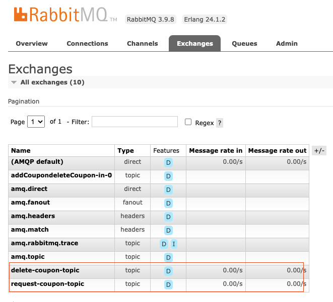
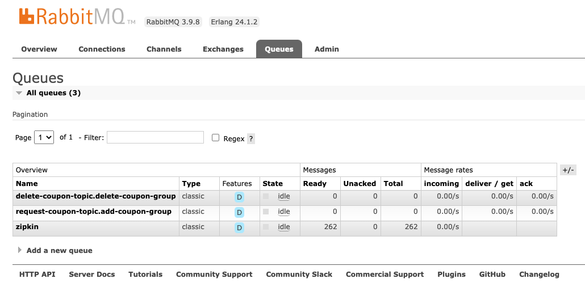

# 29 | 消息驱动：如何集成 Stream 实现消息驱动？
你好，我是姚秋辰。

在上节课中，我们通过一些实际案例了解到了消息驱动技术的应用场景，这节课我们就使用Spring Cloud Stream技术来一场演练，基于RabbitMQ消息中间件来落地实践场景。

以往我们在项目中使用Stream时，大都是使用经典的@Input、@Output和@StreamListener等注解来注册消息生产者和消费者，而Stream在3.1版本之后在这几个注解上打了一个@Deprecated标记，意思是这种对接方式已经被淘汰了，不推荐继续使用。取而代之的是更为流行的Functional Programming风格，也就是我们俗称的函数式编程。

从近几年的技术发展趋势就可以看出来，函数式编程成了一种技术演进的趋势，它能让你以更少的代码和精简化的配置实现自己的业务逻辑。函数式编程和约定大于配置相结合的编程风格比较放飞自我，在接下来的实战环节中，你就会体会到这种less code style的快感了。

因为函数式消息驱动在同一个应用包含多个Event Topic的情况下有一些特殊配置，所以为了方便演示这个场景，我选择了Customer服务中的两个具有关联性的业务，分别是用户领取优惠券和删除优惠券，这节课我们就将这两个服务改造成基于消息驱动的实现方式。

## 实现消息驱动

我把业务场景里的消息生产者和消费者都定义在了Customer服务中，可能你会以为，在真实项目里，生产者和消费者应该分别定义在不同的应用中，大多数情况下确实如此。比如在 [上节课](https://time.geekbang.org/column/article/487158) 的消息广播场景里，一个订单完成之后，通过广播消息触发下游各个服务的业务流程，这里的生产者和消费者是分在不同应用中的。

但是呢，我们也有把生产者和消费者定义在同一个应用中的场景，我叫它自产自销。比如在一些削峰填谷的例子中，为了平滑处理用户流量并降低负载，我们可以将高QPS但时效性要求不高的请求堆积到消息组件里，让当前应用的消费者慢慢去处理。比如我曾经实现的批量发布商品就是这么个自产自销的例子，商品服务接收请求后丢到MQ，让同一个应用内部的消费者慢慢消化。

我们接下来就分三步走，用这个自产自销的路子来实现消息驱动业务。先添加生产者代码，再定义消费者逻辑，最后添加配置文件。

按照惯例，集成之前你需要先把下面这个Stream依赖项添加到coupon-customer-impl项目的pom文件中。由于我们底层使用的中间件是RabbitMQ，所以我们引入的是stream-rabbit组件，如果你使用的是不同的中间件，那么需要引入对口的依赖项。

```plain
<dependency>
    <groupId>org.springframework.cloud</groupId>
    <artifactId>spring-cloud-starter-stream-rabbit</artifactId>
</dependency>

```

添加好依赖项之后，我们先来动手编写生产者逻辑。

### 添加生产者

生产者只做一件事，就是生产一个消息事件，并将这个事件发送到RabbitMQ。我在Customer服务下创建了一个叫做CouponProducer的类，添加了sendCoupon和deleteCoupon这两个生产者方法，分别对应了领取优惠券和删除优惠券。在这两个方法内，我使用了StreamBridge这个Stream的原生组件，将信息发送给RabbitMQ。

```plain
@Service
@Slf4j
public class CouponProducer {

    @Autowired
    private StreamBridge streamBridge;

    public void sendCoupon(RequestCoupon coupon) {
        log.info("sent: {}", coupon);
        streamBridge.send(EventConstant.ADD_COUPON_EVENT, coupon);
    }

    public void deleteCoupon(Long userId, Long couponId) {
        log.info("sent delete coupon event: userId={}, couponId={}", userId, couponId);
        streamBridge.send(EventConstant.DELETE_COUPON_EVENT, userId + "," + couponId);
    }

}

```

在这段代码里，streamBridge.send方法的第一个参数是Binding Name，它指定了这条消息要被发到哪一个信道中，其中ADD\_COUPON\_EVENT=addCoupon-out-0，而deleteCoupon=deleteCoupon-out-0。你先不要管这两个奇怪的值是什么，你只要把Binding Name理解成一条消息从Stream到达RabbitMQ之间的“通道”，待会儿看到配置文件的时候，你就会清楚这条通道是怎么与RabbitMQ中定义的消息队列名称关联起来的了。

消息的生产者已经定义好了，接下来我在CouponCustomerController中新添加了两个方法，单独用来测试我们定义的两个生产者服务。这两个Controller方法接收的参数和现有的领券、删除券的接口是一致的，唯二的区别是请求路径后面多了个Event，以及方法的返回值变成了void。

```plain
@PostMapping("requestCouponEvent")
public void requestCouponEvent(@Valid @RequestBody RequestCoupon request) {
    couponProducer.sendCoupon(request);
}

// 用户删除优惠券
@DeleteMapping("deleteCouponEvent")
public void deleteCouponEvent(@RequestParam("userId") Long userId,
                         @RequestParam("couponId") Long couponId) {
    couponProducer.deleteCoupon(userId, couponId);
}

```

到这里，我们生产者端的配置就完成了，接下来我们就去编写消息的消费者。

### 添加消息消费者

我在CouponProducer的同级目录下创建了一个CouponConsumer类，它作为消息的消费者，从RabbitMQ处消费由生产者发布的消息事件，方法底层仍然是调用CustomerService服务来完成业务逻辑。

在这段代码中，有一个“ **约定大于配置**”的规矩你一定要遵守，那就是不要乱起方法名。我这里定义的addCoupon、deleteCoupon两个方法名是有来头的，你要确保消费者方法的名称和配置文件中所定义的Function Name以及Binding Name保持一致，这是function event的一条潜规则。因为在默认情况下，框架会使用消费者方法的method name作为当前消费者的标识，如果消费者标识和配置文件中的名称不一致，那么Spring应用就不知道该把当前的消费者绑定到哪一个Stream信道上去。

另外有一点需要提醒你，我在代码中采用了Consumer的实现方式，它是函数式编程的一种方式，你也可以根据自己的编程习惯，采用其它函数式编程方式来编写这段逻辑。

```plain
@Slf4j
@Service
public class CouponConsumer {

    @Autowired
    private CouponCustomerService customerService;

    @Bean
    public Consumer<RequestCoupon> addCoupon() {
        return request -> {
            log.info("received: {}", request);
            customerService.requestCoupon(request);
        };
    }

    @Bean
    public Consumer<String> deleteCoupon() {
        return request -> {
            log.info("received: {}", request);
            List<Long> params = Arrays.stream(request.split(","))
                    .map(Long::valueOf)
                    .collect(Collectors.toList());
            customerService.deleteCoupon(params.get(0), params.get(1));
        };
    }

}

```

到这里消费者的定义也完成了。在定义生产者和消费者的过程中我多次提到了配置文件，下面我们就来看一下Stream的配置项都有哪些内容。

### 添加配置文件

Stream的配置项比较多，我打算分Binder和Binding两部分来讲。我们先来看Binder部分，Binder中配置了对接外部消息中间件所需要的连接信息。如果你的程序中只使用了单一的中间件，比如只接入了RabbitMQ，那么你可以直接在spring.rabbitmq节点下配置连接串，不需要特别指定binders配置。

如果你在Stream中需要同时对接多个不同类型，或多个同类型但地址端口各不相同的消息中间件，那么你可以把这些中间件的信息配置在spring.cloud.stream.binders节点下。其中type属性指定了当前消息中间件的类型，而environment则指定了连接信息。

```plain
spring:
  cloud:
    stream:
      # 如果你项目里只对接一个中间件，那么不用定义binders
      # 当系统要定义多个不同消息中间件的时候，使用binders定义
      binders:
        my-rabbit:
          type: rabbit # 消息中间件类型
          environment: # 连接信息
            spring:
              rabbitmq:
                host: localhost
                port: 5672
                username: guest
                password: guest


```

配置完了binders，我们接下来看看如何定义spring.cloud.stream.bindings节点，这个节点保存了生产者、消费者、binder和RabbitMQ四方的关联关系。

```plain
spring:
  cloud:
    stream:
      bindings:
        # 添加coupon - Producer
        addCoupon-out-0:
          destination: request-coupon-topic
          content-type: application/json
          binder: my-rabbit
        # 添加coupon - Consumer
        addCoupon-in-0:
          destination: request-coupon-topic
          content-type: application/json
          # 消费组，同一个组内只能被消费一次
          group: add-coupon-group
          binder: my-rabbit
        # 删除coupon - Producer
        deleteCoupon-out-0:
          destination: delete-coupon-topic
          content-type: text/plain
          binder: my-rabbit
        # 删除coupon - Consumer
        deleteCoupon-in-0:
          destination: delete-coupon-topic
          content-type: text/plain
          group: delete-coupon-group
          binder: my-rabbit
      function:
        definition: addCoupon;deleteCoupon

```

我们以addCoupon为例，你会看到我定义了addCoupon-out-0和addCoupon-in-0这两个节点，节点名称中的out代表当前配置的是一个生产者，而in则代表这是一个消费者，这便是spring-function中约定的命名关系：

Input信道（消费者）：< functionName > - in - < index >；

Output信道（生产者）：< functionName > - out - < index >。

你可能注意到了，在命名规则的最后还有一个index，它是input和output的序列，如果同一个function name只有一个output和一个input，那么这个index永远都是0。而如果你需要为一个function添加多个input和output，就需要使用index变量来区分每个生产者消费者了。如果你对index的使用场景感兴趣，可以参考文稿中的 [官方社区文档](https://docs.spring.io/spring-cloud-stream/docs/3.1.0/reference/html/spring-cloud-stream.html#_functions_with_multiple_input_and_output_arguments)。

现在你已经了解了生产者和消费者的信道是如何定义的，但是，至于这个信道和RabbitMQ里定义的消息队列之间的关系，你知道是怎么指定的吗？

信道和RabbitMQ的绑定关系是通过binder属性指定的。如果当前配置文件的上下文中只有一个消息中间件（比如使用默认的MQ），你并不需要声明binder属性。但如果你配置了多个binder，那就需要为每个信道声明对应的binder是谁。addCoupon-out-0对应的binder名称是my-rabbit，这个binder就是我刚才在spring.cloud.stream.binders里声明的配置。通过这种方式，生产者消费者信道到消息中间件（binder）的联系就建立起来了。

信道和消息队列的关系是通过destination属性指定的。以addCoupon为例，我在addCoupon-out-0生产者配置项中指定了destination=request-coupon-topic，意思是将消息发送到名为request-coupon-topic的Topic中。我又在addCoupon-in-0消费者里添加了同样的配置，意思是让当前消费者从request-coupon-topic消费新的消息。

RabbitMQ消息组件内部是通过交换机（Exchange）和队列（Queue）来做消息投递的，如果你登录RabbitMQ的控制台，就可以在Exchanges下看到我声明的delete-coupon-topic和request-coupon-topic。



切换到Queues面板，你还会看到这两个交换机所绑定的队列名称。这里的队列名称后面还跟了一个group name，这就是我在消费者这一侧设置的消息分组，我在配置项中为add-coupon-in设置了group=add-coupon-group，即当前分组内只有一台机器可以去消费队列中的消息，这就是所谓的“消息分组单播”的场景。如果你不设置group属性，那么这个消息就会成为一条“广播消息”。



最后的最后，有一个最为重要的配置项，我专门把它放到最后来讲，那就是spring.cloud.stream.function。如果你的项目中只有一组消费者，那么你完全不用搭理这个配置项，只要确保消费者代码中的method name和bindings下声明的消费者信道名称相对应就好了；如果你的项目中有多组消费者（比如我声明了addCoupon和deleteCoupon两个消费者），在这种情况下，你需要将消费者所对应的function name添加到spring.cloud.stream.function，否则消费者无法被绑定到正确的信道。

```plain
spring:
  cloud:
    stream:
      function:
        definition: addCoupon;deleteCoupon

```

到这里，我们就完整搭建了一套消息驱动的方案。下面让我来带你回顾下本节重点吧。

## 总结

在今天的课程里，我们使用了Stream在新版本中推荐的functional event风格实现了用户领券和删除券。在这个环节里，你需要注意的是遵循spring function的约定，在下面的几个地方使用一致的命名规则。

1. 生产者端代码中的binding name（addCoupon-out-0）和配置文件中的生产者名称一致；
2. 同一对生产者和消费者，在配置文件中要使用一样的Topic Name；
3. 如果项目中存在多个消费者，使用spring.cloud.stream.function或者spring.cloud.function把所有消费者的function name写出来。

约定大于配置这种风格，对初学者来说，是需要一些上手门槛的，但当你熟悉了这里面的门道之后，你就能利用这种less code开发风格大幅提高开发效率。

## 思考题

如果Consumer在消费消息的时候发生了异常，你知道有哪些异常处理的方式吗？

好啦，这节课就结束啦。欢迎你把这节课分享给更多对Spring Cloud感兴趣的朋友。我是姚秋辰，我们下节课再见！