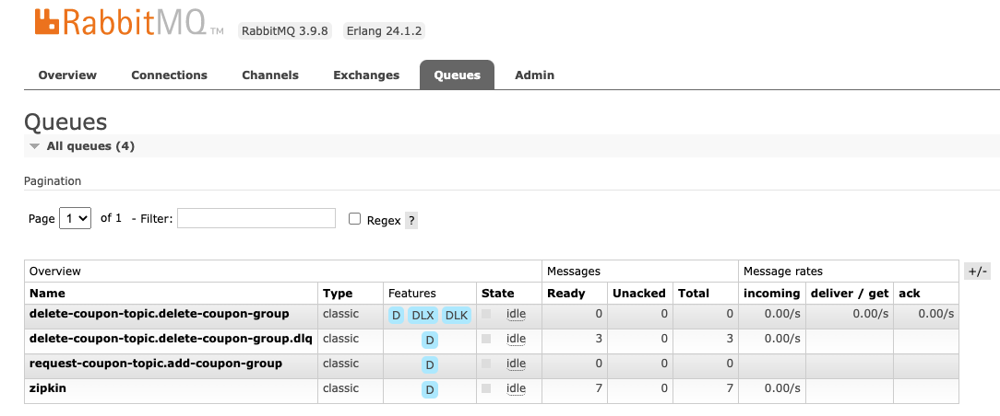
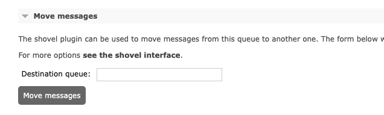

# 30 | 消息驱动：如何高效处理 Stream 中的异常？
你好，我是姚秋辰。

在上节课中，我们通过Spring Cloud Stream和RabbitMQ落地了两个业务场景，实现了用户领券和删除券的操作。如果在Consumer消费消息的时候发生了异常，比如用户领取的优惠券超过了券模板约定的上限，或者用户想要删除一张压根不存在的券，那么Consumer会抛出一个运行期异常。你知道在Stream中有哪些优雅的异常处理方式呢？

你可以调用deleteCoupon接口删除一张不存在的优惠券，人为制造一个异常场景，你会观察到，在Consumer端的日志中，当前消费者逻辑被执行了三次。这三次执行包括首次消息消费和两次重试，这就是Stream默认的一种异常处理方式：消息重试。

接下来，我先带你从本地重试出发，看下如何在消费者端配置重试规则。然后再进一步带你了解消息降级和死信队列这两个异常处理手段。

## 消息重试

消息重试是一种简单高效的异常恢复手段，当Consumer端抛出异常的时候，Stream会自动执行2次重试。重试次数是由ConsumerProperties类中的maxAttempts参数指定的，它设置了一个消息最多可以被Consumer执行几次。

```plain
private int maxAttempts = 3;

```

但需要注意，这个maxAttempts并不是重试次数，它其实等于重试次数+1，加的这个1指的就是Consumer头一次消费消息的计数。也就是说，如果你人为地设置maxAttempts=1，那么就代表着当前Consumer只会消费一次消息，不会做重试；如果你设置maxAttempts=2则表示最多重试一次。那么如何来指定重试次数和重试规则呢？

在application.yml文件中，你可以在spring.cloud.stream.bindings节点下添加一个consumer节点，以addCoupon-in-0为例，我通过consumer节点指定了消息消费次数、重试间隔还有异常重试规则。

```plain
spring:
  cloud:
    stream:
      bindings:
        addCoupon-in-0:
          destination: request-coupon-topic
          content-type: application/json
          # 消费组，同一个组内只能被消费一次
          group: add-coupon-group
          binder: my-rabbit
          consumer:
            # 如果最大尝试次数为1，即不重试
            # 默认是做3次尝试
            max-attempts: 5
            # 两次重试之间的初始间隔
            backOffInitialInterval: 2000
            # 重试最大间隔
            backOffMaxInterval: 10000
            # 每次重试后，间隔时间乘以的系数
            backOffMultiplier: 2
            # 如果某个异常你不想重试，写在这里
            retryableExceptions:
              java.lang.IllegalArgumentException: false

```

在上面这段代码中，我指定了max-attempts次数为5，即一条消息最多被当前Consumer重试4次。我还通过三个backOff参数指定了每次重试之间的间隔时间，这三个参数的时间单位都是毫秒。其中backOffInitialInterval是首次重试时的时间间隔，backOffMaxInterval指定了两次重试之间最大的时间间隔，而backOffMultiplier则指定了重试间隔的相乘系数。

以代码中的参数为例，首次重试会发生在异常抛出2s以后，再过4s发生第二次重试（即2s乘以backOffMultiplier时间系数2），以此类推，再过8s发生第三次重试。但第四次重试和第三次之间的间隔并不是8s\*2=16s，因为我们设置了重试的最大间隔时间为10s，所以最后一次重试会在上一次重试后的第10s发起。

除此之外，如果你想为某种特定类型的异常关闭重试功能，你还可以将这些异常类添加到retryableExceptions节点下，并指定它的重试开关为false。比如我这里设置了针对java.lang.IllegalArgumentException类型的异常一律不发起重试，Consumer消费失败时这个异常会被直接抛到最外层。

本地重试是一种简单高效的容错手段，但你需要注意确保幂等性，如果Consumer端的业务逻辑不具备幂等性，那么千万不要发起任何重试操作。在多次重试之间，你要尽可能使用backOff参数设置一定的间隔，这样做的目的是规避一些短周期的服务故障。比如网络连接在几秒钟之内发生了故障，导致Consumer无法调用目标服务，如果你的重试间隔是0s，那么短时间内连续重试，极大概率会获得多个一样的Connection异常，而如果每次重试之间有一个梯度递增的间隔时间，往往就可以规避短期服务故障导致的重试失败问题。

除了本地重试以外，你还可以把这个失败的消息丢回到原始队列中，做一个requeue的操作。在requeue模式下，这个消息会以类似“roundrobin”的方式被集群中的各个Consumer消费，你可以参考我下面的配置，我为指定Consumer添加了requeue的功能。如果你打算使用requeue作为重试条件，那么就不要留恋“本地重试”了，把max-attempts设置为1吧。

```plain
spring:
  cloud:
    stream:
      rabbit:
        bindings:
          # requeue重试
          addCoupon-in-0:
            consumer:
              requeue-rejected: true

```

说完了异常重试，我们接下来再看看怎么指定异常降级方法。

## 异常降级方法

不止服务调用可以指定降级方法，消费消息也可以指定这样一段降级逻辑。如果你的服务重试了几次仍然没有成功，那么你就可以借助spring-integration组件的能力，为Consumer指定一段异常处理方法。

以用户领券的服务为例，我通过spring-integration的注解@ServiceActivator做了一个桥接，将指定Channel的异常错误转到我的本地方法里。

```plain
@ServiceActivator(inputChannel = "request-coupon-topic.add-coupon-group.errors")
public void requestCouponFallback(ErrorMessage errorMessage) throws Exception {
    log.info("consumer error: {}", errorMessage);
    // 实现自己的逻辑
}

```

在这段代码中，inputChannel属性的值是由三部分构成的，它的格式是：..errors。我通过topic和group指定了当前的inputChannel是来自于哪个消息队列和分组。

对于一些非常重要的消息驱动场景，如果重试几次还是失败，那么你就可以在异常降级方法里接入通知服务，将情况告知到具体的团队。比如在商品批量改价的场景中，如果价格更新失败，那么很有可能导致线上资损，我的方案是在降级逻辑里接入钉钉接口，把告警消息推送到指定群，通知相关团队尽快做人工介入。

降级逻辑处理完之后，这个原始的Message怎么办呢？如果你想要保留这条出错的Message，那你可以选择将它发送到另一个Queue里。待技术团队将异常情况排除之后，你可以选择在未来的某一个时刻将Queue里的消息重新丢回到正常的队列中，让消费者重新处理。当然了，你也可以声明一个消费者，专门用来处理这个Queue里的消息。

这个特殊的Queue就叫做死信队列，它是那些几经重试彻底没救的消息的最终归宿。接下来我就带你了解一下怎么去配置死信交换机。

## 配置死信队列

要触发死信队列很简单，你只要在刚才的降级方法里抛出一个RuntimeException就可以了。如果你没有设置降级方法，但最后一次重试抛出了异常，消息也会被移送到死信队列。

在配置死信队列之前，我先带你安装两个RabbitMQ的插件，分别是rabbitmq\_shovel和rabbitmq\_shovel\_management。这两个插件是用来做消息移动的，让我们可以将死信队列的消息移动到其它正常队列重新消费。

```json
rabbitmq-plugins enable rabbitmq_shovel
rabbitmq-plugins enable rabbitmq_shovel_management

```

这两个插件已经预装在了RabbitMQ中，只是处于未开启的状态，你可以在命令行执行上面这两行命令，开启插件，完事儿后记得重启RabbitMQ。

接下来我就以deleteCoupon这个场景为例，配置一个死信队列。如果用户想要删除一个不存在的优惠券，后台服务就会抛出一个异常，用它来演示死信队列再合适不过了。设置死信队列的第一步就是在配置文件中将消费者所对应的Queue绑定到死信交换机上，你可以参考下面这段代码。

```plain
spring:
  cloud:
    stream:
      rabbit:
        bindings:
          deleteCoupon-in-0:
            consumer:
              auto-bind-dlq: true

```

因为我们底层的消息组件是RabbitMQ，所以这段配置被添加到了spring.cloud.stream.rabbit路径下。我在对应的Consumer信道上设置了auto-bind-dlq=true，开启了死信队列的功能。

理论上到这里你就可以启动项目验证死信队列的功能了，不过呢，如果你没有更换消息队列的名称，那么在程序尝试向死信队列插入数据的时候，你一定会看到一段报错信息：

channel error; protocol method: #method<channel.close>(reply-code=406, reply-text=PRECONDITION\_FAILED - inequivalent arg ‘x-dead-letter-exchange’ for queue ‘delete-coupon-topic.delete-coupon-group’ in vhost ‘/’: received the value ‘DLX’ of type ‘longstr’ but current is none, class-id=50, method-id=10)

这段看似摸不着头脑的异常，其实是在说当前的队列不具备死信交换机的功能。因为这个队列是一个已经存在的队列，而创建这个队列的时候，我们并没有添加auto-bind-dlq参数，以至于它并不具备死信队列的路由功能。

接下来你只需要登录到RabbitMQ的控制台，在Queues面板下进入队列的详情页，点击“Delete Queue”按钮将队列删除掉。然后重新启动应用程序，这时Stream会重新创建一个具备死信路由功能的队列了。



我截了一幅图，你可以看到，图中第一个队列的Features标签中多了两个Tag，分别是DLX和DLK，说明当前队列已经具备了将失败消息路由到死信队列的能力了。其中DLX是死信交换机，它根据Routing Key（即DLK）将消息路由到死信队列。

第二个队列的名称和第一个队列几乎一样，唯一区别就是末尾多了一个.dlq，这个dlq就是死信队列的标志，说明第二个队列是第一个队列的死信队列。

你可以在本地发起几个方法调用，尝试删除压根不存在的优惠券，这时你就会从RabbitMQ控制台中发现一个现象，在每次调用失败后，死信队列的消息数量都会自动加一，这就说明整套死信队列方案配置成功。

使用死信队列的一个好处就是，它可以原汁原味保留原始的消息，给技术人员提供一种异常恢复的途径。怎么恢复？很简单，我们刚才安装的shovel插件就派上用场了，你只要点击进入死信队列的详情页，找到Move messages这个标签页，在Destination queue里填上你想要移动到的目标队列，点击Move messages就可以了。通常我的做法是待故障恢复之后，将死信队列的消息转移到原始的队列进行重新消费。



到这里，我们就了解了消息异常处理的几种常用手段。下面让我来带你回顾下本节重点吧。

## 总结

在今天的课程里，我们掌握了消息重试、消息降级逻辑还有死信队列三种功能。在死信队列的使用上我想分享一些心得。你可以设置一个正经的死信队列，凡是丢到这个队列的消息就死透了，你不主动移动的话就一直待在Queue里。不过在很多情况下我们都会使用另一个方案，那就是设置一个专门用来监听死信队列的Consumer，针对丢到死信队列的消息做特殊逻辑。尽管这段逻辑通过降级方法也能实现，但从 **职责分离** 的角度来说，把异常处理逻辑从Consumer的正向逻辑中剥离出来，封装在另一个Consumer中，会显得更加优雅一些。

这里还要提醒一句，死信队列的一个重要目的是保留案发现场（即保存那条出错了的原始消息）。如果你创建了一个Consumer去监听死信队列的消息，且这个Consumer的目的是做异常恢复，那么记得如果恢复不成功，要把这条消息继续转存到死信队列或者另一个队列中，确保消息不丢失。

## 思考题

事务型消息也是一种很常见的使用场景，它是一种简单的一致性手段，你能自己探索一下如何实现事务型消息，并用几句话尝试讲一讲吗？

好啦，这节课就结束啦。欢迎你把这节课分享给更多对Spring Cloud感兴趣的朋友。我是姚秋辰，我们下节课再见！