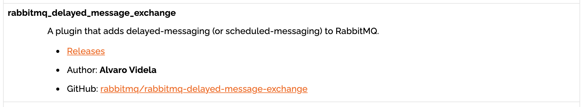
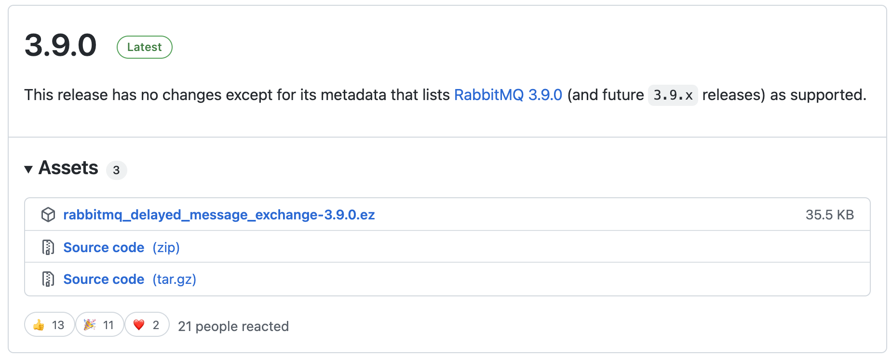

# 31 | 消息驱动：如何通过 RabbitMQ 插件实现延迟消息？
你好，我是姚秋辰。

在平时网购的时候，你一定有过下单之后忘记付款的情况，等到再回过头想起要付款，发现订单已经被关闭了，很多网购流程里都有类似的“订单超时关闭”功能。相类似的功能还有“自动确认收货”，如果在一定时间内买家都没有点击确认收货按钮，那么系统会自动确认收货并且将订单款项打给卖家。

我举的这两个例子都有一个共同的特征，那就是业务逻辑会预设在未来的某一个时间点被触发。在早期我们经常会使用TTL+死信队列的方式来实现这种定时事件，通过设置一个正常的消息队列并使用TTL指定超时时间，如果队列中的消息超时了，它就会被DLX（死信交换机）转向死信队列。借助这种曲线救国的方式，你就可以通过MQ组件实现“定时消息”。

相比于TTL+DLX，RabbitMQ提供了一种更为优雅的方式来实现这类业务。在这节课中，我将带你使用RabbitMQ的延迟消息插件，实现延迟发放优惠券的场景。

那么首先，我们先来安装这个延迟消息插件吧。

## 安装插件

你需要先打开RabbitMQ官网并进入到 [插件下载页面](https://www.rabbitmq.com/community-plugins.html)，在页面中定位到 **rabbitmq\_delayed\_message\_exchange这个插件。**



点击插件上的“Releases”链接，你可以看到适配不同RabbitMQ版本的延迟消息插件。我本地安装的的RabbitMQ版本是3.9.8，最新的延迟消息插件的版本是3.9.0，它可以适配3.9.X系列的RMQ组件，所以我建议你下载3.9.0版本对应的rabbitmq\_delayed\_message\_exchange-3.9.0.ez安装包。



接下来，你需要把安装包的后缀名从.ez改成.zip，然后使用解压缩工具对安装包进行解压。再把解压后的文件复制到RabbitMQ安装路径下的plugins文件夹。以我的本地MAC环境为例，plugins目录位于/usr/local/Cellar/rabbitmq/3.9.8/plugins，你需要根据自己的操作系统和安装路径找到对应的目录。

然后，你需要执行下面这行rabbitmq-plugins命令，通过人工的方式启动rabbitmq\_delayed\_message\_exchange插件。

```json
rabbitmq-plugins enable rabbitmq_delayed_message_exchange

```

最后，你只需要重启一下RabbitMQ服务器，新安装的插件就可以生效了，接下来我们就可以通过代码落地延迟领劵业务了。

## 实现延迟领券

因为延迟消息队列和普通消息队列的类型不同，为了和之前的普通领券接口做个区分，我们今天要声明一个新的生产者和消费者，用来对接延迟消息队列。我先从生产者开始创建。

### 创建生产者

我们依然保持队形，将生产者方法写入CouponProducer这个类中，你可以参考一下下面的代码。

在这段代码中，有一个显而易见的不同之处，你会发现我没有直接将coupon对象传递给生产者，取而代之的是使用了MessageBuilder来构建消息对象，这样做的一个目的是 **传入一个特殊的header，那就是x-delay**。它是延迟消息特有的参数，代表了你想让这个消息在Queue里延迟多久以后再被消费者处理，x-delay对应的单位是毫秒，我在代码中设置的延迟时间是10秒。

```plain
// 使用延迟消息发送
public void sendCouponInDelay(RequestCoupon coupon) {
    log.info("sent: {}", coupon);
    streamBridge.send(EventConstant.ADD_COUPON_DELAY_EVENT,
            MessageBuilder.withPayload(coupon)
                    .setHeader("x-delay", 10 * 1000)
                    .build());
}

```

代码中的ADD\_COUPON\_DELAY\_EVENT的值是addCouponDelay-out-0，它是我单独为延迟消息队列指定的function name。

接下来，我在CouponCustomerController类中声明了一个入口方法，用来对接生产者方法创建延迟消息。

```plain
@PostMapping("requestCouponDelayEvent")
public void requestCouponDelayedEvent(@Valid @RequestBody RequestCoupon request) {
    couponProducer.sendCouponInDelay(request);
}

```

生产者到这里就创建完了，接下来是消费者。

### 声明消费者

在消费者这一端，延迟消息和普通消息的实现方式并没有任何不同，你可以把下面这段朴实无华的代码加入到CouponConsumer类中。

```plain
@Bean
public Consumer<RequestCoupon> addCouponDelay() {
    return request -> {
        log.info("received: {}", request);
        customerService.requestCoupon(request);
    };
}

```

你需要留意一下消费者的方法名称，一定要保证这里的方法名和配置文件中的function name保持完全的一致。

消费者创建完成之后，我们最后还需要对配置文件做一些修改。

### 修改配置文件

这一步中我们需要做的就是把生产者和消费者添加到application.yml文件中，你可以参考下面这段代码。

```plain
spring:
  cloud:
    stream:
      bindings:
        # 延迟发券 - producer
        addCouponDelay-out-0:
          destination: request-coupon-delayed-topic
          content-type: application/json
          binder: my-rabbit
        # 延迟发券 - Consumer
        addCouponDelay-in-0:
          destination: request-coupon-delayed-topic
          content-type: application/json
          # 消费组，同一个组内只能被消费一次
          group: add-coupon-group
          binder: my-rabbit
          consumer:
            # 如果最大尝试次数为1，即不重试
            # 默认是做3次尝试
            max-attempts: 1
      function:
        definition: addCoupon;deleteCoupon;addCouponDelay
      rabbit:
        bindings:
          addCouponDelay-out-0:
            producer:
              delayed-exchange: true
          addCouponDelay-in-0:
            consumer:
              delayed-exchange: true

```

在这段代码里有几个关键点，我需要提醒你一下。

第一个是 **function name的统一**。在spring.cloud.stream.function.definition中我添加了addCouponDelay作为functiona name，它和Consumer方法中声明的method name是一致的。

第二个关键点是 **绑定生产者消费者Topic**。你会发现我在生产者和消费者端的destination属性中声明了一个全新的Topic，request-coupon-delayed-topic，这样做是为了重新创建一个带有x-delay-message功能的交换机。

第三个关键点是 **声明延迟消息功能**。在bindings节点下面声明的生产者和消费者配置项中，我设置了delayed-exchange=true，这是延迟队列最为关键的一个属性。如果没有设置，那么系统将会创建一个普通的交换机，而不是具有延迟消费功能的交换机。

实现延迟消息功能所需要的全部操作就完成了，你可以启动项目并尝试发送几个请求，来验证消息是否会延迟消费。

如果你登录到RabbitMQ控制台查看交换机信息，你会发现我们今天声明的延迟消息交换机（request-coupon-delayed-topic）和第 [29节课](https://time.geekbang.org/column/article/487752?cid=100101301) 中声明的常规交换机（request-coupon-topic）之间的不同，延迟交换机的类型是x-delayed-message，并且带有DM功能标签，这代表当前交换机具备延迟消费功能。


到这里，我们就了解了如何搭建一个延迟消息的场景，下面让我来带你回顾下本节重点吧。

## 总结

利用RabbitMQ搭建延迟消息的过程并不复杂，不过当项目中Topic多起来的时候，function name的配置很容易出错。当你和一个遵循“约定大于配置”的框架打交道的时候，经常会因为没有遵循一个不起眼的约定，导致功能不work，而且排查起来特别困难。可见事物总是相对的，约定大于配置的思想在提高开发效率的同时，也略微抬高了入门成本和异常排查的成本。

在使用rabbitMQ实现高并发业务场景的时候，我有几个经验跟你分享。

- **Sharding**: 数据库sharding方案相信你应该很熟悉了，我们在消息队列中同样也可以应用Sharding方案做消息分片。你可以通过官方提供的Sharding插件创建逻辑队列，并将消息转发到逻辑队列背后的shards队列。Sharding插件的底层原理和数据库Sharding方案类似，它创建了一种“x-modulus-hash”类型的交换机，通过Hash算法对routing key做哈希操作并取模，根据取模的结果做消息转发。具体内容可以参考我贴在文稿里的 [官方文档](https://github.com/rabbitmq/rabbitmq-server/tree/master/deps/rabbitmq_sharding)。
- **一致性哈希**：通过一致性哈希插件，我们可以声明一个x-consistent-hash类型的交换机，根据一定的规则对消息中的变量（通常是Routing Key）做一致性哈希计算，再根据计算结果对消息进行转发。如果你对一致性哈希并不了解，可以从网上学一学这个算法思想，它是一个比较常用的Routing规则。
- **持久化消息**：如果你的队列对消息丢失的情况容忍度很低，那么你可以把队列声明成一个持久化队列，同时发送消息的时候也使用持久化消息。这样一来，不管是队列还是消息都会最终落盘保存。不过你要在一致性和可用性之间做好权衡，因为持久化消息是重量级消息体，必然对性能和吞吐量有一些影响。

## 思考题

生产者和消费者只是一个消息队列最普通的玩法，每个消息队列都有自己丰富的功能库，比如RabbitMQ就提供了各种强大的插件。你能打开文档中的 [RabbitMQ插件页面](https://github.com/rabbitmq/rabbitmq-server/tree/master/deps)，深入了解几个感兴趣的插件功能，然后在评论区和大家分享吗？

好啦，这节课就结束啦。欢迎你把这节课分享给更多对Spring Cloud感兴趣的朋友。我是姚秋辰，我们下节课再见！