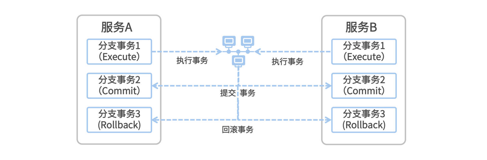

# 32 | Alibaba Seata 框架：什么是分布式事务？
我第一次被问及分布式事务，是在一次面试的终面环节。多年以后，面对形形色色的面试者，我总会回想起畅谈分布式方案的那个遥远的下午。

彼时的打工人还没从996 PUA的福报催眠中觉醒，无人制裁的大厂喜欢肆无忌惮地将面试安排在周末，似乎从面试的那一刻开始，996的节奏就被它们演绎得像呼吸一样自然。在一个周六的下午我来到了约定的面试地点。

“有没有做过分布式事务？”刚和面试官对上线，他就迎面甩我一个大招。

“做过！”我的回答像古龙小说一样惜字如金。但我大概能猜到他想听的完美答案，八成就是 **阿里系自研的分布式事务框架**。

“说说是怎么实现分布式事务的。”为了让一个答案变得有层次，我计划从三个阶段来回答这个问题：一个擦边球答案、一个正确但不完美的答案、一个超出预期的答案。如果用一部舞台剧来形容这三个阶段，那么就是“前戏、正戏、高潮”。

与这三个阶段相对应的话术，分别是“本地事务、传统的分布式事务、阿里系Seata分布式事务”，从平淡无奇到羽化而登仙。

## 一场前戏

“大部分传统公司的业务还是构建在单体应用集群之上，说白了，就是一种伪分布式的应用，事务在应用上下文中传播。”我先抛出了一个擦边球答案作为前戏，前戏宜速战速决不宜恋战，只为铺垫第二阶段的正戏。

在单体应用里，一个事务从生到死都是在同一个上下文中执行，说白了就是在同一个JVM跑了各种CRUD操作。我们只需要在服务入口处的切面点上配置一个@Transactional标签就可以开启事务管理，无外乎再配置下事务的传播性。这只是一个在本地控制的Spring Transaction而已，没有太多技术含量，充其量是能算作一个本地事务。

也许你并不觉得这场前戏和分布式事务有什么关系，但我这里要提醒你的是，我们的终极解决方案Seata分布式事务框架的种种伏笔就埋藏于此。 **再复杂的分布式事务，终将回归到这本地事务的原点上。** 个中奥妙暂且不表，我们在后面的课程中一一道来。

“那如果不是单体应用，而是经过拆分之后的微服务，跨服务的事务如何保证一致性？”如我所料，擦边球的前戏并不能满足面试官的胃口，他急切的想要进入正戏。

“我先来说一说传统的分布式事务解决方案，然后再一起探讨下微服务架构下的新一代方案。”这一幕正戏，我就用曾经红遍大江南北的XA规范来演绎吧。

## 一幕正戏

说起XA协议，这个名词你未必听说过，但一提到2PC和3PC你就秒懂了。这就是大多数银行系统和上了年纪的老系统最喜欢使用的分布式事务解决方案，这套方案依赖于底层数据库的支持，DB这层首先得要实现XA协议。比如Oracle XA和MySQL InnoDB，都是支持XA协议的数据库方案。你可以把XA理解为一个 **强一致性的中心化原子提交协议。**

原子性的概念特别好理解，就是把一系列操作合并成一个整体，要么都执行，要么都不执行。而所谓的2PC就更好理解了，它就是把一个事务分成了两步来提交。第一步做准备动作，第二步做提交/回滚动作，这两步之间的协调是交由一个中心化的Coordinator来管理，保证多步操作的原子性。

**第一步（Prepare）**：Coordinator向各个分布式事务的参与者下达了Prepare指令，各个事务分别将SQL语句在数据库执行但不提交，并且将就绪状态上报给Coordinator。

**第二步（Commit/Rollback）**：如果所有节点都已就绪，那么Coordinator就下达Commit指令，各个参与者提交本地事务；如果有任何一个节点不能就绪，Coordinator则下达Rollback指令进行本地回滚。

我用一个实际例子来帮你理解XA的这两步走。话说张三和李四两个人喝多了，要干架，李四以一句“有本事你打我”开启了一个分布式事务。法外狂徒张三抄起一啤酒瓶叫到“信不信我削你丫的！”（张三进入Prepare阶段并就绪），李四指着自己脑袋回应到“来来来，照这削”（李四进入Prepare阶段并就绪）。“啪！”（张三Commit事务），“哎呦！”（李四Commit事务），分布式事务完成。

这种分布式事务有一个天然缺陷，导致XA特别不适合用在互联网的高并发场景里面。因为每个本地事务在Prepare阶段，都要一直占用一个数据库连接资源，这个资源直到二阶段Commit或者Rollback之后才会被释放。试想，张三进入Prepare阶段就要握着一个啤酒瓶，从张三的角度来说，李四不就绪他就要一直握着这个瓶子（也就是本地事务时间长）。

但互联网场景的特性是什么？高并发！因为并发量特别高，所以每个事务必须尽快释放掉所持有的数据库连接资源。事务执行时间越短越好，这样才能让别的事务尽快被执行。因为从啤酒瓶的角度来看，酒瓶（数据库连接资源）是有限的，总被长事务占用着，其它王五赵六的等不到瓶子就干不成架，这肯定不成。

那有什么方法 **既能降低事务执行时间，又能保证一致性呢**？有时候面对复杂的问题，我们只要回归到问题的本源，这个问题也就迎刃而解了。这就叫众里寻他千百度，蓦然回首，那人却在灯火阑珊处。这个人，就是前戏里提到的那个不起眼的本地事务。

## 高潮未尽

其实面对任何一个复杂的问题，我们都可以通过“大事化小小事化了”的思想，把大问题一步步拆解成一个个小问题来解决掉，这个就是我要提到的Seata分布式事务解决方案。

分布式事务所要解决的问题，不就是跨服务跨DB的事务一致性么？那么我们就把这个场景做一层抽象，把分布式事务的业务模型简化成“全局事务”和“分支事务”两部分，现在让你确保两者的一致性怎么做？很简单，你把这些个分支事务看成葫芦娃七兄弟，不求同年同月同日生，但求同年同月同日死。分支事务全成功=全局事务成功，但凡一个分支事务失败，那么其余的分支事务全部回滚。

这就是各个分布式事务框架都在采用的基础模型，我们在这个简化后的业务模型上再做把问题做一番拆解，把目光聚焦在分支事务本质上。从单个分支事务的角度来看，它不就是我在前戏里讲到的本地事务么？那么现在你想一下，完成一次本地事务的生命周期有哪些步骤？两步而已，执行SQL->Commit/Rollback。

从本地事务的角度来看，XA方案的本质是在“执行SQL”到“Commit/Rollback”这两步之间始终握着DB事务不提交，直到所有分支全部ready之后再Commit。所以，XA是通过“长事务”来保证一致性的。

如天龙八部里无崖子摆下的珍珑棋局一般，破局之道乃置之死地而后生也，Seata方案的破局之道就是这个长事务！XA引入“长事务”的本质是为了保证一致性，但前面我们说到过，长事务在超高并发的互联网场景中不怎么受待见。你不是很长吗？那我就偏要把你最长的地方给剪短。

如果可以把“长事务”变成若干个“短事务”，将“执行SQL”和“Commit/Rollback”通过多个本地事务来控制，不就可以解决问题了吗？我们顺着这个思路继续往下拆解。

在鼎鼎大名的CAP大定理中，“长事务”是典型的偏向CP侧的强一致性方案。如果我们想要打破长事务的束缚，就必须将“强一致性”改为“最终一致性”方案，也就是偏向AP侧的方案。 **最终一致性是一种兼顾一致性和可用性的策略**，它允许应用产生短期的不一致性，然后在未来的某个时间将达成“最终一致”的状态，通过牺牲强一致性来换取高可用性。

我们可以把执行事务、提交事务和回滚事务放到三个不同的分支事务中，其中每一个分支事务都是一个独立的Transaction，一个分支事务执行完毕就会迅速释放掉数据库连接资源。这样一来，原本横跨Execute-Commit-Rollback的一个长事务，就被拆分成了三个独立的分支事务。

那么谁来控制Execute-Commit-Rollback的执行呢？这个任务，就交给中心化的Transaction Coordinator来做就好了。现在你不必关心它是怎么做的，你只要记住Seata方案有这么个组件就成了，我们下节课就专门去搭建这个东西。

现在，我们只剩下最后一个灵魂拷问了，这个问题也是Seata分布式事务的核心问题。你知道Execute、Commit和Rollback分支事务究竟要执行什么SQL呢？换句话说，如何将本地SQL拆分为三阶段去执行呢？

在答案呼之欲出之时，在你以为马上就要迎来这部剧的高潮之际，这篇文章却已悄然落幕。方才恍然大悟，原来从开篇到现在，我演绎的只是这部舞台剧的一段前戏而已。下节课我们将正式拉开下一幕大戏：Seata双料王牌之AT无侵入式方案 + TCC柔性事务。待我与你再续前缘。