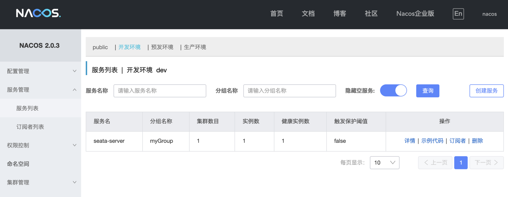

# 33 | 分布式事务：搭建 Seata 服务器
你好，我是姚秋辰。

在上节课中，我提到过一个叫Transaction Coordinator的组件，它在分布式事务中扮演了一个协调者的角色，用来保证事务的最终一致性。这个昨日配角摇身一变就成了今天的主角，还有了一个新的名字：Seata Server。这节课我就带你了解Seata Server的交互模型，再手把手带你搭建一个Seata Server。

但凡名字里带个Server的组件，不用想就知道这一定又是一个“中间件”，Seata Server就是这么一个中心化的、单独部署的事务管理中间件。在开始搭建Seata Server之前，我们先来了解一下Seata Server在整个分布式事务方案中是如何跟各个应用交互的吧。


在上面的图里，除了微服务和Seata以外，还多了Nacos和MySQL的影子，它俩来凑什么数呢？

在分布式事务的执行过程中，各个微服务都要向Seata汇报自己的分支事务状态，亦或是接收来自Seata的Commit/Rollback决议，这些微服务是如何勾搭上Seata Server的呢？答案就是 **服务发现**。Seata Server把自己作为了一个微服务注册到了Nacos，各个微服务利用Nacos的服务发现能力获取到Seata Server的地址。如此一来，微服务到Seata Server的通信链路就构建起来了。

咱前面说过Seata Server做的是事务管理的活，那么一个分布式事务从开始到结束的整个生命周期中，你总得记录些分支事务/全局事务的执行状态吧？数据持久化的工作，咱就交给Seata背后的MySQL数据源了。

好，我们已经大致了解了Seata Server和微服务组件之间的交互方式，估摸着你迫不及待想要了解Seata的底层原理了。咱不着急，这些个原理啥的，现在讲得越多你就越迷糊。这节课我们来点轻松的，我先带你把Seata服务器搭建起来，等这块整明白之后，后面课程里再学习Seata的底层原理。

## 搭建Seata服务器

Seata官方已经给我们备好了可执行的安装文件，你可以到Seata Github地址的 [Release页面](https://github.com/seata/seata/releases) 下载。为了避免各种兼容性问题，我推荐你下载 [seata-server-1.4.2](https://github.com/seata/seata/releases/download/v1.4.2/seata-server-1.4.2.tar.gz) 这个版本，和我用的版本保持一致。下载好之后在本地解压，然后我们需要对其中的配置文件做一番更改。

### 更改持久化配置

我们打开Seata安装目录下的conf文件夹，找到file.conf.example文件，把里面的内容复制一下并且Copy到file.conf里。我们需要在file.conf文件里更改两个地方。

第一个改动点是 **持久化模式**。Seata支持本地文件和数据库两种持久化模式，前者只能用在本地开发阶段，因为基于本地文件的持久化方案并不具备高可用能力。我们这里需要把store节点下的mode属性改成“db”。

```json
## transaction log store, only used in server side
store {
  ## store mode: file、db
  ## 【改动点01】 - 替换成db类型
  mode = "db"

```

第二个改动点就是 **DB的连接方式**。我们需要把本地的connection配置到store节点下的db节点里。你可以参考下面的代码。

```json
store {
  mode = "db"

  ## 【改动点02】 - 更改参数
  ## database store property
  db {
    ## the implement of javax.sql.DataSource, such as DruidDataSource(druid)/BasicDataSource(dbcp) etc.
    datasource = "druid"
    ## mysql/oracle/postgresql/h2/oceanbase etc.
    dbType = "mysql"
    driverClassName = "com.mysql.jdbc.Driver"
    ## if using mysql to store the data, recommend add rewriteBatchedStatements=true in jdbc connection param
    url = "jdbc:mysql://127.0.0.1:3306/seata?rewriteBatchedStatements=true"
    user = "root"
    password = ""
    minConn = 5
    maxConn = 30
    globalTable = "global_table"
    branchTable = "branch_table"
    lockTable = "lock_table"
    queryLimit = 100
  }
}

```

在这段代码中，url参数指定了Seata Server的本地数据库，我这里把DB Schema命名为seata，待会儿我会带你去创建对应的数据库表。除了url以外，你还要指定user和password，虽然我偷懒使用了root用户，不过我还是推荐你为Seata Server创建一个独立的DB访问账号。

这段配置里还有三个和数据库表名称相关的属性，globalTable、branchTable和lockTable，这是Seata Server用来保存全局事务、分支事务还有事务锁定状态的表，Seata正是用这三个Table来记录分布式事务执行状态，并控制最终一致性的。

接下来我们就需要打开MySQL控制台，分别创建这几个Table了，建表语句我已经上传到了Gitee项目下的 [资源文件](https://gitee.com/banxian-yao/geekbang-coupon-center/tree/master/%E8%B5%84%E6%BA%90%E6%96%87%E4%BB%B6/Seata) 目录下。

### 创建数据库表

我在file.conf中的url里指定了DB Schema名称为seata，所以你需要在MySQL中创建一个同名Schema，作为Seata Server独享的Schema。

接下来我要在这个Schema下面执行一段Server端的SQL脚本，脚本的文件名称是server.sql，里面包含了global\_table、branch\_table和lock\_table三张表的创建语句。

Server端的DB tables创建完成之后，你还得为每个微服务背后的数据库创建一个特殊的表，叫做undo\_log，这个表是做什么用的呢？在Seata的AT模式下（下节课你就会学到AT的技术细节了），Seata Server发起一个Rollback指令后，微服务作为Client端要负责执行一段Rollback脚本，这个脚本所要执行的回滚逻辑就保存在undo\_log中。

undo\_log的建表语句可以从资源文件目录下的client.sql文件中找到，从undo\_log的表字段中你可以看出，这里记录了全局事务和分支事务的ID信息，回滚内容和执行状态等等。 **这里你需要特别注意的是，undo\_log并不是创建在Seata Server的schema下，而是要创建在微服务项目自个儿的数据库（geekbang\_coupon\_db）之下的。**

```json
CREATE TABLE IF NOT EXISTS `undo_log`
(
    `id`            BIGINT(20)   NOT NULL AUTO_INCREMENT COMMENT 'increment id',
    `branch_id`     BIGINT(20)   NOT NULL COMMENT 'branch transaction id',
    `xid`           VARCHAR(100) NOT NULL COMMENT 'global transaction id',
    `context`       VARCHAR(128) NOT NULL COMMENT 'undo_log context,such as serialization',
    `rollback_info` LONGBLOB     NOT NULL COMMENT 'rollback info',
    `log_status`    INT(11)      NOT NULL COMMENT '0:normal status,1:defense status',
    `log_created`   DATETIME     NOT NULL COMMENT 'create datetime',
    `log_modified`  DATETIME     NOT NULL COMMENT 'modify datetime',
    PRIMARY KEY (`id`),
    UNIQUE KEY `ux_undo_log` (`xid`, `branch_id`)
) ENGINE = InnoDB
  AUTO_INCREMENT = 1
  DEFAULT CHARSET = utf8 COMMENT ='AT transaction mode undo table';

```

创建完数据库表，你还需要对Seata的JDBC driver做一番调整。

在seata-server-1.4.2的安装目录下有一个lib目录，里面包含了Seata Server运行期所需要用到的jar文件，这其中就包括了JDBC driver。进入到lib目录下的jdbc文件夹，你会看到两个内置的JDBC driver的jar包，分别是mysql-connector-java-5.1.35.jar和mysql-connector-java-8.0.19.jar。

你需要把这两个jar连同jdbc文件夹一并删掉，另外，我在Gitee代码仓库下的“资源文件>Seata”里放了一个mysql-connector-java-8.0.21.jar文件，你需要把这个文件Copy到lib目录下，这样做的目的是确保Seata的jdbc diver和你的本地MySQL安装版本之间的兼容性。如果你本地安装了不同版本的MySQL，记得要把对应版本的JDBC driver jar包复制到lib下面。

### 开启服务发现

Seata Server的搭建只剩下最后一步了，那就是将Seata Server作为一个微服务注册到Nacos中。

打开Seata安装目录下的conf/registry.conf文件，找到registry节点，这就是用来配置服务注册的地方了。

```json
registry {
  # 【改动点01】 - type变成nacos
  type = "nacos"

  # 【改动点02】 - 更换
  nacos {
    application = "seata-server"
    serverAddr = "127.0.0.1:8848"
    group = "myGroup"
    namespace = "dev"
    cluster = "default"
    username = ""
    password = ""
  }

}

```

在registry节点下有一个type属性，它表示服务注册的类型。Seata支持的注册类型有file 、nacos 、eureka、redis、zk、consul、etcd3、sofa，可见大部分主流的注册中心都在支持列表中，默认情况下注册类型为file（即本地文件），我们这里需要将其改为“nacos”。

接下来，你还需要修改registry.nacos里的内容，我把主要的几个配置信息整理成了一个表格，你可以对照表格了解一下代码中配置项背后的含义。


现在我们已经万事俱备了，你只要直接运行bin目录的下的seata-server.sh或者seata-server.bat，就可以启动Seata Server了。如果一切正常，你会看到命令行打印出Server started和监听端口8091。

```json
i.s.core.rpc.netty.NettyServerBootstrap  : Server started, listen port: 8091

```

Seata Server启动完成之后，我们再顺带验证一把Seata到Nacos的注册流程是否完成。我们打开Nacos的服务列表页，切换到dev命名空间下，正常情况下你会看到一个名为seata-server的服务，分组是myGroup。



## 小结

搭建Seata Server的过程看似麻烦，实际上只要遵循三步走就行了。第一步配置DB连接串，第二步创建数据库表，最后一步开启服务发现功能。在这个过程里，有三个需要你特别留意的地方。

- JDBC版本：必须得使用本地数据库对应的正确JDBC版本，否则很容易出现各种兼容性问题。
- undo\_log表：undo\_log是下一节课要讲到的Seata AT模式的核心表，必须要创建在Client端（微服务端）使用的数据库中，而不是Seata Server端的数据库中。
- 服务注册：要确保registry.conf中配置的nacos命名空间、group等信息和微服务中的配置保持一致。


  Seata本身支持很多种分布式方案，包括传统的XA协议、无侵入式的AT、巨麻烦的TCC以及适合长链路业务的Saga。在接下来的两节课里，我将重点介绍AT和TCC。借这个机会，我推荐你去Seata官网中阅读一些开源文档，了解一下这几种方案的基本概念和适用场景，这会帮助你更加全面地理解分布式事务。

## 思考题

你能分享一下在自己的项目中是如何解决数据一致性问题的吗？

好啦，这节课就结束啦。欢迎你把这节课分享给更多对Spring Cloud感兴趣的朋友。我是姚秋辰，我们下节课再见！