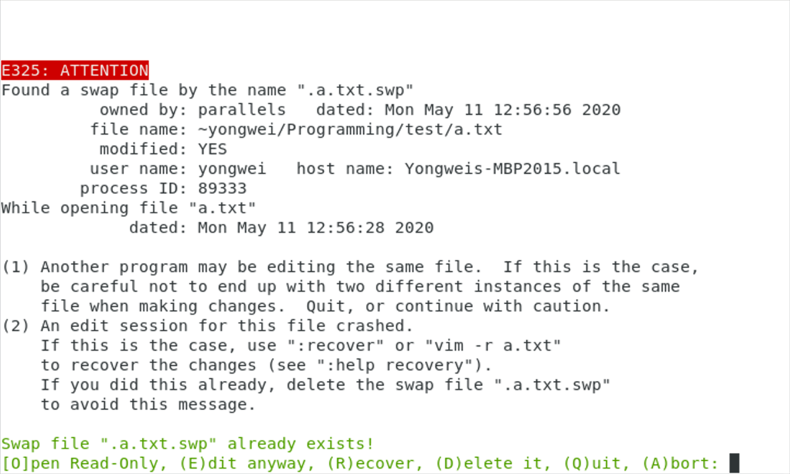
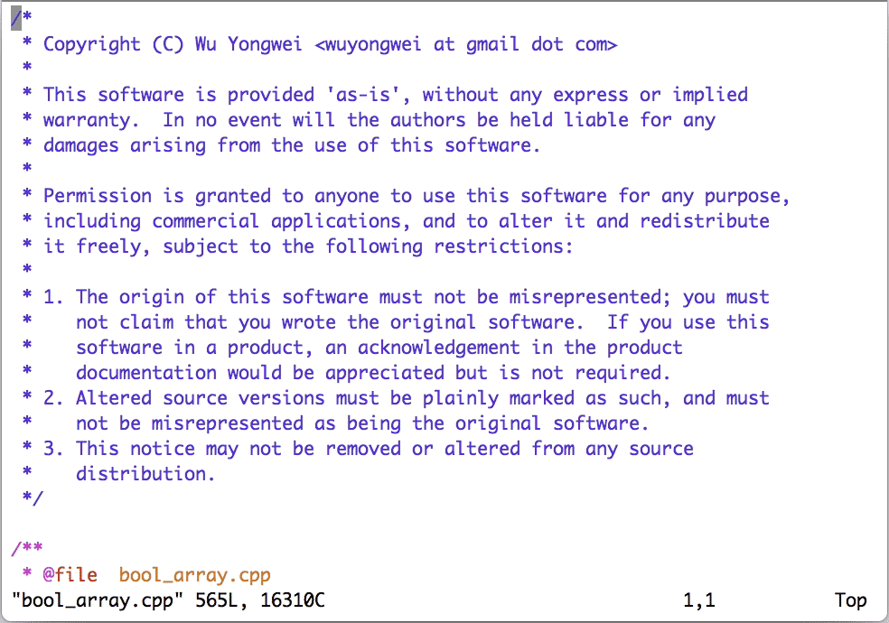
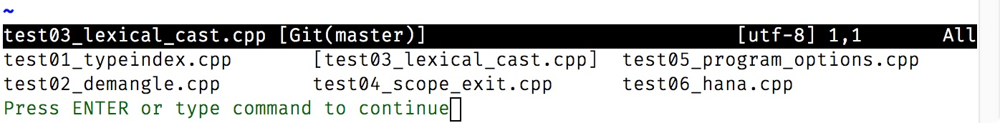
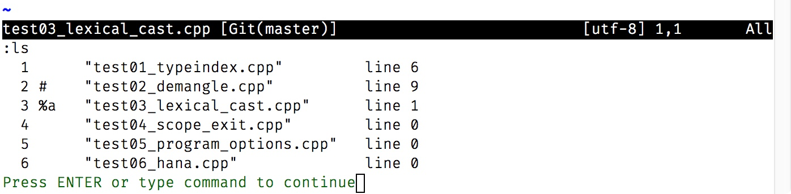

# 05｜多文件打开与缓冲区：复制粘贴的正确姿势
你好，我是吴咏炜。

在前面的几讲里，我们介绍了 Vim 的基本命令和配置。有了这些基本功，单个文件的基本编辑对你来说应该已经不成问题了。不过，显然我们在工作和生活中不可能只用一个文件包打天下，你肯定还会遇到需要同时编辑多个文件的情况。今天，我们就来细细讨论一下这个话题，什么是编辑多个文件的正确姿势。

先来假设一个简单的使用场景，我们现在需要在某个目录下的所有 .cpp 和 .h 文件开头贴入一段版权声明，该如何操作？

## 单文件的打开方式

### 图形界面

使用图形界面的话，我们可以在操作系统的资源管理器里进入到合适的目录，然后逐个使用 Vim 来打开文件。我们可以使用右键菜单（“Edit with Vim”、“Open with…”等），也可以直接把文件拖拽到 Vim 里。使用“文件 > 打开”（File > Open）菜单当然也是一种选择，但这需要你记住上次打开到第几个文件，并不如使用资源管理器方便。

使用这几种编辑方式的话，你可以把需要粘贴的内容放到操作系统的剪贴板里，然后在图形界面的 Vim 里用以下方法之一粘贴进去（当然，如果光标不在开头的话，先用鼠标或用 `gg` 命令跳转到开头）：

- 正常模式 Vim 命令 `"+P`（意义我们后面再解释）
- 快捷键 `<D-V>`（提醒：这是我们对 ⌘V 的标记方式；仅适用于 macOS）或 `<S-Insert>`（PC 键盘）
- 鼠标右键加“粘贴”（Paste）
- 菜单“编辑 \> 粘贴”（Edit > Paste）

注意，如果你通常使用 Ctrl-V 键粘贴的话，这个快捷键在 Vim 里并不适用。即使你使用的是图形界面的 Vim 也是如此，因为这个键在 Vim 里有其他用途。顺便说一句，这个键在 Unix 终端上也一样是不能用作粘贴的。

显然，在远程连接到服务器上时，以上方法不可用，我们得考虑终端 Vim 的用法。

### 终端 Vim

如果直接把图形界面下的基本步骤，翻译成终端 Vim（非图形界面）的用法的话，应该是这样子的：

1. 在终端里进入到目标目录下
2. 使用 `vim 文件名` 来逐一打开需要编辑的文件
3. 如果光标不在开头的话，用鼠标或 `gg` 命令跳转到开头
4. 使用命令 `i` 进入插入模式
5. 使用终端窗口的粘贴命令或快捷键（如 `<S-Insert>`）来粘贴内容
6. 按 `<Esc>` 回到正常模式并用 `ZZ` 存盘退出

或者，我们还可以采用下面的不退出 Vim 的处理方法：

- 打开文件使用 `:e 文件名`；可以使用 `<C-D>` 来查看有哪些文件，及用 `<Tab>` 进行自动完成
- 存盘使用 `:w`

但是如果粘贴的内容含缩进、而 Vim 又不够新的话，我们还会有特殊的麻烦。请继续往下看。

#### Vim 老版本的特殊处理


上面的图片展示了 Vim 用户可能遇到的一种错误情况。这是因为对于终端 Vim 来说，一般而言，它是没法分辨用户输入和粘贴的。因此，在粘贴内容时，Vim 的很多功能，特别是和自动缩进相关的，就会和输入打架，导致最后的结果不对。

要解决这个问题，你就得让 Vim 知道，你到底是在输入还是在粘贴。Vim 有一个 `paste` 选项，就是用来切换输入/粘贴状态的。如果这个选项打开的话（ `:set paste`），Vim 就认为你在粘贴，智能缩进、制表符转换等功能就不会修改粘贴的内容。

不过，手工设置该选项（及事后用 `set nopaste` 取消）是件烦人的事。所幸 xterm 里有一个“括号粘贴模式”（bracketed paste mode）可以帮 Vim 判断目前是输入还是粘贴。这个模式启用后，终端在发送剪贴板的内容之前和之后都会发送特殊的控制字符序列，来通知应用程序进行特殊的处理。

启用括号粘贴模式需要向 xterm 发送启用序列 `<Esc>[?2004h`，关闭括号粘贴模式需要向 xterm 发送关闭序列 `<Esc>[?2004l`；在启用了括号粘贴模式后，xterm 在发送剪贴板内容时会在前后分别加上开始粘贴序列 `<Esc>[200~` 和结束粘贴序列 `<Esc>[201~`。

Vim 8.0.0210 开始引入了对括号粘贴模式的支持。在兼容 xterm 的终端里进行粘贴时，你不再需要使用 `paste` 这个选项了。更棒的是，目前你甚至都不需要进入插入模式就可以粘贴了——这是不是就方便多了？

如果你使用的是 Vim 8.0.0210 之前的版本的话，那我们至少也可以通过代码来使得手工设置 `paste` 选项变得不必要。你可以在 vimrc 里加入下面的代码：

```vim
if !has('patch-8.0.210')
  " 进入插入模式时启用括号粘贴模式
  let &t_SI .= "\<Esc>[?2004h"
  " 退出插入模式时停用括号粘贴模式
  let &t_EI .= "\<Esc>[?2004l"
  " 见到 <Esc>[200~ 就调用 XTermPasteBegin
  inoremap <special> <expr> <Esc>[200~ XTermPasteBegin()

  function! XTermPasteBegin()
    " 设置使用 <Esc>[201~ 关闭粘贴模式
    set pastetoggle=<Esc>[201~
    " 开启粘贴模式
    set paste
    return ""
  endfunction
endif

```

这个功能虽然小，但解决了在远程连接上使用 Vim 粘贴代码的一个常见烦恼。因此，我认为你需要了解一下。

#### “已经存在交换文件！”

对每个文件单独使用一个 Vim 会话来编辑，很容易出现冲突的情况，所以你迟早会遇到“已经存在交换文件！”（Swap file “…” already exists!）的错误提示。出现这个提示，有两种可能的原因：

1. 你上次编辑这个文件时，发生了意外崩溃。
2. 你已经在使用另外一个 Vim 会话编辑这个文件了。

原因不同，我们处理的策略自然也不相同。当进程 ID（process ID）后面没有“STILL RUNNING”这样的字样时，那就是情况 1；否则，就是情况 2 了。



上图中没有“STILL RUNNING”的字样，说明是情况 1。这时你需要按 `r` 来恢复上次的编辑状态——Vim 支持即使在你没有存盘的情况下仍然保存你的编辑状态，因而这种方法可以恢复你上次没有存盘的内容。

需要注意的是，在恢复之后，Vim 仍然不会删除崩溃时保留下来的那个交换文件。因此，在确定内容无误、保存文件之后，你需要重新再打开文件，并按 `d` 键把交换文件删除。当然，如果你确定目前保存的文件版本就是你想要的，也可以直接按 `d` 把交换文件删除、重新编辑文件。

反过来，如果你已经在另一个 Vim 会话里编辑文件的话，我们就会在进程 ID 后面看到“STILL RUNNING”的字样；同时，Vim 界面上也没有了删除（Delete）交换文件这一选项。


这时，大部分情况下我们应当使用 `q` 或 `a`（绝大部分情况下没有区别）放弃编辑，并找到目前已经打开的 Vim 窗口，从那里继续。少数情况下，我们只是要查看文件，那也可以选择 `o` 只读打开文件。需要使用 `e` 强行编辑的情况很少，需要非常谨慎——比如，你确认另外有 Vim 会话，但里面不会去做任何修改，这是我目前想得出来的唯一的合理需求。

如果我们使用图形界面 Vim 8 的话，Vim 支持在文件已经打开时自动切换到已经打开的 Vim 窗口上。这个功能在文件处于一个不活跃的标签页（下一讲会讨论标签页支持）时特别有用，因为 Vim 能把这个标签页自动切到最前面。不过，这个功能不是默认激活的，我们需要在 vimrc 中加入以下内容：

```vim
if v:version >= 800
  packadd! editexisting
endif

```

* * *

好了，目前我们已经讨论了最简单、无聊、低效的工作方式。可以明显看到，不管是使用图形界面 Vim，还是终端 Vim，上面的方法本质上把 Vim 当成了记事本来用，完全没有体现出任何高效性或方便性。

既然使用号称“高效”的 Vim，我们当然就得有更加高效的做法。下面，我们以多文件打开为例加以说明。

## 多文件的打开方式

首先，我们需要知道，Vim 支持一次性打开多个文件，你只需要在命令行上写出多个文件即可，或者使用通配符。比如，就我们刚才所说的编辑场景，我们可以使用 `vim *.cpp *.h`。

有可能让你吃惊的是，输入这个命令之后，Vim 只打开了一个文件，那就是所有文件中的第一个。

原来，为了确保在配置较差的环境里仍然能够正常工作，Vim 绝对不会不必要地消耗内存，包括打开不必要立即打开的文件。所以在上面的命令后，Vim 建立了一个文件列表，并且暂时只打开其中的第一个文件。接下来，用户可以决定，要编辑哪个文件，或者查看列表，或者提前退出，等等。

为此，Vim 提供了以下命令：

- `:args`：可以显示“参数”，即需要编辑的多个文件的列表
- `:args 文件名`：使用新的文件名替换参数列表
- `:next`（可缩写为 `:n`）：打开下一个文件；如当前文件修改（未存盘）则会报错中止，但如果命令后面加 `!` 则会放弃修改内容，其他命令也类似
- `:Next`（缩写 `:N`）或 `:previous`（缩写 `:prev`）：打开上一个文件
- `:first` 或 `:rewind`：回到列表中的第一个文件
- `:last`：打开列表中的最后一个文件

使用这些命令，我们的工作流当然就会发生变化了：

1. 在终端里进入到目标目录下
2. 使用 `vim *.cpp *.h` 或 `gvim *.cpp *.h` 来打开需要编辑的文件
3. 对于第一个文件，使用之前的方法贴入所需的文本
4. 使用 `V` 进入行选择的可视模式，移动光标选中所需的文本，然后使用 `y` 复制选中的各行
5. 执行命令 `:set autowrite`，告诉 Vim 在切换文件时自动存盘
6. 执行命令 `:n|normal ggP`，切换到下一个文件并执行正常模式命令 `ggP`，跳转到文件开头并贴入文本
7. 确认修改无误后，键入 `:`、上箭头和回车，重复执行上面的命令
8. 待 Vim 报错说已经在最后一个文件里，使用 `:w` 存盘，或 `:wq`（抑或更快的 `ZZ`）存盘退出

注意，第 6 步可以拆成 `:n` 和 `ggP` 两步，但文件数量较多时，反复手工敲 `ggP` 也挺累的。因此，我这儿使用了 `normal` 命令，在命令行模式下执行正常模式命令，下面就可以直接重复切换命令加粘贴命令，我们的编辑效率也得以大大提升。



这种编辑方式，是不是就比之前的优越多了？

另外，Vim 还能解决一个 shell 相关的不一致性问题。如果我们要编辑的文件除了当前目录下的，还有所有子目录下的，在大部分 shell 下，包括 Linux 上缺省的 Bash，我们需要使用“\*.cpp \*.h \*\*/\*.cpp \*\*/\*.h”来挑选这些文件，重复、麻烦。Vim 在此处采用了类似于 Zsh 的简化语法，“\*\*”也包含了当前目录。这样，我们只需把上面第 2 步改成下面这样即可：

- 键入 `vim` 进入 Vim，然后使用 `:args **/*.cpp **/*.h` 来打开需要编辑的文件

### 缓冲区的管理和切换

跟多文件相关又略微不同的一个概念是缓冲区（buffer）。它是 Vim 里的一个基本概念，和今天讲的很多其他内容有相关性和相似性，你也或迟或早终究会遇到它，我今天也一起概要描述一下。

Vim 里会对每一个已打开或要打开的文件创建一个缓冲区，这个缓冲区就是文件在 Vim 中的映射。在多文件编辑的时候你也会有同样数量的缓冲区。不过，缓冲区的数量常常会更高，因为你用 `:e` 等命令打开的文件不会改变“命令行参数”（只被命令行或 `:args` 命令修改），但同样会增加缓冲区的数量。

此外， `:args` 代表参数列表/文件列表，真的只是文件的列表而已。缓冲区中有更多信息的，最最基本的就是记忆了光标的位置。在 Vim 里，除了切换到下一个文件这样的批处理操作外，操作缓冲区的命令比简单操作文件的命令更为方便。

作为对比，我们来看一下文件列表和缓冲区列表的命令的结果。





可以看到，两者都展示了文件，都标示出了当前编辑的文件（分别使用方括号和“%a”）。不过，缓冲区列表中明显有更多的信息：

- 文件名前面有编号；我们也马上就会说到利用编号的命令。
- 除了当前活跃文件的标记“%a”，还有个文件被标成了“#”，这表示最近的缓冲区；缓冲区列表里还可能有其他标记，如“+”表示缓冲区已经被修改。
- 文件名后面有行号，表示光标在文件中的位置。

常用的缓冲区命令跟前面文件列表相关的命令有很大的相似性，因此我在这儿一起讲，可以帮助你记忆：

- `:buffers` 或 `:ls`：可以显示缓冲区的列表
- `:buffer 缓冲区列表里的编号`（ `:buffer` 可缩写为 `:b`）：跳转到编号对应的缓冲区；如当前缓冲区已被修改（未存盘）则会报错中止，但如果命令后面加 `!` 则会放弃修改内容；其他命令也类似
- `:bdelete 缓冲区列表里的编号`（ `:bdelete` 可缩写为 `:bd`）：删除编号对应的缓冲区；编号省略的话删除当前缓冲区
- `:bnext`（缩写 `:bn`）：跳转到下一个缓冲区
- `:bNext`（缩写 `:bN`）或 `:bprevious`（缩写 `:bp`）：跳转到上一个缓冲区
- `:bfirst` 或 `:brewind`：跳转到缓冲区列表中的第一个文件
- `:blast`：跳转到缓冲区列表中的最后一个文件

还有很常见的一种情况是，我们需要在两个文件之间切换。Vim 对最近编辑的文件（上面提到的列表里标有“#”的文件）有特殊的支持，使用快捷键 `<C-^>` 可以在最近的两个缓冲区之间来回切换。这个快捷键还有一个用法是在前面输入缓冲区的编号：比如，用 `1<C-^>` 可以跳转到第一个缓冲区（跟命令行模式的命令 `:bfirst` 或 `:b1` 效果相同）。

从实际使用的角度，使用缓冲区列表有点像打开最近使用的文件菜单（但缓冲区列表不会存盘），可以当作一种快速切换到最近使用的文件的方式。

缓冲区是文件在某个 Vim 会话里的映射。这意味着，如果某个 Vim 会话里不同的窗口或标签页（下一讲里会讨论）编辑的是同一个文件，它们对应到的也会是同一个缓冲区。更重要的是，文件/缓冲区的修改在同一个 Vim 会话里是完全同步的——这就不会像在多会话编辑时那样发生冲突和产生错误了。

## 内容小结

本讲通过讨论使用 Vim 在多个文件里粘贴代码的多种方法，我们学习了以下知识：

- 在图形界面和终端里，粘贴系统剪贴板的内容需要使用不同的方法：前者使用 Vim 命令，后者则需进入插入模式，使用终端的粘贴命令进行粘贴
- Vim 能在崩溃后恢复未存盘的内容，也能在多会话编辑同一个文件时检测到这种冲突
- 在 Vim 里我们可以使用通配符“\*.后缀”和“\*\*/\*.后缀”来打开多个文件
- 使用 `:args` 命令我们可以展示或替换参数列表，使用 `:next` 等命令我们可以在这些参数指定的文件中切换
- 使用 `:buffers` 或 `:ls` 命令我们可以展示缓冲区列表，即所有已编辑和将编辑的文件，使用 `:b` 和 `:bnext` 等命令我们可以在这些缓冲区中进行切换

今天讲到了一些命令行模式的命令，你应该可以看到，它们都是非常有规律的，最基本的操作就是“first”、“last”、“next”、“Next” 或 “previous”等英文单词，以及它们与前缀的组合。把命令行模式的命令记住，就能完成基本的编辑任务；至于像 `<C-^>` 这样的正常模式命令，万一记不住，也可以用命令行模式的命令来替代。但是，正常模式的命令更加高效，有助于提高你的编辑效率，所以最好通过多加练习来形成“肌肉记忆”。

对于配置文件，本讲只有很小的更改，对应的标签是 `l5-unix` 和 `l5-windows`。

## 课后练习

请在课后进行以下练习，熟悉今天所讲的内容：

1. 用 Vim 打开一个文件，进行编辑（不存盘），然后将这个 Vim 进程 kill 掉；重新打开文件，恢复其中内容并存盘；再次打开文件，删除交换文件。
2. 用 Vim 打开一个文件，然后在另外一个终端窗口里再次打开这个文件，阅读冲突信息，然后退出编辑。
3. 使用 Vim 打开多个文件，逐个查看，然后退出。

我是吴咏炜，我们下一讲再见！