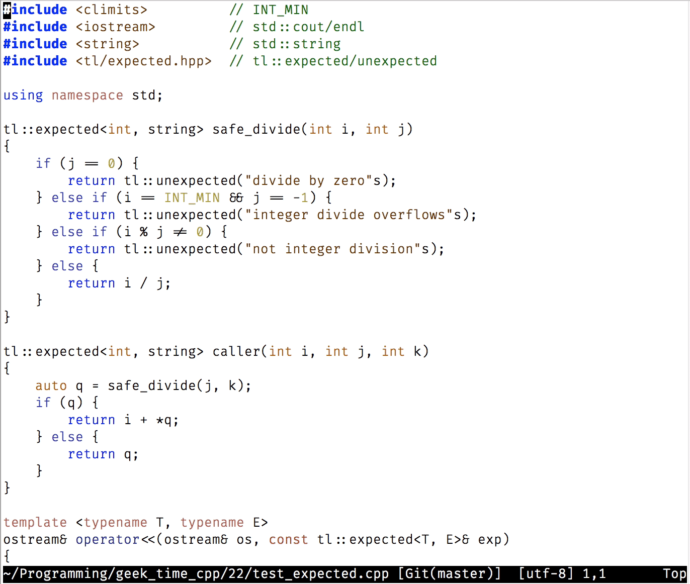
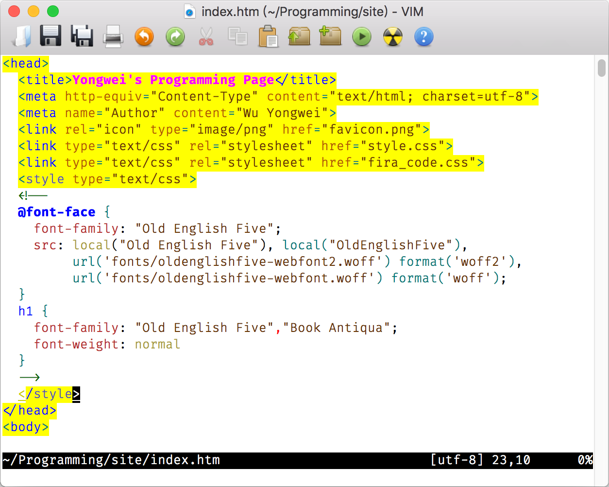

# 07｜正则表达式：实现文件内容的搜索和替换
你好，我是吴咏炜。

上面两讲里我们讨论了如何找到你想要查看/编辑的文件，及如何处理多个文件。今天我们来看一下如何在一个文件中搜索和替换内容，其核心主题就是正则表达式。

## 正则表达式搜索

通过 Vim 教程，你已经学到了搜索命令 `/` 和替换命令 `:s` 的基本用法。教程里没有提到的是，你输入的待查找的内容是被 Vim 当成正则表达式来看待的。正则表达式的学习资料很多（极客时间上就有专门的课程），完整学习也相当复杂，我们就不从头学习了。下面我们会简单讨论的，是 Vim 里的正则表达式，重点是它和其他常用正则表达式（正则表达式还是有很多种不同的风格的）的区别之处。如果你之前对正则表达式完全没有了解，建议你这儿暂停一下，先在网上搜索一下关于正则表达式的资料，了解它的基本概念和用法，然后继续阅读。

在一个搜索表达式里，或者称为模式（pattern；注意不要和 Vim 的 mode 混淆）里， `.`、 `*`、 `^`、 `$`、 `~`、 `[]`、 `\` 是有特殊含义的字符：

- `.` 可以匹配除换行符外的任何字符：如 `a.` 可以匹配“aa”、“ab”、“ac”等，但不能匹配“a”、“b”或“ba”。如果需要匹配换行符（跨行匹配）的话，则需要使用 `\_.`。
- `*` 表示之前的匹配原（最普通的情况为单个字符）重复零次或多次：如 `aa*` 可以匹配“a”、“aa”或“aaa”， `a.*` 可以匹配“a”、“aa”、“abc”等等，但两者均不能匹配“b”。
- `^` 匹配一行的开头，如果出现在模式的开头的话；在其他位置代表字符本身。
- `$` 匹配一行的结尾，如果出现在模式的结尾的话；在其他位置代表字符本身。
- `~` 匹配上一次替换的字符串，即如果上一次你把“foo”替换成了“bar”，那 `~` 就匹配“bar”。
- `[…]` 匹配方括号内的任一字符；方括号内如果第一个字符是 `^`，表示对结果取反；除开头之外的 `-` 表示范围：如 `[A-Za-z]` 表示任意一个拉丁字母， `[^-+*/]` 表示除了“+”、“-”、“\*”、“/”外的任意字符。
- `\` 的含义取决于下一个字符，在大部分的情况下，包括上面的这几个（ `.`、 `*`、 `\`、 `^`、 `$`、 `~`、 `[` 和 `]`），代表后面这个字符本身；在跟某些字符时则有特殊含义（后面我们会讨论最重要的那些）。

除此之外的字符都是普通字符，没有特殊含义。不过，需要注意的是，如果使用 `/` 开始一个搜索命令，或者在替换命令（ `:s`）中使用 `/` 作为模式的分隔符，那模式中的 `/` 必须写作 `\/` 才行，否则 Vim 看到 `/` 就会以为模式结束了，导致错误发生。

为了避免写模式的困扰，如果模式中使用“/”作为路径的分隔符，在替换命令中可以使用其他模式中没有的符号作为分隔符。比如，想把“/image/”全部替换成“/images/”的话，不要用 `:%s/\/image\//\/images\//g`，而应该用类似于 `:%s!/image/!/images/!g` 的写法。这只能适用于替换命令，而在使用 `/` 命令搜索时我们就没什么好办法了，只能把模式里的 `/` 写作 `\/`。不过我们也可以取巧一下，用 `?` 向上、也就是反向搜索，只要记得 `n`、 `N` 反过来用找下一个就行。

通过 `\` 开始的特殊表达式有不少，如果你需要完整了解的话，可以去看看参考文档（ [`:help pattern-overview`](https://yianwillis.github.io/vimcdoc/doc/pattern.html#pattern-overview)）。我们下面先学习一下最基本的 6 个特殊模式项：

- `\?` 表示之前的匹配原重复零次或一次：如 `aa\?` 可以匹配“a”、“aa”，但不能完整匹配“aaa”（可以匹配其前两个字符、后两个或最后一个字符）。
- `\+` 表示之前的匹配原重复一次或多次：如 `aa\+` 可以匹配“aa”、“aaa”，但不能匹配“a”或“b”。
- `\{n,m}` 表示之前的匹配原重复 n 到 m 遍之间，两个数字可以省略部分或全部：如 `a\{3}`（可读作：3 个“a”）可以匹配“aaa” ， `a\{,3}`（可读作：最多 3 个“a”）可以匹配“”、“a”、“aa”和“aaa”；两个数字都省略时等价于 `*`，也就是之前的匹配原可以重复零次或多次。
- `\(` 和 `\)` 括起一个模式，将其组成为单个匹配原：如 `\(foo\)\?` 可以表示单词“foo”出现零次或一次。 `\(` 和 `\)` 还有一个附加作用，是捕获匹配的内容，按 `\(` 出现的先后顺序，可以用 `\1`、 `\2` 到 `\9` 来引用。如果你不需要捕获匹配内容的话，用 `\%(` 和 `\)` 的性能更高。
- `\&` 是分支内多个邻接（concat）的分隔符，概念上可以和 **与** 操作相比，表示每一项都需要匹配成功，然后取最后一项的结果返回：如 `.*foo.*\&.*bar.*` 匹配同时出现了“foo”和“bar”的完整行。相对来讲， `\&` 没那么常用。
- `\|` 是多个分支的分隔符，概念上可以和 **或** 操作相比，表示任意一项匹配成功即可：如 `foo\|bar` 可匹配“foo”或“bar”两单词之一。

接下来，我再和你分享 13 个特殊模式项。虽然它们相对来说不那么必需，但掌握它们可以大大地提高程序员的编辑效率。

- `\<` 匹配单词的开头
- `\>` 匹配单词的结尾
- `\s` 匹配空白字符 `<Space>` 和 `<Tab>`
- `\S` 匹配非空白字符
- `\d` 匹配数字，相当于 `[0-9]`
- `\D` 匹配非数字，相当于 `[^0-9]`
- `\x` 匹配十六进制数字，相当于 `[0-9A-Fa-f]`
- `\X` 匹配非十六进制数字，相当于 `[^0-9A-Fa-f]`
- `\w` 匹配单词字符，相当于 `[0-9A-Za-z_]`
- `\W` 匹配非单词字符，相当于 `[^0-9A-Za-z_]`
- `\h` 匹配单词首字符，相当于 `[A-Za-z_]`
- `\H` 匹配非单词首字符，相当于 `[^A-Za-z_]`
- `\c` 忽略大小写进行匹配

以上我们讨论的实际上是 Vim 缺省设置下的正则表达式。通过选项（ [`:help /magic`](https://yianwillis.github.io/vimcdoc/doc/pattern.html#%2Fmagic)），我们可以对哪些字符有特殊意义进行一定程度的调整。不过一般情况下，我认为修改这个选项只会造成混乱、增加心智负担，因此我也就不在这儿展开了。

### 搜索实例

抽象地讨论正则表达式恐怕你也不容易记住，我们还是拿一些具体的例子来看一下吧。

首先，如果 **我们要查找某个函数，该怎么做呢？** 简单，按下 `/`，然后输入函数名，回车，不就行了？

错。这种方式对函数名是部分匹配，你搜 `begin` 还会得到 `begin1`、 `_begin` 之类的结果。正确的方法是，要在前后加上匹配单词头尾的标记，如， `\<begin\>`。

顺便说一句，被誉为最有用的 Vim 提示，是把光标移到希望搜索的关键字上，然后按下 `*` 键。Vim 会提取光标下的关键字，并自动添加 `\<` 和 `\>` 进行搜索。



如果我要搜索 `begin` 或 `end` 呢？我想，你应该已经知道了，是： `/\<\(begin\|end\)\>`。注意，写成 `/\<begin\|end\>` 可是不对的。（为什么？你想明白了吗？）

对于 HTML，你应该多多少少有些了解。 **如果我们想匹配一下 HTML 标签的话，该怎么做呢？**

一个标签以 `<` 开始，以 `>` 结束。所以，最简单的模式应该是 `<.\+>`，对吗？

不对，这个写法忽略了一行里可能有多个标签的事实：对于“<h1>title</h1>”这样一个字符串，上面这个简单的模式会匹配整个字符串，而不是“<h1>”和“</h1>”……



有一种解决方案是，排除不应该匹配的字符，把模式写成 `<[^>]\+>`：一对尖括号里有一个或多个不是“>”的字符。不过，这样的写法会让像 `>` 这样的结尾字符在模式中重复出现，因此这并不是最理想的写法。更好的方式是，使用最短匹配。

### 最长匹配和最短匹配

我们上面学到的 `*`、 `\?`、 `\+` 和 `\{}` 都属于最长匹配（也叫贪婪匹配），也就是说，当模式既可以匹配一个较长的字符串，也可以匹配一个较短的字符串时，结果会是那个较长的字符串。

相应地，还有一种匹配叫做最短匹配，也就是在同时可以匹配较长的字符串和较短的字符串时，产生较短的匹配。在 Vim 里，最短匹配只有一种形式， `{-n,m}`，其意义和之前说的 `{n,m}` 基本相同，但结果是较短而非较长的字符串。

以上面的 HTML 标签匹配为例，使用最短匹配的话，我们可以把模式写成 `<.\{-1,}>`，要求在一对尖括号里至少有一个字符，但越短越好。

### 搜索加亮和取消

如果你一边学一边在试验的话，就会发现，Vim 缺省在你输入搜索模式时就会高亮跟你输入的模式匹配的文本。这对验证你输入的模式是否正确，以及进行进一步的编辑，都是非常方便和重要的。用惯了 Vim，就会把它当成是一件理所当然的事——直到你被迫使用其他编辑器时才发现，一边输入正则表达式一边就能看到匹配的结果，原来不是谁都这样做的啊……

但也有些时候，我们已经做完了搜索或替换，和模式匹配的文本内容仍然还高亮着，非常碍眼。有些人就会随便搜索一个不存在的字符串来取消加亮，但这显然不是一种高效的处理方式。事实上，Vim 有一个专门命令来取消搜索加亮，这个命令就是 `:nohlsearch`，不要高亮搜索。

鉴于这个命令使用的频度实在是太高了，我们需要给它专门分配一个快捷键。请在 vimrc 中加入：

```vim
" 停止搜索高亮的键映射
nnoremap <silent> <F2>      :nohlsearch<CR>
inoremap <silent> <F2> <C-O>:nohlsearch<CR>

```

这样一来，在搜索或替换工作完成之后，只要按下 `<F2>` 就可以取消搜索加亮了。

* * *

好，关于正则表达式的搜索部分，我们暂时就先学到这里。下面我们来看一下替换。

## 正则表达式替换

你可能要说了：替换不就是找到跟模式匹配的字符串，然后把它换成另外一个字符串么，有什么复杂的？

事实上，还真是有些复杂情况的。你在看下面这些复杂的替换情况时，也可以同时考虑下自己有没有解决方案：

- 你可能要保留匹配中的某些字符，而替换另外一些字符
- 你可能要对匹配出的内容做大小写转换
- 你可能需要“计算”出替换结果
- 你可能需要决定一行里要替换单次还是多次，是自动替换还是要一一确认，等等

接下来，我们就分别看看这些复杂情况。

在这些情况里，最常用的显然就是 **在替换结果中保留匹配出的字符串** 了。前面说到 `\(\)` 除了将一个模式转变成匹配原外，还有一个作用是捕捉匹配的内容，按 `\(` 的出现顺序依次编号为 1 到 9，并可以在模式和替换字符串中用 `\1` 到 `\9` 来访问。如果要在替换字符串中完整使用匹配内容的话，则可以使用 `\0` 或 `&`（字符“&”也因此要在替换字符串中写成 `\&`）。

从搜索的角度，我们一般只关心匹配与否，而不关心匹配的大小。举个例子，如果我想找出作为函数调用的 `begin`，那我可以写成 `\<begin(`，虽然 `(` 不是我想匹配的内容（函数名称）的一部分。但从替换的角度，我需要在替换时再处理一下多匹配的内容，也是件麻烦事；在非匹配的内容比较复杂或者会变化的时候，尤其会是这样。所以 Vim 里还有专门标识匹配开始和结束的匹配原，分别是 `\zs` 和 `\ze`。对于这个例子，搜索模式就应该是 `\<begin\ze(`。为了巩固前面学到的知识，你应该知道，这个模式也可以啰嗦地写成 `\<begin(\&begin` 或 `\<begin(\&.....`。

Vim 里还有一些 **大小写转换的特殊替换字符串**。它们是：

- `\U` 把下面的字符变成大写，直到 `\E` 出现
- `\u` 把下一个字符变成大写
- `\L` 把下面的字符变成小写，直到 `\E` 出现
- `\l` 把下一个字符变成小写
- `\E` 结束大小写转换

Vim 还能用 `\=` 开始一个返回字符串的表达式，用来 **计算出一个替换结果**。鉴于我们目前还没有讨论 Vim 脚本，这个我们就留到后面第 14 讲再说了。

跟常用的编程语言一样，Vim 的正则表达式中支持 `\t`、 `\r`、 `\n` 等特殊转义字符，但在替换表达式中，由于一些技术原因（ [`:help NL-used-for-Nul`](https://yianwillis.github.io/vimcdoc/doc/pattern.html#NL-used-for-Nul)）， `\n` 插入的是空字符（NUL 或“\\0”），而非在模式中出现时代表的 LF。如果要插入正常的行尾符 LF 的话，我们得使用 `\r`。这意味着如果想把一个回车变成两个的话，我们得别扭地写 `:s/\n/\r\r/`，略遗憾。如果有特殊需要得插入 CR 的话，就要更别扭地输入 `\<C-V><CR>` 才行。还好，我们基本不会在替换时遇到要插入 CR 的情况……

**Vim 有很多用来控制替换的标志**，你可以通过 [`:help s_flags`](https://yianwillis.github.io/vimcdoc/doc/change.html#:s_flags) 查看详细的介绍，我就不一一列举了。今天这一讲中，我们只会用到最常用的一个标志， `g`，代表可以在一行内进行多次替换；没有这个标志的话，Vim 在一行里只会对第一个成功的匹配进行替换。

### 替换实例

同样，我们还是通过例子来巩固一下对正则表达式替换的理解。

先来看一个简单的，删除行尾的“//”注释。我们可以用这个命令

```vim
:%s!\s*//.*$!!

```

把零到多个空白字符后面出现的“//”直到行尾全部删除。

如果要删除“/\\* \*/”注释，那就复杂多了。首先，匹配内容可以跨行；其次，有跟 HTML 标签类似的问题，需要使用最短匹配。我们需要使用的命令是：

```vim
:%s!/\*\_.\{-}\*/!!g

```

由于一行里可以有多个“/\\* \*/”注释，我们在替换命令的尾部还加上了 `g` 标志，允许一行里进行多次替换。

假设我们目前的编码规范规定，所有的函数名应该首字母大写（简单起见，我们假设所有的类名已经是首字母大写了，因而构造函数自动符合该要求，不会发生冲突；但其他很多函数名称仍然是小写字母开头），我们能不能用 Vim 的替换命令做到呢？答案也是肯定的。所有需要的知识点我们都已经讲过了，我就直接公布答案了：

```vim
:%s/\<\(_*\)\([a-z]\w*\)\ze(/\1\u\2/g

```

这个命令比较长，请你慢慢体会一下，尝试去理解每一部分的意图。如果你有哪个点卡住了，可以留言给我，我再帮你详细分析一下。

## 内容小结

好了，今天的内容就讲到这里了。内容有点密集，我把要点再总结一下：

Vim 支持用 `/` 进行搜索和用 `:s` 进行替换，它们都用到了正则表达式。

在搜索的模式里， `.`、 `*`、 `^`、 `$`、 `~`、 `[]`、 `\` 是有特殊含义的字符，你一定要记住它们的含义。在 `\` 开始的特殊表达式中，最重要的是 `\?`、 `\+`、 `\(\)`、 `\|` 和 `\{n,m}`。对于程序员来说， `\<`、 `\>` 等匹配原对于提高编辑效率也非常重要。Vim 中的常用搜索命令 `*` 则会自动在搜索的关键字前后加上 `\<` 和 `\>`。

在替换时，我们需要特别记住 `\1`、 `\2` 到 `\9` 可以用来引用前面用 `\(` 和 `\)` 括起来的内容，字符“&”出现在替换内容中需要使用反斜杠转义成 `\&`，否则代表完整的被匹配字符串。

正则表达式就可以算是一种独立的语言了，靠死记硬背是不行的。最后我还要建议你再把这一讲中的例子仔细看一下、尝试一下，多多练习是掌握正则表达式搜索和替换的必经之路。如果你日后遇到了这一讲没有覆盖的问题，可以再去查阅 Vim 的帮助文档 [`:help regexp`](https://yianwillis.github.io/vimcdoc/doc/pattern.html#regexp)。

本讲我们在配置文件中只更改了一处，对应的标签是 `l7-unix` 和 `l7-windows`。

## 课后练习

有两道练习题，请你在课后尝试一下。练习对于掌握正则表达式是非常重要的。

1. 如果我要搜索“/\\* \*/”注释的话，搜索命令应该是什么样的？

2. 例子里只说了首字母大写，但实际的编码规范是要求把 begin\_search\_nocase 这样的函数名称转变成 BeginSearchNocase。请用 Vim 的替换命令完成这一任务。 **提示：** 可能需要一条以上的替换命令。


我是吴咏炜，我们下一讲再见。