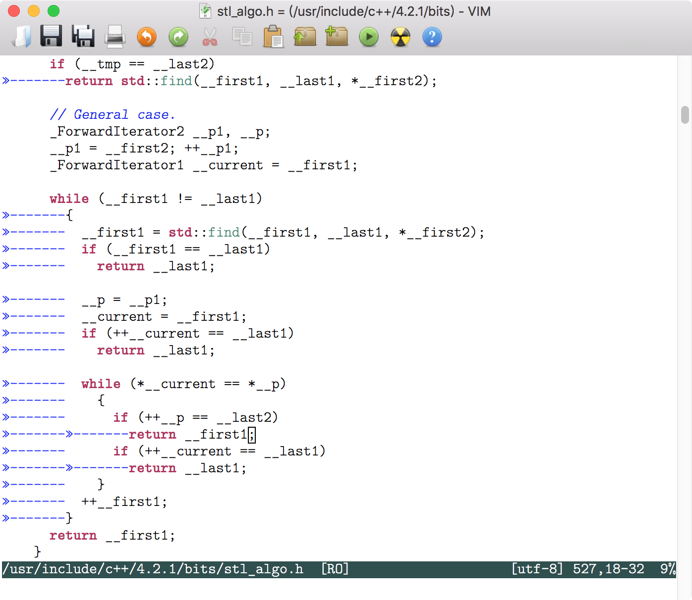
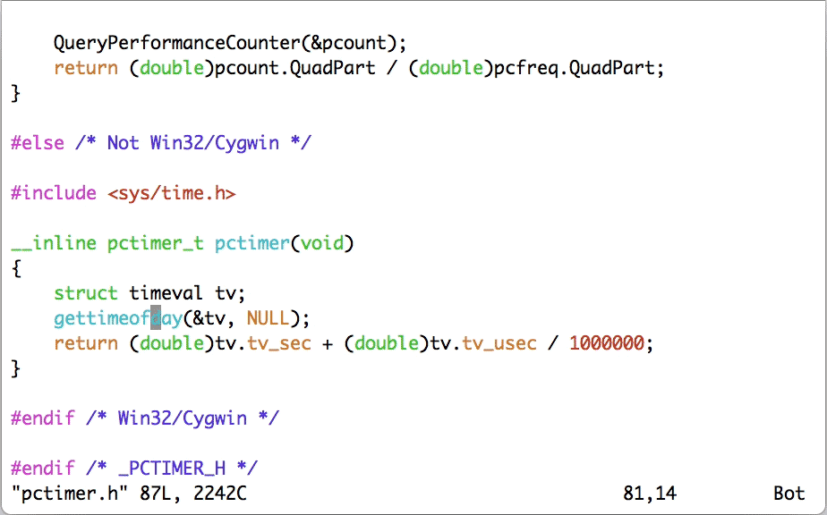
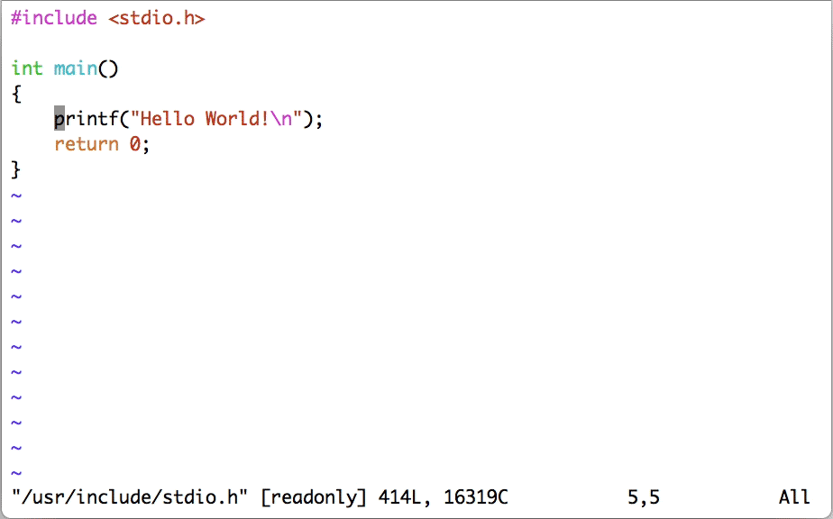
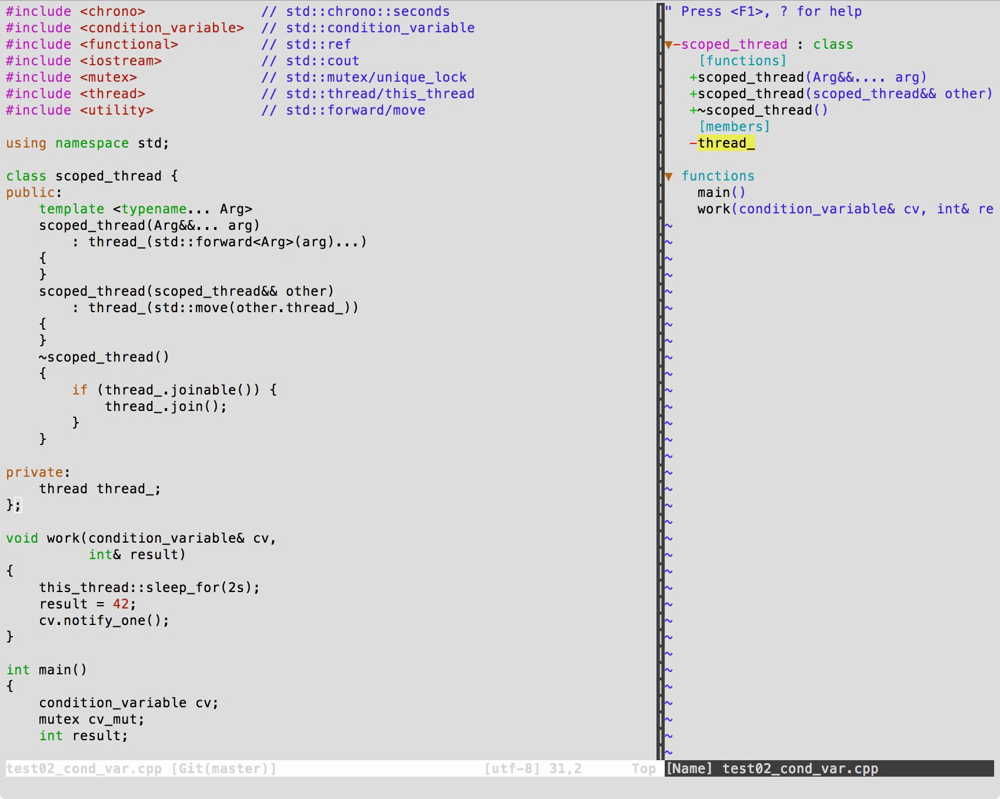
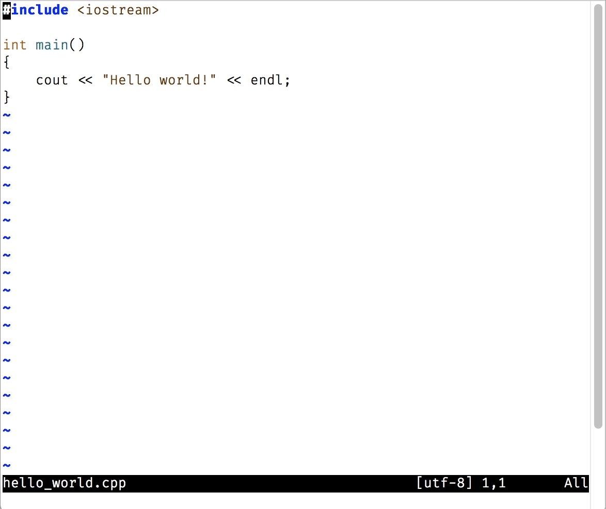
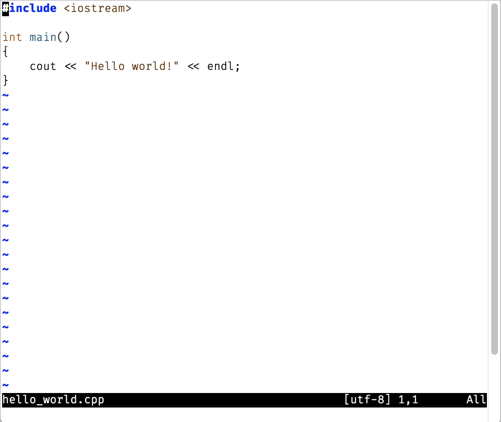
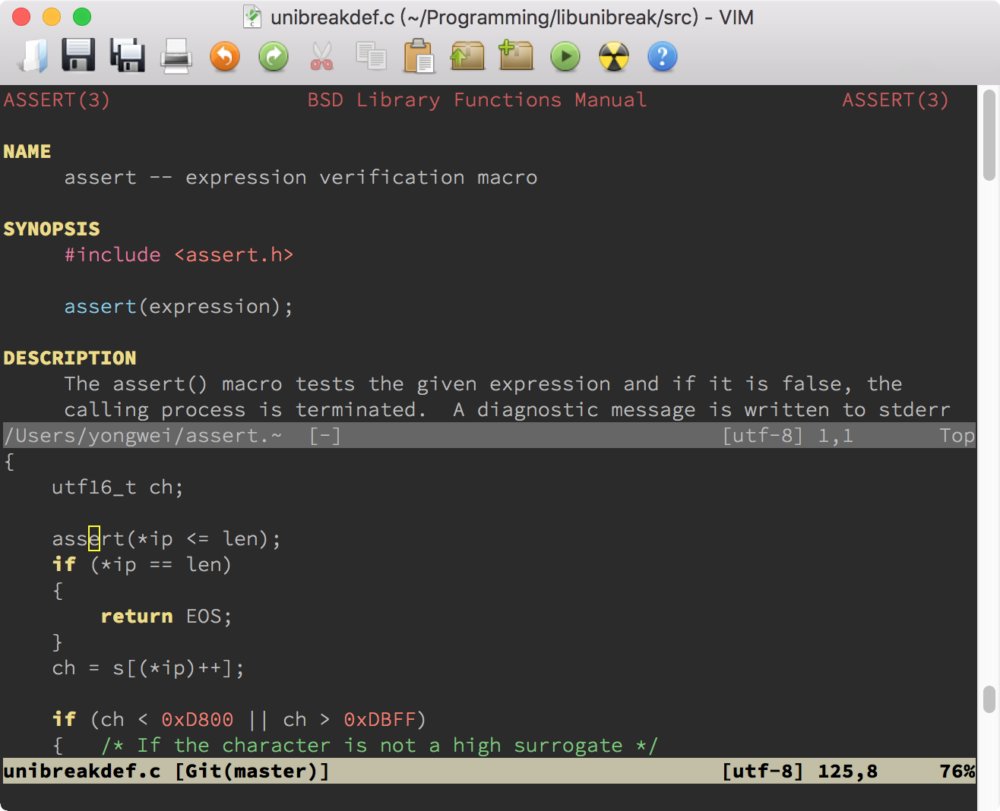

# 08｜基本编程支持：规避、解决编程时的常见问题
你好，我是吴咏炜。

在前面的几讲里，我们已经学了很多使用 Vim 的基本知识。今天是编程专题，我来专门介绍一下 Vim 对编程的特别支持。学了这一讲之后，你会进一步了解 Vim 编辑程序时的重要特性，并能够规避、解决编程时的常见问题。

## 文件类型和关联设定

程序源代码通常由文件组成，每个文件都有一个关联的文件类型。这个文件类型决定了 Vim 对其进行处理的一些基本设定，可能包括：

- 如何对文件进行高亮
- 制表符（tab）的宽度（空格数）
- 是否在键入 `<Tab>` 时扩展为空格字符
- 每次缩进的空格数（是的，可以和制表符宽度不同）
- 采用何种自动缩进方法
- 其他可适用的选项

**文件高亮** 通常需要一套相当复杂的规则，我们今天就只把它当成一个既成事实了，不讨论这些规则的细节。其他各项在 Vim 里一般以选项的形式出现。这些选项都是文件本地（local）选项，即可以在一个文件里修改其数值而不影响其他文件。对于这样的选项，可以用 `:setlocal` 和 `:setglobal` 命令分别访问本地值和全局值。一般的 `:set` 命令在读取数值时（如 `:set tabstop?`）返回本地值，在写入数值时（如 `:set tabstop=4`）同时设置本地值和全局值。

**制表符宽度** 对应的选项是 `tabstop`。这在不同的语言里可能有不同的惯例，自然不必多说。它的缺省值是 8，但在不同的文件里可以不一样。不同的文件类型也可能会自动设定不同的数值。

是否 **扩展 `<Tab>` 为空格** 由 `expandtab` 选项控制。我们前面看到过，但没有讲过，Vim 选项有些是用等号赋值的，也有些不用等号，而只用选项名称或选项名称前面加 `no`，表示否定。这些就是布尔类型选项， `expandtab` 也是其中之一。如果打开了 `expandtab` 选项，那输入中的 tab 会被转变成空格；如果关闭的话，则 tab 字符会被保留。

让事情变得更复杂的是，Vim 还有个 `softtabstop` 选项， **软制表符宽度**。一旦设置了这个选项为非零值，再键入 `<Tab>` 和 `<BS>`（退格键），你就感觉像设置了这个宽度的 `tabstop` 一样，有相应数量的缩进或取消缩进，但实际插入的字符仍然受 `expandtab` 和 `tabstop` 两个选项控制。在设置软制表符宽度时，一种最常用的用法是同时设置 `expandtab`，这样，编辑时你感觉像使用了这个宽度的制表符一样，但你输入的内容里实际被保存的仍然是空格字符。

这些还不是 Vim 真正使用的“缩进”值。以 C 语言为例，当 Vim 看到你输入“{”和回车键时，会自动产生一个缩进，而这个缩进值跟 `tabstop` 和 `softtabstop` 都无关，是一个独立的选项 `shiftwidth`。

最后，Vim 还有很多精细的选项来控制如何进行 **缩进**。默认情况下，Vim 没有特殊缩进，回车键回到行首。一般而言，使用选项 `autoindent` 可以使 Vim 至少记住上一行的缩进位置；而对于特定语言，Vim 可以设置更合适的选项，达到更佳的缩进效果——如对类 C 语言 Vim 会设置 `cindent` 选项，达到最优的缩进效果。我们下面还会提到，Vim 支持对类 C 语言的缩进有一些精调选项，你也可以自己进一步进行调整。

* * *

我之前提到过，Vim 会根据文件类型来设置选项。所以，相关问题就是，Vim 如何判断文件类型，如何根据文件类型来设置选项，以及我们该如何定制这些行为。我们下面就来一一作答。

### 文件类型判断

Vim 的文件类型判断是在 filetype.vim 中执行的。我们可以用下面的命令来打开这个文件：

```vim
:e $VIMRUNTIME/filetype.vim

```

这个文件相当复杂，但有编程功底的你，应该可以看出大概的意思吧？其中最主要的逻辑仍然是通过后缀来进行判断，如：

```vim
" C++
au BufNewFile,BufRead *.cxx,*.c++,*.hh,*.hxx,*.hpp,*.ipp,*.moc,*.tcc,*.inl setf cpp

```

其中 `au` 是 `autocmd` 的缩写，代表 Vim 在发生某事件时触发某一动作。上面说的就是在创建（ `BufNewFile`）或读入（ `BufRead`）跟指定文件名模式匹配的文件时，把文件类型设为 C++（ `setf cpp`， `setf` 是 `setfiletype` 的缩写）。

但在后缀不足以唯一判断时，Vim 可以进一步执行代码，如：

```vim
au BufNewFile,BufRead *.h			call dist#ft#FTheader()

```

上面函数的定义在文件 $VIMRUNTIME/autoload/dist/ft.vim 里：

```vim
func dist#ft#FTheader()
  if match(getline(1, min([line("$"), 200])), '^@\(interface\|end\|class\)') > -1
    if exists("g:c_syntax_for_h")
      setf objc
    else
      setf objcpp
    endif
  elseif exists("g:c_syntax_for_h")
    setf c
  elseif exists("g:ch_syntax_for_h")
    setf ch
  else
    setf cpp
  endif
endfunc

```

它的大概意思是，如果在头 200 行里找到某行以 `@interface` 等内容开始，那就认为这是 Objective-C/C++，否则认为是 C/C++。具体是 C 还是 C++，则由全局变量 `g:c_syntax_for_h` 控制（我们忽略 Ch 这种小众情况）。详细语法我们就不展开讲述了，留待讨论 Vim 脚本的时候再看。

上面讲的是 Vim 的缺省行为。我们当然也可以定制 Vim的行为。按照惯例，一般把定制放在用户 Vim 配置目录里的 filetype.vim 里。我的定制如下所示：

```vim
if exists("did_load_filetypes")
  finish
endif

function! s:CheckCPP()
  if expand('%:t') !~ '\.'
    setfiletype cpp
  endif
endfunction

augroup filetypedetect
  au! BufRead,BufNewFile *.asm      setfiletype masm
  au! BufRead proxy.pac             setfiletype javascript
  au! BufRead */c++/*               call s:CheckCPP()
  au! BufRead */include/*           call s:CheckCPP()
augroup END

```

我们可以跳过一些语法方面的细节，只讨论代码里的意图。上面这段代码主要做了以下事情：

- 当读入或创建后缀为“.asm”的文件时，设置文件类型为微软宏汇编（默认为 GNU 的汇编格式）。
- 当读入名字为“proxy.pac”的文件时，把内容当成 JavaScript 解释。
- 当读入路径含“c++”或“include”的文件时，调用脚本内部函数 `CheckCPP`，检查文件名（ `%` 代表文件名， `:t` 代表尾部，即去掉路径部分）是否不含“.”，是的话当成 C++ 文件类型。这是为了处理像“memory”这样的无后缀 C++ 头文件。
- 随后 Vim 会继续载入自带的 filetype.vim；如果文件类型还未确定的话，则继续使用 Vim 自带的规则进行判断。

### 文件类型选项

一旦确定了文件类型，Vim 会从运行支持文件目录下载入同名的文件。以 Python 为例：

- syntax/python.vim 包含了如何对 Python 进行语法加亮的设置
- indent/python.vim 包含了如何对 Python 代码进行缩进的设置（如在用户输入 `if` 时进行缩进等）
- ftplugin/python.vim 是文件类型插件，包含了其他跟文件类型相关的设置

文件类型插件中包含我们上面提到的制表符宽度方面的设定，具体来说，是下面这几行：

```vim
if !exists("g:python_recommended_style") || g:python_recommended_style != 0
    " As suggested by PEP8.
    setlocal expandtab shiftwidth=4 softtabstop=4 tabstop=8
endif

```

默认情况下，该文件使用 [PEP 8](https://www.python.org/dev/peps/pep-0008/) 推荐的设置：

- 把用户输入的制表符扩展成空格
- 缩进和软制表符宽度设为 4
- 如果文件中包含制表符的话，仍按宽度为 8 来解释

缩进和软制表符宽度设成 4 估计不需要解释，这应该是最常用的缩进值了。使用空格而不是制表符的最大好处是，在无论何种环境下，展示效果都可以完全一致，不会在 diff 时或制表符宽度不符合预期时代码就乱了。至于“硬”制表符宽度仍然是 8，则是为了确保显示文件的兼容性，尤其是在终端里 cat 文件时和在浏览器中浏览源代码时；这两种情况下，制表符宽度一般都是 8。

跟 Python 不同，很多其他文件类型没有推荐的风格设定，这时就应该用户自己进行设定了。我推荐在 vimrc 配置文件里进行设置，因为比较集中、容易管理。如：

```vim
au FileType c,cpp,objc  setlocal expandtab shiftwidth=4 softtabstop=4 tabstop=4 cinoptions=:0,g0,(0,w1
au FileType json        setlocal expandtab shiftwidth=2 softtabstop=2
au FileType vim         setlocal expandtab shiftwidth=2 softtabstop=2

```

上面设置了几种不同文件类型的编辑选项。大部分我们都已经知道了，下面这个则是新的：

- `cinoptions` 可以精调 C 风格缩进的方式；上面 `:0` 表示 `switch` 下面的 `case` 语句不进行额外缩进， `g0` 代表作用域声明（ `public:`、 `private:` 等）不额外缩进， `(0` 和 `w1` 配合代表没结束的圆括号里的内容折行时不额外缩进。

我们也可以根据文件类型以外的条件来进行设定，如下面设定是要把 /usr/include 目录下的文件按 [GNU 编码风格](https://www.gnu.org/prep/standards/) 来解释：

```vim
function! GnuIndent()
  setlocal cinoptions=>4,n-2,{2,^-2,:2,=2,g0,h2,p5,t0,+2,(0,u0,w1,m1
  setlocal shiftwidth=2
  setlocal tabstop=8
endfunction

au BufRead /usr/include/*  call GnuIndent()

```



当然，除了设定选项，我们也可以做其他事情，比如下面的代码是在 Vim 帮助文件中，将 `q` 设定为关闭窗口的按键，映射中的 `<buffer>` 表示该映射只对这个缓冲区有效。

```vim
au FileType help  nnoremap <buffer> q <C-W>c

```

## Tags 支持

Vim 对一种叫 tags 的文本索引格式有特殊支持。事实上，Vim 自己的帮助文件都是用 tags 来索引的。我们用过了 Vim 帮助，也就用过了 tags 文件。下面展示了 $VIMRUNTIME/doc/tags 文件中的一部分：

```tags
?       pattern.txt     /*?*
?<CR>   pattern.txt     /*?<CR>*
@       repeat.txt      /*@*
@/      change.txt      /*@\/*
@:      repeat.txt      /*@:*
@=      change.txt      /*@=*
@@      repeat.txt      /*@@*
@r      eval.txt        /*@r*
A       insert.txt      /*A*
ACL     editing.txt     /*ACL*
ANSI-C  develop.txt     /*ANSI-C*

```

我们可以清楚地看到，其中内容分为三列：第一列是关键字，第二列是文件名，第三列是在目标文件中的匹配文本。当你在 Vim 的帮助文件中使用双击或 `<C-]>` 等命令跳转时，Vim 就会在 tags 文件中搜索，寻找到匹配项的时候就跳转到指定的文件，并利用匹配文本跳转到指定的位置。

注意我们有不止一个 tags 文件。单单从 Vim 帮助的角度，个人 Vim 配置目录下的 doc 目录里有一个 tags 文件；每当你装了一个新的带帮助文件的 Vim 插件时，你都需要到这个 doc 目录下运行 `helptags .` 来重新生成索引。每个 Vim 软件包的 doc 目录下也同样需要有 tags 文件，不过包管理器能够在安装、更新时自动帮我们在 doc 目录下生成 tags 文件。Vim 在你使用 `:help` 命令查帮助时，会自动在你的所有运行时目录（可以使用 `:set runtimepath?` 查看）下的 doc/tags 里查找第一个匹配项。

### 生成 tags 文件的工具

如果 tags 文件只支持 Vim 帮助文件的话，那我就没必要对其进行详细讨论了。之所以在这里讨论 tags，是因为它可以用在编程语言上。要生成 Vim 可以使用的支持常用编程语言的 tags 文件，我们需要使用下列两个工具之一：

- [Exubertant Ctags](http://ctags.sourceforge.net/)
- [Universal Ctags](https://ctags.io/)

Exuberant Ctags 是已经存在了好多年的老牌工具。Windows 下可直接下载可执行程序，而 Linux 和 macOS 上的包管理器一般也直接支持。如：

- Ubuntu 下可使用 `sudo apt install exuberant-ctags`
- CentOS 下可使用 `sudo yum install ctags`
- macOS Homebrew 可使用 `brew install ctags`（但需要注意 macOS 本身提供了一个功能较简单的 ctags 命令，你可能需要将 /usr/local/bin 在路径里移到 /usr/bin 前面，或自己设置 alias，确保优先使用 /usr/local/bin/ctags）

Universal Ctags 还比较新，目前各操作系统的包管理器里多半还没有它，所以安装会麻烦一点。你需要自己查看文档，找到在你的操作系统上的安装方式。（我是直接从源代码编译了一个版本。）

我之所以要推荐 Universal Ctags，是因为虽然 Exuberant Ctags 和 Universal Ctags 都支持超过 40 种的常见编程语言，但 Exuberant Ctags 的最后一个版本 5.8，发布于 2009 年，之后就一直没有更新了。Universal Ctags 是基于 Exuberant Ctags 代码的改进版本，并把开发移到了 GitHub 上，项目一直处于活跃状态。想偷懒的话，可以直接使用 Exuberant Ctags；如果愿意折腾一下，或者明确遇到 Exuberant Ctags 的问题，则可以试试 Universal Ctags。

对于现代 C++ 代码，使用 Universal Ctags 还是挺重要的。老的 Exuberant Ctags 不能处理 C++11 以来的新语法——这当然也是件显而易见的事。

### 生成 tags 文件的命令

要生成 tags 文件时，你可以简单地进入到一个目录下，然后执行下面的语句对该目录及子目录下的程序源文件生成一个 tags 文件：

```bash
ctags -R .

```

但根据场景和语言不同，你可能需要使用更多的选项。比如，对于 C++，我一般使用：

```bash
ctags --fields=+iaS --extra=+q -R .

```

如果是对系统的头文件生成 tags 文件——可以用来查找函数的原型信息——那我们一般还需要加上 `--c-kinds=+p` 选项。为了一次性地对系统头文件简单地生成 tags 文件，我还专门写了个脚本 [gen\_systags](https://github.com/adah1972/gen_systags) 来自动化这项工作。你如果感兴趣的话，也可以点进去看一下。

鉴于我们主要讲 Vim 而不是 Ctags，这个话题我暂时就点到为止、不展开了。你可以通过我给出的链接，以及 `man ctags` 或 `ctags --help` 的输出，自己进一步学习一下。讲到 C 的工作环境时，我们会再回到 Ctags。

### 使用 tags 文件

如果当前目录下或当前文件所在目录下存在 tags 文件，Vim 会自动使用这个文件，不需要你做额外的设定。你所需要做的就是在待搜索的关键字上（也可以在可视模式下选中需要的关键字）使用正常模式命令 `<C-]>`，或者按 `g`（ `g` 可理解成 go）键加鼠标单击。你愿意的话，也可以手工输入命令 `:tag` 后面跟空格和待搜索的符号加回车键。这样 Vim 即会跳转到该符号的定义或声明位置。



如果待搜索的符号找不到，Vim 会报错“E426: tag not found”。如果存在一个或多个匹配项，Vim 会跳转到第一个匹配的位置。下面我列举一下其他相关的常用命令：

- `:tnext`（缩写 `:tn`）跳转到下一个标签匹配位置
- `:tNext`（缩写 `:tN`）或 `:tprevious`（缩写 `:tp`）跳转到上一个标签匹配位置
- `:tfirst` 或 `:trewind` 跳转到第一个标签匹配位置
- `:tlast` 跳转到最后一个标签匹配位置
- `:tselect 名称`（ `:tselect` 可缩写为 `:ts`）跟 `:tag` 类似，但会列举可能的匹配项，让你自己选择（而非跳转到第一个匹配位置）
- `g]` 跟 `<C-]>` 类似，但跟 `:tselect` 一样会给出一个列表而非直接跳转
- `:tjump 名称`（ `:tjump` 可缩写为 `:tj`）跟 `:tselect` 类似，但在只有一个匹配项的时候会直接跳转到匹配位置
- `g<C-]>` 跟 `g]` 类似，但跟 `:tjump` 一样在只有一个匹配项时会直接跳转到匹配位置
- `:stselect 名称`（ `:stselect` 可缩写为 `:sts`）跟 `:tselect` 类似，但结果会打开到一个新分割的窗口中
- `:stjump 名称`（ `:stjump` 可缩写为 `:stj`）跟 `:tjump` 类似，但结果会打开到一个新分割的窗口中

我们的标签跳转分为 `:tag`、 `:tselect` 和 `:tjump` 三种不同方法，正常模式和可视模式的命令 `<C-]` 也同样有后两种方法的变体，对应的命令分别是 `g]` 和 `g<C-]>`。这三个命令前面也都可以额外加上 `<C-W>`，表示结果打开到新窗口中而非当前窗口。



Vim 默认只在当前目录下和文件所在目录下寻找 tags 文件。对于含多层目录的项目，这个设定就不合适了。解决方法是使用 Vim 的选项 `tags`。一个小技巧是根据项目的可能深度，检查上层存在的 tags 文件：

```vim
" 加入记录系统头文件的标签文件和上层的 tags 文件
set tags=./tags,../tags,../../tags,tags,/usr/local/etc/systags

```

`tags` 选项的默认值是 `./tags,tags`，即检查文件所在目录下的 tags 文件和当前目录下的 tags 文件。上面这样的写法还会额外检查父目录下的 tags 文件，祖父目录下的 tags 文件，以及我们上面用 gen\_systags 生成的 systags 文件。这对一个有不超过三层目录结构的项目来讲就足够了。如果你的项目目录层次更深，也只需要在 `tags` 选项里添加 `../../../tags` 这样的内容即可。

### Tagbar 插件

根据上面的描述，我们可以看到 Ctags 是一个可以从源代码中提取符号的工具。事实上，这个工具在我们不生成 tags 文件也都是有用的。Vim 的插件 tagbar 就可以利用 Ctags 来提取符号，生成源代码的结构图。只要 Ctags 能支持这种语言，插件就能“识别” 这种语言，来生成结构图；识别的好坏程度也视 Ctags 对其的支持程度而定。下面是一个示例：



跟之前类似，假设使用 minpac 的话，我们需要在 vimrc 中“Other plugins”那行下面加入下面的语句，并运行 `:PackUpdate` 来安装一下：

```vim
call minpac#add('majutsushi/tagbar')

```

我给它映射了快捷键 `<F9>`，可以快速打开和关闭 Tagbar 的窗口：

```vim
" 开关 Tagbar 插件的键映射
nnoremap <F9>      :TagbarToggle<CR>
inoremap <F9> <C-O>:TagbarToggle<CR>

```

## Quickfix 窗口

Vim 里有一种特殊类型的窗口，被称作 quickfix（快速修复）。这个窗口中会展示外部命令的结果，并可以通过这个窗口中的内容直接跳转到特定文件的特定位置。这个设计最初是用来加速“编辑-编译-编辑”这个循环的，但它的实际用处并不只是用来编译程序。

我们先来看一下 Vim 的 `:make` 命令。如果你的代码可以简单执行 `make` 来编译的话（也就是说，你已经写了或者生成了合适的 Makefile），你可以尝试直接在 Vim 里执行 `:make`。你会看到正常的执行过程。唯一不一样的地方是，如果编译失败了，Vim 会自动跳转到第一个出错的位置！



如果使用 `:copen` 命令，我们就可以打开 quickfix 窗口。在里面我们可以看到完整的出错信息，并能通过颜色看出 Vim 解析了文件名和行号。我们在带文件名的行上双击即可跳转到对应位置。另外，我们在 quickfix 窗口中也有跟之前类似的“next”类命令：

- `:cnext`（缩写 `:cn`）跳转到下一个出错位置
- `:cNext`（缩写 `:cN`）或 `:cprevious`（缩写 `:cp`）跳转到上一个出错位置
- `:cfirst` 或 `:crewind` 跳转到第一个出错位置
- `:clast` 跳转到最后一个出错位置

事实上，在这些下一个、上一个的命令中，我用得最多的就是这个快速修复里的跳转了。为了方便记忆，我对它们都映射了相似的快捷键。

```vim
" 用于 quickfix、标签和文件跳转的键映射
nmap <F11>   :cn<CR>
nmap <F12>   :cp<CR>
nmap <M-F11> :copen<CR>
nmap <M-F12> :cclose<CR>
nmap <C-F11> :tn<CR>
nmap <C-F12> :tp<CR>
nmap <S-F11> :n<CR>
nmap <S-F12> :prev<CR>

```

这是我的映射，你可以根据自己的需要进行调整。另外要留意的一点是，取决于环境，不是所有的快捷键都能被 Vim 接收到，尤其在使用终端和远程连接的时候。比如，在 Mac 上有些快捷键已经被系统占用，并且终端基本不接受修饰键；在 Windows 的远程连接客户端里，PuTTY 不支持使用 Alt 的快捷键，但 mintty 就可以。

### `:make` 命令的其他细节

Vim 里的 `:make` 命令缺省会执行 make 命令，并且这是可以通过选项 `makeprg` 来进行配置的。比如，如果你希望启用四路并发编译，你就可以设置 `:set makeprg=make\ -j4`。你也可以使用 GNU Make 之外的构建工具，但需要注意的是，如果发现 Vim 不能识别你使用的构建工具产生的错误信息，你可能需要利用 `errorformat`（ [`:help errorformat`](https://yianwillis.github.io/vimcdoc/doc/quickfix.html#errorformat)）选项来告诉 Vim 如何处理错误信息。

### `:grep` 命令

对我而言，跟构建使用频度至少一样高的命令是搜索，也就是根据关键字找到相关的源代码。这就可以使用 Vim 的 `:grep` 命令。跟 `:make` 命令相似，Vim 会调用一个合适的外部程序（可通过 `grepprg` 选项来进行配置）来进行搜索，并从结果中找到文件名、行号等信息。注意：在 Windows 上如果 Vim 没找到 grep 的话，它会调用 Windows 自带的 findstr 命令行工具；为了获得跟其他平台相同的体验和跟 Vim 本身相似的正则表达式，我强烈推荐你在 Windows 上也安装 grep 工具。我们上一讲讲到的搜索模式，大部分在 grep 里可以原封不动地使用，尤其是对 `\?`、 `\+`、 `\<` 和 `\>` 的解释。考虑到 vi 源自 Bill Joy，grep 源自 Ken Thompson，两者的老祖宗都是 ed，这自然也不是件令人意外的事。

如果使用 grep 命令的话，我们的命令大致如下所示：

```vim
:grep '要查找的符号' 文件名列表

```

当然，grep 支持的复杂参数我们都可以用上。比如，下面的命令可以在所有的子目录里查找用到了 `printf` 的 .c 和 .h 文件：

```vim
:grep -R --include='*.c' --include='*.h' '\<printf\>' .

```

**小提示：** 在查看搜索结果时，适时使用 `zz`（或 `zt`、 `zb`）重定位当前行在屏幕上的位置，可能可以更清晰地查看前后的相关代码。

### 异步支持

上面这些命令，都有一个缺点：在执行过程中你干不了其他事情。对于执行过程可能较慢的 make，这个问题尤其严重。幸好，在 Vim 8 支持异步任务之后，这个问题也得到了解决。我们利用一个插件，就可以获得类似在一些集成开发环境中的体验，在构建过程中仍然可以继续做其他事情。

我们首先需要安装一个插件 asyncrun.vim。跟前面类似，假设我们使用 minpac 的话，我们需要在 vimrc 中的合适位置加入下面这行：

```vim
call minpac#add('skywind3000/asyncrun.vim')

```

我们还需要一个跟 `:make` 相似的命令。我使用下面的命令定义（今天我们重点看使用，定义的细节就不讨论了）：

```vim
" 和 asyncrun 一起用的异步 make 命令
command! -bang -nargs=* -complete=file Make AsyncRun -program=make @ <args>

```

这个命令同样会使用 `makeprg` 选项。不过，还有个问题是默认情况下屏幕上看不到执行过程的信息。我们可以让 asyncrun 在执行命令时立即打开 quickfix 窗口：

```vim
" 异步运行命令时打开 quickfix 窗口，高度为 10 行
let g:asyncrun_open = 10

```

对于 C/C++ 程序员来讲，启动和停止构建应该是一个很频繁的操作吧。所以，我也给它分配了一个快捷键：

```vim
" 映射按键来快速启停构建
nnoremap <F5>  :if g:asyncrun_status != 'running'<bar>
                 \if &modifiable<bar>
                   \update<bar>
                 \endif<bar>
                 \exec 'Make'<bar>
               \else<bar>
                 \AsyncStop<bar>
               \endif<CR>

```

上面的代码通过判断异步任务状态和窗口是否可修改，还会自动执行保存文件和终止构建等操作。建议你自己尝试一下。鉴于我们本讲内容已经很多了，我们暂时就不讲解了。



## 查看文档

Vim 里快捷键 `K` 可以用来查看光标下关键字的相关文档。它的行为是由选项 `keywordprg`（ [`:help 'keywordprg'`](https://yianwillis.github.io/vimcdoc/doc/options.html#'keywordprg')）控制的。这个选项的缺省值是 `man`，表示查看 Unix 的 man 手册，很多文件类型插件会对当前缓冲区设置一个更合适的值，如 Vim 脚本就会直接把行为改成调用 `:help` 命令。

查看 man 手册的默认行为通常只在终端工作良好，而在图形界面 Vim 里会出现显示问题。我推荐使用 Vim 内置的 man 插件，并把全局的 `keywordprg` 设成 `:Man`：

```vim
" 启用 man 插件
source $VIMRUNTIME/ftplugin/man.vim

set keywordprg=:Man

```

这样，我们在使用 `K` 命令时，将在 Vim 里直接打开 man 手册，效果如下所示：



你看，是不是就方便多了？

## 内容小结

今天我们讨论了 Vim 中对编程的基本支持，包括：

- Vim 使用编程规则来判断文件类型，逻辑放在文件 filetype.vim 里。
- Vim 里有很多设置文件格式的选项，自动设置一般在 ftplugin 和 indent 目录下；我们可以简单地在 vimrc 配置文件中进行定制。Vim 通过 `cindent` 和 `cinoptions` 选项，对类 C 的语言提供了相当细颗粒的缩进风格支持。
- Vim 对 tags 文件提供了完整的支持，Ctags 工具可以对超过 40 种主流编程语言生成 tags 文件，供 Vim 和 Tagbar 使用。
- Vim 里通过 quickfix 窗口，对构建和搜索提供了内置支持；从 Vim 8 开始，我们可以使用异步支持，在构建时继续进行编辑。
- Vim 里通过 `K` 命令，可以快速地查阅文档；通过 man 插件，我们可以直接在 Vim 里查阅 man 手册。

本讲我们的配置文件更改较多，请仔细检查一下其中内容。对应的标签是 `l8-unix` 和 `l8-windows`。

## 课后练习

今天的内容不难，但较多较杂。请你务必自己试验一下我上面总结的这些功能，来加深对这些功能的理解。要提高编辑的效率，熟悉基本功能一定是必要的。

- 不管你用什么语言编程，找出 Vim 是如何判断你的源代码文件类型的。
- 看看你能不能找出 Vim 对你使用的编程语言有没有附加的设置（可选）。
- 尝试一下 Ctags，并用 `<C-]>` 来跳转到某个符号的定义。
- 如果你的语言有构建过程，尝试异步的构建过程。
- 尝试使用 `:grep` 命令来在你的源代码中搜索某一符号。
- 对于 C 系语言，尝试使用 `K` 命令来查阅文档。

我是吴咏炜，我们下一讲再见。