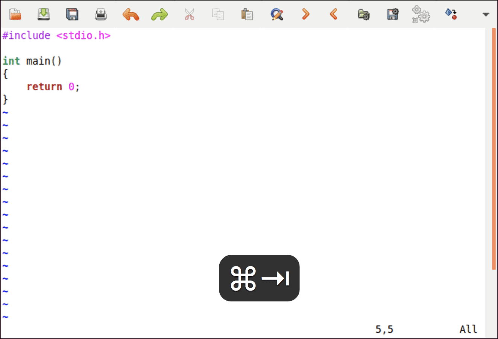
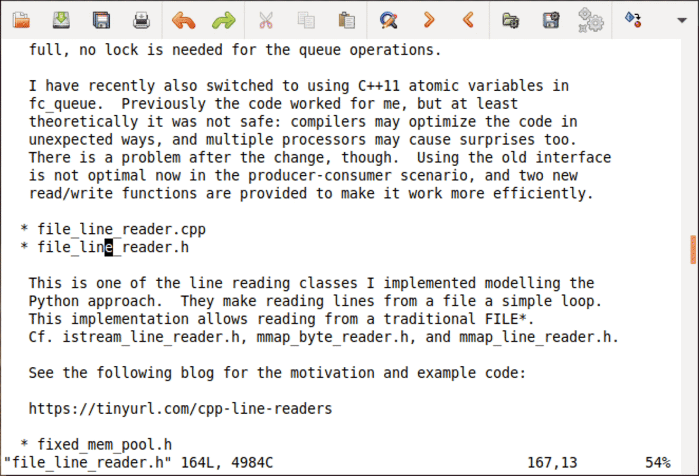
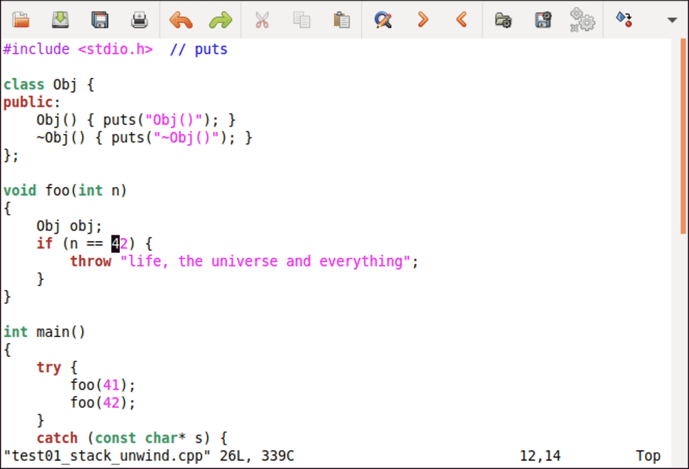
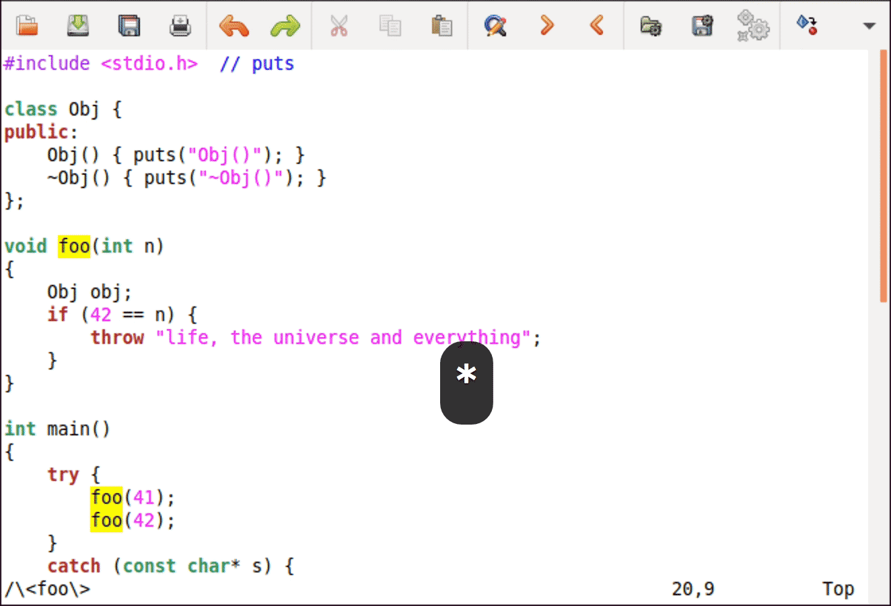
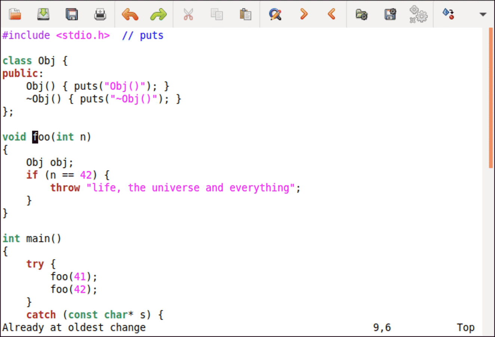
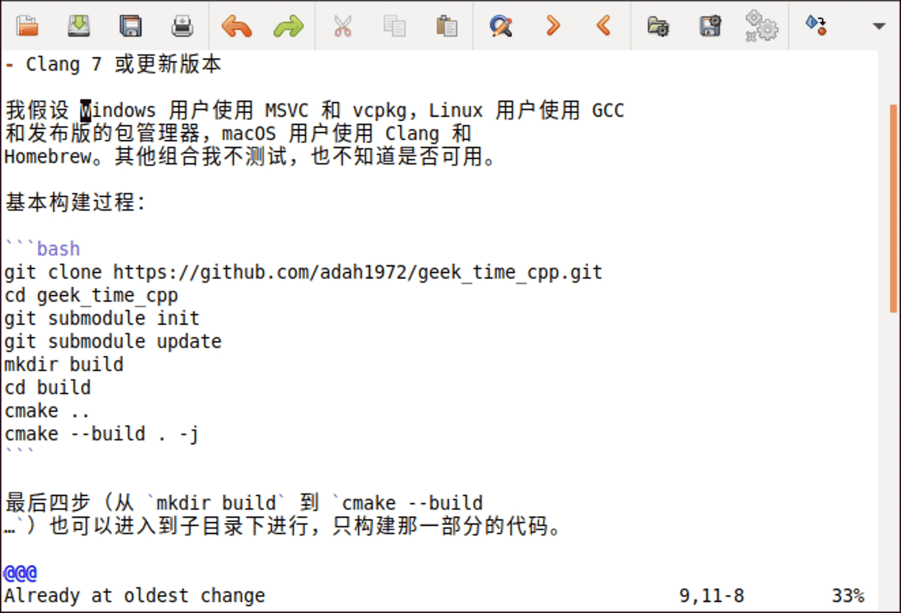
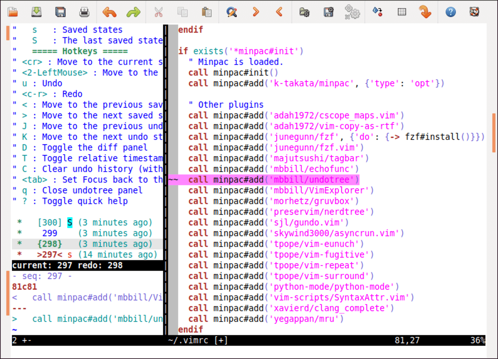

# 09｜七大常用技巧：让编辑效率再上一个台阶
你好，我是吴咏炜。

学到这里，你应该已经初步掌握 Vim 了。我们这一讲来重点看一下 Vim 里的七大常用编辑技巧。有些技巧你直接就可以用，有些则需要安装第三方插件。但无论是哪种情况，它们都可以大大提高你的编辑效率。

从这一讲开始，我们将不再讨论插件的安装过程，而只是给出像 skywind3000/asyncrun.vim 这样的名称。相信你学到现在应该已经不需要我再详细讲述这样的基础知识了。如果你对安装插件还不太熟练的话，请复习第 4 讲。接下来，我们正式开始今天的内容。

## 自动完成

自动完成是一个编辑器中很主流的功能了。通常，我们希望编辑器能在我们输入一部分内容时就能猜到我们希望输入的是什么，并能够予以提示。自动完成可以节约我们输入的工作量，是一件编辑中非常必要的利器。

Vim 内置有自动完成功能。最基本的自动完成功能有两种：

- 基于当前文件文本的自动完成
- 基于文件系统的自动完成

我们先说 **基于当前文件文本** 的自动完成。在当前文件里，或当前文件用 `#include`（C 类语言的情况）包含的文件里包含某个关键字时，你可以输入头若干个字母并按下 `<C-P>`（表示 previous）或 `<C-N>`（表示 next）来进行自动完成。这两者的区别是， `<C-P>` 是从当前位置往前找，而 `<C-N>` 是从当前位置往后找。当只有一个匹配项时，Vim 直接给出完成结果，再次按下 `<C-P>` 或 `<C-N>` 则取消自动完成。当存在多个匹配项时，Vim 会根据搜索顺序给出匹配项列表并使用第一个匹配项；再次按下 `<C-P>` 或 `<C-N>` 则可以在列表里进行选择。

Vim 的缺省选项能帮你在 Unix 系统上找到系统的头文件，利用里面出现的关键字来完成。想要在其他语言或平台里找到当前文件“包含”的文件里的关键字，请参考下列选项帮助：

- [`:help include`](https://yianwillis.github.io/vimcdoc/doc/options.html#'include')
- [`:help includeexpr`](https://yianwillis.github.io/vimcdoc/doc/options.html#'includeexpr')
- [`:help isfname`](https://yianwillis.github.io/vimcdoc/doc/options.html#'isfname')
- [`:help path`](https://yianwillis.github.io/vimcdoc/doc/options.html#'path')



我们再看一下 **基于文件系统** 的自动完成。当你在插入模式下输入一个绝对路径或者当前目录下的文件/目录名称的一部分时，你可以使用 `<C-X><C-F>` 来启动文件自动完成。在此之后，操作就和前面一样了，你可以使用 `<C-P>` 和 `<C-N>` 在匹配项中跳转和取消。

Vim 里还有其他一些以 `<C-X>` 开始的自动完成功能。比如，你可以用 `<C-X><C-K>` 从配置的词典中选择合适的单词，可以用 `<C-X><C-O>` 进行“代码自动完成”。但这些功能要么不常用，要么在缺省配置下工作得并不好。所以，今天我就暂时不讨论其他自动完成功能了。等到了提高篇和拓展篇，我们再来看英文文本编辑和代码自动完成这两个话题。

最后，要注意任何自动完成功能都可能会重复你的错误。如果你一开始拼错了，后面又拼对了，很可能会发现前面的错误。而一旦使用自动完成，你要是一开始就拼错了，后面可能就会不断重复之前的错误。这当然不是编辑器的错，但作为我曾经见到发生过的问题，我觉得值得提醒你一下。

## 文本目标跳转

如果光标下面是一个计算机可以找到的文件，你一定希望我们有办法可以一下子打开这个文件吧。这正是我们这一节要讨论的技巧。

当光标下的文件名可以在 `path` 选项标识的目录下找到时，我们可以很方便地跳转过去。你需要的是正常模式命令 `gf` 和 `<C-W>f`。估计你很容易猜到，前者是直接跳转到文件（理解为“goto file”），后者则会打开一个新窗口（window），在新窗口里打开该文件。



如果光标下面是一个链接，或者非文本文件，那我们该怎么办呢？显然，即使 Vim 可以打开这个文件，看到的内容也多半不是你想要的（你想看图片，还是把图片当成文本的乱码？）。这时候，最简单的解决方式是使用 netrw 插件提供的 `gx` 命令。它的缺省行为是使用操作系统提供的机制来打开光标下的文件或链接。

比较让人伤心的是，最新版本的 netrw 插件在打开链接时的行为不正常。 [这个问题已经报告有一年了，还没有解决。](https://github.com/vim/vim/issues/4738) 作为临时方案，我在 Vim 配置的目录放了一个可以工作的老版本，你可以把这个文件复制到你的 Vim 配置目录下的 plugin 子目录下来绕过这个问题。此外， `gx` 只适合本机，不适合在远程连接上使用。

## Vim 寄存器/剪贴板

我们已经学到，Vim 的删除和复制命令（如 `d` 和 `y`）会把内容存起来，以供粘贴命令（如 `p` 和 `P`）使用。我们还没有讨论这种内容存储有什么特别的地方。

首先，估计你已经知道的是，Vim 把要粘贴的内容存在 Vim 内部的“寄存器”（register）里，而非系统的剪贴板。你不一定知道的是，Vim 里的寄存器有好多个。事实上，Vim 有超过 40 个不同的寄存器！我们挨个来看一下：

- 首先是无名寄存器。当操作没有用 `"` 加寄存器名称指定寄存器时，我们默认使用无名寄存器。不过，我们仍可以使用 `""` 来指定使用无名寄存器，也就是说， `""p` 和 `p` 效果相同。
- 其次是数字寄存器 `0` 到 `9`。 `0` 号寄存器中放的永远是最近一次复制（yank）的内容。这和无名寄存器很不一样，它里面放的是最近操作的结果，也包括了 `d`、 `x`、 `c` 等命令，特别是包括了粘贴命令所替换的内容。 `1` 到 `9` 号寄存器中放的则是上一次、倒数第二次、直到倒数第九次被删除或修改命令删除的文本。在做少量的用一个名字替换另一个名字、而又懒得使用替换命令时， `"0p` 是一个接近图形界面里的粘贴命令的常用选择。
- 然后有小删除寄存器 `-`。上面我说得不全，删除内容进入 `1` 到 `9` 号寄存器的前提条件是被删除的内容至少有一行，或者使用了移动命令 `%`、 `(`、 `)`、 `` ` ``、 `/`、 `?`、 `n`、 `N`、 `{` 和 `}` 进行删除。否则，删除的内容只会进入 `-` 而不是 `1` 到 `9` 号寄存器。
- 常用的有名寄存器 `a` 到 `z`。这些寄存器仅在用户手工指定时才会使用，内容在下一次打开 Vim 时仍然存在。比如，我们可以用 `"ayy` 代替 `yy` 把当前行复制到 `a` 寄存器中，以后就一直可以用 `"ap` 来进行粘贴了，直到 `a` 寄存器的内容被替换为止。
- 不常用的特殊寄存器 `.` 、 `:`、 `#` 和 `%`。这些相对来说不那么常用，请自行查看帮助文件 [`:help ".`](https://yianwillis.github.io/vimcdoc/doc/change.html#quote.) 等。
- 黑洞寄存器 `_`。专门用来删除，目的就是不要影响无名寄存器的内容。
- 搜索寄存器 `/`。存放是上一次搜索使用的模式。
- 表达式寄存器 `=`。可以把 Vim 表达式估值的结果作为寄存器的内容。这个我们以后讲 Vim 脚本编程的时候再探讨。
- 最后是图形界面剪贴板寄存器 `+`、 `*` 和 `~`。一般而言， `+` 寄存器代表操作系统的剪贴板，和图形界面应用程序交互用这个就好；你用图形界面 Vim 菜单里的拷贝和粘贴访问的也是系统剪贴板。 `*` 和 `~` 在 X11 和 GTK 环境下有一些特殊用途，我们目前就不展开了。想深入钻研的话，可以查看帮助文档 [`:help "+`](https://yianwillis.github.io/vimcdoc/doc/gui_x11.html#quoteplus)、 [`:help "*`](https://yianwillis.github.io/vimcdoc/doc/gui.html#quotestar) 和 [`:help "~`](https://yianwillis.github.io/vimcdoc/doc/change.html#quote%7E)。

寄存器在正常模式下可以用 `d`、 `y`、 `p` 等命令来访问，你现在应当已经很清楚了。它们在插入模式和命令行模式下也可以用 `C-R` 加寄存器名来访问，这经常也会省去你很多打字的麻烦。

这些寄存器当然不是每个都常用。具体你是否会用到它们，取决你的工作方式。下面我说几个我自己编辑时的常用场景。

### 常用的寄存器使用场景

如果要 **交换两行内容**，可以直接利用删除命令会把删除的内容放到无名寄存器这个特性。我们在第一行上面按下 `dd`，然后直接按 `p` 粘贴即可。

如果要 **交换两处文本内容**，可以类似地使用删除和粘贴替换都会把内容放到无名寄存器这个特性。我们选中第一处文本，按下 `d` 进行删除；然后选中第二处文本，按下 `p` 进行粘贴；最后回到第一处文本的原来位置，使用 `P` 把文本粘贴回去即可。



如果要 **少量修改某一变量名称**（多的话使用 `:s` 替换命令更合适），可以把光标移到变量名称上，用 `*` 进行开启自动搜索，然后编辑变量名称到合适；随后复制新的变量名称，反复使用 `n` 命令搜索，并用 `ve"0p` 进行替换即可。

当然，反复打 `ve"0p` 真的会感觉这个命令有点长。鉴于这个组合键使用的频度还挺高，我觉得映射一个更短的按键比较好，我的选择是 `\v`，同时，我做了点更通用的处理：

```vim
" 替换光标下单词的键映射
nnoremap <Leader>v viw"0p
vnoremap <Leader>v    "0p

```

关于 `<Leader>` 的含义，可查看帮助文档 [`:help <Leader>`](https://yianwillis.github.io/vimcdoc/doc/map.html#mapleader)，里面说得很清楚，我就不重复了。如果你忘了 `viw` 的意义，请复习一下第 3 讲里的文本对象。



### 宏的录制和播放

Vim 里可以用 `q` 把动作记录到寄存器里，然后使用 `@` 来播放这些动作。上面这个变量更名，如果用宏来做也可以：

- 用 `*` 开启搜索
- 键入 `qa` 开始录制宏到 `a` 寄存器；当然我们可以使用其他寄存器，只要被录制的命令不会修改这个寄存器即可，所以一般使用 `a` 到 `z` 这 26 个有名寄存器
- 键入 `n` 进行搜索；先行搜索的目的是，如果搜索不到内容，命令出错，宏的剩余部分就不会被执行
- 键入 `eabar<Esc>` 把 `foo` 修改为 `foobar`
- 键入 `q` 结束宏录制
- 键入 `@a` 播放录制的宏
- 重复上一步直到 Vim 报告找不到 `foo` 为止



关于宏的进一步细节可以查看帮助文件（ [`:help q`](https://yianwillis.github.io/vimcdoc/doc/repeat.html#q)），我就不展开了。

从上一节的 `\v` 到宏再到 `:s` 命令，对我们当前的任务而言，自动化程度逐步上升，但交互性逐步下降，“僵硬”性也逐步上升。对于重复遍数较多、信心较高的修改，我们应当偏向使用更自动化的方式，对于重复遍数较少或信心较低的修改，我认为使用不那么自动化的方式更有助于实时检查修改的效果。

今天关于寄存器和复制粘贴我们就讲到这里。我们以后还会有讨论到寄存器的时候。

## 文本对象增强

Vim 对文本对象的支持我已经在第 3 讲里讨论过了。那些当然是很不错的功能，不过，能不能在那些功能的基础上再进一步，做出更有用的功能呢？对于写了多个 Vim 插件的 Tim Pope 来说，答案是肯定的。

具体来说，如果你安装了他的 tpope/vim-surround 插件，你可以实现下面这些功能：

- 在一个单词的外面加上引号，如把 `word` 变成 `"word"`，可以使用命令 `ysiw"`
- 把一个单词的外面的双引号变成单引号（有强迫症的 Python 程序员很可能有这样的需求），如把 `"word"` 变成 `'word'`，可以使用命令 `cs"'`
- 把外面的引号或括号变成 HTML 标签也没有问题，如把 `[my choice]` 变成 `<em>my choice</em>`，可以使用命令 `cs[<em>`
- 可视模式也有类似的命令，如可以在选中 `my choice` 后，输入 `S<em>` 把文本变成 `<em>my choice</em>`
- 当然，你也可以把加上的包围符号移除，命令是 `ds` 后面跟包围符号，如 `ds"` 可以移除外围的双引号；要移除 HTML 标签则使用 `t` 来表达，即使用 `dst` 来移除文本外面的第一个 HTML 标签

注意 Vim 命令 `.` 只能用来重复 Vim 的内置命令，而不能用来重复上面这样的用户自定义命令。为了解决这个问题，我也会安装 tpope/vim-repeat 插件，使得重复命令对上面这样的情况依然能够生效。



## 撤销树

Vim 不仅支持多级撤销，而且有撤销树的概念。利用撤销树，你可以转回到编辑中的任何一个历史状态。不过，问题是，Vim 用来管理撤销树的命令不那么直观。在使用撤销树的图形化插件之前，我自己也没有把相关的命令真正用好。

著名的撤销树插件我知道两个，一个是 mbbill/undotree，一个是 sjl/gundo.vim。两者功能相似，界面风格和快捷键有所不同。鉴于 undotree 功能更加丰富，我就以它为例来介绍一下。

从下图中可以看到，undotree 可以展示完整修改历史。你可以用 `J` 和 `K` 在历史中跳转，左下角的预览窗口中就会显示修改的内容，右侧文件直接会回到相应的历史状态，并加亮最近的那次修改。一旦用上这个插件，就真的回不到没有这个插件的环境了。



另外需要稍加注意的一点是，一旦这个文件在其他编辑器里修改了，Vim 发现内容对不上，就无法保留编辑的历史。有一个绕过方法是，当你需要使用其他编辑器修改前，确保你在 Vim 里打开了该文件并且所有修改已保存；这样，在修改完成之后，只要在 Vim 里用 `:e` 命令重新载入该文件，Vim 就可以把外部的修改也保存在撤销历史记录里，保留完整的编辑历史。此外要注意的是， **最后得在 Vim 里使用 `:w` 存盘一次**，才能把编辑历史真正保存下来——即使你在 Vim 里没有进行任何修改，也需要这样做一下才能保存修改的历史。

## 对当前缓冲区的更名和移动

你肯定遇见过文件需要更名或者移动吧。这当然很简单，你可以通过图形界面或命令行进行操作。但这样操作之后，有一个问题是 Vim 的撤销历史跟文件就再也对不上了，你也没法再继续撤销更名或移动前的编辑操作了。有一个 Vim 插件，也是 Tim Pope 写的 tpope/vim-eunuch，可以解决这个问题。

事实上，这个插件的功能远不止更名和移动。它实际上是把 Unix 的很多命令行工具搬到了 Vim 里（比较一下 Unix 和 eunuch 的发音你就知道这个插件的名字是什么意思了）。对我来说，最重要的就是它提供的 `:Rename` 和 `:Move` 命令，后面跟的参数就是新的名字或路径。这样操作之后，以后再打开这个更名或移动后的文件，仍然能够访问它的一切编辑历史。

## 模糊文件查找

使用 NERDTree 的话，你可以通过浏览目录来打开文件。这种方式，对于你知道文件在哪个目录下、但不知道文件名的时候特别有用。另外一种可能的情况是，你知道文件名或其中的关键部分，但你不知道或不关心文件在哪里。这种情况下，Fzf 的模糊匹配就非常有用了。我们先来看一下动画演示，有一个初步的印象：


从动画可以看到，插件使用的是模糊匹配的方式，可以动态展示搜索的结果，并能直接预览当前选中的文件内容（在窗口足够宽的情况下）。因而这种方式不仅快，而且非常直观。

跟其他插件不同的是，fzf.vim 插件依赖于 fzf 命令行工具。在 [fzf](https://github.com/junegunn/fzf) 的页面上列出了具体安装方式，支持各个平台。但由于这个软件比较新，老一点的 Linux 发布版（如 Ubuntu 18.04 和 CentOS 7）在包管理器里还没有 fzf。所以我的安装建议是：

- 对于 macOS，使用 Homebrew 命令 `brew install fzf` 安装。
- 对于 Ubuntu 19.10 或更新版本，使用 `sudo apt-get install fzf` 安装。
- 对于较老的 Ubuntu、CentOS 7 和其他页面中没有列出的 Linux 发布版，直接使用 [二进制发布版本](https://github.com/junegunn/fzf-bin/releases)，一般使用后缀为“linux\_amd64.tgz”的文件。
- 对于 Windows，也使用 [二进制发布版本](https://github.com/junegunn/fzf-bin/releases)，使用后缀为“windows386.zip”（32 位）或“windows\_amd64.zip”（64 位）的文件。

在安装了 fzf 后（可以执行 `fzf` 来验证一下，它会枚举当前目录下的所有文件，并在你输入字符时缩小匹配；按 `<CR>` 选择文件，按 `<Esc>` 取消选择），就可以安装插件了。使用 minpac 的话，我们需要在 vimrc 中加入下面两行：

```vim
  call minpac#add('junegunn/fzf', {'do': {-> fzf#install()}})
  call minpac#add('junegunn/fzf.vim')

```

在安装完成之后，你就可以像我前面展示的那样使用 `:Files` 命令了。更多高级用法可以查看 [fzf.vim](https://github.com/junegunn/fzf.vim) 的页面。

顺便说一句，如果你对安装一个可执行文件有点发怵的话，插件也可以自动帮你下载 `fzf` 命令。但这样做的缺点是，fzf 就只能在 Vim 里面使用了。如果你使用包管理器安装或手工安装，fzf 可以在 Vim 里使用，也可以在 Bash 等其他地方使用——fzf 的 Bash 集成是可以大大提升 shell 的使用体验的，不过这不属于我们 Vim 课程要讨论的话题，就请你自行参阅文档了。

这个插件可以跟其他工具进一步配合。如果你安装了 [ripgrep](https://github.com/BurntSushi/ripgrep) 和 [bat](https://github.com/sharkdp/bat) 的话，可以获得更好的效果。动图中右下角文件预览的语法加亮的效果就依赖于系统里有 bat。如果你装了 ripgrep 的话，可以考虑设置下面的环境变量：

```bash
export FZF_DEFAULT_COMMAND='rg --files --sortr modified'

```

这样的话，fzf 可以利用 ripgrep 来自动过滤掉被 Git 忽略的文件、隐藏文件、二进制文件等程序员通常不关心的内容，并将结果以修改时间倒排，确保最新修改的文件在最下面，大大提高了迅速找到你需要的文件的概率。

## 内容小结

今天我们讲述了不少编辑中的技巧。鉴于这些内容比较散、单项内容又比较小，我在这儿只对它们适用的场合作一下快速总结：

- Vim 里有自动完成功能，可以让你只输入文本或文件名/路径的一部分，让 Vim 来帮你完成剩余部分。
- 反过来，对于文件中出现的文件名和超链接，Vim 也支持打开它们。
- Vim 里的寄存器相当于几十个不同用途的自动剪贴板，用好它们，能更加高效地完成常见的编辑动作。
- Vim 里的文本对象是个特色功能，vim-surround 和 vim-repeat 插件又对其进行了进一步增强。我觉得这对前端程序员和 Python 程序员会特别有用。
- 跨会话撤销已经很强大了，而撤销树则让你能够充分发挥这个强大功能的潜力。
- Vim-eunuch 插件可以让你在对文件进行更名和移动时仍然保留其编辑/撤销历史。
- Fzf.vim 插件提供若干快速查找文件的工具，它的最基本命令 `:Files` 可以让你使用部分匹配的文件名快速地在当前目录或指定的目录下面的任一目录里找到你需要的文件。

本讲我们的配置文件修改也不少，包含了我们今天讲到的这些插件。对应的标签是 `l9-unix` 和 `l9-windows`。

## 课后练习

今天讲的主要是技巧，而非理论知识，所以最主要的课后练习，就是需要自己实践一下，把需要安装的插件也全部都装起来。如果有任何问题，可以留言和我讨论。

希望你根据你的实际使用场景，可以举一反三、融会贯通。比如，我讲到了交换两行，你能不能也能做到交换两列的内容呢？学以致用是掌握 Vim 这样的工具的唯一方法。

我是吴咏炜，我们下一讲再见。