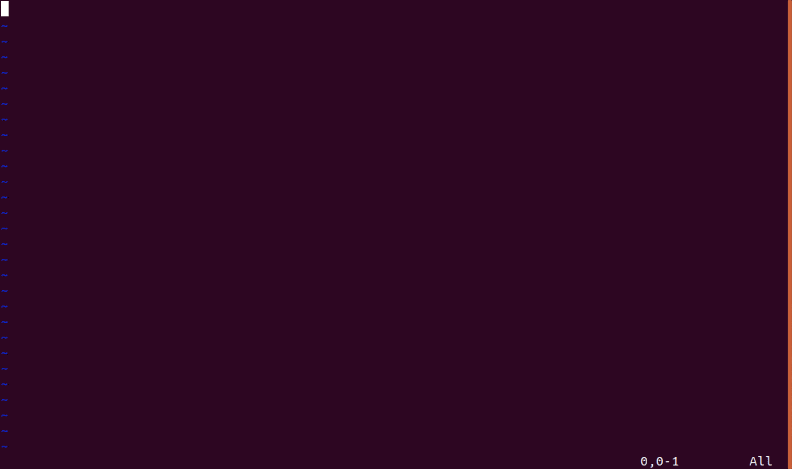
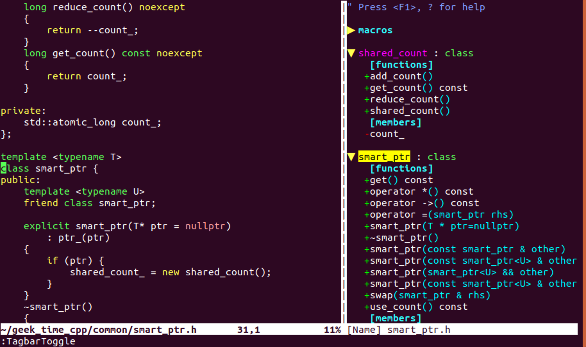
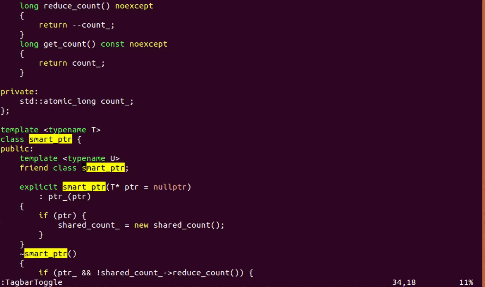
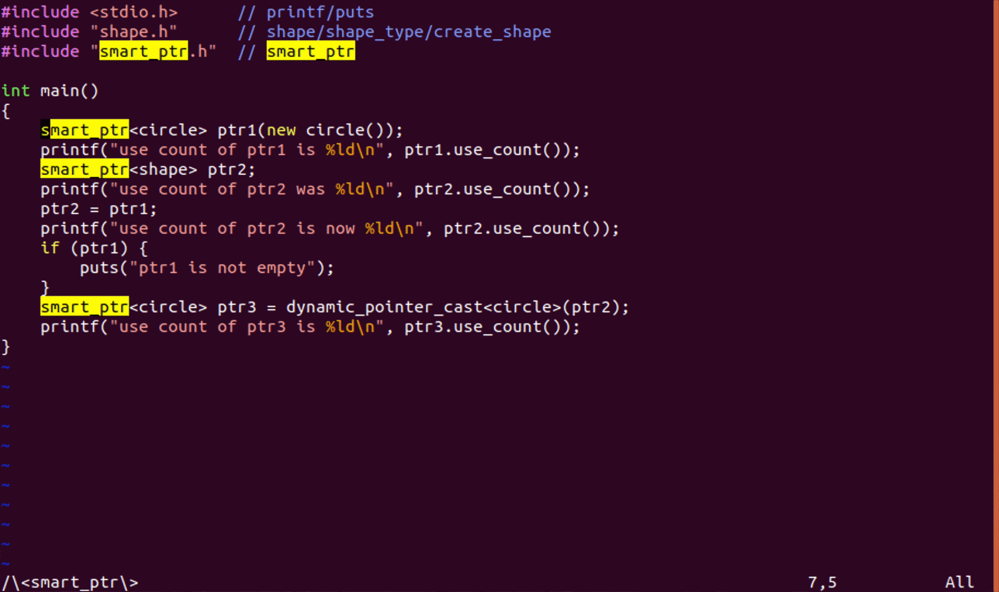
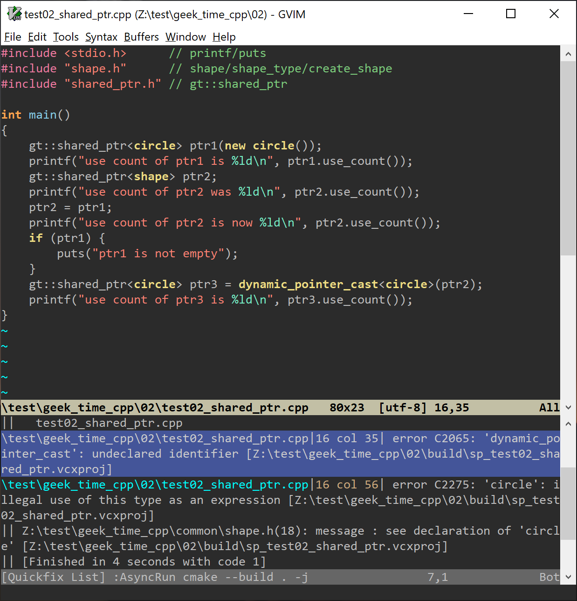

# 10｜代码重构实验：在实战中提高编辑熟练度
你好，我是吴咏炜。

在前几讲中，我们已经学了很多关于 Vim 的知识，现在需要好好消化一下。今天是基础篇的最后一讲，我们就基本上不学新的内容了，而是通过一个假想的代码重构实验，来复习、巩固已经学到的编辑技能。

## 开始前的准备工作

这是一堂实验课，你需要跟着我一步步地操作。跟只学习文字内容相比，实践操作能让你收获更多。所以，就请你现在把电脑准备好，跟我来吧。

今天我们将要做的是，签出我为极客时间写的 C++ 示例程序，并对其中的代码进行重构。别紧张，你不需要精通 C++，因为我会在必要的时候对代码进行解释。你学习的重点在于，我是如何进行编辑的，而不是我写的代码是什么意思。

首先，你需要先为工作代码找一个合适的父目录，然后用下面的命令签出代码（Windows 下面去掉“\\”全部写一行，或者把“\\”换成“^”））：

```bash
git clone --recurse-submodules \
          --shallow-submodules \
    https://github.com/adah1972/geek_time_cpp.git

```

万一我以后更改代码的话，就有可能造成内容或路径发生变化。所以，请把我们今天编辑的 commit id 记下来：632b067。如果你用 `git log` 看到 HEAD 的 commit id 不是它，可使用 `git checkout 632b067` 这个命令来签出跟今天完全相同的版本。

下面，我们就开始了！

## 类模板 smart\_ptr 更名

我们第一步要做的，是把示例的 `smart_ptr` 类模板更名为 `shared_ptr`。同时，为了避免跟标准的 `shared_ptr` 发生冲突，我们要把它放到名空间 `gt` 里面去（当然，你可以用其他名字；这只是我们的示例）。

大体思路是，先需要找到 `shared_ptr` 定义所在的文件，对其进行修改；然后找到使用该文件的地方，也进行相应的修改。下面我们就来做一下。

### 修改类定义

首先，我们需要进入 `geek_time_cpp` 所在的目录。如果你前面的命令就是 `git clone` 的话，那现在使用 `cd geek_time_cpp` 就可以了。

然后，我们当然是启动 Vim 了。假设我们知道 `smart_ptr` 被定义在 smart\_ptr.h 头文件里，那我们最快的打开方式就是使用 `:Files` 命令，然后输入“sm”，即可看到“common/smart\_ptr.h”成了第一选择。我们此时按下回车键即可打开文件。



进入文件后，我们先来看一下文件的结构。根据目前的 Vim 配置，我们可以使用 `<F9>` 打开 tagbar 插件。注意，这个文件使用了 C++11，Exuberant Ctags 会有错误的识别。下面的截图是安装了 Universal Ctags 之后的结果：



我们可以看到这个文件比较简单，里面主要就是两个类的定义和一些全局函数。不过，我们还是要确认一下，文件中没有任何会被错误匹配替换的内容。我们可以在右侧窗口里双击“smart\_ptr”，这样左侧窗口就会跳转到 `smart_ptr` 的定义上，并且光标停留在类名上面。这样，我们只需使用 `*` 启动搜索和加亮即可。使用 `n` 继续搜索，我们很快就能确认文件中确实没有冲突的内容。

下面，我们进行替换操作，需要键入的是 `:%s/<C-R>//shared_ptr/g<CR>`（ `<C-R>` 和 `<CR>` 都是按键，而非小于符号后面跟其他字符）。我们不需要手工输入 `\<smart_ptr\>`，因为搜索寄存器 `/` 中已经有我们要的内容了。



最后，我们在第一个类定义的前面加上 `namespace gt {`、在最后的 `#endif` 前面加上 `} /* namespace gt *／`，就完成了定义的修改。

不过，现在文件名还没有更改，文件里的包含保护（即宏 `SMART_PTR_H`）也没有更改。包含保护需要简单的重命名，就请你用我们目前介绍的任一方法自己完成了。随后，我们用命令 `:Rename shared_ptr.h` 即可完成更名和存盘操作。

### 修改使用 smart\_ptr 的地方

我们先试着用下面的命令搜索一下：

```vim
:grep -R --include="*.cpp" --include="*.h" "\<smart_ptr\>" .

```

（小提示：在查看搜索结果的时候，适时使用 `zz`、 `zt` 和 `zb` 命令，可以把周边的代码看得更清楚。）

使用 `:cn` （或我们定义的快捷键）仔细检查搜索出来的结果，我们会发现有一些误匹配：有 `smart_ptr` 是 `unique_ptr` 的情况，也有 `smart_ptr` 是策略类的情况。

我们稍微改换一下方法，搜索对 `smart_ptr.h` 的使用：

```vim
:grep -R --include="*.cpp" --include="*.h" "\<smart_ptr\.h\>" .

```

这样的话，我们会发现结果只有一个匹配，那就简单了。

在上一讲里，我们已经讨论了在这种情况下进行修改的三种不同方法（忘了？请回过去复习一下）。今天，我们用第四种方法。这种方法的每一步我们实际上都讲过，但串起来用，你可能就没有试过了。我们使用的基本命令是 `cw`、 `n` 和 `.`。

由于之前搜索过 `smart_ptr`，我们现在仍然可以继续使用 `n` 找到需要修改的地方。我们随即需要键入的，是 `cwgt::shared_ptr<Esc>`。这样输入虽然有点长、有点啰嗦，但它的好处是整个修改会被 Vim 看作是一步，因而可以用 `.` 命令来重复。这样，下面我们只需要反复利用 `n` 和 `.` 命令，把除了 `#include` 那行之外的所有 `smart_ptr` 都改成 `gt::shared_ptr` 即可。



很显然，这并不是唯一的方法，也不一定是最好的方法。所以，我建议你在这里暂停一下，用 `:e!` 重新载入这个文件，试试使用上一讲提到的其他方法。我这里就仅仅再给你展示一下如何使用替换命令，同时又不会误匹配文件名：

```vim
:%s/\<smart_ptr\>\ze\%([^.]\|$\)/gt::shared_ptr/g

```

这个匹配模式说的是，我要查找完整的单词“smart\_ptr”（这就是要替换的内容了），但是，在匹配结束（ `\ze`）后，我还有两个额外的匹配要求（用 `\%(` 和 `\)` 括起来），要么不是句点（ `[^.]`），要么（ `\|`）是行尾（ `$`）。

我们最后把唯一残留的 `smart_ptr.h` 修改成 `shared_ptr.h`，就完成了 `smart_ptr` 的更名任务。

## 编译执行（可选）

如果你懂 C++，并且有 geek\_time\_cpp 的 [README](https://github.com/adah1972/geek_time_cpp/blob/master/README.md) 文件里要求的执行环境的话，可以选择体验一下编译执行。

我们需要先在 02 目录下创建并进入 build 子目录，然后运行 `cmake ..`。随后，在 Unix 环境下，一般可立即使用快捷键 `<F5>` 进行编译；想要在 Windows 下也能正常进行编译，我们则应当设置 `set makeprg=cmake\ --build\ .\ -j`（老版本的 cmake 可能不支持 `-j` 命令行参数的话，这样的话，我们会没法用 cmake 进行并发编译；不过对于我们的小例子没啥关系）。

另外一个要注意的地方是，Vim 在缺省配置下不能识别 Visual C++ 的错误输出格式 。为了能进行识别，并在发生错误时跳转到文件的指定位置，我们需要设置下面的选项：

```vim
set errorformat=\ %#%f(%l\\\,%c):\ %m

```

目前来讲，环境没问题的话，我们就会……遇到编译错误。



原因是 `dynamic_pointer_cast` 前面也需要加上 `gt::`。做了这个修改之后，我们就应该可以顺利编译出可执行文件了。在 Windows 下使用命令 `:!.\Debug\sp_test02_shared_ptr`，或在 Unix 平台下使用命令 `:!./sp_test02_shared_ptr`，我们即可在终端看到下面的输出：

> `circle()`
>
> `use count of ptr1 is 1`
>
> `use count of ptr2 was 0`
>
> `use count of ptr2 is now 2`
>
> `ptr1 is not empty`
>
> `use count of ptr3 is 3`
>
> `~circle()`

同时，如果愿意的话，我们也可以使用 AsyncRun 提供的机制，在 Windows 下使用命令 `:AsyncRun .\Debug\sp_test02_shared_ptr`，或在 Unix 平台下使用命令 `:AsyncRun ./sp_test02_shared_ptr`，异步运行程序并把输出重定向到 quickfix 窗口里。

## 添加跟踪语句

假设我们对这个代码执行过程有些疑问，想添加些跟踪语句，该怎么做呢？

我们首先需要在一个新窗口中打开 common/smart\_ptr.h。由于我们第一个打开的文件就是它，所以它的缓冲区编号为 1，我们可在用 `<C-W>n` 打开一个新窗口后，使用 `1<C-^>` 飞速地重新打开文件。

我们希望对引用计数的增、减、删除等操作进行跟踪。最简单的方式，当然就是执行对应操作的时候，把执行的语句也输出一下。像这样简单的机械化操作，显然就是宏的天下了。我们来试一下。

我们先来改造一下 `smart_ptr` 析构函数里面的第一个 `delete ptr_`。一个可能的操作步骤是：

1. 复制当前行
2. 粘贴当前行
3. 选中行首缩进后、结尾分号前的内容，套上双引号
4. 在这个新对象前后插入输出所必须的命令

我们需要录制的宏的内容是 `yyPv$hS"gvS)iputs<Esc>l%a;<Esc>`，而你把这一串东西用 `nmap` 命令映射给某个按键上也完全可行（注意，此处不能用 `nnoremap`，因为我们需要使用 vim-surround 插件带来的新的 `S` 按键的定义）。当然，在交互的环境中，录制按键会比眼睛看这个字符串容易理解多了。Vim 的宏，就其本质而言，可算是一种只写不读的简单过程式语言。


我们用到的命令里，只有 `gv` 是之前没有学过的。我们当然也有其他方法来选中行中的内容，但 `gv` 的作用是重新选中刚才选中的内容，最快，也最方便。

利用这个宏，我们可以把添加调试语句变成按两个键。哦，对了，宏一旦执行过后，第二次执行同一个宏只需要键入 `@@` 即可，这样还能更快些。

在我们把所有的 `delete` 语句和 `add_count` 函数调用行上执行了这个宏之后，我们运行程序可以得到下面的结果：

> `circle()`
>
> `use count of ptr1 is 1`
>
> `use count of ptr2 was 0`
>
> `other.shared_count_->add_count();`
>
> `use count of ptr2 is now 2`
>
> `ptr1 is not empty`
>
> `other.shared_count_->add_count();`
>
> `use count of ptr3 is 3`
>
> `delete ptr_;`
>
> `~circle()`
>
> `delete shared_count_;`

如果想对这个代码作进一步调整，类似操作即可，相当容易吧？

## 调整测试用例

我们现在使用鼠标点击或者 `<C-W>j` 等命令跳转到测试代码 test02\_shared\_ptr.cpp 中。我们随即使用 `<C-W>_` 命令来最大化窗口，因为似乎暂时用不着编辑 smart\_ptr.h（但还不那么确定，否则就可以直接关闭那个窗口了）。

我们打算在 `ptr1` 不为空的那个条件判断下面再加点内容。那行输出看着也挺无聊的，我们就直接把它干掉了。我们可以在那组大括号内的任意地方点击后，使用 `ci{` 开始编辑，然后输入以下内容：

```c++
printf("ptr1 %s ptr2\n",
       ptr1 == ptr2 ? '==' : '!=');

```

代码编译居然有奇怪的告警出现……我是 Python 写多了，脑子没转回来吗？没关系，在第一处单引号内部键入 `cs'"`，然后在第二处单引号内部键入 `.` 重复一下就好，现在代码应该是正确的了：

```c++
printf("ptr1 %s ptr2\n",
       ptr1 == ptr2 ? "==" : "!=");

```

再次编译，完美，没有问题了！运行程序，我们得到：

> `circle()`
>
> `use count of ptr1 is 1`
>
> `use count of ptr2 was 0`
>
> `other.shared_count_->add_count();`
>
> `use count of ptr2 is now 2`
>
> `ptr1 == ptr2`
>
> `other.shared_count_->add_count();`
>
> `use count of ptr3 is 3`
>
> `delete ptr_;`
>
> `~circle()`
>
> `delete shared_count_;`

## 内容小结

今天我们尝试对一小段 C++ 代码进行了简单的重构。在这个过程中，我们使用和复习了下面这些编辑技巧：

- 使用 fzf.vim 来根据部分文件名迅速打开文件
- 使用 tagbar 来浏览文件的结构
- 使用 vim-eunuch 来进行文件更名
- 使用替换命令来进行批量代码更名
- 使用 `.` 命令技巧来进行批量代码更名
- 使用 `<C-R>` 在插入模式和命令行模式中使用寄存器的内容
- 使用 `:grep` 命令在文件中进行文本搜索
- 使用异步的构建命令，并设置选项使得错误信息解析在 Visual Studio 工具里也能工作
- 使用文本对象命令对用括号、引号等符号包起来的文本进行统一的修改
- 使用宏，在一次操作之后，在遇到类似场景时可以快速修改

虽然今天的代码是 C++ 的，但这些编辑方式适用于任何语言。请你一定要牢牢掌握。我们也应该慢慢看到了，编辑的一个要点，在于把需要重复的工作自动化和简单化。Vim 作为一个程序员的编辑器，提供了灵活而强大的编辑机制——最终用户，或扩展包的开发者，都可以利用这些底层机制，使编辑变得更加高效。

本讲我们对 Windows 下的 vimrc 配置文件有一处小修改，对应的标签是“l10-windows”。

## 课后练习

实验课中的内容你已经一一尝试了吧？请你再向前一步，想一想我们的每次编辑是否可以有不同的执行方式，及哪种方式对你最顺手。Vim 的命令一定是在使用中才能熟练应用的。你不一定要记住所有可能的编辑方式，但每一种最好都至少尝试一次，然后找出最适合自己的、最能牢牢掌握的编辑方式。

我是吴咏炜，我们下一讲再见！