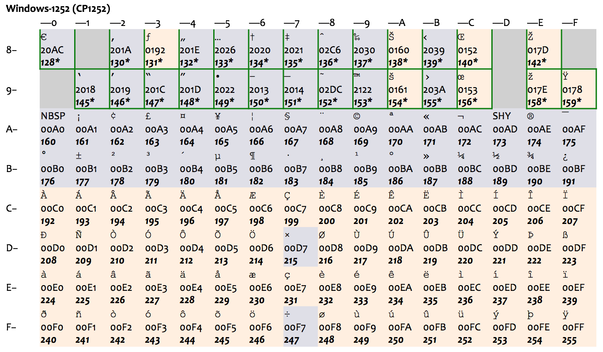
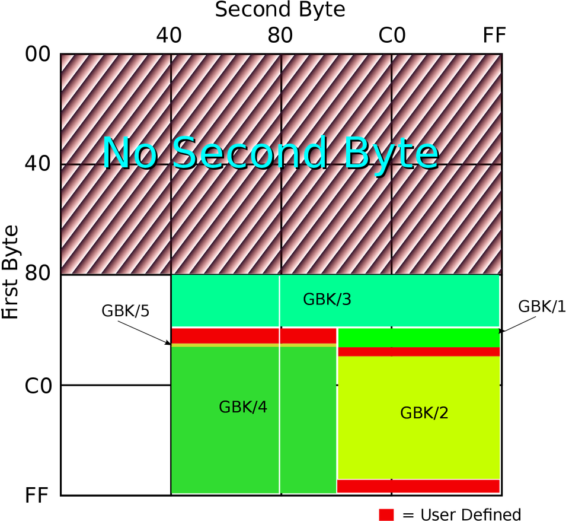
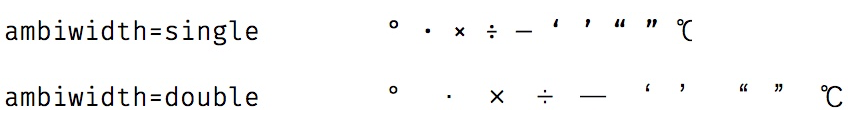
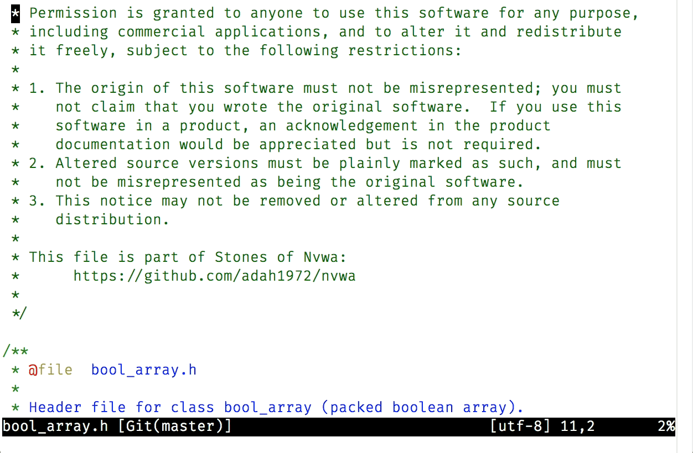
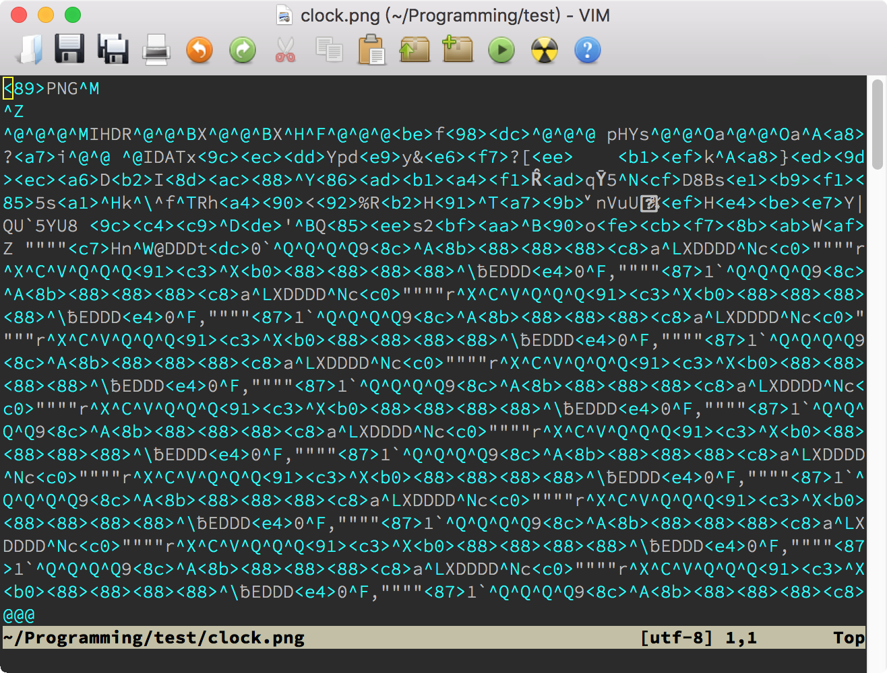
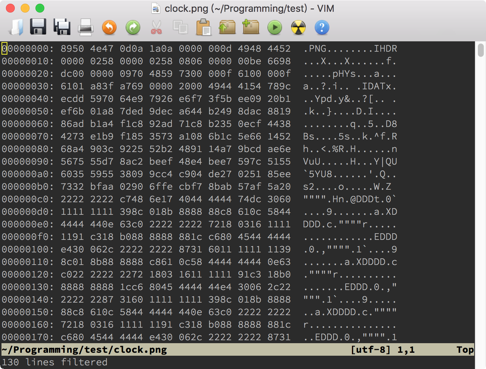

# 11｜文本的细节：关于字符、编码、行你所需要知道的一切
你好，我是吴咏炜。

从今天开始，我们进入提高篇和拓展篇的学习。

在提高篇，我会带你对 Vim 的高级用法和技巧进行专项突破，让你可以对 Vim 做深度定制，应对复杂的工作也不在话下。

在拓展篇，我会介绍一些针对性较强的内容，适合特定场景下的 Vim 使用。为了平衡一般性和特殊性，让你拥有更舒适的学习体验，拓展篇将会与提高篇交叉发布。如果一时用不到相关的知识，拓展的内容可以暂时延后学习。但一旦你需要这些知识时，你会发现，哦，原来如此，Vim 是可以这么使用的！

* * *

Vim 是一个文本编辑器，很多人甚至把它称为“编辑器之神”。在基础篇中，你已经了解了很多用 Vim 编辑文本的常用技巧。可是你有没有想过，到底什么才算是文本？在提高篇的第一讲，我们就先来细细分析一下，关于文本你需要知道的一切知识。这会让你更好地理解编辑时出现的一些奇怪问题（如“乱码”），并予以恰当解决。

## 什么是文本

从二元论的角度看，计算机文件可以分为文本文件（text file）和二进制文件（binary file），但这个分法并没有对文本做出清晰的界定。从实用的角度，我们大致可以这么区分：

- 文本文件里存放的是用行结束符（EOL，即 End of Line）隔开的文本行，二进制文件里则没有这样的明确分隔符
- 文本文件可以通过简单、直接的算法转换为人眼能够识别的文字，而二进制文件里含有不能简单转化为文字的信息

我这个描述当然还是有点含糊。事实上，计算机判定一个文件是不是文本文件，并不是件容易的事情，特别是在这个文件含有非 ASCII 字符的时候。曾有一些操作系统（如古老的 Apple DOS），会明确区分文件的类型，但现代的操作系统基本上在文件系统层面完全不关心文件的类型和里面的内容了。因为操作系统不对文件类型进行限定，会更加灵活。

但我们还是需要关心的，因为 Vim 最适合编辑的，就是文本文件了。从实用的角度，我对文本文件的判定通常是：

> 一个文本文件可以直接输出到终端上，或在简单的编码转换后输出到终端上，显示为一行或多行可识别的字符，并且不包含乱码。

想要理解这句话，你得先知道什么是字符？什么是编码？什么是行和行结束符？下面我就来为你一一解说。

### 字符和编码

从文件系统的角度看，文件的内容就是一堆比特（bit）而已。把比特对应到字符的方法，就是编码（encoding）。在目前的主流操作系统里，通常八比特是一个基本单位，也就是字节（byte）。最基本的编码方式，就是把一个字节对应到一个字符。

目前的大部分编码方式，在 0－127 的范围里，字节值和字符的对应关系是基本相同的。除了个别字符外，编码的基本方式都和 ASCII（American Standard Code for Information Interchange，美国信息交换标准代码）兼容，如下图所示：


注意，头 32 个字符和最后一个字符是控制字符，其中大部分现在已经很少有人使用了，但还有一些我们今天仍然会在不同的场合遇到，如马上就会讨论的 LF 和 CR。

ASCII 是美国标准，里面只有基本的拉丁字母，对其他国家来讲可能就不合适。比如对欧洲国家来说，ASCII 既没有带变音符的拉丁字母（如 é 和 ä ），也不支持像希腊字母（如 α、β、γ）、西里尔字母（如 Пушкин）这样的其他欧洲文字，使用起来很不方便。很多其他编码方式使用了 128－255 的字节值范围作为扩展，总共最多是 256 个字符，一次允许一套方式生效，称之为一个代码页（code page）。这种做法，只能适用于文字相近、且字符数不多的国家。比如，下图表示的 ISO-8859-1（也称作 Latin-1）和后面的 Windows 扩展代码页 1252（下图中绿框部分为 Windows 的扩展），就只能适用于西欧国家。



最早的中文字符集标准是 1980 年的国标 GB2312，其中收录了 6763 个常用汉字和 682 个其他符号。至于我们平时用到的编码 GB2312，它更准确的名字其实是 EUC-CN，是一种与 ASCII 兼容的编码方式。它用单字节表示 ASCII 字符而用双字节表示 GB2312 中的字符；由于 GB2312 中本身也含有 ASCII 中包含的字符，在使用中逐渐就形成了“半角”和“全角”的区别。

国标字符集后面又有扩展，这个扩展后的字符集就是 GBK，是中文版 Windows 使用的标准编码方式。GB2312 和 GBK 所占用的编码位置可以参看下面的图（由 John M. Długosz 为 Wikipedia 绘制）：



图中 GBK/1 和 GBK/2 为 GB2312 中已经定义的区域，其他的则是 GBK 后面添加的字符，总共定义了两万多个编码点，支持了绝大部分现代汉语中还在使用的字。

显然，多个不同的编码方式是不利于信息交换的。我们在打开文本文件时看到的“乱码”，最常见的情况就是文件的编码和打开文件的工具以为的编码不同。毕竟，只要出现了非 ASCII 字符，解释方式就多了。对我们来说，常见的情况是 Latin-1/Windows-1252（西欧文字）、GBK（简体中文）、Big5（繁体中文），今天还增加了 UTF-8。

我们终于说到了 UTF-8，它的全称是 8-bit Unicode Transformation Format，8 比特的 Unicode 转换格式。Unicode 自发明伊始，就是为了统一编码问题，但它的最早编码方式，UCS-2，存在两个重大问题：

- 和 ASCII 不兼容，不能在现有软件和文件系统中直接使用
- 在储存 ASCII 为主的字符时，存在一字节变两字节的空间浪费

Ken Thompson 在 1992 年和 Rob Pike（罗勃 · 派克）一起发明了 UTF-8，解决了这两个问题（牛人就是牛人啊）。到了今天，UTF-8 已经成了互联网和 Unix 世界里文本文件（含 HTML 和 XHTML）的主流编码方式。但是，Windows 下的文本文件，由于历史原因，可能还大量使用着传统的编码方式（很错误地被叫做 ANSI）；对于中文 Windows，这个传统编码就是 GBK 了。

抛开编码方式的细节（从网上你可以找到足够多的关于 Unicode 和 UTF-8 的资料），我们需要牢牢记住的是，UTF-8 是 Unicode 里最重要的编码方式，可以把一到四字节长度的字节序列映射成为一个 Unicode 字符。目前我们使用的任何字符都可以用 UTF-8 表示，因而 UTF-8 是我们在 Vim 中使用的内部编码（选项 `encoding`）。我们在第 2 讲中给出 `fileencodings` 选项设置，就是为了在读写文件时把文件内容进行适当的转换。这个选项表示的是自动检测使用的编码；而在文件被 Vim 载入后，文件的编码会出现在选项 `fileencoding` 里。如果 `fileencoding` 选项为空，则表示文件保存时不做任何转换。

关于编码，我们暂时讨论到这里。下面我们讨论一下字符（character）和字形（glyph）。

### 字符和字形

Unicode 设计时的一个决定，目前看起来有点短视，那就是对中日韩文字中使用到的汉字进行了“统一”。如果字源相同，它们在 Unicode 中就只占据一个编码点。于是，一个字符可能就有多个字形。这个问题，我在第 2 讲中已经展示过了，它也是我们可能需要在图形界面 Vim 中单独设置宽字符字体（ `guifontwide`）的原因。


跟中文字符集中“半角”和“全角”的概念有点像，Unicode 中也有字宽的概念。和简单的半角与全角的区别不同，Unicode 里除了窄字符和宽字符，还有模糊宽度（ambiguous width）字符。这些字符的宽度根据上下文而定：在东亚文字里一般是宽字符，而在西方文字里一般是窄字符。最常用的模糊宽度字符有（“U+”后面跟十六进制数值是用来表示 Unicode 字符所占编码点数值的通常方法）：

- U+00B0：「°」
- U+00B7：「·」
- U+00D7：「×」
- U+00F7：「÷」
- U+2014：「—」
- U+2018：「‘」
- U+2019：「’」
- U+201C：「“」
- U+201D：「”」
- U+2103：「℃」

对于某一特定字体，它们的宽度当然就是确定的；尤其使用变宽字体（大部分英文字体，不同字符宽度不同）时，如在极客时间的正文里，这个模糊宽度没有什么意义。对于使用等宽字体（程序员一般使用的字体，Vim 只能用等宽字体）的文本编辑器，到底是把这些字符显示成跟 ASCII 字符一样的“单”宽度，还是显示成跟汉字一样的“双”宽度，就是一个需要考虑的问题了。

稍微展开一点点，这个模糊宽度，在我们日常生活中还是造成了一点麻烦的。非常常见的一个排版错误，就是由于使用的软件（在中文 Windows 下的）的字体选择规则，西文中的 「’」误用了中文字体展示，导致这个符号展示出来的字间距过宽。一个相反的麻烦，是中文中写「·」希望两侧留空很足，但在另外一些环境下，永远优先选择西文的字体（如大部分的手机操作系统），导致需要手工两侧加空格才能有比较理想的排版效果……

扯远了，这些毕竟不是 Vim 的问题。Vim 里的解决方式是提供选项 `ambiwidth`，可以设为 `single`（默认值）或 `double`，表示 Vim 到底把这些字符的宽度当成是占一个字符还是两个字符，你想怎么样都可以。对于终端 Vim，由于 Vim 不能决定显示的字体，这个选项只能决定光标在这些字符上应当移动的列数，用户必须自己保证在终端里的设定和 Vim 的设定是一致的；否则，可能导致眼睛看到的编辑位置和实际编辑位置不一致。虽然 macOS 的终端应用、Linux 的 GNOME Terminal 和 Windows 下的 PuTTY 都提供了如何处理模糊宽度字体的设定（关键字是“模糊”或“ambiguous”），但鉴于这些软件的字体选择策略，选择“宽”容易导致显示问题，所以我的建议是保留缺省的“窄”设定。

对于图形界面的 Vim， `ambiwidth` 选项同时也决定了显示这些模糊宽度字符是使用 `guifont` 选项还是 `guifontwide` 的设定。在这种情况下，把 `ambiwidth` 设成 `double` 才比较有意义：



修改 `ambiwidth` 主要影响的是一行的长度，而 Vim 具有根据行长来进行断行的功能。下面，我们先来看一下什么是行。

### 行

从 Vim 和 Unix 的角度看，一个文本文件由多行构成，每一行都以一个行结束符（EOL）结束。根据传统习惯，这个 EOL 在存盘时使用的字符是 LF，编码值是 10（U+000A）。

这只是 Unix 格式。常用的还有 DOS 格式（也包括了 Windows），以及老的 Mac 格式。

在 DOS 格式里，行尾就不只使用 LF 这一个字符了，在 LF 前面会多一个 CR，编码值为 13（U+000D）。这个用法的来源是以前的打字机，CR 表示机架归位（carriage return），LF 表示换行（line feed）。在使用 CR LF 作为行结束符的系统里，CR 只负责光标回到第一列，而 LF 负责光标向下一行。

老的 Mac 则使用单个 CR 字符作为行结束符，但苹果从 Mac OS X（2001 年）开始就使用了 Unix 风格的行结束符。所以，目前我们遇到的文本文件，应当都使用 LF 或 CR LF 作为行结束符了。这也是 Vim 的 `fileformats` 选项的意义：它的默认值通常是 `unix,dos`（Unix 环境下）或 `dos,unix`（Windows 环境下），即会自动检测 Unix 和 DOS 行尾；如果检测不到，则以第一个风格设置作为默认值。

`fileencodings` 有一个对应的文件相关的 `fileencoding` 选项，跟它一样， `fileformats` 也对应有一个文件相关的 `fileformat` 选项，表示当前文件的行尾风格。需要注意的是，如果一个文件里既有 LF 行尾、又有 CR LF 行尾的话，Vim 会把文件当成 Unix 格式，于是文件里会出现最后一个字符显示成“^M”（通常为蓝色，表示是控制字符，跟正常文本不同）的情况。如果你想保留这种行尾，那不需要做任何事情。但绝大多数情况下，你会希望把行尾统一成 Unix 风格或 DOS 风格。此时，你可以使用下面两种方法之一：

- 使用 `:e ++ff=dos` 命令强制以 DOS 行尾加载文件；此时文件的行尾格式是 `dos`。
- 使用 `:%s/\r$//` 命令删除行尾多余的 CR 字符；此时文件的行尾格式保持 `unix` 不变。

此外，再说明一下，Unix/Vim 的传统是任何一行都以行结束符终结， **包括最后一行**。使用 Vim 编辑的文本文件，最后一个字符通常是 LF（除非使用 Mac 行尾风格，则结尾是 CR）。Windows 上大部分文本编辑器则允许最后一行不以行结束符结束；这样的文件在 Vim 打开时，Vim 默认会给出一个“\[noeol\]”的提示。在存盘时，Vim 则会自动在最后添加一个行结束符。

除了 Vim，很多 Unix 工具都会有类似的要求。比如，用于文件比对的命令行工具 diff，它在文件比对时如果输出下面的信息，就是表示文件之一没有用行尾结束符来结束：

> \ No newline at end of file

### 断行

中文文本文件的行文习惯，通常是在一段之中不空行，一段结束了再换行。文本编辑器需要做的，是在行长超过屏幕宽度时自动折行。Vim 虽然也能在这种情况下自动折行，但 Vim 的更惯常用法是欧洲字母文字和源代码的做法，行长有一定的限制（根据惯例，常用值是 72、80、120），到了指定的行长则应当进行断行，用一个空行来明确表示分段。这也是 Markdown 格式里的标准做法：单个换行符仅相当于空格而已。（这个额外插入的空格就是中文一段之中不换行的原因。）

Vim 有一个文本宽度的选项 `textwidth`，表示插入文字时的最大行宽度。这个选项的全局默认值为 0，表示不进行限制，但 Vim 脚本可能会设置它，你也可以自己在 vimrc 等地方对其进行设置。我自己的设置是文件相关的，如：

```vim
au FileType changelog  setlocal textwidth=76

```

这个设置，加上对行进行格式化的命令 `gq`，可以让你方便地对（英文）文本进行整理。 `gq` 命令跟 `c`、 `d` 等命令一样，可以先在可视模式下选定文本，也可以在命令之后跟动作键。对于源代码，它的妙处在于它知道什么是注释，什么是列表：



如果对这些功能有兴趣的话，请查看相关的帮助： [`:help gq`](https://yianwillis.github.io/vimcdoc/doc/change.html#gq) 和 [`:help fo-table`](https://yianwillis.github.io/vimcdoc/doc/change.html#fo-table)。我这儿特别要指出的是：

- 要能够在无空格的中文之中断行，我们需要有 `:set formatoptions+=m`
- 选项 `ambiwidth` 会影响行宽的判断，如左右弯引号的宽度算 1 还算 2
- 在 Vim 8.2.0901 之前，Vim 断行时不考虑中文标点符号的规则；要使用 `gq` 对中文文本断行，最好升级到这个版本或更高版本

## 编辑二进制文件

到这里，你已经知道什么是文本和关于文本的基本知识了。Vim 当然是一个文本编辑器，但在某些情况下，它也是可以用来编辑二进制文件的。有几个工具在你必须用 Vim 编辑二进制文件时会有帮助。

首先，Vim 有个 `binary` 选项和一个 `-b` 命令行参数。当你通过 `-b` 命令行参数，或 `:e ++binary …` 命令来打开文件时， `binary` 选项会自动被设置（用户不应该手动设置该选项）。这个选项保证了，Vim 在读取和存储文件时，不会做会影响文件内容的转换和修改。

不过，即使有这个选项，二进制文件打开后仍然是一堆乱码，这当然是正常的。你除了可以在里面搜索文本之外，还可以利用 Vim 的 Tools（工具）菜单下的“Convert to HEX”（转换成十六进制）和“Convert Back”（转换回）两项，来对二进制文件进行编辑。下面的两张图显示了打开二进制文件后的样子和使用了“Convert to HEX”后的样子：





不管你是要检查文件中的具体字节内容，还是要修改某个字节，HEX 格式都更方便一些。当然，如果你要把修改写回硬盘的话，一定要先使用“Tools > Convert Back”。

如果你有专门的二进制编辑工具的话，Vim 的这个功能可能不那么有用。如果正好你没有安装其他的二进制文件编辑工具，那这个功能还是可以救救急的。

要是你使用的不是图形界面，菜单里的这两个命令可以用 `:%!xxd` 和 `:%!xxd -r` 来手工替代。

## 内容小结

这一讲我们讨论了什么是文本，包括：

- 文本是用行结尾符隔开的、使用某种特定编码的字符序列
- UTF-8 是目前最主流的编码方式，但我们仍然可以对个别文件使用不同的编码
- 字符和字形在 Unicode 下并不是简单的一一对应，我们需要语言相关信息才能保证正确的显示
- 目前主流的行尾格式是 Unix 和 DOS，Vim 都支持，并且可以自动判断
- Vim 支持设置特定的行宽，然后据此来进行断行，且对代码注释、数字列表等文本形式有特殊支持
- 虽然 Vim 是文本编辑器，但在需要的时候，我们也可以使用 Vim 来查看和编辑二进制文件

本讲我们对 vimrc 配置文件有一处小修改，对应的标签是“l11-unix”和“l11-windows”。

## 课后练习

文中提到的内容，你都应该手工尝试一下。除此之外，如果你平时接触到 GBK/GB18030 和 UTF-8 之外的其他文本编码的话，你可以考虑查看一下插件 [FencView](https://github.com/mbbill/fencview)（注意，在 Windows 下你现在也不需要下载 iconv.dll 了：Vim 8 的 Windows 安装包中现在已经包含了 libiconv-2.dll）。

如果你使用的是 Linux 或 macOS 的话，可以键入 `iconv -l` 来看一下 libiconv 支持的编码方式：Vim 内部就是使用 libiconv 来实现编码转换的。

过去我们会有一些文件用后缀表示文件编码，比如 .gb 是 gbk 编码，.big5 是 big5 编码，.nfo 是 cp437 编码，你能想出如何正确载入这些文件的方法吗？

今天就到这里了。你的回答或问题，都可以留言告诉我。我们下一讲再见！