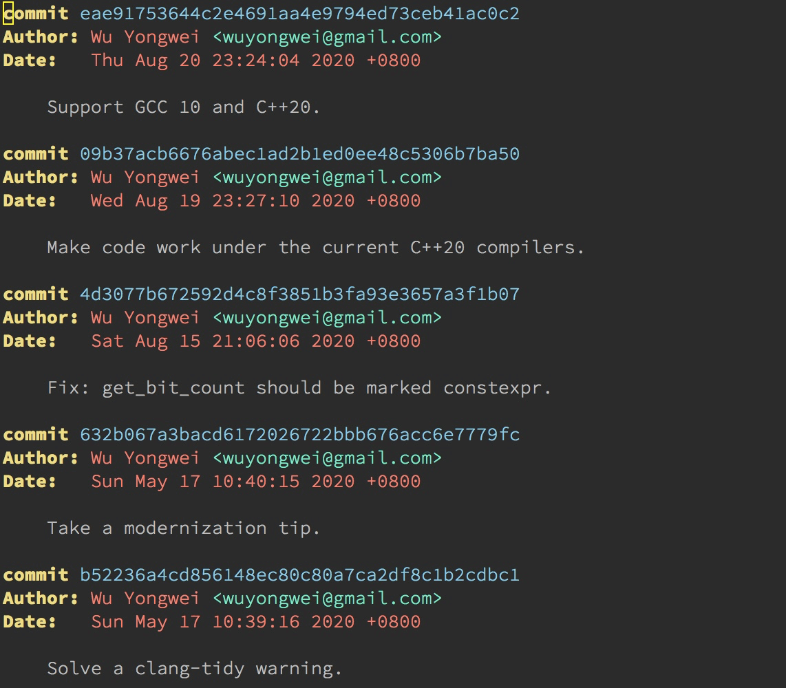
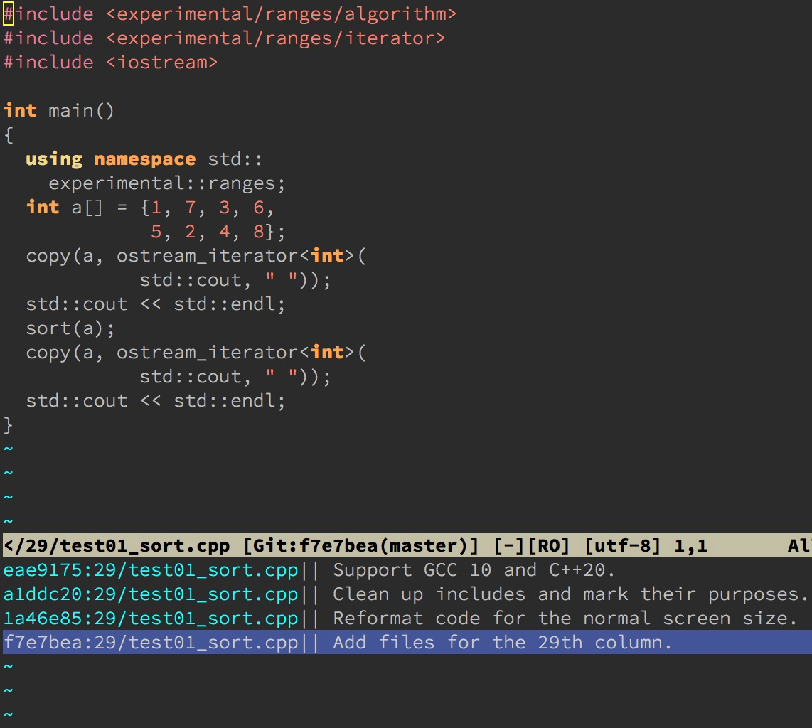
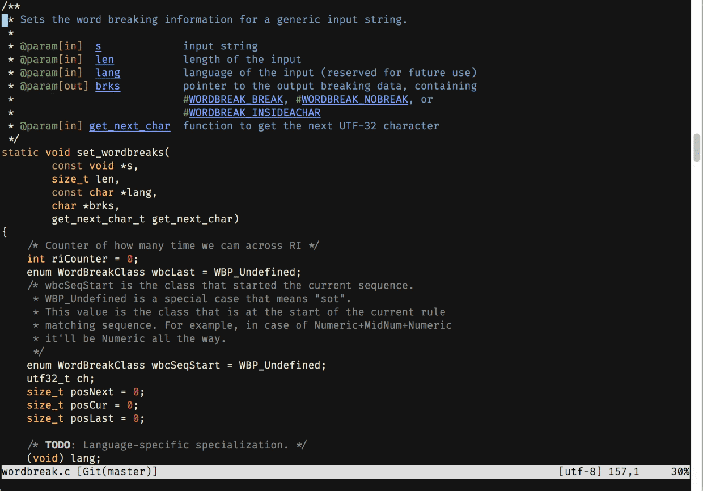
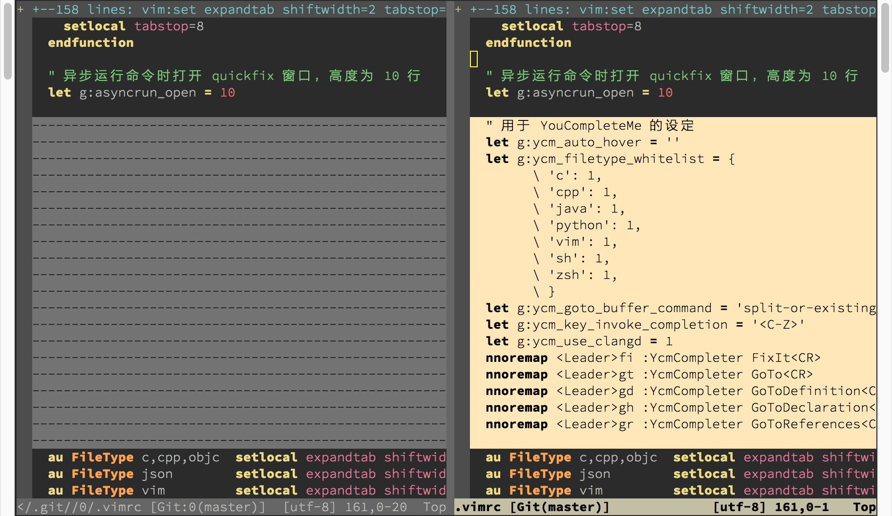
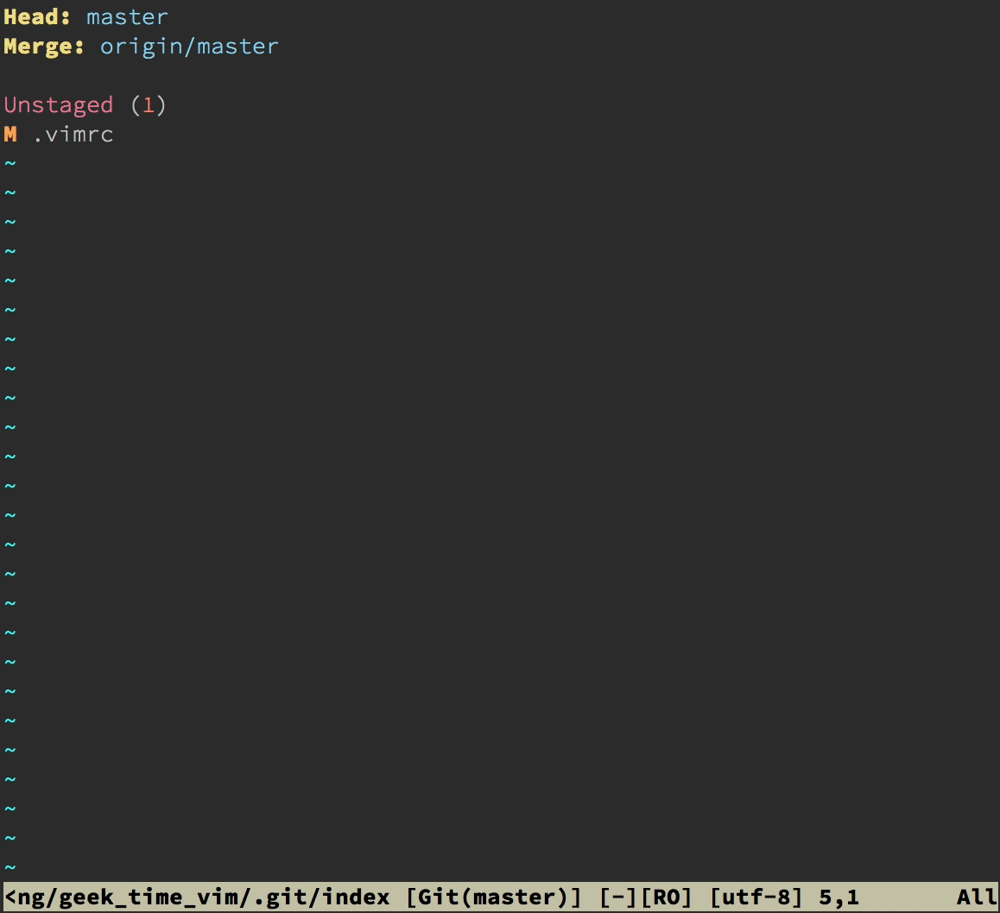
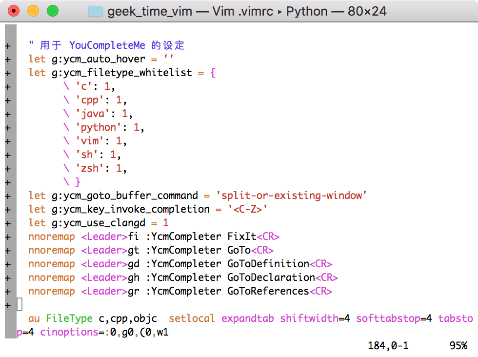
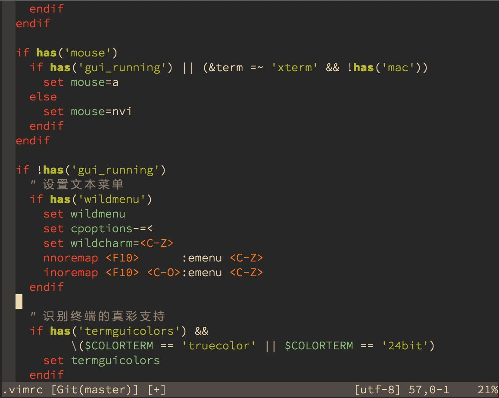
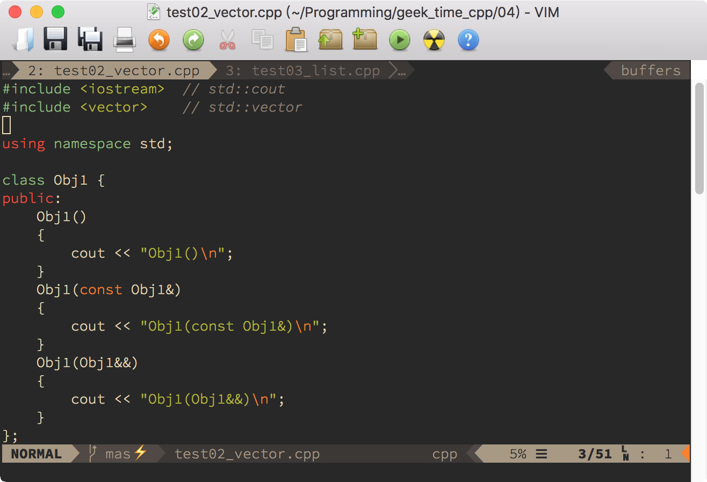
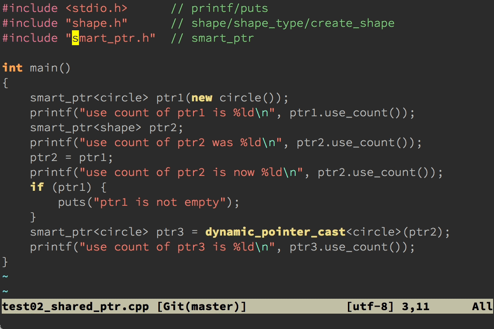

# 15｜插件荟萃：不可或缺的插件
你好，我是吴咏炜。

关于 Vim 的基本知识，我们已经讨论得差不多了。下面，我们需要的是练习和积累，在实践中成长。在今天的这一讲里，我们就来看看一些我们之前还没来得及介绍、但真的“必需”的插件，让你的开发效率再进行一次大幅提升。

跟之前各讲比起来，这讲会比较轻松。不过，在你已经学过了 Vim 的基本原理之后（特别是如果你学习了 [拓展 4](https://time.geekbang.org/column/article/280731) 的样例，进一步了解了插件代码是如何编写的话），我希望你看到这些插件时，不仅可以看到它们的外观和用法，而且还能大概知道它们的工作原理。这样，你就不再仅仅是一个初级用户，而是已经晋升为真正的 Vim 高手，能够根据自己的需要进行定制，甚至是“魔改”了。

## Fugitive

对于大部分开发者来说，使用 Git 应该已经和呼吸空气一样自然了吧。我跟很多工作经历丰富的开发者一样，从 CVS 的年代开始（那时我还一直维护着 [CVSMenu](https://www.vim.org/scripts/script.php?script_id=1245)），经历了 SVN，然后看着 Git 慢慢一统天下，号令江湖。在 Vim 中如何高效地使用 Git，当然也就成了个不得不讨论的话题。

今天，我会介绍两个 Git 插件。一个是重量级的、功能很多的 Fugitive，一个是集中在几个特色小功能上的 GitGutter。下面我们就从 Fugitive 开始。

### 安装和配置

[Fugitive](https://github.com/tpope/vim-fugitive) 是纯 Vim 脚本，我们使用包管理器安装 tpope/vim-fugitive 即可（对了，他也是 Time Pope 大牛写的）。

这个插件基本上不需要配置，即装即用。

### 使用

Fugitive 是一个全功能的 Git 支持插件，支持在 Vim 里直接使用 Git 命令：你只需要把“G”变成大写即可。比如，原本你要在 shell 使用 `git log`，现在在 Vim 里使用 `:Git log` 命令即可。结果会在一个 Vim 窗口里打开，并且有着语法加亮的效果：



Fugitive 有很多命令，你可以在它的帮助文件里找到较为完整的信息。下面我从使用的角度说明一下最常用的命令，重点是对当前文件操作的命令。像 `:Git pull` 这样的命令，我就略过不讲啦。

首先，要把当前文件的修改存盘并加到 Git 的暂存区，可以使用 `:Gwrite`。

反过来，要放弃当前的修改，回到暂存区的状态，可以使用 `:Gread`。

如果你需要对当前文件进行移动、更名或删除，可以分别使用 `:GMove`、 `:GRename`、 `:GDelete`。跟命令行上的 git 命令不同，你不需要给出当前文件的名字。

要在 quickfix 窗口里查看当前文件的修改历史，可以使用 `:0Gclog`（ `Gclog` 是查看整个项目的历史，对大项目使用 quickfix 窗口可能会有性能问题）。同时，你可以通过历史窗口，回到这个文件的任一版本。



要查看文件的某一行是谁最后修改的，可以使用 `:Git blame` 命令。你不需要给出当前文件的名字，而且 Fugitive 会把输出放到一个跟当前文件编辑窗口联动的新窗口里，并进行了色彩加亮。



要比较当前文件和暂存区版本的区别，可以使用命令 `:Gvdiff`。



要查看当前 Git 库的状态，可以直接输入 `:Git` 命令。在结果缓冲区里，有很多正常模式命令可用（见 `:help fugitive-staging-maps`）。其中最实用的可能是：

- 使用 `s` 来把文件（整个文件）或光标下的修改（部分修改）加到暂存区中
- 使用 `u` 来重置加入暂存区的修改（撤销 `s`）
- 使用 `=` 来切换开关这个文件的内联 diff 显示
- 使用 `o` 来在新分割的窗口中打开文件
- 使用 `dv` 来比较文件和暂存区版本的区别
- 使用 `cc` 来签入（commit）当前暂存区中的文件，相当于 `:Git commit` 命令



最后， `:Git push` 本来是不需要解释的，但你可能会高兴知道，在安装了 AsyncRun（见 [第 8 讲](https://time.geekbang.org/column/article/271208)）之后，这个操作自动就是异步的，不会在操作完成之前妨碍你继续进行编辑。

此外，所有的 `:Git …` 命令都可以打字成 `:G …`，事实上，之前给出的命令清单里，连这个空格都不要，所以你可以输入 `:Gpush` 来代替 `:G push`。不过，作者宣称 `:Gblame` 和 `:Gpush` 这样的命令在将来的版本里可能会被删除，所以你如果在用 `:Gpush` 这样的命令的话，可能需要知道一下这个事情。

你已经可以看到，Fugitive 的命令是相当复杂的，毕竟 Git 也很复杂。我上面讨论的，只是它的功能的一部分。你可以在它的帮助文件中了解进一步的信息（ `:help fugitive`）。

## GitGutter

如果说 Fugitive 是一个全功能 Git 插件的话， [GitGutter](https://github.com/airblade/vim-gitgutter) 就只是 Git 使用中的一个非常小的点。它的功能列出来也可以有不少，但跟 Fugitive 不同，它专注在 **单个文件内的修改管理** 上。

### 安装和配置

你需要使用包管理器安装 airblade/vim-gitgutter。如果你使用了一个比较知名的配色方案的话，多半你不需要额外配置了。GitGutter 会试图从配色方案里找出合适的颜色，但这个方法对配色方案会比较挑，尤其是对默认配色方案不适用。如果你觉得边栏或边栏里符号的颜色不让人满意的话，可以在 vimrc 配置文件中作类似于下面的配置：

```vim
highlight! link SignColumn LineNr
highlight GitGutterAdd    guifg=#009900 ctermfg=2
highlight GitGutterChange guifg=#bbbb00 ctermfg=3
highlight GitGutterDelete guifg=#ff2222 ctermfg=1
let g:gitgutter_set_sign_backgrounds = 1

```

没有上面那样的配置的话，在简单配色方案（如 Vim 的默认配色方案）下，GitGutter 的默认设置会出现突兀的边栏和无色的符号，丑得让人无法接受。



### 使用

下面的动图展示了 GitGutter 的核心功能（使用 gruvbox 配色方案）：



简单说明一下：

- 在 Vim 的边栏里用 `+`、 `-` 等符号和合适的配色来标注哪些行有了修改
- `[c` 和 `]c` 可以用来跳转到上一个和下一个修改的位置
- `<Leader>hp` 可以将光标下的修改块和缓存区中的内容进行对比
- `<Leader>hs` 可以将光标下的修改块加入到暂存区中
- `<Leader>hu` 可以恢复暂存区中的内容

换句话说，GitGutter 的重点是一个文件内修改的管理——这个功能 Fugitive 可以说也有（在 `:Git` 命令下管理），但不及 GitGutter 直观。使用 GitGutter，你可以在编辑文件时，立即选择把部分修改加入暂存区，方便后续的签入。因此，虽然看起来 GitGutter 的功能不多，我使用它的频度跟 Fugitive 差不多。

## Airline

如果你认为界面的美观很重要的话，你多半也会喜欢 [Airline](https://github.com/vim-airline/vim-airline)。Airline 应该可以算是 Vim 中最流行的插件之一了。它会和很多其他知名 Vim 插件自动进行集成，并在界面上展示非常丰富的信息。事实上，我在开篇词中给出的 Vim 界面截图中就使用了 Airline。我们这儿再重新展示一下。


靠近底部、开头是“NORMAL”的那行状态栏就是由 Airline 控制的。我们可以看到其中有非常丰富的信息：

- 当前的模式直接显示在状态栏上，并且每种模式都有自己的特别颜色，可以一目了然（在 gruvbox 提供的配色里，插入模式和可视模式的背景色都比目前的要突出得多）。
- 后面紧跟着的分支符号和“master”是 Airline 检测到了 Fugitive，通过 Fugitive 获得了分支名称。
- 后面跟着的是文件名和修改标记。
- 再后面，我们可以看到光标所在的位置的函数名，这是 Airline 通过 Tagbar 获得的。
- 随后，我们看到文件类型 cpp。
- 最后，我们看到光标位置在文件中的行数百分比、行号、总行数和列号，通过一些花哨的 Unicode 符号来进行分隔。

这些只是 Airline 功能的一部分。事实上，它内部有对超过 50 个 Vim 插件的集成扩展，会自动检测它们的存在，并显示相关信息。要看到这些扩展的完整列表和当前状态，可以使用 `:AirlineExtensions` 命令。

### 安装和配置

Airline 本身的安装非常简单，通过包管理器安装 vim-airline/vim-airline 即可。不过，要显示出比较好（kù）的效果，你需要有一个支持它用到的特殊字符的字体。这些字体常常被叫做 Powerline 字体，原因是一个叫 Powerline 的插件最早开始使用这些特殊符号。（Airline 也算是 Powerline 的一个替代品了，不过，两者还是有点区别的，其中之一就是，Powerline 要求 Python 支持，而 Airline 是纯 Vim 脚本。）

下面这几个是我比较推荐的：

- [Source Code Pro](https://github.com/adobe-fonts/source-code-pro)：一款设计非常优秀的字体，不花哨，但耐看
- [Fira Code](https://github.com/tonsky/FiraCode)：这是一款非常花哨的好字体（如果你疑惑上一张图里居然有“→”，就是这个字体对 `->` 的特殊渲染），也支持 Airline 需要的特殊符号
- [DejaVu Sans Mono for Powerline](https://github.com/powerline/fonts/tree/master/DejaVuSansMono)：著名的开源字体 DejaVu Sans Mono 加入了特殊符号支持的版本

在我目前的 vimrc 配置文件中，我对 Airline 进行了下面这样的配置：

```vim
let g:airline_powerline_fonts = 1
let g:airline#extensions#tabline#enabled = 1
let g:airline#extensions#tabline#buffer_nr_show = 1
let g:airline#extensions#tabline#overflow_marker = '…'
let g:airline#extensions#tabline#show_tab_nr = 0

```

首先，我告诉 Airline，可以使用 Powerline 字体来显示特殊符号。

其次，我启用 tabline 扩展，在顶部显示缓冲区列表。

再次，我让 tabline 显示缓冲区的编号，这样方便我使用数字加 `<C-^>` 来切换缓冲区。

然后，我使用 `…` 来表示省略（单个字符，而非占据三列的三个点），这样可以节约一点屏幕空间。

最后，我一般不在一个 Vim 会话中打开很多个标签页，一般使用上一个、下一个标签页的命令来进行切换，所以也就不需要显示标签页的编号了，免得和缓冲区编号两个显示在一起会比较乱。

这样配置下的效果，可以参见下面的截图（图中的字体是 Source Code Pro）：



哦，对了，下面的那个闪电符号也是 Airline 搞出来了，提醒你当前的 Git 库里有没有提交的更改。

### 使用

Airline 的使用基本上是自动的，安装、配置完了，差不多就不用去管它了。留意看它的提示就行了。比如，它会在右下角进行可能错误的显示提示，包括行尾的空格（trailing space），YCM 发现的代码错误，等等。

Airline 还提供了一些命令，如 `:AirlineExtensions` 和 `AirlineToggle`。这些你直接看帮助文档（ `:help airline`）就应该可以清楚了。

## NERDCommenter

我们前面已经介绍过了 NERDTree，而同一个作者写的另外一个插件 [NERDCommenter](https://github.com/preservim/nerdcommenter)，也在我的不可或缺的 Vim 插件的列表上。它提供的是又一个开发常用的功能，对某个代码块或代码行加上注释，及反过来把注释去掉。

### 安装和配置

我们需要在包管理器中安装 preservim/nerdcommenter。然后，我一般在 vimrc 配置文件中加入下面的代码，让 NERDCommenter 不要在终端 Vim 中加入菜单，干扰我使用 `<F10>` 查看最近的文件：

```vim
if !has('gui_running')
  let g:NERDMenuMode = 0
endif

```

### 使用

NERDTree 提供的命令，有些可以工作于当前行或选定的行内部分字符，有些则只能工作于整行，即使用可视模式的话选行内部分字符相当于选了整行。能够适用于行内的有下面这些命令（也能适用于整行）：

- `<Leader>cc` 把代码变为注释
- `<Leader>cu` 把注释起止符剥掉，恢复原先的代码

下面这些则只能工作于完整的一行或多行上：

- `<Leader>c<Space>` 用来切换注释和非注释
- `<Leader>cb` 用来加上“美观”的注释
- `<Leader>cs` 用来加上“性感”的注释

取决于具体的语言，行内注释、“美观”注释和“性感”注释不一定全部都适用（比如，在 Python 里就没有在一行内部开始加结束的注释）。我们拿支持所有这些情况的 C++ 代码来演示一下这些不同的注释类型：


目前 NERDCommenter 支持的文件类型也有一百种左右了，应该说还是非常全面的。对于调试代码，它也是一个非常重要的工具。

## Visual-Multi

我们今天要介绍的最后一个重要插件是 [Visual-Multi](https://github.com/mg979/vim-visual-multi)，它允许你把“光标”同时放在多个不同的位置上，然后下面的命令对所有的位置都有效。利用这个插件，我们要做变量重命名之类的操作就会变得非常简单。

### 安装和配置

我们利用包管理器安装 mg979/vim-visual-multi 即可。这个插件的默认配置挺合理，我目前没有发现要修改的内容。

### 使用

这个插件的核心功能，是帮你选中多个不同的位置，然后我们就可以使用正常的编辑命令，包括 `c`、 `d`、 `i` 等，来进行编辑。

所以，下一个问题自然是，我们该如何选中多个不同的位置呢？

Visual-Multi 里还是提供了好几种不同的选择方式的（ `:help vm-quickref`），我们就只讨论最常见的情况，根据搜索条件来进行选择。

在 Visual-Multi 里，特别的搜索命令是 `\\/`。跟普通的搜索命令一样，在输入的过程中我们即可看到屏幕上的匹配。但在搜索完成之后， `n` 命令不再仅仅意味着跳转到下一个匹配位置，而是选中当前的位置，并跳转到下一个匹配位置。如果想要跳过一个位置，则可以使用 `q` 命令。想要直接选中所有匹配的位置的话，可以使用 `\\A` 命令。

跟我们可以用 `*` 命令直接搜索光标下的单词一样，在 Visual-Multi 里我们也有一个快捷搜索命令 `<C-N>`。之后，我们的使用方式就一样了。下面，我就演示一下怎么用这个快捷搜索命令加其他的 Visual-Multi 命令来完成 [第 10 讲](https://time.geekbang.org/column/article/272988) 综合实验里的那个批量代码更名操作。



看明白了吗？保险起见，我稍微解释一下吧。

- 我首先使用 `<C-N>` 命令搜索 `\<smart_ptr\>`，开始了特殊的 Visual-Multi 模式，扩展模式（相当于可视模式）。
- 然后我使用了 `\\A` 命令选中所有的匹配位置。
- 由于文件名不应该更改，我使用 `q` 键跳过第一个匹配。
- 随后，我移动光标位置，缩小选中的位置。
- 之后，我就可以使用 `c` 命令直接输入需修改部分的新名字了。
- 最后，我按一次 `<Esc>` 退出插入模式，再按一次 `<Esc>` 退出 Visual-Multi 模式（从屏幕底部也可以看到文字提示）。

Visual-Multi 也支持用 `\\\` 命令来手工增加一个光标位置，也有其他的一些命令和功能。这些，就请你自己慢慢摸索练习了。毕竟，它的帮助文件的篇幅就比我这整个一讲还多呢。

## 内容小结

今天我们介绍了五个非常重要的插件。其中，Fugitive 和 GitGutter 是用来支持 Git 版本管理的，Airline 是提供界面上的丰富信息提示的，NERDCommenter 和 Visual-Multi 则可以让一些代码的编辑任务变得更加高效。

本讲我们的配置文件中加入了这些不可或缺的插件，对应的标签是 `l15-unix` 和 `l15-windows`。

## 课后练习

高效地用好这些插件，可以让你的 Vim 使用效率再上一层楼。我们今天的课后练习，就主要是温习一下学到的知识了：

01. 安装好这些插件（应该每个都很有用）
02. 打开 Git 管理下的我们的配置文件，体验一下 Airline 的显示效果
03. 随便做点修改，并存盘，观察 GitGutter 和 Airline 对边栏和状态栏的提示变化
04. 使用 `:Git` 命令打开 Fugitive 面板，在修改的文件上用 `=` 观察其中的修改
05. 使用 `s` 把修改加到 Git 的暂存区，然后用 `cc` 签入修改
06. 关闭 Fugitive 面板，回到 .vimrc 或 \_vimrc 文件，用 `:0Gclog` 浏览文件的历史，并查看这个文件的历史状态
07. 用 `1<C-^>` 命令或 `:e .vimrc` 之类的命令回到原始文件，然后用 `:Git blame` 命令查看文件每行的修改历史
08. 如果光标在左侧窗口，使用 `gq` 命令，如果光标在右侧，使用 `<C-W>o` 命令，回到只有配置文件的状态
09. 使用 NERDCommenter 的命令，如 `<Leader>cb`，来修改代码行的注释状态
10. 使用 Visual-Multi，把代码中的 `source` 全部改成 `so`

最后，如果你不知道怎么回退刚才对 Git 库的修改的话，可以手工输入下面的 Git 命令：

```bash
git reset HEAD~1
git reset --hard

```

在基本用法掌握之后，有学习余力的同学可以再仔细阅读一下帮助文件，了解我没有描述的用法。

如果有任何问题或疑问，欢迎留言和我讨论！