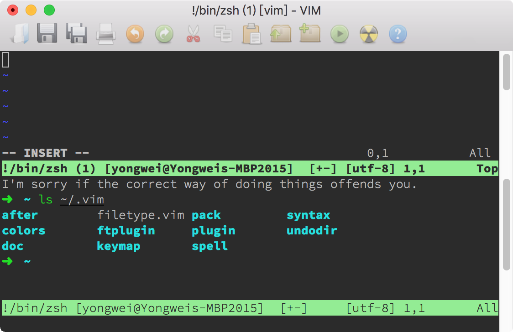

# 16｜终端和 GDB 支持：不离开 Vim 完成开发任务
你好，我是吴咏炜。

早在 Vim 和 Emacs 的“圣战”时期，Emacs 有个功能可是 Vim 用户一直暗暗垂涎的，那就是可以集成 GDB 来调试程序。Emacs 之所以能够实现这个功能，是因为它可以模拟一个终端环境，像终端一样跟一个程序进行输入输出的交互。这样一来，我们不离开编辑器，也能调试程序，既可以方便地看到目前执行在源代码的第几行，也可以直接在编辑器里跟执行中的程序进行交互。

很多主流的开发环境都支持类似的功能。但 Vim 一直不支持这样的功能，直到 Vim 8。虽然到得有点晚，但 Vim 也算是厚积薄发，利用 libvterm 给出了完整的终端支持。今天，我们就拿终端窗口支持和 GDB 支持，作为我们最后的技术话题来介绍了。

## 终端窗口支持

### 基本用法

使用 `:terminal`（缩写 `:term`）命令，我们可以在 Vim 的窗口中运行终端模拟器。基本的用法就是下面两种：

- 使用 `:terminal`，后面不跟其他命令，分割一个新窗口，并使用默认的 shell 程序进行终端模拟；shell 退出后窗口自动关闭（可用使用命令参数 `++noclose` 改变这一行为）。
- 使用 `:terminal 命令` 的方式，分割一个新窗口，在其中运行指定的命令并进行终端模拟；命令执行完成退出后窗口不自动关闭，保留执行中显示的信息（可用使用命令参数 `++close` 改变这一行为）。

跟其他的多窗口命令一样， `:terminal` 默认会进行横向分割，但你也可以在 `terminal` 前面加上 `vert` 来进行纵向分割，或加上 `tab` 来把终端窗口打开到一个新的标签页里。

跟 quickfix 窗口里只能看到程序的输出不同，在终端模拟器里我们既可以看到程序的输出，也可以向程序提供输入。同时，这个终端模拟器像一个真正的终端一样，能够支持色彩和其他的文本控制。你甚至可以在里面运行 Vim，就像 _Matrix_ 电影里层层嵌套的世界一样。



当然，从实用的角度，我并不建议你这么做——那样可能会让人头昏，并且容易在使用 `<C-W>` 和 `:q` 这样的命令时，出现结果跟自己预想不一致的情况。

终端模拟器的行为应当跟普通的终端一致；因此在 Vim 的终端模拟器里，你可以直接使用的命令跟一般的 Vim 窗口很不一样。毕竟，你在终端模拟器里输入 `:` 时，肯定不是想进入 Vim 的命令行模式吧？这时候，你需要知道下面这些在“终端作业模式”下的特殊命令（完整列表见 [`:help t_CTRL-W`](https://yianwillis.github.io/vimcdoc/doc/terminal.html#t_CTRL-W_N)）：

- `<C-W>N`（注意大写）或 `<C-\><C-N>` 退出终端作业模式，进入终端普通模式。这时终端窗口变成一个普通的文本窗口（终端缓冲区），不再显示色彩，但可以像普通的只读窗口一样自由使用，只是不能修改其中的内容而已。按下 `a` 或 `i` 可重新激活终端模拟器，进入终端作业模式。
- `<C-W>"` 后面跟寄存器号，表示粘贴该寄存器中的内容到终端里。
- `<C-W>:` 相当于普通窗口中的 `:`，执行命令行模式的命令。
- `<C-W>.` 可以给终端窗口发送一个普通的 Ctrl-W。
- `<C-W><C-\>` 可以给终端窗口发送一个普通的 Ctrl-\\。
- 大部分的 `<C-W>` 开始的命令仍然可以使用，如窗口跳转命令（后面跟 `j`、 `k` 等）、窗口大小调整命令（后面跟 `+`、 `_` 等），等等。

需要注意，终端模拟器里的光标只能用正常终端里的光标移动键来移动，比如在 Bash 默认配置下，可以用 `<C-A>` 或 `<Home>` 移到行首，用 `<C-E>` 或 `<End>` 移到行尾等。在退出终端作业模式后，光标就只是普通文本窗口的光标，不会影响终端模式里的光标位置——在你按下 `a` 或 `i` 时，光标还是在原来的位置，而不是退出终端作业模式后你移动到的新位置。你也不能修改终端缓冲区中的内容。只要稍微仔细想一想，你就知道这些是完全符合逻辑的。

当你从终端窗口切到另外一个窗口时，终端窗口里面的程序仍然在继续运行；如果你不退出终端作业模式的话，终端窗口里面的内容也会持续更新，跟正常的终端行为一致。要结束终端运行的话（而不只是临时退出终端模式），也跟普通的终端情况一下，可使用 `exit` 命令或 `<C-D>`。如果由于某种原因无法正常退出终端的话，则可以使用 `<C-W><C-C>` 来强行退出。

### 使用提示

如果你觉得自己不会在终端里另外启动 Vim，似乎也就很少有机会用到 `<Esc>` 了，那我们干吗不把这个键用作退出终端作业模式呢？说干就干：

```vim
tnoremap <Esc>      <C-\><C-N>
tnoremap <C-V><Esc> <Esc>

```

前缀 `t` 表示在终端作业模式下的键映射。我们把 `<Esc>` 映射到我们上面说的退出终端作业模式的快捷键；同时，我们又把 `<C-V><Esc>` 这一在终端里等价于 `<Esc>` 的按键组合映射为 `<Esc>`，这样万一我们需要 `<Esc>`，仍然可以用一种较为自然的方式获得这个按键。

遗憾的是，在 Unix 终端的情况下，很多功能键本身包含 `<Esc>`，因而会误触发这个键映射。对于这种情况，我们使用下面的键映射，用连按两下 `<Esc>` 退出终端作业模式效果更好：

```vim
tnoremap <Esc><Esc> <C-\><C-N>

```

此外，对于大部分人而言（像 Bram 这样，用 Vim 调试 Vim，不属于大众需求吧），在 Vim 的终端模式里启动 Vim，恐怕是失误的可能性最大。为了防止这样的失误发生，我们可以在 Vim 启动时检查一下，检测这种嵌套的 Vim 使用。你只需要把下面的代码加到 vimrc 配置文件的开头即可：

```vim
if exists('$VIM_TERMINAL')
  echoerr 'Do not run Vim inside a Vim terminal'
  quit
endif

```

你可以试验一下在 Vim 的终端窗口里再运行 Vim，看一下上面的代码产生的出错效果。

### 终端的用途

说了这么多，你可能有点疑惑，单独起一个终端有什么问题吗？我为什么要在 Vim 里运行终端呢？

我是这么理解的：

1. **方便。** 特别在远程连接的时候，有可能新开一个连接在某些环境里需要特别的认证，比较麻烦。即使连接没有任何障碍，你总还需要重新 cd 到工作目录里吧？而如果在一个现有的 Vim 会话里开一个新的终端，可以一个命令搞定，然后用你已经很熟悉的 Vim 命令在不同的窗口或标签页里切换。
2. **文本。** 我们可以从终端作业模式切换到终端普通模式，然后用我们熟悉的 Vim 命令来对缓冲区中的文本进行搜索、复制等处理工作。
3. **控制。** 你可以发送命令给终端，也可以读取终端屏幕上的信息。这样，事实上就打开了一片新天地，可以在 Vim 里做很多之前做不到的事情，比如，用 Vim 来比较两个屏幕输出的区别（ [`:help terminal-diff`](https://yianwillis.github.io/vimcdoc/doc/terminal.html#terminal-diff)）。

终端窗口相关的函数名称都以 `term_` 打头（可以查看帮助文件 [`:help terminal-function-details`](https://yianwillis.github.io/vimcdoc/doc/terminal.html#terminal-function-details)）。比如，如果我们想要用程序向缓冲区编号为 2（可以用 `:ls` 和 `:echo term_list()` 等命令来检查）的终端发送 `ls` 命令来显示当前目录下的文件列表的话，我们可以使用（注意转义字符序列要求使用双引号）：

```vim
call term_sendkeys(2, "ls\n")

```

下面这个比较无聊的例子，可以用来获取 ~/.vim 目录下的文件清单：

```vim
let term_nbr = term_start('bash')
call term_wait(term_nbr, 100)
let line_pos1 = term_getcursor(term_nbr)[0]
call term_sendkeys(term_nbr, "ls ~/.vim|cat\n")
call term_wait(term_nbr, 500)
let line_pos2 = term_getcursor(term_nbr)[0]
let result = []
let line_pos1 += 1
while line_pos1 < line_pos2
  call add(result, term_getline(term_nbr, line_pos1))
  let line_pos1 += 1
endwhile
call term_sendkeys(term_nbr, "\<C-D>")
while term_getstatus(term_nbr) != 'finished'
  call term_wait(term_nbr, 100)
endwhile
exe term_nbr . 'bd'
echo join(result, "\n")

```

这当然不是完成这件任务的最好方法，但上面的代码展示了终端相关函数的一些基本用法：

1. 我们用 `term_start` 命令创建一个新的终端，得到终端缓冲区的编号
2. 我们用 `term_wait` 等待 100 毫秒，待其就绪
3. 我们用 `term_getcursor` 获取光标的当前行号
4. 我们用 `term_sendkeys` 发送一个命令到终端上；ls 之后用 cat 是为了防止 ls 看到输出是终端而产生多列的输出
5. 然后我们等待命令执行完成并更新终端
6. 我们获取光标的当前位置，然后用 `term_getline` 获得上一次的行号和这一次的行号之间的行的内容，放到变量 `result` 里
7. 我们然后发送一个 `<C-D>` 到终端，结束作业
8. 然后我们等待到 `term_getstaus` 返回的状态成为 `'finished'`，即终端作业已经执行结束
9. 最后我们用缓冲区编号加 `bd` 命令删除缓冲区（所以屏幕上我们看不到这个终端窗口），并用换行符作为分隔符打印 ls 返回的内容

你可以实际测试一下这个脚本，体会一下这些基本功能。比如，可以把脚本存盘为 test.vim，然后用 `:so %` 来运行。

## GDB 支持

为什么 Vim 直到最近才支持 GDB 呢？因为这真不是件容易的事情啊。为了能在 Vim 里顺畅地使用 GDB，Bram 需要在 Vim 里实现下面这些不同的功能：

- 终端支持
- 作业（job）和通道（channel）
- 窗口工具条、弹出窗口和弹出式菜单

有了这些功能之后，Vim 通过一个内置的插件，就可以提供 GDB 的调试支持了。我们可以通过 `:packadd termdebug` 命令来加载这个插件，然后通过 `:Termdebug 可执行程序名称` 来调试一个可执行程序。

下面这个动图可以说明最主要的流程：


我简要说明一下需要注意的几点：

- `:Termdebug` 命令会把屏幕分成三个区域，从上到下分别是 gdb 命令行，程序输出，以及含调试控制按钮的源代码窗口。
- 在最上面的 gdb 窗口中，我们可以输入 gdb 的命令，但程序的输出和纯终端使用 gdb 的情况不同，是在中间的窗口输出的。
- 最下面的的源代码窗口里，我们有五个按钮可以用，允许习惯图形界面的用户使用鼠标进行操作。我们也可以使用鼠标右键直接在源代码行上设置断点。（当然，我们仍然可以在最上面的 gdb 窗口用命令来完成这些任务。）
- 鼠标在变量上悬停时，可以显示变量的值。只要 gdb 能打印的信息，它就能用浮动提示显示出来。这比手工使用 gdb 的 `p` 命令还是要方便多了。

还有一个需要稍微注意的地方是，如果你在不同的作用域有两个同名变量，那浮动提示只能显示当前作用域的变量的信息，即使你把光标放到不在当前作用域的变量上也是如此。这点上，Vim 还是比较笨的——毕竟它不理解代码。

## 内容小结

这讲我们介绍了 Vim 8 带来的新功能：终端支持。这个功能给 Vim 打开了一片新的天空。使用终端支持，我们可以不离开 Vim 打开一个或多个新的终端窗口，里面可以模拟真正的终端功能，包括色彩控制。我们可以使用 Vim 命令来处理新的终端缓冲区中的文本。我们还可以利用代码来控制这个终端和读取其中的内容。有了这些支持，Vim 也就顺理成章地支持使用 GDB 像集成开发环境一样地调试程序了。

根据我个人的经验，在使用了这个功能之后，我开启新远程连接比之前少了，而经常在一个服务器上只开一个连接，里面开一个 Vim 来完成所需的任务。编译和执行，可以全部在这个 Vim 会话里完成。

本讲我们的配置文件中加入了针对终端窗口的键映射和防 Vim 重入，对应的标签是 `l16-unix` 和 `l16-windows`。

## 课后练习

请尝试使用 `:terminal` 命令，打开一个新窗口，并在其中进行操作，然后退出终端作业模式，把终端缓冲区中的内容复制到新的缓冲区中。

如果你使用一种可以用 GDB 调试的编译语言的话，也请你尝试一下使用 `:Termdebug` 命令进行调试。如果你之前用的是纯命令行的 gdb 的话，这个功能还是有很大的易用性提升的。

最后，同样地，如果有任何问题或疑问，欢迎留言和我讨论！

我是吴咏炜，让我们在告别这个课程之前，再道一次再见。