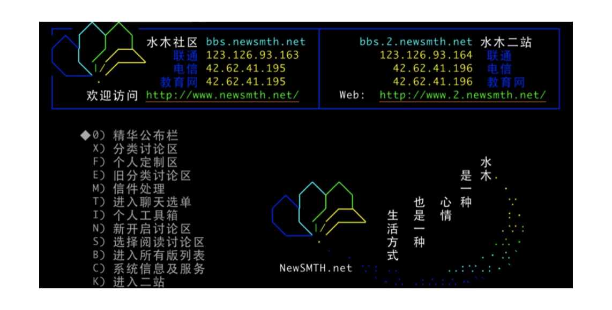

# 导读｜池建强：Vim 就是四个字“唯快不破”
你好，我是池建强。

操作系统、编程语言和编辑器是程序员永恒的讨论话题，技术发展了几十年，大家聊起这个来依然能争个面红耳赤。今天我就和你聊聊文本编辑器的那些事儿。

在文本编辑器领域，Vim 和 Emacs 是永恒的焦点。使用 Emacs 和 Vim 的程序员，平时大家各用各的，各自沿着不同的道路和目标前进，但总会在某个场景下相遇，愣一下就互相扔石头和臭鸡蛋，砸得对方鼻青脸肿，然后擦擦眼泪和口水继续前行。你看，编程也是有宗教信仰的，其实是个危险的工种，当真不是瞎扯。

我工作了二十多年，写程序有十几年，用过各种编程工具，用错过，也用对过，虽然每种优秀的编辑器都有传奇的故事，每个程序员都有自己的脾气，但是，如果让我推荐一款编程工具，那一定是 Vim。

**Vim 号称编辑器之神，唯快不破，可扩展，插件遍天下。学习曲线虽然陡峭，但是学成之后，基本上就成肌肉记忆了，写程序双手不离键盘，上下翻飞，可谓快意编程。**

我和 Vim 怎么结缘的呢？那得从 2000 年说起。

## 缘起

当时正值第一波互联网浪潮，我刚毕业不久，一如现在的热血青年，投身到互联网的大熔炉中。我所在的公司叫洪恩教育，公司里聚集了很多清华北大的同学，技术牛人扎堆，大家清一色使用 Vim 在服务器端编程，语法高亮都不设，内部 BBS 也是水木清华那种，通过终端访问，非常极客。走进办公室一眼望去，满目皆是黑漆漆的屏，绿瓦瓦的字，每个人都在那里噼噼啪啪地敲击键盘，韵律十足，我想，这简直酷毙了。

我最初还在使用 Editplus 编程，隶属菜鸟帮。别人的开发、编译和发布环境都在服务器端，而我则需要在本地编写好程序，通过 Editplus 的 ftp 功能上传到服务器端，再进行调试、测试和发布，不仅麻烦，而且不够酷。

那时候不酷是不行的，我这种行为遭到了小伙伴的无情嘲讽，于是我把愤怒都发泄在键盘上，每天在满天星斗的夜色中学习 Vim 技法，在清晨的微光中编译 Linux 内核，上午敲打键盘输出 Perl 程序，中午吃完五又四分之一口米饭之后开始研习 Vim 的多窗口和标签……

那时候我住在公司，时间充裕到让你不好意思不学习，虽然 Vim 资料匮乏，但我周边都是牛人啊，随时随地请教，不断练习，很快小有所成，编码时鼠标锁进抽屉，双手敲击键盘上下翻飞，成就感十足。我对语法高亮情有独钟，经常把自己的界面配置得花花绿绿，没事看看也是一件乐事。

自此以后，我就与 Vim 结下不解之缘，十几年过去了，工作中一直没有离开过Vim，断断续续一直在用。到了2009年，我开始把工作环境完全切换到了 Mac 上，记得当时打开 Mac 的终端时，欣喜若狂地想，这不就是 Vim、Shell 和 IDE 的完美集成么？

## 场景

在不同的场景下应该采用最适合的工具，这时就会有人问了，Vim 适合什么场景呢？

简单说来，Vim 比较适合 Unix/Linux 服务器端编程，如果你使用 Mac 电脑，Vim 是直接集成在你的终端环境中的，用起来十分方便。我以前用 Vim 主要用来进行 Shell/Python/C 编程。在 Unix/Linux 服务器端编辑和修改文件也离不开Vim，另外由于我个人工作环境是 Mac，所以修改文本文件、Code Reiview、批量替换文件、比对文件等工作，用 Vim 顺手就做了。

写 Java 程序、前端 HTML/CSS/JS、Objective-C 和 Swift，最优方案依次是 IDEA、VS Code、XCode 等，这些优秀的工具可以帮助我们提升效率，减少错误，但是如果你还想更进一步，那么 Vim 绝对值得拥有。

## 历史

Vim 源于 vi，但不是 vi，vi 作为计算机的文本编辑器历史极为悠远，它是由美国计算机科学家比尔·乔伊编写并于1976年发布的，同年苹果公司成立。比尔·乔伊是 Sun 公司的联合创始人和首席科学家，一位传奇的技术天才，我个人以为他最伟大的贡献是独立编写 BSD 操作系统，开发 vi 编辑器，创立 Sun 公司，当然，他还是 Java 语言的主要贡献者之一，任何人有幸完成其中一项工作已经足以名垂计算机发展史，而乔伊则通过一己之力完成了这些科技成果，推动了整个计算机科技的发展。

Vim 诞生得要晚一些，它的第一个版本由布莱姆·米勒在1991年发布，这个兄弟也是一位声名显赫的程序员，80 年代买了一台 Amiga 电脑，打开电脑一看，米勒鼻子差点气歪了，居然没有他最常用的 vi 编辑器！对于米勒来说这是不可接受的。

愤怒的米勒决定自己开发一个文本编辑器，完全复制 vi 的功能，并起名为Vi IMitation（模拟）。事实证明，优秀的程序员都具备这种品质，感到不爽了，就会写出个什么东西，要么完善一下，要么创新一下，要么是你写，要么是我写，于是很多伟大的软件程序就发明出来了。随着 Vim 的不断发展，更多更好的功能被加了进来，正式名称改成了Vi IMproved（增强），也就形成了现代的 Vim，目前最新的稳定版本是 8.2，Vim 的开发语言是 C 和 VimScript。

## 理念

Vim 是一款完全面向程序员的软件，我很少见到用 Vim 编辑文字的普通用户，如果你是，一定要告诉我。

写过程序的人都知道，编程的时候双手大部分时间都放在键盘上，或编码、或插入、或移动、或定位、或查找，这种连续操作的时间和频率远远大于阅读、翻页、设置字体、摆弄样式等文案工作，而二者往往产生很多停顿和间隙，而编程时的停顿是非常影响编程效率的，所以 Vim 的设计理念就是通过模式的转换、命令的组合和数以万计的插件，保证程序员在编程的过程中，双手尽可能保留在键盘中央的区域，并且，不需要鼠标。

想用好 Vim，先要理解 Vim 的模式转换。Vim 常用的模式有四种：

1. 普通模式：Vim 启动后的默认模式，用来移动光标、删除文本、覆盖输入文本、恢复操作、粘贴文本等等。
2. 插入模式：输入 i 或 a 进入插入模式，在这个模式下敲击键盘会往文字缓冲区增加文字，相当于普通编辑器的编辑模式。
3. 可视模式：选择文本，可以行选、块选和依次选择，选择后可以进行复制、删除、排序等操作。
4. 命令模式：执行内部和外部命令，通过“:”“/”“?”“:!”可以进入命令模式，分别对应的是：执行内部命令、向上或向下搜索、执行外部命令。

Vim 的模式和普通的编辑器有所不同，而且命令繁多千变万化，所以初期的学习曲线较高，一旦你坚持练习并且度过了最早的平台期，就会领略 Vim 的妙和全键盘的好。事实上 Vim 除了能够快速编辑文本文件之外，还能够通过简单的命令做更多的事情。

如何帮助你度过这个陡峭的学习曲线呢？这就是极客时间开设 Vim 专栏的初衷，吴咏炜老师是前英特尔亚太研发中心资深系统架构师，是《现代 C++ 实战 30 讲》的专栏作者，也是一位深度 Vim 用户。

他会带着你掌握即学即用的 Vim 高频命令，了解Vim 高阶用法和技巧，利用 Vim 脚本和插件实现常用功能，以及定制自己专属的 Vim 环境。

一旦你跟着吴老师学完了专栏，真正掌握了 Vim 这个高效率的工具，你会进入一个全新的世界，以前繁琐的编程和文本处理会变得简单有趣，如果你有兴趣，完全可以根据专栏所学的内容，定制一个强大的个性化开发工具，提升自己编程和日常工作效率。

下面我就交棒给吴咏炜老师，让我们一起开始学习吧。