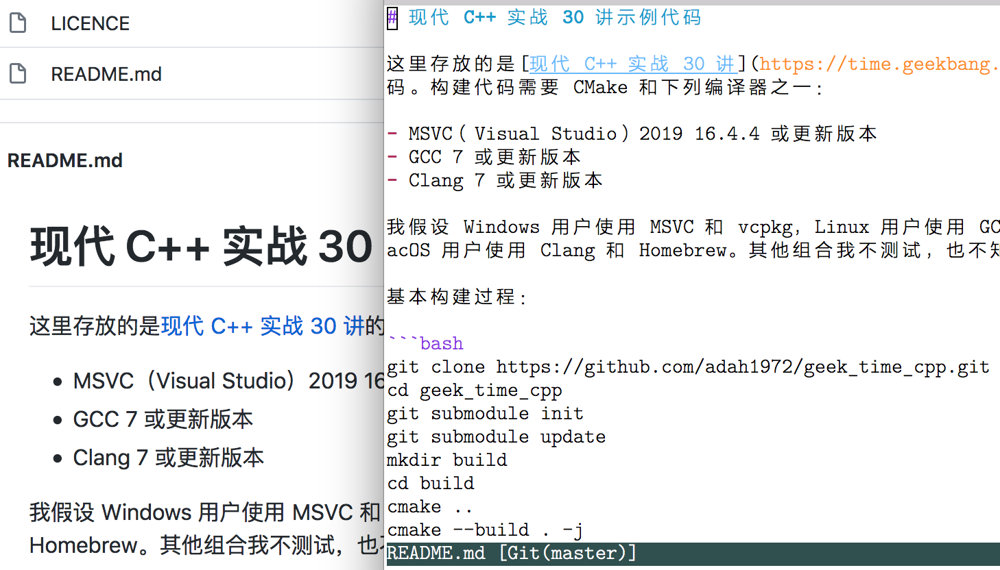
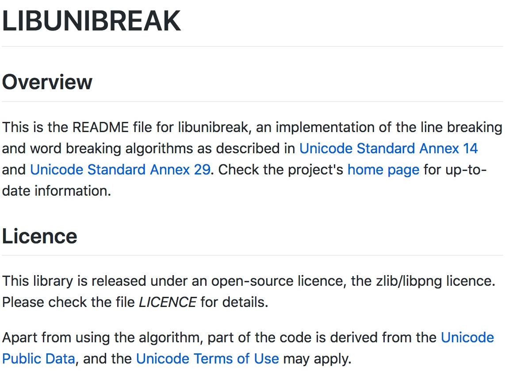
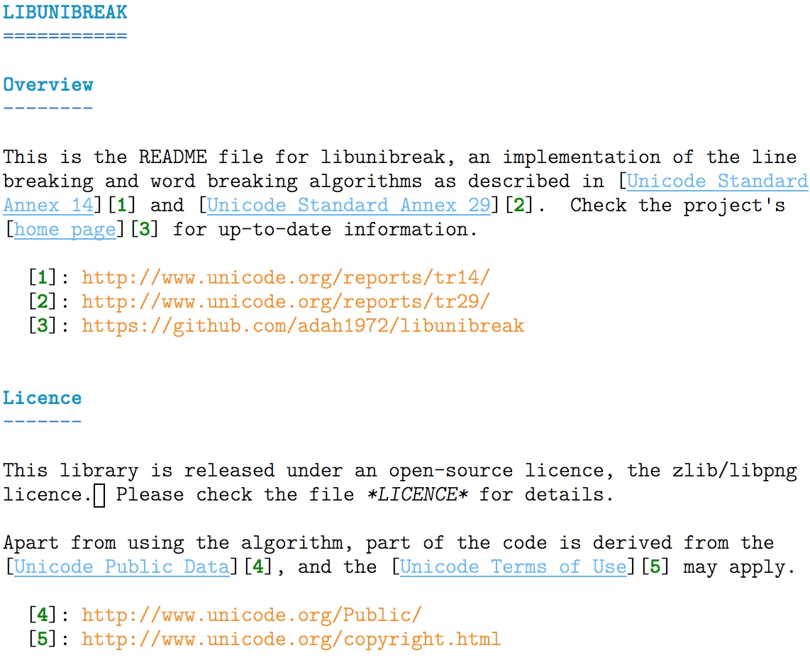
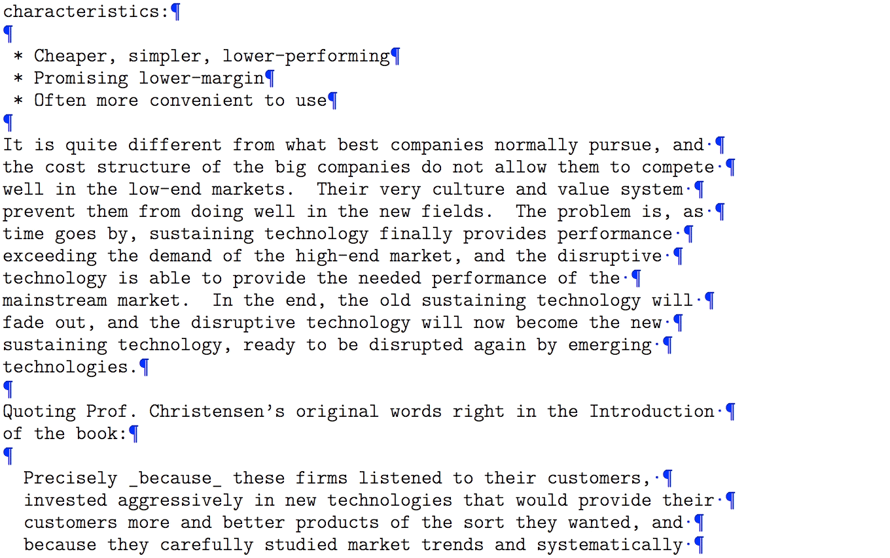
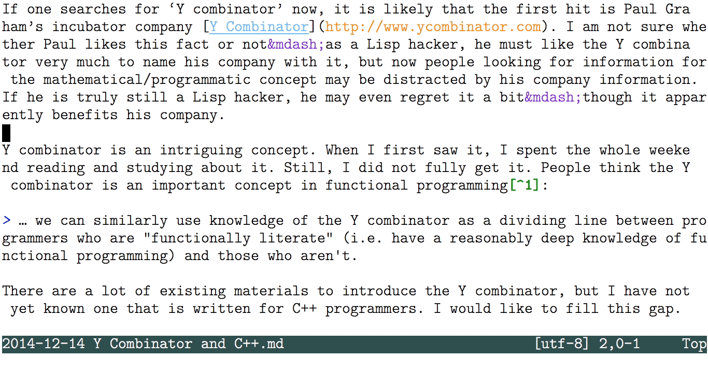
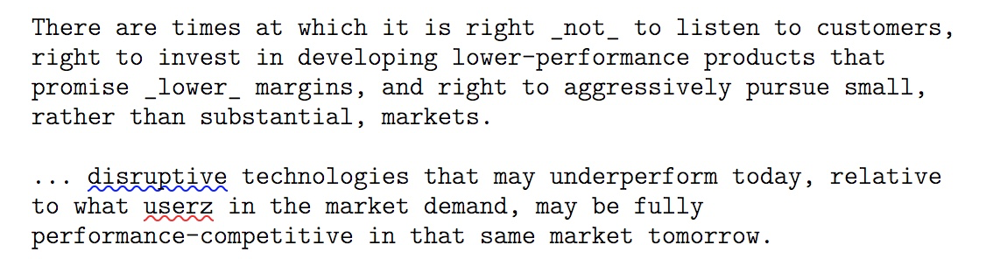
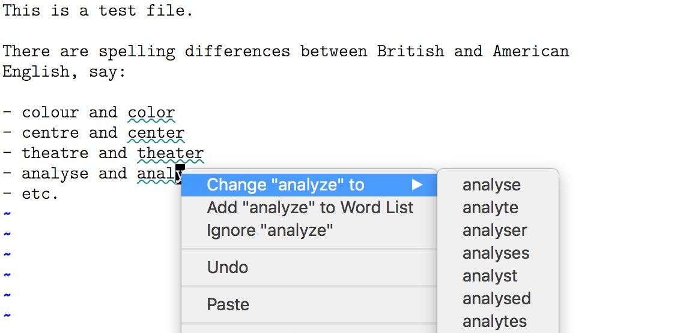
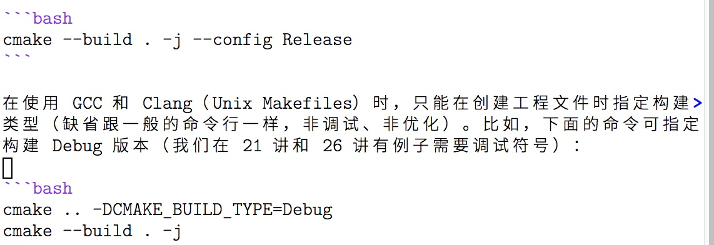
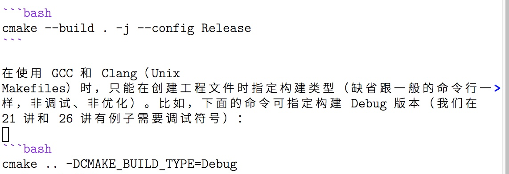
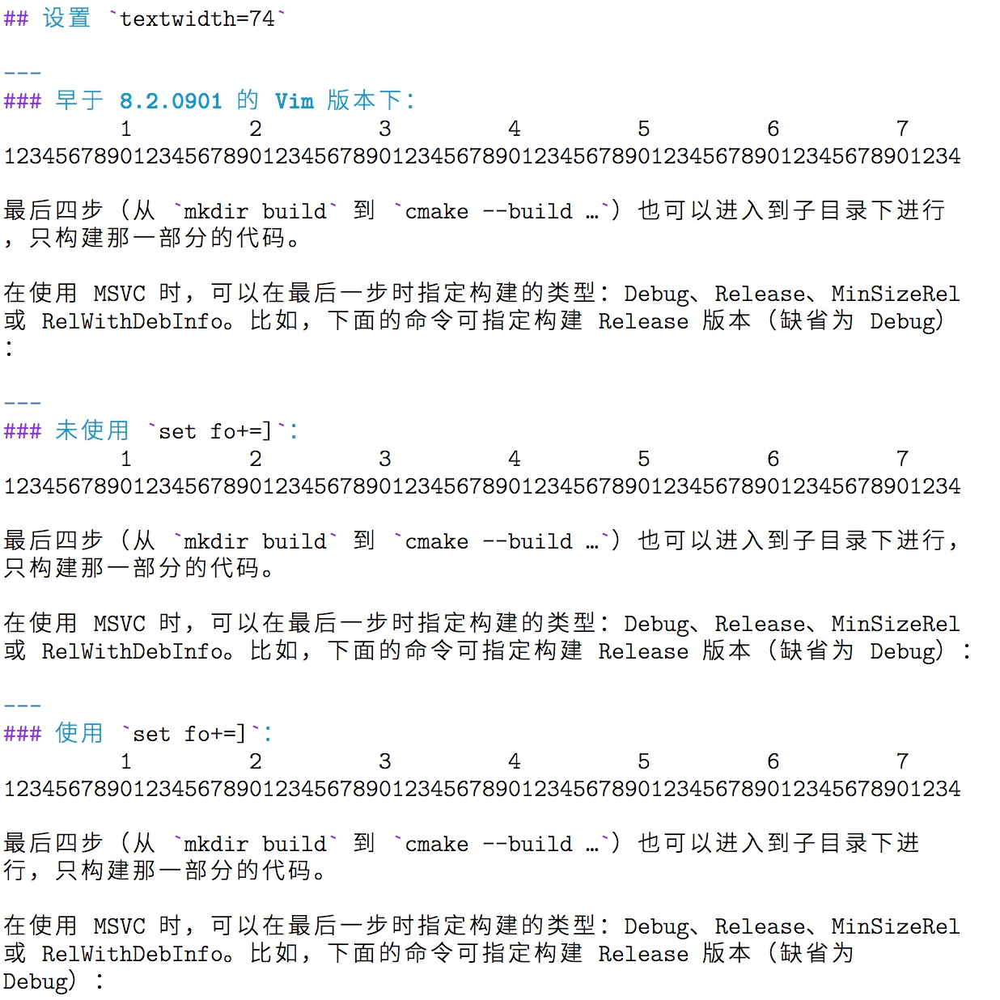

# 拓展1｜纯文本编辑：使用 Vim 书写中英文文档
你好，我是吴咏炜。

今天是拓展篇的第 1 讲，我想带你对 Vim 的纯文本编辑技巧做一个专项突破。由于 Vim 是在欧美世界诞生的工具，贡献者中也是说英语的人居多，因而它对英文的支持要远远超出其他语言。所以今天，我们就深入讨论一下，如何使用 Vim 来进行纯文本编辑，特别是英文的文本编辑。

熟练掌握这一讲的内容，可以让你使用 Vim 书写中英文文档时都感到游刃有余。如果你有这个需求，一定要亲自动手尝试我提到的这些功能，加深自己的记忆。如果你觉得还需要多花一点时间，消化吸收前几讲的基础知识，也可以先阅读全文，把握要点，之后再回过头来深入学习。

## 为什么不使用字处理器？

你可能已经开始怀疑了，我为什么要使用 Vim 来进行文字编辑？用 Word 不香么？如果嫌 Word 贵，还有免费的 WPS 啊……

嗯，首先，Word 和 WPS 这些字处理器不是用来生成纯文本文件的。在处理纯文本文件上，它们反而会有诸多劣势，如：

- 只能本地使用，既不能在远程 Linux 服务器上运行，也不能用 SSH/SCP 的方式打开远程的文件（除非在服务器上启用 Samba 服务，但体验真的不好）
- 分段和分行一般没有很好的区分
- 如果存成纯文本的话，格式会全部丢失

最后一句话似乎是废话？还真不是，纯文本文件里面是可以存储格式的，但 Word 和其他字处理软件对于文本类型一般只能支持纯文本或富文本（Rich Text），而富文本虽然包含了格式信息，但却对直接阅读不友好。我想，没有人会去手写富文本文件吧。仍有一些带格式的文本文件比较适合手写，下面这些是其中较为流行的格式：

- [Tex](https://zh.wikipedia.org/zh-cn/TeX) 和 [LaTeX](https://zh.wikipedia.org/zh-cn/LaTeX)，著名的特别适合写公式的文档系统，在数学和物理学界尤其流行。
- [DocBook](https://zh.wikipedia.org/zh-cn/DocBook)，基于 SGML/XML 的文档系统，可以生成多种不同的输出格式；大量开源软件的文档是用 DocBook 写的。
- [AsciiDoc](https://en.wikipedia.org/wiki/AsciiDoc)，功能和 DocBook 等价、但使用非 XML 的简化语法的文档系统；有的国外技术书出版社接受作者用这种格式提交的稿件。
- [HTML](https://zh.wikipedia.org/zh-cn/HTML)，HTML 的阅读友好性一般，但胜在熟悉的人多。
- [Markdown](https://zh.wikipedia.org/zh-cn/Markdown)，Markdown 的阅读体验非常友好，因而它虽然最“年轻”却最流行。接下来，我们就介绍一下这种文件类型。

### Markdown 简介

Markdown 是由 John Gruber（约翰 · 格鲁伯）在 2004 年发明的，它不是一种标准化的格式，存在着多个实现，功能也并不完备。尽管如此，由于它轻量、易写、易读，很快就在互联网上流行开了。在 GitHub 上，现在 README 文件一般都使用 Markdown。



通过工具（很多是开源的，如 [pandoc](https://pandoc.org/)），Markdown 可以很容易地转成网页、PDF 等其他格式，同时也很适合以纯文本的形式阅读。而 HTML、DocBook 等格式实际上是不太适合人直接看源代码来阅读的。此外，极客时间，以及很多写作平台，用的也是 Markdown。

事实上，在处理代码相关的文档时，Word 还真没有 Markdown 方便。Word 的某些“自动”功能，如把直引号替换为弯引号，会对键入代码造成干扰。而对嵌入的代码进行语法加亮，则是 Word 里没有、而 Markdown 里非常成熟的功能了……

不过，我们今天的重点不是 Markdown，而是怎么使用 Vim 来编辑上面提到的所有文件格式。没有了图形界面的简单化处理，你可以把控文本的一切细节，但同时，Vim 的语法加亮和文字编辑功能本身，也会让你编辑起来非常得心应手。鉴于 Markdown 的优势，我们今天的例子还是会用 Markdown。这样，你学了这一讲之后，至少会知道怎么高效地给开源项目写个 README 文件。

## 英文文本编辑

考虑到 Markdown 等标准在中文处理的标准化上面有先天不足，我们先学习文档的主语言为英文的情况。我们可以先看一眼下面的截图：



然后对比一下它的 Markdown 源代码在 Vim 中的展示效果：



我们明显可以看到，用 Vim 编辑 Markdown 文件时，虽然没有浏览器里显示得那么美观，但在使用等宽字体的前提下仍有着合适的语法加亮。

有两个细节值得关注一下：

- 跨行的那个链接加亮正常（我在至少两种其他环境下看到在方括号跨行时链接就无法得到正确的处理）。
- 单词“LICENCE”在 Vim 展示时也使用了斜体（一对星号中间的内容在 Markdown 里就是使用斜体强调），并且如果光标移出该行，星号会被自动隐藏，更方便阅读。

需要注意，在网页中的换行位置和源代码中的换行位置是不一样的。源代码中存在真正的换行（上一讲提到的 LF 或 CR LF 构成的行尾结束符）；而转换到网页显示之后，单个换行只相当于空格字符，浏览器里一行应当显示多少字符仍然由浏览器的宽度和样式表来决定。这就是标准的 Markdown 的行为了。

### 行宽设置

英文文本文件的惯例仍然是一行放不超过 80 个字符，所以在源代码中仍然是有手工断行的。这个习惯是为阅读“源代码”优化的：可以看到，上面这个 Markdown 文件虽然在浏览器里查看效果更好，以纯文本的形式查看也是非常干干净净、毫无问题——只要你的编辑器列宽大于等于 80 就行了。

我们上一讲已经提到了文本宽度选项 `textwidth`。在对英文文本编辑时，这个选项的推荐数值通常是 72，比标准列宽 80 稍窄。这个设置有历史原因，但更重要的是，这也是经过历史验证对人阅读比较舒适的设定：既不会产生频繁的换行而打乱阅读节奏，也不会因为行太长而发生寻找下一行起始位置的困难。

被誉为“排版圣经”的 _The Elements of Typographic Style_ 对行宽有这样的描述：

> Anything between 45 to 75 characters is widely regarded as a satisfactory length of line for a single-column page. . . . The 66-character line . . . is widely regarded as ideal.

我们说列宽 72，是指最大值，而使用 72 产生的实际文本宽度，差不多就是落在 66 这个理想值附近了。一些编码规范，如 Python 的 [PEP 8](https://www.python.org/dev/peps/pep-0008/)，也约定对文档内容的列宽数值应当是 72。 [大部分编码规范对代码宽度的约定稍宽松些，一般是 79 或 80。](https://en.wikipedia.org/wiki/Characters_per_line#In_programming)

### 格式化选项

我们上一讲已经提到格式化选项 `formatoptions`（缩写 `fo`），今天我们来稍微展开一下，看看这些格式化选项对我们写文档有什么样的影响。

在 Vim 里， `fo` 选项的默认值是 `tcq`。根据 Vim 的帮助文档，它们的含义是：

- `t`：使用 `textwidth` 自动回绕文本。
- `c`：使用 `textwidth` 自动回绕注释，自动插入当前注释前导符。
- `q`：允许 `gq` 排版时排版注释。

不过，根据你编辑的内容的语法，这个选项内容可能会发生变化。如运行支持文件里的 ftplugin/c.vim 里有下面的语句：

```vim
" Set 'formatoptions' to break comment lines but not other lines,
" and insert the comment leader when hitting <CR> or using "o".
setlocal fo-=t fo+=croql

```

即，正常输入非注释内容时，不进行回绕。但对注释还是要使用回绕的。另外几个我们还没检查过的选项是：

- `r`：在插入模式按回车时，自动插入当前注释前导符。
- `o`：在普通模式按 `o` 或者 `O` 时，自动插入当前注释前导符。
- `l`：插入模式不分行: 当一行已经超过 `textwidth` 时，插入命令不会自动排版。

上一讲我们用到的 `n` 则是：

- `n`：在对文本排版时，识别编号的列表。实际上，这里使用了 `formatlistpat` 选项，所以可以使用任何类型的列表。出现在数字之后的文本缩进距离被应用到后面的行。数字之后可以有可选的 `.`、 `:`、 `)`、 `]` 或者 `}`。注意 `autoindent` 也必须同时置位。

`formatlistpat` 的缺省值是 `^\s*\d\+[\]:.)}\t ]\s*`。也就是说，起始处有可选的空格，然后是至少一个数字，之后必须跟 `.`、 `:`、 `)`、 `]`、 `}`、制表符或空格中的一个，随后是可选的若干空格。

运行支持文件里的 ftplugin/markdown.vim 会对 `formatlistpat` 做额外的设定，使得 Vim 不仅可以识别数字列表，也能识别用 `-` 等字符开始的无序列表。有兴趣的同学可以自己分析一下。

如果你希望有比较接近字处理器的体验，不用自己手工断行，下面两个选项对英文文本编辑比较重要：

- `w`：拖尾的空格指示下一行继续同一个段落。而以非空白字符结束的行结束一个段落。
- `a`：自动排版段落。每当文本被插入或者删除时，段落都会自动进行排版。

这两个选项结合的效果，会让在 Vim 里编辑的效果在某种程度上接近字处理器：你会看到在某行增删内容会自动导致下面的行跟着卷动，你可以通过下面的动图看下效果（我使用了 Vim 的 `listchars` 选项来加亮行尾空格和行尾结束符）：



### 段中不换行的文本

到现在为止，我们讨论的英文文本编辑，基本都是行尾结束符不代表真正分行的情况。这种方式最常见，但也存在例外，如有些网站不使用标准的 Markdown 规则，把行尾结束符直接就当成换行了。在这样的情况下，我们就不应该在一段中间手工插入换行符。不过，由于这种方式不是 Vim 的“自然”处理方式，我们需要修改一些选项和处理习惯来应对这种情况。

首先，Vim 在默认配置下会在窗口宽度不足时自动折行显示，但不会对折行的位置进行特殊挑选，很可能会在单词的中间折行。我们可以设置选项 `linebreak`，告诉 Vim 要在 `breakat` 的字符上才可以折行。默认的 `breakat` 设置包含了空白字符和英文标点符号，因此直接可以在英文环境中进行使用。下图展示了 `linebreak` 的效果：



在这种模式下进行编辑时，另外一个要注意的问题是 `j` 和 `k` 移动的是一个物理行，而非屏幕行。这和很多编辑器的行为是不同的。要让光标一次移动一个屏幕行，需要的按键是 `gj` 和 `gk`。如果你希望 `<Up>` 和 `<Down>` 的行为跟主流的编辑器一致，可以考虑以下的设定：

```vim
" 修改光标上下键一次移动一个屏幕行
nnoremap <Up>        gk
inoremap <Up>   <C-O>gk
nnoremap <Down>      gj
inoremap <Down> <C-O>gj

```

最后，如果之前换行符不代表分段，现在你希望换行即分段，你可以用 `J`（代表 join，连接）命令把多行重新连接成一行。这个命令在某种程度上可以看作是 `gq` 的逆命令。由于这个命令根据字符的类型来决定是否插入空格和插入几个空格（参考 [`:help 'joinspaces'`](https://yianwillis.github.io/vimcdoc/doc/options.html#'joinspaces')），它并不能简单地用替换命令来代替。如果考虑最简单的情况（ `:set nojoinspaces`），那至少在 `formatoptions` 中含有 `w` 时，我们可以用下面的替换命令来连接同一段的所有行:

```vim
:%s/\([^\n]\)\s\+\n\s*\([^\n]\)/\1 \2/

```

事实上，使用 `joinspaces` 和 Markdown 的双行尾空格代表换行是潜在会冲突的。在 Markdown 中使用 `w` 时，应当使用 `nojoinspaces`。

### 模式行

到现在为止，我们讨论的好些选项，不仅不适合作为全局选项，也不适合作为某一文件类型的选项，而更适合用作单个文件的选项。Vim 也确实提供了这样的功能，叫做模式行（ [`:help modeline`](https://yianwillis.github.io/vimcdoc/doc/options.html#modeline)），能自己使用 `:setlocal` 仅对当前缓冲区设置本地选项。这个功能本身在帮助文件里说得挺清楚，我就不重复了。

在上面图里的那个文本文件中，我使用了下面的模式行：

```vim
vim:set et sts=2 tw=68 com-=mb\:* com+=fb\:* fo=tcqaw:

```

上面这个模式行，除了设定了我们讨论过的 `et` 扩展 tab 为空格选项、 `sts` 软 tabstop 选项、 `tw` 行宽选项和 `fo` 格式化选项外，对 `comments`（缩写 `com`）选项进行了调整，不用星号作为注释中间部分的开始（ `mb`），而用星号作为一个列表的开始（ `fb`）。关于 `comments` 选项的详细解释可以参看帮助文档 [`:help format-comments`](https://yianwillis.github.io/vimcdoc/doc/change.html#format-comments)，我这儿就不展开了。

### 拼写检查

写英文时启用自动拼写检查，这是一个写作的好习惯。哪怕你英语很好，也可能因为疏忽而拼错。Vim 从版本 7 开始，就内置了拼写检查的功能，可以通过选项 `spell` 来打开。



上面我存心写错了一个地方（“userz”），被 Vim 用红波浪线标了出来。标蓝波浪线的是 Vim 提醒我，句首一般需要首字母大写（此处没有错误）。另外，可以注意到单个换行是不会被 Vim 当作一段结束的，因此行首的“right”和“promise”等单词不会被 Vim 当成有拼写问题。

在 macOS 和 Windows 的图形界面 Vim 里，右键默认就可以弹出拼写纠正菜单，跟大部分其他有拼写检查功能的软件差不多。在 Linux 上，右键默认是 xterm 标准的扩展选择区域的行为。要让右键在 Linux 下也能弹出菜单，你需要手工在 vimrc 配置文件里加入：

```vim
set mousemodel=popup_setpos

```

这可以算是图形界面的 Vim 跟终端 Vim 比起来的明显优势了：终端 Vim 显示不了波浪线，对右键的响应也通常有问题。在终端 Vim 里，你可能就需要去记拼写检查的命令了（见帮助 [`:help spell`](https://yianwillis.github.io/vimcdoc/doc/spell.html#spell)）。

Vim 拼写检查的默认语言是英语。对不同语言的支持，我们可以使用 Vim 选项 `spelllang` 来设定。比如，如果你希望按照英式英语的拼写，那你可以设置：

```vim
set spelllang=en_gb

```

这样一来，Vim 就会把非英式英语的拼写方式用绿色波浪线（当然，这和色彩方案有关）标出来。在图形界面 Vim 里，你同样可以很方便地用右键点击来更改：



你如果希望使用美式英语，当然使用 `:set spelllang=en_us` 就可以了。同时使用英式和美式，可以用 `:set spelllang=en_gb,en_us`。如果任何英语拼写都能接受，那使用默认值或 `en` 就行。

作为东亚文字的特殊情况，如果你希望所有的东亚字符不被标成拼写错误的话，可以在 `spelllang` 选项里使用特殊值 `cjk`。作为中国人，我们可能会需要这么用：

```vim
set spelllang+=cjk

```

### 拼写完成

我们之前提到了 Vim 支持用一个字典文件来进行拼写完成，你可以在帮助 [`:help 'dictionary'`](https://yianwillis.github.io/vimcdoc/doc/options.html#'dictionary') 里找到相关的信息。不过，这种方式需要你手工去寻找一个字典文件，并在 vimrc 里进行配置，不那么方便。更简单的方式，是 **先启用拼写检查**，然后正常使用拼写完成的快捷键 `<C-X><C-K>` 即可。如果你完整拼出了单词，但 Vim 提示拼错了，你也可以使用快捷键 `<C-X>s` 来使用和查看拼写建议。

**注意：** 虽然 `<C-S>` 在图形界面 Vim 里可以使用，但终端（不是 Vim）可能会解释 `<C-S>` 为特殊控制字符，因而我们一般不使用 `<C-X><C-S>`。如果你发现一不小心键入 `<C-S>` 导致终端表现得像失去响应一样，一般可以用 `<C-Q>` 来恢复。

## 中文文本编辑

跟英文文本编辑类似，中文处理同样有段中有断行和段中无断行两种方式。如果段中有断行，中文的主要处理麻烦是在转换成 HTML 或其他格式时通常不应该把行尾结束符转换成空格。我目前测下来，GitHub 的 Markdown 能有这样的合理行为，但很多其他工具，如 pandoc，则没有对中文作这样的特殊处理。因此，中文文档还是不在段中进行断行更保险一些。

这两种文本组织方式 Vim 都是能处理的，其方式和英文文本编辑差不多，差别主要表现在下面两点。

首先，英文段中不分行时我们推荐使用 `linebreak` 选项，但中文段中不分行时我们则不推荐启用这个选项。因为让 Vim 挑空格位置来折行，反而会让中文文本显得乱、不好看。下面的图展示了区别：





其次，Vim 在处理中日韩（CJK）文字时在格式化选项 `formatoptions` 里是有些特殊设置的。我们重点关注下面 4 个：

- `m`：可以在任何值高于 255 的多字节字符上分行。这对 CJK 文本尤其有用，因为每个字符都是单独的单位。
- `M`：在连接行时，不要在多字节字符之前或之后插入空格。优先于 `B` 标志位。
- `B`：在连接行时，不要在两个多字节字符之间插入空格。有 `M` 标志位时无效。
- `]`：严格遵循 `textwidth` 选项。当设定这个标志时，除非断行禁则使得行长不可能保留在限定的文本宽度以内，行长不允许超出限定的文本宽度。这个选项主要用于 CJK 文字，并且仅在 `encoding` 是 `utf-8` 时才生效。

如果文档的主语言是中文（或日文、韩文），那 `m` 肯定是需要设置的，这样才能在中文之中断行。 `M` 和 `B` 一般我们也会设置其中一个，取决于行文规则，在中文和西文字符之间是否手工插一个空格。如果不插空格，那就用 `M`；如果用空格（就像本文一样），那就用 `B`。由于 Vim 不区别汉字和汉字标点，使用 `B` 时会导致全角标点前后出现空格，我一般仍然使用 `M` 而不是 `B`。

标志 `]` 是和 CJK 断行规则一起在 Vim 8.2.0901 这个版本引入的。你可以通过下面的截图看下这个标志的效果：



换句话说，默认未使用 `]` 标志时，Vim 的行为是允许 CJK 标点符号突出到 `textwidth` 限定的宽度以外；使用 `]` 标志则不允许这样的特殊处理。你可以按照个人喜好和文本类型来酌情使用这个选项。

## 内容小结

在这一讲，我们讨论了使用 Vim 进行文本编辑的一些要点，重点是对 Markdown 文件进行编辑。学过这讲之后，我们应当记住：

- 中英文文本编辑通常有段中换行和段中不换行两种惯例，英文文本使用段中换行居多，而中文文本使用不换行的比例要高得多。
- Vim 的 `textwidth` 选项用来设置一行文本的最大（半角）字符数，对于英文，72 是一个常见的数值。
- Vim 的 `formatoptions` 选项可以设置很多如何对文本进行格式化的标志，很多文件格式插件（ftplugin）会对其进行设置。
- 模式行可以用来记录只对单个文件生效的 Vim 选项；如果文件有特殊的格式化要求，可以写在模式行里。
- Vim 提供了拼写检查和拼写完成功能，可以用于英文等字母文字。
- 如果使用段中不换行的惯例，则英文文本应当使用 `linebreak` 选项，但中文文本不应当使用该选项。
- 在处理中文文本时， `m`、 `M`、 `B` 和 `]` 是可能有用的特殊 `formatoptions`，应当根据实际需要使用。

本讲我们的配置文件有几处改动，对应的标签是 `x1-unix` 和 `x1-windows`。

## 课后练习

请尝试写一个小小的英文 README.md，内容不限，可以从其他地方复制。要求是：

1. 内容除标题外至少三段，每段至少两行
2. 使用模式行控制选项
3. 段中分行，启用自动格式化但不使用行尾空格的方式
4. 尝试在该文件中嵌入代码
5. 想一想，为什么 `a` 选项一般和 `w` 选项一起使用

你在写 README 文件，或者其他文本文档时，还遇到过其他问题吗？请及时和我交流。你也可以把今天这一讲的内容，分享给身边其他需要编辑纯文本文件的朋友。

我是吴咏炜，我们下一讲再见！