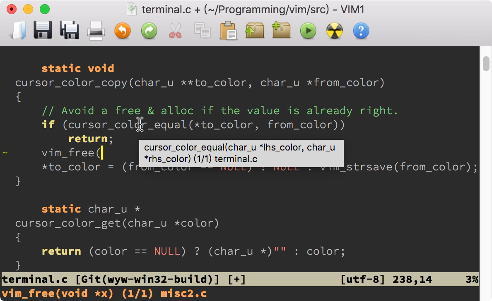
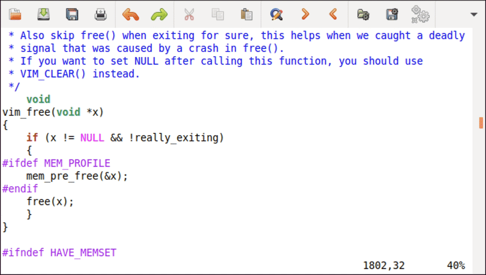
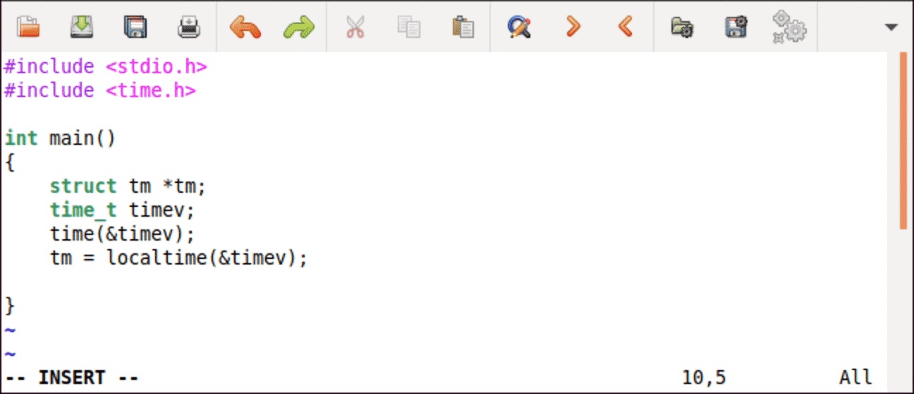
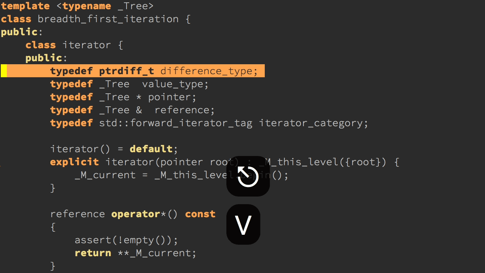

# 拓展2｜C 程序员的 Vim 工作环境：C 代码的搜索、提示和自动完成
你好，我是吴咏炜。

从今天开始，我们会用连续 3 讲，深入讨论怎么为编程定制环境。如果你是 C 程序员，那么今天这一讲对你来说毫无疑问是必修课。如果你用的是类 C 语言，也能从这一讲中学到很多有用的内容，尤其是在语法加亮精调、tags 和 Clang-Format 部分。

## 语法加亮精调

在 [第 4 讲](https://time.geekbang.org/column/article/267765) 中我们已经学到了，Vim 能根据文件类型对代码进行加亮。在 [第 12 讲](https://time.geekbang.org/column/article/275752) 里，我们还进一步讨论了 Vim 实现语法加亮的细节，知道这些是如何通过代码来进行控制的。对于 C（含其他基于 C 的语言如 C++），语法加亮文件有一些精调选项，还挺有意思，能应对一些特殊场景的需求。我一般会设置以下几项：

```vim
let g:c_space_errors = 1
let g:c_gnu = 1
let g:c_no_cformat = 1
let g:c_no_curly_error = 1
if exists('g:c_comment_strings')
  unlet g:c_comment_strings
endif

```

第一项 `c_space_errors` 用来标记空格错误，包括了 tab 字符前的空格和行尾空格，这样设置之后 Vim 会把这样的空格加亮出来。

第二项 `c_gnu` 激活 GNU 扩展，这在 Unix 下一般是必要的。

第三项 `c_no_cformat` 不对 `printf` 或类似函数里的的格式化字串进行加亮。这条可能看个人需要了。我是对错误的加亮超级反感，所以关闭这种不分场合的加亮。

第四项 `c_no_curly_error` 也是为了让一些 GNU 的扩展能够正确显示，不会被标志成错误。

最后，Vim 默认会在注释中加亮字符串和数字（ `c_comment_strings`）。虽然这种加亮有时候也能派上用场，但这种配置下我常常在注释中见到错误的加亮，所以我还是关闭这个功能。

关于这些选项的说明，以及其他的 C 语法加亮选项，你可以查看帮助 [`:help ft-c-syntax`](https://yianwillis.github.io/vimcdoc/doc/syntax.html#ft-c-syntax)。

## Tags

我们在 [第 8 讲](https://time.geekbang.org/column/article/271208) 里已经讨论过了 tags 文件。回想一下，tags 是 ctags 工具分析你的代码之后生成的可读文本符号数据库，帮助你找到一个符号的定义所在位置。这个 tags 格式有点简单、有点平（tǔ），却也正好像极了 C 语言的特点：简单，平淡，然而强大。

C 是一种比较简单的语言，近些年来没有什么大变化。因而如果你能安装 Universal Ctags 固然好，但很多包管理器里自带的 Exuberant Ctags 也基本够用了。本讲中的内容只要求 Exuberant Ctags。

推而广之，本讲我们用到的工具都比较简单，且容易获得。这实际上就是我把 C 和 C++ 分开的原因——要处理好 C++，需要的工具就会复杂不少。

回到 tags。Exuberant/Universal Ctags 有大量的命令行参数，如果我们要对某个目录下的所有 C 代码生成 tags 文件，我们可以使用：

```bash
ctags --languages=c --langmap=c:.c.h --fields=+S -R .

```

这儿我用了 `--languages` 选项来指定只检查 C 语言的文件；同时，因为 .h 文件默认被认为是 C++ 文件，所以我使用 `--langmap` 选项来告诉 ctags 这也是 C 文件。而 `--fields=+S` 的作用，是在 tags 文件里加入函数签名信息。我们后面会看到这类信息的作用。

这样生成的 tags 文件只考虑符号的定义，而不考虑符号的声明。对于大部分项目，这应该是合适的。如果你希望 Vim 能跳转到函数的声明处，则需要加上 `--c-kinds=+p`，让 tags 文件包含函数的原型声明。但是这样一来，一个函数就可能有原型声明和实际定义这两个不同的跳转位置，所以通常你不应该这样做。我只对系统的头文件生成 tags 文件时使用 `--c-kinds=+p`。

此外，一个可能的麻烦就是 tags 文件需要进行更新。对于一个更新不频繁的项目，最简单的方式就是在开始时运行一下上面的命令，然后就一直不管了。而对于活跃开发中的项目，我们需要更好的办法。

一个最简单的办法，显然就是在文件存盘后自动运行上面这样的命令。比如：

```vim
function! RunCtagsForC(root_path)
  " 保存当前目录
  let saved_path = getcwd()
  " 进入到项目根目录
  exe 'lcd ' . a:root_path
  " 执行 ctags；silent 会抑制执行完的确认提示
  silent !ctags --languages=c --langmap=c:.c.h --fields=+S -R .
  " 恢复原先目录
  exe 'lcd ' . saved_path
endfunction

" 当 /project/path/ 下文件改动时，更新 tags
au BufWritePost /project/path/*  call
      \ RunCtagsForC('/project/path')

```

但这种方式对于大项目是不可行的，因为会在文件存盘时引入不可接受的时延。还好，Ctags 支持用 `-a` 选项对 tags 文件做渐进式更新。把上面的后两段代码换成下面这样就可以了：

```vim
function! AppendCtagsForC(file_path)
  let saved_path = getcwd()
  exe 'lcd ' . a:root_path
  exe 'silent !ctags --languages=c --langmap=c:.c.h --fields=+S -a '
        \. a:file_path
  exe 'lcd ' . saved_path
endfunction

au BufWritePost /project/path/*  call
      \ AppendCtagsForC('/project/path/', expand('%'))

```

在执行很多 Vim 命令时，可以用 `%` 指代当前文件；而在调用函数时，就得用 `expand` 函数了（可查看帮助文档 [`:help expand()`](https://yianwillis.github.io/vimcdoc/doc/eval.html#expand())）。代码中的其他内容你应当可以理解了。

如果你觉得上面这样做太麻烦的话，有个好消息是已经有人把类似于上面、但更加完善的功能做成了插件。插件 [ludovicchabant/vim-gutentags](https://github.com/ludovicchabant/vim-gutentags) 可以完成 tags 文件的管理工作。如果你希望 tags 文件能自动更新的话，这个插件很可能可以满足你的所有需求：基本上你只需要配置它的选项，而不需要自己写 Vim 脚本代码。

不过，如果你在一个大项目上工作，代码很少发生结构性更动的话，也许在 shell/cron 里定期执行 ctags 命令，是个最简单、最不对开发者造成干扰的选项。毕竟，靠编辑器触发 ctags 命令也不那么可靠——因为很多其他操作（比如 git 切换分支）之后，你也同样需要更新 tags。

## EchoFunc

记得我们刚刚讲过在 tags 文件里加入函数签名信息吧？下面我们就要用上了。EchoFunc 插件可以用来回显函数的原型。

首先我们需要安装 [EchoFunc](https://github.com/mbbill/echofunc)，使用包管理器安装 mbbill/echofunc 即可。然后，如果你有正确的 tags 文件，现在当你输入函数名加 `(` 时，Vim 就会在屏幕底部自动提示函数的原型了：



上图中实际上表现了 EchoFunc 的两个效果：一个是我们说的屏幕底部的原型回显，还有一个是鼠标移到符号上的气泡显示。后一个功能默认也是开启的（需要图形界面），但可以通过在 vimrc 配置文件中加入 `let g:EchoFuncAutoStartBalloonDeclaration = 0` 来禁用。

此外，当一个函数有多个原型声明时，可以用 _Alt_- **=** 和 _Alt_- **-** 键来进行切换。但在 Mac 上，我和明白当年选择了把 _Alt_- **-** 改成了 _Alt_- _Shift_- **=**。原因我现在想不起来了，估计是因为在 Mac 键盘上 _Alt_- **-** 会产生短破折号（“–”），我们写文档时仍然可能会用到；而 _Alt_- **=** 和 _Alt_- _Shift_- **=** 产生的分别是不等号（“≠”）和正负号（“±”），基本上不会在 Vim 里使用。

## Cscope

虽然 tags 是一个很有用的工具，但在我们常见的代码跳转操作里它只做到了一半：可以通过符号名称（从使用的地方）跳转到定义的地方，但不能通过符号名称查找所有使用的地方。这时候，我们有两种基本的应对策略：

- 使用搜索工具（第 8 讲讨论过的 `:grep`）
- 使用专门的检查使用位置的工具

诚然，第一种方式很常用、也很通用，但这毕竟是一种较“土”的办法，其主要缺点是容易有误匹配。第二种方法如果能支持的话，在完成大部分任务时会比第一种方法优越。

对于 C 代码，我们有这样的现成开源工具。由于 Vim 直接内置了对 [Cscope](http://cscope.sourceforge.net/) 的支持，因此我们今天就讨论一下 Cscope。

根据 Cscope 的文档，它的定位是一个代码浏览工具，最主要的功能是代码搜索，包括查找符号的定义和符号的引用，查找函数调用的函数和调用该函数的函数，等等。查找引用某符号的地方、调用某函数的地方、包含某文件的地方，就是 Cscope 的独特之处了。

### 安装和配置

用 Cscope 之前，我们首先得把它装起来。我们先要安装 Cscope 本身：

- Ubuntu 下可使用 `sudo apt install cscope`
- CentOS 下可使用 `sudo yum install cscope`
- macOS 下可使用 `brew install cscope`
- Windows 下可在 [cscope-win32](https://code.google.com/archive/p/cscope-win32/downloads) 项目里下载 cscope.exe 的可执行文件，然后放到 PATH 设定里的某一个目录下即可

然后我们需要映射使用 Cscope 的按键。Cscope 的网站上提供了一个映射的脚本，不过，它里面用到了 `<C-Space>`，这个快捷键在很多系统上是会有问题的。因此我替换了一下，你可以安装 adah1972/cscope\_maps.vim 来使用它。现在：

- 使用 `<C-\>` 加 Cscope 命令是在当前窗口里执行 Cscope 命令
- 使用 `|`（Shift-\\）加 Cscope 命令是横向分割一个窗口来执行 Cscope 命令
- 使用 `||` 加 Cscope 命令是纵向分割一个窗口来执行 Cscope 命令

Cscope 也可以配合 quickfix 窗口使用，这样，相应命令的结果就会放到 quickfix 窗口里，而不是直接在界面上提供一个可能有几千项的列表让你选择。一般推荐在 vimrc 配置文件里加入：

```vim
set cscopequickfix=s-,c-,d-,i-,t-,e-,a-

```

我们就采用这样的设定。

### 创建 Cscope 数据库

要创建 Cscope 的数据库，只要在项目的根目录下运行 `cscope -b` 即可。拿 Vim 的约 50 万行代码为例，在我的笔记本上首次运行该命令需要四秒，产生了一个 13M 大小的 cscope.out。后面再运行该命令，Cscope 只会更新修改的部分，那就快得多了。不过，跟 Ctags 比，不管是首次创建，还是后面更新，Cscope 都要慢一点。这当然也很正常，毕竟 Cscope 要干的事情更多。

### 使用

上面我们已经提到了 Cscope 命令，但我们还没有说过 Cscope 到底有哪些命令。我们可以简要列表如下：

- `g`：查找一个符号的全局定义（global definition）
- `s`：查找一个符号（symbol）的引用
- `d`：查找被这个函数调用（called）的函数
- `c`：查找调用（call）这个函数的函数
- `t`：查找这个文本（text）字符串的所有出现位置
- `e`：使用 egrep 搜索模式进行查找
- `f`：按照文件（file）名查找（和 Vim 的 `gf`、 `<C-W>f` 命令相似）
- `i`：查找包含（include）这个文件的文件
- `a`：查找一个符号被赋值（assigned）的地方

比如，我们在 Vim 的源代码里要查找 `vim_free` 函数的定义，只需要键入命令 `:cscope find g vim_free`，或者把光标移到符号 `vim_free` 上，然后按下 `<C-\>g`。在目前的配置下，使用 `<C-]>` 也可以，因为 cscope\_maps.vim 脚本里设置了 `:cscopetag` 选项（参见帮助 [`:help cscopetag`](https://yianwillis.github.io/vimcdoc/doc/if_cscop.html#cscopetag)）。

如果我们想要使用分割窗口，那对应的命令是 `:scscope find g vim_free`，光标已经在符号上时的按键是 `|g` 或 `<C-W>]`。如果我们想要垂直分割窗口，那命令是 `:vert scscope find g vim_free`，光标已经在符号上时的按键是 `||g`。

其他的 Cscope 命令也类似，把 `g` 替换成相应的命令即可。值得提一下，虽然 `t` 和 `e` 命令在 Vim 里可以用 `:grep` 命令替代，但这两个命令执行起来要比 `:grep` 快。当然，Cscope 的真正优势还是 `s`、 `c`、 `i`、 `a` 这样的命令。下面展示的是在一个 Vim 源文件中执行符号引用查找（ `s`）的结果，可以看到比 `:grep` 还是方便快捷了很多的：



## ClangComplete

下面，我们来讨论一下一个新话题，C 代码的自动完成。

众所周知，Clang 是一个目前很流行的、模块化的 C/C++ 编译器。它跟其他 C/C++ 编译器最不一样的地方，是它让其他程序能够很容易利用 Clang 对源代码的处理结果。目前很多对 C/C++ 源代码进行处理的工具，都是基于 Clang 来开发的。 [ClangComplete](https://github.com/xavierd/clang_complete) 也是其中的一个，它在 Vim 中添加了对 C/C++ 代码的自动完成功能。

说到这里，我需要强调一下，ClangComplete 目前已经不是我最推荐的自动完成插件了——我更喜欢下一讲要讨论的 YouCompleteMe，它的功能更为强大，使用也更为方便。不过呢，ClangComplete 在某些环境里安装起来更加简单，如果出于某种原因，你的系统上安装 YouCompleteMe 不成功，那么 ClangComplete 也不失为一个后备方案。

此外，在我的配置方案里，ClangComplete 和 YouCompleteMe 是可以共用配置文件的，所以讲 ClangComplete 的功夫也不会完全白费。下面我就简单地介绍一下。

### 安装

ClangComplete 对系统的基本要求就是你已经安装了 LLVM/Clang。你需要告诉 ClangComplete，在哪里可以找到 libclang。

Windows 下默认是没有 Clang 的，如果你不是已经安装了 Clang，你可以直接跳过这节，直奔下一讲讨论 YouCompleteMe 的安装过程。

在 macOS 上，如果你安装了开发工具，那其中就应该有 libclang，通常你可以在 /Library/Developer/CommandLineTools/usr/lib 目录下找到 libclang.dylib，或者如果你用 Homebrew 安装了 llvm 的话，应该可以在 /usr/local/opt/llvm/lib 目录下找到 libclang.dylib。

在 Linux 上，这又是个跟发布版相关的问题了。我们一般可以通过关键字“libclang”、“clang”和“llvm”（从最特别到最通用）来查找。在 Ubuntu 18.04 上，我们可以在使用命令 `sudo apt install libclang1-10` 之后找到文件 /usr/lib/x86\_64-linux-gnu/libclang-10.so.1。在 CentOS 7 上，我们可以在 [安装 LLVM Toolset 7.0](https://www.softwarecollections.org/en/scls/rhscl/llvm-toolset-7.0/) 之后找到文件 /opt/rh/llvm-toolset-7.0/root/usr/lib64/libclang.so。这些路径我们等会儿就要用到。注意如果 libclang 的文件名不是“libclang”加平台的动态库后缀的话，我们需要使用 libclang 的完整名字。

有了 libclang 之后，ClangComplete 本身的安装很简单，就是在包管理器里安装 xavierd/clang\_complete，然后在 vimrc 配置文件里加一个全局变量，告诉 ClangComplete 在哪儿可以找到 libclang。比如，在上面说的 Ubuntu 18.04 里，我们就应该在 vimrc 配置里加上：

```vim
let g:clang_library_path = '/usr/lib/x86_64-linux-gnu/libclang-10.so.1'

```

下面就是我们在这样配置过后，在 Ubuntu 里得到的结果：



我们可以看到，现在 Vim 知道了 `tm` 是个结构的指针，并且知道指针的成员有哪些。

这个例子比较简单，如果我们在命令行上进行编译的话，不需要任何特殊参数。如果我们命令行上需要参数，那很可能 ClangComplete 也需要知道这些参数，才能正确工作。这些参数信息应该放在文件所在目录或其父目录下的名为 .clang\_complete 的文件里。比如，我的 [极客时间 C++ 课程的示例代码里就有这个文件](https://github.com/adah1972/geek_time_cpp/blob/master/.clang_complete)，内容也很简单：

```text
-std=c++17
-D ELPP_FEATURE_CRASH_LOG
-D ELPP_FEATURE_PERFORMANCE_TRACKING
-D ELPP_NO_DEFAULT_LOG_FILE
-D ELPP_PERFORMANCE_MICROSECONDS
-D ELPP_UNICODE
-I common
-I 3rd-party/nvwa
-I 3rd-party/cmcstl2/include
-I 3rd-party/cppcoro/include
-I 3rd-party/expected/include

```

由于只要能编译就可以工作，一般这个配置文件里只需要定义语言标准、预定义宏和头文件路径就可以了，优化选项、库路径和链接库名字则不需要。

## Clang-Format

Clang-Format 是又一个 Clang 项目提供的工具，能够很“聪明”地格式化你的代码。作为 Clang 家族的一部分，它的代码格式化是在基于能够真正理解语言语法的基础上做的，因此比其他的格式化工具要智能、强大得多。在你安装了这个工具之后，它很容易和 Vim 集成，能大大提升代码格式化体验，因此我在这里也介绍一下。

在 Windows 上和 macOS 上，Clang-Format 一般作为 LLVM 安装的一部分提供。Windows 用户建议直接安装 [官方提供的下载版本](https://releases.llvm.org/download.html)。macOS 用户一般建议使用 Homebrew 安装： `brew install llvm`。

Linux 上就复杂点了，取决于不同的发布版，Clang-Format 可能作为 LLVM 大包的一部分提供，也可能是一个单独的工具。比如，在 Ubuntu 里，Clang-Format 是单独安装的： `sudo apt install clang-format`。而在 CentOS 7 里，Clang-Format 是 [llvm-toolset-7.0](https://www.softwarecollections.org/en/scls/rhscl/llvm-toolset-7.0/) 的一部分。所以你需要自己检查一下。

有了 clang-format 可执行程序之后，我们还需要一个 clang-format.py 脚本来和 Vim 集成。这个脚本文件的安装位置在不同环境是不同的，而且路径可能跟 LLVM 版本相关。比如，我在 Ubuntu 下从 /usr/share/clang/clang-format-10 下面找到了这个文件，在 macOS 上则是一个固定位置 /usr/local/opt/llvm/share/clang。但如果你在 LLVM 所在的目录下找不到的话，也没关系。你可以直接从 [网上下载](https://github.com/llvm-mirror/clang/blob/master/tools/clang-format/clang-format.py)，放到你自己知道的一个位置。

我们如果把这个脚本的位置记作 /path/to/clang-format.py，那我们现在在 vimrc 配置里加上这行以后就能工作了：

```vim
noremap <silent> <Tab>  :pyxf /path/to/clang-format.py<CR>

```

我是映射了 `<Tab>` 在正常模式和可视模式下对代码进行格式化。如果正常模式的话，我们是对当前语句执行格式化。如果可视模式，那就是对选定的行进行格式化了。这些应该都非常自然了。

Clang-Format 使用 [规则配置文件](https://clang.llvm.org/docs/ClangFormatStyleOptions.html) 来确定如何进行格式化。首次配置觉得复杂的话，你可以参考我的 [配置文件](https://github.com/adah1972/nvwa/blob/master/.clang-format)。具体的效果你可以根据你的项目要求来调整。这个配置文件 .clang-format 同样是放在你的源代码文件目录下或其某一父目录下。

格式化的过程可以参考下面的动画：



## 内容小结

这一讲我们讨论了 C 程序员应当如何在软件项目配置 Vim，使得开发和浏览更为便利。我们主要讨论了下面各项：

- Vim 的 C 语法加亮有一些选项，可以精调来满足一些特殊需求。
- Vim 的 tags 支持使我们可以快速地跳转到符号的定义处。我们也可以配置 Vim 来自动更新 tags 文件。
- EchoFunc 插件可以让我们更容易查看函数的原型。
- Cscope，更近一步，让我们可以飞快地找到符号的使用位置、函数在哪儿被调用等等这样的信息。
- ClangComplete 依托 libclang 对 C/C++ 代码的解析能力，可以让我们在 Vim 里得到对 C/C++ 代码的自动完成功能。
- Clang-Format 依托 libclang 对 C/C++ 代码的解析能力，可以通过规则非常智能地对 C/C++ 代码进行重新格式化。

## 课后练习

卖油翁说：“无他，唯手熟尔。”这句话对开发来说是绝对适用的，对使用编辑器也同样如此。今天讨论的功能和插件，没什么难的，唯用而已。对于语法加亮精调、tags、EchoFunc、ClangComplete 和 Clang-Format，只要配置好了，后续使用是不需要费任何力气的，可以先搞好。对于 Cscope，它的按键需要记忆，建议对照我给出的英文，多试几次，能形成按键直觉之后，使用也会很轻松。

请把这些插件都装好，使用一下。对于 Cscope，尤其需要在你的 C 项目中实际操练几下，做到真正会用和真正去用。如果遇到任何问题，欢迎留言和我交流。

我是吴咏炜，我们下一讲再见！