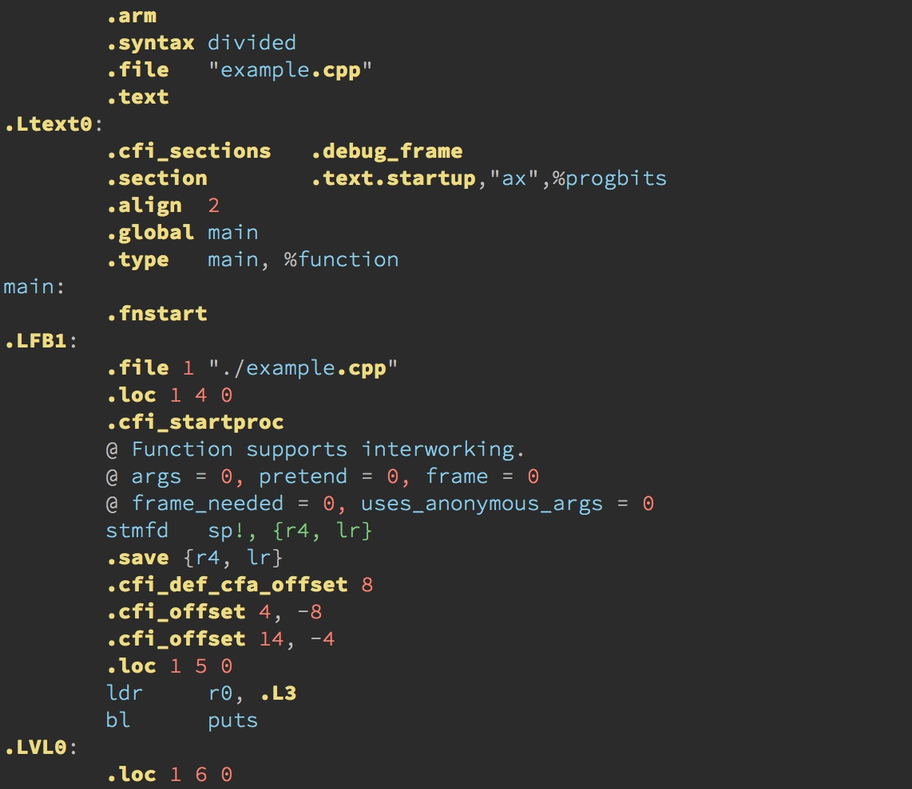
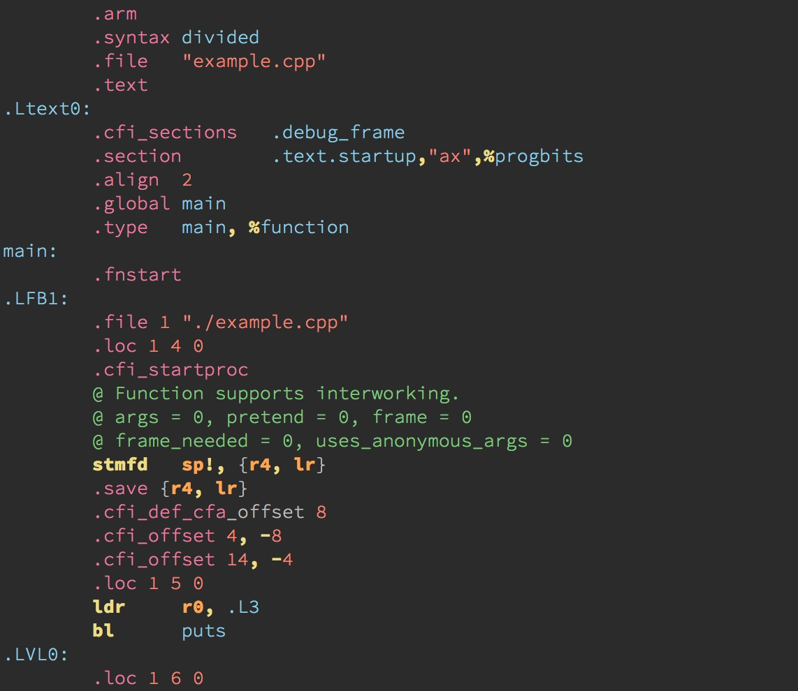

# 拓展4 | 插件样例分析：自己动手改进插件
你好，我是吴咏炜。

上一讲，我们对 Vim 脚本作了初步的介绍。Vim 脚本可以应用在很多不同的场景下，比如我们的 vimrc 配置文件和配色方案也都是 Vim 脚本。但我们今天更关心的，是我们经常使用的、一般称为“插件”的特殊 Vim 脚本。虽说插件和其他 Vim 脚本之间的界限也并非泾渭分明，但我们一般把满足以下条件的 Vim 脚本称为插件：

- 功能独立，不依赖特殊的个性化配置
- 存在加载时即会执行的代码，一般放在 plugin 目录下（也有放在 ftplugin、ftdetect 等其他目录下的情况）

今天，我们就利用目前学到的知识，来由浅入深地分析四个样例，了解插件代码是如何编写的，从而可以自己动手定制、改进，进而编写自己的插件，真真正正地定制自己的 Vim 环境，并为整个 Vim 社区作出贡献。

## ycmconf

我们要看的第一个脚本，是在讲 YCM 时引入的 ycmconf。这是一个非常简单的插件，我们就拿它开始我们今天的课程。

如果你之前按我说的步骤安装的话，现在应该可以在 Vim 配置目录下的 pack/minpac/start/ycmconf 里找到它。你也可以自己用 Git 签出：

```bash
git clone https://github.com/adah1972/ycmconf.git

```

除去一些文本说明文件，这个插件里只有两个真正的脚本文件：

- plugin/ycmconf.vim
- ycm\_extra\_conf.py

plugin 目录是 Vim 里主要放置无条件执行的脚本的地方，即“插件”的主体。打开 plugin/ycmconf.vim，我们看到里面只有一行注释加一行代码：

```vim
" Set the global extra configuration
let g:ycm_global_ycm_extra_conf=expand('<sfile>:p:h:h') . '/ycm_extra_conf.py'

```

这个差不多是个最简单的插件了吧。Vim 脚本里只做了一件事，设置全局变量 `g:ycm_global_ycm_extra_conf` 给 YCM 用。关于脚本中的 `expand` 函数，我们稍微展开一下：

- `expand` 是用来展开文件名的。参数字符串里如果有 `%`，就代表当前编辑的文件名；如果有 `<sfile>`，代表当前执行的源代码文件（其他可展开的名字请参见 [`:help expand()`](https://yianwillis.github.io/vimcdoc/doc/eval.html#expand())）。
- `:p` 用来告诉 `expand`，我们需要得到完整的路径。比如，在我的机器上，这样展开的结果是 `/Users/yongwei/.vim/pack/minpac/start/ycmconf/plugin/ycmconf.vim`。
- `:h` 用来告诉 `expand`，我们需要头部，即去掉路径的最后部分。我会得到 `/Users/yongwei/.vim/pack/minpac/start/ycmconf/plugin`。
- 第二次使用 `:h`，我们再次去掉路径的最后部分，即 `plugin`。我会得到 `/Users/yongwei/.vim/pack/minpac/start/ycmconf`。

随后，我们拿这个路径跟 `'/ycm_extra_conf.py'` 进行拼接，就得到了 YCM 可以看到的 ycm\_extra\_conf.py 文件的路径。

这个插件的主体功能在 ycm\_extra\_conf.py 里。鉴于这是 Python 的代码，而不是 Vim 脚本，我就不再讲解了。你如果有兴趣的话，可以自己看一下。文件虽然总共要好几百行，但注释比较多，逻辑其实不复杂；如果你懂 Python，一定可以理解里面的内容。

## cscope\_maps.vim

你一定觉得，上面这个脚本实在也太太太简单了吧……

下面我们就来看一个稍复杂点的。 [拓展 2](https://time.geekbang.org/column/article/277058) 里我给出了一个自己改过的 cscope\_maps.vim，我们现在就来看看它的原始版本，然后看一下怎么修改它的行为。

原始版本在 [Cscope 的网站](http://cscope.sourceforge.net/cscope_maps.vim) 上。可以看到，这也是一个比较简单的 Vim 脚本，应当直接放到 plugin 目录下。虽然文件总共有一百多行，倒有一大半是注释；实际代码行只有三十几行。我们可以细细地分析一下：

最外围，是一个条件语句，确保这个插件的内容仅在 Vim 支持 Cscope 时得到执行：

```vim
if has("cscope")
    …
endif

```

在条件语句里，有三行是设置 Vim 选项的：

```vim
set cscopetag
set csto=0
set cscopeverbose

```

我们在 Vim 帮助里可以查到它们的详细说明。简单来说：

- 设置 `cscopetag` 使得我们在使用原先 tags 相关的命令时会同时查找 Cscope 数据库
- 设置 `csto` 为 0 是让 Vim 先查找 Cscope 数据库，找不到才查找 tags
- 设置 `cscopeverbose` 是让 Vim 在之后添加 Cscope 数据库时，告诉你结果成功与否

设置最后这个选项是在下面的语句之后：

```vim
if filereadable("cscope.out")
    cs add cscope.out
elseif $CSCOPE_DB != ""
    cs add $CSCOPE_DB
endif

```

也就是说，Vim 会在启动时悄无声息地试图加载当前目录下的 cscope.out 数据库或环境变量 `CSCOPE_DB` 指定的数据库，并且不会报告结果。

剩下的代码就全部是……键映射了。我们就看其中的一个，其余的都大同小异：

```vim
nmap <C-\>s :cs find s <C-R>=expand("<cword>")<CR><CR>

```

这个键映射把 `<C-\>s` 映射成了一个 `:cs find s …` 命令。值得注意的是命令的后半截：

- 脚本里使用 `<C-R>=…<CR>` 来执行一个 Vim 表达式，并把结果填到命令里。
- 我们又一次见到了 `expand` 函数。这一次，要展开的是 `<cword>`，即当前光标下的单词。
- 注意结尾两个 `<CR>` 里第一个是给 `<C-R>=` 的，第二个才是执行命令的回车键。

让我有意见的是下面这样的键映射：

```vim
nmap <C-@>s :scs find s <C-R>=expand("<cword>")<CR><CR>

```

这儿用 `<C-@>` 代表 Ctrl-空格，而这个组合键在很多系统上不可用。既然已经使用了 Ctrl-\ 作为 Cscope 的专用起始键，我觉得继续用 Shift-\ 就好。由于 `|` 在 Vim 里用来分隔多个语句，这儿我们要换个写法，改成：

```vim
nmap <bar>s :scs find s <C-R>=expand("<cword>")<CR><CR>

```

我的完整修改过程，可以查看：

[https://github.com/adah1972/cscope\_maps.vim/commits/master](https://github.com/adah1972/cscope_maps.vim/commits/master)

总的来说，这也是个非常小、非常轻松的修改。

## EchoFunc

事实上，大部分行为良好的插件会允许用户通过一些全局变量来定制键映射之类的设定。不过，对于没有提供这种定制性的插件，我们自己找到代码里的键映射语句，手工修改一下，也是一种可能发生的常见情况。比如， [EchoFunc](https://github.com/mbbill/echofunc) 里查看下一个和上一个函数的按键分别可以用全局变量 `g:EchoFuncKeyNext` 和 `g:EchoFuncKeyPrev` 来修改。一般来说，插件的文档里会进行说明，你也可以在插件里通过搜索 `exists` 函数来找到插件提供出来的定制点。

以 EchoFunc 为例，它虽然简单到没有提供帮助文档，但插件的主文件（after/plugin/echofunc.vim）开头有大段的注释。同时，它有大量的 `exists` 的函数调用，来检查用户是否已经定义了某一全局变量来定制行为：

```vim
if !exists("g:EchoFuncMaxBalloonDeclarations")
    let g:EchoFuncMaxBalloonDeclarations=20
endif

if !exists("g:EchoFuncKeyNext")
    if has ("mac")
        let g:EchoFuncKeyNext='≠'
    else
        let g:EchoFuncKeyNext='<M-=>'
    endif
endif

if !exists("g:EchoFuncKeyPrev")
    if has ("mac")
        let g:EchoFuncKeyPrev='±'
    else
        let g:EchoFuncKeyPrev='<M-->'
    endif
endif

```

在我这儿给出的三个全局变量的相关定义里，第一个是对起泡提示的数量限制，第二个是下一个函数的键定义，第三个是上一个函数的键定义。在后两个键定义里，还分平台（Mac 或非 Mac）进行了不同的设置。这些都是非常直接了当的。

如果我们在 `EchoFuncKeyNext` 上面按下 `*` 来搜索这个变量的使用，我们就会发现它们是在函数 `EchoFuncStart` 里被真正使用的：

```vim
if maparg(g:EchoFuncKeyNext, "i") == '' && maparg(g:EchoFuncKeyPrev, "i") == ''
    exec 'inoremap <silent> <buffer> ' . g:EchoFuncKeyNext . ' <c-r>=EchoFuncN()<cr>'
    exec 'inoremap <silent> <buffer> ' . g:EchoFuncKeyPrev . ' <c-r>=EchoFuncP()<cr>'
endif

```

这儿的代码说的是：

- 如果 `g:EchoFuncKeyNext` 和 `g:EchoFuncKeyPrev` 描述的键映射（ [`:help maparg()`](https://yianwillis.github.io/vimcdoc/doc/eval.html#maparg())）在插入模式（ `"i"`）没有被占用（ `== ''`）的话，那我们就执行（ `exec`）针对当前缓冲区（ `<buffer>`）的插入模式键映射（ `inoremap`），让其安静地（ `<silent>`）执行（ `<c-r>=`）函数中的语句。

注意，在键映射中使用 `<C-R>=` 来执行语句是一种常用技巧。这种情况下，我们常常不是要获得函数返回的结果（所以这些函数通常返回 `''`），而只是需要执行一些指定的代码，产生需要的“副作用”。在这儿，我们需要的副作用就是选择函数列表里的下一项和上一项了。

EchoFunc 算是一个中等规模的 Vim 插件，也有好几百行代码了，我们没有必要全部讲一遍。它的初始化过程比较有特点，我们看一下：

```vim
augroup EchoFunc
    autocmd BufRead,BufNewFile * call s:EchoFuncInitialize()
augroup END

```

也就是说，在读入文件后，或创建新文件后，才调用 `s:EchoFuncInitialize()` 进行初始化。

那 `s:EchoFuncInitialize()` 究竟做了些什么呢？看下面：

```vim
function! s:EchoFuncInitialize()
    augroup EchoFunc
        autocmd!
        autocmd InsertLeave * call EchoFuncRestoreSettings()
        autocmd BufRead,BufNewFile * call CheckedEchoFuncStart()
        if has('gui_running')
            menu    &Tools.Echo\ F&unction.Echo\ F&unction\ Start   :call EchoFuncStart()<CR>
            menu    &Tools.Echo\ F&unction.Echo\ Function\ Sto&p    :call EchoFuncStop()<CR>
        endif

        if has("balloon_eval")
            autocmd BufRead,BufNewFile * call CheckedBalloonDeclarationStart()
            if has('gui_running')
                menu    &Tools.Echo\ Function.&Balloon\ Declaration\ Start  :call BalloonDeclarationStart()<CR>
                menu    &Tools.Echo\ Function.Balloon\ Declaration\ &Stop   :call BalloonDeclarationStop()<CR>
            endif
        endif
    augroup END

    call CheckedEchoFuncStart()
    if has("balloon_eval")
        call CheckedBalloonDeclarationStart()
    endif
endfunction

```

我下面概要解说一下：

- 在 EchoFunc 自动命令组里，执行 `autocmd!`，清空已有的自动命令，即刚才的 `call s:EchoFuncInitialize()` 语句。
- 在 `InsertLeave`，离开插入模式事件里，调用 `EchoFuncRestoreSettings` 函数，停止函数回显。
- 在读入文件或创建新文件时，检查是否需要启用函数回显。
- 在图形界面下创建启停函数回显的菜单项。
- 如果 Vim 支持气泡显示，在读入文件或创建新文件时，检查是否需要启用气泡函数声明提示，并在图形界面下创建启停气泡函数声明提示的菜单项。
- 对当前文件，检查是否需要启用函数回显和起泡函数声明提示。

最后，如果你好奇为什么 EchoFunc 选择使用 after/plugin 目录而不是 plugin 目录，在它的 Git 日志里是有说明的：

> 1) fix key “(” “)” mapping conflict with other plugins:
>
> ​ first, move plugin folder into after/ folder, so that echofunc will be load after most plugins have been loaded
>
> ​ Second, if during initialization time, if it find “(” or “)” key have been mapped, it will try to append <Plug>EchofuncXX function to it.

因为它用到 `(` 和 `)` 作为键映射，容易和其他插件冲突，因此它会最后加载，并尽量把自己键映射补充进去。

对于插件功能本身的特殊逻辑，我就不解释啦。

## arm-syntax-vim

今天最后一个插件样例，是我最近的一个实际需求。由于我写的代码需要最终跑在 ARM 平台上，我偶尔需要检查一下产生的 ARM 汇编代码。在 Vim 的默认配置下，产生的汇编代码效果不太理想，如下图所示：



这里最糟糕的地方是， `stmfd` 那行里的 `{r4, lr}` 居然显示成了注释？是可忍，孰不可忍！

还好，我用不着从头开始自己搞。网上略加搜索，我就找到了 [ARM9/arm-syntax-vim](ARM9/arm-syntax-vim) 这个 Vim 脚本，可以获得好得多的效果，如下所示：



不过，这个脚本还是缺了点东西，它只包含了语法文件，不能把 GCC 产生的 .s 文件识别为它支持的 arm、armv4 和 armv5 格式。我要做的就是添加文件类型识别，让 Vim 把 ARM 的汇编文件识别成合适的 ARM 格式。

在 [第 8 讲](https://time.geekbang.org/column/article/271208) 讨论文件类型判断时，我已经说过，在 Vim 里后缀不是判断文件类型的唯一依据。既然我懒到不愿意在汇编文件里加帮助识别的文本，我当然也懒得去改汇编文件的后缀了。GCC 产生的汇编代码里的一些特定标识，也使得我利用文本判断变得相当容易：取决于不同的环境，汇编中一般会出现 `.arch arm` 和 `.cpu arm` 这样的明确行。

要让 Vim 进行文件类型判断，标准做法是在 ftdetect 目录下加入判断脚本。既然我们知道后缀是 .s，在这个文件中我会写入：

```vim
au BufRead *.[sS]  call arm#ft#FTarm()

```

为了加快 Vim 的启动速度，真正检测需要的代码一般推荐放到 autoload 目录下。这是 Vim 的专门机制，允许脚本“按需”加载，仅在用到函数的时候，才载入函数的定义（ [`:help autoload`](https://yianwillis.github.io/vimcdoc/doc/eval.html#autoload)）。在上面的写法下面，当 Vim 读入后缀为 .s 或 .S 的文件时，Vim 会自动在 autoload/arm 目录下载入 ft.vim，然后调用其中的 `FTarm` 函数。

下面我们来看一下 ft.vim 文件。这个文件不大，完整内容展示如下：

```vim
let s:cpo_save = &cpo
set cpo&vim

function! arm#ft#FTarm()
  let head = ' '.getline(1).' '.getline(2).' '.getline(3).' '.getline(4).
	\' '.getline(5).' '
  " Can't use setf, as we need to overrule the default filetype setting
  if matchstr(head, '\s\.arch\s\+armv4') != ''
    set filetype=armv4
  elseif matchstr(head, '\s\.arch\s\+armv5') != ''
    set filetype=armv5
  elseif matchstr(head, '\s\.arch\s\+arm') != ''
    set filetype=arm
  elseif matchstr(head, '\s\.cpu\s\+arm') != ''
    set filetype=arm
  endif
endfunction

let &cpo = s:cpo_save
unlet s:cpo_save

```

开头和结尾的四行属于 Vim 脚本的标准模板写法：进入脚本时保存兼容性选项（ [`:help 'cpoptions'`](https://yianwillis.github.io/vimcdoc/doc/options.html#'cpoptions')）的当前值，然后恢复其为默认值，免得其他地方的设置影响对脚本的解释；退出时则恢复原来保存的兼容性选项值。

中间主体部分就一个函数，做的事情也很简单，就是把文件的头五行内容拼到一起，然后看能不能找到满足条件的“.arch”和“.cpu”语句。找到的话，就设置合适的文件类型；找不到，就不做处理，留给其他的 Vim 脚本来继续判断。

这儿唯一比较特别点的地方是，一般设置文件类型推荐使用 `:setfiletype` 命令，它会避免重复设置，在一次 Vim 的自动事件触发过程中只执行一次。对于我们当前的目的，这是不够的：因为在我们的代码执行之前，当前缓冲区一般已经被系统的自动命令设置过类型了。具体来说，是运行支持文件里的 autoload/dist/ft.vim 里的 `dist#ft#FTasm` 函数。

所以，我们这儿需要强行覆盖已经设置的文件类型，用 `set filetype=…` 就可以做到。要注意，仅在你很有信心你设置的类型正确时才可以这么做，否则，你可能会干扰其他插件的结果。

这样，我就做到了在用 Vim 打开 GCC 产生的 ARM 汇编文件时，能自动检测并应用合适的 arm 语法。完整的代码可从 [adah1972/arm-syntax-vim](adah1972/arm-syntax-vim) 下载。

## 内容小结

今天我们分析了四个大小不同的 Vim 脚本，并展示了常见的 Vim 脚本用法。我们可以总结一下相关的知识点：

- Vim 里主要放置无条件执行脚本的目录是 plugin。
- `exists` 、 `expand` 和 `has` 恐怕是 Vim 里最重要的函数，常用法需要牢牢掌握。
- 好的 Vim 脚本一般会通过全局变量允许用户定制部分行为，如键映射；Vim 脚本里面通过 `exists` 函数来检测用户定义的全局变量。
- 一般来说，插件会使用自己的名字开始自己的自动命令组，这样比较便于管理，包括统一清除。
- `after` 目录下的内容会晚于其他目录加载。
- `ftdetect` 目录下一般放置用来检测文件类型的脚本。
- `autoload` 目录专门放置延迟加载的脚本。

## 课后练习

请选择一个你常用的插件（如 nerdtree 和 undotree），分析它的主体结构，看一下它使用了哪些不同的目录，分成几个主要的模块，提供了哪些命令，又给用户留出了哪些定制点。

如果有任何的问题和想法，请留言和我交流。我们下一讲再见。