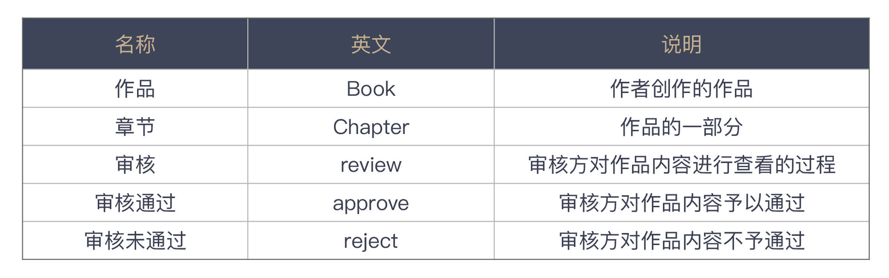

# 02 | 乱用英语：站在中国人的视角来看英文命名
你好，我是郑晔。

上一讲，我们讲了两种常见的命名的坏味道，这一讲的话题还是命名，只不过，这个主题是国外那些经典编程书籍所不曾涵盖的话题：英语命名。

现在主流的程序设计语言都是以英语为基础的，且不说欧美人设计的各种语言，就连日本人设计的 Ruby、巴西人设计的 Lua，各种语法采用的也全都是英语。所以，想要成为一个优秀的程序员，会用英语写代码是必要的。

这里并不是说，程序员的英语一定要多好，但 **最低限度的要求是写出来的代码要像是在用英语表达**。

或许你听说过，甚至接触过国内的一些程序员用汉语拼音写代码，这就是一种典型的坏味道。鉴于现在的一些程序设计语言已经支持了 UTF-8 的编码格式，用汉语拼音写代码，还不如用汉字直接写代码。

当然，这个坏味道实在是太低级了，我就不在这里深入讨论了。让我们来看看还有哪些可能会不经意间忽略的坏味道。

## 违反语法规则的命名

我们来看一段代码：

```
public void completedTranslate(final List<ChapterId> chapterIds) {
  List<Chapter> chapters = repository.findByChapterIdIn(chapterIds);
  chapters.forEach(Chapter::completedTranslate);
  repository.saveAll(chapters);
}

```

初看之下，这段代码写得还不错，它要做的是将一些章节的信息标记为翻译完成。似乎函数名也能反映这个意思，但仔细一看你就会发现问题。

因为 completedTranslate 并不是一个正常的英语函数名。从这个名字你能看出，作者想表达的是“完成翻译”，因为是已经翻译完了，所以，他用了完成时的 completed，而翻译是 translate。这个函数名就成了 completedTranslate。由此，你可以看到，作者已经很用心了，但遗憾的是，这个名字还是起错了。

一般来说，常见的命名规则是： **类名是一个名词，表示一个对象，而方法名则是一个动词，或者是动宾短语，表示一个动作**。

以此为标准衡量这个名字，completedTranslate 并不是一个有效的动宾结构。如果把这个名字改成动宾结构，只要把“完成”译为 complete，“翻译”用成它的名词形式 translation 就可以了。所以，这个函数名可以改成 completeTranslation：

```
public void completeTranslation(final List<ChapterId> chapterIds) {
  List<Chapter> chapters = repository.findByChapterIdIn(chapterIds);
  chapters.forEach(Chapter::completeTranslation);
  repository.saveAll(chapters);
}

```

这并不是一个复杂的坏味道，但这种坏味道在代码中却时常可以见到，比如，一个函数名是 retranslation，其表达的意图是重新翻译， **但作为函数名，它应该是一个动词**，所以，正确的命名应该是 retranslate。

其实，只要你懂得最基本的命名要求，知道最基本的英语规则，就完全能够发现这里的坏味道。比如，判断函数名里的动词是不是动词，宾语是不是一个名词？这并不需要英语有多么好。自己实在拿不准的时候，你就把这个词放到 [字典网站](http://dict.youdao.com/) 中查一下，确保别用错词性就好。

对于大多数国内程序员来说， [字典网站](http://dict.youdao.com/) 是我们的好朋友，是我们在写程序过程中不可或缺的一个好伙伴。不过，有些人使用 [字典网站](http://dict.youdao.com/) 也会很随意。

## 不准确的英语词汇

有一次，我们要实现一个章节审核的功能，一个同事先定义出了审核的状态：

```
public enum ChapterAuditStatus {
    PENDING,
    APPROVED,
    REJECTED;
}

```

你觉得这段代码有问题吗？如果看不出来，一点都不奇怪。如果你用审核作为关键字去 [字典网站](http://dict.youdao.com/) 上搜索，确实会得到 audit 这个词。所以，审核状态写成 AuditStatus 简直是再正常不过的事情了。

然而，看到这个词的时候，我的第一反应就是这个词好像不太对。因为之前我实现了一个作品审核的功能，不过我写的定义是这样的：

```
public enum BookReviewStatus {
    PENDING,
    APPROVED,
    REJECTED;
}

```

抛开前缀不看，同样是审核，一个用了 audit，一个用了 review。这显然是一种不一致。本着代码一致性的考虑，我希望这两个定义应该采用同样的词汇。

于是，我把 audit 和 review 同时放到了搜索引擎里查了一下。原来，audit 会有更官方的味道，更合适的翻译应该是审计，而 review 则有更多核查的意思，二者相比，review 更适合这里的场景。于是，章节的审核状态也统一使用了 review：

```
public enum ChapterReviewStatus {
    PENDING,
    APPROVED,
    REJECTED;
}

```

相比之下，这个坏味道是一个高级的坏味道，英语单词用得不准确。但这个问题确实是国内程序员不得不面对的一个尴尬的问题，我们的英语可能没有那么好，体会不到不同单词之间的差异。

很多人习惯的做法就是把中文的词扔到 [字典网站](http://dict.youdao.com/)，然后从诸多返回的结果中找一个自己看着顺眼的，而这也往往是很多问题出现的根源。这样写出来的程序看起来就像一个外国人在说中文，虽然你知道他在说的意思，但总觉得哪里怪怪的。

**在这种情况下，** **最好的解决方案还是建立起一个业务词汇表，千万不要臆想。** 一般情况下，我们都可以去和业务方谈，共同确定一个词汇表，包含业务术语的中英文表达。这样在写代码的时候，你就可以参考这个词汇表给变量和函数命名。

下面是一个词汇表的示例，从这个词汇表中你不难看出：一方面，词汇表给出的都是业务术语，同时也给出了在特定业务场景下的含义；另一方面，它也给出了相应的英文，省得你费劲心思去思考。当你遇到了一个词汇表中没有的术语怎么办呢？那就需要找出这个术语相应的解释，然后，补充到术语表里。



建立词汇表的另一个关键点就是， **用集体智慧，而非个体智慧**。你一个人的英语可能没那么好，但一群人总会找出一个合适的说法。我在《 [软件设计之美](https://time.geekbang.org/column/intro/100052601)》里讲到领域驱动设计时，曾经讲过通用语言，其实，业务词汇表也应该是构建通用语言的一部分成果。

## 英语单词的拼写错误

我再给你看一段曾经让我迷惑不已的代码：

```
public class QuerySort {
    private final SortBy sortBy;
    private final SortFiled sortFiled;
    ...
}

```

初看这段代码时，我还想表扬代码的作者，他知道把查询的排序做一个封装，比起那些把字符串传来传去的做法要好很多。

但仔细看一下代码，我脑子里就冒出了一系列问号。sortFiled 是啥？排序文件吗？为啥用的还是过去式？归档？

被这段代码搞晕的我只好打开提交历史，找出这段代码的作者，向他求教。

> 我：这个字段是啥意思？
>
> 同事：这是排序的字段啊。
>
> 我：排序的字段？
>
> 同事：你看，这个查询排序类有两个字段，一个是排序的方式，升序还是降序，另一个就是排序的字段。
>
> 我：字段这个单词是这么拼吗？
>
> 同事：不是吗？哦！是 field，拼错了，拼错了。

你看，是他把单词拼错了。

其实，偶尔的拼写错误是不可避免的，这就像我们写文章的时候，出现错别字也是难免的。之所以要在这个专栏中把拼写错误作为一种独立的坏味道，是因为在很多国内程序员写的程序中，见到的拼写错误比例是偏高的。

在这个故事里面，我都已经当面指出了问题，这个同事甚至都没有第一时间意识到自己的拼写是错误的，这其实说明了一种尴尬的现状： **很多程序员对英语的感觉并没有那么强。**

事实上，这个同事不止一次在代码里出现拼写错误了，一些拼写错误是很直白的，一眼就能看出来，所以，通常在代码评审的时候就能发现问题。这次的拼写错误刚好形成了另外一个有含义的单词，所以，我也被困住了。

对今天的程序员来说，工具已经很进步了， **像 IntelliJ IDEA 这样的 IDE 甚至可以给你提示代码里有拼写错误（typo）**，不少支持插件的工具也都有自己的拼写检查插件，比如 [Visual Studio Code](https://marketplace.visualstudio.com/items?itemName=streetsidesoftware.code-spell-checker) 就有自己的拼写检查插件。在这些工具的帮助之下，我们只要稍微注意一下，就可以修正很多这样低级的错误。

这一讲的内容几乎是完全针对国内程序员的。对于国外程序员来说，他们几乎不会犯这些错误。英语是程序员无论如何也绕不过去的一关，越是想成为优秀程序员，越要对英语有良好的感觉。当然，这里并不强求所有人的英语都能达到多好的程度，至少看到一些明显违反英语规则的代码，自己应该有能力看出来。

英语和程序设计语言其实是一样的，想用好，唯有多多练习。我自己的英语水平也算不上多好，但我读过很多技术文档，也看了很多开源的代码。之前因为参加开源项目和在外企工作的经历，也写过很多的英语邮件和文档，逐渐对程序中的英语有了感觉。

有些人注意到，我的开源项目 Moco 的文档是用英语写的，这其实是我强迫自己练习的结果。如果说英语是一门全功能的程序设计语言，那么程序中用到的英语就是一门 DSL（领域特定语言）。相比起完全掌握好英语，掌握程序中用到的英语就要简单一些了。

## 总结时刻

今天我们讲了几个英语使用不当造成的坏味道：

- 违反语法规则的命名；
- 不准确的英语词汇；
- 英语单词的拼写错误。

这是国内程序员因为语言关系而造成的坏味道，英语是目前软件开发行业的通用语言，一个程序员要想写好程序，要对程序中用到的英语有一个基本的感觉，能够发现代码中的这些坏味道。

其实，还有一些常见的与语言相关的坏味道，因为比较初级，我只放在这里给你提个醒，比如：

- 使用拼音进行命名；
- 使用不恰当的单词简写（比如，多个单词的首字母，或者写单词其中的一部分）。

我们还讨论了如何从实践层面上更好地规避这些坏味道：

- 制定代码规范，比如，类名要用名词，函数名要用动词或动宾短语；
- 要建立团队的词汇表（是的，我们在上一讲也提到了）；
- 要经常进行代码评审。

命名之所以如此重要，因为它是一切代码的基础。就像写文章一样，一个错别字满天飞的文章，很难让人相信它会是一篇好的文章，所以，命名的重要性是如何强调都不为过的。

如果今天的内容你只能记住一件事，那请记住： **编写符合英语语法规则的代码。**


## 思考题

我们在这一讲里讲到了程序员和英语之间的关系，我想请你分享一下，你在工作中与英语的关系，无论是遇到的问题，或是自我提升的经验，都行。欢迎在留言区分享你的经验，也欢迎你把这节课的内容分享给团队的小伙伴，大家一起精进“英语命名”。

感谢阅读，我们下一讲再见！

参考资料 :

[领域驱动设计：如何从零开始设计一个软件？](https://time.geekbang.org/column/article/266819)

[动词：英语宇宙的中心](https://time.geekbang.org/column/article/248732)