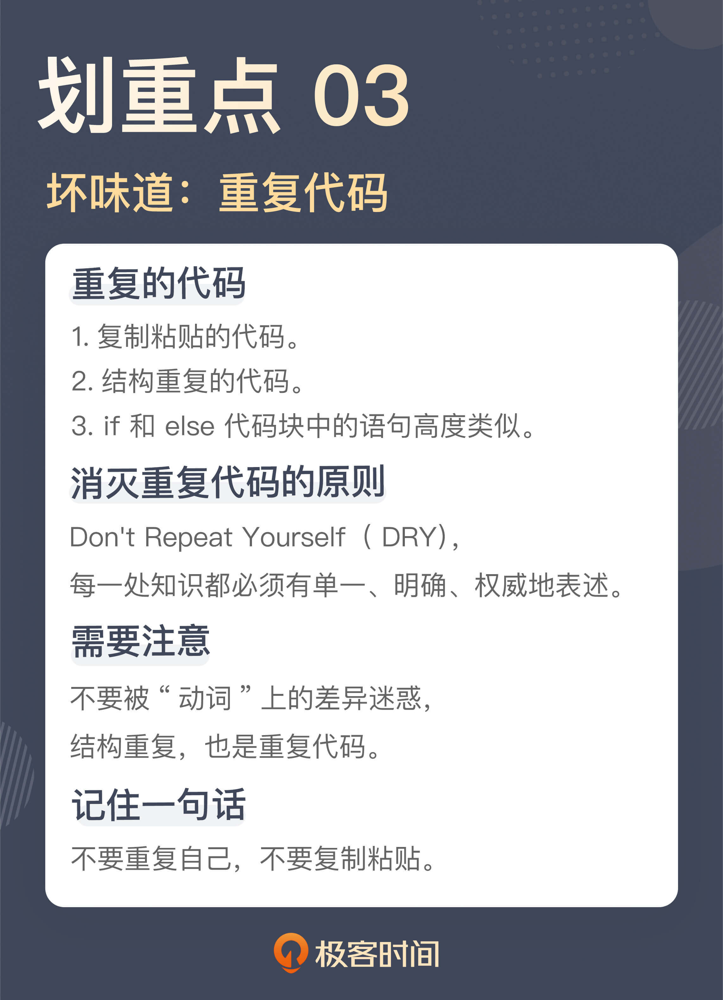

# 03 | 重复代码：简单需求到处修改，怎么办？
你好，我是郑晔。

前面两讲，我们讨论了命名中的坏味道。今天，我们来讨论另外一个常见的坏味道：重复代码。

记得我刚开始工作的时候，有人开玩笑说，编程实际上就是 CVS（CVS是当时流行的一个版本控制工具，相当于今天的 Git），也就是 Ctrl+C、Ctrl+V、Ctrl+S，或许你已经听出来了，这是在调侃很多程序员写程序依靠的是复制粘贴。

时至今日，很多初级程序员写代码依然规避不了复制粘贴，基本的做法就是把一段代码复制过来，改动几个地方，然后，跑一下没有太大问题就万事大吉了。殊不知，这种做法就是在给未来挖坑。

通常情况下，只要这些复制代码其中有一点逻辑要修改，就意味着所有复制粘贴的地方都要修改。所以，我们在实际的项目中，常常看见这样的情况：明明是一个简单的需求，你却需要改很多的地方，需要花费很长的时间，结果无论是项目经理，还是产品经理，对进度都很不满意。

更可怕的是，只要你少改了一处，就意味着留下一处潜在的问题。问题会在不经意间爆发出来，让人陷入难堪的境地。

复制粘贴是最容易产生重复代码的地方，所以，一个最直白的建议就是，不要使用复制粘贴。 **真正应该做的是，先提取出函数，然后，在需要的地方调用这个函数。**

其实，复制粘贴的重复代码是相对容易发现的，但有一些代码是有类似的结构，这也是重复代码，有些人对这类坏味道却视而不见。

## 重复的结构

我们看一下下面的几段代码：

```
@Task
public void sendBook() {
  try {
    this.service.sendBook();
  } catch (Throwable t) {
    this.notification.send(new SendFailure(t)));
    throw t;
  }
}

```

```
@Task
public void sendChapter() {
  try {
    this.service.sendChapter();
  } catch (Throwable t) {
    this.notification.send(new SendFailure(t)));
    throw t;
  }
}

```

```
@Task
public void startTranslation() {
  try {
    this.service.startTranslation();
  } catch (Throwable t) {
    this.notification.send(new SendFailure(t)));
    throw t;
  }
}

```

这三段函数业务的背景是：一个系统要把作品的相关信息发送给翻译引擎。所以，结合着代码，我们就不难理解它们的含义，sendBook 是把作品信息发出去，sendChapter 就是把章节发送出去，而 startTranslation 则是启动翻译。

这几个业务都是以后台的方式在执行，所以，它们的函数签名上增加了一个 Task 的 Annotation，表明它们是任务调度的入口。然后，实际的代码执行放到了对应的业务方法上，也就是 service 里面的方法。

这三个函数可能在许多人看来已经写得很简洁了，但是，这段代码的结构上却是有重复的，请把注意力放到 catch 语句里。

之所以要做一次捕获（catch），是为了防止系统出问题无人发觉。捕获到异常后，我们把出错的信息通过即时通讯工具发给相关人等，代码里的 notification.send 就是发通知的入口。相比于原来的业务逻辑，这个逻辑是后来加上的，所以，这段代码的作者不厌其烦地在每一处修改了代码。

我们可以看到，虽然这三个函数调用的业务代码不同，但它们的结构是一致的，其基本流程可以理解为：

- 调用业务函数；
- 如果出错，发通知。

当你能够发现结构上的重复，我们就可以把这个结构提取出来。从面向对象的设计来说，就是提出一个接口，就像下面这样：

```
private void executeTask(final Runnable runnable) {
  try {
    runnable.run();
  } catch (Throwable t) {
    this.notification.send(new SendFailure(t)));
    throw t;
  }
}

```

有了这个结构，前面几个函数就可以用它来改写了。对于支持函数式编程的程序设计语言来说，可以用语言提供的便利写法简化代码的编写，像下面的代码就是用了 Java 里的方法引用（Method Reference）：

```
@Task
public void sendBook() {
  executeTask(this.service::sendBook);
}

```

```
@Task
public void sendChapter() {
  executeTask(this.service::sendChapter);
}

```

```
@Task
public void startTranslation() {
  executeTask(this.service::startTranslation);
}

```

经过这个例子的改写，如果再有一些通用的结构调整，比如，在任务执行前后要加上一些日志信息，这样的改动就可以放到 executeTask 这个函数里，而不用四处去改写了。

这个例子并不复杂，关键点在于，能不能发现结构上的重复。因为相比于直接复制的代码，结构上的重复看上去会有一些迷惑性。比如，在这个例子里，发送作品信息、发送章节、启动翻译看起来是三件不同的事，很难让人一下反应过来它也是重复代码。

一般来说，参数是名词，而函数调用，是动词。我们传统的程序设计教育中，对于名词是极度重视的，但我们必须认识到一点，动词也扮演着重要的角色，尤其是在函数式编程兴起之后。那你就需要知道，动词不同时，并不代表没有重复代码产生。

理解到这一点，我们就容易发现结构上的相似之处。比如在上面的例子中，发送作品信息、发送章节、启动翻译之所以看上去是三件不同的事，只是因为它们的动词不同，但是除了这几个动词之外的其它部分是相同的，所以，它们在结构上是重复的。

## 做真正的选择

我们再来看一段代码：

```
if (user.isEditor()) {
  service.editChapter(chapterId, title, content, true);
} else {
  service.editChapter(chapterId, title, content, false);
}

```

这是一段对章节内容进行编辑的代码。这里有一个业务逻辑，章节只有在审核通过之后，才能去做后续的处理，比如，章节的翻译。所以，这里的 editChapter 方法最后那个参数表示是否审核通过。

在这段代码里面，目前的处理逻辑是，如果这个章节是由作者来编辑的，那么这个章节是需要审核的，如果这个章节是由编辑来编辑的，那么审核就直接通过了，因为编辑本身同时也是审核人。不过，这里的业务逻辑不是重点，只是帮助你理解这段代码。

问题来了，这个 if 选择的到底是什么呢？

相信你和我一样，第一眼看到这段代码的感觉一定是，if 选择的一定是两段不同的业务处理。但只要你稍微看一下，就会发现，if 和 else 两段代码几乎是一模一样的。在经过仔细地“找茬”之后，才能发现，原来是最后一个参数不一样。

只有参数不同，是不是和前面说的重复代码是如出一辙的？没错，这其实也是一种重复代码。

只不过，这种重复代码通常情况下是作者自己写出来的，而不是粘贴出来的。因为作者在写这段代码时， **脑子只想到 if 语句判断之后要做什么，而没有想到这个 if 语句判断的到底是什么。** 但这段代码客观上也造就了重复。

写代码要有表达性。把意图准确地表达出来，是写代码过程中非常重要的一环。显然，这里的 if 判断区分的是参数，而非动作。所以，我们可以把这段代码稍微调整一下，会让代码看上去更容易理解：

```
boolean approved = user.isEditor();
service.editChapter(chapterId, title, content, approved);

```

请注意，这里我把 user.isEditor() 判断的结果赋值给了一个 approved 的变量，而不是直接作为一个参数传给 editChapter，这么做也是为了提高这段代码的可读性。因为 editChapter 最后一个参数表示的是这个章节是否审核通过。通过引入 approved 变量，我们可以清楚地看到，一个章节审核是否通过的判断条件是“用户是否是一个编辑”，这种写法会让代码更清晰。

如果将来审核通过的条件改变了，变化的点全都在 approved 的这个变量的赋值上面。如果你追求更有表达性的做法，甚至可以提取一个函数出来，这样，就把变化都放到这个函数里了，就像下面这样：

```
boolean approved = isApproved(user);
service.editChapter(chapterId, title, content, approved);

private boolean isApproved(final User user) {
  return user.isEditor();
}

```

为了说明问题，我特意选择了一段简单的代码，if 语句的代码块里只有一个语句。在实际的工作中，if 语句没有有效地去选择目标是经常出现的，有的是参数列表比较长，有的是在 if 的代码块里有多个语句。

所以， **只要你看到 if 语句出现，而且 if 和 else 的代码块长得又比较像，多半就是出现了这个坏味道。** 如果你不想所有人都来玩“找茬”游戏，赶紧消灭它。

重复是一个泥潭，对于程序员来说，时刻提醒自己不要重复是至关重要的。在软件开发里，有一个重要的原则叫做 Don't Repeat Yourself（不要重复自己，简称 DRY），我在《 [软件设计之美](https://time.geekbang.org/column/intro/100052601)》中也讲到过它，而更经典的叙述在《 [程序员修炼之道](https://book.douban.com/subject/35006892/)》中。

> 在一个系统中，每一处知识都必须有单一、明确、权威地表述。
>
> Every piece of knowledge must have a single, unambiguous, authoritative representation within a system.

**写代码要想做到 DRY，一个关键点是能够发现重复**。发现重复，一种是在泥潭中挣扎后，被动地发现，还有一种是提升自己识别能力，主动地发现重复。这种主动识别的能力，其实背后要有对软件设计更好的理解，尤其是对分离关注点的理解（如果你对“分离关注点”的知识感兴趣，可以参考我在《软件设计之美》中的 [02](https://time.geekbang.org/column/article/240749) 讲）。

## 总结时刻

这一讲我们讲到重复代码，讲到了几个典型的坏味道：

- 复制粘贴的代码；
- 结构重复的代码；
- if 和 else 代码块中的语句高度类似。

很多重复代码的产生通常都是从程序员偷懒开始的，而这些程序员的借口都是为了快，却为后续工作埋下更多地隐患，真正的“欲速而不达”。

复制粘贴的代码和结构重复的代码，虽然从观感上有所差异，但本质上都是重复，只不过，一个是名词的微调，一个是动词的微调。

程序员千万不要复制粘贴， **如果需要复制粘贴，首先应该做的是提取一个新的函数出来，把公共的部分先统一掉。**

if 和 else 的代码块中的语句高度类似，通常是程序员不经意造成的，但这也是对于写代码没有高标准要求的结果。让 if 语句做真正的选择，是提高代码表达准确性的重要一步。

作为一个精进中的程序员，我们一定要把 DRY 原则记在心中，时时刻刻保持对“重复”的敏感度，把各种重复降到最低。

如果今天的内容你只能记住一件事，那请记住： **不要重复自己，不要复制粘贴**。



## 思考题

这一讲的主题是重复代码，你在实际工作中都遇到过什么样的重复代码，你是怎样处理它们的呢？欢迎在留言区分享你的经验。

参考资料：

[分离关注点：软件设计至关重要的第一步](https://time.geekbang.org/column/article/240749)

[简单设计：难道一开始就要把设计做复杂吗？](https://time.geekbang.org/column/article/265128)