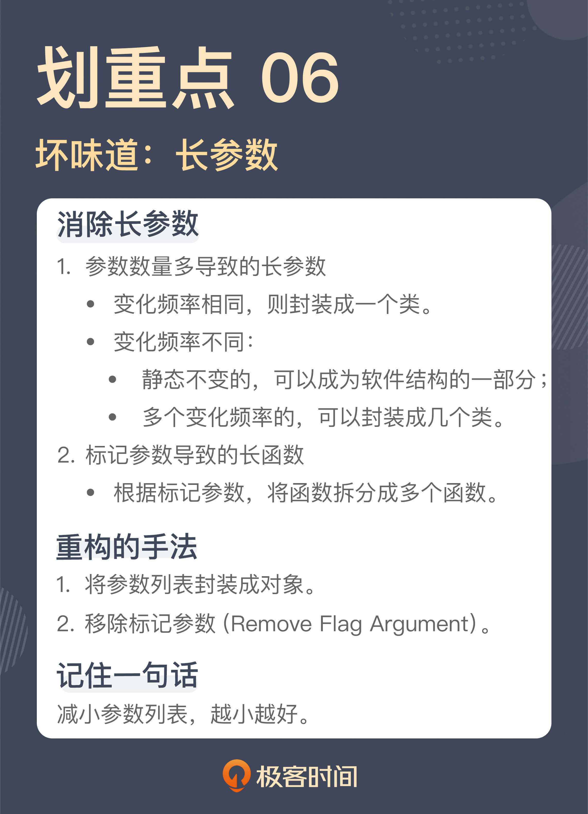

# 06 | 长参数列表：如何处理不同类型的长参数？
你好，我是郑晔。

前面两讲，我们分别讲了长函数和大类，它们都是那种“我一说，你就知道是怎么回事”的坏味道，而且都让我们深恶痛绝，唯恐避之不及。这样典型的坏味道还有一个，就是长参数列表。

好吧，我知道你的脑子里已经出现了一个长长的参数列表了。每个程序员只要想到，一个函数拥有几十甚至上百个参数，内心就难以平静下来。

那么，函数为什么要有参数呢？我们知道，不同函数之间需要共享信息，于是才有了参数传递。

其实，函数间共享信息的方式不止一种，除了参数列表，最常见的一种方式是全局变量。但全局变量会带给我们太多意想不到的问题，所以，在初学编程的时候，老师就会告诉我们，不要使用全局变量。从程序设计语言发展的过程中，我们也可以看到，取消全局变量已经成为了大势所趋。

但函数之间还是要传递信息的，既然不能用全局变量，参数就成了最好的选择，于是乎，只要你想到有什么信息要传给一个函数，就自然而然地把它加到参数列表中，参数列表也就越来越长了。

那么，长参数列表有啥问题呢？这个问题其实我在上一讲已经说过了，人脑能够掌握的内容有限，一旦参数列表变得很长，作为普通人，我们就很难对这些内容进行把控了。

既然长参数列表的问题是数量多，秉承我们一以贯之的思路，解决这个问题的关键就在于，减少参数的数量。

既然知道了解决方案的方向，那我们接下来就具体看看，有哪些方法可以减少参数的数量。

## 聚沙成塔

我们来看一段代码：

```
public void createBook(final String title,
                       final String introduction,
                       final URL coverUrl,
                       final BookType type,
                       final BookChannel channel,
                       final String protagonists,
                       final String tags,
                       final boolean completed) {
  ...
  Book book = Book.builder
    .title(title)
    .introduction(introduction)
    .coverUrl(coverUrl)
    .type(type)
    .channel(channel)
    .protagonists(protagonists)
    .tags(tags)
    .completed(completed)
    .build();

  this.repository.save(book);
}

```

这是一个创建作品的函数，我们可以看到，这个函数的参数列表里，包含了一部作品所要拥有的各种信息，比如：作品标题、作品简介、封面 URL、作品类型、作品归属的频道、主角姓名、作品标签、作品是否已经完结等等。

如果你阅读这段代码，只是想理解它的逻辑，你或许会觉得这个函数的参数列表还挺合理，它把创建一部作品所需的各种信息都传给了函数，这是大部分人面对一段代码时理解问题的角度。不过，虽然这样写代码容易让人理解，但这不足以让你发现问题。

比如，如果你现在要在作品里增加一项信息，表明这部作品是否是签约作品，也就是这部作品是否可以收费，那你该怎么办？

顺着前面的思路，我们很自然地就会想到给这个函数增加一个参数。但正如我在讲“ [长函数](https://time.geekbang.org/column/article/327424?utm_term=pc_interstitial_805)”那节课里说到的，很多问题都是这样，每次只增加一点点，累积起来，便不忍直视了。

如果我们有了“坏味道”的视角，我们就会看到这里面的问题：这个函数的参数列表太长了。

怎么解决这个问题呢？

这里所有的参数其实都是和作品相关的，也就是说，所有的参数都是创建作品所必需的。所以，我们可以做的就是将这些参数封装成一个类，一个创建作品的参数类：

```
public class NewBookParamters {
  private String title;
  private String introduction;
  private URL coverUrl;
  private BookType type;
  private BookChannel channel;
  private String protagonists;
  private String tags;
  private boolean completed;
  ...
}

```

这样一来，这个函数参数列表就只剩下一个参数了，一个长参数列表就消除了：

```
public void createBook(final NewBookParamters parameters) {
  ...
}

```

这里你看到了一个典型的消除长参数列表的重构手法： **将参数列表封装成对象**。

或许你还有个疑问，只是把一个参数列表封装成一个类，然后，用到这些参数的时候，还需要把它们一个个取出来，这会不会是多此一举呢？就像这样：

```
public void createBook(final NewBookParamters parameters) {
  ...
  Book book = Book.builder
    .title(parameters.getTitle())
    .introduction(parameters.getIntroduction())
    .coverUrl(parameters.getCoverUrl())
    .type(parameters.getType())
    .channel(parameters.getChannel())
    .protagonists(parameters.getProtagonists())
    .tags(parameters.getTags())
    .completed(parameters.isCompleted())
    .build();

  this.repository.save(book);
}

```

如果你也有这样的想法，那说明一件事：你还没有形成对软件设计的理解。我们并不是简单地把参数封装成类，站在设计的角度，我们这里引入的是一个新的模型。我在《软件设计之美》讨论 [模型封装](https://time.geekbang.org/column/article/252598) 的时候曾经说过， **一个模型的封装应该是以行为为基础的。**

之前没有这个模型，所以，我们想不到它应该有什么行为，现在模型产生了，它就应该有自己配套的行为，那这个模型的行为是什么呢？从上面的代码我们不难看出，它的行为应该是构建一个作品对象出来。你理解了这一点，我们的代码就可以进一步调整了：

```
public class NewBookParamters {
  private String title;
  private String introduction;
  private URL coverUrl;
  private BookType type;
  private BookChannel channel;
  private String protagonists;
  private String tags;
  private boolean completed;

  public Book newBook() {
    return Book.builder
      .title(title)
      .introduction(introduction)
      .coverUrl(coverUrl)
      .type(type)
      .channel(channel)
      .protagonists(protagonists)
      .tags(tags)
      .completed(completed)
      .build();
  }
}

```

创建作品的函数就得到了极大的简化：

```
public void createBook(final NewBookParamters parameters) {
  ...
  Book book = parameters.newBook();

  this.repository.save(book);
}

```

好，这里我们讨论消除长参数列表的一种方法，将参数列表封装成类。还记得我们前面提到的“如何扩展需求”这个问题吗？如果需求扩展，需要增加创建作品所需的内容，那这个参数列表就是不变的，相对来说，它就是稳定的。

或许你会问，那这个类就会不断膨胀，变成一个大类，那该怎么办呢？关于这一点，你可以回顾一下我们的 [前一讲](https://time.geekbang.org/column/article/327483?utm_term=pc_interstitial_805)，看看怎么解决大类的问题。

## 动静分离

把长参数列表封装成一个类，这能解决大部分的长参数列表，但并不等于所有的长参数列表都应该用这种方式解决，因为不是所有情况下，参数都属于一个类。

我们再来看一段代码：

```
public void getChapters(final long bookId,
                        final HttpClient httpClient,
                        final ChapterProcessor processor) {
  HttpUriRequest request = createChapterRequest(bookId);
  HttpResponse response = httpClient.execute(request);
  List<Chapter> chapters = toChapters(response);
  processor.process(chapters);
}

```

这个函数的作用是根据作品 ID 获取其对应的章节信息。如果，单纯以参数个数论，这个函数的参数数量并不算多。

如果你只是看这个函数，可能很难发现直接的问题。即便我们认为有问题，也可以用一个类把这个函数的参数都封装起来。不过，秉承我在这个专栏里讨论的一贯原则，绝对的数量并不是关键点，参数列表也应该是越少越好。针对这个函数，我们需要稍微分析一下这几个参数。

在这几个参数里面，每次传进来的 bookId 都是不一样的，是随着请求的不同而改变的。但 httpClient 和 processor 两个参数都是一样的，因为它们都有相同的逻辑，没有什么变化。

换言之，bookId 的变化频率同 httpClient 和 processor 这两个参数的变化频率是不同的。一边是每次都变，另一边是不变的。

我在《软件设计之美》中讲 [分离关注点](https://time.geekbang.org/column/article/240749) 时曾经讲到过，不同的数据变动方向也是不同的关注点。这里表现出来的就是典型的动数据（bookId）和静数据（httpClient 和 processor），它们是不同的关注点，应该分离开来。

具体到这个场景下，静态不变的数据完全可以成为这个函数所在类的一个字段，而只将每次变动的东西作为参数传递就可以了。按照这个思路，代码可以改成这个样子：

```
public void getChapters(final long bookId) {
  HttpUriRequest request = createChapterRequest(bookId);
  HttpResponse response = this.httpClient.execute(request);
  List<Chapter> chapters = toChapters(response);
  this.processor.process(chapters);
}

```

这个坏味道其实是一个软件设计问题，代码缺乏应有的结构，所以，原本应该属于静态结构的部分却以动态参数的方式传来传去，无形之中拉长了参数列表。

这个例子也给了我们一个提示，长参数列表固然可以用一个类进行封装，但能够封装出这个类的前提条件是： **这些参数属于一个类，有相同的变化原因。**

如果函数的参数有不同的变化频率，就要视情况而定了。对于静态的部分，我们前面已经看到了，它可以成为软件结构的一部分，而如果有多个变化频率，我们还可以封装出多个参数类来。

## 告别标记

我们再来看一个例子：

```
public void editChapter(final long chapterId,
                        final String title,
                        final String content,
                        final boolean apporved) {
  ...
}

```

这是我们在前面课程“ [重复代码](https://time.geekbang.org/column/article/325794?utm_term=pc_interstitial_805)”那一讲里提到过的一个函数，我们稍微复习一下，这几个参数分别表示，待修改章节的ID、标题和内容，最后一个参数表示这次修改是否直接审核通过。

前面几个参数是修改一个章节的必要信息，而这里的重点就在最后这个参数上。

之所以要有这么个参数，从业务上说，如果是作者进行编辑，之后要经过审核，而如果编辑来编辑的，那审核就直接通过，因为编辑本身扮演了审核人的角色。所以，你发现了，这个参数实际上是一个标记，标志着接下来的处理流程会有不同。

使用标记参数，是程序员初学编程时常用的一种手法，不过，正是因为这种手法实在是太好用了，造成的结果就是代码里面彩旗（flag）飘飘，各种标记满天飞。不仅变量里有标记，参数里也有。很多长参数列表其中就包含了各种标记参数。这也是很多代码产生混乱的一个重要原因。

在实际的代码中，我们必须小心翼翼地判断各个标记当前的值，才能做好处理。

解决标记参数，一种简单的方式就是，将标记参数代表的不同路径拆分出来。回到这段代码上，这里的一个函数可以拆分成两个函数，一个函数负责“普通的编辑”，另一个负责“可以直接审核通过的编辑”。

```
// 普通的编辑，需要审核
public void editChapter(final long chapterId,
                        final String title,
                        final String content) {
  ...
}

// 直接审核通过的编辑
public void editChapterWithApproval(final long chapterId,
                                    final String title,
                                    final String content) {
 ...
}

```

标记参数在代码中存在的形式很多，有的是布尔值的形式，有的是以枚举值的形式，还有的就是直接的字符串或者整数。无论哪种形式，我们都可以通过拆分函数的方式将它们拆开。 **在重构中，这种手法叫做移除标记参数（Remove Flag Argument）。**

最近这三节课，我们讲了长函数、大类和长参数列表三种不同的坏味道，但在我们阐述了对于这些坏味道的理解之后，仔细想想这些坏味道，其实背后都是一件事： **我们应该编写“短小”的代码。**

这是由人类理解复杂问题的能力决定的，只有短小的代码，我们才能有更好地把握，而要写出短小的代码，需要我们能够“分离关注点”。

## 总结时刻

今天我们讲解的坏味道是长参数列表，它同样是一个“我一说，你就知道是怎么回事”的坏味道。

应对长参数列表主要的方式就是减少参数的数量，一种最直接的方式就是将参数列表封装成一个类。但并不是说所有的情况都能封装成类来解决，我们还要分析是否所有的参数都有相同的变动频率。

- 变化频率相同，则封装成一个类。
- 变化频率不同的话：
  - 静态不变的，可以成为软件结构的一部分；
  - 多个变化频率的，可以封装成几个类。

除此之外，参数列表中经常会出现标记参数，这是参数列表变长的另一个重要原因。对于这种标记参数，一种解决方案就是根据这些标记参数，将函数拆分成多个函数。

如果今天的内容你只能记住一件事，那请记住： **减小参数列表，越小越好**。



## 思考题

你曾经遇到的长参数列表有多长呢？你是怎样解决它的呢？欢迎在留言区分享你的经历。

也建议你“在教中学”，充分吸收理解这一讲的内容，并讲给自己的团队听。

感谢阅读，我们下一讲再见。

参考资料：

[02 \| 分离关注点：软件设计至关重要的第一步](https://time.geekbang.org/column/article/240749)

[14 \| 面向对象之封装：怎样的封装才算是高内聚？](https://time.geekbang.org/column/article/252598)