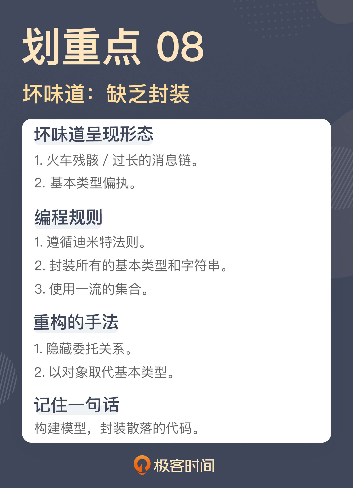

# 08 | 缺乏封装：如何应对火车代码和基本类型偏执问题？
你好，我是郑晔。

上一讲，我们讲的是控制语句体现出的坏味道，它们不是一种坏味道，而是一类坏味道。这一讲，我们再来讲一类代码的坏味道：缺乏封装。

在程序设计中，一个重要的观念就是封装，将零散的代码封装成一个又一个可复用的模块。任何一个程序员都会认同封装的价值，但是，具体到写代码时，每个人对于封装的理解程度却天差地别，造成的结果就是：写代码的人认为自己提供了封装，但实际上，我们还是看到许多的代码散落在那里。

这一讲，我们就来看看，那些被封装遗忘的角落。

## 火车残骸

我们先从一段你可能很熟悉的代码开始：

```
String name = book.getAuthor().getName();

```

这段代码表达的是“获得一部作品作者的名字”。作品里有作者信息，想要获得作者的名字，通过“作者”找到“作者姓名”，这就是很多人凭借直觉写出的代码，不过它是有问题的。

如果你没看出这段代码的问题，说明你可能对封装缺乏理解。

你可以想一想，如果你想写出上面这段代码，是不是必须得先了解Book和Author这两个类的实现细节？也就是说，我们必须得知道，作者的姓名是存储在作品的作者字段里的。这时你就要注意了：当你必须得先了解一个类的细节，才能写出代码时，这只能说明一件事，这个封装是失败的。

这段代码只是用来说明这种类型坏味道是什么样的，在实际工作中，这种在一行代码中有连续多个函数调用的情况屡见不鲜，数量上总会不断突破你的认知。

Martin Fowler 在《 [重构](https://book.douban.com/subject/33400354/)》中给这种坏味道起的名字叫 **过长的消息链（Message Chains）**，而有人则给它起了一个更为夸张的名字： [火车残骸（Train Wreck）](https://wiki.c2.com/)，形容这样的代码像火车残骸一般，断得一节一节的。

解决这种代码的重构手法叫 **隐藏委托关系（Hide Delegate）**，说得更直白一些就是，把这种调用封装起来：

```
class Book {
  ...
  public String getAuthorName() {
    return this.author.getName();
  }
  ...
}

String name = book.getAuthorName();

```

前面我说过，火车残骸这种坏味道的产生是缺乏对于封装的理解，因为封装这件事并不是很多程序员编码习惯的一部分，他们对封装的理解停留在数据结构加算法的层面上。

在学习数据结构时，我们所编写的代码都是拿到各种细节直接操作，但那是在做编程练习，并不是工程上的编码方式。遗憾的是，很多人把这种编码习惯带到了工作中。

比如说，有人编写一个新的类，第一步是写出这个类要用到的字段，然后，就是给这些字段生成相应的 getter，也就是各种 getXXX。很多语言或框架提供的约定就是基于这种 getter的，就像 Java 里的 JavaBean，所以相应的配套工具也很方便。现在写出一个 getter 往往是 IDE 中一个快捷键的操作，甚至不需要自己手工敲代码。

诸如此类种种因素叠加，让暴露细节这种事越来越容易，封装反而成了稀缺品。

**要想摆脱初级程序员的水平，就要先从少暴露细节开始。** 声明完一个类的字段之后，请停下生成 getter 的手，转而让大脑开始工作，思考这个类应该提供的行为。

在软件行业中，有一个编程的指导原则几乎就是针对这个坏味道的，叫做 [迪米特法则（Law of Demeter）](https://en.wikipedia.org/wiki/Law_of_Demeter)，这个原则是这样说的：

- 每个单元对其它单元只拥有有限的知识，而且这些单元是与当前单元有紧密联系的；
- 每个单元只能与其朋友交谈，不与陌生人交谈；
- 只与自己最直接的朋友交谈。

这个原则需要我们思考，哪些算是直接的朋友，哪些算是陌生人。火车残骸般的代码显然就是没有考虑这些问题而直接写出来的代码。

或许你会说，按照迪米特法则这样写代码，会不会让代码里有太多简单封装的函数？

确实有可能，不过，这也是单独解决这一个坏味道可能带来的结果。正如我前面所说，这种代码的出现，根本的问题是缺乏对封装的理解，而一个好的封装是需要基于行为的，所以，如果把视角再提升一个角度，我们应该考虑的问题是类应该提供哪些行为，而非简简单单地把数据换一种形式呈现出来。

最后，还有一个问题我要提醒你一下。有些内部 DSL 的表现形式也是连续的函数调用，但 DSL 是声明性的，是在说做什么（What），而这里的坏味道是在说怎么做（How），二者的抽象级别是不同的，不要混在一起。

## 基本类型偏执

我们再来看一段代码：

```
public double getEpubPrice(final boolean highQuality, final int chapterSequence) {
  ...
}

```

这是我们上一讲用过的一个函数声明，根据章节信息获取 EPUB（一种电子书的格式） 的价格。也许你会问，这是一个看上去非常清晰的代码，难道这里也有坏味道吗？

没错，有。问题就出在返回值的类型上，也就是价格的类型上。

那么，我们在数据库中存储价格的时候，就是用一个浮点数，这里用 double 可以保证计算的精度，这样的设计有什么问题吗？

确实，这就是很多人使用基本类型（Primitive）作为变量类型思考的角度。但实际上， **这种采用基本类型的设计缺少了一个模型**。

虽然价格本身是用浮点数在存储，但价格和浮点数本身并不是同一个概念，有着不同的行为需求。比如，一般情况下，我们要求商品价格是大于 0 的，但 double 类型本身是没有这种限制的。

就以“价格大于0”这个需求为例，如果使用 double 类型你会怎么限制呢？我们通常会这样写：

```
if (price <= 0) {
  throw new IllegalArgumentException("Price should be positive");
}

```

问题是，如果使用 double 作为类型，那我们要在使用的地方都保证价格的正确性，像这样的价格校验就应该是使用的地方到处写的。

如果补齐这里缺失的模型，我们可以引入一个 Price 类型，这样的校验就可以放在初始化时进行：

```
class Price {
  private long price;

  public Price(final double price) {
    if (price <= 0) {
      throw new IllegalArgumentException("Price should be positive");
    }

    this.price = price;
  }
}

```

这种引入一个模型封装基本类型的重构手法，叫做 **以对象取代基本类型（Replace Primitive with Object）**。一旦有了这个模型，我们还可以再进一步，比如，如果我们想要让价格在对外呈现时只有两位，在没有 Price 类的时候，这样的逻辑就会散落代码的各处，事实上，代码里很多重复的逻辑就是这样产生的。而现在我们可以在 Price 类里提供一个函数：

```
public double getDisplayPrice() {
  BigDecimal decimal = new BigDecimal(this.price)；
  return decimal.setScale(2, BigDecimal.ROUND_HALF_UP).doubleValue();
}

```

其实，使用基本类型和使用继承出现的问题是异曲同工的。大部分程序员都学过这样一个设计原则：组合优于继承，也就是说，我们不要写出这样的代码：

```
public Books extends List<Book> {
  ...
}

```

而应该写成组合的样子，也就是：

```
public Books  {
  private List<Book> books;
  ...
}

```

之所以有人把Books写成了继承，因为在代码作者眼中，Books 就是一个书的集合；而有人用 double 做价格的类型，因为在他看来，价格就是一个 double。这里的误区就在于， **一些程序员只看到了模型的相同之处，却忽略了差异的地方**。Books 可能不需要提供 List 的所有函数，价格的取值范围与 double 也有所差异。

但是，Books 的问题相对来说容易规避，因为产生了一个新的模型，有通用的设计原则帮助我们判断这个模型构建得是否恰当，而价格的问题却不容易规避，因为这里没有产生新的模型，也就不容易发现这里潜藏着问题。

这种以基本类型为模型的坏味道称为 **基本类型偏执**（Primitive Obsession）。这里说的基本类型，不限于程序设计语言提供的各种基本类型，像字符串也是一个产生这种坏味道的地方。

这里我稍微延伸一下，有很多人对于集合类型（比如数组、List、Map 等等）的使用也属于这种坏味道。之前课程里我提到过“对象健身操（出自《 [ThoughtWorks文集](https://www.infoq.cn/minibook/thoughtworks-anthology)》）”这篇文章，里面有两个与此相关的条款，你可以作为参考：

- 封装所有的基本类型和字符串；
- 使用一流的集合。

这一讲我们讲到的坏味道都是关于封装的。不过，正如我在开头所说，封装是一个人人都懂的道理，但具体到代码上，就千差万别了。

**封装之所以有难度，主要在于它是一个构建模型的过程**，而很多程序员写程序，只是用着极其粗粒度的理解写着完成功能的代码，根本没有构建模型的意识；还有一些人以为划分了模块就叫封装，所以，我们才会看到这些坏味道的滋生。

这里我给出的坏味道，其实也是在挑战一些人对于编程的认知：那些习以为常的代码居然成了坏味道。而这只是一个信号，一个起点，告诉你这段代码存在问题，但真正要写好代码，还是需要你对软件设计有着深入的学习。

## 总结时刻

这一讲，我们讨论的是与封装有关的坏味道：

- 过长的消息链，或者叫火车残骸；
- 基本类型偏执。

火车残骸的代码就是连续的函数调用，它反映的问题就是把实现细节暴露了出去，缺乏应有的封装。重构的手法是隐藏委托关系，实际就是做封装。软件行业有一个编程指导原则，叫迪米特法则，可以作为日常工作的指导，规避这种坏味道的出现。

基本类型偏执就是用各种基本类型作为模型到处传递，这种情况下通常是缺少了一个模型。解决它，常用的重构手法是以对象取代基本类型，也就是提供一个模型代替原来的基本类型。基本类型偏执不局限于程序设计语言提供的基本类型，字符串也是这种坏味道产生的重要原因，再延伸一点，集合类型也是。

这两种与封装有关的坏味道，背后体现的是对构建模型了解不足，其实，也是很多程序员在软件设计上的欠缺。想成为一个更好的程序员，学习软件设计是不可或缺的。

如果今天的内容你只能记住一件事，那请记住： **构建模型，封装散落的代码**。



## 思考题

这一讲提到的坏味道可以说是在代码里随处可见，也挑战了很多人的编程习惯。我想请你结合实际的工作，谈谈你对这一讲内容的理解，欢迎在留言区分享你的看法。

参考资料：

[面向对象之封装：怎样的封装才算是高内聚？](https://time.geekbang.org/column/article/252598)

[DSL：你也可以设计一门自己的语言](https://time.geekbang.org/column/article/248638)